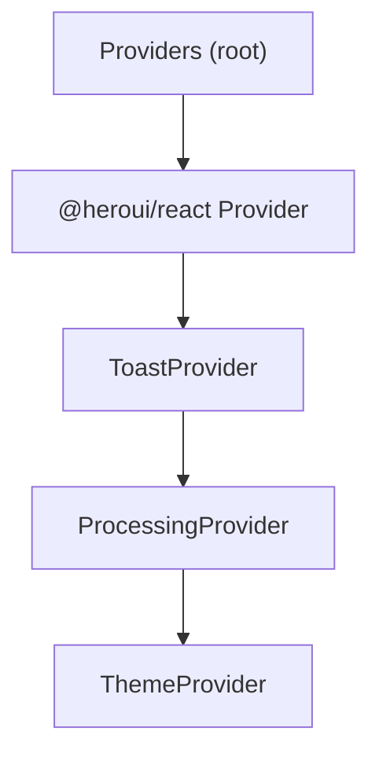
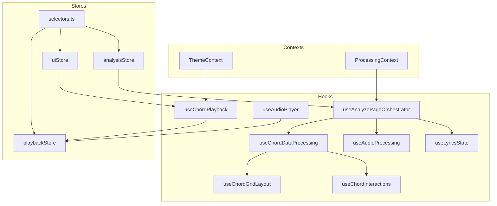
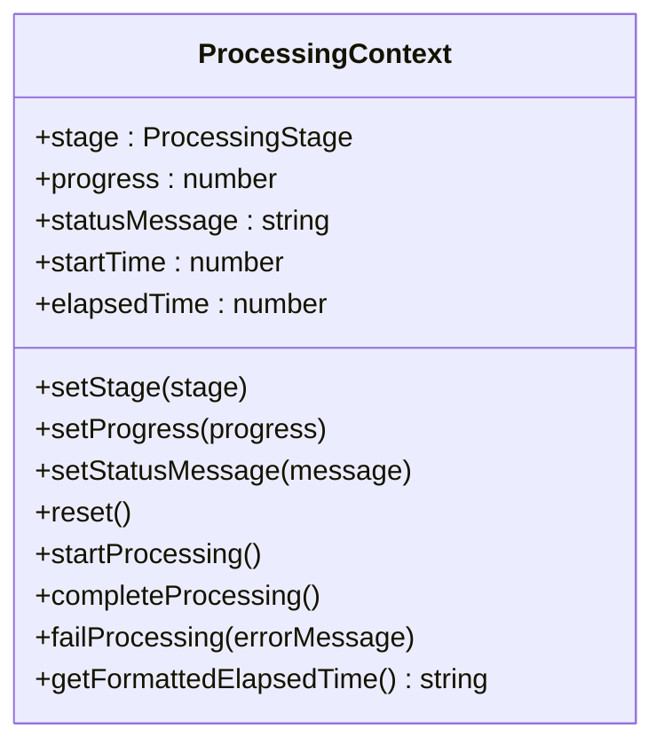
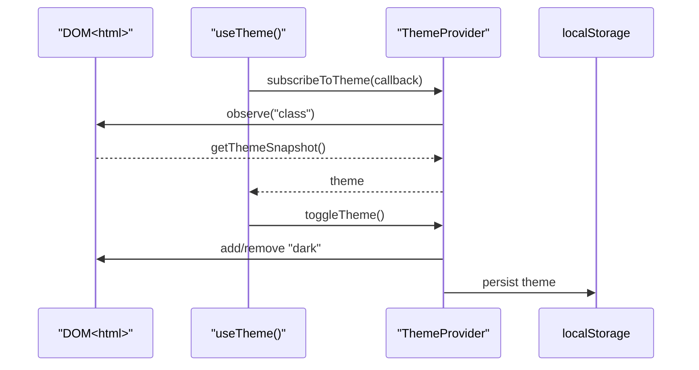
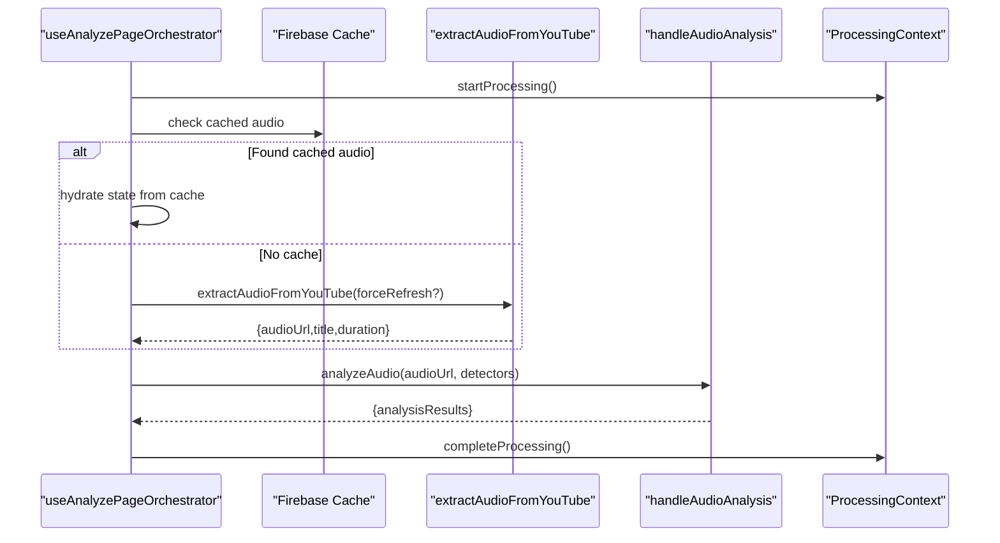
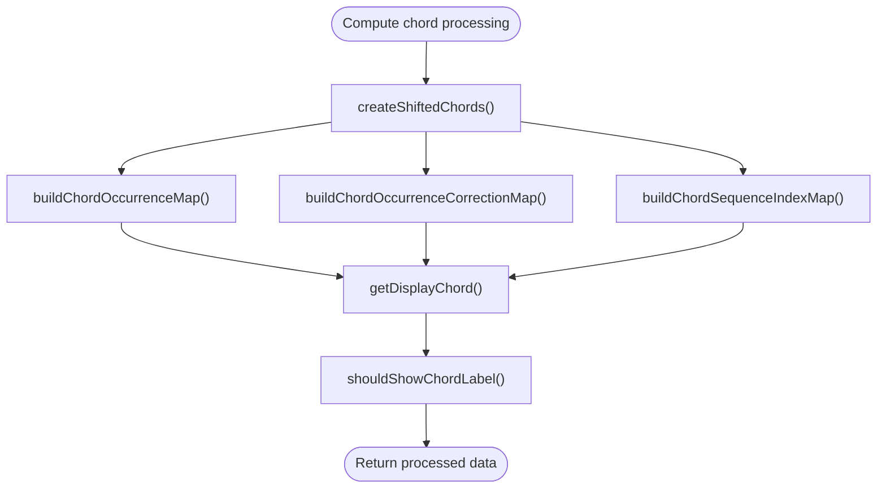
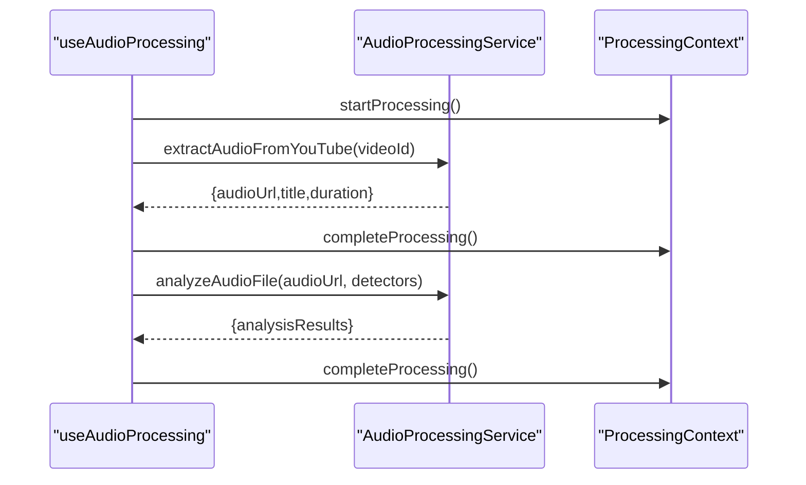
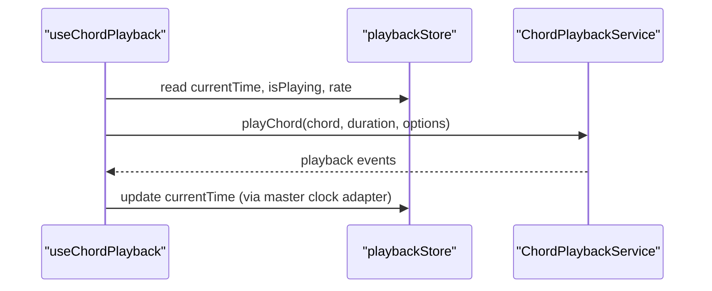
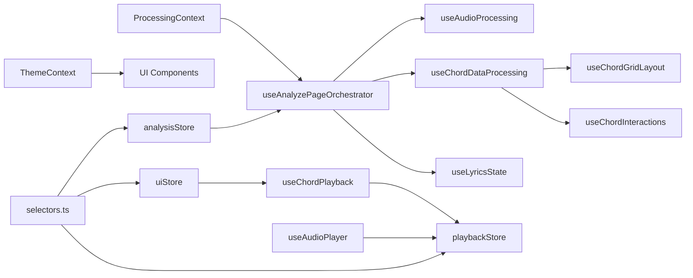

# Context Providers and React Hooks

<cite>
**Referenced Files in This Document**
- [ProcessingContext.tsx](file://src/contexts/ProcessingContext.tsx)
- [ThemeContext.tsx](file://src/contexts/ThemeContext.tsx)
- [providers.tsx](file://src/app/providers.tsx)
- [useAnalyzePageOrchestrator.ts](file://src/hooks/analyze/useAnalyzePageOrchestrator.ts)
- [useChordDataProcessing.ts](file://src/hooks/chord-analysis/useChordDataProcessing.ts)
- [useAudioProcessing.ts](file://src/hooks/audio/useAudioProcessing.ts)
- [useLyricsState.ts](file://src/hooks/lyrics/useLyricsState.ts)
- [selectors.ts](file://src/contexts/selectors.ts)
- [analysisStore.ts](file://src/stores/analysisStore.ts)
- [playbackStore.ts](file://src/stores/playbackStore.ts)
- [uiStore.ts](file://src/stores/uiStore.ts)
- [useChordGridLayout.ts](file://src/hooks/chord-analysis/useChordGridLayout.ts)
- [useChordInteractions.ts](file://src/hooks/chord-analysis/useChordInteractions.ts)
- [useChordPlayback.ts](file://src/hooks/chord-playback/useChordPlayback.ts)
- [useAudioPlayer.ts](file://src/hooks/chord-playback/useAudioPlayer.ts)
</cite>

## Table of Contents
1. [Introduction](#introduction)
2. [Project Structure](#project-structure)
3. [Core Components](#core-components)
4. [Architecture Overview](#architecture-overview)
5. [Detailed Component Analysis](#detailed-component-analysis)
6. [Dependency Analysis](#dependency-analysis)
7. [Performance Considerations](#performance-considerations)
8. [Troubleshooting Guide](#troubleshooting-guide)
9. [Conclusion](#conclusion)

## Introduction
This document explains the context providers and React hooks architecture used to orchestrate audio analysis, chord processing, lyrics management, and playback. It focuses on:
- ProcessingContext for managing analysis workflows
- ThemeContext for UI theming
- Specialized hooks for orchestrating analysis, processing chord data, handling audio lifecycle, and managing lyrics state
- Hook composition patterns, dependency injection, and state synchronization between hooks and stores
- Practical usage examples, integration with the service layer, and performance optimization strategies

## Project Structure
The application initializes providers at the root level, wrapping the UI tree with context providers and UI libraries. The providers order ensures that child components can consume both processing and theming contexts.

**Diagram sources**
- [providers.tsx:12-26](file://src/app/providers.tsx#L12-L26)

**Section sources**
- [providers.tsx:12-26](file://src/app/providers.tsx#L12-L26)

## Core Components
- ProcessingContext: Centralizes analysis stage, progress, status messages, and timing for user feedback and orchestration.
- ThemeContext: Manages light/dark theme with hydration-safe synchronization and persistence.
- Hook Orchestration: useAnalyzePageOrchestrator coordinates audio extraction, analysis, caching, and enrichment.
- Data Processing: useChordDataProcessing transforms raw chord sequences with corrections and display logic.
- Audio Lifecycle: useAudioProcessing encapsulates extraction, analysis, and metadata loading.
- Lyrics State: useLyricsState consolidates transcription, visibility, and error handling.
- Store Selectors: selectors.ts exposes optimized Zustand store slices for consumption by hooks/components.

**Section sources**
- [ProcessingContext.tsx:14-38](file://src/contexts/ProcessingContext.tsx#L14-L38)
- [ThemeContext.tsx:7-20](file://src/contexts/ThemeContext.tsx#L7-L20)
- [useAnalyzePageOrchestrator.ts:243-278](file://src/hooks/analyze/useAnalyzePageOrchestrator.ts#L243-L278)
- [useChordDataProcessing.ts:13-87](file://src/hooks/chord-analysis/useChordDataProcessing.ts#L13-L87)
- [useAudioProcessing.ts:16-125](file://src/hooks/audio/useAudioProcessing.ts#L16-L125)
- [useLyricsState.ts:8-90](file://src/hooks/lyrics/useLyricsState.ts#L8-L90)
- [selectors.ts:21-64](file://src/contexts/selectors.ts#L21-L64)

## Architecture Overview
The architecture blends React Contexts, custom hooks, and Zustand stores. Contexts provide runtime state for processing and theming. Hooks encapsulate orchestration and data transformations. Stores centralize UI and analysis state for predictable updates and selective re-renders.

**Diagram sources**
- [ProcessingContext.tsx:44-184](file://src/contexts/ProcessingContext.tsx#L44-L184)
- [ThemeContext.tsx:44-70](file://src/contexts/ThemeContext.tsx#L44-L70)
- [useAnalyzePageOrchestrator.ts:243-616](file://src/hooks/analyze/useAnalyzePageOrchestrator.ts#L243-L616)
- [useChordDataProcessing.ts:25-87](file://src/hooks/chord-analysis/useChordDataProcessing.ts#L25-L87)
- [useAudioProcessing.ts:16-125](file://src/hooks/audio/useAudioProcessing.ts#L16-L125)
- [useLyricsState.ts:8-90](file://src/hooks/lyrics/useLyricsState.ts#L8-L90)
- [useChordGridLayout.ts:8-123](file://src/hooks/chord-analysis/useChordGridLayout.ts#L8-L123)
- [useChordInteractions.ts:21-63](file://src/hooks/chord-analysis/useChordInteractions.ts#L21-L63)
- [useChordPlayback.ts:250-738](file://src/hooks/chord-playback/useChordPlayback.ts#L250-L738)
- [useAudioPlayer.ts:11-93](file://src/hooks/chord-playback/useAudioPlayer.ts#L11-L93)
- [analysisStore.ts:101-295](file://src/stores/analysisStore.ts#L101-L295)
- [playbackStore.ts:101-451](file://src/stores/playbackStore.ts#L101-L451)
- [uiStore.ts:127-433](file://src/stores/uiStore.ts#L127-L433)
- [selectors.ts:21-64](file://src/contexts/selectors.ts#L21-L64)

## Detailed Component Analysis

### ProcessingContext: Analysis Workflow Manager
ProcessingContext manages the lifecycle of an analysis job with stage tracking, progress, status messages, and a timer. It exposes methods to start, complete, and fail processing, and provides formatted elapsed time for UX.

Key capabilities:
- Stage transitions: idle, downloading, extracting, beat-detection, chord-recognition, complete, error
- Timer management with controlled start/stop to avoid leaks
- Formatted elapsed time display
- Dependency injection via method calls for orchestration hooks

**Diagram sources**
- [ProcessingContext.tsx:14-28](file://src/contexts/ProcessingContext.tsx#L14-L28)
- [ProcessingContext.tsx:44-184](file://src/contexts/ProcessingContext.tsx#L44-L184)

**Section sources**
- [ProcessingContext.tsx:44-184](file://src/contexts/ProcessingContext.tsx#L44-L184)

### ThemeContext: Hydration-Safe Theming
ThemeContext synchronizes theme state with the DOM and persists user preference. It uses useSyncExternalStore to avoid hydration mismatches and exposes a toggle function.

Key capabilities:
- Reads theme from DOM class set by a blocking script
- Server snapshot returns a default theme
- Toggle updates DOM class and localStorage
- Reveals body once hydrated

**Diagram sources**
- [ThemeContext.tsx:26-63](file://src/contexts/ThemeContext.tsx#L26-L63)

**Section sources**
- [ThemeContext.tsx:44-70](file://src/contexts/ThemeContext.tsx#L44-L70)

### useAnalyzePageOrchestrator: Analysis Orchestration
This hook coordinates audio extraction, analysis, caching, and enrichment. It maintains internal state for cache checks, key signature detection, chord corrections, and Roman numeral data. It injects dependencies into service calls and manages snapshots for transcription data.

Highlights:
- Dependency injection pattern: constructs a dependency object with callbacks and state setters
- Cache-first strategy: checks Firebase for cached audio and analysis results
- Correction and enrichment: merges sequence corrections and Roman numeral data
- Effect-driven lifecycle: guards against stale requests and cleans up on unmount

**Diagram sources**
- [useAnalyzePageOrchestrator.ts:448-539](file://src/hooks/analyze/useAnalyzePageOrchestrator.ts#L448-L539)
- [useAnalyzePageOrchestrator.ts:541-616](file://src/hooks/analyze/useAnalyzePageOrchestrator.ts#L541-L616)
- [ProcessingContext.tsx:111-134](file://src/contexts/ProcessingContext.tsx#L111-L134)

**Section sources**
- [useAnalyzePageOrchestrator.ts:243-616](file://src/hooks/analyze/useAnalyzePageOrchestrator.ts#L243-L616)

### useChordDataProcessing: Chord Data Transformation
This hook computes shifted chords, occurrence maps, and correction maps. It exposes display and labeling helpers for chord grids.

Highlights:
- Memoized computations for performance
- Correction-aware display logic
- Index mapping for audio alignment

**Diagram sources**
- [useChordDataProcessing.ts:35-78](file://src/hooks/chord-analysis/useChordDataProcessing.ts#L35-L78)

**Section sources**
- [useChordDataProcessing.ts:25-87](file://src/hooks/chord-analysis/useChordDataProcessing.ts#L25-L87)

### useAudioProcessing: Audio Lifecycle Management
Encapsulates extraction, analysis, and metadata loading with robust error handling and state updates.

Highlights:
- Encapsulated service instance usage
- Robust error handling with suggestions
- State transitions for download and analysis phases

**Diagram sources**
- [useAudioProcessing.ts:31-95](file://src/hooks/audio/useAudioProcessing.ts#L31-L95)
- [ProcessingContext.tsx:111-134](file://src/contexts/ProcessingContext.tsx#L111-L134)

**Section sources**
- [useAudioProcessing.ts:16-125](file://src/hooks/audio/useAudioProcessing.ts#L16-L125)

### useLyricsState: Lyrics Management
Consolidates lyrics transcription lifecycle, visibility, and error handling.

Highlights:
- State for lyrics, visibility, and transcription status
- Operations to start, complete, and fail transcription
- Reset and toggle utilities

**Section sources**
- [useLyricsState.ts:8-90](file://src/hooks/lyrics/useLyricsState.ts#L8-L90)

### Hook Composition Patterns and Dependency Injection
- Dependency Injection: useAnalyzePageOrchestrator builds a dependency object containing callbacks and state setters, passing it to service functions. This isolates orchestration logic and improves testability.
- Composition: Hooks compose smaller hooks (e.g., useChordDataProcessing) to produce cohesive UI-ready data.
- Store Integration: selectors.ts provides optimized store slices, enabling fine-grained re-renders without coupling to full store internals.

**Section sources**
- [useAnalyzePageOrchestrator.ts:468-510](file://src/hooks/analyze/useAnalyzePageOrchestrator.ts#L468-L510)
- [useChordDataProcessing.ts:35-78](file://src/hooks/chord-analysis/useChordDataProcessing.ts#L35-L78)
- [selectors.ts:21-64](file://src/contexts/selectors.ts#L21-L64)

### State Synchronization Between Hooks and Stores
- Stores: analysisStore, playbackStore, uiStore centralize state and expose selector hooks for consumption.
- Selectors: selectors.ts wraps store slices to minimize coupling and improve performance.
- Playback: useChordPlayback integrates with playbackStore for time, rate, and beat indices.

**Diagram sources**
- [useChordPlayback.ts:250-738](file://src/hooks/chord-playback/useChordPlayback.ts#L250-L738)
- [playbackStore.ts:487-490](file://src/stores/playbackStore.ts#L487-L490)

**Section sources**
- [analysisStore.ts:101-295](file://src/stores/analysisStore.ts#L101-L295)
- [playbackStore.ts:101-451](file://src/stores/playbackStore.ts#L101-L451)
- [uiStore.ts:127-433](file://src/stores/uiStore.ts#L127-L433)
- [selectors.ts:21-64](file://src/contexts/selectors.ts#L21-L64)

## Dependency Analysis
The system exhibits clear separation of concerns:
- Contexts: ProcessingContext and ThemeContext provide runtime state
- Hooks: Encapsulate orchestration and transformations
- Stores: Provide centralized state with selector hooks for performance
- Services: Handle external integrations (audio extraction, analysis, lyrics)

**Diagram sources**
- [ProcessingContext.tsx:44-184](file://src/contexts/ProcessingContext.tsx#L44-L184)
- [ThemeContext.tsx:44-70](file://src/contexts/ThemeContext.tsx#L44-L70)
- [useAnalyzePageOrchestrator.ts:243-616](file://src/hooks/analyze/useAnalyzePageOrchestrator.ts#L243-L616)
- [useChordDataProcessing.ts:25-87](file://src/hooks/chord-analysis/useChordDataProcessing.ts#L25-L87)
- [useAudioProcessing.ts:16-125](file://src/hooks/audio/useAudioProcessing.ts#L16-L125)
- [useLyricsState.ts:8-90](file://src/hooks/lyrics/useLyricsState.ts#L8-L90)
- [useChordGridLayout.ts:8-123](file://src/hooks/chord-analysis/useChordGridLayout.ts#L8-L123)
- [useChordInteractions.ts:21-63](file://src/hooks/chord-analysis/useChordInteractions.ts#L21-L63)
- [useChordPlayback.ts:250-738](file://src/hooks/chord-playback/useChordPlayback.ts#L250-L738)
- [useAudioPlayer.ts:11-93](file://src/hooks/chord-playback/useAudioPlayer.ts#L11-L93)
- [analysisStore.ts:101-295](file://src/stores/analysisStore.ts#L101-L295)
- [playbackStore.ts:101-451](file://src/stores/playbackStore.ts#L101-L451)
- [uiStore.ts:127-433](file://src/stores/uiStore.ts#L127-L433)
- [selectors.ts:21-64](file://src/contexts/selectors.ts#L21-L64)

**Section sources**
- [useAnalyzePageOrchestrator.ts:243-616](file://src/hooks/analyze/useAnalyzePageOrchestrator.ts#L243-L616)
- [useChordDataProcessing.ts:25-87](file://src/hooks/chord-analysis/useChordDataProcessing.ts#L25-L87)
- [useChordPlayback.ts:250-738](file://src/hooks/chord-playback/useChordPlayback.ts#L250-L738)
- [selectors.ts:21-64](file://src/contexts/selectors.ts#L21-L64)

## Performance Considerations
- Memoization: useChordDataProcessing leverages useMemo to avoid recomputation of derived data.
- Selective re-renders: selectors.ts and store selector hooks return only necessary slices, minimizing re-renders.
- Controlled timers: ProcessingContext uses interval cleanup and freezing to avoid unnecessary updates.
- Background playback: useChordPlayback switches to a background poller when the tab is hidden, reducing overhead while maintaining synchronization.
- Idempotent store updates: Zustand actions are structured to avoid redundant state changes.

[No sources needed since this section provides general guidance]

## Troubleshooting Guide
- Processing errors: ProcessingContext.failProcessing sets stage to error and updates status message. Ensure orchestration hooks call this on failure paths.
- Cache inconsistencies: useAnalyzePageOrchestrator validates cache availability and falls back to extraction when needed.
- Stale requests: useAnalyzePageOrchestrator tracks request IDs and checks isRequestStillCurrent to prevent stale UI updates.
- Playback desync: useChordPlayback includes recovery mechanisms and a background poller to maintain synchronization when the tab is hidden.

**Section sources**
- [ProcessingContext.tsx:130-134](file://src/contexts/ProcessingContext.tsx#L130-L134)
- [useAnalyzePageOrchestrator.ts:448-539](file://src/hooks/analyze/useAnalyzePageOrchestrator.ts#L448-L539)
- [useChordPlayback.ts:376-551](file://src/hooks/chord-playback/useChordPlayback.ts#L376-L551)

## Conclusion
The architecture combines React Contexts, custom hooks, and Zustand stores to deliver a robust, performant, and maintainable analysis and playback experience. ProcessingContext and ThemeContext provide foundational state, while specialized hooks encapsulate orchestration and transformations. Selectors and stores enable efficient state management and selective re-renders. The dependency injection pattern in useAnalyzePageOrchestrator and memoization strategies across hooks ensure scalability and reliability.