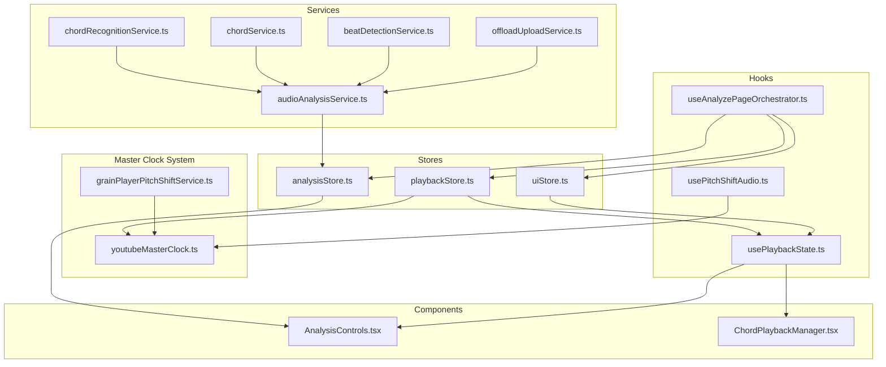
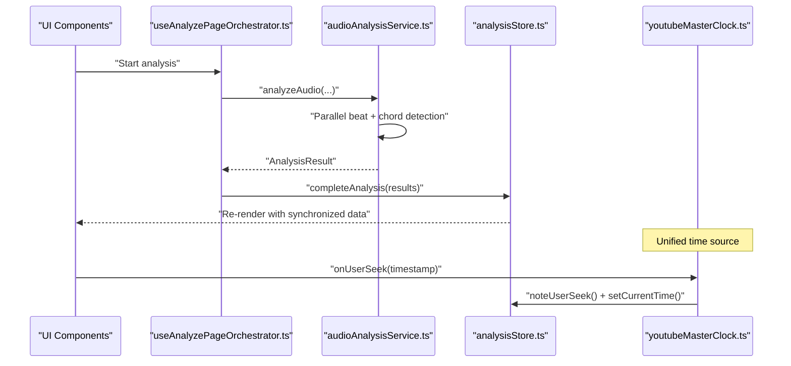
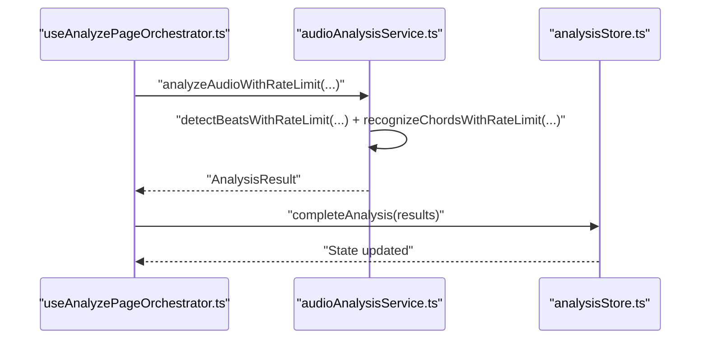
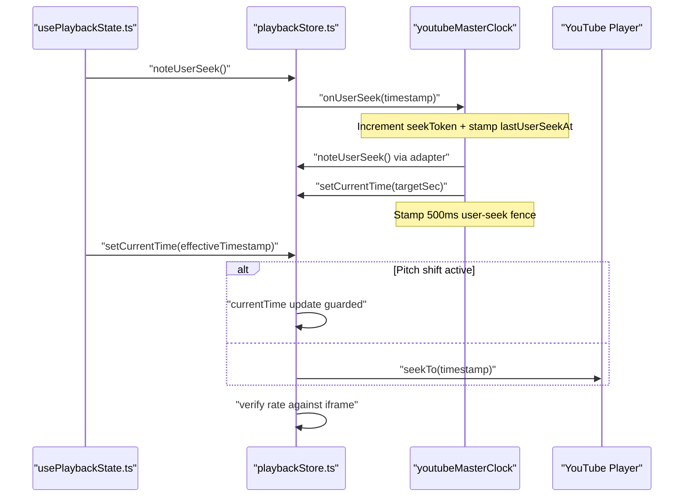
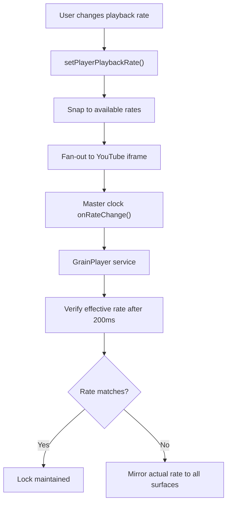
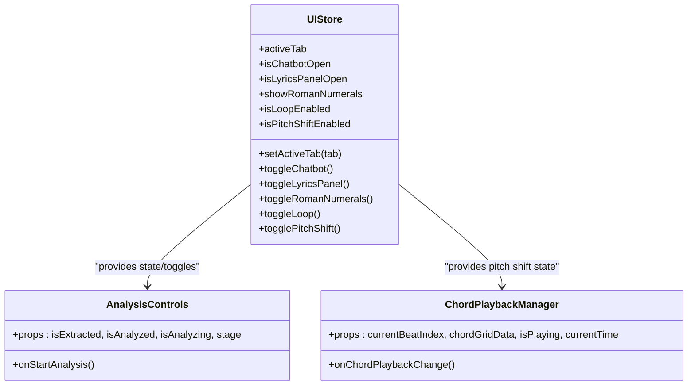
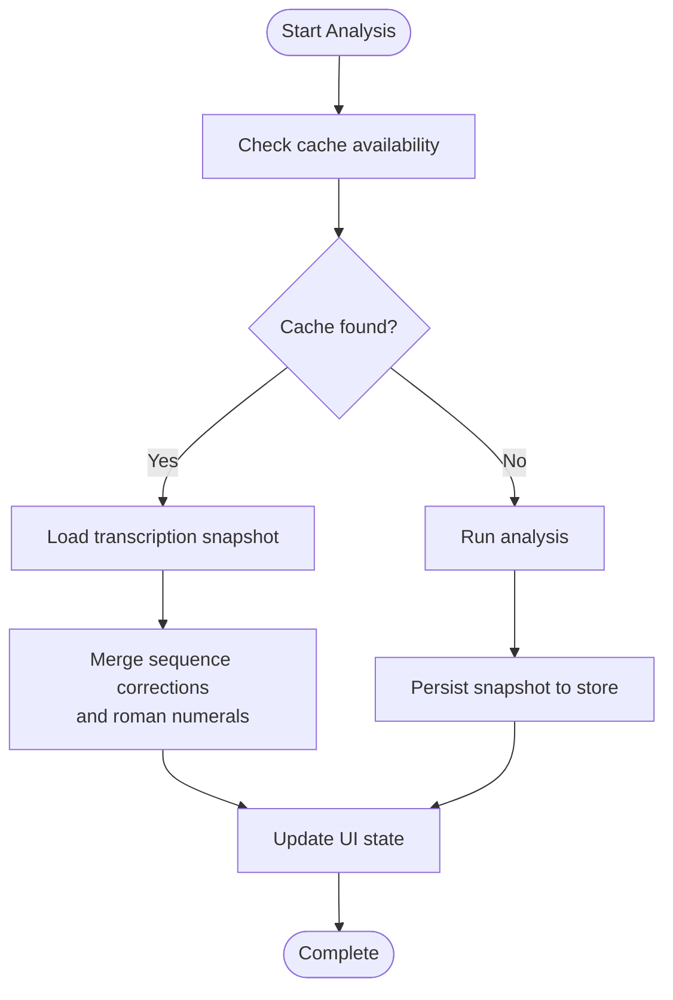
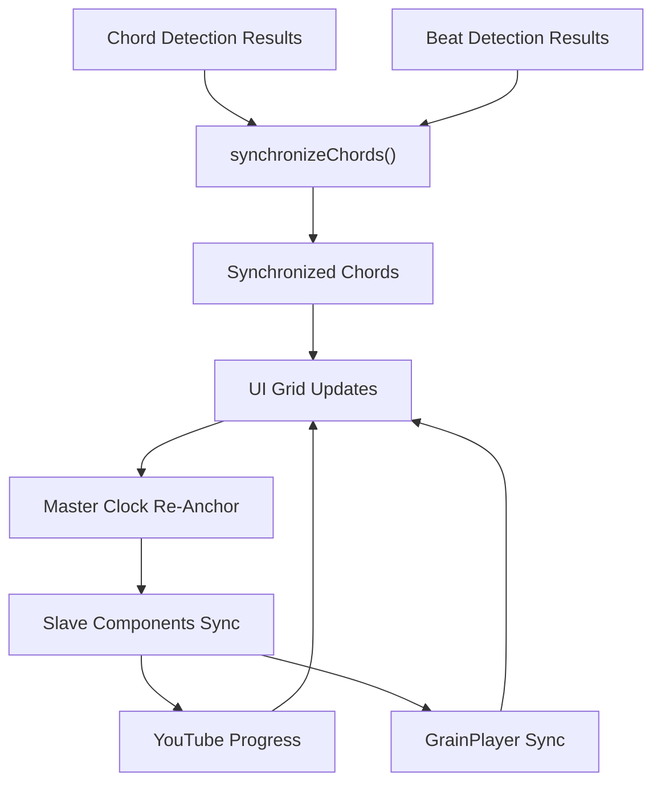
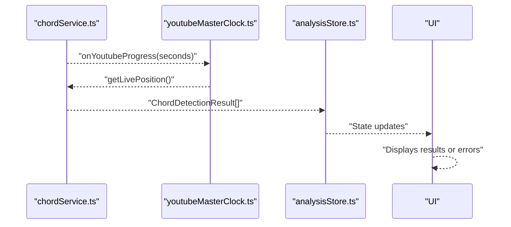
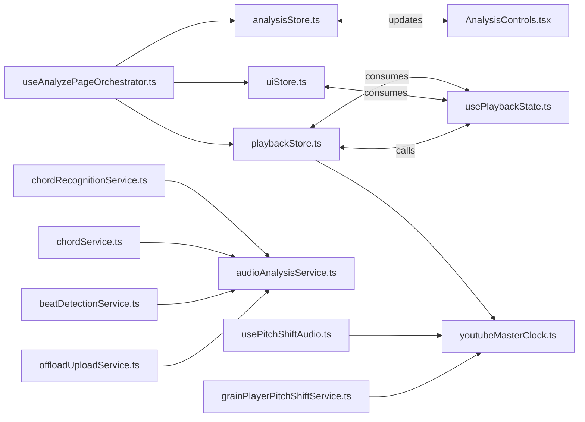

# Data Flow and State Synchronization

<cite>
**Referenced Files in This Document**
- [analysisStore.ts](file://src/stores/analysisStore.ts)
- [playbackStore.ts](file://src/stores/playbackStore.ts)
- [uiStore.ts](file://src/stores/uiStore.ts)
- [audioAnalysisService.ts](file://src/services/audio/audioAnalysisService.ts)
- [chordRecognitionService.ts](file://src/services/chord-analysis/chordRecognitionService.ts)
- [chordService.ts](file://src/services/chord-analysis/chordService.ts)
- [beatDetectionService.ts](file://src/services/audio/beatDetectionService.ts)
- [offloadUploadService.ts](file://src/services/storage/offloadUploadService.ts)
- [chordSynchronization.ts](file://src/utils/chordSynchronization.ts)
- [usePlaybackState.ts](file://src/hooks/chord-playback/usePlaybackState.ts)
- [useAnalyzePageOrchestrator.ts](file://src/hooks/analyze/useAnalyzePageOrchestrator.ts)
- [AnalysisControls.tsx](file://src/components/analysis/AnalysisControls.tsx)
- [ChordPlaybackManager.tsx](file://src/components/chord-playback/ChordPlaybackManager.tsx)
- [youtubeMasterClock.ts](file://src/services/audio/youtubeMasterClock.ts)
- [grainPlayerPitchShiftService.ts](file://src/services/audio/grainPlayerPitchShiftService.ts)
- [usePitchShiftAudio.ts](file://src/hooks/chord-playback/usePitchShiftAudio.ts)
- [audioAnalysis.ts](file://src/types/audioAnalysis.ts)
</cite>

## Update Summary
**Changes Made**
- Updated master clock architecture documentation to reflect the new unified time synchronization approach
- Added comprehensive documentation for the YouTube master clock integration and seek token coordination
- Documented the new rate verification and fan-out mechanisms
- Updated playback store synchronization patterns to reflect master clock integration
- Enhanced documentation for the three-way synchronization between YouTube, GrainPlayer, and beat grid

## Table of Contents
1. [Introduction](#introduction)
2. [Project Structure](#project-structure)
3. [Core Components](#core-components)
4. [Architecture Overview](#architecture-overview)
5. [Detailed Component Analysis](#detailed-component-analysis)
6. [Dependency Analysis](#dependency-analysis)
7. [Performance Considerations](#performance-considerations)
8. [Troubleshooting Guide](#troubleshooting-guide)
9. [Conclusion](#conclusion)

## Introduction
This document explains the unidirectional data flow from services to stores to components, detailing state synchronization mechanisms, persistence strategies, cross-component communication, and real-time updates. The system has been updated to implement a unified master clock architecture that replaces the previous three-independent-time-source approach with a single YouTube master clock that coordinates seek tokens and user-seek fences. It focuses on how audio analysis results, playback controls, and UI state integrate asynchronously, propagate errors, and remain synchronized across analysis results, playback controls, and UI components. Performance considerations for large datasets and frequent state updates are addressed with concrete strategies implemented in the codebase.

## Project Structure
The system follows a layered architecture with unified time synchronization:
- Services: Orchestrate analysis, detection, and offloading operations.
- Stores: Centralized state managed with Zustand for analysis, playback, and UI.
- Hooks: React hooks bridge stores and components, exposing selectors and actions.
- Components: UI elements that subscribe to store state and trigger actions.
- Master Clock: Unified time source coordinating all playback surfaces.

**Diagram sources**
- [youtubeMasterClock.ts:145-408](file://src/services/audio/youtubeMasterClock.ts#L145-L408)
- [grainPlayerPitchShiftService.ts:117-200](file://src/services/audio/grainPlayerPitchShiftService.ts#L117-L200)
- [playbackStore.ts:475-490](file://src/stores/playbackStore.ts#L475-L490)
- [usePitchShiftAudio.ts:606-666](file://src/hooks/chord-playback/usePitchShiftAudio.ts#L606-L666)

**Section sources**
- [analysisStore.ts:1-367](file://src/stores/analysisStore.ts#L1-L367)
- [playbackStore.ts:1-513](file://src/stores/playbackStore.ts#L1-L513)
- [uiStore.ts:1-517](file://src/stores/uiStore.ts#L1-L517)
- [audioAnalysisService.ts:1-704](file://src/services/audio/audioAnalysisService.ts#L1-L704)
- [usePlaybackState.ts:1-393](file://src/hooks/chord-playback/usePlaybackState.ts#L1-L393)
- [useAnalyzePageOrchestrator.ts:1-1063](file://src/hooks/analyze/useAnalyzePageOrchestrator.ts#L1-L1063)
- [AnalysisControls.tsx:1-218](file://src/components/analysis/AnalysisControls.tsx#L1-L218)
- [ChordPlaybackManager.tsx:1-123](file://src/components/chord-playback/ChordPlaybackManager.tsx#L1-L123)
- [youtubeMasterClock.ts:1-409](file://src/services/audio/youtubeMasterClock.ts#L1-L409)

## Core Components
- Analysis store: Holds analysis results, models, cache state, lyrics, key signature, corrections, and SheetSage data. Provides actions to update state and selector hooks for efficient re-renders.
- Playback store: Manages audio/video playback state, current time, rate, beat indices, and seek coordination. Includes master clock integration and rate verification logic with unified seek token management.
- UI store: Controls tabs, panels, editing modes, toggles (roman numerals, segmentation, simplification), loop playback, pitch shift, and guitar voicing.
- Master Clock System: YouTube master clock provides unified time synchronization with seek token coordination, user-seek fence protection, and re-anchor listener mechanism.
- Service layer: Orchestrates analysis, detection, and offloading. Performs parallelization, caching, and error propagation with master clock integration.
- Hooks and components: Bridge stores to UI, enabling real-time synchronization and cross-component communication with unified time management.

**Section sources**
- [analysisStore.ts:14-367](file://src/stores/analysisStore.ts#L14-L367)
- [playbackStore.ts:35-513](file://src/stores/playbackStore.ts#L35-L513)
- [uiStore.ts:30-517](file://src/stores/uiStore.ts#L30-L517)
- [youtubeMasterClock.ts:145-408](file://src/services/audio/youtubeMasterClock.ts#L145-L408)
- [audioAnalysisService.ts:328-704](file://src/services/audio/audioAnalysisService.ts#L328-L704)
- [usePlaybackState.ts:77-393](file://src/hooks/chord-playback/usePlaybackState.ts#L77-L393)
- [useAnalyzePageOrchestrator.ts:243-1063](file://src/hooks/analyze/useAnalyzePageOrchestrator.ts#L243-L1063)

## Architecture Overview
The unidirectional data flow proceeds through a unified master clock architecture:
- Services compute analysis results and update the analysis store.
- Playback store manages real-time playback state and synchronizes with the master clock through seek token coordination.
- Master clock provides single source of truth for position and rate across all surfaces.
- UI store coordinates feature toggles and editing states.
- Components subscribe to store state and trigger actions via hooks with unified time management.

**Diagram sources**
- [useAnalyzePageOrchestrator.ts:541-616](file://src/hooks/analyze/useAnalyzePageOrchestrator.ts#L541-L616)
- [audioAnalysisService.ts:328-522](file://src/services/audio/audioAnalysisService.ts#L328-L522)
- [analysisStore.ts:141-150](file://src/stores/analysisStore.ts#L141-L150)
- [youtubeMasterClock.ts:292-309](file://src/services/audio/youtubeMasterClock.ts#L292-L309)

**Section sources**
- [audioAnalysisService.ts:328-522](file://src/services/audio/audioAnalysisService.ts#L328-L522)
- [analysisStore.ts:141-150](file://src/stores/analysisStore.ts#L141-L150)
- [useAnalyzePageOrchestrator.ts:541-616](file://src/hooks/analyze/useAnalyzePageOrchestrator.ts#L541-L616)
- [youtubeMasterClock.ts:145-408](file://src/services/audio/youtubeMasterClock.ts#L145-L408)

## Detailed Component Analysis

### Analysis Store and Service Integration
- The analysis store exposes actions to start, complete, and fail analysis, and to update results, errors, and cache state.
- The service orchestrates beat and chord detection, performs parallel processing, and synchronizes results. It normalizes responses, selects time signatures, and handles offload paths.
- The orchestrator hook coordinates extraction, caching, and enrichment of analysis results.

**Diagram sources**
- [useAnalyzePageOrchestrator.ts:541-616](file://src/hooks/analyze/useAnalyzePageOrchestrator.ts#L541-L616)
- [audioAnalysisService.ts:374-421](file://src/services/audio/audioAnalysisService.ts#L374-L421)
- [analysisStore.ts:141-150](file://src/stores/analysisStore.ts#L141-L150)

**Section sources**
- [analysisStore.ts:131-191](file://src/stores/analysisStore.ts#L131-L191)
- [audioAnalysisService.ts:374-421](file://src/services/audio/audioAnalysisService.ts#L374-L421)
- [useAnalyzePageOrchestrator.ts:541-616](file://src/hooks/analyze/useAnalyzePageOrchestrator.ts#L541-L616)

### Unified Master Clock Architecture and Seek Token Coordination
**Updated** The system now implements a unified master clock architecture that replaces the previous three-independent-time-source approach. The YouTube iframe serves as the permanent master of position and rate, with seek token coordination and user-seek fence protection.

- The master clock maintains a single source of truth for playback position and rate across all surfaces.
- Seek tokens are incremented on every user-initiated seek to abort in-flight drift correction loops.
- A 500ms user-seek fence prevents consumption of stale YouTube progress samples after seeks.
- The master clock provides re-anchor listeners for slave components to synchronize their passive accumulators.

**Diagram sources**
- [usePlaybackState.ts:134-238](file://src/hooks/chord-playback/usePlaybackState.ts#L134-L238)
- [playbackStore.ts:360-428](file://src/stores/playbackStore.ts#L360-L428)
- [playbackStore.ts:487-490](file://src/stores/playbackStore.ts#L487-L490)
- [youtubeMasterClock.ts:292-309](file://src/services/audio/youtubeMasterClock.ts#L292-L309)

**Section sources**
- [playbackStore.ts:16-513](file://src/stores/playbackStore.ts#L16-L513)
- [usePlaybackState.ts:134-238](file://src/hooks/chord-playback/usePlaybackState.ts#L134-L238)
- [youtubeMasterClock.ts:145-408](file://src/services/audio/youtubeMasterClock.ts#L145-L408)

### Rate Verification and Fan-Out Mechanisms
**Updated** The playback store implements comprehensive rate verification and fan-out mechanisms to maintain lockstep across all surfaces.

- Rate changes are verified against the YouTube iframe after a 200ms delay to detect silent snap-to-list values.
- The master clock performs counter-snap on rate changes to prevent position jumps.
- Fan-out mechanism propagates rate changes to YouTube iframe, master clock, and GrainPlayer services.
- Idempotent short-circuit prevents redundant rate changes during slider drags.

**Diagram sources**
- [playbackStore.ts:172-333](file://src/stores/playbackStore.ts#L172-L333)
- [playbackStore.ts:239-308](file://src/stores/playbackStore.ts#L239-L308)
- [youtubeMasterClock.ts:321-338](file://src/services/audio/youtubeMasterClock.ts#L321-L338)
- [grainPlayerPitchShiftService.ts:676-702](file://src/services/audio/grainPlayerPitchShiftService.ts#L676-L702)

**Section sources**
- [playbackStore.ts:172-333](file://src/stores/playbackStore.ts#L172-L333)
- [playbackStore.ts:239-308](file://src/stores/playbackStore.ts#L239-L308)
- [youtubeMasterClock.ts:321-338](file://src/services/audio/youtubeMasterClock.ts#L321-L338)
- [grainPlayerPitchShiftService.ts:676-702](file://src/services/audio/grainPlayerPitchShiftService.ts#L676-L702)

### UI Store and Cross-Component Communication
- The UI store manages feature toggles, editing modes, loop playback, and pitch shift state. It exposes selector hooks for optimized re-renders.
- Components like AnalysisControls and ChordPlaybackManager subscribe to UI store state and expose stable objects to prevent unnecessary re-renders.

**Diagram sources**
- [uiStore.ts:30-517](file://src/stores/uiStore.ts#L30-L517)
- [AnalysisControls.tsx:32-218](file://src/components/analysis/AnalysisControls.tsx#L32-L218)
- [ChordPlaybackManager.tsx:31-123](file://src/components/chord-playback/ChordPlaybackManager.tsx#L31-L123)

**Section sources**
- [uiStore.ts:127-434](file://src/stores/uiStore.ts#L127-L434)
- [AnalysisControls.tsx:49-218](file://src/components/analysis/AnalysisControls.tsx#L49-L218)
- [ChordPlaybackManager.tsx:55-123](file://src/components/chord-playback/ChordPlaybackManager.tsx#L55-L123)

### State Persistence Strategies
- Cache availability and cache checks are tracked in the analysis store and orchestrated by the orchestrator hook. The hook loads transcription snapshots from Firestore and merges sequence corrections and roman numeral data.
- Offload uploads are used for large files, with automatic cleanup and robust error handling.

**Diagram sources**
- [useAnalyzePageOrchestrator.ts:688-791](file://src/hooks/analyze/useAnalyzePageOrchestrator.ts#L688-L791)
- [offloadUploadService.ts:119-147](file://src/services/storage/offloadUploadService.ts#L119-L147)

**Section sources**
- [useAnalyzePageOrchestrator.ts:688-791](file://src/hooks/analyze/useAnalyzePageOrchestrator.ts#L688-L791)
- [offloadUploadService.ts:119-147](file://src/services/storage/offloadUploadService.ts#L119-L147)

### Real-Time State Updates and Synchronization
**Updated** Real-time synchronization now leverages the unified master clock architecture with seek token coordination and user-seek fence protection.

- Chord synchronization uses a two-pointer technique to align chords with beats efficiently, ensuring real-time updates in the UI.
- The playback hook clamps timestamps when pitch shift is active and re-anchors the master clock to prevent desynchronization.
- Master clock provides re-anchor listeners for slave components to maintain lockstep synchronization.

**Diagram sources**
- [chordSynchronization.ts:102-112](file://src/utils/chordSynchronization.ts#L102-L112)
- [usePlaybackState.ts:134-195](file://src/hooks/chord-playback/usePlaybackState.ts#L134-L195)
- [youtubeMasterClock.ts:177-179](file://src/services/audio/youtubeMasterClock.ts#L177-L179)
- [usePitchShiftAudio.ts:606-666](file://src/hooks/chord-playback/usePitchShiftAudio.ts#L606-L666)

**Section sources**
- [chordSynchronization.ts:17-97](file://src/utils/chordSynchronization.ts#L17-L97)
- [usePlaybackState.ts:134-195](file://src/hooks/chord-playback/usePlaybackState.ts#L134-L195)
- [youtubeMasterClock.ts:177-179](file://src/services/audio/youtubeMasterClock.ts#L177-L179)
- [usePitchShiftAudio.ts:606-666](file://src/hooks/chord-playback/usePitchShiftAudio.ts#L606-L666)

### Integration Between Service Layer Operations and State Management
**Updated** Service functions now integrate with the master clock architecture for unified time management.

- Service functions return typed results aligned with AnalysisResult, which the orchestrator hook forwards to the analysis store.
- Error propagation is handled by throwing descriptive errors that surface to the UI via processing stages and status messages.
- Master clock integration ensures all playback surfaces remain synchronized during service operations.

**Diagram sources**
- [chordService.ts:17-108](file://src/services/chord-analysis/chordService.ts#L17-L108)
- [youtubeMasterClock.ts:346-356](file://src/services/audio/youtubeMasterClock.ts#L346-L356)
- [analysisStore.ts:141-150](file://src/stores/analysisStore.ts#L141-L150)

**Section sources**
- [chordService.ts:17-108](file://src/services/chord-analysis/chordService.ts#L17-L108)
- [audioAnalysis.ts:48-69](file://src/types/audioAnalysis.ts#L48-L69)
- [youtubeMasterClock.ts:346-356](file://src/services/audio/youtubeMasterClock.ts#L346-L356)

## Dependency Analysis
**Updated** The dependency structure now includes the unified master clock system:

**Diagram sources**
- [analysisStore.ts:1-367](file://src/stores/analysisStore.ts#L1-L367)
- [playbackStore.ts:1-513](file://src/stores/playbackStore.ts#L1-L513)
- [uiStore.ts:1-517](file://src/stores/uiStore.ts#L1-L517)
- [usePlaybackState.ts:1-393](file://src/hooks/chord-playback/usePlaybackState.ts#L1-L393)
- [useAnalyzePageOrchestrator.ts:1-1063](file://src/hooks/analyze/useAnalyzePageOrchestrator.ts#L1-L1063)
- [chordRecognitionService.ts:1-32](file://src/services/chord-analysis/chordRecognitionService.ts#L1-L32)
- [audioAnalysisService.ts:1-704](file://src/services/audio/audioAnalysisService.ts#L1-L704)
- [chordService.ts:1-139](file://src/services/chord-analysis/chordService.ts#L1-L139)
- [beatDetectionService.ts:1-496](file://src/services/audio/beatDetectionService.ts#L1-L496)
- [offloadUploadService.ts:1-468](file://src/services/storage/offloadUploadService.ts#L1-L468)
- [youtubeMasterClock.ts:145-408](file://src/services/audio/youtubeMasterClock.ts#L145-L408)
- [grainPlayerPitchShiftService.ts:117-200](file://src/services/audio/grainPlayerPitchShiftService.ts#L117-L200)
- [usePitchShiftAudio.ts:606-666](file://src/hooks/chord-playback/usePitchShiftAudio.ts#L606-L666)

**Section sources**
- [audioAnalysisService.ts:1-704](file://src/services/audio/audioAnalysisService.ts#L1-L704)
- [useAnalyzePageOrchestrator.ts:1-1063](file://src/hooks/analyze/useAnalyzePageOrchestrator.ts#L1-L1063)
- [youtubeMasterClock.ts:145-408](file://src/services/audio/youtubeMasterClock.ts#L145-L408)

## Performance Considerations
**Updated** Performance optimizations now include master clock efficiency and unified synchronization:

- Parallel processing: Beat detection and chord recognition run concurrently to reduce total latency.
- Worker offloading: Synchronization and meter selection leverage a dedicated worker when available, falling back to main thread logic otherwise.
- Offload uploads: Large files are uploaded to Firebase and processed remotely, avoiding serverless payload limits.
- Optimized synchronization: Two-pointer algorithm reduces chord-to-beat alignment complexity from O(n*m) to O(n+m).
- Master clock efficiency: Single source of truth eliminates redundant drift calculations and reduces computational overhead.
- Seek token coordination: Prevents wasted computation from in-flight drift correction loops after user seeks.
- Rate verification: Playback rate changes are verified against the YouTube iframe to prevent drift and repeated corrections.
- Selector hooks: Zustand selector hooks minimize re-renders by subscribing to specific slices of state.
- Slave re-anchor loop: 40ms intervals balance responsiveness with computational efficiency for GrainPlayer synchronization.

**Section sources**
- [audioAnalysisService.ts:374-421](file://src/services/audio/audioAnalysisService.ts#L374-L421)
- [audioAnalysisService.ts:492-501](file://src/services/audio/audioAnalysisService.ts#L492-L501)
- [offloadUploadService.ts:439-464](file://src/services/storage/offloadUploadService.ts#L439-L464)
- [chordSynchronization.ts:17-97](file://src/utils/chordSynchronization.ts#L17-L97)
- [playbackStore.ts:310-351](file://src/stores/playbackStore.ts#L310-L351)
- [youtubeMasterClock.ts:40-47](file://src/services/audio/youtubeMasterClock.ts#L40-L47)
- [usePitchShiftAudio.ts:611-613](file://src/hooks/chord-playback/usePitchShiftAudio.ts#L611-L613)

## Troubleshooting Guide
**Updated** Troubleshooting now includes master clock and unified synchronization issues:

Common issues and their handling:
- Rate-limited or oversized files: Services throw descriptive errors for file size and rate-limit conditions; UI displays actionable messages.
- Offload failures: Errors during offload upload or processing are caught and surfaced; cleanup is attempted automatically.
- Playback rate mismatches: The store verifies the effective rate after seeking and mirrors YouTube's reported rate to maintain synchronization.
- Cache misses: The orchestrator hook checks for cached analysis snapshots and falls back to fresh analysis when unavailable.
- Master clock desynchronization: Seek tokens prevent stale drift correction loops; user-seek fence protects against YouTube progress sample staleness.
- Rate verification failures: 200ms verification delay catches silent YouTube snap-to-list values and mirrors actual rates to all surfaces.
- Slave re-anchor issues: 40ms interval provides optimal balance between responsiveness and computational efficiency for GrainPlayer synchronization.

**Section sources**
- [audioAnalysisService.ts:344-363](file://src/services/audio/audioAnalysisService.ts#L344-L363)
- [audioAnalysisService.ts:390-399](file://src/services/audio/audioAnalysisService.ts#L390-L399)
- [offloadUploadService.ts:119-147](file://src/services/storage/offloadUploadService.ts#L119-L147)
- [playbackStore.ts:310-351](file://src/stores/playbackStore.ts#L310-L351)
- [useAnalyzePageOrchestrator.ts:688-733](file://src/hooks/analyze/useAnalyzePageOrchestrator.ts#L688-L733)
- [youtubeMasterClock.ts:94-104](file://src/services/audio/youtubeMasterClock.ts#L94-L104)
- [usePitchShiftAudio.ts:611-613](file://src/hooks/chord-playback/usePitchShiftAudio.ts#L611-L613)

## Conclusion
**Updated** The system enforces a strict unidirectional data flow with unified master clock architecture: services produce results, stores centralize state, and components subscribe and act upon changes. The new master clock integration replaces the previous three-independent-time-source approach with a single YouTube master clock that coordinates seek tokens, user-seek fences, and re-anchor listeners. Robust synchronization is achieved through the master clock, worker-based computations, and selector-driven re-renders. Persistence is handled via cache checks and Firestore snapshots, while performance is optimized through parallelization, offloading, efficient algorithms, and master clock efficiency. Error propagation is explicit and user-friendly, ensuring reliable real-time updates across analysis results, playback controls, and UI components with unified time management across all surfaces.