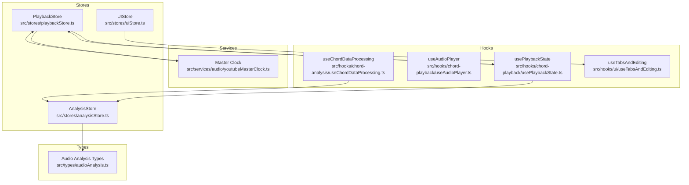
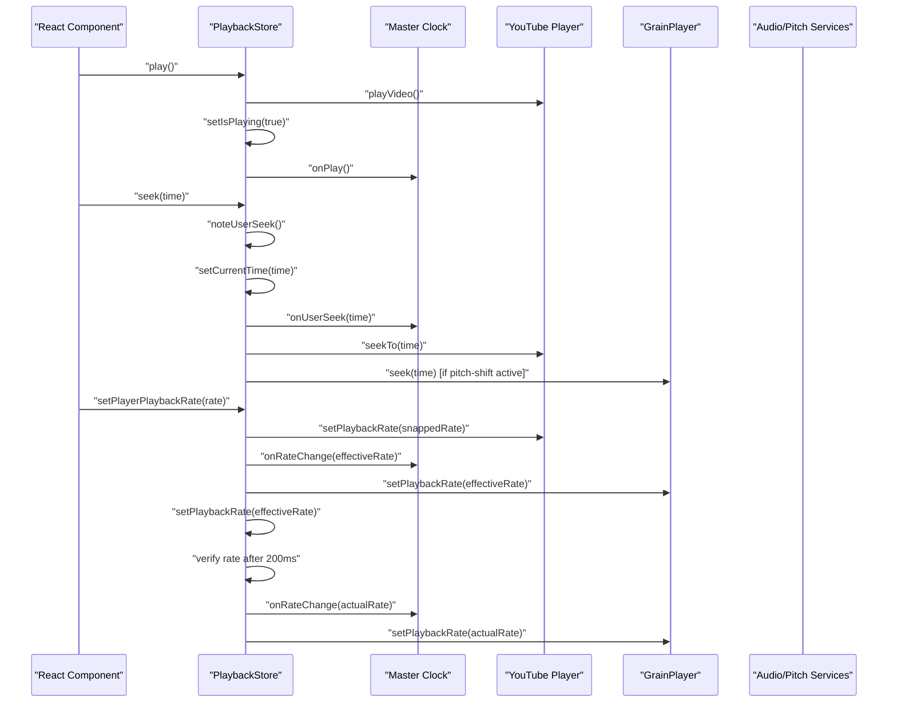
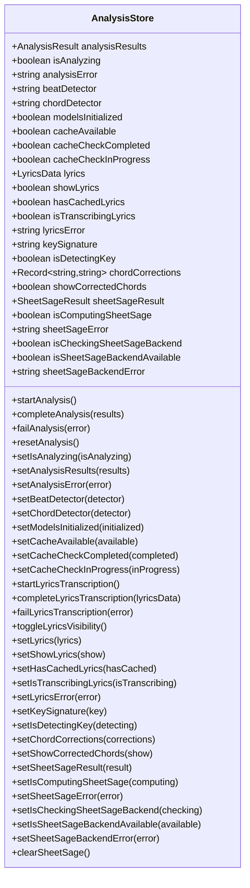
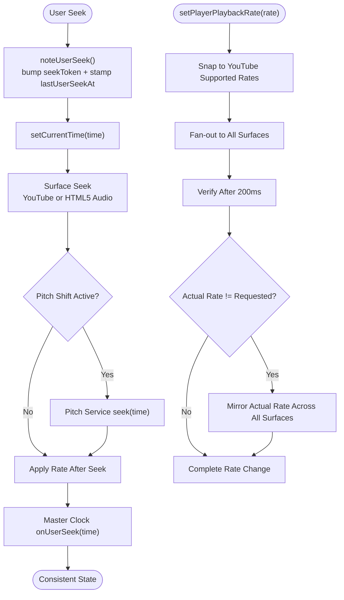
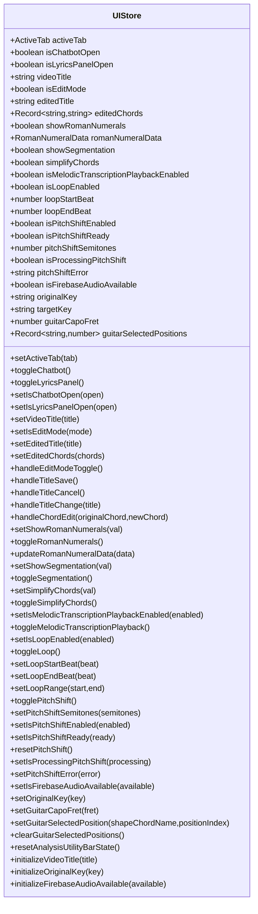
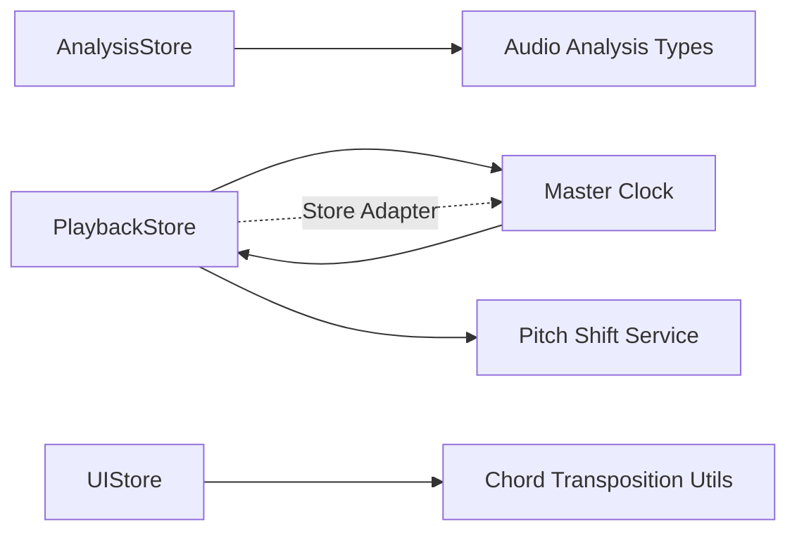

# Global State Stores

<cite>
**Referenced Files in This Document**
- [analysisStore.ts](file://src/stores/analysisStore.ts)
- [playbackStore.ts](file://src/stores/playbackStore.ts)
- [uiStore.ts](file://src/stores/uiStore.ts)
- [youtubeMasterClock.ts](file://src/services/audio/youtubeMasterClock.ts)
- [audioAnalysis.ts](file://src/types/audioAnalysis.ts)
- [usePlaybackState.ts](file://src/hooks/chord-playback/usePlaybackState.ts)
- [useAudioPlayer.ts](file://src/hooks/chord-playback/useAudioPlayer.ts)
- [useChordDataProcessing.ts](file://src/hooks/chord-analysis/useChordDataProcessing.ts)
- [useTabsAndEditing.ts](file://src/hooks/ui/useTabsAndEditing.ts)
</cite>

## Update Summary
**Changes Made**
- Updated Playback Store documentation to reflect the new master clock integration
- Added comprehensive documentation for the enhanced rate fan-out mechanism
- Documented the new seek token and user-seek fence coordination system
- Added details about GrainPlayer integration and rate verification
- Updated architecture diagrams to show the master clock adapter wiring
- Enhanced troubleshooting guidance for rate verification and seek coordination

## Table of Contents
1. [Introduction](#introduction)
2. [Project Structure](#project-structure)
3. [Core Components](#core-components)
4. [Architecture Overview](#architecture-overview)
5. [Detailed Component Analysis](#detailed-component-analysis)
6. [Dependency Analysis](#dependency-analysis)
7. [Performance Considerations](#performance-considerations)
8. [Troubleshooting Guide](#troubleshooting-guide)
9. [Conclusion](#conclusion)

## Introduction
This document explains the global state stores built with Zustand that power the music analysis, playback, and UI systems. It covers the analysis store for managing music analysis state (beats, chords, audio metadata), the playback store for controlling audio playback, metronome, and synchronization, and the UI store for managing user interface state, theme preferences, and component visibility. The guide includes store initialization, state shape definitions, action creators, middleware integration, subscription patterns, and integration examples with React components.

**Updated** The playback store now features a sophisticated master clock integration that coordinates synchronization across multiple playback surfaces, including comprehensive rate fan-out mechanisms that propagate playback rate changes to YouTube iframe, GrainPlayer, and HTML5 audio elements.

## Project Structure
The state management is organized around three core Zustand stores located under src/stores/. Each store encapsulates a domain-specific state and exposes typed selector hooks for efficient re-renders. Supporting types and hooks under src/types/ and src/hooks/ provide the data contracts and integration patterns used by components. The master clock service provides centralized timekeeping that coordinates all playback surfaces.

**Diagram sources**
- [analysisStore.ts:101-295](file://src/stores/analysisStore.ts#L101-L295)
- [playbackStore.ts:101-452](file://src/stores/playbackStore.ts#L101-L452)
- [uiStore.ts:127-434](file://src/stores/uiStore.ts#L127-L434)
- [youtubeMasterClock.ts:145-409](file://src/services/audio/youtubeMasterClock.ts#L145-L409)
- [audioAnalysis.ts:1-71](file://src/types/audioAnalysis.ts#L1-L71)
- [usePlaybackState.ts:77-392](file://src/hooks/chord-playback/usePlaybackState.ts#L77-L392)
- [useAudioPlayer.ts:11-93](file://src/hooks/chord-playback/useAudioPlayer.ts#L11-L93)
- [useChordDataProcessing.ts:25-87](file://src/hooks/chord-analysis/useChordDataProcessing.ts#L25-L87)
- [useTabsAndEditing.ts:10-73](file://src/hooks/ui/useTabsAndEditing.ts#L10-L73)

**Section sources**
- [analysisStore.ts:101-295](file://src/stores/analysisStore.ts#L101-L295)
- [playbackStore.ts:101-452](file://src/stores/playbackStore.ts#L101-L452)
- [uiStore.ts:127-434](file://src/stores/uiStore.ts#L127-L434)
- [youtubeMasterClock.ts:145-409](file://src/services/audio/youtubeMasterClock.ts#L145-L409)
- [audioAnalysis.ts:1-71](file://src/types/audioAnalysis.ts#L1-L71)
- [usePlaybackState.ts:77-392](file://src/hooks/chord-playback/usePlaybackState.ts#L77-L392)
- [useAudioPlayer.ts:11-93](file://src/hooks/chord-playback/useAudioPlayer.ts#L11-L93)
- [useChordDataProcessing.ts:25-87](file://src/hooks/chord-analysis/useChordDataProcessing.ts#L25-L87)
- [useTabsAndEditing.ts:10-73](file://src/hooks/ui/useTabsAndEditing.ts#L10-L73)

## Core Components
- **AnalysisStore**: Manages music analysis results, model selection, cache state, lyrics transcription, key detection, chord corrections, and SheetSage backend integration. It exposes actions to start, complete, and fail analysis, and to manage lyrics and SheetSage states.
- **PlaybackStore**: Controls audio/video playback, synchronization, beat tracking, and seek coordination. It integrates with YouTube player, HTML5 audio, and a master clock for precise synchronization across multiple surfaces.
- **UIStore**: Handles UI state such as active tabs, panel toggles, editing modes, feature toggles (roman numerals, segmentation, simplification), loop playback, pitch shift, and guitar voicing selections.

Each store is initialized with Zustand's create function and optionally wrapped with devtools middleware in development. Selector hooks are exported for optimized re-renders.

**Updated** The PlaybackStore now includes comprehensive rate fan-out mechanisms that propagate playback rate changes to YouTube iframe, GrainPlayer, and HTML5 audio elements, with enhanced rate verification and seek coordination.

**Section sources**
- [analysisStore.ts:14-99](file://src/stores/analysisStore.ts#L14-L99)
- [playbackStore.ts:35-99](file://src/stores/playbackStore.ts#L35-L99)
- [uiStore.ts:30-125](file://src/stores/uiStore.ts#L30-L125)

## Architecture Overview
The stores coordinate through explicit actions and shared types. The playback store maintains a master clock and synchronizes multiple playback surfaces (YouTube iframe, HTML5 audio, pitch-shifted audio). The analysis store provides unified results consumed by UI components and playback logic. The UI store manages feature flags and editing state that influence both analysis and playback behavior.

**Updated** The architecture now features a master clock that serves as the single source of truth for playback position and rate, coordinating synchronization across all surfaces with enhanced rate verification and seek coordination.

**Diagram sources**
- [playbackStore.ts:144-428](file://src/stores/playbackStore.ts#L144-L428)
- [usePlaybackState.ts:134-238](file://src/hooks/chord-playback/usePlaybackState.ts#L134-L238)
- [youtubeMasterClock.ts:292-338](file://src/services/audio/youtubeMasterClock.ts#L292-L338)

**Section sources**
- [playbackStore.ts:101-452](file://src/stores/playbackStore.ts#L101-L452)
- [usePlaybackState.ts:77-392](file://src/hooks/chord-playback/usePlaybackState.ts#L77-L392)
- [youtubeMasterClock.ts:145-409](file://src/services/audio/youtubeMasterClock.ts#L145-L409)

## Detailed Component Analysis

### Analysis Store
The analysis store centralizes music analysis state and operations. Its state includes:
- Analysis results, status, and errors
- Model selection (beat detector, chord detector) and initialization flag
- Cache availability and check progress
- Lyrics transcription state and visibility
- Key signature detection state
- Chord corrections and display toggle
- SheetSage backend state and availability checks

Actions cover lifecycle management (start, complete, fail, reset), model configuration, cache state updates, lyrics transcription lifecycle, key detection, chord corrections, and SheetSage operations.

**Diagram sources**
- [analysisStore.ts:14-99](file://src/stores/analysisStore.ts#L14-L99)

Key integration patterns:
- Selector hooks for fine-grained subscriptions (e.g., useAnalysisResults, useIsAnalyzing, useLyricsActions).
- Actions grouped by domain (analysis, models, lyrics, SheetSage) for maintainability.
- Middleware integration via devtools in development and a production-safe identity wrapper.

**Section sources**
- [analysisStore.ts:101-295](file://src/stores/analysisStore.ts#L101-L295)
- [analysisStore.ts:297-367](file://src/stores/analysisStore.ts#L297-L367)

### Playback Store
The playback store coordinates audio/video playback and synchronization. Its state includes:
- Playback status (isPlaying, currentTime, duration, playbackRate)
- Player references (audioRef, youtubePlayer)
- Beat tracking indices (currentBeatIndex, currentDownbeatIndex)
- Seek coordination tokens and timestamps
- Video UI state (minimized, follow mode)
- Beat click handler delegation

**Updated** The store now features comprehensive rate fan-out mechanisms that propagate playback rate changes to YouTube iframe, GrainPlayer, and HTML5 audio elements. The rate verification system snaps rates to YouTube's supported set and verifies the actual effective rate after 200ms.

Actions include play, pause, seek, setPlayerPlaybackRate, noteUserSeek, onBeatClick, and reset. The store integrates with a master clock and pitch-shift services to maintain precise synchronization across multiple surfaces.

**Diagram sources**
- [playbackStore.ts:360-428](file://src/stores/playbackStore.ts#L360-L428)
- [usePlaybackState.ts:173-238](file://src/hooks/chord-playback/usePlaybackState.ts#L173-L238)
- [playbackStore.ts:172-351](file://src/stores/playbackStore.ts#L172-L351)

Important behaviors:
- **Rate Fan-out Mechanism**: The store now propagates rate changes to YouTube iframe, master clock, GrainPlayer, and HTML5 audio elements in a coordinated manner.
- **Rate Verification**: After 200ms, the store verifies YouTube's actual effective rate and mirrors it across all surfaces if there's a mismatch.
- **Seek Token System**: A monotonic counter that prevents drift correction loops from overriding user-initiated seeks.
- **User-seek Fence**: A 500ms window that prevents stale drift correction after user-initiated seeks.
- **Master Clock Integration**: The master clock serves as the single source of truth for playback position and rate.

**Section sources**
- [playbackStore.ts:101-452](file://src/stores/playbackStore.ts#L101-L452)
- [usePlaybackState.ts:77-392](file://src/hooks/chord-playback/usePlaybackState.ts#L77-L392)
- [youtubeMasterClock.ts:145-409](file://src/services/audio/youtubeMasterClock.ts#L145-L409)

### UI Store
The UI store manages user interface state and feature toggles:
- Active tab management
- Panel toggles with mutual exclusivity (chatbot vs lyrics)
- Editing mode for titles and chords
- Feature toggles (roman numerals, segmentation, simplification)
- Loop playback configuration
- Pitch shift state and key calculations
- Guitar voicing selections
- Utility bar reset

Actions cover toggling, setting, and resetting states, with derived computations for target keys based on original key and semitone shifts.

**Diagram sources**
- [uiStore.ts:30-125](file://src/stores/uiStore.ts#L30-L125)

Integration patterns:
- Mutual exclusivity for chatbot and embedded lyrics grid.
- Derived targetKey calculation based on originalKey and pitchShiftSemitones.
- Utility bar reset consolidates feature flags and loop state.

**Section sources**
- [uiStore.ts:127-434](file://src/stores/uiStore.ts#L127-L434)

## Dependency Analysis
The stores depend on shared types and services:
- AnalysisStore depends on audio analysis types and services for lyrics and SheetSage.
- PlaybackStore depends on the master clock and pitch-shift service instances.
- UIStore depends on chord transposition utilities for key calculations.

**Updated** The PlaybackStore now has a critical dependency on the master clock service for synchronization, and the master clock integrates with the playback store through a store adapter.

**Diagram sources**
- [analysisStore.ts:3-5](file://src/stores/analysisStore.ts#L3-L5)
- [playbackStore.ts:4-5](file://src/stores/playbackStore.ts#L4-L5)
- [uiStore.ts:3](file://src/stores/uiStore.ts#L3)
- [youtubeMasterClock.ts:168-170](file://src/services/audio/youtubeMasterClock.ts#L168-L170)

**Section sources**
- [audioAnalysis.ts:1-71](file://src/types/audioAnalysis.ts#L1-L71)
- [playbackStore.ts:101-452](file://src/stores/playbackStore.ts#L101-L452)
- [uiStore.ts:127-434](file://src/stores/uiStore.ts#L127-L434)
- [youtubeMasterClock.ts:145-409](file://src/services/audio/youtubeMasterClock.ts#L145-L409)

## Performance Considerations
- Selector hooks minimize re-renders by subscribing to specific slices of state.
- **Seek Coordination**: The playback store uses a seek token and user-seek fence to prevent race conditions between user-initiated seeks and drift correction loops.
- **Rate Optimization**: Rate changes are idempotently short-circuited when the requested rate equals the stored rate within a small tolerance.
- **Verification Efficiency**: The rate verification system uses a 200ms delay to ensure YouTube's actual effective rate is mirrored across all surfaces.
- **Master Clock Efficiency**: The master clock applies hysteresis thresholds to minimize unnecessary re-anchoring operations.

**Updated** The master clock system reduces jitter through re-anchor hysteresis and provides smooth extrapolation even when the AudioContext is suspended.

## Troubleshooting Guide
Common issues and resolutions:
- **Rate mismatch warnings**: The playback store verifies YouTube's applied rate and mirrors it across surfaces. Investigate unsupported rates and adjust to YouTube's available set. The master clock handles rate verification and mirroring automatically.
- **Backward jumps during pitch-shift**: Ensure the HTML5 audio timeupdate listener is bypassed when pitch-shift is active, as enforced by guards in the playback store.
- **Stale drift correction**: `noteUserSeek` must be called before any user-initiated seek to bump the seek token and skip subsequent drift ticks within the user-seek fence.
- **SheetSage backend availability**: Monitor `isSheetSageBackendAvailable` and `sheetSageBackendError` to diagnose backend issues.
- **Master clock synchronization**: Verify that the master clock adapter is properly wired and that `noteUserSeek` and `setCurrentTime` are being called consistently.
- **Rate fan-out failures**: Check that all surfaces (YouTube, master clock, GrainPlayer, HTML5 audio) are receiving rate updates and that the 200ms verification completes successfully.

**Updated** The troubleshooting guide now includes specific guidance for master clock synchronization, rate fan-out mechanisms, and seek coordination issues.

**Section sources**
- [playbackStore.ts:172-351](file://src/stores/playbackStore.ts#L172-L351)
- [playbackStore.ts:360-428](file://src/stores/playbackStore.ts#L360-L428)
- [analysisStore.ts:265-291](file://src/stores/analysisStore.ts#L265-L291)
- [youtubeMasterClock.ts:292-338](file://src/services/audio/youtubeMasterClock.ts#L292-L338)

## Conclusion
The Zustand-based stores provide a cohesive foundation for music analysis, playback, and UI state. They enforce clear separation of concerns, offer robust synchronization mechanisms, and expose efficient selector hooks for React components. The integration patterns demonstrated by the hooks illustrate best practices for subscribing to store slices, coordinating playback surfaces, and deriving computed state.

**Updated** The enhanced master clock integration and rate fan-out mechanisms provide unprecedented precision in multi-surface synchronization, while the seek token and user-seek fence coordination eliminate common race conditions and drift correction loops. The comprehensive rate verification system ensures that all playback surfaces remain perfectly synchronized even when dealing with YouTube's rate limitations and pitch-shift complexities.