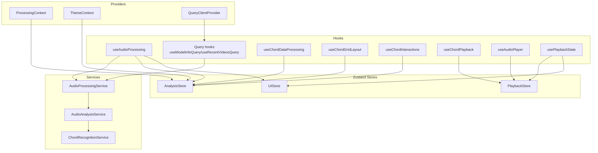
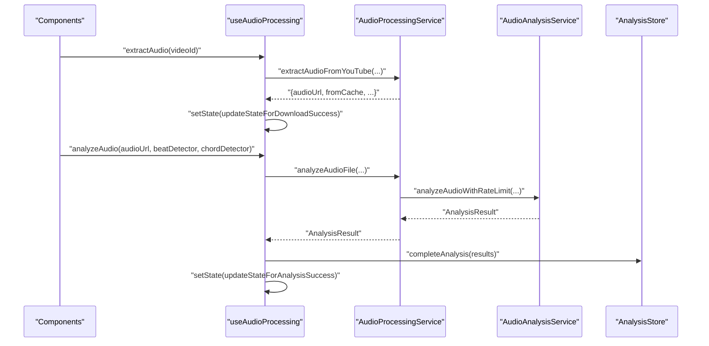
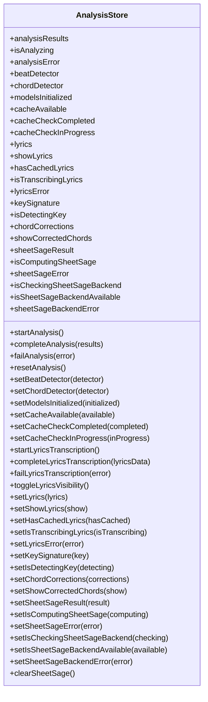
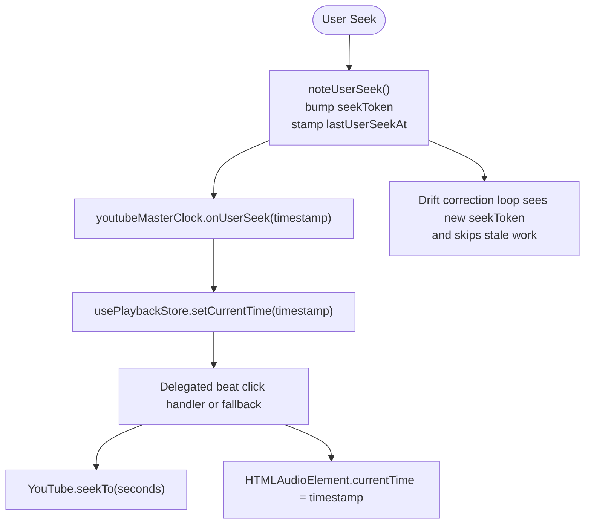
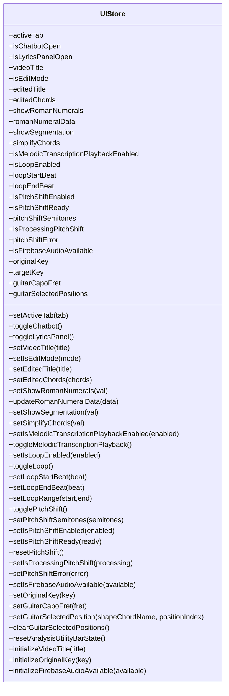
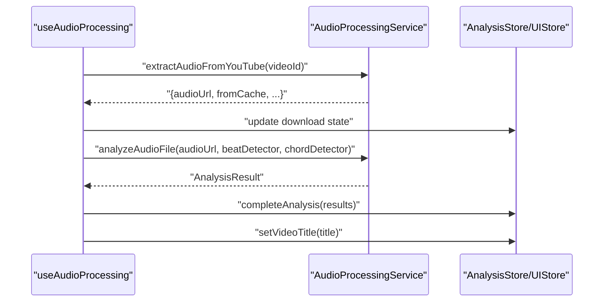
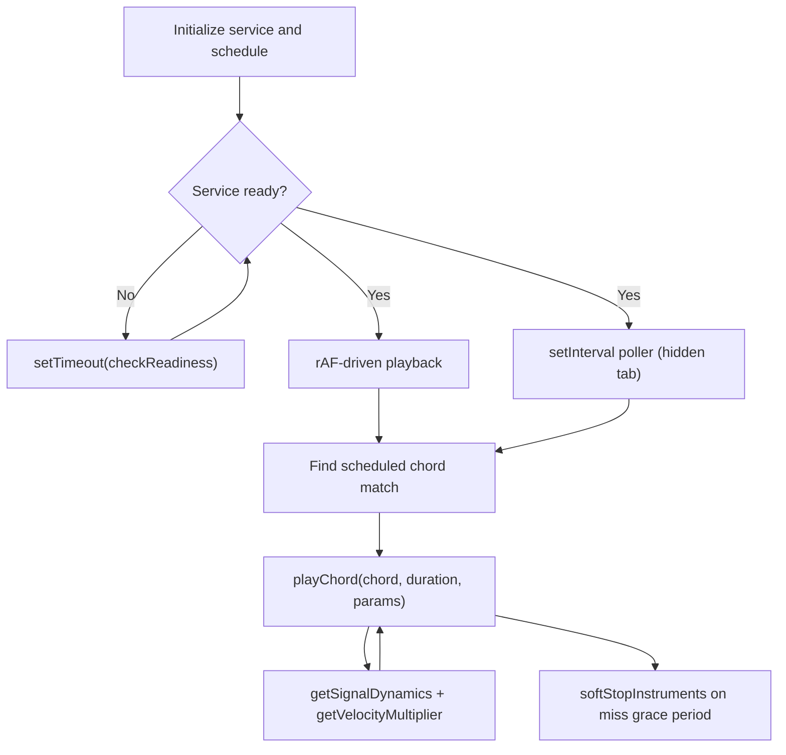
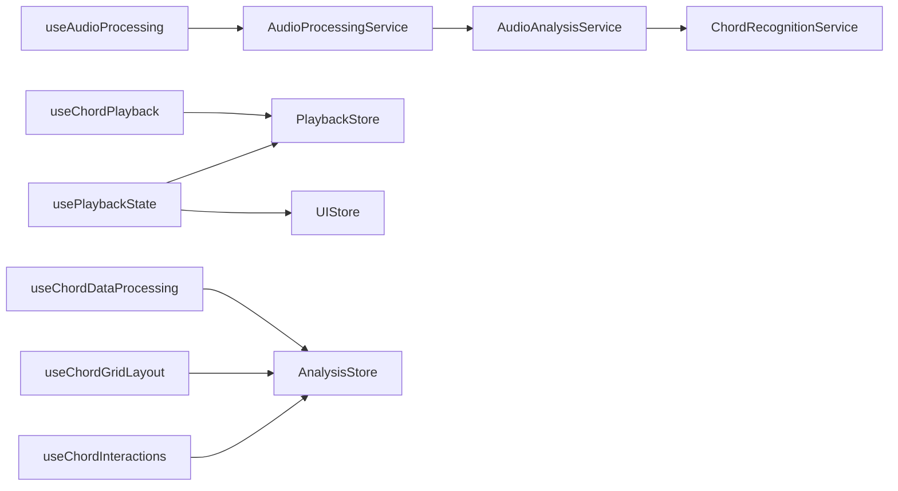

# State Management and Data Flow

<cite>
**Referenced Files in This Document**
- [analysisStore.ts](file://src/stores/analysisStore.ts)
- [playbackStore.ts](file://src/stores/playbackStore.ts)
- [uiStore.ts](file://src/stores/uiStore.ts)
- [ProcessingContext.tsx](file://src/contexts/ProcessingContext.tsx)
- [ThemeContext.tsx](file://src/contexts/ThemeContext.tsx)
- [providers.tsx](file://src/app/providers.tsx)
- [useAudioProcessing.ts](file://src/hooks/audio/useAudioProcessing.ts)
- [useChordDataProcessing.ts](file://src/hooks/chord-analysis/useChordDataProcessing.ts)
- [useChordGridLayout.ts](file://src/hooks/chord-analysis/useChordGridLayout.ts)
- [useChordInteractions.ts](file://src/hooks/chord-analysis/useChordInteractions.ts)
- [useChordPlayback.ts](file://src/hooks/chord-playback/useChordPlayback.ts)
- [useAudioPlayer.ts](file://src/hooks/chord-playback/useAudioPlayer.ts)
- [usePlaybackState.ts](file://src/hooks/chord-playback/usePlaybackState.ts)
- [audioProcessingService.ts](file://src/services/audio/audioProcessingService.ts)
- [audioAnalysisService.ts](file://src/services/audio/audioAnalysisService.ts)
- [chordRecognitionService.ts](file://src/services/chord-analysis/chordRecognitionService.ts)
- [chordProcessing.ts](file://src/utils/chordProcessing.ts)
</cite>

## Table of Contents
1. [Introduction](#introduction)
2. [Project Structure](#project-structure)
3. [Core Components](#core-components)
4. [Architecture Overview](#architecture-overview)
5. [Detailed Component Analysis](#detailed-component-analysis)
6. [Dependency Analysis](#dependency-analysis)
7. [Performance Considerations](#performance-considerations)
8. [Troubleshooting Guide](#troubleshooting-guide)
9. [Conclusion](#conclusion)

## Introduction
This document explains the state management architecture used in the application, focusing on global state stores built with Zustand, React Context providers, TanStack Query for server state, and a comprehensive set of React hooks. It details how data flows between components, services, and stores, and documents specialized hooks for analysis orchestration, chord processing, audio manipulation, query-backed read caching, and user interactions. It also covers persistence, synchronization strategies, performance optimizations, and memory management for audio-related state.

## Project Structure
The state management system is organized around three primary layers:
- Global state stores (Zustand): analysis, playback, and UI stores
- Context providers: processing and theme contexts
- TanStack Query: remote/server-state cache for model info, recent transcriptions, Sheet Sage availability/cache checks, and cached lyrics lookups
- Hooks: specialized orchestration and UI interaction logic

**Diagram sources**
- [providers.tsx:12-31](file://src/app/providers.tsx#L12-L31)
- [ProcessingContext.tsx:44-184](file://src/contexts/ProcessingContext.tsx#L44-L184)
- [ThemeContext.tsx:44-70](file://src/contexts/ThemeContext.tsx#L44-L70)
- [analysisStore.ts:101-295](file://src/stores/analysisStore.ts#L101-L295)
- [playbackStore.ts:101-452](file://src/stores/playbackStore.ts#L101-L452)
- [uiStore.ts:127-434](file://src/stores/uiStore.ts#L127-L434)
- [useAudioProcessing.ts:16-125](file://src/hooks/audio/useAudioProcessing.ts#L16-L125)
- [useChordPlayback.ts:250-739](file://src/hooks/chord-playback/useChordPlayback.ts#L250-L739)
- [usePlaybackState.ts:77-393](file://src/hooks/chord-playback/usePlaybackState.ts#L77-L393)
- [audioProcessingService.ts:43-468](file://src/services/audio/audioProcessingService.ts#L43-L468)
- [audioAnalysisService.ts:1-200](file://src/services/audio/audioAnalysisService.ts#L1-L200)
- [chordRecognitionService.ts:14-31](file://src/services/chord-analysis/chordRecognitionService.ts#L14-L31)

**Section sources**
- [providers.tsx:12-31](file://src/app/providers.tsx#L12-L31)
- [ProcessingContext.tsx:44-184](file://src/contexts/ProcessingContext.tsx#L44-L184)
- [ThemeContext.tsx:44-70](file://src/contexts/ThemeContext.tsx#L44-L70)

## Core Components
- AnalysisStore: centralizes analysis lifecycle, model selection, cache state, lyrics, key detection, corrections, and SheetSage integration. Exposes typed actions and selector hooks for optimized re-renders.
- PlaybackStore: manages audio/video playback state, master clock coordination, rate synchronization, and seek coordination with cancellation tokens and user-seek fences.
- UIStore: manages UI toggles, editing modes, pitch shift state, loop playback, segmentation, simplification, and shared guitar voicing selections.
- ProcessingContext: provides processing stage, progress, and elapsed time for analysis workflows.
- ThemeContext: provides theme state and toggle using useSyncExternalStore for hydration-safe DOM-based theme.
- TanStack Query: owns server-state reads and cache invalidation for shared remote data. Zustand remains responsible for client/workflow state such as playback, selected panels, processing progress, and analysis results.

**Section sources**
- [analysisStore.ts:14-99](file://src/stores/analysisStore.ts#L14-L99)
- [analysisStore.ts:101-295](file://src/stores/analysisStore.ts#L101-L295)
- [playbackStore.ts:35-99](file://src/stores/playbackStore.ts#L35-L99)
- [playbackStore.ts:101-452](file://src/stores/playbackStore.ts#L101-L452)
- [uiStore.ts:30-125](file://src/stores/uiStore.ts#L30-L125)
- [uiStore.ts:127-434](file://src/stores/uiStore.ts#L127-L434)
- [ProcessingContext.tsx:14-28](file://src/contexts/ProcessingContext.tsx#L14-L28)
- [ProcessingContext.tsx:44-184](file://src/contexts/ProcessingContext.tsx#L44-L184)
- [ThemeContext.tsx:7-20](file://src/contexts/ThemeContext.tsx#L7-L20)
- [ThemeContext.tsx:44-70](file://src/contexts/ThemeContext.tsx#L44-L70)

## Architecture Overview
The architecture follows a unidirectional data flow:
- Services orchestrate analysis and audio operations and update Zustand stores.
- Query hooks fetch and cache read-oriented server state; mutations and Firestore writes invalidate relevant query keys.
- Hooks subscribe to stores and expose typed selectors/actions to components.
- Context providers supply runtime state (processing stage, theme) to the component tree.
- Master clock and coordinated rate management ensure synchronization across YouTube iframe, HTML5 audio, and pitch-shifted audio.

**Diagram sources**
- [useAudioProcessing.ts:31-95](file://src/hooks/audio/useAudioProcessing.ts#L31-L95)
- [audioProcessingService.ts:53-234](file://src/services/audio/audioProcessingService.ts#L53-L234)
- [audioAnalysisService.ts:109-200](file://src/services/audio/audioAnalysisService.ts#L109-L200)
- [analysisStore.ts:141-150](file://src/stores/analysisStore.ts#L141-L150)

## Detailed Component Analysis

### Global State Stores

#### AnalysisStore
- Responsibilities: analysis lifecycle, model selection, cache availability, lyrics transcription, key signature detection, chord corrections, SheetSage backend checks.
- Actions: start/complete/fail/reset analysis; set beat/chord detectors; manage lyrics; track key detection; manage SheetSage state.
- Selectors: optimized hooks for partial state to minimize re-renders.

**Diagram sources**
- [analysisStore.ts:14-99](file://src/stores/analysisStore.ts#L14-L99)
- [analysisStore.ts:101-295](file://src/stores/analysisStore.ts#L101-L295)

**Section sources**
- [analysisStore.ts:14-99](file://src/stores/analysisStore.ts#L14-L99)
- [analysisStore.ts:297-367](file://src/stores/analysisStore.ts#L297-L367)

#### PlaybackStore
- Responsibilities: unified playback state, master clock coordination, rate synchronization, seek coordination with cancellation tokens, drift correction, and YouTube iframe integration.
- Key mechanisms: seekToken and lastUserSeekAt for conflict-free async coordination; master clock adapter wiring; rate fan-out to YouTube, pitch-shift service, and HTML5 audio.

**Diagram sources**
- [playbackStore.ts:360-428](file://src/stores/playbackStore.ts#L360-L428)
- [playbackStore.ts:487-490](file://src/stores/playbackStore.ts#L487-L490)

**Section sources**
- [playbackStore.ts:35-99](file://src/stores/playbackStore.ts#L35-L99)
- [playbackStore.ts:475-490](file://src/stores/playbackStore.ts#L475-L490)

#### UIStore
- Responsibilities: tab management, panel toggles, editing modes, feature toggles (roman numerals, segmentation, simplification), loop playback, pitch shift state, and shared guitar voicing.
- Notable behaviors: mutual exclusivity of chatbot and embedded lyrics grid; target key recalculation on pitch shift changes; initialization helpers.

**Diagram sources**
- [uiStore.ts:30-125](file://src/stores/uiStore.ts#L30-L125)
- [uiStore.ts:127-434](file://src/stores/uiStore.ts#L127-L434)

**Section sources**
- [uiStore.ts:127-434](file://src/stores/uiStore.ts#L127-L434)

### Context Providers
- ProcessingContext: maintains stage, progress, and formatted elapsed time; exposes start/complete/fail/reset and timer lifecycle.
- ThemeContext: reads theme from DOM via useSyncExternalStore and toggles dark/light class on html element.

**Section sources**
- [ProcessingContext.tsx:44-184](file://src/contexts/ProcessingContext.tsx#L44-L184)
- [ThemeContext.tsx:44-70](file://src/contexts/ThemeContext.tsx#L44-L70)

### Specialized Hooks

#### Audio Processing Hook
- Orchestrates audio extraction and analysis, updates internal state, and integrates with AnalysisStore and UIStore for title and editing modes.

**Diagram sources**
- [useAudioProcessing.ts:31-95](file://src/hooks/audio/useAudioProcessing.ts#L31-L95)
- [audioProcessingService.ts:53-234](file://src/services/audio/audioProcessingService.ts#L53-L234)
- [analysisStore.ts:141-150](file://src/stores/analysisStore.ts#L141-L150)

**Section sources**
- [useAudioProcessing.ts:16-125](file://src/hooks/audio/useAudioProcessing.ts#L16-L125)

#### Chord Data Processing Hook
- Computes shifted chords, occurrence maps, and display logic with optional corrections and audio mapping alignment.

**Section sources**
- [useChordDataProcessing.ts:25-87](file://src/hooks/chord-analysis/useChordDataProcessing.ts#L25-L87)
- [chordProcessing.ts:148-200](file://src/utils/chordProcessing.ts#L148-L200)

#### Chord Grid Layout Hook
- Manages responsive layout, cell sizing, and grouping by measures with ResizeObserver and window resize handling.

**Section sources**
- [useChordGridLayout.ts:8-124](file://src/hooks/chord-analysis/useChordGridLayout.ts#L8-L124)

#### Chord Interactions Hook
- Resolves timestamps for beat clicks, determines clickability, and delegates to provided click handlers.

**Section sources**
- [useChordInteractions.ts:21-64](file://src/hooks/chord-analysis/useChordInteractions.ts#L21-L64)

#### Chord Playback Hook
- Schedules chord events, coordinates foreground/background playback, integrates with audio dynamics, and manages instrument volumes and pitch shift.

**Diagram sources**
- [useChordPlayback.ts:342-353](file://src/hooks/chord-playback/useChordPlayback.ts#L342-L353)
- [useChordPlayback.ts:555-665](file://src/hooks/chord-playback/useChordPlayback.ts#L555-L665)
- [useChordPlayback.ts:376-475](file://src/hooks/chord-playback/useChordPlayback.ts#L376-L475)

**Section sources**
- [useChordPlayback.ts:250-739](file://src/hooks/chord-playback/useChordPlayback.ts#L250-L739)

#### Audio Player Hook
- Manages local audio player state and integrates with YouTube player for unified playback controls.

**Section sources**
- [useAudioPlayer.ts:11-94](file://src/hooks/chord-playback/useAudioPlayer.ts#L11-L94)

#### Playback State Hook
- Integrates playbackStore with audio/YouTube sources, manages master clock, rate re-application after seek, and auto-scroll behavior.

**Section sources**
- [usePlaybackState.ts:77-393](file://src/hooks/chord-playback/usePlaybackState.ts#L77-L393)

### Service Layer Integration
- AudioProcessingService: orchestrates extraction, analysis, caching, and error handling; updates UI and store state.
- AudioAnalysisService: coordinates beat detection and chord recognition, handles large files via offload, and synchronizes results.
- ChordRecognitionService: facade delegating to audioAnalysisService for backward compatibility.

**Section sources**
- [audioProcessingService.ts:43-468](file://src/services/audio/audioProcessingService.ts#L43-L468)
- [audioAnalysisService.ts:1-200](file://src/services/audio/audioAnalysisService.ts#L1-L200)
- [chordRecognitionService.ts:14-31](file://src/services/chord-analysis/chordRecognitionService.ts#L14-L31)

## Dependency Analysis
- Stores depend on each other indirectly via hooks and services:
  - AnalysisStore is the primary sink for analysis results and lyrics.
  - PlaybackStore depends on UIStore for pitch shift and follow mode.
  - UIStore depends on AnalysisStore for key and chord data.
- Services depend on each other:
  - AudioProcessingService uses AudioAnalysisService and Firestore services.
  - AudioAnalysisService uses beat detection, chord recognition, and offload services.

**Diagram sources**
- [useAudioProcessing.ts:29-95](file://src/hooks/audio/useAudioProcessing.ts#L29-L95)
- [audioProcessingService.ts:111-234](file://src/services/audio/audioProcessingService.ts#L111-L234)
- [audioAnalysisService.ts:146-200](file://src/services/audio/audioAnalysisService.ts#L146-L200)
- [useChordPlayback.ts:279-364](file://src/hooks/chord-playback/useChordPlayback.ts#L279-L364)
- [usePlaybackState.ts:89-96](file://src/hooks/chord-playback/usePlaybackState.ts#L89-L96)
- [useChordDataProcessing.ts:36-71](file://src/hooks/chord-analysis/useChordDataProcessing.ts#L36-L71)

**Section sources**
- [useAudioProcessing.ts:29-95](file://src/hooks/audio/useAudioProcessing.ts#L29-L95)
- [audioProcessingService.ts:111-234](file://src/services/audio/audioProcessingService.ts#L111-L234)
- [useChordPlayback.ts:279-364](file://src/hooks/chord-playback/useChordPlayback.ts#L279-L364)
- [usePlaybackState.ts:89-96](file://src/hooks/chord-playback/usePlaybackState.ts#L89-L96)
- [useChordDataProcessing.ts:36-71](file://src/hooks/chord-analysis/useChordDataProcessing.ts#L36-L71)

## Performance Considerations
- Optimized re-renders: selector hooks return only required slices of state to reduce component updates.
- Memoization: useMemo and useCallback are used extensively in hooks to prevent unnecessary recalculations.
- Background tab handling: useChordPlayback switches to a throttled setInterval poller to avoid wasted CPU cycles.
- Rate fan-out and verification: playbackStore ensures YouTube, pitch-shift service, and HTML5 audio remain synchronized and logs mismatches for debugging.
- Seek coordination: seekToken and lastUserSeekAt prevent race conditions between user-initiated seeks and drift correction loops.

[No sources needed since this section provides general guidance]

## Troubleshooting Guide
- Playback rate mismatch: playbackStore logs and mirrors YouTube’s actual rate to maintain lockstep across surfaces.
- Drift correction fighting user seeks: noteUserSeek bumps seekToken and stamps lastUserSeekAt to abort stale work within the user-seek fence.
- Hidden tab playback: useChordPlayback uses a background poller and recovery routine to resume playback when the tab becomes visible.
- Audio extraction errors: AudioProcessingService attaches suggestions to errors to guide users.
- Memory management for audio: cleanup routines in useChordPlayback stop instruments on unmount; playbackStore reset clears references.

**Section sources**
- [playbackStore.ts:310-351](file://src/stores/playbackStore.ts#L310-L351)
- [playbackStore.ts:360-428](file://src/stores/playbackStore.ts#L360-L428)
- [playbackStore.ts:431-448](file://src/stores/playbackStore.ts#L431-L448)
- [useChordPlayback.ts:376-475](file://src/hooks/chord-playback/useChordPlayback.ts#L376-L475)
- [useChordPlayback.ts:502-540](file://src/hooks/chord-playback/useChordPlayback.ts#L502-L540)
- [audioProcessingService.ts:91-108](file://src/services/audio/audioProcessingService.ts#L91-L108)
- [useChordPlayback.ts:718-723](file://src/hooks/chord-playback/useChordPlayback.ts#L718-L723)

## Conclusion
The state management architecture combines Zustand stores for global state, React Context for runtime concerns, and a rich set of hooks for specialized workflows. The design emphasizes:
- Unidirectional data flow with explicit actions and selectors
- Strong synchronization across audio surfaces via a master clock and coordinated rate management
- Performance-conscious patterns including memoization, background-aware playback, and selective re-renders
- Robust error handling and user guidance through service-layer suggestions and logging

[No sources needed since this section summarizes without analyzing specific files]
