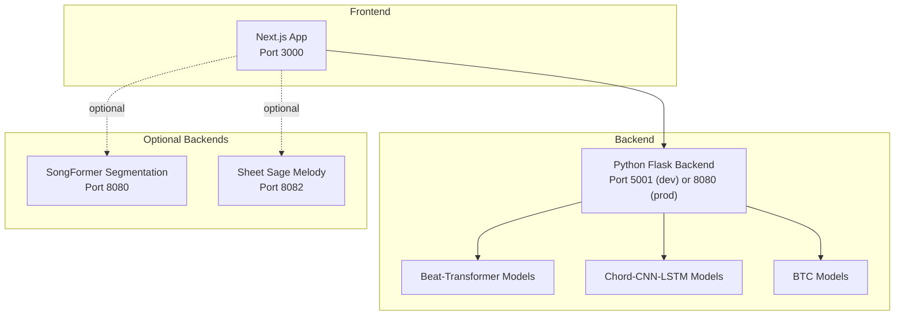
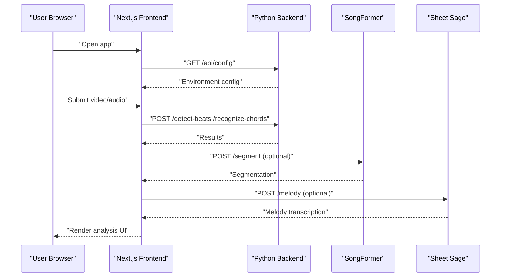
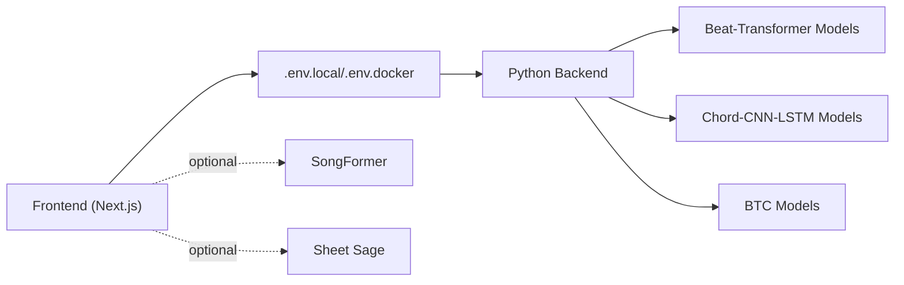

# Getting Started

<cite>
**Referenced Files in This Document**
- [README.md](file://README.md)
- [package.json](file://package.json)
- [python_backend/requirements.txt](file://python_backend/requirements.txt)
- [python_backend/app.py](file://python_backend/app.py)
- [python_backend/config.py](file://python_backend/config.py)
- [python_backend/utils/model_utils.py](file://python_backend/utils/model_utils.py)
- [docker/docker-compose.dev.yml](file://docker/docker-compose.dev.yml)
- [docker/docker-compose.yml](file://docker/docker-compose.yml)
- [docker-compose.prod.yml](file://docker-compose.prod.yml)
- [python_backend/Dockerfile](file://python_backend/Dockerfile)
- [SongFormer/requirements.txt](file://SongFormer/requirements.txt)
- [SongFormer/Dockerfile](file://SongFormer/Dockerfile)
- [.env.example](file://.env.example)
- [.env.docker.example](file://.env.docker.example)
- [scripts/start-local-backend.sh](file://scripts/start-local-backend.sh)
</cite>

## Table of Contents
1. [Introduction](#introduction)
2. [Project Structure](#project-structure)
3. [Core Components](#core-components)
4. [Architecture Overview](#architecture-overview)
5. [Detailed Component Analysis](#detailed-component-analysis)
6. [Dependency Analysis](#dependency-analysis)
7. [Performance Considerations](#performance-considerations)
8. [Troubleshooting Guide](#troubleshooting-guide)
9. [Conclusion](#conclusion)
10. [Appendices](#appendices)

## Introduction
This guide helps you install and run ChordMiniApp locally and in production. It covers prerequisites, step-by-step setup for development and production, verification steps, optional components (SongFormer segmentation and Sheet Sage melody), and Docker deployment with platform-specific notes for Windows/x86_64 hosts.

## Project Structure
ChordMiniApp consists of:
- Frontend: Next.js application
- Backend: Python Flask service with ML models for beat detection, chord recognition, and lyrics
- Optional backends: SongFormer (segmentation) and Sheet Sage (melody)
- Docker Compose configurations for local and production deployment

**Diagram sources**
- [python_backend/app.py:180-186](file://python_backend/app.py#L180-L186)
- [docker/docker-compose.yml:11-60](file://docker/docker-compose.yml#L11-L60)
- [docker/docker-compose.dev.yml:7-40](file://docker/docker-compose.dev.yml#L7-L40)
- [docker-compose.prod.yml:15-64](file://docker-compose.prod.yml#L15-L64)
- [SongFormer/Dockerfile:1-25](file://SongFormer/Dockerfile#L1-L25)
- [sheetsage/Dockerfile:1-55](file://sheetsage/Dockerfile#L1-L55)

**Section sources**
- [README.md:45-189](file://README.md#L45-L189)
- [docker/docker-compose.yml:10-115](file://docker/docker-compose.yml#L10-L115)
- [docker/docker-compose.dev.yml:6-116](file://docker/docker-compose.dev.yml#L6-L116)
- [docker-compose.prod.yml:12-102](file://docker-compose.prod.yml#L12-L102)

## Core Components
- Frontend (Next.js): Runs on port 3000 and communicates with the Python backend via environment-configured URLs.
- Python Backend: Flask app exposing ML endpoints for beats, chords, lyrics, and YouTube integration. It runs on port 5001 in development and 8080 in production.
- Optional Backends:
  - SongFormer: Standalone Flask service for song segmentation.
  - Sheet Sage: Standalone Flask service for experimental melody transcription.

Prerequisites:
- Node.js 20.9+ and npm 10+
- Python 3.10.x (3.10.16 recommended)
- Docker (recommended for optional backends)
- Git LFS (for SongFormer checkpoints)
- Firebase account and keys
- Gemini API key

**Section sources**
- [README.md:47-54](file://README.md#L47-L54)
- [package.json:33-36](file://package.json#L33-L36)
- [python_backend/requirements.txt:1-131](file://python_backend/requirements.txt#L1-L131)
- [SongFormer/requirements.txt:1-26](file://SongFormer/requirements.txt#L1-L26)

## Architecture Overview
High-level flow:
- Frontend requests analysis (beats, chords, lyrics).
- Backend performs ML inference and returns results.
- Optional backends handle specialized tasks (segmentation, melody).

**Diagram sources**
- [python_backend/app.py:180-186](file://python_backend/app.py#L180-L186)
- [docker/docker-compose.yml:11-60](file://docker/docker-compose.yml#L11-L60)
- [SongFormer/Dockerfile:1-25](file://SongFormer/Dockerfile#L1-L25)
- [sheetsage/Dockerfile:1-55](file://sheetsage/Dockerfile#L1-L55)

## Detailed Component Analysis

### Prerequisites and Environment Setup
- Node.js and npm versions are enforced by the project.
- Python 3.10.x is required for the backend and optional services.
- Git LFS is required to fetch large SongFormer model files.
- Firebase configuration is mandatory for database and storage.
- Optional API keys: YouTube, Music.AI, Gemini, Genius.

Verification:
- Confirm Node.js and npm versions meet requirements.
- Ensure Firebase project settings and keys are configured in environment files.

**Section sources**
- [package.json:33-36](file://package.json#L33-L36)
- [README.md:47-54](file://README.md#L47-L54)
- [README.md:265-318](file://README.md#L265-L318)
- [.env.example:1-100](file://.env.example#L1-L100)

### Step-by-Step Installation

#### Development Environment (Local)
1. Clone with submodules and initialize Git LFS:
   - git lfs install
   - git clone --recursive https://github.com/ptnghia-j/ChordMiniApp.git
   - git lfs pull
   - npm install

2. Configure environment:
   - Copy .env.example to .env.local and edit required Firebase and API keys.

3. Start Python backend (Terminal 1):
   - cd python_backend
   - Create and activate a virtual environment
   - Upgrade pip and install Cython and NumPy pinned versions
   - Install madmom from a specific source
   - Install requirements.txt
   - Run the Flask app

4. Start frontend (Terminal 2):
   - npm run dev

5. Optional: Start SongFormer segmentation backend (Terminal 3):
   - cd SongFormer
   - docker build -t songformer-backend:local .
   - docker run --rm -p 8080:8080 songformer-backend:local

6. Optional: Start Sheet Sage melody backend (Terminal 4):
   - cd sheetsage
   - docker build --platform=linux/amd64 -t sheetsage-backend:local .
   - docker run --rm --platform=linux/amd64 -p 8082:8082 -v "$(pwd)/cache:/app/cache" sheetsage-backend:local

7. Open the app:
   - Visit http://localhost:3000

**Section sources**
- [README.md:55-189](file://README.md#L55-L189)
- [.env.example:22-50](file://.env.example#L22-L50)

### Production Environment (Docker)
1. Download configuration files:
   - curl -O https://raw.githubusercontent.com/ptnghia-j/ChordMiniApp/main/docker-compose.prod.yml
   - curl -O https://raw.githubusercontent.com/ptnghia-j/ChordMiniApp/main/.env.docker.example

2. Configure environment:
   - cp .env.docker.example .env.docker
   - Edit .env.docker with your API keys and settings

3. Start the application:
   - docker compose -f docker-compose.prod.yml --env-file .env.docker up -d

4. Access the application:
   - Visit http://localhost:3000

5. Stop the application:
   - docker compose -f docker-compose.prod.yml down

Platform-specific notes for Windows/x86_64 hosts:
- The published images are linux/arm64. On Windows/x86_64, build local linux/amd64 images and update docker-compose.prod.yml to use them.

**Section sources**
- [README.md:192-238](file://README.md#L192-L238)
- [docker-compose.prod.yml:12-102](file://docker-compose.prod.yml#L12-L102)
- [.env.docker.example:1-119](file://.env.docker.example#L1-L119)

### Optional Components

#### SongFormer Segmentation Backend
- Purpose: Provides song segmentation results for structural sections.
- Run:
  - docker build -t songformer-backend:local .
  - docker run --rm -p 8080:8080 songformer-backend:local
- Integration: Configure LOCAL_SONGFORMER_API_URL or SONGFORMER_API_URL in environment files.

**Section sources**
- [README.md:170-177](file://README.md#L170-L177)
- [SongFormer/requirements.txt:1-26](file://SongFormer/requirements.txt#L1-L26)
- [SongFormer/Dockerfile:1-25](file://SongFormer/Dockerfile#L1-L25)
- [.env.example:37-48](file://.env.example#L37-L48)

#### Sheet Sage Melody Backend
- Purpose: Experimental melody transcription.
- Run:
  - docker build --platform=linux/amd64 -t sheetsage-backend:local .
  - docker run --rm --platform=linux/amd64 -p 8082:8082 -v "$(pwd)/cache:/app/cache" sheetsage-backend:local
- Integration: Configure LOCAL_SHEETSAGE_API_URL or SHEETSAGE_API_URL in environment files.

**Section sources**
- [README.md:178-184](file://README.md#L178-L184)
- [sheetsage/Dockerfile:1-55](file://sheetsage/Dockerfile#L1-L55)
- [.env.example:46-49](file://.env.example#L46-L49)

## Dependency Analysis
- Frontend depends on Next.js and environment variables for backend URLs and Firebase configuration.
- Python backend depends on Flask, ML frameworks, and audio processing libraries. It lazily loads heavy modules and checks availability at runtime.
- Docker Compose defines services for frontend, backend, and optional Redis for rate limiting.

**Diagram sources**
- [python_backend/app.py:180-186](file://python_backend/app.py#L180-L186)
- [python_backend/config.py:16-103](file://python_backend/config.py#L16-L103)
- [docker/docker-compose.yml:10-115](file://docker/docker-compose.yml#L10-L115)

**Section sources**
- [python_backend/requirements.txt:1-131](file://python_backend/requirements.txt#L1-L131)
- [python_backend/utils/model_utils.py:12-139](file://python_backend/utils/model_utils.py#L12-L139)
- [docker/docker-compose.yml:10-115](file://docker/docker-compose.yml#L10-L115)

## Performance Considerations
- Use Docker Compose for production to ensure consistent resource allocation and model caching.
- Prefer linux/amd64 images on Windows/x86_64 hosts to avoid pulling incompatible linux/arm64 images.
- Enable Redis for rate limiting in production environments.
- Keep audio file sizes within limits to prevent timeouts.

[No sources needed since this section provides general guidance]

## Troubleshooting Guide

Common issues and resolutions:
- Backend connectivity:
  - Verify backend is running on port 5001 (dev) or 8080 (prod).
  - Check port conflicts (avoid macOS AirPlay/AirTunes on port 5000).
  - Confirm PYTHON_API_URL in .env.local points to the correct backend URL.

- Frontend connection errors:
  - Ensure backend is reachable from the frontend.
  - Restart both frontend and backend if needed.

- Native Windows backend installation:
  - The native install path for spleeter and madmom dependencies is unreliable on Windows.
  - Use WSL2/Ubuntu or Docker for the backend instead of continuing with a native Windows environment.
  - If you must skip spleeter for Beat-Transformer testing, remove spleeter and typer from requirements before installing.

- Git LFS and submodules:
  - Ensure git lfs pull completes successfully.
  - Verify submodule directories exist for Beat-Transformer, Chord-CNN-LSTM, and ChordMini models.

- FluidSynth MIDI synthesis:
  - Install FluidSynth for MIDI playback if chord recognition encounters FluidSynth-related issues.

Verification steps:
- Health checks:
  - curl http://localhost:5001/health (dev) or curl http://localhost:8080/ (prod)
- Environment variables:
  - Confirm PYTHON_API_URL and Firebase keys are set correctly.
- Optional services:
  - Verify SongFormer and Sheet Sage endpoints respond when started.

**Section sources**
- [README.md:132-164](file://README.md#L132-L164)
- [README.md:447-490](file://README.md#L447-L490)
- [README.md:73-82](file://README.md#L73-L82)
- [python_backend/app.py:180-186](file://python_backend/app.py#L180-L186)
- [python_backend/config.py:22-46](file://python_backend/config.py#L22-L46)
- [scripts/start-local-backend.sh:1-136](file://scripts/start-local-backend.sh#L1-L136)

## Conclusion
You now have the essentials to install ChordMiniApp locally and in production, configure optional backends, and troubleshoot common issues. Start with the development setup, then move to Docker-based production deployment while following platform-specific notes for Windows/x86_64 hosts.

[No sources needed since this section summarizes without analyzing specific files]

## Appendices

### A. Environment Variables Reference
- Firebase: NEXT_PUBLIC_FIREBASE_* and related keys
- YouTube: NEXT_PUBLIC_YOUTUBE_API_KEY
- Music.AI: MUSIC_AI_API_KEY
- Gemini: GEMINI_API_KEY
- Genius: GENIUS_API_KEY
- Backend URLs: PYTHON_API_URL, SONGFORMER_API_URL, SHEETSAGE_API_URL
- Audio strategy: NEXT_PUBLIC_AUDIO_STRATEGY
- Feature flags: NEXT_PUBLIC_ENABLE_TRUE_STREAMING, AUDIO_PROXY_FIREBASE_REDIRECT_ENABLED

**Section sources**
- [.env.example:1-100](file://.env.example#L1-L100)
- [.env.docker.example:1-119](file://.env.docker.example#L1-L119)

### B. Backend Ports and Services
- Frontend: Port 3000
- Python Backend: Port 5001 (dev), Port 8080 (prod)
- SongFormer: Port 8080
- Sheet Sage: Port 8082

**Section sources**
- [python_backend/app.py:180-186](file://python_backend/app.py#L180-L186)
- [docker/docker-compose.yml:11-60](file://docker/docker-compose.yml#L11-L60)
- [docker/docker-compose.dev.yml:7-40](file://docker/docker-compose.dev.yml#L7-L40)
- [docker-compose.prod.yml:15-64](file://docker-compose.prod.yml#L15-L64)