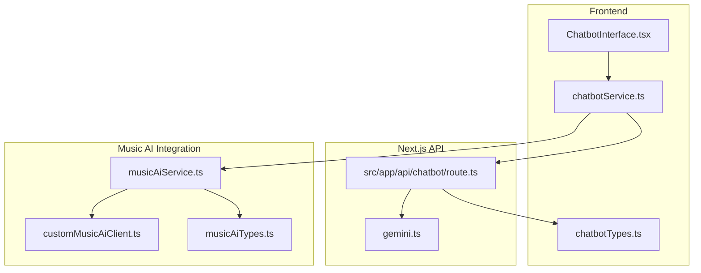
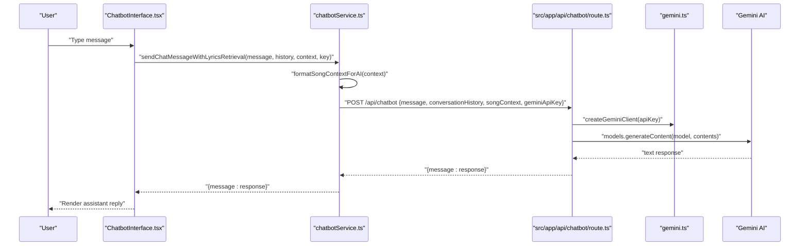
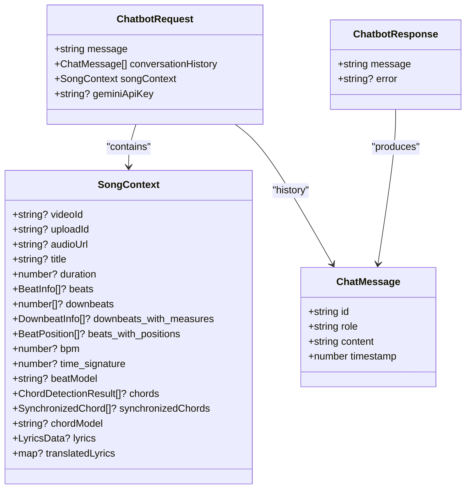
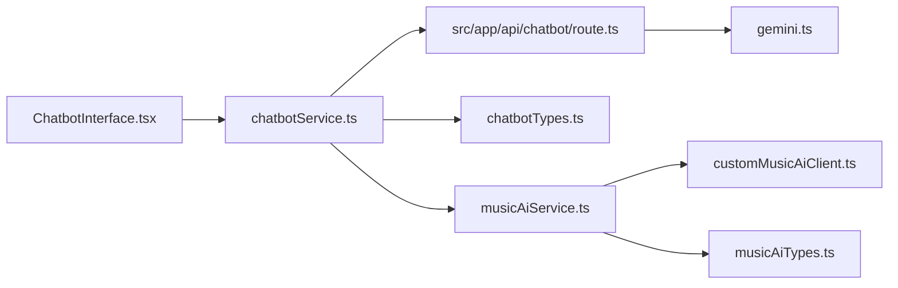

# Chatbot Integration

<cite>
**Referenced Files in This Document**
- [ChatbotInterface.tsx](file://src/components/chatbot/ChatbotInterface.tsx)
- [chatbotService.ts](file://src/services/api/chatbotService.ts)
- [chatbotTypes.ts](file://src/types/chatbotTypes.ts)
- [gemini.ts](file://src/config/gemini.ts)
- [route.ts](file://src/app/api/chatbot/route.ts)
- [musicAiService.ts](file://src/services/lyrics/musicAiService.ts)
- [customMusicAiClient.ts](file://src/services/api/customMusicAiClient.ts)
- [musicAiTypes.ts](file://src/types/musicAiTypes.ts)
- [validate-gemini-key/route.ts](file://src/app/api/validate-gemini-key/route.ts)
</cite>

## Table of Contents
1. [Introduction](#introduction)
2. [Project Structure](#project-structure)
3. [Core Components](#core-components)
4. [Architecture Overview](#architecture-overview)
5. [Detailed Component Analysis](#detailed-component-analysis)
6. [Dependency Analysis](#dependency-analysis)
7. [Performance Considerations](#performance-considerations)
8. [Troubleshooting Guide](#troubleshooting-guide)
9. [Conclusion](#conclusion)

## Introduction
This document describes the chatbot integration system powered by Gemini AI. It covers the user-facing chatbot interface, the backend API that orchestrates Gemini AI responses, the specialized Music AI client for music-related tasks, and the contextual awareness features that enable intelligent, data-driven answers grounded in song analysis (beats, chords, lyrics). It also documents the integration with the lyrics system, fallback mechanisms for unsupported requests, and guidance for troubleshooting common issues.

## Project Structure
The chatbot integration spans three layers:
- Frontend UI component that manages user input, renders messages, and triggers API calls
- Next.js API route that validates inputs, constructs prompts, and calls Gemini
- Supporting services for formatting context, validating API keys, and integrating with Music AI

**Diagram sources**
- [ChatbotInterface.tsx:1-203](file://src/components/chatbot/ChatbotInterface.tsx#L1-L203)
- [chatbotService.ts:1-285](file://src/services/api/chatbotService.ts#L1-L285)
- [chatbotTypes.ts:1-126](file://src/types/chatbotTypes.ts#L1-L126)
- [route.ts:1-173](file://src/app/api/chatbot/route.ts#L1-L173)
- [gemini.ts:1-43](file://src/config/gemini.ts#L1-L43)
- [musicAiService.ts:1-1108](file://src/services/lyrics/musicAiService.ts#L1-L1108)
- [customMusicAiClient.ts:1-711](file://src/services/api/customMusicAiClient.ts#L1-L711)
- [musicAiTypes.ts:1-122](file://src/types/musicAiTypes.ts#L1-L122)

**Section sources**
- [ChatbotInterface.tsx:1-203](file://src/components/chatbot/ChatbotInterface.tsx#L1-L203)
- [chatbotService.ts:1-285](file://src/services/api/chatbotService.ts#L1-L285)
- [chatbotTypes.ts:1-126](file://src/types/chatbotTypes.ts#L1-L126)
- [route.ts:1-173](file://src/app/api/chatbot/route.ts#L1-L173)
- [gemini.ts:1-43](file://src/config/gemini.ts#L1-L43)
- [musicAiService.ts:1-1108](file://src/services/lyrics/musicAiService.ts#L1-L1108)
- [customMusicAiClient.ts:1-711](file://src/services/api/customMusicAiClient.ts#L1-L711)
- [musicAiTypes.ts:1-122](file://src/types/musicAiTypes.ts#L1-L122)

## Core Components
- Chatbot UI component: Manages conversation lifecycle, input handling, loading states, and error rendering
- Chatbot service: Formats song context, sends messages to the backend, retrieves lyrics when needed, truncates history, and validates context
- Backend API route: Validates inputs, builds a system prompt enriched with song context, calls Gemini, and returns responses
- Gemini configuration: Provides a client factory and model selection
- Music AI service and client: Handles lyrics transcription, chord generation, synchronization, and robust error handling/fallbacks
- Types: Strongly typed request/response contracts and song context structures

**Section sources**
- [ChatbotInterface.tsx:22-101](file://src/components/chatbot/ChatbotInterface.tsx#L22-L101)
- [chatbotService.ts:17-54](file://src/services/api/chatbotService.ts#L17-L54)
- [route.ts:73-172](file://src/app/api/chatbot/route.ts#L73-L172)
- [gemini.ts:3-42](file://src/config/gemini.ts#L3-L42)
- [musicAiService.ts:233-304](file://src/services/lyrics/musicAiService.ts#L233-L304)
- [customMusicAiClient.ts:77-100](file://src/services/api/customMusicAiClient.ts#L77-L100)
- [chatbotTypes.ts:9-126](file://src/types/chatbotTypes.ts#L9-L126)

## Architecture Overview
The chatbot architecture follows a client-server pattern:
- The UI component collects user input and conversation history
- The service layer enriches the request with formatted song context and optional lyrics
- The Next.js API route validates inputs, constructs a system prompt, and invokes Gemini
- Gemini responds with a text answer, which is returned to the UI

**Diagram sources**
- [ChatbotInterface.tsx:48-75](file://src/components/chatbot/ChatbotInterface.tsx#L48-L75)
- [chatbotService.ts:200-231](file://src/services/api/chatbotService.ts#L200-L231)
- [route.ts:73-146](file://src/app/api/chatbot/route.ts#L73-L146)
- [gemini.ts:13-42](file://src/config/gemini.ts#L13-L42)

## Detailed Component Analysis

### Chatbot UI Component
Responsibilities:
- Render welcome message and conversation history
- Manage input state, loading, and error states
- Auto-focus input, auto-resize textarea, and scroll to latest message
- Clear conversation and close panel
- Trigger message sending with validation

User interaction patterns:
- Enter key (without shift) submits messages
- Shift+Enter allows multi-line input
- Loading indicators show while waiting for AI response
- Error banners surface backend or API errors

Real-time response handling:
- Appends user message immediately
- Sets loading state
- On success, appends AI response
- On failure, displays error message

**Section sources**
- [ChatbotInterface.tsx:22-101](file://src/components/chatbot/ChatbotInterface.tsx#L22-L101)
- [ChatbotInterface.tsx:173-193](file://src/components/chatbot/ChatbotInterface.tsx#L173-L193)

### Chatbot Service
Key functions:
- sendChatMessage: Posts to backend with timeout and error mapping
- sendChatMessageWithLyricsRetrieval: Attempts to fetch lyrics if missing and retries without lyrics on failure
- formatSongContextForAI: Aggregates beats, chords, lyrics, translations into a structured summary
- truncateConversationHistory: Limits conversation size to keep payloads reasonable
- validateSongContext: Ensures presence of identifiers and at least one data source
- retrieveLyricsForChatbot: Calls transcription endpoint to fetch lyrics

Contextual awareness:
- Uses SongContext to include precise timing data (beats, chords, lyrics)
- Enhances prompts with comprehensive metadata for accurate analysis

**Section sources**
- [chatbotService.ts:17-54](file://src/services/api/chatbotService.ts#L17-L54)
- [chatbotService.ts:200-231](file://src/services/api/chatbotService.ts#L200-L231)
- [chatbotService.ts:74-169](file://src/services/api/chatbotService.ts#L74-L169)
- [chatbotService.ts:250-260](file://src/services/api/chatbotService.ts#L250-L260)
- [chatbotService.ts:236-245](file://src/services/api/chatbotService.ts#L236-L245)
- [chatbotService.ts:174-195](file://src/services/api/chatbotService.ts#L174-L195)

### Backend API Route (Next.js)
Responsibilities:
- Validate incoming request (message presence, song context)
- Build system prompt from formatted song context
- Append conversation history to construct full prompt
- Instantiate Gemini client (user-provided key preferred)
- Call Gemini model and return cleaned response
- Map errors to appropriate HTTP statuses

Prompt engineering:
- System prompt defines role, capabilities, and guidelines
- Includes song analysis data and special segmentation abilities
- Encourages precise references to timing data

**Section sources**
- [route.ts:73-172](file://src/app/api/chatbot/route.ts#L73-L172)
- [route.ts:14-45](file://src/app/api/chatbot/route.ts#L14-L45)
- [route.ts:50-71](file://src/app/api/chatbot/route.ts#L50-L71)

### Gemini Configuration
- Model name and default timeout are centralized
- Client factory supports BYOK (Bring Your Own Key) and caching for server-side reuse
- Respects environment variables when user key is not provided

**Section sources**
- [gemini.ts:3-42](file://src/config/gemini.ts#L3-L42)

### Music AI Integration
Purpose:
- Provide specialized music-related capabilities (lyrics transcription, chord generation)
- Robust client with multiple fallback endpoints and auth variations
- Synchronization of lyrics and chords for rich UI experiences

Key capabilities:
- CustomMusicAiClient: Multiple endpoint/auth fallbacks, upload/signing, job polling, workflow discovery
- MusicAiService: Transcribes lyrics, generates chords, synchronizes lyrics with chords, processes results
- Types: Strong typing for lyrics, chords, workflows, and job results

**Section sources**
- [customMusicAiClient.ts:77-100](file://src/services/api/customMusicAiClient.ts#L77-L100)
- [musicAiService.ts:233-304](file://src/services/lyrics/musicAiService.ts#L233-L304)
- [musicAiService.ts:807-961](file://src/services/lyrics/musicAiService.ts#L807-L961)
- [musicAiService.ts:968-1014](file://src/services/lyrics/musicAiService.ts#L968-L1014)
- [musicAiTypes.ts:1-122](file://src/types/musicAiTypes.ts#L1-L122)

### Data Models
Core types define the shape of requests, responses, and song context used across the system.

**Diagram sources**
- [chatbotTypes.ts:12-126](file://src/types/chatbotTypes.ts#L12-L126)

**Section sources**
- [chatbotTypes.ts:9-126](file://src/types/chatbotTypes.ts#L9-L126)

## Dependency Analysis
- Frontend depends on:
  - chatbotService for API orchestration and context formatting
  - Gemini configuration for client instantiation
  - Types for compile-time safety
- Backend depends on:
  - Gemini configuration for client creation
  - Types for request/response validation
- Music AI integration depends on:
  - CustomMusicAiClient for robust API interactions
  - MusicAiService for high-level orchestration and result processing
  - Types for result structures

**Diagram sources**
- [ChatbotInterface.tsx:1-203](file://src/components/chatbot/ChatbotInterface.tsx#L1-L203)
- [chatbotService.ts:1-285](file://src/services/api/chatbotService.ts#L1-L285)
- [route.ts:1-173](file://src/app/api/chatbot/route.ts#L1-L173)
- [gemini.ts:1-43](file://src/config/gemini.ts#L1-L43)
- [chatbotTypes.ts:1-126](file://src/types/chatbotTypes.ts#L1-L126)
- [musicAiService.ts:1-1108](file://src/services/lyrics/musicAiService.ts#L1-L1108)
- [customMusicAiClient.ts:1-711](file://src/services/api/customMusicAiClient.ts#L1-L711)
- [musicAiTypes.ts:1-122](file://src/types/musicAiTypes.ts#L1-L122)

**Section sources**
- [ChatbotInterface.tsx:1-203](file://src/components/chatbot/ChatbotInterface.tsx#L1-L203)
- [chatbotService.ts:1-285](file://src/services/api/chatbotService.ts#L1-L285)
- [route.ts:1-173](file://src/app/api/chatbot/route.ts#L1-L173)
- [gemini.ts:1-43](file://src/config/gemini.ts#L1-L43)
- [musicAiService.ts:1-1108](file://src/services/lyrics/musicAiService.ts#L1-L1108)
- [customMusicAiClient.ts:1-711](file://src/services/api/customMusicAiClient.ts#L1-L711)
- [chatbotTypes.ts:1-126](file://src/types/chatbotTypes.ts#L1-L126)
- [musicAiTypes.ts:1-122](file://src/types/musicAiTypes.ts#L1-L122)

## Performance Considerations
- Conversation history truncation keeps payloads manageable
- Backend max duration allows long-running AI generations
- Client-side auto-resize textarea prevents layout thrashing
- Gemini client caching reduces repeated initialization overhead
- Music AI client uses polling with sensible intervals and timeouts

[No sources needed since this section provides general guidance]

## Troubleshooting Guide
Common issues and resolutions:
- API connectivity and timeouts
  - Frontend: sendChatMessage applies a 30-second timeout; errors are mapped to user-friendly messages
  - Backend: Gemini generation may time out; ensure adequate timeout and consider retry strategies
  - Music AI: Custom client retries multiple endpoints and auth variants; verify API key validity and network access
- Conversation flow problems
  - Ensure song context is valid and contains at least one identifier and one data source
  - Use truncateConversationHistory to avoid oversized prompts
- Lyrics retrieval fallback
  - sendChatMessageWithLyricsRetrieval attempts to fetch lyrics; if unavailable, proceeds without lyrics
  - MusicAiService returns structured errors instead of empty results to avoid misleading UI states
- API key validation
  - Use validate-gemini-key endpoint to verify key format and permissions
  - Prefer user-provided keys via settings for flexibility

**Section sources**
- [chatbotService.ts:31-54](file://src/services/api/chatbotService.ts#L31-L54)
- [route.ts:147-172](file://src/app/api/chatbot/route.ts#L147-L172)
- [customMusicAiClient.ts:304-371](file://src/services/api/customMusicAiClient.ts#L304-L371)
- [chatbotService.ts:206-231](file://src/services/api/chatbotService.ts#L206-L231)
- [musicAiService.ts:562-575](file://src/services/lyrics/musicAiService.ts#L562-L575)
- [validate-gemini-key/route.ts:13-141](file://src/app/api/validate-gemini-key/route.ts#L13-L141)

## Conclusion
The chatbot integration combines a responsive UI with a robust backend that leverages Gemini AI to deliver music-aware insights. Song context formatting, conversation history management, and Music AI integration provide a strong foundation for specialized music-related conversations. The system includes resilient error handling, fallback mechanisms, and clear validation pathways to maintain reliability under varied conditions.