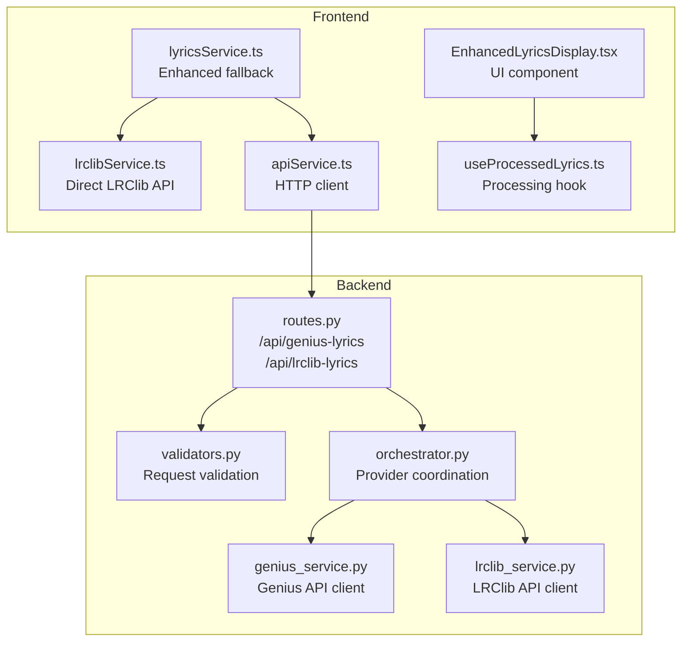
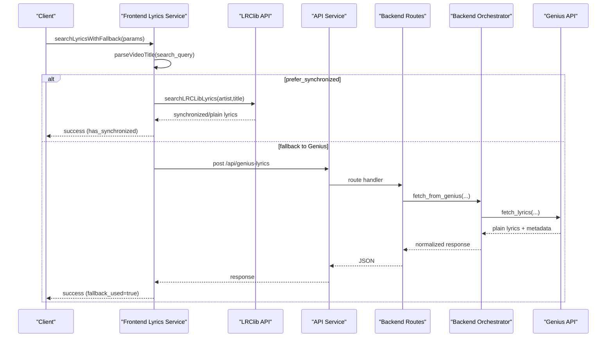
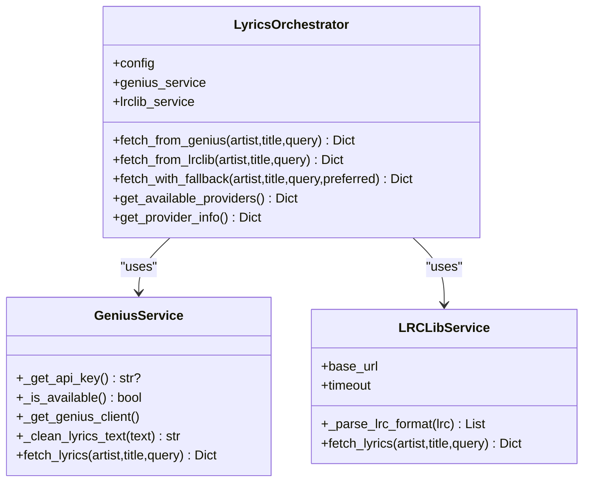
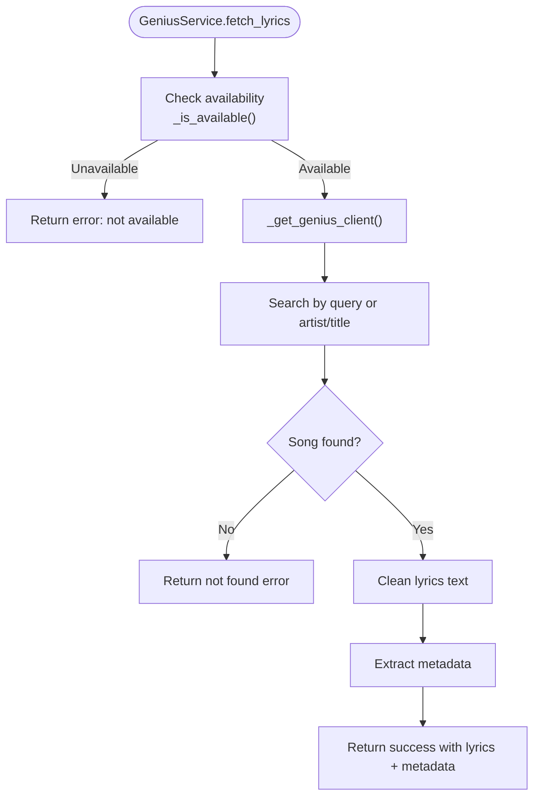
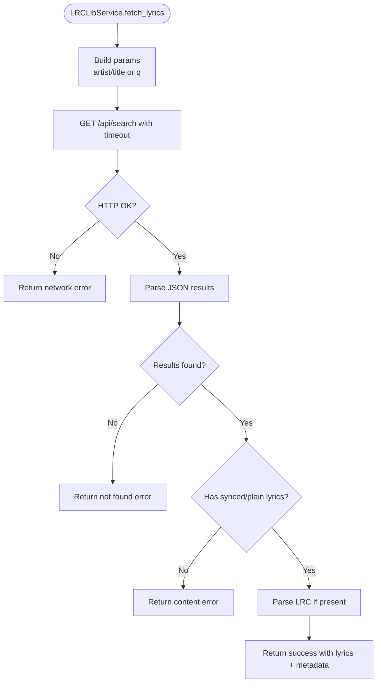
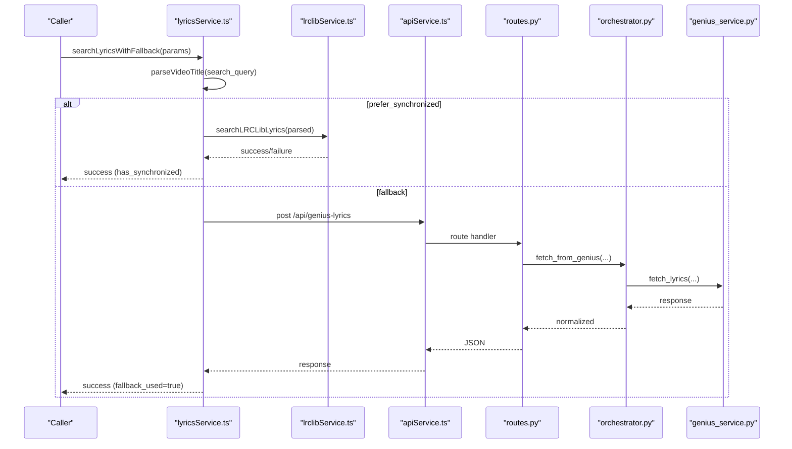
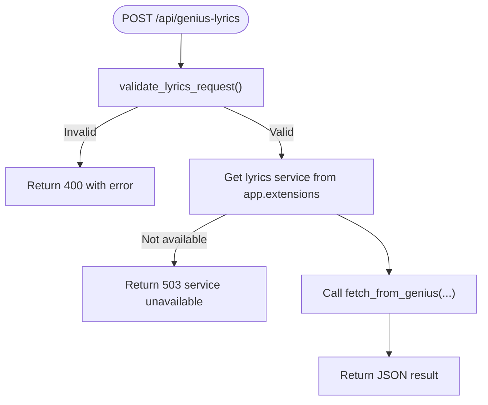
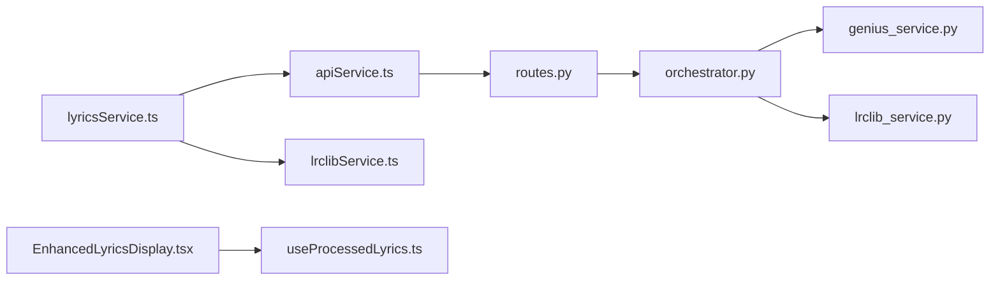

# Lyrics Services

<cite>
**Referenced Files in This Document**
- [orchestrator.py](file://python_backend/services/lyrics/orchestrator.py)
- [genius_service.py](file://python_backend/services/lyrics/genius_service.py)
- [lrclib_service.py](file://python_backend/services/lyrics/lrclib_service.py)
- [routes.py](file://python_backend/blueprints/lyrics/routes.py)
- [validators.py](file://python_backend/blueprints/lyrics/validators.py)
- [lyricsService.ts](file://src/services/lyrics/lyricsService.ts)
- [lrclibService.ts](file://src/services/lyrics/lrclibService.ts)
- [apiService.ts](file://src/services/api/apiService.ts)
- [EnhancedLyricsDisplay.tsx](file://src/components/lyrics/EnhancedLyricsDisplay.tsx)
- [useProcessedLyrics.ts](file://src/hooks/lyrics/useProcessedLyrics.ts)
</cite>

## Table of Contents
1. [Introduction](#introduction)
2. [Project Structure](#project-structure)
3. [Core Components](#core-components)
4. [Architecture Overview](#architecture-overview)
5. [Detailed Component Analysis](#detailed-component-analysis)
6. [Dependency Analysis](#dependency-analysis)
7. [Performance Considerations](#performance-considerations)
8. [Troubleshooting Guide](#troubleshooting-guide)
9. [Conclusion](#conclusion)

## Introduction
This document describes the lyrics services component of the ChordMiniApp, focusing on the enhanced lyrics search system with intelligent fallback between LRClib and Genius APIs. It explains service availability checking, timeout handling, health monitoring, search parameters, response formats, fallback strategies, error handling patterns, and practical integration examples. It also covers common issues such as API rate limits, service unavailability, and search accuracy problems.

## Project Structure
The lyrics services span both the Python backend and the Next.js frontend:
- Backend: Flask blueprint exposing endpoints for Genius and LRClib, with orchestration and validation utilities.
- Frontend: TypeScript services implementing fallback logic, service health checks, and UI integration.

**Diagram sources**
- [lyricsService.ts:1-197](file://src/services/lyrics/lyricsService.ts#L1-L197)
- [lrclibService.ts:1-266](file://src/services/lyrics/lrclibService.ts#L1-L266)
- [apiService.ts:1-407](file://src/services/api/apiService.ts#L1-L407)
- [routes.py:1-126](file://python_backend/blueprints/lyrics/routes.py#L1-L126)
- [validators.py:1-146](file://python_backend/blueprints/lyrics/validators.py#L1-L146)
- [orchestrator.py:1-184](file://python_backend/services/lyrics/orchestrator.py#L1-L184)
- [genius_service.py:1-215](file://python_backend/services/lyrics/genius_service.py#L1-L215)
- [lrclib_service.py:1-172](file://python_backend/services/lyrics/lrclib_service.py#L1-L172)
- [EnhancedLyricsDisplay.tsx:1-231](file://src/components/lyrics/EnhancedLyricsDisplay.tsx#L1-L231)
- [useProcessedLyrics.ts:1-484](file://src/hooks/lyrics/useProcessedLyrics.ts#L1-L484)

**Section sources**
- [lyricsService.ts:1-197](file://src/services/lyrics/lyricsService.ts#L1-L197)
- [lrclibService.ts:1-266](file://src/services/lyrics/lrclibService.ts#L1-L266)
- [apiService.ts:1-407](file://src/services/api/apiService.ts#L1-L407)
- [routes.py:1-126](file://python_backend/blueprints/lyrics/routes.py#L1-L126)
- [validators.py:1-146](file://python_backend/blueprints/lyrics/validators.py#L1-L146)
- [orchestrator.py:1-184](file://python_backend/services/lyrics/orchestrator.py#L1-L184)
- [genius_service.py:1-215](file://python_backend/services/lyrics/genius_service.py#L1-L215)
- [lrclib_service.py:1-172](file://python_backend/services/lyrics/lrclib_service.py#L1-L172)
- [EnhancedLyricsDisplay.tsx:1-231](file://src/components/lyrics/EnhancedLyricsDisplay.tsx#L1-L231)
- [useProcessedLyrics.ts:1-484](file://src/hooks/lyrics/useProcessedLyrics.ts#L1-L484)

## Core Components
- Backend Orchestrator: Coordinates Genius and LRClib, normalizes responses, and exposes availability and provider info.
- Genius Service: Fetches plain lyrics and metadata via the Genius API (requires API key).
- LRClib Service: Fetches synchronized lyrics (LRC) and plain lyrics via lrclib.net API.
- Frontend Lyrics Service: Implements intelligent fallback, service health checks, and parameter parsing.
- Frontend LRClib Service: Direct LRClib API calls with multiple search strategies and LRC parsing.
- API Service: Centralized HTTP client with timeouts, retries, rate-limit handling, and App Check token injection.
- UI Components: Display lyrics with chords and handle timing-aware rendering.

**Section sources**
- [orchestrator.py:14-184](file://python_backend/services/lyrics/orchestrator.py#L14-L184)
- [genius_service.py:14-215](file://python_backend/services/lyrics/genius_service.py#L14-L215)
- [lrclib_service.py:14-172](file://python_backend/services/lyrics/lrclib_service.py#L14-L172)
- [lyricsService.ts:21-197](file://src/services/lyrics/lyricsService.ts#L21-L197)
- [lrclibService.ts:19-266](file://src/services/lyrics/lrclibService.ts#L19-L266)
- [apiService.ts:29-407](file://src/services/api/apiService.ts#L29-L407)

## Architecture Overview
The system supports two complementary flows:
- Backend-first flow: Clients call backend endpoints for Genius or LRClib, validated and rate-limited.
- Frontend-first flow: Clients call frontend services that coordinate fallback between LRClib and Genius, with health checks and robust error handling.

**Diagram sources**
- [lyricsService.ts:72-172](file://src/services/lyrics/lyricsService.ts#L72-L172)
- [lrclibService.ts:32-145](file://src/services/lyrics/lrclibService.ts#L32-L145)
- [apiService.ts:348-366](file://src/services/api/apiService.ts#L348-L366)
- [routes.py:22-72](file://python_backend/blueprints/lyrics/routes.py#L22-L72)
- [orchestrator.py:33-62](file://python_backend/services/lyrics/orchestrator.py#L33-L62)
- [genius_service.py:135-215](file://python_backend/services/lyrics/genius_service.py#L135-L215)

## Detailed Component Analysis

### Backend Orchestrator
- Responsibilities:
  - Initialize Genius and LRClib services.
  - Provide provider-specific fetch wrappers with standardized result shape.
  - Implement fallback ordering and error aggregation.
  - Expose provider availability and metadata.
- Key behaviors:
  - Adds provider and found flags to results.
  - Moves preferred provider to front of fallback list.
  - Returns unified error with providers_tried when all fail.

**Diagram sources**
- [orchestrator.py:14-184](file://python_backend/services/lyrics/orchestrator.py#L14-L184)
- [genius_service.py:14-215](file://python_backend/services/lyrics/genius_service.py#L14-L215)
- [lrclib_service.py:14-172](file://python_backend/services/lyrics/lrclib_service.py#L14-L172)

**Section sources**
- [orchestrator.py:14-184](file://python_backend/services/lyrics/orchestrator.py#L14-L184)

### Genius Service
- Responsibilities:
  - Validate availability (lyricsgenius import and API key).
  - Build Genius client with configured options.
  - Search song by query or artist/title.
  - Clean and normalize lyrics text.
  - Return standardized response with metadata and source.
- Availability:
  - Requires lyricsgenius library and a valid API key (via header or environment).

**Diagram sources**
- [genius_service.py:135-215](file://python_backend/services/lyrics/genius_service.py#L135-L215)

**Section sources**
- [genius_service.py:14-215](file://python_backend/services/lyrics/genius_service.py#L14-L215)

### LRClib Service
- Responsibilities:
  - Search synchronized lyrics via lrclib.net API.
  - Parse LRC-formatted synchronized lyrics into time-stamped lines.
  - Return combined plain and synchronized lyrics with metadata.
- Timeout handling:
  - Uses a fixed timeout for HTTP requests.

**Diagram sources**
- [lrclib_service.py:76-172](file://python_backend/services/lyrics/lrclib_service.py#L76-L172)

**Section sources**
- [lrclib_service.py:14-172](file://python_backend/services/lyrics/lrclib_service.py#L14-L172)

### Frontend Lyrics Service (Intelligent Fallback)
- Responsibilities:
  - Parse video titles into artist/title when needed.
  - Prefer synchronized lyrics when requested.
  - Attempt LRClib search directly; if unsuccessful, call backend Genius endpoint.
  - Normalize responses into a single interface with metadata and source.
  - Provide service health checks using HEAD requests and OPTIONS probing.
- Timeout handling:
  - Uses centralized API service with explicit timeouts.
- Error handling:
  - Catches and logs failures, returns a unified error payload.

**Diagram sources**
- [lyricsService.ts:72-172](file://src/services/lyrics/lyricsService.ts#L72-L172)
- [lrclibService.ts:32-145](file://src/services/lyrics/lrclibService.ts#L32-L145)
- [apiService.ts:348-366](file://src/services/api/apiService.ts#L348-L366)
- [routes.py:22-72](file://python_backend/blueprints/lyrics/routes.py#L22-L72)
- [orchestrator.py:33-62](file://python_backend/services/lyrics/orchestrator.py#L33-L62)
- [genius_service.py:135-215](file://python_backend/services/lyrics/genius_service.py#L135-L215)

**Section sources**
- [lyricsService.ts:1-197](file://src/services/lyrics/lyricsService.ts#L1-L197)
- [lrclibService.ts:1-266](file://src/services/lyrics/lrclibService.ts#L1-L266)
- [apiService.ts:1-407](file://src/services/api/apiService.ts#L1-L407)

### Backend Routes and Validation
- Endpoints:
  - POST /api/genius-lyrics: Calls backend Genius service.
  - POST /api/lrclib-lyrics: Calls backend LRClib service.
- Validation:
  - Ensures JSON body, enforces presence of either search_query or both artist and title.
  - Applies length limits and sanitization.
- Rate limiting:
  - Uses Flask rate limiter with moderate_processing policy.

**Diagram sources**
- [routes.py:22-72](file://python_backend/blueprints/lyrics/routes.py#L22-L72)
- [validators.py:12-58](file://python_backend/blueprints/lyrics/validators.py#L12-L58)

**Section sources**
- [routes.py:1-126](file://python_backend/blueprints/lyrics/routes.py#L1-L126)
- [validators.py:1-146](file://python_backend/blueprints/lyrics/validators.py#L1-L146)

### Response Formats and Metadata
- Unified response shape (frontend):
  - success: boolean
  - has_synchronized: boolean
  - synchronized_lyrics: array of { time: number, text: string } (optional)
  - plain_lyrics: string (optional)
  - metadata: { title, artist, album?, duration?, source, genius_url?, genius_id?, thumbnail_url? }
  - source: string
  - error: string (optional)
  - fallback_used: boolean (optional)
- Backend responses:
  - Genius: lyrics + metadata (title, artist, album, release_date, genius_url, genius_id, thumbnail_url)
  - LRClib: has_synchronized, synchronized_lyrics (parsed), plain_lyrics, metadata (title, artist, album, duration, lrclib_id, instrumental)

**Section sources**
- [lyricsService.ts:21-39](file://src/services/lyrics/lyricsService.ts#L21-L39)
- [genius_service.py:190-206](file://python_backend/services/lyrics/genius_service.py#L190-L206)
- [lrclib_service.py:139-156](file://python_backend/services/lyrics/lrclib_service.py#L139-L156)

### Search Parameters and Video Title Parsing
- Backend:
  - Accepts artist, title, or search_query; validates and limits lengths.
- Frontend:
  - parseVideoTitle supports patterns like "Artist - Song", "Artist: Song", and "Song by Artist".
  - Falls back to treating the entire title as a search query.

**Section sources**
- [validators.py:12-58](file://python_backend/blueprints/lyrics/validators.py#L12-L58)
- [lrclibService.ts:228-265](file://src/services/lyrics/lrclibService.ts#L228-L265)

### Service Health Monitoring
- Frontend health check:
  - checkLyricsServicesHealth probes lrclib.net and the backend Genius endpoint.
  - Returns boolean flags for lrclib, genius, and overall availability.
- Backend provider info:
  - get_provider_info returns availability and feature sets for each provider.

**Section sources**
- [lyricsService.ts:177-196](file://src/services/lyrics/lyricsService.ts#L177-L196)
- [orchestrator.py:161-183](file://python_backend/services/lyrics/orchestrator.py#L161-L183)

### Practical Examples and Integration Patterns
- Example 1: Search with synchronized lyrics preferred
  - Call searchLyricsWithFallback({ artist, title, prefer_synchronized: true })
  - If LRClib succeeds, return synchronized lyrics; otherwise, fallback to Genius.
- Example 2: Search using a video title
  - Call searchLyricsWithFallback({ search_query: "Artist - Song Title" })
  - Internally parses title into artist/title and proceeds.
- Example 3: Backend integration
  - POST /api/genius-lyrics with { artist, title } or { search_query }
  - POST /api/lrclib-lyrics with { artist, title }

**Section sources**
- [lyricsService.ts:72-172](file://src/services/lyrics/lyricsService.ts#L72-L172)
- [apiService.ts:348-384](file://src/services/api/apiService.ts#L348-L384)
- [routes.py:22-126](file://python_backend/blueprints/lyrics/routes.py#L22-L126)

## Dependency Analysis
- Frontend-to-Backend:
  - Frontend lyricsService.ts calls apiService.ts, which posts to backend routes.
  - Backend routes delegate to orchestrator.py, which uses genius_service.py and lrclib_service.py.
- Frontend-to-Frontend:
  - lyricsService.ts optionally calls lrclibService.ts directly for synchronized lyrics.
- UI Integration:
  - EnhancedLyricsDisplay.tsx renders lyrics with chords.
  - useProcessedLyrics.ts merges chords, lyrics, and segmentation data.

**Diagram sources**
- [lyricsService.ts:1-197](file://src/services/lyrics/lyricsService.ts#L1-L197)
- [lrclibService.ts:1-266](file://src/services/lyrics/lrclibService.ts#L1-L266)
- [apiService.ts:1-407](file://src/services/api/apiService.ts#L1-L407)
- [routes.py:1-126](file://python_backend/blueprints/lyrics/routes.py#L1-L126)
- [orchestrator.py:1-184](file://python_backend/services/lyrics/orchestrator.py#L1-L184)
- [genius_service.py:1-215](file://python_backend/services/lyrics/genius_service.py#L1-L215)
- [lrclib_service.py:1-172](file://python_backend/services/lyrics/lrclib_service.py#L1-L172)
- [EnhancedLyricsDisplay.tsx:1-231](file://src/components/lyrics/EnhancedLyricsDisplay.tsx#L1-L231)
- [useProcessedLyrics.ts:1-484](file://src/hooks/lyrics/useProcessedLyrics.ts#L1-L484)

**Section sources**
- [lyricsService.ts:1-197](file://src/services/lyrics/lyricsService.ts#L1-L197)
- [apiService.ts:1-407](file://src/services/api/apiService.ts#L1-L407)
- [routes.py:1-126](file://python_backend/blueprints/lyrics/routes.py#L1-L126)
- [orchestrator.py:1-184](file://python_backend/services/lyrics/orchestrator.py#L1-L184)
- [genius_service.py:1-215](file://python_backend/services/lyrics/genius_service.py#L1-L215)
- [lrclib_service.py:1-172](file://python_backend/services/lyrics/lrclib_service.py#L1-L172)
- [EnhancedLyricsDisplay.tsx:1-231](file://src/components/lyrics/EnhancedLyricsDisplay.tsx#L1-L231)
- [useProcessedLyrics.ts:1-484](file://src/hooks/lyrics/useProcessedLyrics.ts#L1-L484)

## Performance Considerations
- Timeout tuning:
  - LRClib service uses a fixed timeout; adjust as needed for reliability.
  - API service applies per-request timeouts and retries for transient failures.
- Client-side throttling:
  - UI auto-scroll is throttled to reduce competing animations.
- Deduplication and merging:
  - Chord markers are deduplicated and merged with lyrics to minimize rendering overhead.

[No sources needed since this section provides general guidance]

## Troubleshooting Guide
Common issues and resolutions:
- API rate limits:
  - Backend endpoints are rate-limited; frontend apiService.ts surfaces 429 with Retry-After.
  - Consider reducing request frequency or using caching strategies.
- Service unavailability:
  - Genius requires lyricsgenius and a valid API key; check availability via backend provider info.
  - LRClib may be unreachable; use frontend checkLyricsServicesHealth to monitor.
- Search accuracy:
  - Video titles may need parsing; use parseVideoTitle to extract artist/title.
  - LRClib supports multiple strategies: specific artist/title, swapped fields, and general query.
- Network errors:
  - API service detects AbortError and network errors; surface user-friendly messages.
- Backend errors:
  - Routes.py returns 503 when service is unavailable and logs detailed errors.

**Section sources**
- [apiService.ts:138-240](file://src/services/api/apiService.ts#L138-L240)
- [routes.py:42-47](file://python_backend/blueprints/lyrics/routes.py#L42-L47)
- [genius_service.py:44-56](file://python_backend/services/lyrics/genius_service.py#L44-L56)
- [lyricsService.ts:177-196](file://src/services/lyrics/lyricsService.ts#L177-L196)
- [lrclibService.ts:91-145](file://src/services/lyrics/lrclibService.ts#L91-L145)

## Conclusion
The lyrics services component provides a robust, resilient system for fetching lyrics from multiple providers. The frontend orchestrates intelligent fallback between LRClib and Genius, with health monitoring and strong error handling. The backend offers validated endpoints with rate limiting and standardized responses. Together, they deliver a reliable user experience for synchronized and plain lyrics, with clear fallback strategies and monitoring capabilities.