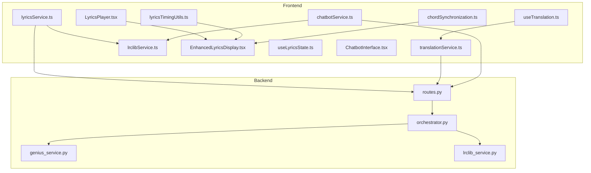
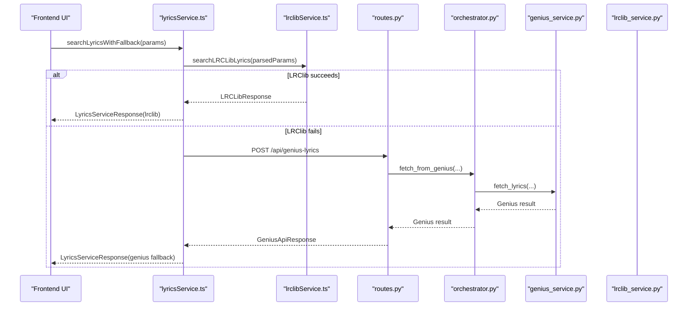
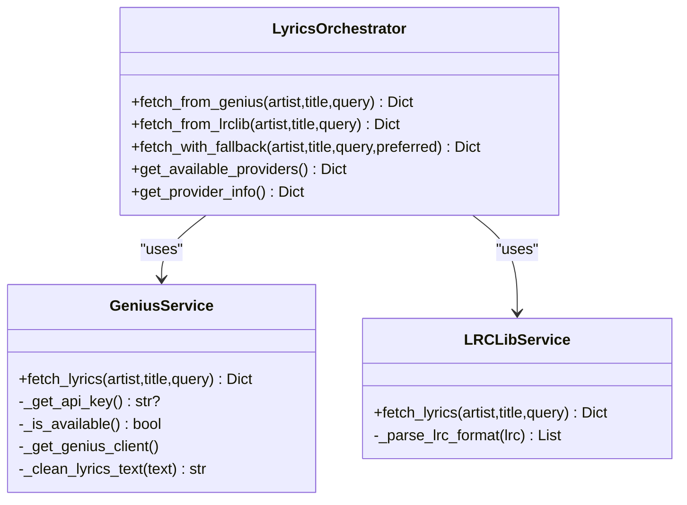
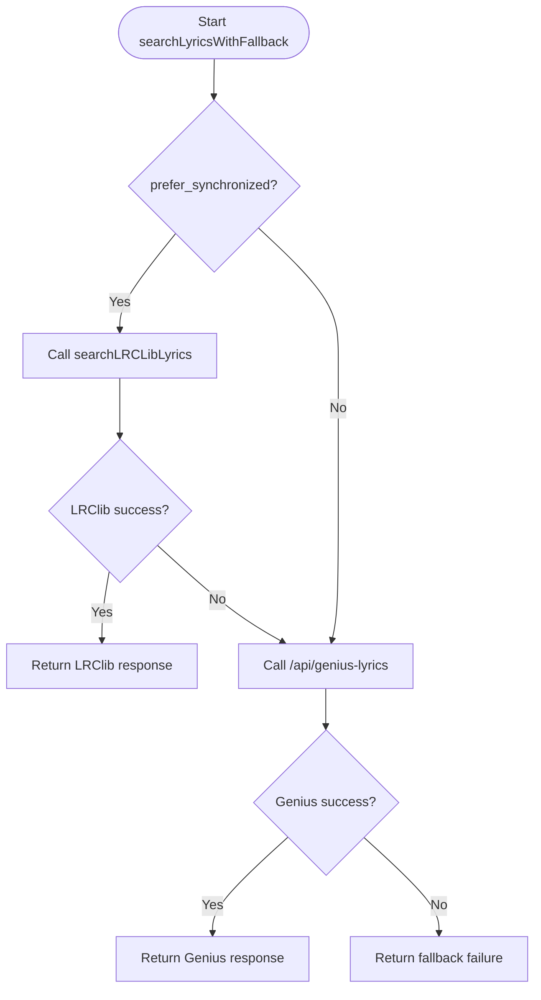
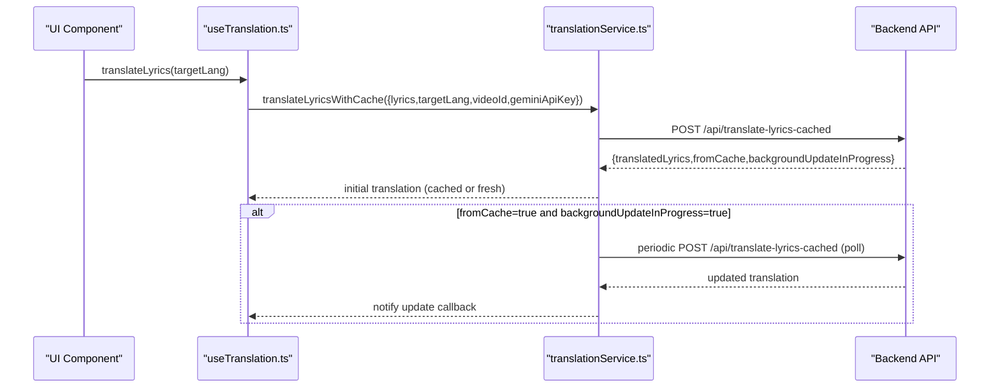
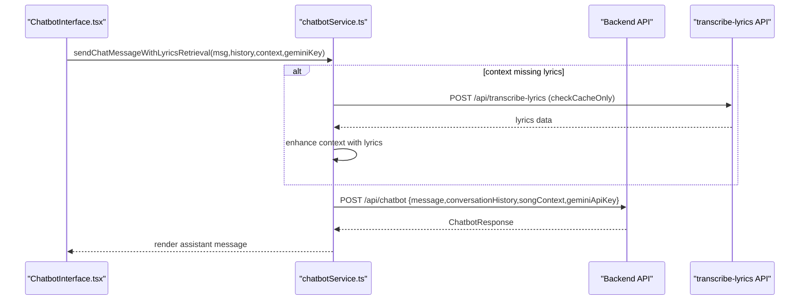
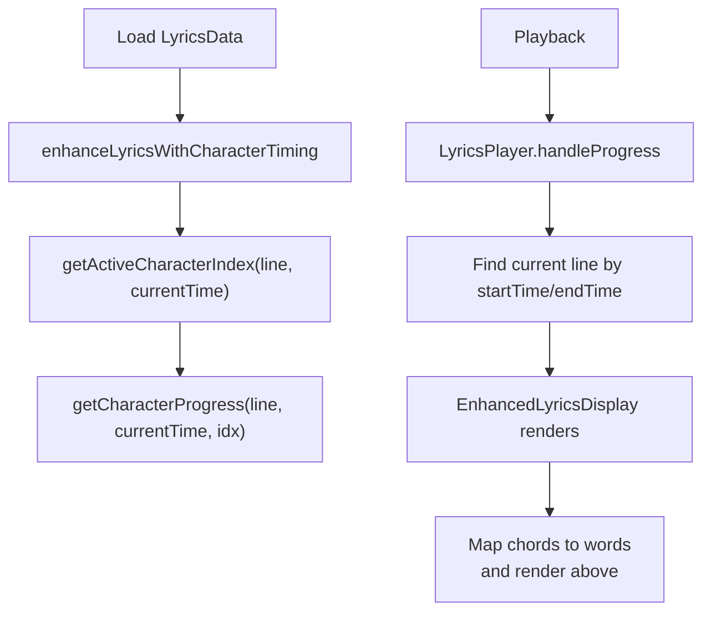
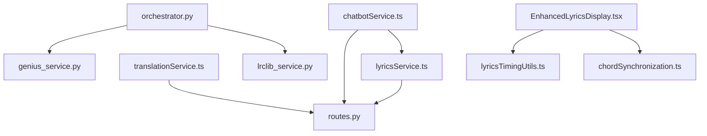

# Lyrics and Text Processing

<cite>
**Referenced Files in This Document**
- [orchestrator.py](file://python_backend/services/lyrics/orchestrator.py)
- [genius_service.py](file://python_backend/services/lyrics/genius_service.py)
- [lrclib_service.py](file://python_backend/services/lyrics/lrclib_service.py)
- [routes.py](file://python_backend/blueprints/lyrics/routes.py)
- [translationService.ts](file://src/services/lyrics/translationService.ts)
- [lyricsService.ts](file://src/services/lyrics/lyricsService.ts)
- [lrclibService.ts](file://src/services/lyrics/lrclibService.ts)
- [chatbotService.ts](file://src/services/api/chatbotService.ts)
- [ChatbotInterface.tsx](file://src/components/chatbot/ChatbotInterface.tsx)
- [useTranslation.ts](file://src/hooks/lyrics/useTranslation.ts)
- [useLyricsState.ts](file://src/hooks/lyrics/useLyricsState.ts)
- [lyricsTimingUtils.ts](file://src/utils/lyricsTimingUtils.ts)
- [LyricsPlayer.tsx](file://src/components/lyrics/LyricsPlayer.tsx)
- [EnhancedLyricsDisplay.tsx](file://src/components/lyrics/EnhancedLyricsDisplay.tsx)
- [chordSynchronization.ts](file://src/utils/chordSynchronization.ts)
</cite>

## Table of Contents
1. [Introduction](#introduction)
2. [Project Structure](#project-structure)
3. [Core Components](#core-components)
4. [Architecture Overview](#architecture-overview)
5. [Detailed Component Analysis](#detailed-component-analysis)
6. [Dependency Analysis](#dependency-analysis)
7. [Performance Considerations](#performance-considerations)
8. [Troubleshooting Guide](#troubleshooting-guide)
9. [Conclusion](#conclusion)
10. [Appendices](#appendices)

## Introduction
This document explains the lyrics and text processing capabilities in ChordMiniApp, focusing on:
- Lyrics services: Genius API integration, LRClib synchronization, and fallback orchestration
- Translation services: cache-first approach, background updates, language selection, and quality considerations
- Chatbot integration with Gemini AI: contextual formatting, lyrics retrieval, error handling, and segmentation requests
- Lyrics synchronization system: timing alignment, display components, and user interaction
- Text processing pipeline: lyrics formatting, chord synchronization, and display optimization
- External API integrations and offline/offline-friendly fallback strategies
- Troubleshooting guidance for connectivity, translation accuracy, and synchronization timing
- Experimental features and limitations

## Project Structure
The lyrics and text processing features span both the frontend and backend:
- Frontend services and UI components for lyrics search, display, translation, and chatbot
- Backend services for Genius and LRClib, with Flask routes and orchestration
- Shared utilities for timing, synchronization, and UI hooks

**Diagram sources**
- [lyricsService.ts:1-197](file://src/services/lyrics/lyricsService.ts#L1-L197)
- [translationService.ts:1-255](file://src/services/lyrics/translationService.ts#L1-L255)
- [lrclibService.ts:1-266](file://src/services/lyrics/lrclibService.ts#L1-L266)
- [LyricsPlayer.tsx:1-203](file://src/components/lyrics/LyricsPlayer.tsx#L1-L203)
- [EnhancedLyricsDisplay.tsx:1-231](file://src/components/lyrics/EnhancedLyricsDisplay.tsx#L1-L231)
- [useTranslation.ts:1-179](file://src/hooks/lyrics/useTranslation.ts#L1-L179)
- [useLyricsState.ts:1-91](file://src/hooks/lyrics/useLyricsState.ts#L1-L91)
- [chatbotService.ts:1-285](file://src/services/api/chatbotService.ts#L1-L285)
- [ChatbotInterface.tsx:1-203](file://src/components/chatbot/ChatbotInterface.tsx#L1-L203)
- [lyricsTimingUtils.ts:1-213](file://src/utils/lyricsTimingUtils.ts#L1-L213)
- [chordSynchronization.ts:1-112](file://src/utils/chordSynchronization.ts#L1-L112)
- [routes.py:1-126](file://python_backend/blueprints/lyrics/routes.py#L1-L126)
- [orchestrator.py:1-184](file://python_backend/services/lyrics/orchestrator.py#L1-L184)
- [genius_service.py:1-215](file://python_backend/services/lyrics/genius_service.py#L1-L215)
- [lrclib_service.py:1-172](file://python_backend/services/lyrics/lrclib_service.py#L1-L172)

**Section sources**
- [lyricsService.ts:1-197](file://src/services/lyrics/lyricsService.ts#L1-L197)
- [translationService.ts:1-255](file://src/services/lyrics/translationService.ts#L1-L255)
- [lrclibService.ts:1-266](file://src/services/lyrics/lrclibService.ts#L1-L266)
- [LyricsPlayer.tsx:1-203](file://src/components/lyrics/LyricsPlayer.tsx#L1-L203)
- [EnhancedLyricsDisplay.tsx:1-231](file://src/components/lyrics/EnhancedLyricsDisplay.tsx#L1-L231)
- [useTranslation.ts:1-179](file://src/hooks/lyrics/useTranslation.ts#L1-L179)
- [useLyricsState.ts:1-91](file://src/hooks/lyrics/useLyricsState.ts#L1-L91)
- [chatbotService.ts:1-285](file://src/services/api/chatbotService.ts#L1-L285)
- [ChatbotInterface.tsx:1-203](file://src/components/chatbot/ChatbotInterface.tsx#L1-L203)
- [lyricsTimingUtils.ts:1-213](file://src/utils/lyricsTimingUtils.ts#L1-L213)
- [chordSynchronization.ts:1-112](file://src/utils/chordSynchronization.ts#L1-L112)
- [routes.py:1-126](file://python_backend/blueprints/lyrics/routes.py#L1-L126)
- [orchestrator.py:1-184](file://python_backend/services/lyrics/orchestrator.py#L1-L184)
- [genius_service.py:1-215](file://python_backend/services/lyrics/genius_service.py#L1-L215)
- [lrclib_service.py:1-172](file://python_backend/services/lyrics/lrclib_service.py#L1-L172)

## Core Components
- Backend lyrics orchestration and providers:
  - Genius API service with client configuration, search, and cleaning
  - LRClib service with LRC parsing and metadata extraction
  - Orchestrator coordinating provider selection and fallback
  - Flask routes exposing endpoints for Genius and LRClib
- Frontend lyrics and translation:
  - Lyrics service with fallback between LRClib and Genius
  - Translation service with cache-first strategy and background updates
  - UI components for lyrics display and player integration
  - Hooks for translation and lyrics state management
- Chatbot integration:
  - Chatbot service with context formatting, lyrics retrieval, and error handling
  - UI chatbot panel with message lifecycle and API key integration
- Timing and synchronization:
  - Lyrics timing utilities for character-level timing
  - Chord-to-beat synchronization utilities

**Section sources**
- [orchestrator.py:14-184](file://python_backend/services/lyrics/orchestrator.py#L14-L184)
- [genius_service.py:14-215](file://python_backend/services/lyrics/genius_service.py#L14-L215)
- [lrclib_service.py:14-172](file://python_backend/services/lyrics/lrclib_service.py#L14-L172)
- [routes.py:22-126](file://python_backend/blueprints/lyrics/routes.py#L22-L126)
- [lyricsService.ts:1-197](file://src/services/lyrics/lyricsService.ts#L1-L197)
- [translationService.ts:1-255](file://src/services/lyrics/translationService.ts#L1-L255)
- [lrclibService.ts:1-266](file://src/services/lyrics/lrclibService.ts#L1-L266)
- [chatbotService.ts:1-285](file://src/services/api/chatbotService.ts#L1-L285)
- [ChatbotInterface.tsx:1-203](file://src/components/chatbot/ChatbotInterface.tsx#L1-L203)
- [useTranslation.ts:1-179](file://src/hooks/lyrics/useTranslation.ts#L1-L179)
- [useLyricsState.ts:1-91](file://src/hooks/lyrics/useLyricsState.ts#L1-L91)
- [lyricsTimingUtils.ts:1-213](file://src/utils/lyricsTimingUtils.ts#L1-L213)
- [chordSynchronization.ts:1-112](file://src/utils/chordSynchronization.ts#L1-L112)

## Architecture Overview
The system integrates frontend services with backend providers to deliver lyrics and translations, and to power the chatbot with contextual song data.

**Diagram sources**
- [lyricsService.ts:72-172](file://src/services/lyrics/lyricsService.ts#L72-L172)
- [lrclibService.ts:32-145](file://src/services/lyrics/lrclibService.ts#L32-L145)
- [routes.py:22-73](file://python_backend/blueprints/lyrics/routes.py#L22-L73)
- [orchestrator.py:33-62](file://python_backend/services/lyrics/orchestrator.py#L33-L62)
- [genius_service.py:135-215](file://python_backend/services/lyrics/genius_service.py#L135-L215)

## Detailed Component Analysis

### Backend Lyrics Orchestration and Providers
- Orchestrator:
  - Coordinates Genius and LRClib, exposes provider info, and supports preferred provider selection with fallback
  - Adds provider metadata to results and aggregates failures
- Genius Service:
  - Loads API key from headers or environment, configures client, searches songs, cleans lyrics, and returns metadata
  - Handles availability checks and exceptions
- LRClib Service:
  - Parses LRC-formatted synchronized lyrics, extracts metadata, and normalizes responses
  - Implements robust error handling for network and parsing errors

**Diagram sources**
- [orchestrator.py:14-184](file://python_backend/services/lyrics/orchestrator.py#L14-L184)
- [genius_service.py:14-215](file://python_backend/services/lyrics/genius_service.py#L14-L215)
- [lrclib_service.py:14-172](file://python_backend/services/lyrics/lrclib_service.py#L14-L172)

**Section sources**
- [orchestrator.py:14-184](file://python_backend/services/lyrics/orchestrator.py#L14-L184)
- [genius_service.py:14-215](file://python_backend/services/lyrics/genius_service.py#L14-L215)
- [lrclib_service.py:14-172](file://python_backend/services/lyrics/lrclib_service.py#L14-L172)
- [routes.py:22-126](file://python_backend/blueprints/lyrics/routes.py#L22-L126)

### Frontend Lyrics Services and Fallback
- Lyrics Service:
  - Intelligent fallback: tries LRClib first (with synchronized lyrics preference), then falls back to Genius
  - Health checks for service availability
  - Normalizes responses with metadata and source attribution
- LRClib Service:
  - Multiple search strategies: specific artist/title, swapped artist/title, and general query
  - Parses LRC timestamps and extracts metadata
  - Provides helpers to find current line and parse titles from video metadata

**Diagram sources**
- [lyricsService.ts:72-172](file://src/services/lyrics/lyricsService.ts#L72-L172)
- [lrclibService.ts:32-145](file://src/services/lyrics/lrclibService.ts#L32-L145)
- [routes.py:22-73](file://python_backend/blueprints/lyrics/routes.py#L22-L73)

**Section sources**
- [lyricsService.ts:1-197](file://src/services/lyrics/lyricsService.ts#L1-L197)
- [lrclibService.ts:1-266](file://src/services/lyrics/lrclibService.ts#L1-L266)

### Translation Services: Cache-First and Background Updates
- Translation Service:
  - Cache-first approach: immediately returns cached translations if available
  - Background update polling: continues to poll for freshness with exponential backoff
  - Fallback to regular translation API when cache-first fails
  - Request key generation and callback management
- Frontend Integration:
  - Hook manages translation state, selected languages, and background update tracking
  - Dynamically imports translation service to avoid SSR issues
  - Integrates with Gemini API key from settings

**Diagram sources**
- [useTranslation.ts:74-164](file://src/hooks/lyrics/useTranslation.ts#L74-L164)
- [translationService.ts:48-241](file://src/services/lyrics/translationService.ts#L48-L241)

**Section sources**
- [translationService.ts:1-255](file://src/services/lyrics/translationService.ts#L1-L255)
- [useTranslation.ts:1-179](file://src/hooks/lyrics/useTranslation.ts#L1-L179)

### Chatbot Integration with Gemini AI
- Chatbot Service:
  - Sends messages to backend chatbot API with timeouts and error mapping
  - Formats comprehensive song context including beats, chords, lyrics, and translations
  - Retrieves lyrics on-demand for chatbot context
  - Validates context completeness and truncates conversation history
  - Requests SongFormer segmentation asynchronously
- Chatbot UI:
  - Floating panel with message history, markdown rendering, and error display
  - Auto-focus, dynamic textarea sizing, and send-on-Enter support
  - Integrates with API key management

**Diagram sources**
- [ChatbotInterface.tsx:48-75](file://src/components/chatbot/ChatbotInterface.tsx#L48-L75)
- [chatbotService.ts:17-231](file://src/services/api/chatbotService.ts#L17-L231)

**Section sources**
- [chatbotService.ts:1-285](file://src/services/api/chatbotService.ts#L1-L285)
- [ChatbotInterface.tsx:1-203](file://src/components/chatbot/ChatbotInterface.tsx#L1-L203)

### Lyrics Synchronization System and Display
- Lyrics Player:
  - Combines YouTube player with synchronized lyrics display
  - Tracks playback time, finds current line, and supports seeking
- Enhanced Lyrics Display:
  - Auto-scrolls to current line with throttling
  - Renders chords above words using word-position mapping
  - Click-to-seek integration
- Timing Utilities:
  - Enhances lyrics with character-level timing based on natural speech patterns
  - Calculates active character index and intra-character progress
- Chord Synchronization:
  - Aligns chords to beats using a two-pointer technique for performance and correctness
  - Forward-fills chord names across beats for consistent display

**Diagram sources**
- [lyricsTimingUtils.ts:36-213](file://src/utils/lyricsTimingUtils.ts#L36-L213)
- [LyricsPlayer.tsx:34-88](file://src/components/lyrics/LyricsPlayer.tsx#L34-L88)
- [EnhancedLyricsDisplay.tsx:25-138](file://src/components/lyrics/EnhancedLyricsDisplay.tsx#L25-L138)
- [chordSynchronization.ts:17-97](file://src/utils/chordSynchronization.ts#L17-L97)

**Section sources**
- [LyricsPlayer.tsx:1-203](file://src/components/lyrics/LyricsPlayer.tsx#L1-L203)
- [EnhancedLyricsDisplay.tsx:1-231](file://src/components/lyrics/EnhancedLyricsDisplay.tsx#L1-L231)
- [lyricsTimingUtils.ts:1-213](file://src/utils/lyricsTimingUtils.ts#L1-L213)
- [chordSynchronization.ts:1-112](file://src/utils/chordSynchronization.ts#L1-L112)

## Dependency Analysis
- Frontend-to-Backend:
  - Lyrics search uses LRClib directly in the browser, with fallback to backend Genius route
  - Translation uses cache-first endpoint, falling back to regular translation endpoint
  - Chatbot sends formatted context to backend and optionally retrieves lyrics via dedicated endpoint
- Provider Dependencies:
  - Genius requires lyricsgenius library and API key
  - LRClib relies on lrclib.net API and LRC parsing
- Internal Coupling:
  - Lyrics display depends on timing utilities and chord synchronization
  - Translation hook depends on translation service and API key management
  - Chatbot service depends on lyrics retrieval and segmentation services

**Diagram sources**
- [lyricsService.ts:1-197](file://src/services/lyrics/lyricsService.ts#L1-L197)
- [translationService.ts:1-255](file://src/services/lyrics/translationService.ts#L1-L255)
- [chatbotService.ts:1-285](file://src/services/api/chatbotService.ts#L1-L285)
- [routes.py:1-126](file://python_backend/blueprints/lyrics/routes.py#L1-L126)
- [orchestrator.py:1-184](file://python_backend/services/lyrics/orchestrator.py#L1-L184)
- [genius_service.py:1-215](file://python_backend/services/lyrics/genius_service.py#L1-L215)
- [lrclib_service.py:1-172](file://python_backend/services/lyrics/lrclib_service.py#L1-L172)
- [EnhancedLyricsDisplay.tsx:1-231](file://src/components/lyrics/EnhancedLyricsDisplay.tsx#L1-L231)
- [lyricsTimingUtils.ts:1-213](file://src/utils/lyricsTimingUtils.ts#L1-L213)
- [chordSynchronization.ts:1-112](file://src/utils/chordSynchronization.ts#L1-L112)

**Section sources**
- [lyricsService.ts:1-197](file://src/services/lyrics/lyricsService.ts#L1-L197)
- [translationService.ts:1-255](file://src/services/lyrics/translationService.ts#L1-L255)
- [chatbotService.ts:1-285](file://src/services/api/chatbotService.ts#L1-L285)
- [routes.py:1-126](file://python_backend/blueprints/lyrics/routes.py#L1-L126)
- [orchestrator.py:1-184](file://python_backend/services/lyrics/orchestrator.py#L1-L184)
- [genius_service.py:1-215](file://python_backend/services/lyrics/genius_service.py#L1-L215)
- [lrclib_service.py:1-172](file://python_backend/services/lyrics/lrclib_service.py#L1-L172)
- [EnhancedLyricsDisplay.tsx:1-231](file://src/components/lyrics/EnhancedLyricsDisplay.tsx#L1-L231)
- [lyricsTimingUtils.ts:1-213](file://src/utils/lyricsTimingUtils.ts#L1-L213)
- [chordSynchronization.ts:1-112](file://src/utils/chordSynchronization.ts#L1-L112)

## Performance Considerations
- Lyrics display:
  - Auto-scroll throttling prevents excessive smooth-scroll calls
  - Word-position mapping for chords reduces layout thrash
- Translation:
  - Cache-first with background polling minimizes perceived latency
  - Exponential backoff caps polling overhead
- Synchronization:
  - Two-pointer algorithm for chord-to-beat alignment improves performance over naive approaches
- Timing:
  - Natural speech-weighted character timing avoids uniform pacing for better readability

[No sources needed since this section provides general guidance]

## Troubleshooting Guide
- API Connectivity Issues:
  - Lyrics fallback: verify LRClib availability and Genius route health; check service availability and CORS
  - Translation: confirm cache-first endpoint is reachable; fallback to regular translation endpoint
  - Chatbot: inspect timeouts and error mapping; validate Gemini API key presence
- Translation Accuracy Problems:
  - Confirm source/target language selection and request payload
  - Check background update completion and cache freshness
- Synchronization Timing Challenges:
  - Validate line timing bounds and character timing calculations
  - Ensure chord-to-beat alignment is computed consistently with beat grid
- Offline Scenarios:
  - Prefer cache-first translation responses
  - Use cached lyrics when available; avoid forced transcription if not needed
  - Gracefully degrade UI when external APIs are unreachable

**Section sources**
- [lyricsService.ts:177-196](file://src/services/lyrics/lyricsService.ts#L177-L196)
- [translationService.ts:188-212](file://src/services/lyrics/translationService.ts#L188-L212)
- [chatbotService.ts:39-54](file://src/services/api/chatbotService.ts#L39-L54)
- [lyricsTimingUtils.ts:36-72](file://src/utils/lyricsTimingUtils.ts#L36-L72)
- [chordSynchronization.ts:17-97](file://src/utils/chordSynchronization.ts#L17-L97)

## Conclusion
ChordMiniApp’s lyrics and text processing stack combines robust frontend services with backend orchestration to deliver synchronized lyrics, translations, and AI-powered insights. The system emphasizes resilience through fallback strategies, performance through optimized algorithms, and user experience via precise timing and interactive displays. Experimental features are integrated with careful error handling and graceful degradation to maintain reliability under varying conditions.

[No sources needed since this section summarizes without analyzing specific files]

## Appendices
- Experimental Notes:
  - Translation cache-first and background update polling are designed to improve perceived performance and reduce repeated API calls
  - Chord-to-beat synchronization uses a deterministic two-pointer approach validated against prior implementations
  - Lyrics timing enhancements rely on natural speech heuristics; results may vary by content and pronunciation patterns

[No sources needed since this section provides general guidance]