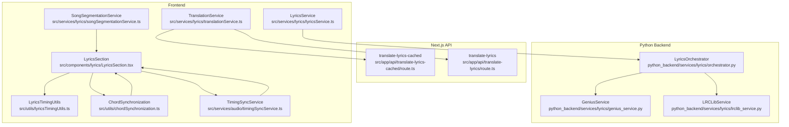
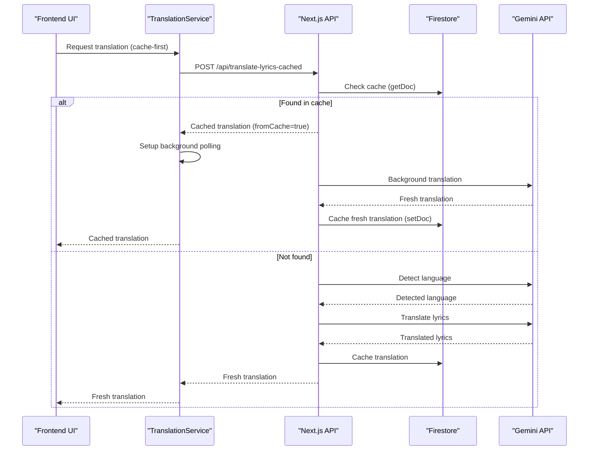
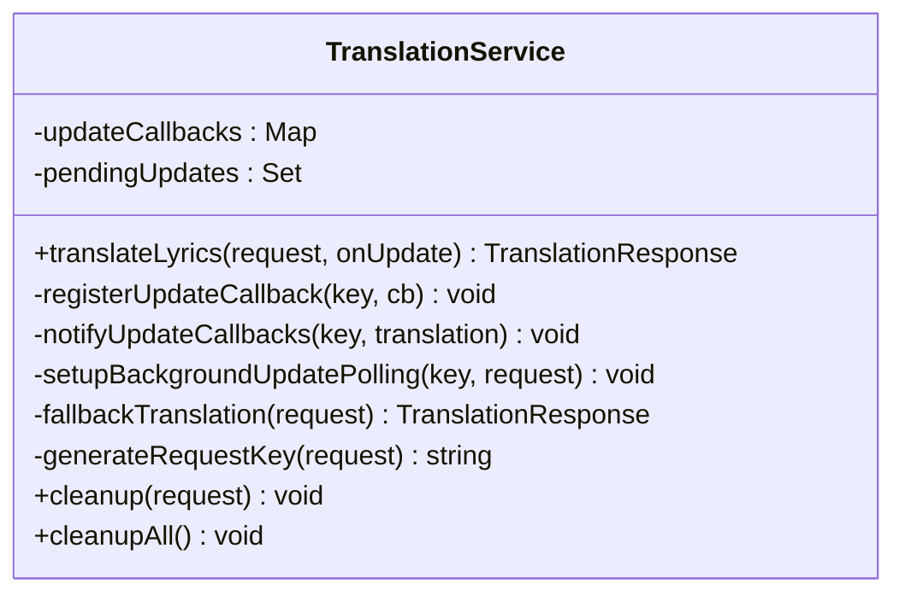
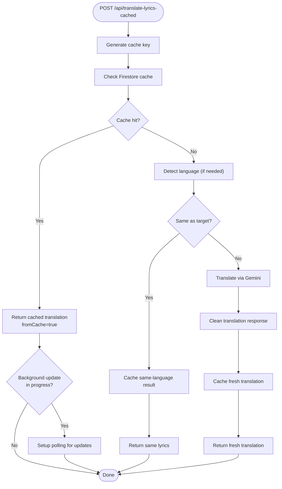
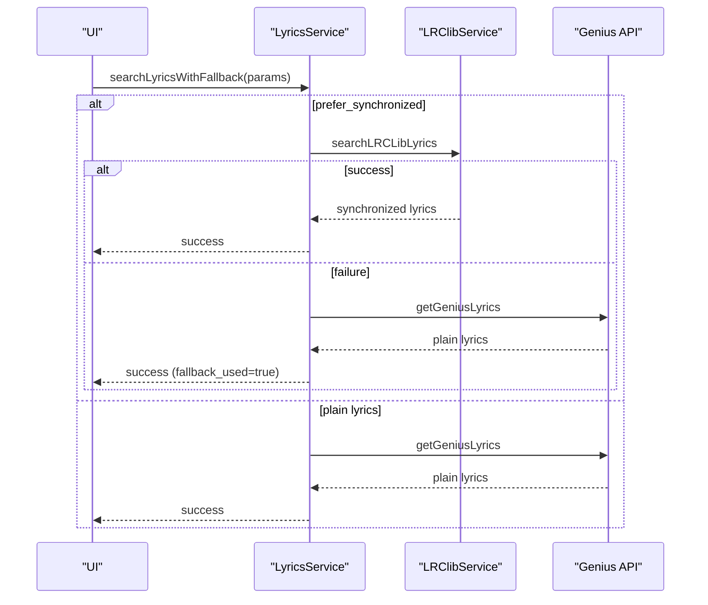
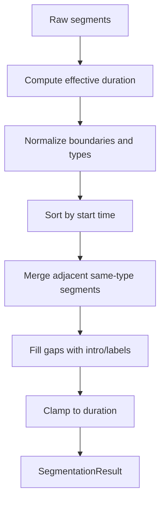
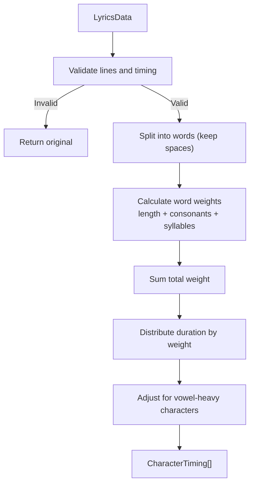
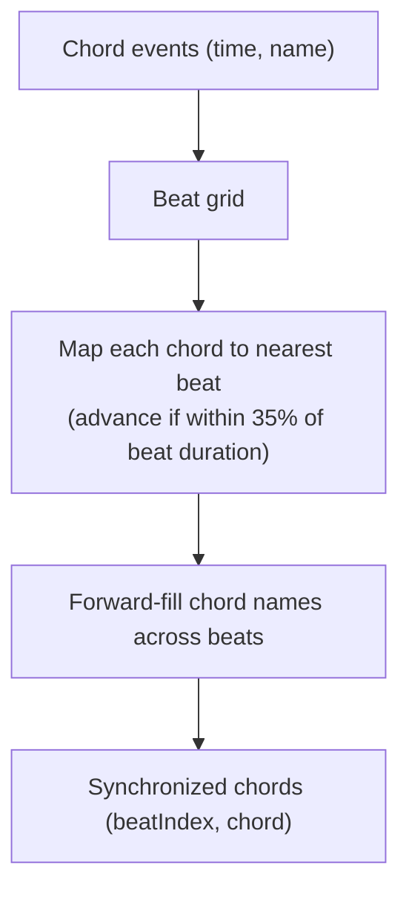
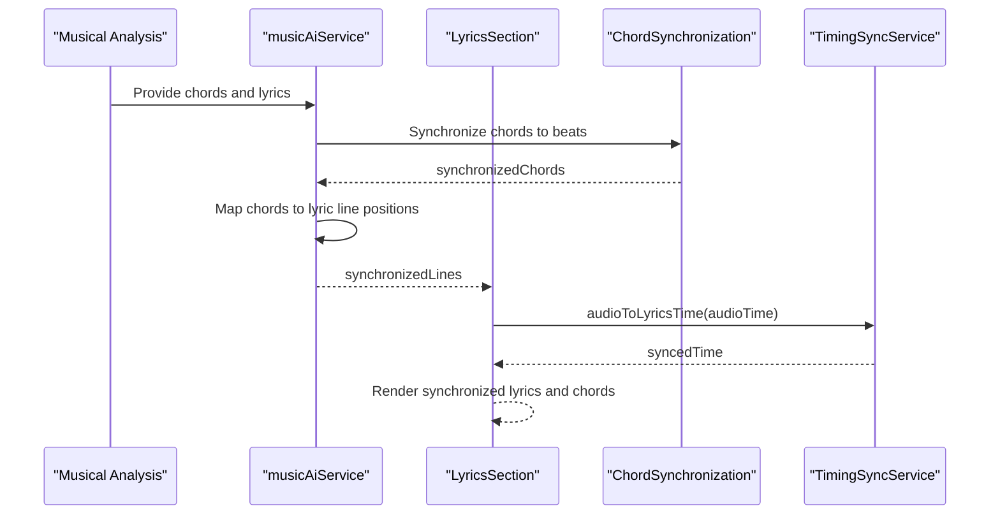
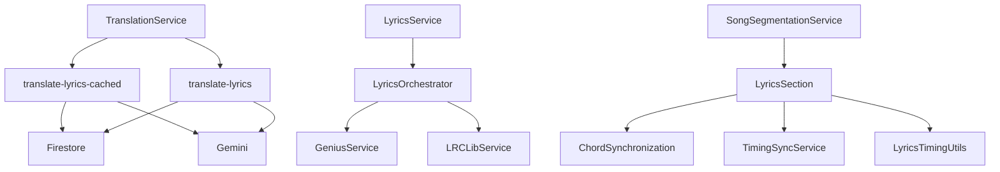

# Text Processing Pipeline

<cite>
**Referenced Files in This Document**
- [translationService.ts](file://src/services/lyrics/translationService.ts)
- [route.ts](file://src/app/api/translate-lyrics/route.ts)
- [route.ts](file://src/app/api/translate-lyrics-cached/route.ts)
- [orchestrator.py](file://python_backend/services/lyrics/orchestrator.py)
- [genius_service.py](file://python_backend/services/lyrics/genius_service.py)
- [lrclib_service.py](file://python_backend/services/lyrics/lrclib_service.py)
- [lyricsService.ts](file://src/services/lyrics/lyricsService.ts)
- [lyricsTimingUtils.ts](file://src/utils/lyricsTimingUtils.ts)
- [songSegmentationService.ts](file://src/services/lyrics/songSegmentationService.ts)
- [chordSynchronization.ts](file://src/utils/chordSynchronization.ts)
- [musicAiService.ts](file://src/services/lyrics/musicAiService.ts)
- [LyricsSection.tsx](file://src/components/lyrics/LyricsSection.tsx)
- [timingSyncService.ts](file://src/services/audio/timingSyncService.ts)
- [ProcessingContext.tsx](file://src/contexts/ProcessingContext.tsx)
</cite>

## Table of Contents
1. [Introduction](#introduction)
2. [Project Structure](#project-structure)
3. [Core Components](#core-components)
4. [Architecture Overview](#architecture-overview)
5. [Detailed Component Analysis](#detailed-component-analysis)
6. [Dependency Analysis](#dependency-analysis)
7. [Performance Considerations](#performance-considerations)
8. [Troubleshooting Guide](#troubleshooting-guide)
9. [Conclusion](#conclusion)
10. [Appendices](#appendices)

## Introduction
This document describes the text processing pipeline responsible for lyrics formatting, translation services, and synchronization mechanisms. It covers:
- Translation service with language detection, translation caching, and quality cleanup
- Song segmentation service for breaking songs into meaningful sections and integrating with lyrics timing
- Lyrics timing utilities for synchronization alignment, tempo mapping, and timing correction
- Chord synchronization system and how lyrics timing integrates with musical analysis results
- Text formatting pipeline including normalization, cleanup, and display optimization
- Caching strategies for translated lyrics and segmented content
- Performance considerations for large text processing operations and memory management
- Coordination between different text processing stages and error propagation handling
- Examples of typical text processing workflows and integration patterns

## Project Structure
The text processing pipeline spans frontend services, Next.js API routes, and Python backend services:
- Frontend translation orchestration and UI integration
- Next.js API routes implementing cache-first translation with Firestore caching
- Python backend lyrics orchestrator coordinating Genius and LRClib providers
- Utilities for lyrics timing, segmentation, and chord synchronization
- Audio timing synchronization service for cross-modal alignment

**Diagram sources**
- [translationService.ts:1-255](file://src/services/lyrics/translationService.ts#L1-L255)
- [route.ts:1-490](file://src/app/api/translate-lyrics-cached/route.ts#L1-L490)
- [route.ts:29-405](file://src/app/api/translate-lyrics/route.ts#L29-L405)
- [orchestrator.py:1-184](file://python_backend/services/lyrics/orchestrator.py#L1-L184)
- [genius_service.py:1-215](file://python_backend/services/lyrics/genius_service.py#L1-L215)
- [lrclib_service.py:1-172](file://python_backend/services/lyrics/lrclib_service.py#L1-L172)
- [lyricsService.ts:1-197](file://src/services/lyrics/lyricsService.ts#L1-L197)
- [lyricsTimingUtils.ts:1-213](file://src/utils/lyricsTimingUtils.ts#L1-L213)
- [songSegmentationService.ts:1-181](file://src/services/lyrics/songSegmentationService.ts#L1-L181)
- [chordSynchronization.ts:47-97](file://src/utils/chordSynchronization.ts#L47-L97)
- [timingSyncService.ts:1-52](file://src/services/audio/timingSyncService.ts#L1-L52)
- [LyricsSection.tsx:69-94](file://src/components/lyrics/LyricsSection.tsx#L69-L94)

**Section sources**
- [translationService.ts:1-255](file://src/services/lyrics/translationService.ts#L1-L255)
- [route.ts:1-490](file://src/app/api/translate-lyrics-cached/route.ts#L1-L490)
- [route.ts:29-405](file://src/app/api/translate-lyrics/route.ts#L29-L405)
- [orchestrator.py:1-184](file://python_backend/services/lyrics/orchestrator.py#L1-L184)
- [genius_service.py:1-215](file://python_backend/services/lyrics/genius_service.py#L1-L215)
- [lrclib_service.py:1-172](file://python_backend/services/lyrics/lrclib_service.py#L1-L172)
- [lyricsService.ts:1-197](file://src/services/lyrics/lyricsService.ts#L1-L197)
- [lyricsTimingUtils.ts:1-213](file://src/utils/lyricsTimingUtils.ts#L1-L213)
- [songSegmentationService.ts:1-181](file://src/services/lyrics/songSegmentationService.ts#L1-L181)
- [chordSynchronization.ts:47-97](file://src/utils/chordSynchronization.ts#L47-L97)
- [timingSyncService.ts:1-52](file://src/services/audio/timingSyncService.ts#L1-L52)
- [LyricsSection.tsx:69-94](file://src/components/lyrics/LyricsSection.tsx#L69-L94)

## Core Components
- Translation service with cache-first strategy and background updates
- Next.js API routes implementing cache checks, language detection, translation, and caching
- Python backend lyrics orchestrator with Genius and LRClib providers
- Lyrics timing utilities for character-level timing and synchronization
- Song segmentation service normalizing raw backend segments to UI schema
- Chord synchronization mapping chord events to beat grids
- Audio timing synchronization service for cross-modal alignment
- Frontend integration components rendering synchronized lyrics and chords

**Section sources**
- [translationService.ts:38-241](file://src/services/lyrics/translationService.ts#L38-L241)
- [route.ts:54-112](file://src/app/api/translate-lyrics-cached/route.ts#L54-L112)
- [orchestrator.py:14-184](file://python_backend/services/lyrics/orchestrator.py#L14-L184)
- [lyricsTimingUtils.ts:36-145](file://src/utils/lyricsTimingUtils.ts#L36-L145)
- [songSegmentationService.ts:71-143](file://src/services/lyrics/songSegmentationService.ts#L71-L143)
- [chordSynchronization.ts:47-97](file://src/utils/chordSynchronization.ts#L47-L97)
- [timingSyncService.ts:20-52](file://src/services/audio/timingSyncService.ts#L20-L52)
- [LyricsSection.tsx:69-94](file://src/components/lyrics/LyricsSection.tsx#L69-L94)

## Architecture Overview
The pipeline coordinates multiple stages:
- Lyrics retrieval via frontend service with fallback to Python backend
- Translation with cache-first approach and background refresh
- Timing enhancement and synchronization with chords and beats
- Rendering with UI components aligned to audio timing

**Diagram sources**
- [translationService.ts:48-87](file://src/services/lyrics/translationService.ts#L48-L87)
- [route.ts:355-489](file://src/app/api/translate-lyrics-cached/route.ts#L355-L489)
- [route.ts:326-397](file://src/app/api/translate-lyrics/route.ts#L326-L397)

## Detailed Component Analysis

### Translation Service
Implements a cache-first strategy with background updates:
- Immediately returns cached translations if available
- Triggers background API calls for fresh translations
- Updates cache and notifies UI when fresh translations complete
- Supports user-provided Gemini API keys and fallback to regular API

**Diagram sources**
- [translationService.ts:38-241](file://src/services/lyrics/translationService.ts#L38-L241)

**Section sources**
- [translationService.ts:48-241](file://src/services/lyrics/translationService.ts#L48-L241)

### Next.js Translation APIs
Two complementary APIs implement translation logic:
- Cache-first API: checks cache, returns immediately if found, starts background update if needed
- Regular API: performs language detection and translation, caches results, returns response

Key features:
- Deterministic cache key generation using lyrics content and parameters
- Firestore caching with server timestamps and videoId requirement
- Language detection using Gemini with Chinese character heuristic
- Translation cleanup preserving structure and vocal expressions
- Background update tracking and completion notifications

**Diagram sources**
- [route.ts:355-489](file://src/app/api/translate-lyrics-cached/route.ts#L355-L489)
- [route.ts:326-397](file://src/app/api/translate-lyrics/route.ts#L326-L397)

**Section sources**
- [route.ts:36-112](file://src/app/api/translate-lyrics-cached/route.ts#L36-L112)
- [route.ts:32-63](file://src/app/api/translate-lyrics/route.ts#L32-L63)

### Lyrics Retrieval and Fallback
Frontend lyrics service with intelligent fallback:
- Prefers synchronized lyrics via LRClib when requested
- Falls back to Genius API for plain lyrics
- Parses video titles when search query is provided
- Health checks for service availability

**Diagram sources**
- [lyricsService.ts:72-172](file://src/services/lyrics/lyricsService.ts#L72-L172)
- [orchestrator.py:95-147](file://python_backend/services/lyrics/orchestrator.py#L95-L147)

**Section sources**
- [lyricsService.ts:72-172](file://src/services/lyrics/lyricsService.ts#L72-L172)
- [orchestrator.py:95-147](file://python_backend/services/lyrics/orchestrator.py#L95-L147)

### Song Segmentation Service
Normalizes raw backend segmentation results to UI schema:
- Clamps times to effective duration
- Merges adjacent segments of same type
- Fills gaps between segments
- Builds display labels and structure metadata

**Diagram sources**
- [songSegmentationService.ts:71-143](file://src/services/lyrics/songSegmentationService.ts#L71-L143)

**Section sources**
- [songSegmentationService.ts:71-181](file://src/services/lyrics/songSegmentationService.ts#L71-L181)

### Lyrics Timing Utilities
Enhances lyrics with character-level timing:
- Calculates natural speech patterns accounting for word boundaries, syllables, and vowels
- Produces per-character start/end times for smooth rendering
- Provides helpers to compute active character and progress within character

**Diagram sources**
- [lyricsTimingUtils.ts:78-145](file://src/utils/lyricsTimingUtils.ts#L78-L145)

**Section sources**
- [lyricsTimingUtils.ts:36-213](file://src/utils/lyricsTimingUtils.ts#L36-L213)

### Chord Synchronization System
Maps chord events onto a beat grid:
- Aligns chord onsets to nearest beats with a bias toward advancing to the next beat
- Forward-fills chord names across beats
- Emits synchronized chords with beat indices for UI rendering

**Diagram sources**
- [chordSynchronization.ts:47-97](file://src/utils/chordSynchronization.ts#L47-L97)

**Section sources**
- [chordSynchronization.ts:47-97](file://src/utils/chordSynchronization.ts#L47-L97)

### Integration with Musical Analysis
Synchronizes lyrics timing with chords and beats:
- Preserves accurate lyrics timing even when chord data is unavailable
- Computes chord positions within lyric lines
- Integrates with UI components for beat-aligned chord display

**Diagram sources**
- [musicAiService.ts:759-790](file://src/services/lyrics/musicAiService.ts#L759-L790)
- [LyricsSection.tsx:69-94](file://src/components/lyrics/LyricsSection.tsx#L69-L94)
- [timingSyncService.ts:50-52](file://src/services/audio/timingSyncService.ts#L50-L52)

**Section sources**
- [musicAiService.ts:759-790](file://src/services/lyrics/musicAiService.ts#L759-L790)
- [LyricsSection.tsx:69-94](file://src/components/lyrics/LyricsSection.tsx#L69-L94)
- [timingSyncService.ts:20-52](file://src/services/audio/timingSyncService.ts#L20-L52)

## Dependency Analysis
The pipeline exhibits clear separation of concerns:
- Frontend services depend on Next.js API routes for translation
- Next.js API routes depend on Gemini and Firestore
- Python backend orchestrates external APIs (Genius, LRClib)
- UI components depend on timing and synchronization utilities

**Diagram sources**
- [translationService.ts:48-87](file://src/services/lyrics/translationService.ts#L48-L87)
- [route.ts:355-489](file://src/app/api/translate-lyrics-cached/route.ts#L355-L489)
- [route.ts:326-397](file://src/app/api/translate-lyrics/route.ts#L326-L397)
- [lyricsService.ts:72-172](file://src/services/lyrics/lyricsService.ts#L72-L172)
- [orchestrator.py:95-147](file://python_backend/services/lyrics/orchestrator.py#L95-L147)
- [genius_service.py:135-214](file://python_backend/services/lyrics/genius_service.py#L135-L214)
- [lrclib_service.py:76-171](file://python_backend/services/lyrics/lrclib_service.py#L76-L171)
- [LyricsSection.tsx:69-94](file://src/components/lyrics/LyricsSection.tsx#L69-L94)
- [chordSynchronization.ts:47-97](file://src/utils/chordSynchronization.ts#L47-L97)
- [timingSyncService.ts:20-52](file://src/services/audio/timingSyncService.ts#L20-L52)
- [songSegmentationService.ts:162-181](file://src/services/lyrics/songSegmentationService.ts#L162-L181)

**Section sources**
- [translationService.ts:38-241](file://src/services/lyrics/translationService.ts#L38-L241)
- [route.ts:54-112](file://src/app/api/translate-lyrics-cached/route.ts#L54-L112)
- [route.ts:32-63](file://src/app/api/translate-lyrics/route.ts#L32-L63)
- [lyricsService.ts:72-172](file://src/services/lyrics/lyricsService.ts#L72-L172)
- [orchestrator.py:14-184](file://python_backend/services/lyrics/orchestrator.py#L14-L184)
- [genius_service.py:135-214](file://python_backend/services/lyrics/genius_service.py#L135-L214)
- [lrclib_service.py:76-171](file://python_backend/services/lyrics/lrclib_service.py#L76-L171)
- [LyricsSection.tsx:69-94](file://src/components/lyrics/LyricsSection.tsx#L69-L94)
- [chordSynchronization.ts:47-97](file://src/utils/chordSynchronization.ts#L47-L97)
- [timingSyncService.ts:20-52](file://src/services/audio/timingSyncService.ts#L20-L52)
- [songSegmentationService.ts:162-181](file://src/services/lyrics/songSegmentationService.ts#L162-L181)

## Performance Considerations
- Translation caching minimizes API calls and reduces latency via immediate cache returns
- Background updates keep cached content fresh without blocking user experience
- Firestore caching is performed asynchronously to avoid delaying response delivery
- Lyrics timing computation uses weighted distribution based on linguistic features to maintain responsiveness
- UI rendering leverages memoization and efficient DOM updates for synchronized lyrics and chords
- Segmentation normalization merges adjacent segments and fills gaps to reduce rendering overhead
- Audio timing synchronization centralizes offset management to minimize recomputation across components

[No sources needed since this section provides general guidance]

## Troubleshooting Guide
Common issues and resolutions:
- Translation service temporarily unavailable: fallback to regular translation API
- Empty translation results: Gemini response validation and error propagation
- Cache initialization failures: graceful degradation with warnings and continued operation
- Service health checks: availability verification for LRClib and Genius endpoints
- Processing stage timeouts: timer management and cleanup in ProcessingContext

**Section sources**
- [translationService.ts:80-87](file://src/services/lyrics/translationService.ts#L80-L87)
- [route.ts:371-377](file://src/app/api/translate-lyrics/route.ts#L371-L377)
- [route.ts:95-112](file://src/app/api/translate-lyrics-cached/route.ts#L95-L112)
- [lyricsService.ts:177-196](file://src/services/lyrics/lyricsService.ts#L177-L196)
- [ProcessingContext.tsx:130-143](file://src/contexts/ProcessingContext.tsx#L130-L143)

## Conclusion
The text processing pipeline integrates translation, lyrics retrieval, timing, and synchronization across frontend, backend, and audio domains. Its cache-first design, robust fallbacks, and modular components enable responsive, accurate, and scalable lyrics experiences. The system’s separation of concerns and explicit error handling facilitate maintainability and reliability.

[No sources needed since this section summarizes without analyzing specific files]

## Appendices

### Typical Workflows
- Cache-first translation: request translation, return cached result immediately, update cache in background
- Lyrics retrieval with fallback: prefer synchronized lyrics, fall back to plain lyrics if needed
- Synchronized lyrics rendering: map chords to lyric lines, align with audio timing, render UI components

[No sources needed since this section provides general guidance]