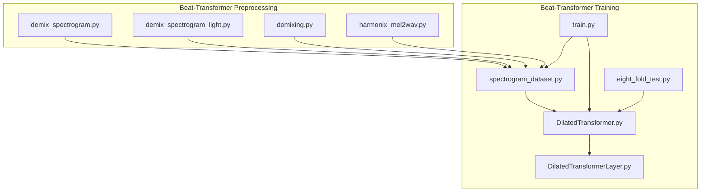
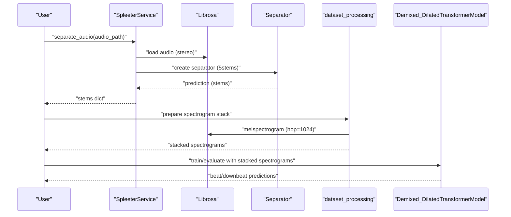
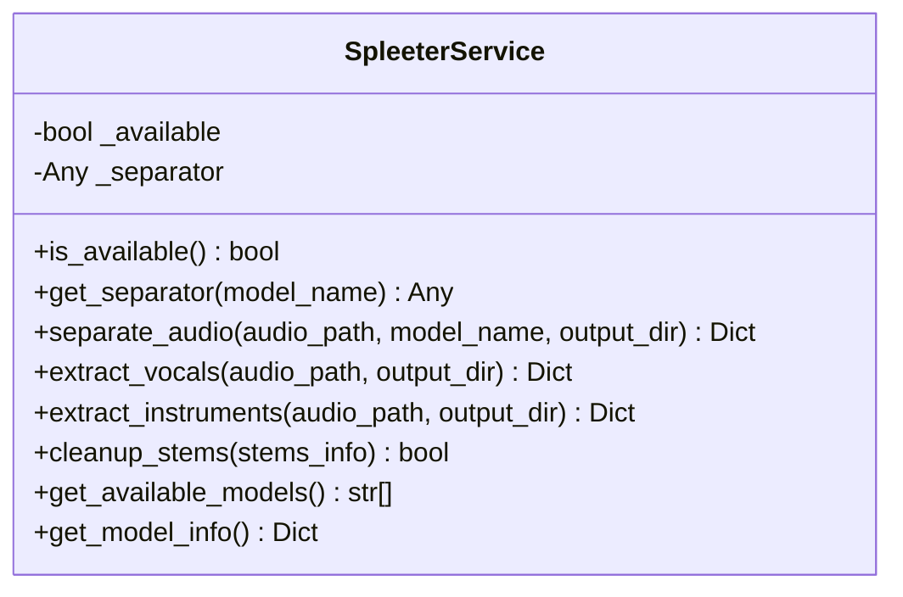
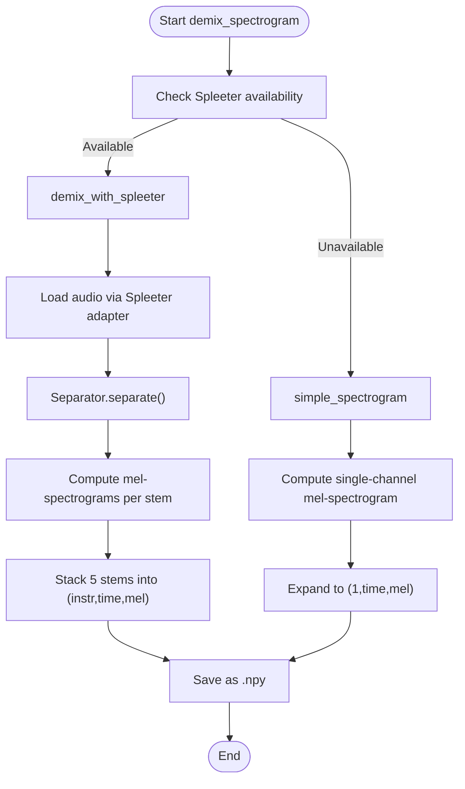
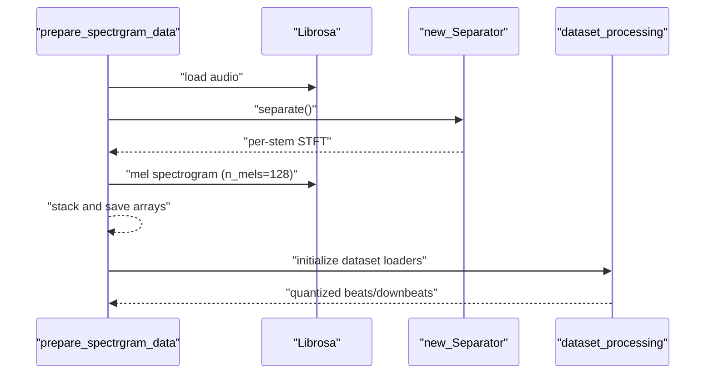
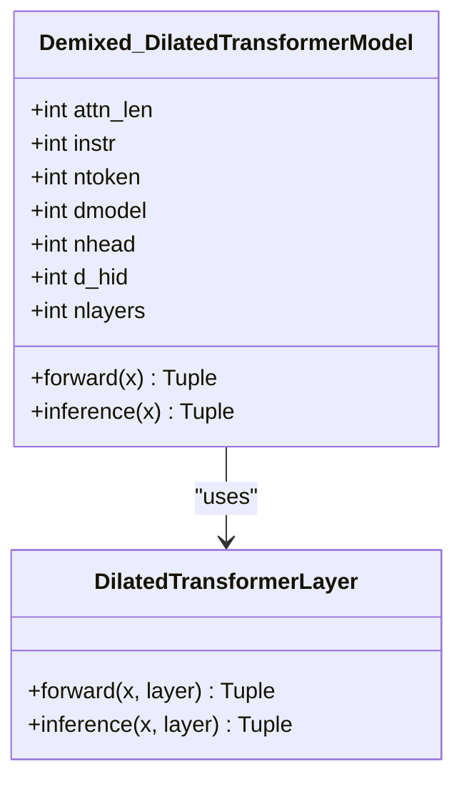
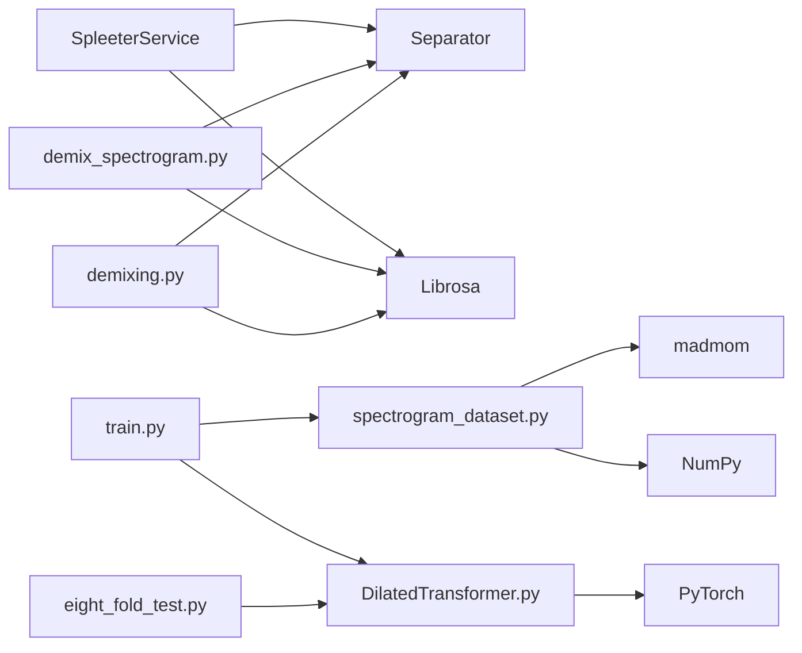

# Audio Preprocessing Pipeline

<cite>
**Referenced Files in This Document**
- [spleeter_service.py](file://python_backend/services/audio/spleeter_service.py)
- [demixing.py](file://python_backend/models/Beat-Transformer/preprocessing/demixing.py)
- [harmonix_mel2wav.py](file://python_backend/models/Beat-Transformer/preprocessing/harmonix_mel2wav.py)
- [demix_spectrogram.py](file://python_backend/models/Beat-Transformer/demix_spectrogram.py)
- [demix_spectrogram_light.py](file://python_backend/models/Beat-Transformer/demix_spectrogram_light.py)
- [spectrogram_dataset.py](file://python_backend/models/Beat-Transformer/code/spectrogram_dataset.py)
- [DilatedTransformer.py](file://python_backend/models/Beat-Transformer/code/DilatedTransformer.py)
- [DilatedTransformerLayer.py](file://python_backend/models/Beat-Transformer/code/DilatedTransformerLayer.py)
- [eight_fold_test.py](file://python_backend/models/Beat-Transformer/code/eight_fold_test.py)
- [train.py](file://python_backend/models/Beat-Transformer/code/train.py)
- [README.md](file://python_backend/models/Beat-Transformer/README.md)
- [btc_config.yaml](file://python_backend/config/btc_config.yaml)
</cite>

## Table of Contents
1. [Introduction](#introduction)
2. [Project Structure](#project-structure)
3. [Core Components](#core-components)
4. [Architecture Overview](#architecture-overview)
5. [Detailed Component Analysis](#detailed-component-analysis)
6. [Dependency Analysis](#dependency-analysis)
7. [Performance Considerations](#performance-considerations)
8. [Troubleshooting Guide](#troubleshooting-guide)
9. [Conclusion](#conclusion)
10. [Appendices](#appendices)

## Introduction
This document describes the Beat-Transformer audio preprocessing pipeline with a focus on Spleeter-based audio demixing, demixed spectrogram generation, feature extraction, and data preparation. It also covers the Harmonix mel-spectrogram to audio conversion using the Griffin-Lim algorithm, preprocessing scripts for multiple datasets, and the impact of preprocessing quality on downstream beat tracking performance. The goal is to provide a practical guide for preparing audio data and understanding the end-to-end workflow that feeds into the Beat-Transformer model.

## Project Structure
The Beat-Transformer preprocessing and training code resides under the Beat-Transformer module. The preprocessing scripts demonstrate two primary workflows:
- Spleeter-based demixing to produce per-instrument mel-spectrograms suitable for the Beat-Transformer model.
- A simplified fallback spectrogram approach when Spleeter is unavailable.
- A light-weight single-channel spectrogram variant for reduced compute.
- A dedicated script to convert Harmonix mel-spectrograms to audio using Griffin-Lim.

**Diagram sources**
- [demix_spectrogram.py:30-136](file://python_backend/models/Beat-Transformer/demix_spectrogram.py#L30-L136)
- [demix_spectrogram_light.py:10-54](file://python_backend/models/Beat-Transformer/demix_spectrogram_light.py#L10-L54)
- [demixing.py:60-262](file://python_backend/models/Beat-Transformer/preprocessing/demixing.py#L60-L262)
- [harmonix_mel2wav.py:10-22](file://python_backend/models/Beat-Transformer/preprocessing/harmonix_mel2wav.py#L10-L22)
- [spectrogram_dataset.py:17-428](file://python_backend/models/Beat-Transformer/code/spectrogram_dataset.py#L17-L428)
- [DilatedTransformer.py:7-91](file://python_backend/models/Beat-Transformer/code/DilatedTransformer.py#L7-L91)
- [DilatedTransformerLayer.py:87-153](file://python_backend/models/Beat-Transformer/code/DilatedTransformerLayer.py#L87-L153)
- [train.py:115-126](file://python_backend/models/Beat-Transformer/code/train.py#L115-L126)
- [eight_fold_test.py:56-72](file://python_backend/models/Beat-Transformer/code/eight_fold_test.py#L56-L72)

**Section sources**
- [README.md:9-47](file://python_backend/models/Beat-Transformer/README.md#L9-L47)

## Core Components
- Spleeter-based demixing service: Provides robust audio separation into multiple stems with GPU-aware initialization and resource cleanup.
- Demixed spectrogram generation: Produces per-stem mel-spectrograms aligned with Beat-Transformer’s hop length and mel bin configuration.
- Light-weight spectrogram: Single-channel mel-spectrogram variant for faster processing.
- Dataset preparation: Loads and organizes multi-dataset spectrogram stacks with beat/downbeat annotations.
- Model and training: The Beat-Transformer model consumes demixed spectrograms and trains with DBN decoding for beat/downbeat evaluation.

**Section sources**
- [spleeter_service.py:17-286](file://python_backend/services/audio/spleeter_service.py#L17-L286)
- [demix_spectrogram.py:30-177](file://python_backend/models/Beat-Transformer/demix_spectrogram.py#L30-L177)
- [demix_spectrogram_light.py:10-54](file://python_backend/models/Beat-Transformer/demix_spectrogram_light.py#L10-L54)
- [spectrogram_dataset.py:17-428](file://python_backend/models/Beat-Transformer/code/spectrogram_dataset.py#L17-L428)

## Architecture Overview
The preprocessing pipeline integrates Spleeter separation, mel-spectrogram computation, and dataset assembly. The training pipeline consumes prepared spectrograms and evaluates beat/downbeat performance using DBN decoding.

**Diagram sources**
- [spleeter_service.py:71-178](file://python_backend/services/audio/spleeter_service.py#L71-L178)
- [demix_spectrogram.py:54-135](file://python_backend/models/Beat-Transformer/demix_spectrogram.py#L54-L135)
- [spectrogram_dataset.py:17-128](file://python_backend/models/Beat-Transformer/code/spectrogram_dataset.py#L17-L128)
- [DilatedTransformer.py:41-90](file://python_backend/models/Beat-Transformer/code/DilatedTransformer.py#L41-L90)

## Detailed Component Analysis

### Spleeter-based Audio Demixing Service
- Availability checks and dynamic import guard ensure graceful degradation when Spleeter is not installed.
- Per-request separator creation avoids memory accumulation across concurrent requests.
- Stereo handling and waveform transposition ensure compatibility with Spleeter’s expected input format.
- Temporary output directory management and cleanup routines prevent disk leaks.
- Model selection supports 2-stem, 4-stem, and 5-stem separation configurations.

**Diagram sources**
- [spleeter_service.py:17-286](file://python_backend/services/audio/spleeter_service.py#L17-L286)

**Section sources**
- [spleeter_service.py:27-178](file://python_backend/services/audio/spleeter_service.py#L27-L178)

### Demixed Spectrogram Generation (Spleeter-based)
- Attempts Spleeter demixing first; falls back to a simple mel-spectrogram if unavailable or errors occur.
- Uses librosa mel-spectrogram with hop length aligned to the Beat-Transformer training schedule (44100 Hz, hop=1024).
- Converts each stem to mono by averaging channels when stereo is detected.
- Ensures consistent time-frequency orientation and saves as a stacked NumPy array for model consumption.

**Diagram sources**
- [demix_spectrogram.py:30-177](file://python_backend/models/Beat-Transformer/demix_spectrogram.py#L30-L177)

**Section sources**
- [demix_spectrogram.py:30-136](file://python_backend/models/Beat-Transformer/demix_spectrogram.py#L30-L136)

### Lightweight Demixed Spectrogram (Single Channel)
- Produces a single-channel mel-spectrogram stack to reduce compute and memory footprint.
- Useful for rapid prototyping or environments with constrained resources.

**Section sources**
- [demix_spectrogram_light.py:10-54](file://python_backend/models/Beat-Transformer/demix_spectrogram_light.py#L10-L54)

### Multi-Dataset Preparation and Annotation Alignment
- Loads pre-separated spectrograms and beat/downbeat annotations across datasets (Ballroom, Carnatic, GTZAN, Hainsworth, SMC, Harmonix).
- Applies fold-wise splitting and quantization to beat events at the model’s temporal resolution.
- Supports training/validation/test splits and optional “test-only” datasets.

**Diagram sources**
- [demixing.py:60-262](file://python_backend/models/Beat-Transformer/preprocessing/demixing.py#L60-L262)
- [spectrogram_dataset.py:132-212](file://python_backend/models/Beat-Transformer/code/spectrogram_dataset.py#L132-L212)

**Section sources**
- [demixing.py:60-262](file://python_backend/models/Beat-Transformer/preprocessing/demixing.py#L60-L262)
- [spectrogram_dataset.py:17-128](file://python_backend/models/Beat-Transformer/code/spectrogram_dataset.py#L17-L128)

### Harmonix Mel-Spectrogram to Audio Conversion (Griffin-Lim)
- Converts stored Harmonix mel-spectrograms to audio using librosa’s mel-to-audio transform with Griffin-Lim.
- Writes output WAV files and logs failures for later inspection.

**Section sources**
- [harmonix_mel2wav.py:10-22](file://python_backend/models/Beat-Transformer/preprocessing/harmonix_mel2wav.py#L10-L22)

### Beat-Transformer Model and Training
- The model consumes demixed spectrograms shaped as (batch, instr, time, mel_bins) and predicts beat and downbeat activations plus tempo distribution.
- Training script sets up cross-validation folds, DBN processors for decoding, and logging metrics.
- Eight-fold inference script aggregates predictions across folds and evaluates using DBN decoding.

**Diagram sources**
- [DilatedTransformer.py:7-91](file://python_backend/models/Beat-Transformer/code/DilatedTransformer.py#L7-L91)
- [DilatedTransformerLayer.py:87-153](file://python_backend/models/Beat-Transformer/code/DilatedTransformerLayer.py#L87-L153)

**Section sources**
- [DilatedTransformer.py:41-90](file://python_backend/models/Beat-Transformer/code/DilatedTransformer.py#L41-L90)
- [train.py:115-126](file://python_backend/models/Beat-Transformer/code/train.py#L115-L126)
- [eight_fold_test.py:56-86](file://python_backend/models/Beat-Transformer/code/eight_fold_test.py#L56-L86)

## Dependency Analysis
- SpleeterService depends on Spleeter and librosa for audio I/O and separation.
- Demixed spectrogram scripts depend on librosa for STFT and mel-spectrogram computation.
- Dataset preparation relies on NumPy arrays and madmom for event quantization.
- The model depends on PyTorch and convolutional layers to process the stacked spectrograms.

**Diagram sources**
- [spleeter_service.py:37-69](file://python_backend/services/audio/spleeter_service.py#L37-L69)
- [demix_spectrogram.py:54-102](file://python_backend/models/Beat-Transformer/demix_spectrogram.py#L54-L102)
- [demixing.py:17-57](file://python_backend/models/Beat-Transformer/preprocessing/demixing.py#L17-L57)
- [spectrogram_dataset.py:17-28](file://python_backend/models/Beat-Transformer/code/spectrogram_dataset.py#L17-L28)
- [DilatedTransformer.py:1-5](file://python_backend/models/Beat-Transformer/code/DilatedTransformer.py#L1-L5)
- [train.py:115-126](file://python_backend/models/Beat-Transformer/code/train.py#L115-L126)
- [eight_fold_test.py:56-86](file://python_backend/models/Beat-Transformer/code/eight_fold_test.py#L56-L86)

**Section sources**
- [spleeter_service.py:37-69](file://python_backend/services/audio/spleeter_service.py#L37-L69)
- [demix_spectrogram.py:54-102](file://python_backend/models/Beat-Transformer/demix_spectrogram.py#L54-L102)
- [demixing.py:17-57](file://python_backend/models/Beat-Transformer/preprocessing/demixing.py#L17-L57)
- [spectrogram_dataset.py:17-28](file://python_backend/models/Beat-Transformer/code/spectrogram_dataset.py#L17-L28)
- [DilatedTransformer.py:1-5](file://python_backend/models/Beat-Transformer/code/DilatedTransformer.py#L1-L5)
- [train.py:115-126](file://python_backend/models/Beat-Transformer/code/train.py#L115-L126)
- [eight_fold_test.py:56-86](file://python_backend/models/Beat-Transformer/code/eight_fold_test.py#L56-L86)

## Performance Considerations
- Spleeter GPU acceleration: The service creates a new separator per request to avoid memory accumulation; however, repeated instantiations incur overhead. Consider pooling or persistent instances if throughput demands exceed current design.
- Mel-spectrogram parameters: Consistent hop length (1024) at 44100 Hz ensures temporal alignment with model expectations and reduces re-sampling artifacts.
- Memory usage: Large multi-dataset arrays and 5-stem stacks increase memory pressure. Use the light-weight single-channel variant for rapid iterations.
- Disk I/O: Precomputed spectrograms (.npy/.npz) minimize runtime computation but require significant storage. Ensure sufficient disk space and consider compression where appropriate.
- Parallelization: The Harmonix mel-to-audio conversion uses parallel joblib tasks; tune n_jobs according to CPU cores and I/O capacity.

[No sources needed since this section provides general guidance]

## Troubleshooting Guide
- Spleeter not available: The demixing scripts gracefully fall back to a simple mel-spectrogram. Verify librosa availability and audio file formats.
- Audio format issues: Ensure input audio is mono or stereo; the service duplicates mono to stereo and transposes to (time, channels) for Spleeter compatibility.
- Temporary directory cleanup: On errors, the service attempts to remove temporary directories; confirm filesystem permissions and disk availability.
- Dataset loading errors: The dataset loader handles missing annotations by masking invalid regions; inspect not-found lists and annotation file formats.
- Evaluation failures: DBN decoding may fail on sparse or malformed activation vectors; validate activation shapes and thresholds.

**Section sources**
- [demix_spectrogram.py:50-53](file://python_backend/models/Beat-Transformer/demix_spectrogram.py#L50-L53)
- [spleeter_service.py:160-178](file://python_backend/services/audio/spleeter_service.py#L160-L178)
- [spectrogram_dataset.py:64-74](file://python_backend/models/Beat-Transformer/code/spectrogram_dataset.py#L64-L74)

## Conclusion
The Beat-Transformer preprocessing pipeline leverages Spleeter for high-quality audio demixing and librosa for precise mel-spectrogram computation. The resulting demixed spectrograms are structured to match the model’s temporal and spectral resolutions, enabling robust beat and downbeat tracking. The multi-dataset preparation and eight-fold evaluation framework provide reproducible baselines, while the Griffin-Lim conversion enables Harmonix audio reconstruction for validation. Proper quality control and preprocessing optimization are essential to achieving strong downstream performance.

[No sources needed since this section summarizes without analyzing specific files]

## Appendices

### Preprocessing Workflows and Intermediate Formats
- Spleeter-based workflow:
  - Input: Mixed audio file.
  - Output: Per-stem WAV files and a stacked mel-spectrogram NumPy array.
- Fallback workflow:
  - Input: Mixed audio file.
  - Output: Single-channel mel-spectrogram NumPy array.
- Light-weight workflow:
  - Input: Mixed audio file.
  - Output: Single-channel mel-spectrogram NumPy array with minimal processing.
- Harmonix conversion:
  - Input: Mel-spectrogram NumPy array.
  - Output: Reconstructed audio WAV files.

**Section sources**
- [demix_spectrogram.py:30-136](file://python_backend/models/Beat-Transformer/demix_spectrogram.py#L30-L136)
- [demix_spectrogram_light.py:10-54](file://python_backend/models/Beat-Transformer/demix_spectrogram_light.py#L10-L54)
- [harmonix_mel2wav.py:10-22](file://python_backend/models/Beat-Transformer/preprocessing/harmonix_mel2wav.py#L10-L22)

### Computational Requirements and Optimization Techniques
- Prefer CPU-only processing for stability when GPU memory is limited.
- Use the light-weight single-channel spectrogram for rapid experimentation.
- Compress NumPy arrays to reduce I/O overhead.
- Parallelize Griffin-Lim conversions and dataset preparation where feasible.

[No sources needed since this section provides general guidance]

### Impact of Preprocessing Quality on Downstream Beat Tracking
- Accurate demixing improves beat localization by isolating rhythmic components (drums, bass) from harmonic and percussive noise.
- Consistent hop length and mel bin configuration ensure faithful representation of temporal events.
- Proper annotation quantization and masking handle missing or ambiguous beat annotations robustly.
- DBN decoding post-processing enhances temporal coherence and accuracy metrics.

**Section sources**
- [train.py:139-140](file://python_backend/models/Beat-Transformer/code/train.py#L139-L140)
- [eight_fold_test.py:127-137](file://python_backend/models/Beat-Transformer/code/eight_fold_test.py#L127-L137)
- [spectrogram_dataset.py:64-74](file://python_backend/models/Beat-Transformer/code/spectrogram_dataset.py#L64-L74)