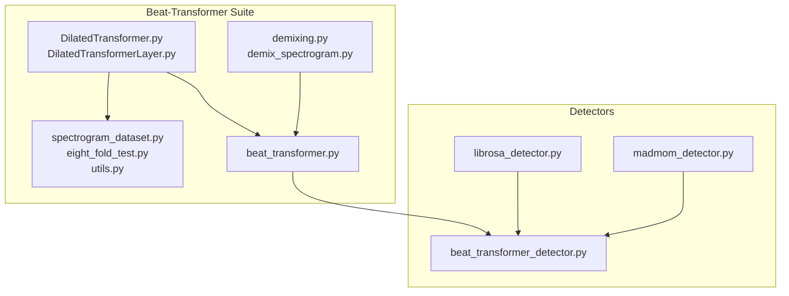
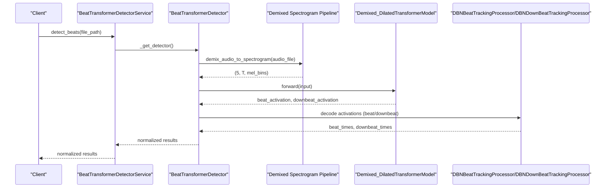
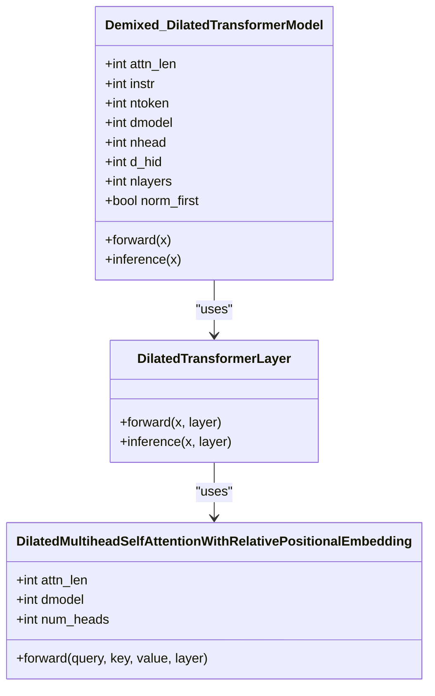
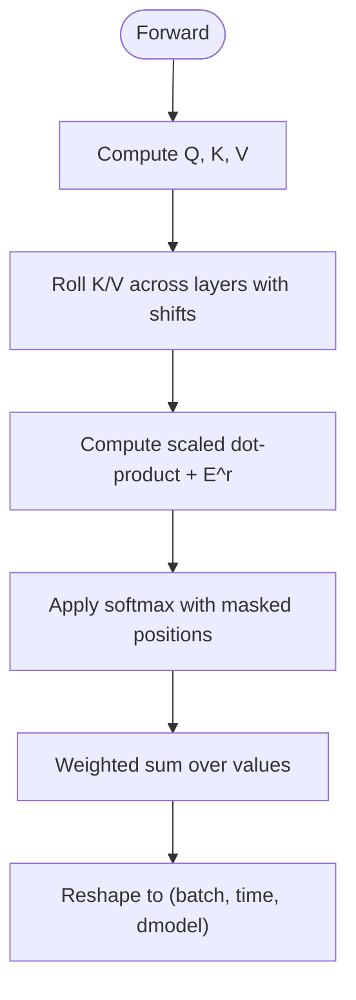
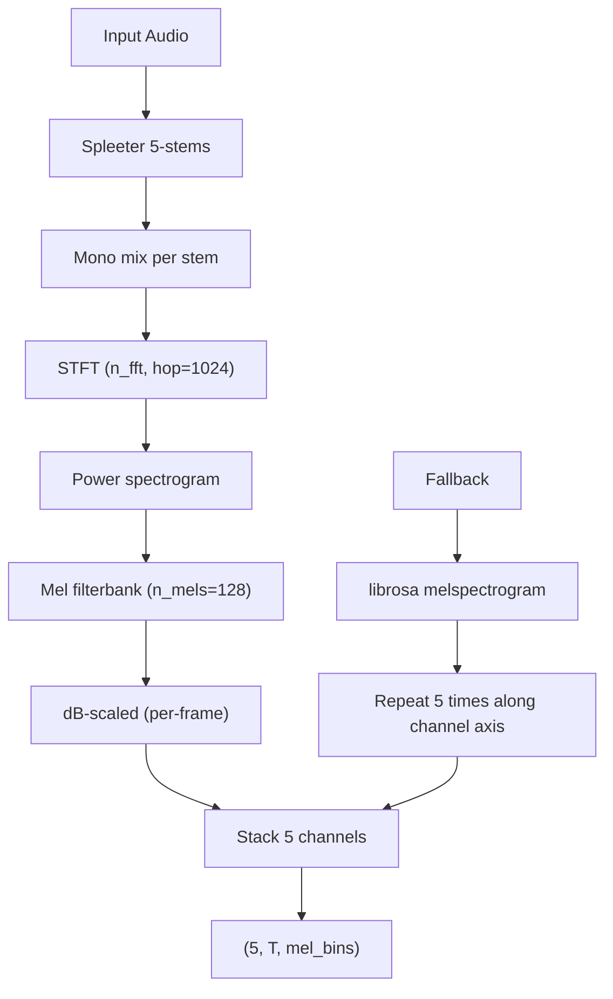
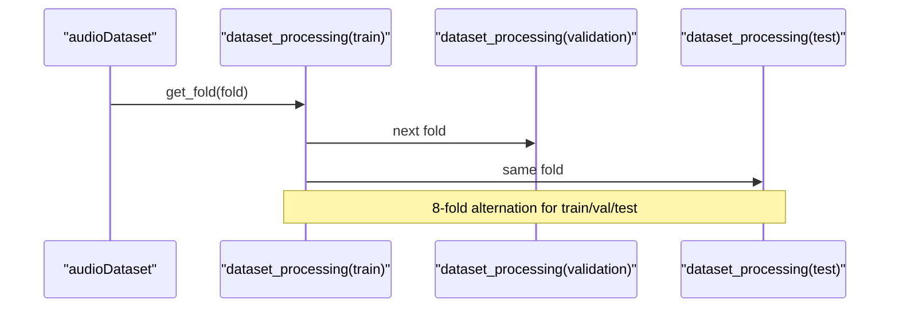
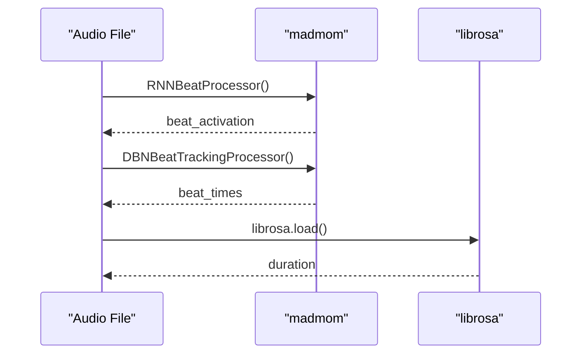
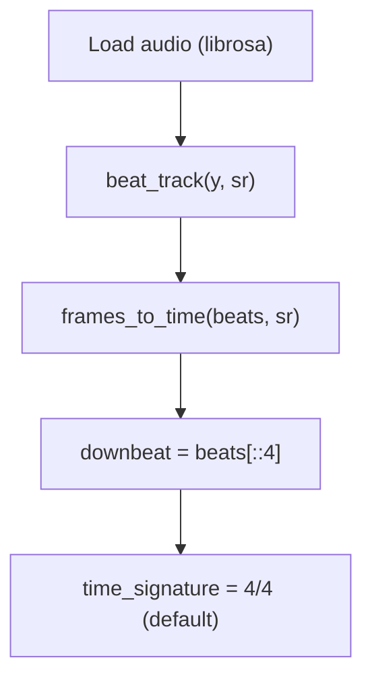
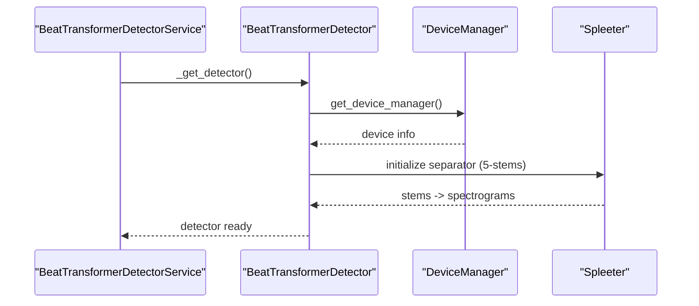
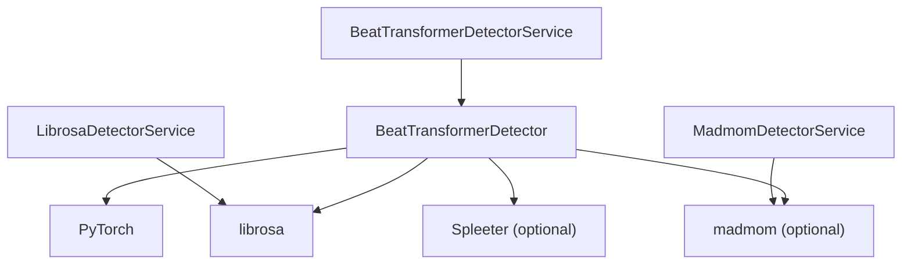

# Beat Detection Models

<cite>
**Referenced Files in This Document**
- [README.md](file://python_backend/models/Beat-Transformer/README.md)
- [DilatedTransformer.py](file://python_backend/models/Beat-Transformer/code/DilatedTransformer.py)
- [DilatedTransformerLayer.py](file://python_backend/models/Beat-Transformer/code/DilatedTransformerLayer.py)
- [eight_fold_test.py](file://python_backend/models/Beat-Transformer/code/eight_fold_test.py)
- [spectrogram_dataset.py](file://python_backend/models/Beat-Transformer/code/spectrogram_dataset.py)
- [utils.py](file://python_backend/models/Beat-Transformer/code/utils.py)
- [demixing.py](file://python_backend/models/Beat-Transformer/preprocessing/demixing.py)
- [demix_spectrogram.py](file://python_backend/models/Beat-Transformer/demix_spectrogram.py)
- [beat_transformer.py](file://python_backend/models/beat_transformer.py)
- [beat_transformer_detector.py](file://python_backend/services/detectors/beat_transformer_detector.py)
- [madmom_detector.py](file://python_backend/services/detectors/madmom_detector.py)
- [librosa_detector.py](file://python_backend/services/detectors/librosa_detector.py)
</cite>

## Table of Contents
1. [Introduction](#introduction)
2. [Project Structure](#project-structure)
3. [Core Components](#core-components)
4. [Architecture Overview](#architecture-overview)
5. [Detailed Component Analysis](#detailed-component-analysis)
6. [Dependency Analysis](#dependency-analysis)
7. [Performance Considerations](#performance-considerations)
8. [Troubleshooting Guide](#troubleshooting-guide)
9. [Conclusion](#conclusion)
10. [Appendices](#appendices)

## Introduction
This document explains the beat detection models in ChordMiniApp with a focus on:
- The Beat-Transformer architecture with dilated self-attention, demixed spectrogram processing, and 8-fold cross-validation training methodology
- The madmom neural network implementation for beat and downbeat tracking
- The librosa signal processing integration using traditional audio analysis techniques
- Model comparison methodologies, performance benchmarks, and accuracy metrics
- Configuration parameters, input requirements, and output formats for each detector
- Model loading, initialization, and inference optimization techniques
- Troubleshooting common issues and guidance for selecting the appropriate detector

## Project Structure
The beat detection system spans three detector implementations and a dedicated Beat-Transformer model suite:
- Beat-Transformer model and training pipeline
- Traditional librosa and madmom detectors
- Unified service wrappers for detector selection and normalized outputs

**Diagram sources**
- [DilatedTransformer.py:1-168](file://python_backend/models/Beat-Transformer/code/DilatedTransformer.py#L1-L168)
- [DilatedTransformerLayer.py:1-183](file://python_backend/models/Beat-Transformer/code/DilatedTransformerLayer.py#L1-L183)
- [eight_fold_test.py:1-403](file://python_backend/models/Beat-Transformer/code/eight_fold_test.py#L1-L403)
- [spectrogram_dataset.py:1-428](file://python_backend/models/Beat-Transformer/code/spectrogram_dataset.py#L1-L428)
- [utils.py:1-302](file://python_backend/models/Beat-Transformer/code/utils.py#L1-L302)
- [demixing.py:1-262](file://python_backend/models/Beat-Transformer/preprocessing/demixing.py#L1-L262)
- [demix_spectrogram.py:1-184](file://python_backend/models/Beat-Transformer/demix_spectrogram.py#L1-L184)
- [beat_transformer.py:1-1583](file://python_backend/models/beat_transformer.py#L1-L1583)
- [librosa_detector.py:1-124](file://python_backend/services/detectors/librosa_detector.py#L1-L124)
- [madmom_detector.py:1-158](file://python_backend/services/detectors/madmom_detector.py#L1-L158)
- [beat_transformer_detector.py:1-163](file://python_backend/services/detectors/beat_transformer_detector.py#L1-L163)

**Section sources**
- [README.md:1-75](file://python_backend/models/Beat-Transformer/README.md#L1-L75)
- [beat_transformer.py:1-1583](file://python_backend/models/beat_transformer.py#L1-L1583)

## Core Components
- Beat-Transformer model: A dilated self-attention transformer with demixed spectrogram inputs and dual-output heads for beat and downbeat activations
- Training and evaluation: 8-fold cross-validation with DBN decoding and standardized metrics
- Demixed spectrogram processing: Spleeter-based 5-stem separation or librosa fallback
- Detectors: Unified service wrappers for Beat-Transformer, librosa, and madmom with normalized outputs

**Section sources**
- [DilatedTransformer.py:7-90](file://python_backend/models/Beat-Transformer/code/DilatedTransformer.py#L7-L90)
- [eight_fold_test.py:52-191](file://python_backend/models/Beat-Transformer/code/eight_fold_test.py#L52-L191)
- [demixing.py:17-127](file://python_backend/models/Beat-Transformer/preprocessing/demixing.py#L17-L127)
- [librosa_detector.py:43-124](file://python_backend/services/detectors/librosa_detector.py#L43-L124)
- [madmom_detector.py:46-158](file://python_backend/services/detectors/madmom_detector.py#L46-L158)
- [beat_transformer_detector.py:73-147](file://python_backend/services/detectors/beat_transformer_detector.py#L73-L147)

## Architecture Overview
The Beat-Transformer pipeline integrates audio demixing, spectrogram generation, deep learning inference, and probabilistic decoding.

**Diagram sources**
- [beat_transformer_detector.py:73-147](file://python_backend/services/detectors/beat_transformer_detector.py#L73-L147)
- [beat_transformer.py:819-1446](file://python_backend/models/beat_transformer.py#L819-L1446)
- [DilatedTransformer.py:41-90](file://python_backend/models/Beat-Transformer/code/DilatedTransformer.py#L41-L90)

## Detailed Component Analysis

### Beat-Transformer Architecture
- Model: Demixed_DilatedTransformerModel with 3-stage CNN front-end, dilated self-attention layers, and dual linear heads
- Dilated self-attention: Relative positional embeddings with skewed and symmetric heads across scales
- Dual outputs: Beat and downbeat activation maps; optional cumulative attention for interpretability

**Diagram sources**
- [DilatedTransformer.py:7-90](file://python_backend/models/Beat-Transformer/code/DilatedTransformer.py#L7-L90)
- [DilatedTransformerLayer.py:87-165](file://python_backend/models/Beat-Transformer/code/DilatedTransformerLayer.py#L87-L165)

**Section sources**
- [DilatedTransformer.py:7-168](file://python_backend/models/Beat-Transformer/code/DilatedTransformer.py#L7-L168)
- [DilatedTransformerLayer.py:8-183](file://python_backend/models/Beat-Transformer/code/DilatedTransformerLayer.py#L8-L183)

### Dilated Self-Attention Mechanism
- Relative positional embedding Er with fixed window sizes per head
- Rolling kernels across exponentially increasing receptive fields
- Square attention reconstruction from dilated heads

**Diagram sources**
- [DilatedTransformerLayer.py:27-82](file://python_backend/models/Beat-Transformer/code/DilatedTransformerLayer.py#L27-L82)

**Section sources**
- [DilatedTransformerLayer.py:8-183](file://python_backend/models/Beat-Transformer/code/DilatedTransformerLayer.py#L8-L183)

### Demixed Spectrogram Processing
- Spleeter 5-stem separation with Mel-filterbank spectrograms
- Exact hop length matching Beat-Transformer training (44100/1024 fps)
- Fallback to librosa-derived spectrogram stack when Spleeter unavailable

**Diagram sources**
- [demixing.py:23-57](file://python_backend/models/Beat-Transformer/preprocessing/demixing.py#L23-L57)
- [demix_spectrogram.py:54-136](file://python_backend/models/Beat-Transformer/demix_spectrogram.py#L54-L136)

**Section sources**
- [demixing.py:17-127](file://python_backend/models/Beat-Transformer/preprocessing/demixing.py#L17-L127)
- [demix_spectrogram.py:30-177](file://python_backend/models/Beat-Transformer/demix_spectrogram.py#L30-L177)

### 8-Fold Cross-Validation Training Methodology
- Dataset splits across 8 folds; each fold alternates train/validation/test
- Training clips samples to fixed-length windows; evaluation uses 420-second windows
- Metrics computed via DBN decoding and BeatEvaluation (f-measure, cmlt, amlt)

**Diagram sources**
- [spectrogram_dataset.py:358-397](file://python_backend/models/Beat-Transformer/code/spectrogram_dataset.py#L358-L397)
- [eight_fold_test.py:68-118](file://python_backend/models/Beat-Transformer/code/eight_fold_test.py#L68-L118)

**Section sources**
- [spectrogram_dataset.py:287-397](file://python_backend/models/Beat-Transformer/code/spectrogram_dataset.py#L287-L397)
- [eight_fold_test.py:17-48](file://python_backend/models/Beat-Transformer/code/eight_fold_test.py#L17-L48)

### Madmom Neural Network Implementation
- Beat tracking: RNNBeatProcessor followed by DBNBeatTrackingProcessor
- Downbeat tracking: DBNDownBeatTrackingProcessor with configurable beats-per-bar
- BPM estimation via median inter-onset interval; duration via librosa

**Diagram sources**
- [madmom_detector.py:84-94](file://python_backend/services/detectors/madmom_detector.py#L84-L94)

**Section sources**
- [madmom_detector.py:46-158](file://python_backend/services/detectors/madmom_detector.py#L46-L158)

### Librosa Signal Processing Integration
- Beat tracking via librosa.beat.beat_track
- Downbeat heuristic: slice every 4th beat
- Time signature heuristic: default 4/4 with candidate exposure

**Diagram sources**
- [librosa_detector.py:83-89](file://python_backend/services/detectors/librosa_detector.py#L83-L89)

**Section sources**
- [librosa_detector.py:43-124](file://python_backend/services/detectors/librosa_detector.py#L43-L124)

### Beat-Transformer Detector Service
- Availability checks for PyTorch and checkpoint presence
- Device detection and GPU/MPS/CPU selection
- Spleeter configuration and compatibility fixes
- Robust DBN decoding with normalization safeguards

**Diagram sources**
- [beat_transformer_detector.py:52-71](file://python_backend/services/detectors/beat_transformer_detector.py#L52-L71)
- [beat_transformer.py:259-363](file://python_backend/models/beat_transformer.py#L259-L363)

**Section sources**
- [beat_transformer_detector.py:15-163](file://python_backend/services/detectors/beat_transformer_detector.py#L15-L163)
- [beat_transformer.py:194-363](file://python_backend/models/beat_transformer.py#L194-L363)

## Dependency Analysis
- Beat-Transformer depends on PyTorch, librosa, and optional madmom for decoding
- Spleeter integration for 5-stem separation with TensorFlow/GPU configuration
- Detector services encapsulate availability checks and normalized outputs

**Diagram sources**
- [beat_transformer_detector.py:15-71](file://python_backend/services/detectors/beat_transformer_detector.py#L15-L71)
- [beat_transformer.py:13-80](file://python_backend/models/beat_transformer.py#L13-L80)
- [librosa_detector.py:14-41](file://python_backend/services/detectors/librosa_detector.py#L14-L41)
- [madmom_detector.py:14-44](file://python_backend/services/detectors/madmom_detector.py#L14-L44)

**Section sources**
- [beat_transformer.py:1-80](file://python_backend/models/beat_transformer.py#L1-L80)
- [librosa_detector.py:1-42](file://python_backend/services/detectors/librosa_detector.py#L1-L42)
- [madmom_detector.py:1-44](file://python_backend/services/detectors/madmom_detector.py#L1-L44)

## Performance Considerations
- GPU/MPS acceleration: Enabled in local development; forced CPU in production for stability
- Spleeter GPU configuration: TensorFlow GPU setup with MPS fallback for Apple Silicon
- Memory optimization: Temporary directories for Spleeter, MPS float32 handling, and device cache clearing
- Inference optimization: Peak-picking fallback on GPU/CPU when madmom is unavailable

[No sources needed since this section provides general guidance]

## Troubleshooting Guide
Common issues and resolutions:
- Model unavailability
  - Check PyTorch availability and checkpoint existence
  - Verify Beat-Transformer directory and checkpoint path
- Performance degradation
  - Ensure GPU/MPS is available; fallback to CPU gracefully
  - Confirm Spleeter GPU configuration and TensorFlow device setup
- Accuracy problems
  - Validate DBN parameters and normalization safeguards for combined activations
  - Use robust DBN result processing to handle complex structures
  - Consider fallback peak-picking when madmom fails

**Section sources**
- [beat_transformer.py:194-363](file://python_backend/models/beat_transformer.py#L194-L363)
- [beat_transformer.py:943-1300](file://python_backend/models/beat_transformer.py#L943-L1300)
- [beat_transformer.py:1162-1273](file://python_backend/models/beat_transformer.py#L1162-L1273)

## Conclusion
ChordMiniApp’s beat detection system combines a state-of-the-art Beat-Transformer with robust traditional methods (librosa, madmom). The Beat-Transformer leverages demixed spectrograms and dilated self-attention to produce strong beat and downbeat activations, decoded via DBN with careful normalization. The detector services provide unified, normalized outputs and resilient fallbacks for varied environments.

[No sources needed since this section summarizes without analyzing specific files]

## Appendices

### Model Comparison Methodologies and Benchmarks
- Metrics: f-measure, cmlt, amlt via BeatEvaluation
- Evaluation: 8-fold cross-validation with DBN decoding
- Datasets: Ballroom, Hainsworth, Carnatic, GTZAN, SMC, Harmonix

**Section sources**
- [utils.py:33-69](file://python_backend/models/Beat-Transformer/code/utils.py#L33-L69)
- [eight_fold_test.py:120-191](file://python_backend/models/Beat-Transformer/code/eight_fold_test.py#L120-L191)

### Configuration Parameters, Inputs, and Outputs
- Beat-Transformer
  - Inputs: Demixed spectrogram (5, T, mel_bins); exact hop length 1024
  - Outputs: Beat and downbeat activation maps; decoded to beat/downbeat times
  - Device: Auto-select GPU/MPS/CPU; Spleeter GPU optional
- Librosa
  - Inputs: Audio file path
  - Outputs: Beat times, downbeat candidates, BPM, duration
- Madmom
  - Inputs: Audio file path
  - Outputs: Beat times, downbeat times, BPM, duration

**Section sources**
- [demix_spectrogram.py:30-177](file://python_backend/models/Beat-Transformer/demix_spectrogram.py#L30-L177)
- [beat_transformer.py:819-1446](file://python_backend/models/beat_transformer.py#L819-L1446)
- [librosa_detector.py:43-124](file://python_backend/services/detectors/librosa_detector.py#L43-L124)
- [madmom_detector.py:46-158](file://python_backend/services/detectors/madmom_detector.py#L46-L158)

### Guidance for Detector Selection
- Choose Beat-Transformer for high accuracy on diverse musical genres with sufficient compute
- Use librosa for lightweight, deterministic beat detection without external dependencies
- Use madmom for robust probabilistic decoding with DBN tracking
- Switch automatically via detector services with normalized outputs

[No sources needed since this section provides general guidance]