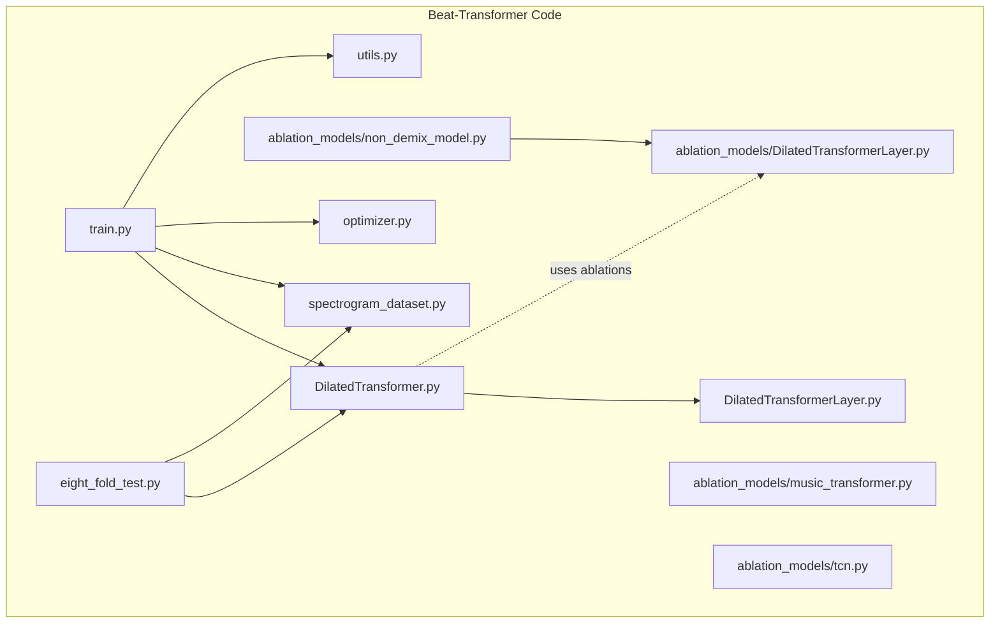
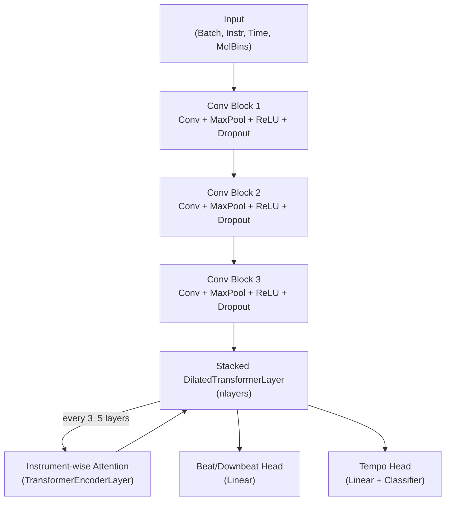
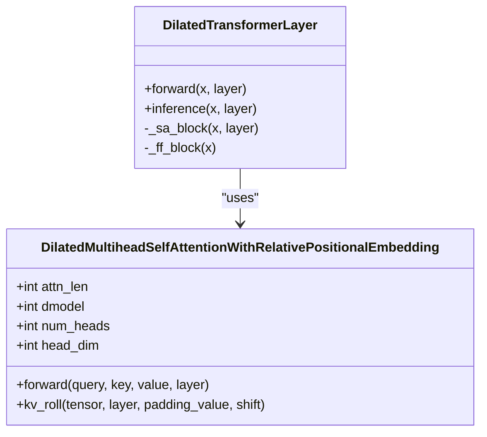
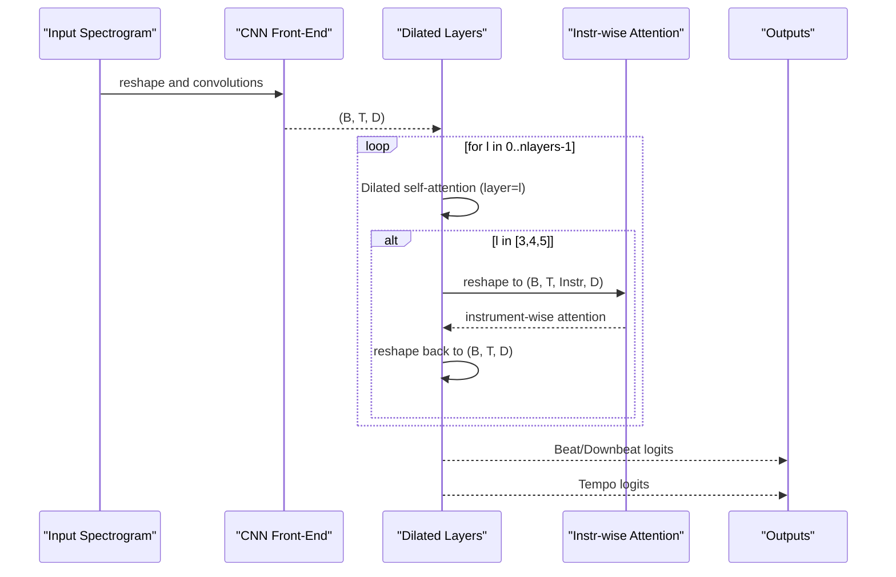
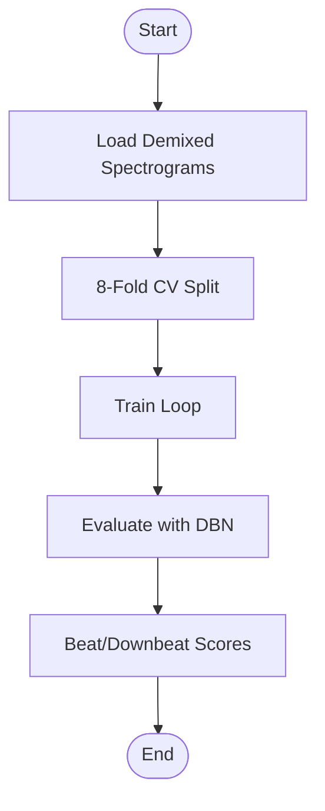
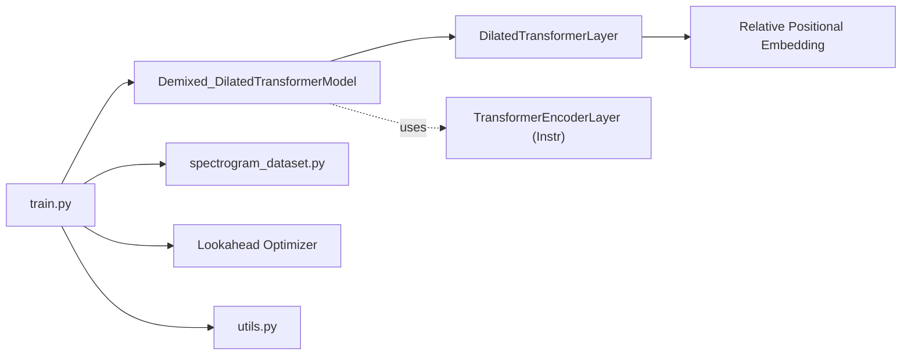

# Beat-Transformer Architecture

<cite>
**Referenced Files in This Document**
- [DilatedTransformer.py](file://python_backend/models/Beat-Transformer/code/DilatedTransformer.py)
- [DilatedTransformerLayer.py](file://python_backend/models/Beat-Transformer/code/DilatedTransformerLayer.py)
- [ablation_models/DilatedTransformerLayer.py](file://python_backend/models/Beat-Transformer/code/ablation_models/DilatedTransformerLayer.py)
- [ablation_models/music_transformer.py](file://python_backend/models/Beat-Transformer/code/ablation_models/music_transformer.py)
- [ablation_models/tcn.py](file://python_backend/models/Beat-Transformer/code/ablation_models/tcn.py)
- [ablation_models/non_demix_model.py](file://python_backend/models/Beat-Transformer/code/ablation_models/non_demix_model.py)
- [spectrogram_dataset.py](file://python_backend/models/Beat-Transformer/code/spectrogram_dataset.py)
- [train.py](file://python_backend/models/Beat-Transformer/code/train.py)
- [eight_fold_test.py](file://python_backend/models/Beat-Transformer/code/eight_fold_test.py)
- [optimizer.py](file://python_backend/models/Beat-Transformer/code/optimizer.py)
- [utils.py](file://python_backend/models/Beat-Transformer/code/utils.py)
- [README.md](file://python_backend/models/Beat-Transformer/README.md)
</cite>

## Table of Contents
1. [Introduction](#introduction)
2. [Project Structure](#project-structure)
3. [Core Components](#core-components)
4. [Architecture Overview](#architecture-overview)
5. [Detailed Component Analysis](#detailed-component-analysis)
6. [Dependency Analysis](#dependency-analysis)
7. [Performance Considerations](#performance-considerations)
8. [Troubleshooting Guide](#troubleshooting-guide)
9. [Conclusion](#conclusion)
10. [Appendices](#appendices)

## Introduction
This document explains the Beat-Transformer architecture designed for simultaneous beat and downbeat tracking using dilated self-attention. It covers the dilated convolution front-end, the DilatedTransformerLayer with its relative positional embeddings, the multi-head attention formulation, and the feed-forward network. It also documents ablation studies, training and evaluation procedures, and practical guidance for initialization, forward passes, and optimization.

## Project Structure
The Beat-Transformer implementation resides under python_backend/models/Beat-Transformer/code. Key modules include:
- Model definition: DilatedTransformer.py
- Attention layer: DilatedTransformerLayer.py
- Ablation models: ablation_models/*
- Training and evaluation: train.py, eight_fold_test.py
- Data pipeline: spectrogram_dataset.py
- Utilities and metrics: utils.py
- Optimizer wrapper: optimizer.py

**Diagram sources**
- [DilatedTransformer.py](file://python_backend/models/Beat-Transformer/code/DilatedTransformer.py)
- [DilatedTransformerLayer.py](file://python_backend/models/Beat-Transformer/code/DilatedTransformerLayer.py)
- [ablation_models/DilatedTransformerLayer.py](file://python_backend/models/Beat-Transformer/code/ablation_models/DilatedTransformerLayer.py)
- [ablation_models/music_transformer.py](file://python_backend/models/Beat-Transformer/code/ablation_models/music_transformer.py)
- [ablation_models/tcn.py](file://python_backend/models/Beat-Transformer/code/ablation_models/tcn.py)
- [ablation_models/non_demix_model.py](file://python_backend/models/Beat-Transformer/code/ablation_models/non_demix_model.py)
- [spectrogram_dataset.py](file://python_backend/models/Beat-Transformer/code/spectrogram_dataset.py)
- [train.py](file://python_backend/models/Beat-Transformer/code/train.py)
- [eight_fold_test.py](file://python_backend/models/Beat-Transformer/code/eight_fold_test.py)
- [optimizer.py](file://python_backend/models/Beat-Transformer/code/optimizer.py)
- [utils.py](file://python_backend/models/Beat-Transformer/code/utils.py)

**Section sources**
- [README.md](file://python_backend/models/Beat-Transformer/README.md)
- [DilatedTransformer.py](file://python_backend/models/Beat-Transformer/code/DilatedTransformer.py)
- [DilatedTransformerLayer.py](file://python_backend/models/Beat-Transformer/code/DilatedTransformerLayer.py)
- [ablation_models/DilatedTransformerLayer.py](file://python_backend/models/Beat-Transformer/code/ablation_models/DilatedTransformerLayer.py)
- [ablation_models/music_transformer.py](file://python_backend/models/Beat-Transformer/code/ablation_models/music_transformer.py)
- [ablation_models/tcn.py](file://python_backend/models/Beat-Transformer/code/ablation_models/tcn.py)
- [ablation_models/non_demix_model.py](file://python_backend/models/Beat-Transformer/code/ablation_models/non_demix_model.py)
- [spectrogram_dataset.py](file://python_backend/models/Beat-Transformer/code/spectrogram_dataset.py)
- [train.py](file://python_backend/models/Beat-Transformer/code/train.py)
- [eight_fold_test.py](file://python_backend/models/Beat-Transformer/code/eight_fold_test.py)
- [optimizer.py](file://python_backend/models/Beat-Transformer/code/optimizer.py)
- [utils.py](file://python_backend/models/Beat-Transformer/code/utils.py)

## Core Components
- Demixed_DilatedTransformerModel: The top-level model with a CNN front-end and stacked DilatedTransformerLayer blocks. It supports both beat and downbeat outputs and a tempo head.
- DilatedTransformerLayer: Implements dilated self-attention with relative positional embeddings and a feed-forward network. It exposes both standard and inference modes returning attention matrices.
- Ablation models: Alternative architectures for studying the contribution of dilated attention, relative positions, and temporal convolution.

Key configuration parameters:
- attn_len: Length of the sliding window in dilated attention.
- instr: Number of instrument channels (demixed spectrograms).
- ntoken: Output tokens per time step (beat and downbeat).
- dmodel, nhead, d_hid: Transformer dimensions and attention heads.
- nlayers: Depth of the stack.
- norm_first: Pre-normalization option.
- dropout: Dropout rates for regularization.

**Section sources**
- [DilatedTransformer.py](file://python_backend/models/Beat-Transformer/code/DilatedTransformer.py)
- [DilatedTransformerLayer.py](file://python_backend/models/Beat-Transformer/code/DilatedTransformerLayer.py)
- [ablation_models/DilatedTransformerLayer.py](file://python_backend/models/Beat-Transformer/code/ablation_models/DilatedTransformerLayer.py)
- [ablation_models/non_demix_model.py](file://python_backend/models/Beat-Transformer/code/ablation_models/non_demix_model.py)

## Architecture Overview
The model processes demixed spectrograms with a CNN front-end, then applies dilated self-attention along the time dimension. Every few layers, it switches to an instrument-wise attention block. Outputs are combined to produce beat/downbeat activations and a tempo classification head.

**Diagram sources**
- [DilatedTransformer.py](file://python_backend/models/Beat-Transformer/code/DilatedTransformer.py)
- [DilatedTransformerLayer.py](file://python_backend/models/Beat-Transformer/code/DilatedTransformerLayer.py)

## Detailed Component Analysis

### DilatedTransformerLayer: Dilated Self-Attention with Relative Positional Embeddings
- Multi-head attention computes keys/values by rolling them across time with exponential dilation controlled by layer index. This creates asymmetric receptive fields enabling long-range temporal dependencies.
- Relative positional embedding Er is applied to the attention logits to bias attention towards structured temporal relations.
- The layer returns both the attended representation and the attention weights for visualization/inference.

**Diagram sources**
- [DilatedTransformerLayer.py](file://python_backend/models/Beat-Transformer/code/DilatedTransformerLayer.py)

**Section sources**
- [DilatedTransformerLayer.py](file://python_backend/models/Beat-Transformer/code/DilatedTransformerLayer.py)
- [ablation_models/DilatedTransformerLayer.py](file://python_backend/models/Beat-Transformer/code/ablation_models/DilatedTransformerLayer.py)

### DilatedTransformer Model: CNN Front-End + Dilated Layers + Instrument Attention
- CNN front-end compresses mel-spectrogram features across frequency and time, producing a compact representation.
- Stacked DilatedTransformerLayer progressively builds long-range temporal context.
- From layers 3 to 5, the model reshapes to (batch, instr, time, dmodel) and applies a standard TransformerEncoderLayer across instruments, capturing inter-channel relationships.
- Two heads:
  - Beat/downbeat: Linear projection to ntoken outputs.
  - Tempo: Linear + classifier head.

**Diagram sources**
- [DilatedTransformer.py](file://python_backend/models/Beat-Transformer/code/DilatedTransformer.py)

**Section sources**
- [DilatedTransformer.py](file://python_backend/models/Beat-Transformer/code/DilatedTransformer.py)

### Ablation Study Models
- music_transformer.py: Standard transformer with relative positional embeddings and a generated dilation mask. Useful to compare against learned Er embeddings.
- tcn.py: Temporal Convolution Network baseline with residual dilated blocks.
- non_demix_model.py: Single-channel variant of the dilated transformer (no instrument mixing).
- ablation_models/DilatedTransformerLayer.py: Copy of the core layer used in ablations.

These models demonstrate the impact of:
- Learned vs. fixed relative position encodings.
- Dilated attention vs. standard attention.
- Temporal convolution vs. self-attention.

**Section sources**
- [ablation_models/music_transformer.py](file://python_backend/models/Beat-Transformer/code/ablation_models/music_transformer.py)
- [ablation_models/tcn.py](file://python_backend/models/Beat-Transformer/code/ablation_models/tcn.py)
- [ablation_models/non_demix_model.py](file://python_backend/models/Beat-Transformer/code/ablation_models/non_demix_model.py)
- [ablation_models/DilatedTransformerLayer.py](file://python_backend/models/Beat-Transformer/code/ablation_models/DilatedTransformerLayer.py)

### Data Pipeline and Evaluation
- spectrogram_dataset.py loads demixed spectrograms and quantized beat/downbeat annotations, supports cross-validation folds, and provides training/validation/test splits.
- train.py defines training loops, loss weighting, learning rate scheduling, and DBN-based evaluation for beat and downbeat.
- eight_fold_test.py runs cross-dataset inference and evaluates using MADMoM DBN processors.

**Diagram sources**
- [spectrogram_dataset.py](file://python_backend/models/Beat-Transformer/code/spectrogram_dataset.py)
- [train.py](file://python_backend/models/Beat-Transformer/code/train.py)
- [eight_fold_test.py](file://python_backend/models/Beat-Transformer/code/eight_fold_test.py)

**Section sources**
- [spectrogram_dataset.py](file://python_backend/models/Beat-Transformer/code/spectrogram_dataset.py)
- [train.py](file://python_backend/models/Beat-Transformer/code/train.py)
- [eight_fold_test.py](file://python_backend/models/Beat-Transformer/code/eight_fold_test.py)

## Dependency Analysis
- Demixed_DilatedTransformerModel depends on DilatedTransformerLayer and optionally on torch.nn.TransformerEncoderLayer for instrument attention.
- DilatedTransformerLayer depends on relative positional embeddings and rolling kernels to implement dilated attention.
- Training script composes the model, dataset, optimizer wrapper, and evaluation metrics.

**Diagram sources**
- [DilatedTransformer.py](file://python_backend/models/Beat-Transformer/code/DilatedTransformer.py)
- [DilatedTransformerLayer.py](file://python_backend/models/Beat-Transformer/code/DilatedTransformerLayer.py)
- [train.py](file://python_backend/models/Beat-Transformer/code/train.py)
- [spectrogram_dataset.py](file://python_backend/models/Beat-Transformer/code/spectrogram_dataset.py)
- [optimizer.py](file://python_backend/models/Beat-Transformer/code/optimizer.py)
- [utils.py](file://python_backend/models/Beat-Transformer/code/utils.py)

**Section sources**
- [DilatedTransformer.py](file://python_backend/models/Beat-Transformer/code/DilatedTransformer.py)
- [DilatedTransformerLayer.py](file://python_backend/models/Beat-Transformer/code/DilatedTransformerLayer.py)
- [train.py](file://python_backend/models/Beat-Transformer/code/train.py)
- [optimizer.py](file://python_backend/models/Beat-Transformer/code/optimizer.py)
- [utils.py](file://python_backend/models/Beat-Transformer/code/utils.py)

## Performance Considerations
- Computational complexity:
  - Standard self-attention scales quadratically in sequence length. The dilated attention reduces effective attention span per layer while maintaining long-range dependencies through exponential dilation across layers.
  - Relative positional embeddings add a small parameter overhead but improve temporal generalization.
- Memory:
  - The model’s primary memory cost comes from attention matrices and intermediate representations. The instrument-wise attention block increases memory slightly during layers 3–5.
- Training optimization:
  - Lookahead optimizer wrapper improves generalization by averaging fast weights with slow ones.
  - Scheduled sampling and gradient clipping stabilize training.
  - Cross-validation across 8 folds ensures robust evaluation.

[No sources needed since this section provides general guidance]

## Troubleshooting Guide
Common issues and remedies:
- NaN losses during training: The training script checks for NaN and skips problematic batches; monitor logs and adjust learning rate or clipping thresholds.
- GPU memory errors: Reduce batch size or model depth; ensure proper device placement.
- Evaluation instability: DBN decoding can fail on sparse activations; handle exceptions gracefully and validate activation shapes.

**Section sources**
- [train.py](file://python_backend/models/Beat-Transformer/code/train.py)
- [utils.py](file://python_backend/models/Beat-Transformer/code/utils.py)

## Conclusion
The Beat-Transformer combines a CNN front-end with dilated self-attention to capture long-range temporal dependencies effectively. The relative positional embeddings and instrument-wise attention enable robust beat and downbeat tracking across diverse musical contexts. Ablation studies confirm the importance of learned relative positions and dilated attention over standard attention or pure temporal convolution.

[No sources needed since this section summarizes without analyzing specific files]

## Appendices

### Code Examples and Usage Patterns
- Model initialization:
  - See [DilatedTransformer.py](file://python_backend/models/Beat-Transformer/code/DilatedTransformer.py)
- Forward pass:
  - See [DilatedTransformer.py](file://python_backend/models/Beat-Transformer/code/DilatedTransformer.py)
- Parameter configuration:
  - See [train.py](file://python_backend/models/Beat-Transformer/code/train.py)
- Training loop:
  - See [train.py](file://python_backend/models/Beat-Transformer/code/train.py)
- Cross-dataset evaluation:
  - See [eight_fold_test.py](file://python_backend/models/Beat-Transformer/code/eight_fold_test.py)

### Architectural Choices for Beat Tracking
- Dilated attention enables long-range modeling without full quadratic complexity.
- Relative positional embeddings encode temporal structure explicitly.
- Instrument-wise attention integrates across channels to refine temporal decisions.
- Dual heads (beat/downbeat and tempo) support end-to-end joint learning.

**Section sources**
- [DilatedTransformer.py](file://python_backend/models/Beat-Transformer/code/DilatedTransformer.py)
- [DilatedTransformerLayer.py](file://python_backend/models/Beat-Transformer/code/DilatedTransformerLayer.py)
- [train.py](file://python_backend/models/Beat-Transformer/code/train.py)
- [eight_fold_test.py](file://python_backend/models/Beat-Transformer/code/eight_fold_test.py)