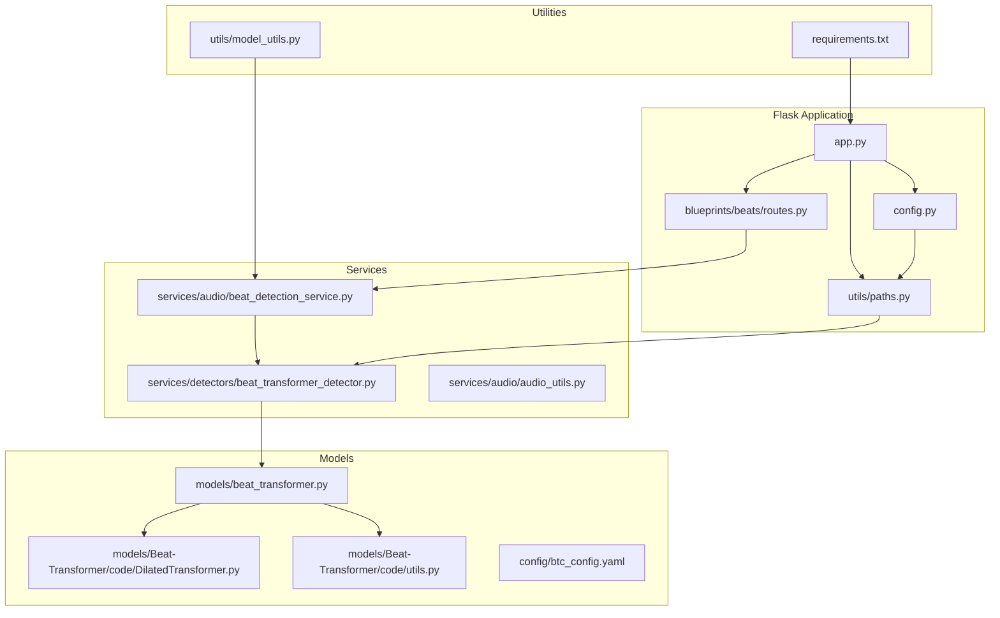
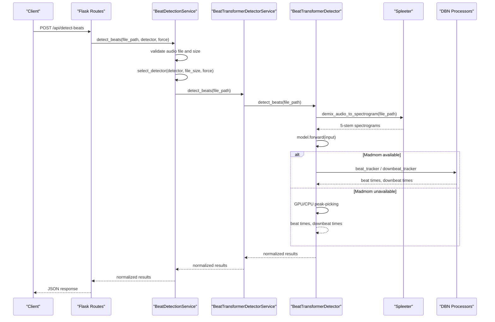
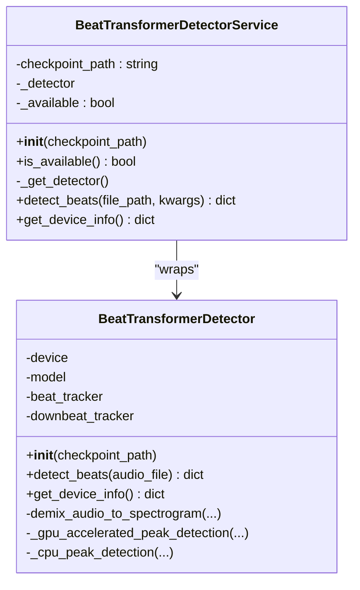
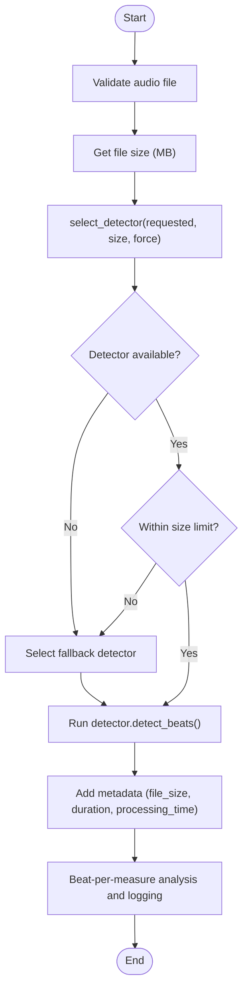
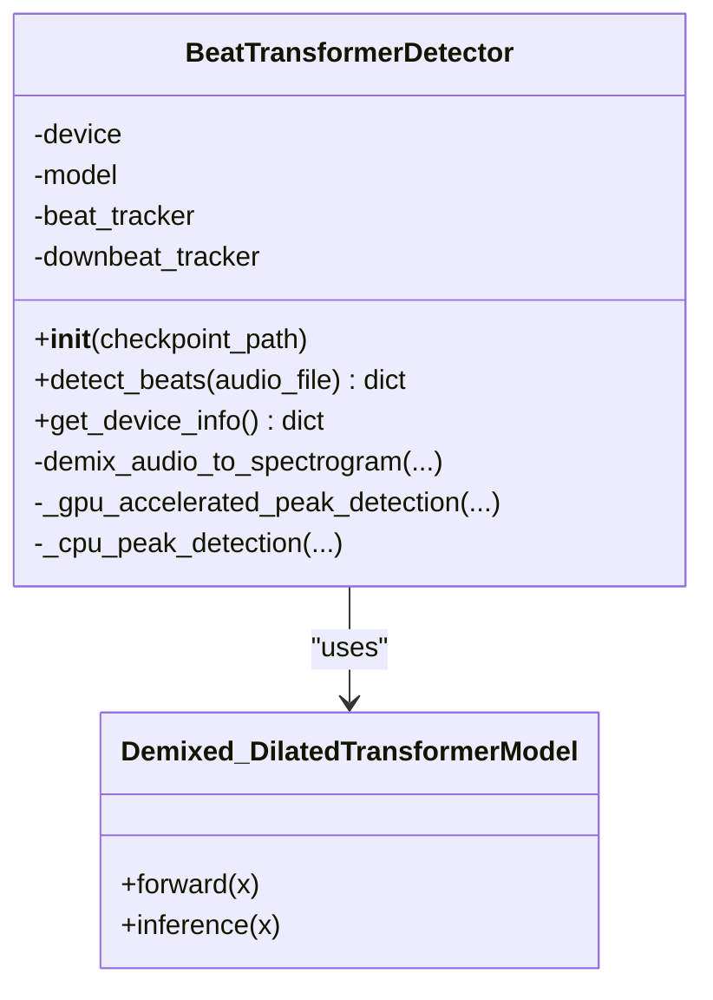
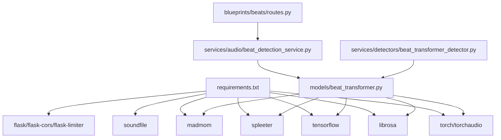

# Beat-Transformer Integration

<cite>
**Referenced Files in This Document**
- [beat_transformer_detector.py](file://python_backend/services/detectors/beat_transformer_detector.py)
- [beat_detection_service.py](file://python_backend/services/audio/beat_detection_service.py)
- [routes.py](file://python_backend/blueprints/beats/routes.py)
- [beat_transformer.py](file://python_backend/models/beat_transformer.py)
- [DilatedTransformer.py](file://python_backend/models/Beat-Transformer/code/DilatedTransformer.py)
- [utils.py](file://python_backend/models/Beat-Transformer/code/utils.py)
- [config.py](file://python_backend/config.py)
- [paths.py](file://python_backend/utils/paths.py)
- [requirements.txt](file://python_backend/requirements.txt)
- [app.py](file://python_backend/app.py)
- [model_utils.py](file://python_backend/utils/model_utils.py)
- [audio_utils.py](file://python_backend/services/audio/audio_utils.py)
- [btc_config.yaml](file://python_backend/config/btc_config.yaml)
</cite>

## Table of Contents
1. [Introduction](#introduction)
2. [Project Structure](#project-structure)
3. [Core Components](#core-components)
4. [Architecture Overview](#architecture-overview)
5. [Detailed Component Analysis](#detailed-component-analysis)
6. [Dependency Analysis](#dependency-analysis)
7. [Performance Considerations](#performance-considerations)
8. [Troubleshooting Guide](#troubleshooting-guide)
9. [Conclusion](#conclusion)
10. [Appendices](#appendices)

## Introduction
This document explains how the Beat-Transformer model is integrated into the ChordMiniApp backend. It covers the detector service implementation, model loading procedures, inference pipeline, integration with the audio processing service, and result formatting. It also documents installation and setup requirements, dependency management, environment configuration, API endpoints, request/response formats, error handling strategies, examples of beat detection requests, result interpretation, performance optimization techniques, and troubleshooting for common integration issues.

## Project Structure
The Beat-Transformer integration spans several modules:
- Detector service wrapper for Beat-Transformer
- Beat detection orchestration service
- Flask routes for beat detection endpoints
- Beat-Transformer model implementation with audio demixing and inference
- Supporting utilities for paths, configuration, and model availability checks

**Diagram sources**
- [app.py:1-186](file://python_backend/app.py#L1-L186)
- [config.py:1-215](file://python_backend/config.py#L1-L215)
- [paths.py:1-191](file://python_backend/utils/paths.py#L1-L191)
- [routes.py:1-521](file://python_backend/blueprints/beats/routes.py#L1-L521)
- [beat_detection_service.py:1-348](file://python_backend/services/audio/beat_detection_service.py#L1-L348)
- [beat_transformer_detector.py:1-163](file://python_backend/services/detectors/beat_transformer_detector.py#L1-L163)
- [beat_transformer.py:1-1583](file://python_backend/models/beat_transformer.py#L1-L1583)
- [DilatedTransformer.py:1-168](file://python_backend/models/Beat-Transformer/code/DilatedTransformer.py#L1-L168)
- [utils.py:1-302](file://python_backend/models/Beat-Transformer/code/utils.py#L1-L302)
- [model_utils.py:1-326](file://python_backend/utils/model_utils.py#L1-L326)
- [requirements.txt:1-131](file://python_backend/requirements.txt#L1-L131)

**Section sources**
- [app.py:1-186](file://python_backend/app.py#L1-L186)
- [config.py:1-215](file://python_backend/config.py#L1-L215)
- [paths.py:1-191](file://python_backend/utils/paths.py#L1-L191)

## Core Components
- BeatTransformerDetectorService: Wraps Beat-Transformer with a normalized interface, availability checks, and result normalization.
- BeatDetectionService: Orchestrates detector selection, file size validation, and fallback strategies.
- Beat-Transformer model: Implements audio demixing (Spleeter), spectrogram creation, model inference, and post-processing with DBN or peak-picking.
- Flask routes: Provide endpoints for beat detection, model info, and model availability tests.

Key responsibilities:
- Detector availability and device info retrieval
- File size policy enforcement and detector selection
- Audio validation and duration retrieval
- Normalized result formatting across detectors
- Endpoint-level request validation and rate limiting

**Section sources**
- [beat_transformer_detector.py:15-163](file://python_backend/services/detectors/beat_transformer_detector.py#L15-L163)
- [beat_detection_service.py:20-348](file://python_backend/services/audio/beat_detection_service.py#L20-L348)
- [beat_transformer.py:259-1583](file://python_backend/models/beat_transformer.py#L259-L1583)
- [routes.py:40-521](file://python_backend/blueprints/beats/routes.py#L40-L521)

## Architecture Overview
The Beat-Transformer integration follows a layered architecture:
- API layer: Flask routes accept requests, validate inputs, and delegate to the beat detection service.
- Service layer: BeatDetectionService selects the appropriate detector, enforces file size limits, and executes detection.
- Detector layer: BeatTransformerDetectorService wraps the Beat-Transformer model, handles availability checks, and normalizes outputs.
- Model layer: Beat-Transformer performs audio demixing, spectrogram generation, transformer inference, and post-processing.

**Diagram sources**
- [routes.py:40-120](file://python_backend/blueprints/beats/routes.py#L40-L120)
- [beat_detection_service.py:163-311](file://python_backend/services/audio/beat_detection_service.py#L163-L311)
- [beat_transformer_detector.py:73-147](file://python_backend/services/detectors/beat_transformer_detector.py#L73-L147)
- [beat_transformer.py:819-1446](file://python_backend/models/beat_transformer.py#L819-L1446)

## Detailed Component Analysis

### BeatTransformerDetectorService
Responsibilities:
- Availability check via Beat-Transformer module
- Lazy initialization of the Beat-Transformer detector
- Normalized result formatting for downstream consumers
- Device info retrieval and error handling

Implementation highlights:
- Uses a lazy import pattern to check availability and initialize the detector only when needed.
- Normalizes outputs to a consistent dictionary structure including success flag, beats, downbeats, BPM, time signature, duration, model identifiers, and processing time.
- Provides device info for GPU/CPU configuration insights.

**Diagram sources**
- [beat_transformer_detector.py:15-163](file://python_backend/services/detectors/beat_transformer_detector.py#L15-L163)
- [beat_transformer.py:259-581](file://python_backend/models/beat_transformer.py#L259-L581)

**Section sources**
- [beat_transformer_detector.py:15-163](file://python_backend/services/detectors/beat_transformer_detector.py#L15-L163)

### BeatDetectionService
Responsibilities:
- Detector selection logic with file size awareness
- Fallback strategies when requested detector is unsuitable
- Audio validation and duration retrieval
- Aggregation of metadata (file size, detector selection, processing time)
- Beat-per-measure analysis and logging

Key logic:
- Size limits per detector: Beat-Transformer (100 MB), Madmom (200 MB), Librosa (500 MB).
- Auto-selection preference: Madmom > Beat-Transformer > Librosa, adjusted by file size.
- Fallback selection prioritizes Madmom then Librosa when file exceeds size limits.

**Diagram sources**
- [beat_detection_service.py:53-311](file://python_backend/services/audio/beat_detection_service.py#L53-L311)

**Section sources**
- [beat_detection_service.py:20-348](file://python_backend/services/audio/beat_detection_service.py#L20-L348)
- [audio_utils.py:70-88](file://python_backend/services/audio/audio_utils.py#L70-L88)

### Beat-Transformer Model Implementation
Responsibilities:
- Audio demixing using Spleeter (5-stems) with compatibility fixes
- Spectrogram creation with Mel filters
- Transformer inference using Demixed_DilatedTransformerModel
- Post-processing with DBN (madmom) or GPU/CPU peak-picking fallback
- Time signature detection and BPM estimation

Key features:
- Environment-aware device selection (local development GPU vs production CPU).
- Robust DBN normalization to prevent mathematical errors.
- GPU acceleration for peak detection when available.
- Comprehensive error handling and fallbacks.

**Diagram sources**
- [beat_transformer.py:259-581](file://python_backend/models/beat_transformer.py#L259-L581)
- [DilatedTransformer.py:7-90](file://python_backend/models/Beat-Transformer/code/DilatedTransformer.py#L7-L90)

**Section sources**
- [beat_transformer.py:583-1583](file://python_backend/models/beat_transformer.py#L583-L1583)
- [DilatedTransformer.py:1-168](file://python_backend/models/Beat-Transformer/code/DilatedTransformer.py#L1-L168)

### API Endpoints and Request/Response Formats
Endpoints:
- POST /api/detect-beats: Detect beats from uploaded file or server-side path.
- POST /api/detect-beats-firebase: Detect beats from Firebase Storage URL.
- GET /api/model-info: Information about available beat detection models.
- GET /api/test-beat-transformer: Test Beat-Transformer availability.
- GET /api/test-madmom: Test Madmom availability.
- GET /api/test-librosa: Test Librosa availability.
- GET /api/test-all-models: Test all models.
- GET /api/test-dbn-isolation: Test DBN isolation for madmom.

Request parameters:
- detect-beats:
  - file: multipart/form-data audio file (alternative to audio_path)
  - audio_path: path to existing audio file on server
  - detector: 'beat-transformer', 'madmom', 'librosa', or 'auto'
  - force: 'true' to bypass size limits for requested detector
- detect-beats-firebase:
  - firebase_url: Firebase Storage URL
  - detector: 'beat-transformer', 'madmom', 'librosa', or 'auto'

Response format (normalized):
- success: boolean
- beats: array of beat timestamps (seconds)
- downbeats: array of downbeat timestamps (seconds)
- total_beats: integer
- total_downbeats: integer
- bpm: float
- time_signature: string (e.g., "4/4")
- duration: float (seconds)
- model_used: string identifier
- model_name: string
- processing_time: float (seconds)
- file_size_mb: float (added by service)
- detector_selected: string
- detector_requested: string
- force_used: boolean
- error: string (present when success=false)

Error handling:
- HTTP 400 for invalid requests
- HTTP 413 for file too large
- HTTP 404 for missing files
- HTTP 500 for internal errors
- Detailed error messages in response body

**Section sources**
- [routes.py:40-521](file://python_backend/blueprints/beats/routes.py#L40-L521)
- [beat_detection_service.py:163-311](file://python_backend/services/audio/beat_detection_service.py#L163-L311)
- [beat_transformer_detector.py:73-147](file://python_backend/services/detectors/beat_transformer_detector.py#L73-L147)

## Dependency Analysis
External dependencies and their roles:
- PyTorch/Torchaudio: Core ML framework for Beat-Transformer model.
- TensorFlow: Used for Spleeter GPU configuration and optional DBN components.
- librosa: Audio loading, STFT, Mel filters, and fallback processing.
- soundfile: Audio file writing for trimming.
- spleeter: 5-stem audio separation for improved beat detection.
- madmom: DBN beat and downbeat tracking (optional; fallback to peak-picking when unavailable).
- Flask, Flask-CORS, Flask-Limiter: Web framework and rate limiting.

Environment configuration:
- Production mode disables GPU acceleration for Beat-Transformer and forces CPU usage.
- Local development enables GPU acceleration when available.
- Spleeter GPU usage is controlled by environment and configuration.

**Diagram sources**
- [requirements.txt:1-131](file://python_backend/requirements.txt#L1-L131)
- [beat_transformer.py:1-1583](file://python_backend/models/beat_transformer.py#L1-L1583)
- [beat_detection_service.py:1-348](file://python_backend/services/audio/beat_detection_service.py#L1-L348)
- [beat_transformer_detector.py:1-163](file://python_backend/services/detectors/beat_transformer_detector.py#L1-L163)
- [routes.py:1-521](file://python_backend/blueprints/beats/routes.py#L1-L521)

**Section sources**
- [requirements.txt:1-131](file://python_backend/requirements.txt#L1-L131)
- [config.py:22-88](file://python_backend/config.py#L22-L88)
- [beat_transformer.py:80-112](file://python_backend/models/beat_transformer.py#L80-L112)

## Performance Considerations
Optimization techniques implemented:
- Environment-aware device selection: GPU for local development, CPU for production.
- GPU acceleration for peak detection when CUDA/MPS available.
- MPS compatibility fixes for Apple Silicon devices.
- Robust DBN normalization to prevent numerical errors and improve stability.
- Vectorized time signature detection for reduced overhead.
- Conditional debug logging to minimize overhead in production.
- Spleeter caching and local model directory usage to avoid repeated downloads.

Recommendations:
- Ensure sufficient RAM for Spleeter 5-stem separation.
- Monitor GPU utilization; disable GPU acceleration in constrained environments.
- Use 'auto' detector selection to leverage optimal model per file size.
- Cache Beat-Transformer checkpoints and Spleeter models to reduce cold-start latency.

**Section sources**
- [beat_transformer.py:273-298](file://python_backend/models/beat_transformer.py#L273-L298)
- [beat_detection_service.py:99-132](file://python_backend/services/audio/beat_detection_service.py#L99-L132)
- [utils.py:1-302](file://python_backend/models/Beat-Transformer/code/utils.py#L1-L302)

## Troubleshooting Guide
Common issues and resolutions:
- Beat-Transformer not available:
  - Verify checkpoint existence and PyTorch availability.
  - Check model_utils availability checks and logs.
  - Confirm environment detection (production disables GPU).
- Spleeter model not found:
  - Allow Spleeter to download pretrained models on first use.
  - Pre-download or copy the 5stems model into the cache directory.
  - Use local model directory if provided.
- Madmom DBN errors:
  - Ensure madmom is importable with Python 3.10+ compatibility fixes.
  - Validate DBN normalization to prevent mathematical errors.
  - Fallback to peak-picking when madmom fails.
- File too large:
  - Use 'auto' selection or reduce file size.
  - Consider 'librosa' for very large files.
- Performance bottlenecks:
  - Enable GPU acceleration in local development.
  - Use smaller audio segments or adjust hop length.
  - Monitor memory usage during Spleeter separation.

**Section sources**
- [model_utils.py:28-42](file://python_backend/utils/model_utils.py#L28-L42)
- [beat_transformer.py:694-711](file://python_backend/models/beat_transformer.py#L694-L711)
- [beat_detection_service.py:84-87](file://python_backend/services/audio/beat_detection_service.py#L84-L87)
- [routes.py:69-72](file://python_backend/blueprints/beats/routes.py#L69-L72)

## Conclusion
The Beat-Transformer integration provides a robust, configurable beat detection pipeline within ChordMiniApp. The design emphasizes availability checks, environment-aware device selection, comprehensive fallback strategies, and normalized result formatting. By leveraging Spleeter for audio demixing and DBN or peak-picking for post-processing, the system achieves high accuracy while maintaining performance across diverse deployment environments.

## Appendices

### Installation and Setup
- Install dependencies from requirements.txt.
- Ensure PyTorch and TensorFlow versions meet requirements.
- For GPU acceleration, configure CUDA/MPS as needed.
- Place Beat-Transformer checkpoint under models/Beat-Transformer/checkpoint/.
- Configure CORS origins and rate limits via environment variables.

**Section sources**
- [requirements.txt:1-131](file://python_backend/requirements.txt#L1-L131)
- [config.py:32-88](file://python_backend/config.py#L32-L88)
- [paths.py:33-33](file://python_backend/utils/paths.py#L33-L33)

### Detector Selection Logic and Fallbacks
- Preferred order: Madmom > Beat-Transformer > Librosa.
- File size constraints enforced unless force=true.
- Automatic fallback when requested detector is unavailable or file too large.
- Beat-per-measure analysis for time signature determination.

**Section sources**
- [beat_detection_service.py:53-161](file://python_backend/services/audio/beat_detection_service.py#L53-L161)

### Example Requests and Responses
- Request: POST /api/detect-beats with multipart/form-data and detector=auto.
- Response: JSON with beats, downbeats, bpm, time_signature, duration, and processing_time.

**Section sources**
- [routes.py:40-120](file://python_backend/blueprints/beats/routes.py#L40-L120)
- [beat_detection_service.py:163-311](file://python_backend/services/audio/beat_detection_service.py#L163-L311)