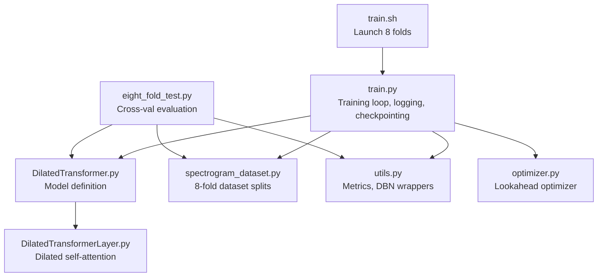
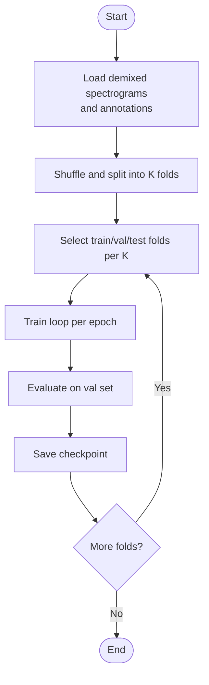
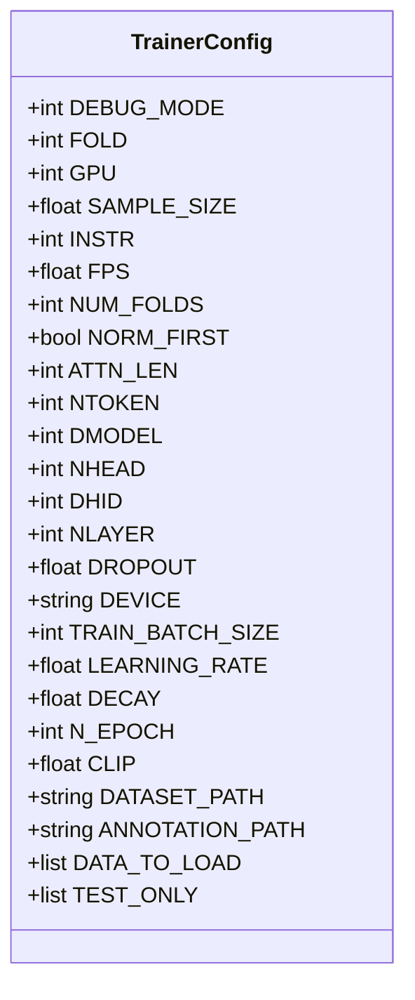
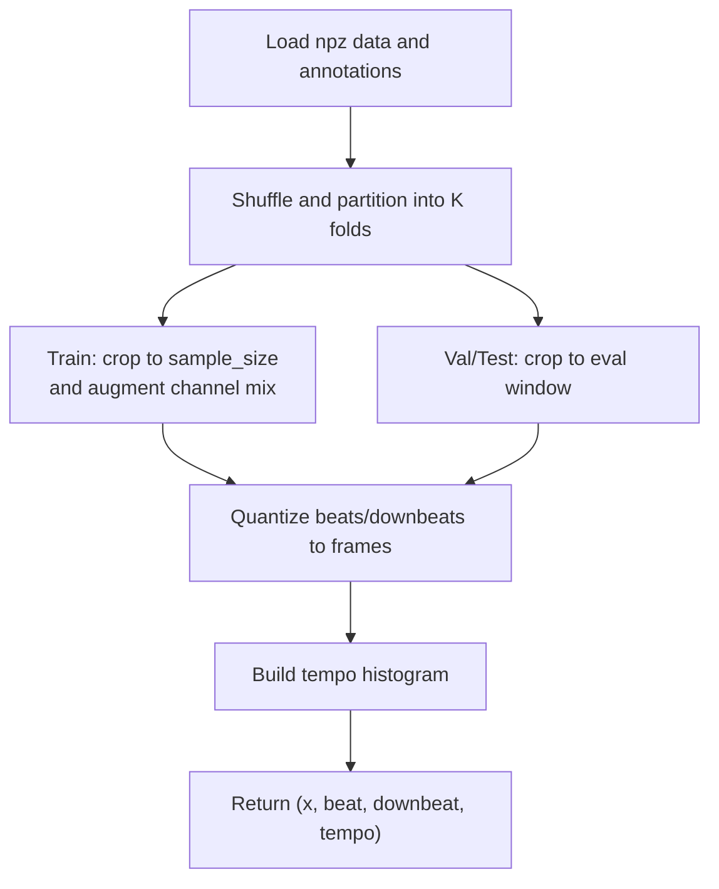
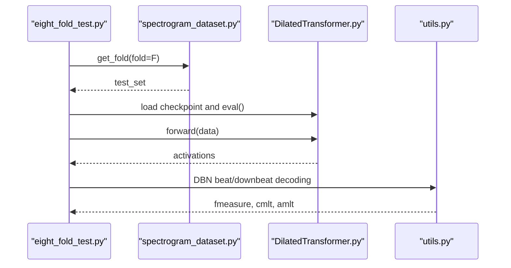
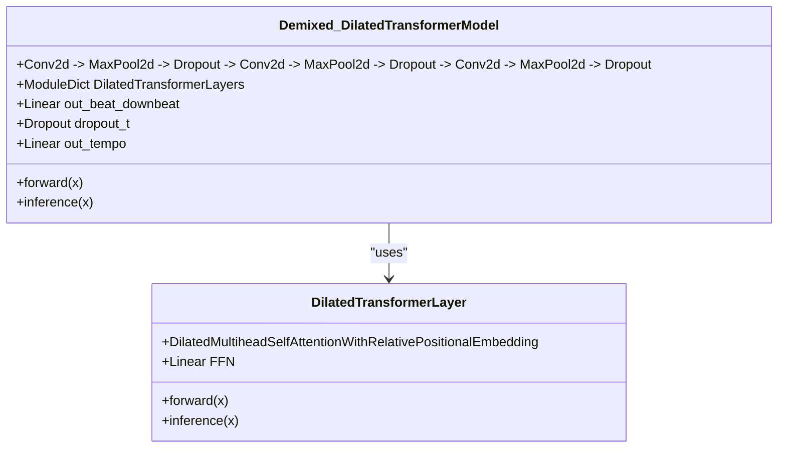
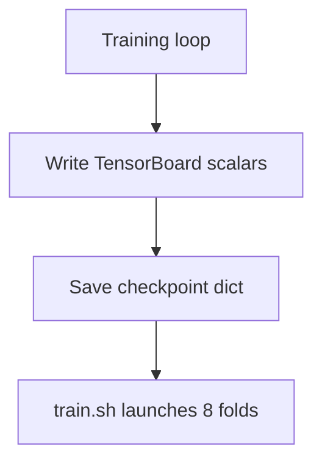
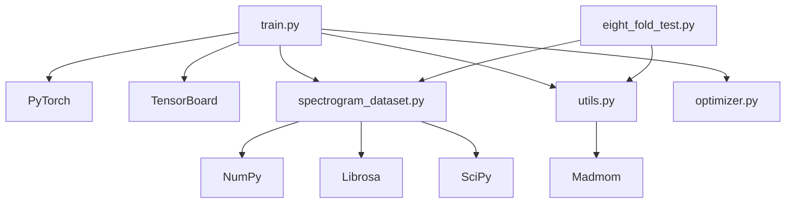

# Training and Evaluation

<cite>
**Referenced Files in This Document**
- [train.py](file://python_backend/models/Beat-Transformer/code/train.py)
- [eight_fold_test.py](file://python_backend/models/Beat-Transformer/code/eight_fold_test.py)
- [spectrogram_dataset.py](file://python_backend/models/Beat-Transformer/code/spectrogram_dataset.py)
- [optimizer.py](file://python_backend/models/Beat-Transformer/code/optimizer.py)
- [utils.py](file://python_backend/models/Beat-Transformer/code/utils.py)
- [DilatedTransformer.py](file://python_backend/models/Beat-Transformer/code/DilatedTransformer.py)
- [DilatedTransformerLayer.py](file://python_backend/models/Beat-Transformer/code/DilatedTransformerLayer.py)
- [train.sh](file://python_backend/models/Beat-Transformer/code/train.sh)
- [README.md](file://python_backend/models/Beat-Transformer/README.md)
</cite>

## Table of Contents
1. [Introduction](#introduction)
2. [Project Structure](#project-structure)
3. [Core Components](#core-components)
4. [Architecture Overview](#architecture-overview)
5. [Detailed Component Analysis](#detailed-component-analysis)
6. [Dependency Analysis](#dependency-analysis)
7. [Performance Considerations](#performance-considerations)
8. [Troubleshooting Guide](#troubleshooting-guide)
9. [Conclusion](#conclusion)
10. [Appendices](#appendices)

## Introduction
This document describes the training and evaluation methodology for the Beat-Transformer model. It covers the 8-fold cross-validation training procedure, data preparation and batching, training configuration and optimization, evaluation metrics using DBN decoding, checkpoint management, and ablation considerations. It also outlines training data requirements, compute needs, and approximate durations.

## Project Structure
The Beat-Transformer training and evaluation code resides under python_backend/models/Beat-Transformer/code. Key elements include:
- Training driver and loop: train.py
- Cross-validation evaluation: eight_fold_test.py
- Dataset preparation and folding: spectrogram_dataset.py
- Model architecture: DilatedTransformer.py and DilatedTransformerLayer.py
- Optimization wrapper: optimizer.py
- Utilities for metrics and DBN decoding: utils.py
- Training launcher: train.sh
- Project overview and dataset links: README.md



**Diagram sources**
- [train.py:1-397](file://python_backend/models/Beat-Transformer/code/train.py#L1-L397)
- [DilatedTransformer.py:1-168](file://python_backend/models/Beat-Transformer/code/DilatedTransformer.py#L1-L168)
- [DilatedTransformerLayer.py:1-183](file://python_backend/models/Beat-Transformer/code/DilatedTransformerLayer.py#L1-L183)
- [spectrogram_dataset.py:1-428](file://python_backend/models/Beat-Transformer/code/spectrogram_dataset.py#L1-L428)
- [utils.py:1-302](file://python_backend/models/Beat-Transformer/code/utils.py#L1-L302)
- [optimizer.py:1-101](file://python_backend/models/Beat-Transformer/code/optimizer.py#L1-L101)
- [eight_fold_test.py:1-403](file://python_backend/models/Beat-Transformer/code/eight_fold_test.py#L1-L403)
- [train.sh:1-9](file://python_backend/models/Beat-Transformer/code/train.sh#L1-L9)

**Section sources**
- [README.md:1-75](file://python_backend/models/Beat-Transformer/README.md#L1-L75)

## Core Components
- Training loop and configuration: train.py defines hyperparameters, data loaders, optimizer, learning-rate scheduling, loss computation, logging, and checkpoint saving per fold.
- Dataset and 8-fold splits: spectrogram_dataset.py loads demixed spectrograms and annotations, constructs train/validation/test splits per fold, and supports optional temporal cropping for training vs. evaluation.
- Model architecture: DilatedTransformer.py composes convolutional front-end, dilated self-attention layers, and dual outputs (beat/downbeat activations and tempo distribution).
- Optimization: optimizer.py wraps the inner optimizer with Lookahead to improve generalization.
- Evaluation and metrics: utils.py provides DBN-based beat/downbeat decoding and computes precision-, recall-, and F-measure-like scores (cmlt, amlt).
- Cross-validation evaluation: eight_fold_test.py loads trained checkpoints, runs inference on test sets per fold, decodes with DBN, and aggregates metrics.

**Section sources**
- [train.py:22-141](file://python_backend/models/Beat-Transformer/code/train.py#L22-L141)
- [spectrogram_dataset.py:287-397](file://python_backend/models/Beat-Transformer/code/spectrogram_dataset.py#L287-L397)
- [DilatedTransformer.py:7-91](file://python_backend/models/Beat-Transformer/code/DilatedTransformer.py#L7-L91)
- [optimizer.py:7-101](file://python_backend/models/Beat-Transformer/code/optimizer.py#L7-L101)
- [utils.py:72-131](file://python_backend/models/Beat-Transformer/code/utils.py#L72-L131)
- [eight_fold_test.py:39-191](file://python_backend/models/Beat-Transformer/code/eight_fold_test.py#L39-L191)

## Architecture Overview
The Beat-Transformer predicts beat and downbeat activations along with a tempo distribution from demixed spectrogram inputs. The training pipeline uses 8-fold cross-validation, with each fold training a separate model checkpoint and evaluating on its held-out test fold.

```mermaid
sequenceDiagram
participant Script as "train.py"
participant DS as "spectrogram_dataset.py"
participant Model as "DilatedTransformer.py"
participant Utils as "utils.py"
participant Opt as "optimizer.py"
Script->>DS : get_fold(fold=FOLD)
DS-->>Script : train_set, val_set, test_set
Script->>Model : initialize model
Script->>Opt : wrap optimizer with Lookahead
loop Epochs
Script->>Model : train_step(train_loader)
Model-->>Script : loss, predictions
Script->>Script : backward, clip gradients, step
Script->>Model : eval_step(val_loader)
Model-->>Script : predictions
Script->>Utils : DBN decoding and metrics
Utils-->>Script : fmeasure, cmlt, amlt
Script->>Script : save checkpoint
end
```

**Diagram sources**
- [train.py:146-397](file://python_backend/models/Beat-Transformer/code/train.py#L146-L397)
- [spectrogram_dataset.py:358-397](file://python_backend/models/Beat-Transformer/code/spectrogram_dataset.py#L358-L397)
- [DilatedTransformer.py:41-90](file://python_backend/models/Beat-Transformer/code/DilatedTransformer.py#L41-L90)
- [utils.py:72-131](file://python_backend/models/Beat-Transformer/code/utils.py#L72-L131)
- [optimizer.py:75-101](file://python_backend/models/Beat-Transformer/code/optimizer.py#L75-L101)

## Detailed Component Analysis

### 8-Fold Cross-Validation Training Procedure
- Data splitting: spectrogram_dataset.py constructs K folds across datasets, shuffling indices deterministically. Train folds exclude two adjacent folds; validation uses the next fold; test uses the current fold. A special test-only dataset is supported.
- Per fold: train.py initializes a model, data loaders, optimizer, and LR scheduler, then trains for a fixed number of epochs, periodically evaluating on the fold’s validation set and saving checkpoints.
- Debug mode: reduces dataset size and epochs for quick runs.



**Diagram sources**
- [spectrogram_dataset.py:358-397](file://python_backend/models/Beat-Transformer/code/spectrogram_dataset.py#L358-L397)
- [train.py:362-397](file://python_backend/models/Beat-Transformer/code/train.py#L362-L397)

**Section sources**
- [spectrogram_dataset.py:324-397](file://python_backend/models/Beat-Transformer/code/spectrogram_dataset.py#L324-L397)
- [train.py:69-126](file://python_backend/models/Beat-Transformer/code/train.py#L69-L126)

### Training Script Configuration and Hyperparameters
- Device and logging: GPU selection, TensorBoard writers for losses and DBN metrics.
- Model: embedding dimension, number of heads, hidden dimension, depth, dropout, normalization order.
- Training: batch size, learning rate, decay factor, clipping threshold, number of epochs.
- Data: sample sizes for training and evaluation, frame rate, dataset lists, and test-only datasets.
- Losses: binary cross-entropy for beat/downbeat with masked positions, and categorical cross-entropy for tempo distribution.



**Diagram sources**
- [train.py:22-56](file://python_backend/models/Beat-Transformer/code/train.py#L22-L56)

**Section sources**
- [train.py:22-56](file://python_backend/models/Beat-Transformer/code/train.py#L22-L56)

### Optimization and Learning Rate Scheduling
- Inner optimizer: RAdam with cosine-like decay schedule controlled by ReduceLROnPlateau on validation loss.
- Lookahead wrapper: improves generalization by maintaining fast weights and slow weights with periodic sync.

```mermaid
sequenceDiagram
participant Train as "train.py"
participant Opt as "optimizer.py"
participant Model as "DilatedTransformer.py"
Train->>Opt : wrap optimizer
loop Each step
Train->>Model : forward/backward
Train->>Opt : step()
Train->>Opt : Lookahead sync (every k steps)
end
Train->>Train : ReduceLROnPlateau on val loss
```

**Diagram sources**
- [train.py:132-136](file://python_backend/models/Beat-Transformer/code/train.py#L132-L136)
- [optimizer.py:75-101](file://python_backend/models/Beat-Transformer/code/optimizer.py#L75-L101)

**Section sources**
- [train.py:132-136](file://python_backend/models/Beat-Transformer/code/train.py#L132-L136)
- [optimizer.py:7-101](file://python_backend/models/Beat-Transformer/code/optimizer.py#L7-L101)

### Spectrogram Dataset Preparation and Batching
- Data loading: demixed spectrogram arrays and annotations are loaded from NumPy archives; audio file roots are read from per-dataset text lists.
- Temporal folding: training segments are cropped by a configurable sample size; evaluation uses longer windows.
- Annotation processing: beats and downbeats are quantized to the frame grid; tempo histograms are constructed; masked values indicate missing labels.
- Augmentation: during training, random combinations of input spectrogram channels are formed to increase robustness.



**Diagram sources**
- [spectrogram_dataset.py:305-357](file://python_backend/models/Beat-Transformer/code/spectrogram_dataset.py#L305-L357)
- [spectrogram_dataset.py:54-212](file://python_backend/models/Beat-Transformer/code/spectrogram_dataset.py#L54-L212)
- [spectrogram_dataset.py:250-282](file://python_backend/models/Beat-Transformer/code/spectrogram_dataset.py#L250-L282)

**Section sources**
- [spectrogram_dataset.py:287-397](file://python_backend/models/Beat-Transformer/code/spectrogram_dataset.py#L287-L397)
- [spectrogram_dataset.py:54-212](file://python_backend/models/Beat-Transformer/code/spectrogram_dataset.py#L54-L212)

### Evaluation Methodology and Metrics
- DBN decoding: beat and downbeat activations are decoded using DBN processors; downbeat decoding uses a combined activation stream.
- Metrics: F-measure, cmlt (correct margin latency), amlt (average margin latency) computed via madmom evaluation routines.
- Cross-validation evaluation: eight_fold_test.py loads per-fold checkpoints, runs inference on test sets, decodes with DBN, and aggregates scores per dataset.



**Diagram sources**
- [eight_fold_test.py:52-191](file://python_backend/models/Beat-Transformer/code/eight_fold_test.py#L52-L191)
- [utils.py:72-131](file://python_backend/models/Beat-Transformer/code/utils.py#L72-L131)

**Section sources**
- [eight_fold_test.py:120-191](file://python_backend/models/Beat-Transformer/code/eight_fold_test.py#L120-L191)
- [utils.py:72-131](file://python_backend/models/Beat-Transformer/code/utils.py#L72-L131)

### Model Architecture: Dilated Self-Attention
- Convolutional front-end extracts time-frequency features; transformer layers process time and optionally instrument-wise attention.
- Dilated self-attention expands receptive field exponentially by layer; positional influence is encoded via relative embeddings and rolling kernels.
- Dual outputs: beat/downbeat activation logits and a tempo classification head.



**Diagram sources**
- [DilatedTransformer.py:7-91](file://python_backend/models/Beat-Transformer/code/DilatedTransformer.py#L7-L91)
- [DilatedTransformerLayer.py:87-154](file://python_backend/models/Beat-Transformer/code/DilatedTransformerLayer.py#L87-L154)

**Section sources**
- [DilatedTransformer.py:7-91](file://python_backend/models/Beat-Transformer/code/DilatedTransformer.py#L7-L91)
- [DilatedTransformerLayer.py:87-154](file://python_backend/models/Beat-Transformer/code/DilatedTransformerLayer.py#L87-L154)

### Training Logs, Performance Curves, and Checkpoint Management
- Logging: TensorBoard writers record training/validation losses and DBN metrics per epoch.
- Checkpoints: per-epoch model and optimizer states saved as a dictionary containing epoch, state_dict, optimizer, and scheduler.
- Launch: train.sh runs the training loop across all 8 folds sequentially.



**Diagram sources**
- [train.py:84-93](file://python_backend/models/Beat-Transformer/code/train.py#L84-L93)
- [train.py:379-384](file://python_backend/models/Beat-Transformer/code/train.py#L379-L384)
- [train.sh:1-9](file://python_backend/models/Beat-Transformer/code/train.sh#L1-L9)

**Section sources**
- [train.py:84-93](file://python_backend/models/Beat-Transformer/code/train.py#L84-L93)
- [train.py:379-384](file://python_backend/models/Beat-Transformer/code/train.py#L379-L384)
- [train.sh:1-9](file://python_backend/models/Beat-Transformer/code/train.sh#L1-L9)

### Ablation Studies and Implications
- Ablation models are provided under code/ablation_models to explore architectural variants (e.g., vanilla transformer layers, TCN-based models).
- These can be used to compare the contribution of dilated self-attention and demixed spectrogram channels to beat/downbeat tracking performance.

**Section sources**
- [README.md:47](file://python_backend/models/Beat-Transformer/README.md#L47)

## Dependency Analysis
The training and evaluation pipeline depends on:
- PyTorch for model and optimization
- NumPy for array operations
- Madmom for DBN beat/downbeat detection and evaluation
- Librosa for audio/time-frequency conversions
- SciPy for smoothing and interpolation



**Diagram sources**
- [train.py:1-14](file://python_backend/models/Beat-Transformer/code/train.py#L1-L14)
- [spectrogram_dataset.py:1-14](file://python_backend/models/Beat-Transformer/code/spectrogram_dataset.py#L1-L14)
- [utils.py:1-8](file://python_backend/models/Beat-Transformer/code/utils.py#L1-L8)
- [eight_fold_test.py:1-11](file://python_backend/models/Beat-Transformer/code/eight_fold_test.py#L1-L11)

**Section sources**
- [train.py:1-14](file://python_backend/models/Beat-Transformer/code/train.py#L1-L14)
- [spectrogram_dataset.py:1-14](file://python_backend/models/Beat-Transformer/code/spectrogram_dataset.py#L1-L14)
- [utils.py:1-8](file://python_backend/models/Beat-Transformer/code/utils.py#L1-L8)
- [eight_fold_test.py:1-11](file://python_backend/models/Beat-Transformer/code/eight_fold_test.py#L1-L11)

## Performance Considerations
- Batch size: The training script uses a batch size of 1, which reduces memory pressure but may slow convergence; consider gradient accumulation if memory allows.
- Mixed precision: Not enabled; enabling autocast could reduce training time on modern GPUs.
- Data loading: Using multiprocessing workers in DataLoader can improve throughput; ensure sufficient CPU cores.
- Logging overhead: TensorBoard writes occur frequently; consider reducing frequency for very large runs.
- GPU utilization: Training is single-GPU; multi-GPU training would require DDP and gradient synchronization.

[No sources needed since this section provides general guidance]

## Troubleshooting Guide
- NaN losses: The training loop skips batches that produce NaN and records dataset keys to a file; inspect the recorded keys to identify problematic samples.
- Missing annotations: Masked labels are handled by weighting; ensure masks are correctly applied to avoid silent misalignment.
- DBN decoding failures: Some sequences may fail decoding; the evaluation code catches exceptions and increments error counters; review per-sample logs for repeated failures.
- Checkpoint loading: Ensure checkpoint filenames match the expected pattern and that the model architecture matches the saved state dict.

**Section sources**
- [train.py:192-196](file://python_backend/models/Beat-Transformer/code/train.py#L192-L196)
- [eight_fold_test.py:164-182](file://python_backend/models/Beat-Transformer/code/eight_fold_test.py#L164-L182)

## Conclusion
The Beat-Transformer employs a rigorous 8-fold cross-validation training scheme with demixed spectrograms and dilated self-attention. Training uses RAdam with Lookahead and ReduceLROnPlateau scheduling, while evaluation relies on DBN decoding and standard beat tracking metrics. The provided ablation models enable architectural analysis. Proper dataset preparation, careful checkpoint management, and monitoring of NaNs are essential for reproducible results.

[No sources needed since this section summarizes without analyzing specific files]

## Appendices

### Training Data Requirements and Compute Notes
- Datasets: The training leverages multiple datasets; refer to the repository README for dataset acquisition links and notes.
- Storage: Demixed spectrogram data is large (~33 GB); ensure adequate disk space and fast I/O for training throughput.
- Compute: Single-GPU training is supported; training duration per fold depends on hardware and dataset size; debug mode reduces runtime for quick checks.

**Section sources**
- [README.md:49-66](file://python_backend/models/Beat-Transformer/README.md#L49-L66)

### Example Training Log Entries
- Epoch summary lines show validation losses and DBN-derived metrics per dataset.
- TensorBoard scalars capture training/validation loss and learning rate progression.

**Section sources**
- [train.py:386-396](file://python_backend/models/Beat-Transformer/code/train.py#L386-L396)
- [train.py:229-244](file://python_backend/models/Beat-Transformer/code/train.py#L229-L244)