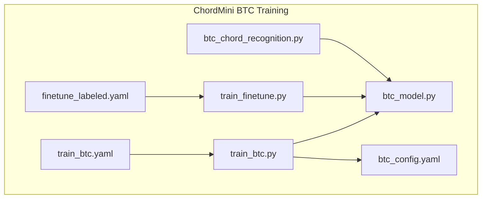
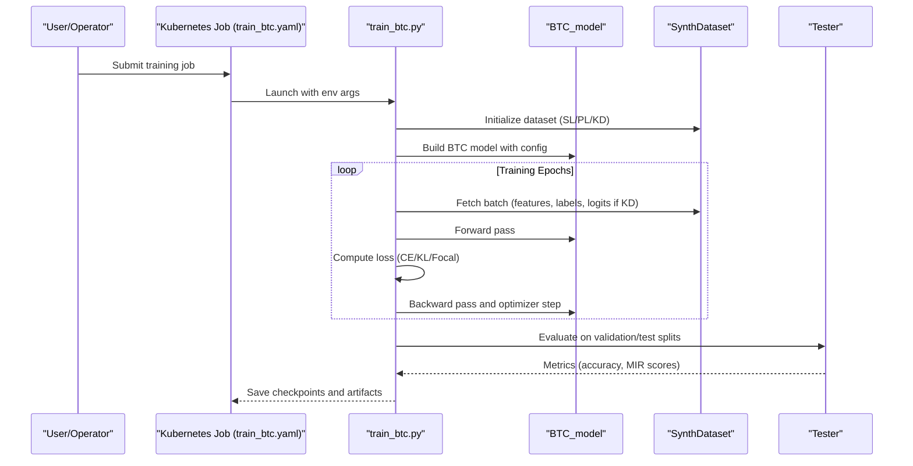
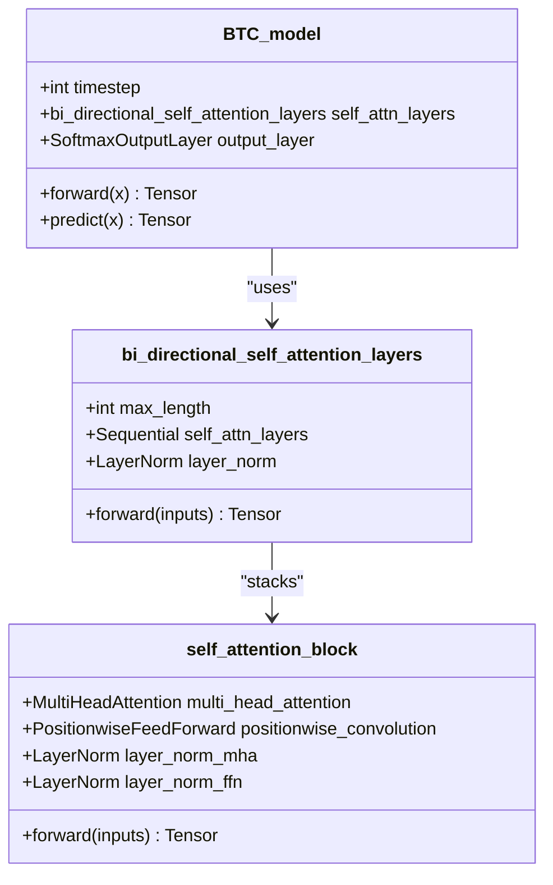
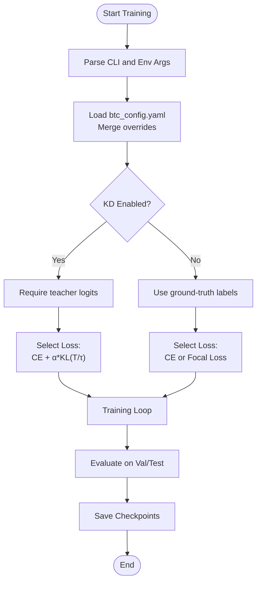
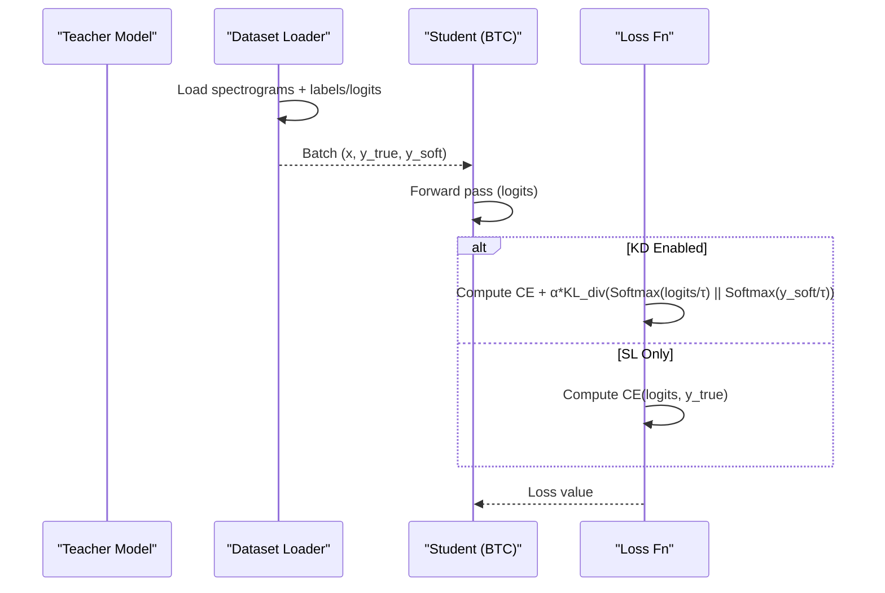
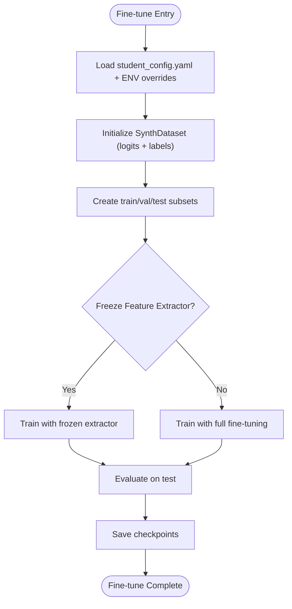
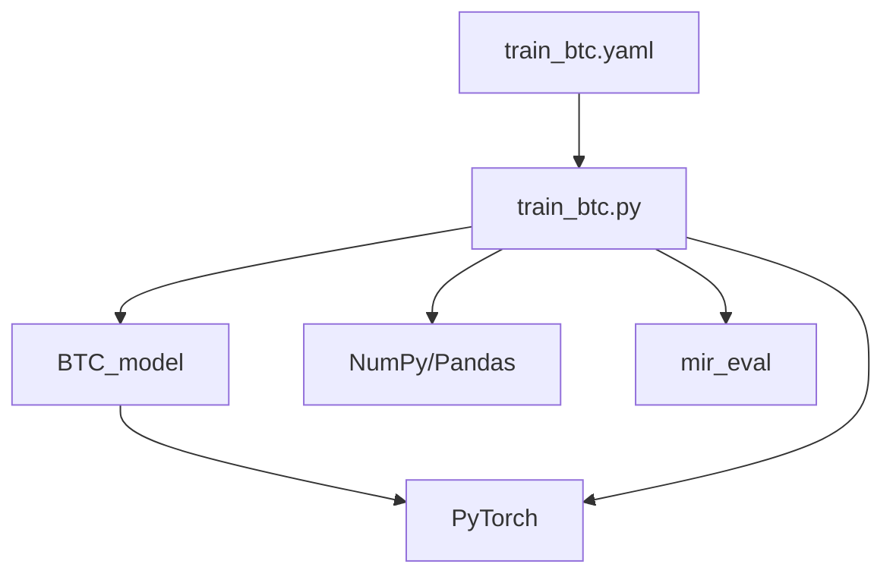

# BTC Model Training and Distillation

<cite>
**Referenced Files in This Document**
- [train_btc.py](file://python_backend/models/ChordMini/train_btc.py)
- [train_btc.yaml](file://python_backend/models/ChordMini/train_btc.yaml)
- [btc_model.py](file://python_backend/models/ChordMini/modules/models/Transformer/btc_model.py)
- [btc_config.yaml](file://python_backend/models/ChordMini/config/btc_config.yaml)
- [btc_chord_recognition.py](file://python_backend/models/ChordMini/btc_chord_recognition.py)
- [finetune_labeled.yaml](file://python_backend/models/ChordMini/finetune_labeled.yaml)
- [train_finetune.py](file://python_backend/models/ChordMini/train_finetune.py)
</cite>

## Table of Contents
1. [Introduction](#introduction)
2. [Project Structure](#project-structure)
3. [Core Components](#core-components)
4. [Architecture Overview](#architecture-overview)
5. [Detailed Component Analysis](#detailed-component-analysis)
6. [Dependency Analysis](#dependency-analysis)
7. [Performance Considerations](#performance-considerations)
8. [Troubleshooting Guide](#troubleshooting-guide)
9. [Conclusion](#conclusion)
10. [Appendices](#appendices)

## Introduction
This document explains the BTC (Bi-Directional Transformer Chord) model training methodologies, focusing on self-label (SL) and pseudo-label (PL) variants within the ChordMini ecosystem. It covers the teacher-student distillation process, knowledge transfer mechanisms, and model compression techniques. The guide details the training pipeline for both SL and PL variants, including data preparation, pseudo-label generation, and fine-tuning procedures. It also documents curriculum learning approaches, cross-validation strategies, hyperparameter optimization, model configuration files, training schedules, and evaluation metrics. Practical examples demonstrate training execution, checkpoint management, and performance monitoring, along with trade-offs among model size, accuracy, and computational efficiency. Finally, it explains integration with the broader ChordMini ecosystem and deployment considerations for production environments.

## Project Structure
The BTC training implementation resides under the ChordMini module within the Python backend. Key components include:
- Training entry points for BTC and fine-tuning
- BTC model architecture
- Configuration files for model and experiment parameters
- Kubernetes job configurations for training automation
- Inference module for API usage

**Diagram sources**
- [train_btc.py:1-1343](file://python_backend/models/ChordMini/train_btc.py#L1-L1343)
- [btc_model.py:1-337](file://python_backend/models/ChordMini/modules/models/Transformer/btc_model.py#L1-L337)
- [btc_config.yaml:1-50](file://python_backend/models/ChordMini/config/btc_config.yaml#L1-L50)
- [train_btc.yaml:1-434](file://python_backend/models/ChordMini/train_btc.yaml#L1-L434)
- [btc_chord_recognition.py:1-357](file://python_backend/models/ChordMini/btc_chord_recognition.py#L1-L357)
- [finetune_labeled.yaml:1-438](file://python_backend/models/ChordMini/finetune_labeled.yaml#L1-L438)
- [train_finetune.py:1-1334](file://python_backend/models/ChordMini/train_finetune.py#L1-L1334)

**Section sources**
- [train_btc.py:1-1343](file://python_backend/models/ChordMini/train_btc.py#L1-L1343)
- [train_btc.yaml:1-434](file://python_backend/models/ChordMini/train_btc.yaml#L1-L434)
- [btc_model.py:1-337](file://python_backend/models/ChordMini/modules/models/Transformer/btc_model.py#L1-L337)
- [btc_config.yaml:1-50](file://python_backend/models/ChordMini/config/btc_config.yaml#L1-L50)
- [btc_chord_recognition.py:1-357](file://python_backend/models/ChordMini/btc_chord_recognition.py#L1-L357)
- [finetune_labeled.yaml:1-438](file://python_backend/models/ChordMini/finetune_labeled.yaml#L1-L438)
- [train_finetune.py:1-1334](file://python_backend/models/ChordMini/train_finetune.py#L1-L1334)

## Core Components
- BTC Model: Implements bi-directional self-attention layers with a softmax output layer. It accepts spectrogram features and produces per-frame chord logits.
- Training Pipeline: Supports supervised learning (SL) and pseudo-label (PL) scenarios. It integrates knowledge distillation (KD) with optional focal loss and curriculum-style warmup.
- Configuration: btc_config.yaml defines model architecture, feature dimensions, and training parameters.
- Inference: btc_chord_recognition.py provides API-friendly inference using SL or PL checkpoints and standardized chord labeling.

Key implementation references:
- BTC model forward pass and segmentation: [btc_model.py:186-264](file://python_backend/models/ChordMini/modules/models/Transformer/btc_model.py#L186-L264)
- Training entry point and KD/focal loss integration: [train_btc.py:288-333](file://python_backend/models/ChordMini/train_btc.py#L288-L333)
- Configuration parameters: [btc_config.yaml:14-44](file://python_backend/models/ChordMini/config/btc_config.yaml#L14-L44)

**Section sources**
- [btc_model.py:158-264](file://python_backend/models/ChordMini/modules/models/Transformer/btc_model.py#L158-L264)
- [train_btc.py:288-333](file://python_backend/models/ChordMini/train_btc.py#L288-L333)
- [btc_config.yaml:14-44](file://python_backend/models/ChordMini/config/btc_config.yaml#L14-L44)

## Architecture Overview
The BTC training architecture supports:
- Supervised Learning (SL): Uses ground-truth labels from synthetic datasets.
- Pseudo-Label (PL): Incorporates teacher logits for distillation when available.
- Knowledge Distillation: Combines cross-entropy with a KL divergence term using a temperature-scaled softmax.
- Curriculum Learning: Optional warmup scheduling to stabilize early training.
- Model Compression: Large vocabulary (170 chords) with configurable dropout and attention layers.

**Diagram sources**
- [train_btc.py:35-800](file://python_backend/models/ChordMini/train_btc.py#L35-L800)
- [train_btc.yaml:1-434](file://python_backend/models/ChordMini/train_btc.yaml#L1-L434)
- [btc_model.py:158-264](file://python_backend/models/ChordMini/modules/models/Transformer/btc_model.py#L158-L264)

## Detailed Component Analysis

### BTC Model Architecture
The BTC model comprises bi-directional self-attention layers with position-wise feed-forward networks and residual connections. It normalizes inputs and projects them into a hidden space before applying multi-head attention and feed-forward blocks. The output layer produces per-frame logits for chord classification.

**Diagram sources**
- [btc_model.py:158-264](file://python_backend/models/ChordMini/modules/models/Transformer/btc_model.py#L158-L264)
- [btc_model.py:7-98](file://python_backend/models/ChordMini/modules/models/Transformer/btc_model.py#L7-L98)

**Section sources**
- [btc_model.py:158-264](file://python_backend/models/ChordMini/modules/models/Transformer/btc_model.py#L158-L264)

### Training Pipeline for SL and PL Variants
The training pipeline supports:
- SL Training: Standard supervised cross-entropy loss on ground-truth labels.
- PL Training: Uses teacher logits for distillation when available; falls back to CE when logits are absent.
- KD Integration: Combines CE and KL divergence with configurable alpha and temperature.
- Focal Loss: Optional to handle class imbalance.
- Curriculum Learning: Warmup scheduling for learning rate.

**Diagram sources**
- [train_btc.py:288-333](file://python_backend/models/ChordMini/train_btc.py#L288-L333)
- [train_btc.py:560-673](file://python_backend/models/ChordMini/train_btc.py#L560-L673)

**Section sources**
- [train_btc.py:288-333](file://python_backend/models/ChordMini/train_btc.py#L288-L333)
- [train_btc.py:560-673](file://python_backend/models/ChordMini/train_btc.py#L560-L673)

### Knowledge Transfer and Distillation Mechanisms
- Teacher-Student Setup: BTC student model trained with teacher logits for improved generalization.
- Loss Composition: Final loss combines CE and KL divergence with a mixing coefficient alpha and temperature τ.
- Normalization Alignment: Uses mean/std from a teacher checkpoint to align feature distributions.

**Diagram sources**
- [train_btc.py:288-333](file://python_backend/models/ChordMini/train_btc.py#L288-L333)
- [train_btc.py:732-741](file://python_backend/models/ChordMini/train_btc.py#L732-L741)

**Section sources**
- [train_btc.py:288-333](file://python_backend/models/ChordMini/train_btc.py#L288-L333)
- [train_btc.py:732-741](file://python_backend/models/ChordMini/train_btc.py#L732-L741)

### Data Preparation and Pseudo-Label Generation
- Dataset Types: Supports FMA, Maestro, and DALI synthetic datasets. Combined datasets supported.
- Pseudo-Label Availability: When logits are provided, PL training leverages them; otherwise, SL training proceeds with labels.
- Normalization: Loads mean/std from a teacher checkpoint to align features across datasets.

Practical guidance:
- Use logits_dir for PL training when available.
- Ensure label directories contain .lab files aligned to spectrogram frames.
- For SL, ensure label directories contain ground-truth labels.

**Section sources**
- [train_btc.py:423-509](file://python_backend/models/ChordMini/train_btc.py#L423-L509)
- [train_btc.py:732-741](file://python_backend/models/ChordMini/train_btc.py#L732-L741)

### Fine-Tuning Procedures (Cross-Validation and Production)
- Fine-tuning Workflow: Uses pre-computed spectrograms/logits with real labels. Supports freezing feature extractor and curriculum-style warmup.
- Cross-Validation: The fine-tuning script creates train/val/test splits via SynthSegmentSubset and evaluates on test.
- Production Deployment: Inference module loads model checkpoints and performs standardized chord labeling for API usage.

**Diagram sources**
- [train_finetune.py:731-763](file://python_backend/models/ChordMini/train_finetune.py#L731-L763)
- [finetune_labeled.yaml:310-417](file://python_backend/models/ChordMini/finetune_labeled.yaml#L310-L417)

**Section sources**
- [train_finetune.py:731-763](file://python_backend/models/ChordMini/train_finetune.py#L731-L763)
- [finetune_labeled.yaml:310-417](file://python_backend/models/ChordMini/finetune_labeled.yaml#L310-L417)

### Hyperparameter Optimization and Schedules
- Learning Rate Schedules: Cosine, linear decay, one-cycle, cosine restarts, validation-based, or none.
- Warmup: Optional warmup with configurable start/end LR and epochs.
- Focal Loss: Gamma and Alpha parameters for handling class imbalance.
- KD Parameters: Alpha (mixing weight) and Temperature (softening) for distillation.

**Section sources**
- [train_btc.py:56-89](file://python_backend/models/ChordMini/train_btc.py#L56-L89)
- [train_btc.py:754-788](file://python_backend/models/ChordMini/train_btc.py#L754-L788)

### Model Configuration Files and Training Schedules
- btc_config.yaml: Defines model architecture (hidden size, layers, heads, dropout), feature dimensions, and training parameters.
- train_btc.yaml: Kubernetes job specification for BTC training with environment-driven overrides for LR, KD, focal loss, and dataset selection.

**Section sources**
- [btc_config.yaml:14-44](file://python_backend/models/ChordMini/config/btc_config.yaml#L14-L44)
- [train_btc.yaml:152-220](file://python_backend/models/ChordMini/train_btc.yaml#L152-L220)

### Evaluation Metrics and Monitoring
- MIR Evaluation: Uses large vocabulary scoring functions and standardized chord label processing.
- Logging: Verbosity controlled via config/env; detailed logs for mapping analysis and batch verification.
- Metrics: Accuracy, MIR scores computed during evaluation; individual chord accuracy available.

**Section sources**
- [train_finetune.py:191-294](file://python_backend/models/ChordMini/train_finetune.py#L191-L294)
- [train_btc.py:629-673](file://python_backend/models/ChordMini/train_btc.py#L629-L673)

## Dependency Analysis
The BTC training pipeline depends on:
- PyTorch for model definition and training loops
- NumPy/Pandas for data handling
- mir_eval for chord evaluation
- Kubernetes Jobs for orchestration

**Diagram sources**
- [train_btc.py:1-30](file://python_backend/models/ChordMini/train_btc.py#L1-L30)
- [btc_model.py:1-5](file://python_backend/models/ChordMini/modules/models/Transformer/btc_model.py#L1-L5)

**Section sources**
- [train_btc.py:1-30](file://python_backend/models/ChordMini/train_btc.py#L1-L30)
- [btc_model.py:1-5](file://python_backend/models/ChordMini/modules/models/Transformer/btc_model.py#L1-L5)

## Performance Considerations
- GPU Memory Optimization: Batch GPU caching, prefetch factors, and lazy initialization reduce memory pressure.
- Dataset Caching: Metadata-only or full caching reduces I/O overhead; cache fractions can be tuned.
- Dropout and Model Depth: Configurable dropout and attention layers balance capacity and generalization.
- Curriculum Warmup: Stabilizes early training and improves convergence speed.

[No sources needed since this section provides general guidance]

## Troubleshooting Guide
Common issues and resolutions:
- Missing teacher logits: When KD is enabled but logits are absent, the pipeline falls back to CE; verify logits_dir paths.
- Data loader empty: Ensure spectrogram and label directories contain matching files; verify dataset_type and paths.
- GPU memory errors: Reduce batch size, enable metadata cache, or disable cache to lower memory footprint.
- Checkpoint loading: Use load_checkpoint with reset_epoch/reset_scheduler flags to control state restoration.

**Section sources**
- [train_btc.py:612-629](file://python_backend/models/ChordMini/train_btc.py#L612-L629)
- [train_btc.py:797-800](file://python_backend/models/ChordMini/train_btc.py#L797-L800)

## Conclusion
The BTC training methodology integrates supervised and pseudo-label paradigms with knowledge distillation and curriculum learning. The modular design enables flexible configurations, robust data handling, and scalable training via Kubernetes. The inference module ensures seamless deployment for production environments, while evaluation utilities support continuous monitoring and improvement.

[No sources needed since this section summarizes without analyzing specific files]

## Appendices

### Practical Training Execution Examples
- Single-GPU BTC Training (SL/PL/KD): Use train_btc.yaml to launch a Kubernetes job with environment overrides for dataset type, LR schedule, KD, and focal loss.
- Fine-tuning with Real Labels: Use finetune_labeled.yaml to run fine-tuning with pre-computed logits and real labels, enabling cross-validation and evaluation.

**Section sources**
- [train_btc.yaml:228-417](file://python_backend/models/ChordMini/train_btc.yaml#L228-L417)
- [finetune_labeled.yaml:253-417](file://python_backend/models/ChordMini/finetune_labeled.yaml#L253-L417)

### Checkpoint Management and Monitoring
- Centralized Checkpoints: Use save_dir to specify checkpoint locations; subdirectories can organize runs.
- Best Model Selection: Jobs save best checkpoints; loading supports reset_epoch and reset_scheduler flags.
- Monitoring: Logging verbosity and evaluation metrics provide insights into training progress.

**Section sources**
- [train_btc.py:254-261](file://python_backend/models/ChordMini/train_btc.py#L254-L261)
- [train_btc.yaml:352-394](file://python_backend/models/ChordMini/train_btc.yaml#L352-L394)

### Trade-offs: Size, Accuracy, Efficiency
- Model Size: Hidden size, number of layers, and heads influence accuracy and latency.
- Accuracy: Large vocabulary (170 chords) improves expressiveness; KD with teacher logits enhances generalization.
- Computational Efficiency: Dropout, attention heads, and caching strategies balance speed and memory usage.

[No sources needed since this section provides general guidance]