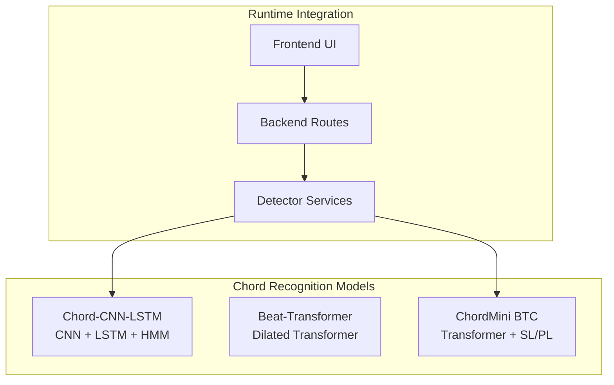
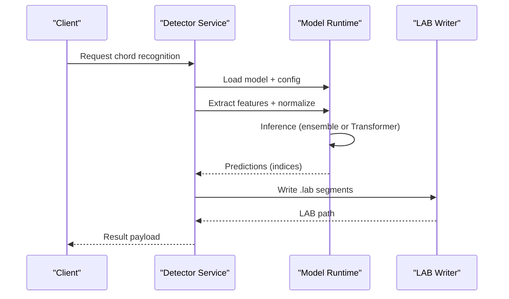
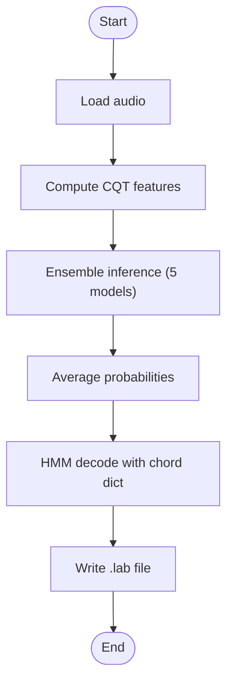
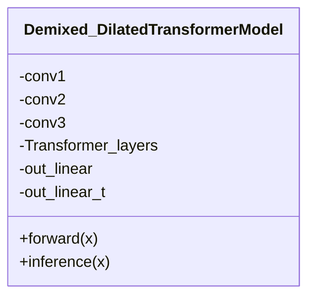
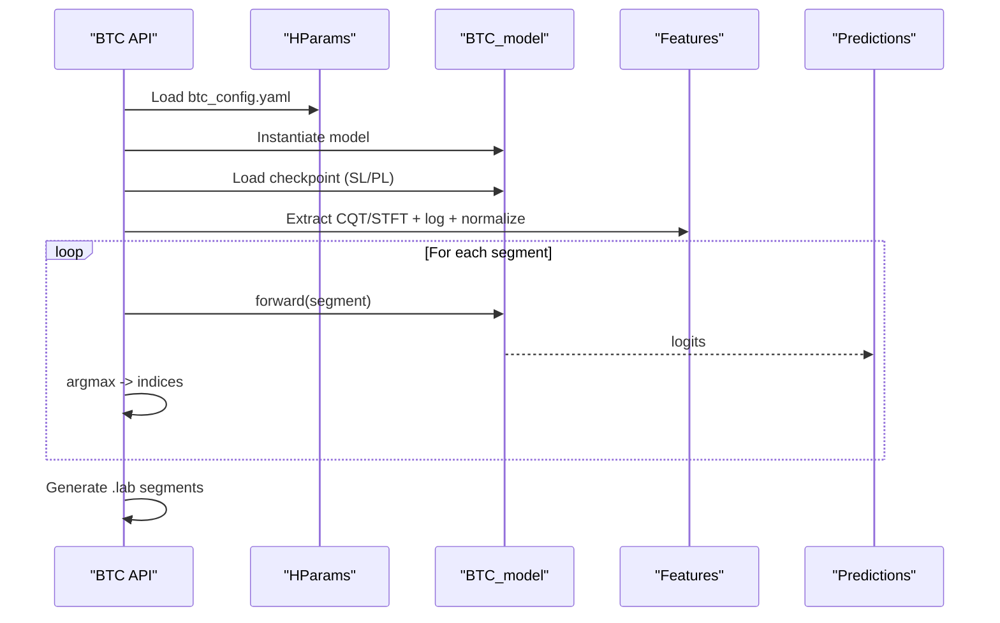
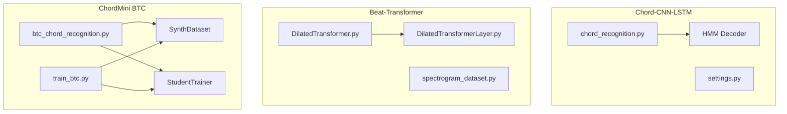

# Chord Recognition Models

<cite>
**Referenced Files in This Document**
- [README.md](file://python_backend/models/Chord-CNN-LSTM/README.MD)
- [settings.py](file://python_backend/models/Chord-CNN-LSTM/settings.py)
- [chord_recognition.py](file://python_backend/models/Chord-CNN-LSTM/chord_recognition.py)
- [README.md](file://python_backend/models/Beat-Transformer/README.md)
- [DilatedTransformer.py](file://python_backend/models/Beat-Transformer/code/DilatedTransformer.py)
- [README.md](file://python_backend/models/ChordMini/README.md)
- [btc_config.yaml](file://python_backend/models/ChordMini/config/btc_config.yaml)
- [student_config.yaml](file://python_backend/models/ChordMini/config/student_config.yaml)
- [btc_chord_recognition.py](file://python_backend/models/ChordMini/btc_chord_recognition.py)
- [train_btc.py](file://python_backend/models/ChordMini/train_btc.py)
- [chord_cnn_lstm_detector.py](file://python_backend/services/detectors/chord_cnn_lstm_detector.py)
- `Machine Learning Models/Adding New Models.md`
</cite>

## Table of Contents
1. [Introduction](#introduction)
2. [Project Structure](#project-structure)
3. [Core Components](#core-components)
4. [Architecture Overview](#architecture-overview)
5. [Detailed Component Analysis](#detailed-component-analysis)
6. [Dependency Analysis](#dependency-analysis)
7. [Performance Considerations](#performance-considerations)
8. [Troubleshooting Guide](#troubleshooting-guide)
9. [Conclusion](#conclusion)
10. [Appendices](#appendices)

## Introduction
This document explains the chord recognition models in ChordMiniApp, focusing on:
- Chord-CNN-LSTM: convolutional neural network and LSTM-based architecture for chord transcription.
- Beat-Transformer Chord (BTC) models: SL (Self-Label) and PL (Pseudo-Label) variants with training methodology and performance characteristics.
It covers model training, dataset preparation, evaluation metrics, model loading and initialization, parameter configuration, inference optimization, chord labeling schemes, normalization, and post-processing. Differences between approaches and troubleshooting guidance are also provided.

For adding a new chord model, start with the general workflow in `Machine Learning Models/Adding New Models.md`, then follow its chord-recognition example.

## Project Structure
The chord recognition stack spans three major model families:
- Chord-CNN-LSTM: deep CNN-LSTM pipeline with HMM decoding.
- Beat-Transformer: dilated self-attention transformer for beat/downbeat tracking and chord modeling.
- ChordMini BTC: large-vocabulary chord classification using Transformer blocks, with SL and PL training modes.

[No sources needed since this diagram shows conceptual workflow, not actual code structure]

## Core Components
- Chord-CNN-LSTM
  - Feature extraction via CQT, CNN-LSTM inference, and HMM decoding to produce chord labels.
  - Supports multiple chord dictionaries for decoding.
- Beat-Transformer
  - Convolutional front-end followed by dilated self-attention layers for temporal and instrument-wise modeling.
- ChordMini BTC
  - Transformer-based large-vocabulary chord classification with SL and PL training variants.
  - Robust feature extraction, normalization, and segment-wise inference with .lab output generation.

**Section sources**
- [README.md:1-64](file://python_backend/models/Chord-CNN-LSTM/README.MD#L1-L64)
- [README.md:1-75](file://python_backend/models/Beat-Transformer/README.md#L1-L75)
- [README.md:1-1](file://python_backend/models/ChordMini/README.md#L1-L1)

## Architecture Overview
The end-to-end flow differs by model family:

- Chord-CNN-LSTM
  - Audio → CQT → CNN-LSTM ensemble → Averaged probabilities → HMM decoding → LAB output.
- Beat-Transformer
  - Demixed spectrograms → Conv2D front-end → DilatedTransformer layers → Beat/downbeat and chord outputs.
- ChordMini BTC
  - Audio → CQT/STFT → Log-magnitude → Normalize → Segment-wise inference → Argmax → LAB output.

[No sources needed since this diagram shows conceptual workflow, not actual code structure]

## Detailed Component Analysis

### Chord-CNN-LSTM
- Pipeline
  - Audio loading and resampling to default sample rate.
  - CQT feature extraction with default hop length.
  - Ensemble of five CNN-LSTM models (checkpoint files) with averaging of probabilities.
  - HMM decoding using a selected chord dictionary to produce chord labels.
  - LAB file output with start/end timestamps and chord names.
- Key parameters
  - Sample rate, hop length, and chord dictionary selection influence accuracy and vocabulary coverage.
- Post-processing
  - LAB segments aggregated from decoded frames; minimal smoothing applied.

**Diagram sources**
- [chord_recognition.py:24-187](file://python_backend/models/Chord-CNN-LSTM/chord_recognition.py#L24-L187)

**Section sources**
- [README.md:14-34](file://python_backend/models/Chord-CNN-LSTM/README.MD#L14-L34)
- [settings.py:1-18](file://python_backend/models/Chord-CNN-LSTM/settings.py#L1-L18)
- [chord_recognition.py:24-187](file://python_backend/models/Chord-CNN-LSTM/chord_recognition.py#L24-L187)

### Beat-Transformer (Conv2D + Dilated Self-Attention)
- Architecture highlights
  - Conv2D front-end with pooling and dropout.
  - DilatedTransformer layers alternating with periodic instrument-wise attention.
  - Output heads for chord classification and beat regression.
- Inference
  - Optional attention accumulation for interpretability.

**Diagram sources**
- [DilatedTransformer.py:7-90](file://python_backend/models/Beat-Transformer/code/DilatedTransformer.py#L7-L90)

**Section sources**
- [README.md:1-75](file://python_backend/models/Beat-Transformer/README.md#L1-L75)
- [DilatedTransformer.py:7-90](file://python_backend/models/Beat-Transformer/code/DilatedTransformer.py#L7-L90)

### ChordMini BTC (SL and PL)
- Configurations
  - btc_config.yaml defines feature dimensions, sequence length, model sizes, and training hyperparameters.
  - student_config.yaml extends training knobs (focal loss, knowledge distillation, LR schedules).
- Training
  - SL (Self-Label): supervised training with labeled synthetic data.
  - PL (Pseudo-Label): training with pseudo-labeled data; supports teacher-student distillation.
  - Supports distributed training and dataset combinations (FMA, MAESTRO, DALI).
- Inference
  - Loads checkpoint (SL or PL), normalizes features using checkpoint stats, segments long audio, runs argmax prediction, and writes .lab with standardized chord notation.

**Diagram sources**
- [btc_chord_recognition.py:166-357](file://python_backend/models/ChordMini/btc_chord_recognition.py#L166-L357)
- [btc_config.yaml:1-50](file://python_backend/models/ChordMini/config/btc_config.yaml#L1-L50)
- [student_config.yaml:1-94](file://python_backend/models/ChordMini/config/student_config.yaml#L1-L94)

**Section sources**
- [btc_chord_recognition.py:166-357](file://python_backend/models/ChordMini/btc_chord_recognition.py#L166-L357)
- [btc_config.yaml:1-50](file://python_backend/models/ChordMini/config/btc_config.yaml#L1-L50)
- [student_config.yaml:1-94](file://python_backend/models/ChordMini/config/student_config.yaml#L1-L94)
- [train_btc.py:35-800](file://python_backend/models/ChordMini/train_btc.py#L35-L800)

## Dependency Analysis
- Chord-CNN-LSTM
  - Uses MIR library utilities for data entry and I/O, and an HMM decoder for sequence labeling.
  - Depends on librosa for audio loading and CQT extraction.
- Beat-Transformer
  - Implements custom DilatedTransformer and DilatedTransformerLayer modules.
  - Uses spectrogram datasets and training utilities.
- ChordMini BTC
  - Integrates with SynthDataset, Trainer classes, and mir_eval utilities.
  - Supports SL and PL training modes with optional knowledge distillation.

**Diagram sources**
- [chord_recognition.py:1-206](file://python_backend/models/Chord-CNN-LSTM/chord_recognition.py#L1-L206)
- [DilatedTransformer.py:1-168](file://python_backend/models/Beat-Transformer/code/DilatedTransformer.py#L1-L168)
- [btc_chord_recognition.py:1-357](file://python_backend/models/ChordMini/btc_chord_recognition.py#L1-L357)
- [train_btc.py:1-800](file://python_backend/models/ChordMini/train_btc.py#L1-L800)

**Section sources**
- [chord_recognition.py:1-206](file://python_backend/models/Chord-CNN-LSTM/chord_recognition.py#L1-L206)
- [DilatedTransformer.py:1-168](file://python_backend/models/Beat-Transformer/code/DilatedTransformer.py#L1-L168)
- [btc_chord_recognition.py:1-357](file://python_backend/models/ChordMini/btc_chord_recognition.py#L1-L357)
- [train_btc.py:1-800](file://python_backend/models/ChordMini/train_btc.py#L1-L800)

## Performance Considerations
- Chord-CNN-LSTM
  - Ensemble inference improves robustness but increases latency; consider reducing ensemble size or optimizing CQT computation.
  - HMM decoding adds computational overhead; tune dictionary size and penalties for speed vs. accuracy.
- Beat-Transformer
  - Conv2D front-end reduces dimensionality; dilated attention enables long-range modeling with manageable cost.
  - Inference can optionally accumulate attention matrices for interpretability at extra compute cost.
- ChordMini BTC
  - Large vocabulary (170 chords) increases classification difficulty; focal loss and KD can improve class balance and accuracy.
  - Normalization using checkpoint stats ensures consistency across sessions.
  - Segment-wise inference with padding avoids memory spikes; adjust segment length and stride for throughput.

[No sources needed since this section provides general guidance]

## Troubleshooting Guide
- Chord-CNN-LSTM
  - Symptom: Only “N” chords detected.
    - Causes: Low harmonic content, corrupted checkpoints, incorrect CQT extraction, or HMM parameter mismatch.
    - Actions: Verify audio quality, re-extract CQT, confirm chord dictionary alignment, and inspect model probabilities.
  - Symptom: Slow inference.
    - Actions: Reduce ensemble size, optimize CQT hop length, or switch to a lighter model variant.
- Beat-Transformer
  - Symptom: Out-of-memory during training/inference.
    - Actions: Lower batch size, reduce sequence length, or enable mixed precision if available.
  - Symptom: Poor beat/downbeat alignment.
    - Actions: Adjust dilated attention parameters and ensure demixed spectrogram quality.
- ChordMini BTC
  - Symptom: Incorrect normalization leading to poor logits.
    - Actions: Ensure checkpoint stats are loaded and used; verify feature dimensions and log-scaling.
  - Symptom: Misaligned segments in .lab output.
    - Actions: Confirm hop length and frame duration; enforce minimum segment duration and standardize chord notation.
  - Symptom: Missing checkpoints.
    - Actions: Validate checkpoint paths and formats; handle both SL and PL checkpoint structures.

**Section sources**
- [chord_recognition.py:166-187](file://python_backend/models/Chord-CNN-LSTM/chord_recognition.py#L166-L187)
- [btc_chord_recognition.py:202-251](file://python_backend/models/ChordMini/btc_chord_recognition.py#L202-L251)
- [train_btc.py:797-800](file://python_backend/models/ChordMini/train_btc.py#L797-L800)

## Conclusion
ChordMiniApp integrates complementary chord recognition technologies:
- Chord-CNN-LSTM leverages CNN-LSTM ensembles with HMM decoding for robust transcription.
- Beat-Transformer applies dilated self-attention to beat/downbeat and chord modeling.
- ChordMini BTC provides large-vocabulary classification with SL and PL training, strong normalization, and efficient inference.
Choosing the right model depends on dataset characteristics, vocabulary needs, and performance constraints. Proper configuration, normalization, and post-processing yield reliable chord labeling.

[No sources needed since this section summarizes without analyzing specific files]

## Appendices

### Model Loading and Initialization Procedures
- Chord-CNN-LSTM
  - Loads ensemble models from cache_data and initializes HMM decoder with a chosen chord dictionary.
- Beat-Transformer
  - Instantiates Demixed_DilatedTransformerModel and prepares conv2D front-end and dilated layers.
- ChordMini BTC
  - Loads HParams from btc_config.yaml, constructs BTC_model, loads SL or PL checkpoint, normalizes features, and runs segment-wise inference.

**Section sources**
- [chord_recognition.py:24-42](file://python_backend/models/Chord-CNN-LSTM/chord_recognition.py#L24-L42)
- [DilatedTransformer.py:7-36](file://python_backend/models/Beat-Transformer/code/DilatedTransformer.py#L7-L36)
- [btc_chord_recognition.py:190-251](file://python_backend/models/ChordMini/btc_chord_recognition.py#L190-L251)

### Parameter Configuration
- Chord-CNN-LSTM
  - Sample rate, hop length, and chord dictionary selection are configurable via settings and CLI.
- Beat-Transformer
  - Model depth, heads, and dilated attention parameters are defined in the model class.
- ChordMini BTC
  - Feature dimensions, sequence length, model sizes, and training hyperparameters are defined in btc_config.yaml and student_config.yaml.

**Section sources**
- [settings.py:1-18](file://python_backend/models/Chord-CNN-LSTM/settings.py#L1-L18)
- [DilatedTransformer.py:8-42](file://python_backend/models/Beat-Transformer/code/DilatedTransformer.py#L8-L42)
- [btc_config.yaml:1-50](file://python_backend/models/ChordMini/config/btc_config.yaml#L1-L50)
- [student_config.yaml:1-94](file://python_backend/models/ChordMini/config/student_config.yaml#L1-L94)

### Inference Optimization
- Chord-CNN-LSTM
  - Ensemble averaging improves accuracy; consider selective model usage for latency-sensitive scenarios.
- Beat-Transformer
  - Use smaller batch sizes and shorter sequences for constrained environments.
- ChordMini BTC
  - Segment-wise inference with padding; tune seq_len and stride; enable caching for repeated access patterns.

**Section sources**
- [chord_recognition.py:82-114](file://python_backend/models/Chord-CNN-LSTM/chord_recognition.py#L82-L114)
- [btc_chord_recognition.py:268-295](file://python_backend/models/ChordMini/btc_chord_recognition.py#L268-L295)
- [train_btc.py:570-627](file://python_backend/models/ChordMini/train_btc.py#L570-L627)

### Chord Labeling Schemes and Post-processing
- Chord-CNN-LSTM
  - Supports multiple chord dictionaries; outputs LAB with standardized chord names.
- ChordMini BTC
  - Converts indices to large-vocabulary chord names; standardizes notation and writes .lab with minimal segment duration thresholds.

**Section sources**
- [README.md:28-34](file://python_backend/models/Chord-CNN-LSTM/README.MD#L28-L34)
- [btc_chord_recognition.py:303-341](file://python_backend/models/ChordMini/btc_chord_recognition.py#L303-L341)

### Integration Notes
- Detector service wrappers normalize model-specific APIs for backend routes and frontend consumption.
- Ensure model availability checks and temporary file handling for LAB outputs.

**Section sources**
- [chord_cnn_lstm_detector.py:32-100](file://python_backend/services/detectors/chord_cnn_lstm_detector.py#L32-L100)
- [chord_cnn_lstm_detector.py:172-224](file://python_backend/services/detectors/chord_cnn_lstm_detector.py#L172-L224)
