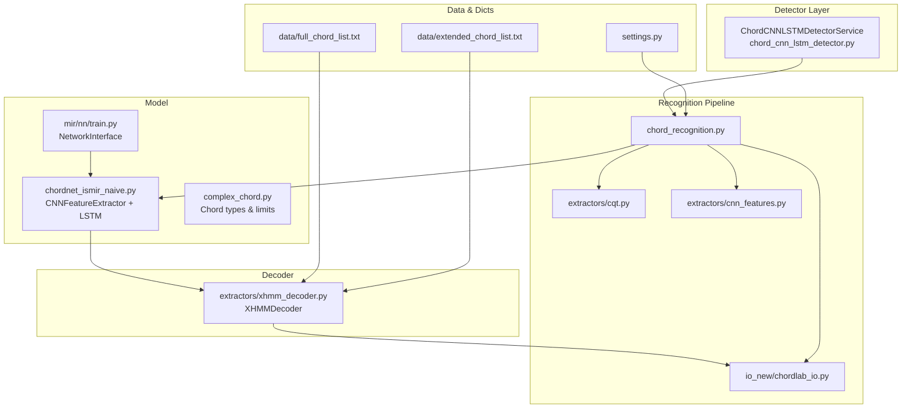
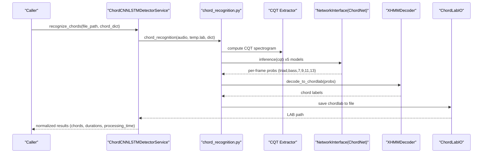
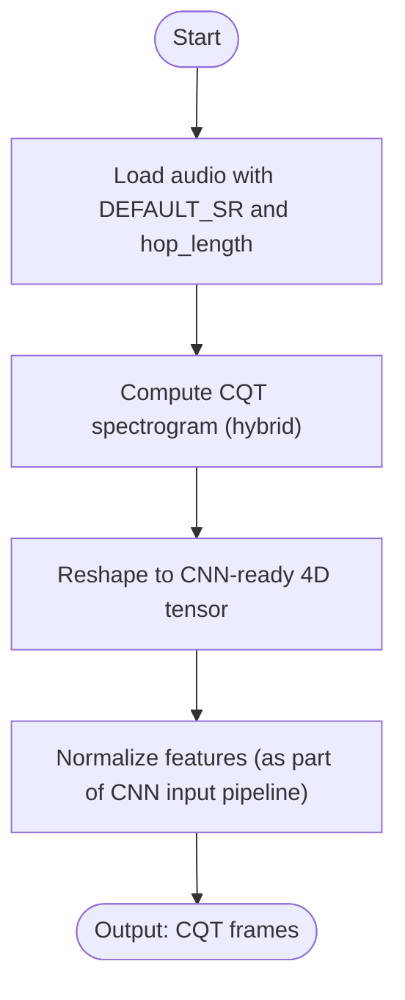
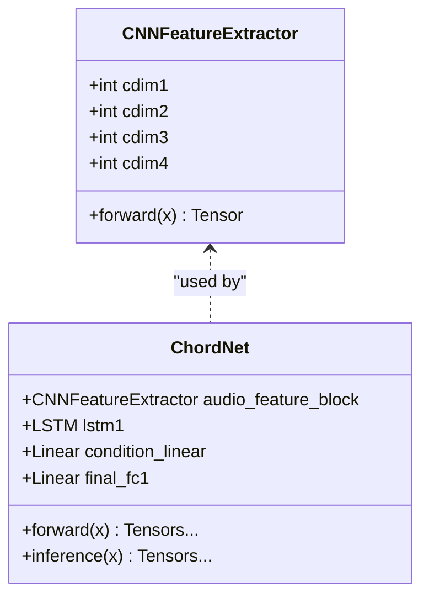
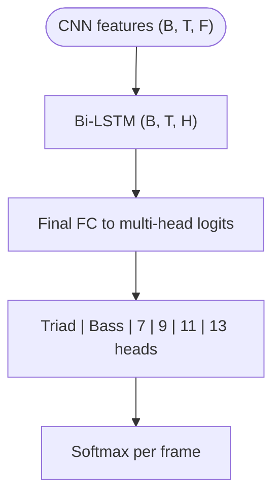
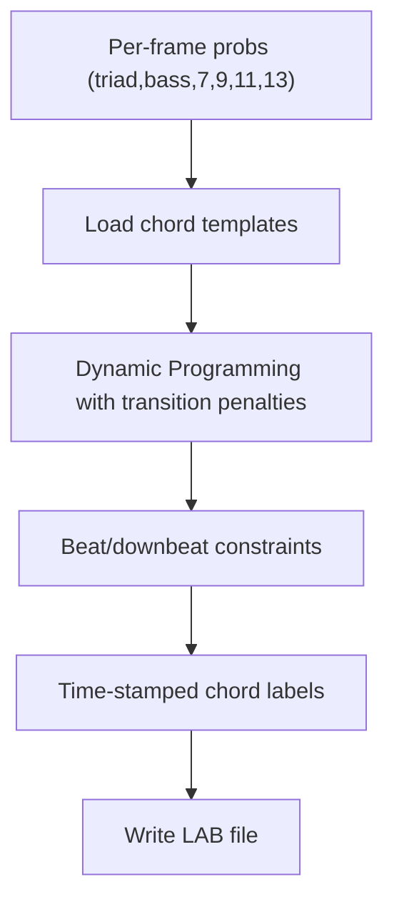
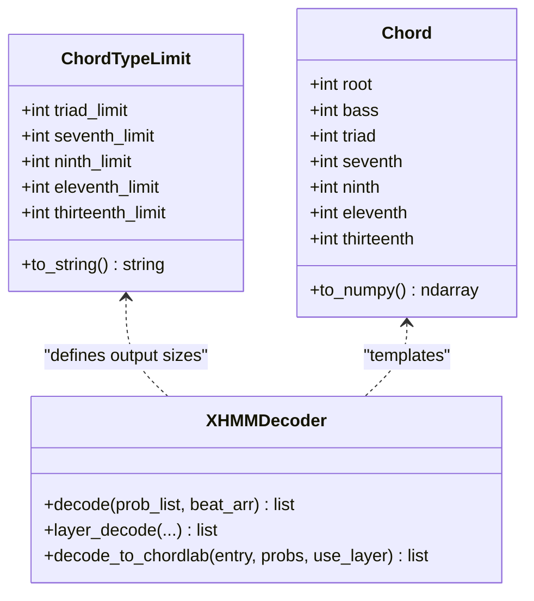
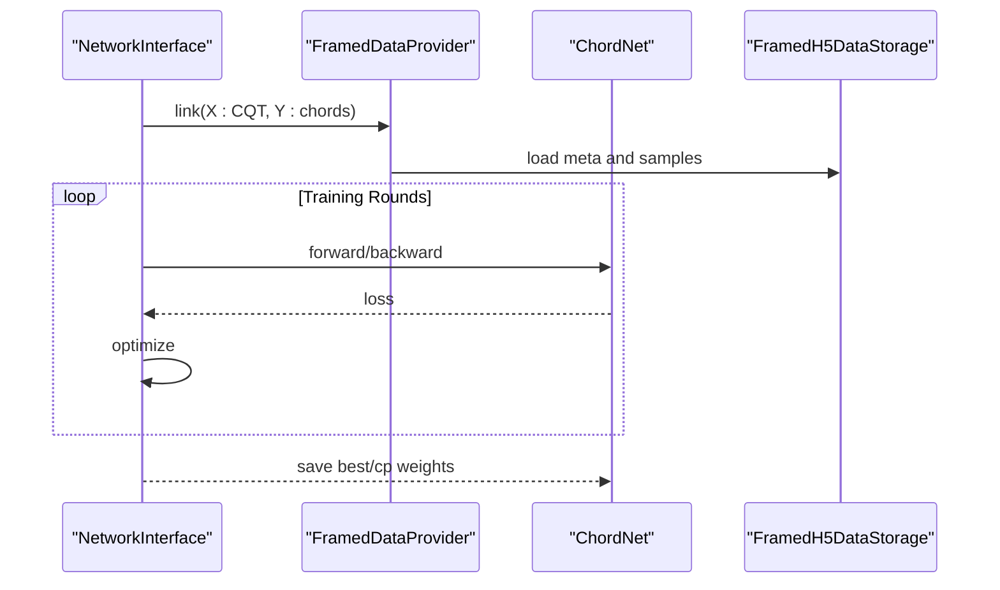
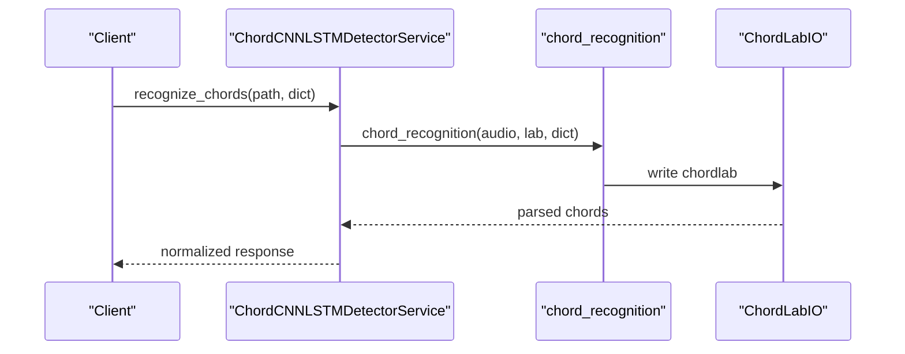
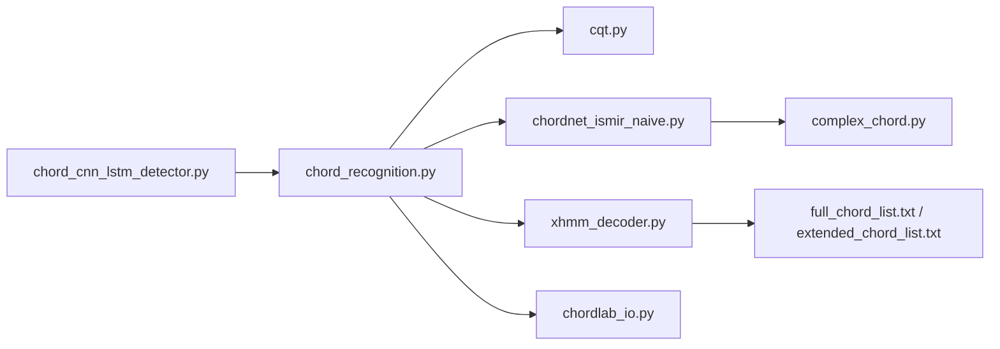

# Chord-CNN-LSTM Architecture

<cite>
**Referenced Files in This Document**
- [chord_cnn_lstm_detector.py](file://python_backend/services/detectors/chord_cnn_lstm_detector.py)
- [chord_recognition.py](file://python_backend/models/Chord-CNN-LSTM/chord_recognition.py)
- [cqt.py](file://python_backend/models/Chord-CNN-LSTM/extractors/cqt.py)
- [cnn_features.py](file://python_backend/models/Chord-CNN-LSTM/extractors/cnn_features.py)
- [xhmm_decoder.py](file://python_backend/models/Chord-CNN-LSTM/extractors/xhmm_decoder.py)
- [chordnet_ismir_naive.py](file://python_backend/models/Chord-CNN-LSTM/chordnet_ismir_naive.py)
- [complex_chord.py](file://python_backend/models/Chord-CNN-LSTM/complex_chord.py)
- [settings.py](file://python_backend/models/Chord-CNN-LSTM/settings.py)
- [extended_chord_list.txt](file://python_backend/models/Chord-CNN-LSTM/data/extended_chord_list.txt)
- [full_chord_list.txt](file://python_backend/models/Chord-CNN-LSTM/data/full_chord_list.txt)
- [chordlab_io.py](file://python_backend/models/Chord-CNN-LSTM/io_new/chordlab_io.py)
- [train.py](file://python_backend/models/Chord-CNN-LSTM/mir/nn/train.py)
- [storage_creation.py](file://python_backend/models/Chord-CNN-LSTM/storage_creation.py)
- [chordnet_ismir_naive_eval.py](file://python_backend/models/Chord-CNN-LSTM/chordnet_ismir_naive_eval.py)
</cite>

## Table of Contents
1. [Introduction](#introduction)
2. [Project Structure](#project-structure)
3. [Core Components](#core-components)
4. [Architecture Overview](#architecture-overview)
5. [Detailed Component Analysis](#detailed-component-analysis)
6. [Dependency Analysis](#dependency-analysis)
7. [Performance Considerations](#performance-considerations)
8. [Troubleshooting Guide](#troubleshooting-guide)
9. [Conclusion](#conclusion)

## Introduction
This document explains the Chord-CNN-LSTM architecture for audio chord recognition. The system combines CNN layers for local spectral feature extraction with LSTM layers for temporal modeling of chord progressions, followed by an HMM-based decoder to produce robust chord labels. It covers the input preprocessing pipeline (CQT computation, spectrogram generation), the CNN architecture, LSTM sequence modeling, the final classification head, chord labeling and dictionary management, decoding algorithms, and practical guidance for training, inference, and optimization.

## Project Structure
The Chord-CNN-LSTM implementation resides under python_backend/models/Chord-CNN-LSTM. Key areas:
- Detection service wrapper for backend orchestration
- Recognition pipeline integrating CQT feature extraction, model inference, and HMM decoding
- Feature extractors (CQT variants, CNN feature alignment)
- Model definition (CNN feature extractor + LSTM + multi-head classification)
- Decoder (XHMM) for chord sequence labeling
- Data and chord dictionaries
- Training and evaluation utilities

**Diagram sources**
- [chord_cnn_lstm_detector.py:1-249](file://python_backend/services/detectors/chord_cnn_lstm_detector.py#L1-L249)
- [chord_recognition.py:1-206](file://python_backend/models/Chord-CNN-LSTM/chord_recognition.py#L1-L206)
- [cqt.py:1-70](file://python_backend/models/Chord-CNN-LSTM/extractors/cqt.py#L1-L70)
- [cnn_features.py:1-28](file://python_backend/models/Chord-CNN-LSTM/extractors/cnn_features.py#L1-L28)
- [chordnet_ismir_naive.py:1-317](file://python_backend/models/Chord-CNN-LSTM/chordnet_ismir_naive.py#L1-L317)
- [xhmm_decoder.py:1-230](file://python_backend/models/Chord-CNN-LSTM/extractors/xhmm_decoder.py#L1-L230)
- [chordlab_io.py:1-44](file://python_backend/models/Chord-CNN-LSTM/io_new/chordlab_io.py#L1-L44)
- [settings.py:1-18](file://python_backend/models/Chord-CNN-LSTM/settings.py#L1-L18)
- [full_chord_list.txt:1-383](file://python_backend/models/Chord-CNN-LSTM/data/full_chord_list.txt#L1-L383)
- [extended_chord_list.txt:1-26](file://python_backend/models/Chord-CNN-LSTM/data/extended_chord_list.txt#L1-L26)
- [train.py:1-358](file://python_backend/models/Chord-CNN-LSTM/mir/nn/train.py#L1-L358)

**Section sources**
- [chord_cnn_lstm_detector.py:1-249](file://python_backend/services/detectors/chord_cnn_lstm_detector.py#L1-L249)
- [chord_recognition.py:1-206](file://python_backend/models/Chord-CNN-LSTM/chord_recognition.py#L1-L206)
- [cqt.py:1-70](file://python_backend/models/Chord-CNN-LSTM/extractors/cqt.py#L1-L70)
- [cnn_features.py:1-28](file://python_backend/models/Chord-CNN-LSTM/extractors/cnn_features.py#L1-L28)
- [chordnet_ismir_naive.py:1-317](file://python_backend/models/Chord-CNN-LSTM/chordnet_ismir_naive.py#L1-L317)
- [xhmm_decoder.py:1-230](file://python_backend/models/Chord-CNN-LSTM/extractors/xhmm_decoder.py#L1-L230)
- [chordlab_io.py:1-44](file://python_backend/models/Chord-CNN-LSTM/io_new/chordlab_io.py#L1-L44)
- [settings.py:1-18](file://python_backend/models/Chord-CNN-LSTM/settings.py#L1-L18)
- [full_chord_list.txt:1-383](file://python_backend/models/Chord-CNN-LSTM/data/full_chord_list.txt#L1-L383)
- [extended_chord_list.txt:1-26](file://python_backend/models/Chord-CNN-LSTM/data/extended_chord_list.txt#L1-L26)
- [train.py:1-358](file://python_backend/models/Chord-CNN-LSTM/mir/nn/train.py#L1-L358)

## Core Components
- Detector service: Provides a normalized interface for invoking Chord-CNN-LSTM recognition, including availability checks, execution, and response formatting.
- Recognition pipeline: Orchestrates audio loading, CQT feature extraction, model inference across multiple checkpoints, averaging, HMM decoding, and saving labeled output.
- CNN feature extractor: A multi-stage CNN that learns local spectral patterns from CQT frames.
- LSTM sequence model: Bi-directional LSTM that captures temporal dependencies across frames.
- Multi-head classification: Separate heads for triads, bass, and extended suffixes (7, 9, 11, 13).
- HMM decoder: Uses chord templates and transition penalties to produce temporally coherent chord labels.
- Chord dictionaries: Template lists defining supported chords and inversions.
- I/O: LAB file writer for chord sequences.

**Section sources**
- [chord_cnn_lstm_detector.py:17-249](file://python_backend/services/detectors/chord_cnn_lstm_detector.py#L17-L249)
- [chord_recognition.py:24-187](file://python_backend/models/Chord-CNN-LSTM/chord_recognition.py#L24-L187)
- [chordnet_ismir_naive.py:68-194](file://python_backend/models/Chord-CNN-LSTM/chordnet_ismir_naive.py#L68-L194)
- [xhmm_decoder.py:5-230](file://python_backend/models/Chord-CNN-LSTM/extractors/xhmm_decoder.py#L5-L230)
- [chordlab_io.py:5-44](file://python_backend/models/Chord-CNN-LSTM/io_new/chordlab_io.py#L5-L44)

## Architecture Overview
The end-to-end flow integrates audio preprocessing, deep learning inference, and probabilistic decoding.

**Diagram sources**
- [chord_cnn_lstm_detector.py:78-182](file://python_backend/services/detectors/chord_cnn_lstm_detector.py#L78-L182)
- [chord_recognition.py:24-152](file://python_backend/models/Chord-CNN-LSTM/chord_recognition.py#L24-L152)
- [cqt.py:44-61](file://python_backend/models/Chord-CNN-LSTM/extractors/cqt.py#L44-L61)
- [chordnet_ismir_naive.py:185-194](file://python_backend/models/Chord-CNN-LSTM/chordnet_ismir_naive.py#L185-L194)
- [xhmm_decoder.py:180-191](file://python_backend/models/Chord-CNN-LSTM/extractors/xhmm_decoder.py#L180-L191)
- [chordlab_io.py:21-26](file://python_backend/models/Chord-CNN-LSTM/io_new/chordlab_io.py#L21-L26)

## Detailed Component Analysis

### Input Preprocessing Pipeline
- Audio loading and properties: The pipeline sets sampling rate and hop length, loads audio, and falls back to librosa if needed.
- CQT computation: Uses a hybrid CQT variant optimized for constant-Q representation with specific bins per octave and frame hop.
- Spectrogram generation: Outputs magnitude spectrograms suitable for CNN input.
- Feature normalization: The CNN expects 2D spectrograms shaped for convolution; the pipeline ensures proper dimensions and dtype.

**Diagram sources**
- [chord_recognition.py:48-80](file://python_backend/models/Chord-CNN-LSTM/chord_recognition.py#L48-L80)
- [cqt.py:44-61](file://python_backend/models/Chord-CNN-LSTM/extractors/cqt.py#L44-L61)
- [settings.py:13-14](file://python_backend/models/Chord-CNN-LSTM/settings.py#L13-L14)

**Section sources**
- [chord_recognition.py:48-80](file://python_backend/models/Chord-CNN-LSTM/chord_recognition.py#L48-L80)
- [cqt.py:44-61](file://python_backend/models/Chord-CNN-LSTM/extractors/cqt.py#L44-L61)
- [settings.py:13-14](file://python_backend/models/Chord-CNN-LSTM/settings.py#L13-L14)

### CNN Architecture for Local Pattern Recognition
- Multi-stage CNN with residual-like stacking and downsampling along the time axis.
- Instance normalization after each conv block.
- Final output size computed to feed into LSTM or fully connected layers.

**Diagram sources**
- [chordnet_ismir_naive.py:68-126](file://python_backend/models/Chord-CNN-LSTM/chordnet_ismir_naive.py#L68-L126)
- [chordnet_ismir_naive.py:127-194](file://python_backend/models/Chord-CNN-LSTM/chordnet_ismir_naive.py#L127-L194)

**Section sources**
- [chordnet_ismir_naive.py:68-126](file://python_backend/models/Chord-CNN-LSTM/chordnet_ismir_naive.py#L68-L126)
- [chordnet_ismir_naive.py:127-194](file://python_backend/models/Chord-CNN-LSTM/chordnet_ismir_naive.py#L127-L194)

### LSTM Layers for Temporal Modeling
- Bi-directional LSTM to capture forward and backward context across frames.
- Outputs concatenated logits for multi-part chord labeling (triad, bass, 7, 9, 11, 13).
- Device-aware initialization and inference path.

**Diagram sources**
- [chordnet_ismir_naive.py:137-146](file://python_backend/models/Chord-CNN-LSTM/chordnet_ismir_naive.py#L137-L146)
- [chordnet_ismir_naive.py:161-178](file://python_backend/models/Chord-CNN-LSTM/chordnet_ismir_naive.py#L161-L178)
- [chordnet_ismir_naive.py:185-194](file://python_backend/models/Chord-CNN-LSTM/chordnet_ismir_naive.py#L185-L194)

**Section sources**
- [chordnet_ismir_naive.py:137-146](file://python_backend/models/Chord-CNN-LSTM/chordnet_ismir_naive.py#L137-L146)
- [chordnet_ismir_naive.py:161-178](file://python_backend/models/Chord-CNN-LSTM/chordnet_ismir_naive.py#L161-L178)
- [chordnet_ismir_naive.py:185-194](file://python_backend/models/Chord-CNN-LSTM/chordnet_ismir_naive.py#L185-L194)

### Final Classification Head and Chord Decoding
- Multi-head softmax outputs for triad identities, bass positions, and extended suffixes.
- HMM decoder constructs a chord template set from dictionary files and applies dynamic programming with beat-aligned transitions and penalties.
- Produces time-stamped chord labels in LAB format.

**Diagram sources**
- [xhmm_decoder.py:100-128](file://python_backend/models/Chord-CNN-LSTM/extractors/xhmm_decoder.py#L100-L128)
- [xhmm_decoder.py:180-191](file://python_backend/models/Chord-CNN-LSTM/extractors/xhmm_decoder.py#L180-L191)
- [chordlab_io.py:21-26](file://python_backend/models/Chord-CNN-LSTM/io_new/chordlab_io.py#L21-L26)

**Section sources**
- [xhmm_decoder.py:100-128](file://python_backend/models/Chord-CNN-LSTM/extractors/xhmm_decoder.py#L100-L128)
- [xhmm_decoder.py:180-191](file://python_backend/models/Chord-CNN-LSTM/extractors/xhmm_decoder.py#L180-L191)
- [chordlab_io.py:21-26](file://python_backend/models/Chord-CNN-LSTM/io_new/chordlab_io.py#L21-L26)

### Chord Labeling Scheme, Dictionary Management, and Decoding Algorithms
- Chord types and limits define the maximum supported extensions (7, 9, 11, 13) and triad categories.
- Templates loaded from dictionary files define valid chords and inversions.
- Decoder supports triad-level decoding, layer-wise decoding, and decoration constraints.

**Diagram sources**
- [complex_chord.py:195-213](file://python_backend/models/Chord-CNN-LSTM/complex_chord.py#L195-L213)
- [complex_chord.py:215-246](file://python_backend/models/Chord-CNN-LSTM/complex_chord.py#L215-L246)
- [xhmm_decoder.py:5-13](file://python_backend/models/Chord-CNN-LSTM/extractors/xhmm_decoder.py#L5-L13)

**Section sources**
- [complex_chord.py:195-213](file://python_backend/models/Chord-CNN-LSTM/complex_chord.py#L195-L213)
- [complex_chord.py:215-246](file://python_backend/models/Chord-CNN-LSTM/complex_chord.py#L215-L246)
- [xhmm_decoder.py:5-13](file://python_backend/models/Chord-CNN-LSTM/extractors/xhmm_decoder.py#L5-L13)

### Training Configuration and Execution
- NetworkInterface manages device selection, optimizer, checkpointing, and training loops.
- Data storages and providers handle framed CQT and chord targets.
- Multiple model checkpoints are averaged during inference for robustness.

**Diagram sources**
- [train.py:80-357](file://python_backend/models/Chord-CNN-LSTM/mir/nn/train.py#L80-L357)
- [chordnet_ismir_naive.py:272-317](file://python_backend/models/Chord-CNN-LSTM/chordnet_ismir_naive.py#L272-L317)
- [storage_creation.py:11-25](file://python_backend/models/Chord-CNN-LSTM/storage_creation.py#L11-L25)

**Section sources**
- [train.py:80-357](file://python_backend/models/Chord-CNN-LSTM/mir/nn/train.py#L80-L357)
- [chordnet_ismir_naive.py:272-317](file://python_backend/models/Chord-CNN-LSTM/chordnet_ismir_naive.py#L272-L317)
- [storage_creation.py:11-25](file://python_backend/models/Chord-CNN-LSTM/storage_creation.py#L11-L25)

### Inference Execution Examples
- Detector service invocation returns normalized results with chords, durations, and processing time.
- Recognition pipeline writes LAB files consumed by the detector’s parser.

**Diagram sources**
- [chord_cnn_lstm_detector.py:78-182](file://python_backend/services/detectors/chord_cnn_lstm_detector.py#L78-L182)
- [chord_recognition.py:150-152](file://python_backend/models/Chord-CNN-LSTM/chord_recognition.py#L150-L152)
- [chordlab_io.py:21-26](file://python_backend/models/Chord-CNN-LSTM/io_new/chordlab_io.py#L21-L26)

**Section sources**
- [chord_cnn_lstm_detector.py:78-182](file://python_backend/services/detectors/chord_cnn_lstm_detector.py#L78-L182)
- [chord_recognition.py:150-152](file://python_backend/models/Chord-CNN-LSTM/chord_recognition.py#L150-L152)
- [chordlab_io.py:21-26](file://python_backend/models/Chord-CNN-LSTM/io_new/chordlab_io.py#L21-L26)

## Dependency Analysis
- Detector depends on the recognition module and parses LAB outputs.
- Recognition depends on CQT extractors, model inference, and HMM decoder.
- Model depends on complex chord definitions and limits.
- Decoder depends on chord dictionaries and beat annotations.

**Diagram sources**
- [chord_cnn_lstm_detector.py:1-249](file://python_backend/services/detectors/chord_cnn_lstm_detector.py#L1-L249)
- [chord_recognition.py:1-206](file://python_backend/models/Chord-CNN-LSTM/chord_recognition.py#L1-L206)
- [cqt.py:1-70](file://python_backend/models/Chord-CNN-LSTM/extractors/cqt.py#L1-L70)
- [chordnet_ismir_naive.py:1-317](file://python_backend/models/Chord-CNN-LSTM/chordnet_ismir_naive.py#L1-L317)
- [xhmm_decoder.py:1-230](file://python_backend/models/Chord-CNN-LSTM/extractors/xhmm_decoder.py#L1-L230)
- [full_chord_list.txt:1-383](file://python_backend/models/Chord-CNN-LSTM/data/full_chord_list.txt#L1-L383)
- [extended_chord_list.txt:1-26](file://python_backend/models/Chord-CNN-LSTM/data/extended_chord_list.txt#L1-L26)
- [complex_chord.py:1-319](file://python_backend/models/Chord-CNN-LSTM/complex_chord.py#L1-L319)
- [chordlab_io.py:1-44](file://python_backend/models/Chord-CNN-LSTM/io_new/chordlab_io.py#L1-L44)

**Section sources**
- [chord_cnn_lstm_detector.py:1-249](file://python_backend/services/detectors/chord_cnn_lstm_detector.py#L1-L249)
- [chord_recognition.py:1-206](file://python_backend/models/Chord-CNN-LSTM/chord_recognition.py#L1-L206)
- [cqt.py:1-70](file://python_backend/models/Chord-CNN-LSTM/extractors/cqt.py#L1-L70)
- [chordnet_ismir_naive.py:1-317](file://python_backend/models/Chord-CNN-LSTM/chordnet_ismir_naive.py#L1-L317)
- [xhmm_decoder.py:1-230](file://python_backend/models/Chord-CNN-LSTM/extractors/xhmm_decoder.py#L1-L230)
- [full_chord_list.txt:1-383](file://python_backend/models/Chord-CNN-LSTM/data/full_chord_list.txt#L1-L383)
- [extended_chord_list.txt:1-26](file://python_backend/models/Chord-CNN-LSTM/data/extended_chord_list.txt#L1-L26)
- [complex_chord.py:1-319](file://python_backend/models/Chord-CNN-LSTM/complex_chord.py#L1-L319)
- [chordlab_io.py:1-44](file://python_backend/models/Chord-CNN-LSTM/io_new/chordlab_io.py#L1-L44)

## Performance Considerations
- Device selection: The model automatically selects CUDA/MPS/CPU depending on environment and prioritizes GPU for local development and CPU for production stability.
- Batch and sequence lengths: LSTM training uses fixed-length sequences; inference operates on variable-length CQT frames.
- Data loading: Framed H5 storages accelerate training; proxies can cache features for speed.
- Averaging multiple checkpoints: Improves robustness at inference time.
- I/O throughput: LAB writing is straightforward; visualization exports are available for debugging.

[No sources needed since this section provides general guidance]

## Troubleshooting Guide
Common issues and resolutions:
- Missing model directory or required files: Detector availability checks fail; ensure model_dir exists and contains the recognition module.
- Import failures during recognition: Temporary fallback to mock data for testing response format; verify Python path and dependencies.
- Empty or all-N detections: Indicates potential audio quality or model checkpoint issues; review CQT extraction and decoder parameters.
- LAB parsing errors: Ensure the LAB file adheres to tab-separated start, end, and chord fields.

**Section sources**
- [chord_cnn_lstm_detector.py:32-76](file://python_backend/services/detectors/chord_cnn_lstm_detector.py#L32-L76)
- [chord_cnn_lstm_detector.py:144-153](file://python_backend/services/detectors/chord_cnn_lstm_detector.py#L144-L153)
- [chord_recognition.py:173-182](file://python_backend/models/Chord-CNN-LSTM/chord_recognition.py#L173-L182)
- [chordlab_io.py:6-19](file://python_backend/models/Chord-CNN-LSTM/io_new/chordlab_io.py#L6-L19)

## Conclusion
The Chord-CNN-LSTM system integrates robust CQT-based spectral features, a CNN for local pattern recognition, LSTM layers for temporal modeling, and an HMM decoder for structured chord labeling. It supports multiple chord dictionaries, handles complex chords and inversions, and provides a normalized detector interface for backend integration. With careful configuration of device selection, data preparation, and checkpoint averaging, it achieves strong performance for real-world chord transcription tasks.