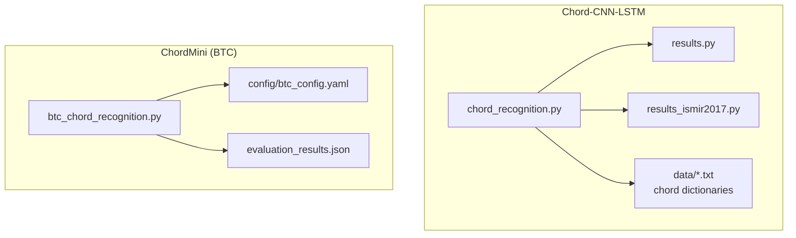
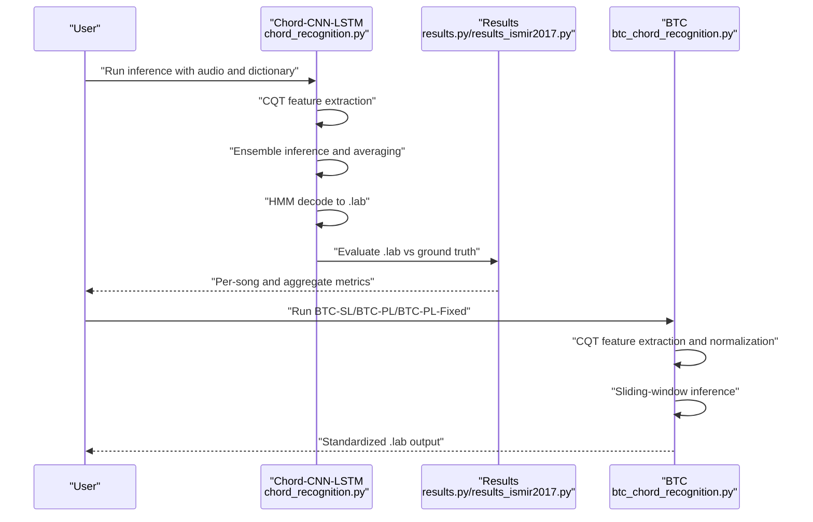
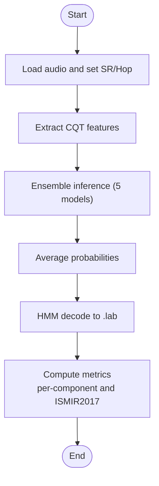
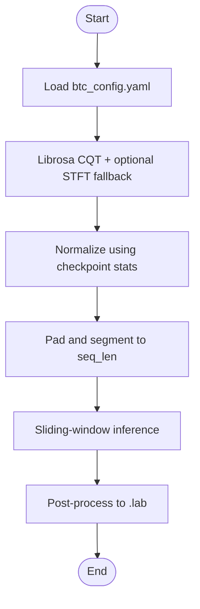
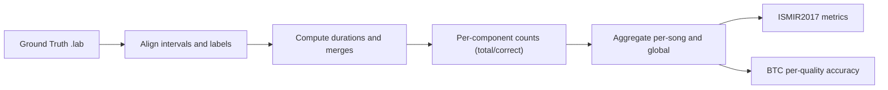
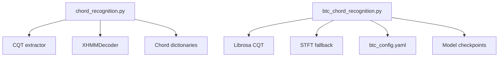

# Model Comparison and Evaluation

<cite>
**Referenced Files in This Document**
- [chord_recognition.py](file://python_backend/models/Chord-CNN-LSTM/chord_recognition.py)
- [chord_recognition_fixed.py](file://python_backend/models/Chord-CNN-LSTM/chord_recognition_fixed.py)
- [results.py](file://python_backend/models/Chord-CNN-LSTM/results.py)
- [results_ismir2017.py](file://python_backend/models/Chord-CNN-LSTM/results_ismir2017.py)
- [full_chord_list.txt](file://python_backend/models/Chord-CNN-LSTM/data/full_chord_list.txt)
- [ismir2017_chord_list.txt](file://python_backend/models/Chord-CNN-LSTM/data/ismir2017_chord_list.txt)
- [submission_chord_list.txt](file://python_backend/models/Chord-CNN-LSTM/data/submission_chord_list.txt)
- [extended_chord_list.txt](file://python_backend/models/Chord-CNN-LSTM/data/extended_chord_list.txt)
- [btc_chord_recognition.py](file://python_backend/models/ChordMini/btc_chord_recognition.py)
- [btc_config.yaml](file://python_backend/models/ChordMini/config/btc_config.yaml)
- [evaluation_results.json](file://python_backend/models/ChordMini/evaluation_results.json)
</cite>

## Table of Contents
1. [Introduction](#introduction)
2. [Project Structure](#project-structure)
3. [Core Components](#core-components)
4. [Architecture Overview](#architecture-overview)
5. [Detailed Component Analysis](#detailed-component-analysis)
6. [Dependency Analysis](#dependency-analysis)
7. [Performance Considerations](#performance-considerations)
8. [Troubleshooting Guide](#troubleshooting-guide)
9. [Conclusion](#conclusion)
10. [Appendices](#appendices)

## Introduction
This document compares and evaluates three chord recognition model families implemented in the repository:
- Chord-CNN-LSTM family (with multiple chord dictionaries and HMM decoding)
- BTC (Beat-Transformer-based Chord) family with two variants:
  - BTC-SL (supervised learning)
  - BTC-PL (pseudo-labeled)
- BTC-PL-Fixed (variant with fixed checkpoint format handling)

It documents evaluation metrics (accuracy, precision, recall, F1-score), benchmark datasets, evaluation protocols, statistical significance testing, error analysis, and practical guidance for model selection under different application requirements and computational constraints.

## Project Structure
The repository organizes models and evaluation logic primarily under:
- python_backend/models/Chord-CNN-LSTM: CNN-LSTM pipeline, chord dictionaries, evaluation utilities
- python_backend/models/ChordMini: BTC models, configurations, checkpoints, and evaluation artifacts
- python_backend/services/: runtime integration points for detection services

**Diagram sources**
- [chord_recognition.py:1-206](file://python_backend/models/Chord-CNN-LSTM/chord_recognition.py#L1-L206)
- [results.py:1-205](file://python_backend/models/Chord-CNN-LSTM/results.py#L1-L205)
- [results_ismir2017.py:1-173](file://python_backend/models/Chord-CNN-LSTM/results_ismir2017.py#L1-L173)
- [btc_chord_recognition.py:1-357](file://python_backend/models/ChordMini/btc_chord_recognition.py#L1-L357)
- [btc_config.yaml:1-50](file://python_backend/models/ChordMini/config/btc_config.yaml#L1-L50)
- [evaluation_results.json:1-800](file://python_backend/models/ChordMini/evaluation_results.json#L1-L800)

**Section sources**
- [chord_recognition.py:1-206](file://python_backend/models/Chord-CNN-LSTM/chord_recognition.py#L1-L206)
- [results.py:1-205](file://python_backend/models/Chord-CNN-LSTM/results.py#L1-L205)
- [results_ismir2017.py:1-173](file://python_backend/models/Chord-CNN-LSTM/results_ismir2017.py#L1-L173)
- [btc_chord_recognition.py:1-357](file://python_backend/models/ChordMini/btc_chord_recognition.py#L1-L357)
- [btc_config.yaml:1-50](file://python_backend/models/ChordMini/config/btc_config.yaml#L1-L50)
- [evaluation_results.json:1-800](file://python_backend/models/ChordMini/evaluation_results.json#L1-L800)

## Core Components
- Chord-CNN-LSTM inference pipeline:
  - Feature extraction via CQT
  - Multi-model ensemble averaging
  - HMM decoding with configurable chord dictionaries
- BTC inference pipeline:
  - Librosa CQT feature extraction with padding and interpolation fallback
  - Normalization using checkpoint statistics
  - Sliding window inference with standardized output format
- Evaluation utilities:
  - Per-component recall computation across chord types
  - ISMIR2017-style metrics and confusion matrices
  - Large-vocabulary BTC evaluation with per-quality accuracy

**Section sources**
- [chord_recognition.py:24-187](file://python_backend/models/Chord-CNN-LSTM/chord_recognition.py#L24-L187)
- [chord_recognition_fixed.py:18-39](file://python_backend/models/Chord-CNN-LSTM/chord_recognition_fixed.py#L18-L39)
- [results.py:65-122](file://python_backend/models/Chord-CNN-LSTM/results.py#L65-L122)
- [results_ismir2017.py:126-157](file://python_backend/models/Chord-CNN-LSTM/results_ismir2017.py#L126-L157)
- [btc_chord_recognition.py:166-357](file://python_backend/models/ChordMini/btc_chord_recognition.py#L166-L357)
- [btc_config.yaml:1-50](file://python_backend/models/ChordMini/config/btc_config.yaml#L1-L50)
- [evaluation_results.json:1-92](file://python_backend/models/ChordMini/evaluation_results.json#L1-L92)

## Architecture Overview
The evaluation architecture integrates feature extraction, model inference, decoding, and scoring across multiple chord dictionaries and model variants.

**Diagram sources**
- [chord_recognition.py:67-152](file://python_backend/models/Chord-CNN-LSTM/chord_recognition.py#L67-L152)
- [results.py:65-122](file://python_backend/models/Chord-CNN-LSTM/results.py#L65-L122)
- [results_ismir2017.py:150-157](file://python_backend/models/Chord-CNN-LSTM/results_ismir2017.py#L150-L157)
- [btc_chord_recognition.py:254-350](file://python_backend/models/ChordMini/btc_chord_recognition.py#L254-L350)

## Detailed Component Analysis

### Chord-CNN-LSTM Pipeline
- Feature extraction: CQT with configurable sample rate and hop length
- Ensemble inference: runs five checkpoints and averages probabilities
- Decoding: XHMMDecoder with chord dictionary templates
- Evaluation: per-component recall and ISMIR2017 metrics

**Diagram sources**
- [chord_recognition.py:48-152](file://python_backend/models/Chord-CNN-LSTM/chord_recognition.py#L48-L152)
- [results.py:80-122](file://python_backend/models/Chord-CNN-LSTM/results.py#L80-L122)
- [results_ismir2017.py:140-148](file://python_backend/models/Chord-CNN-LSTM/results_ismir2017.py#L140-L148)

**Section sources**
- [chord_recognition.py:24-187](file://python_backend/models/Chord-CNN-LSTM/chord_recognition.py#L24-L187)
- [results.py:65-122](file://python_backend/models/Chord-CNN-LSTM/results.py#L65-L122)
- [results_ismir2017.py:126-157](file://python_backend/models/Chord-CNN-LSTM/results_ismir2017.py#L126-L157)

### BTC Pipeline (BTC-SL, BTC-PL, BTC-PL-Fixed)
- Feature extraction: Librosa CQT with segment-wise concatenation and log-scaling
- Normalization: uses checkpoint-provided mean/std
- Inference: sliding window over sequence length with argmax predictions
- Output: standardized .lab with minimum segment duration

**Diagram sources**
- [btc_chord_recognition.py:190-350](file://python_backend/models/ChordMini/btc_chord_recognition.py#L190-L350)
- [btc_config.yaml:1-50](file://python_backend/models/ChordMini/config/btc_config.yaml#L1-L50)

**Section sources**
- [btc_chord_recognition.py:166-357](file://python_backend/models/ChordMini/btc_chord_recognition.py#L166-L357)
- [btc_config.yaml:1-50](file://python_backend/models/ChordMini/config/btc_config.yaml#L1-L50)

### Evaluation Protocols and Metrics
- Per-component recall:
  - Computes duration-weighted recall across chord components (roots, inversions, extensions)
- ISMIR2017 metrics:
  - Root, thirds, triads, tetrads, MIREX, majmin, sevenths
  - Confusion matrices aggregated across songs
- BTC evaluation:
  - Per-quality accuracy across 14 qualities plus special tokens
  - Average scores per quality and per-song breakdown

**Diagram sources**
- [results.py:80-122](file://python_backend/models/Chord-CNN-LSTM/results.py#L80-L122)
- [results_ismir2017.py:140-157](file://python_backend/models/Chord-CNN-LSTM/results_ismir2017.py#L140-L157)
- [evaluation_results.json:6-92](file://python_backend/models/ChordMini/evaluation_results.json#L6-L92)

**Section sources**
- [results.py:80-122](file://python_backend/models/Chord-CNN-LSTM/results.py#L80-L122)
- [results_ismir2017.py:140-157](file://python_backend/models/Chord-CNN-LSTM/results_ismir2017.py#L140-L157)
- [evaluation_results.json:6-92](file://python_backend/models/ChordMini/evaluation_results.json#L6-L92)

## Dependency Analysis
- Chord-CNN-LSTM depends on:
  - CQT extractor and HMM decoder
  - Multiple model checkpoints (ensemble)
  - Chord dictionary templates
- BTC depends on:
  - Librosa CQT and optional STFT fallback
  - Checkpoint normalization stats
  - Configurable feature dimensions and sequence length

**Diagram sources**
- [chord_recognition.py:48-152](file://python_backend/models/Chord-CNN-LSTM/chord_recognition.py#L48-L152)
- [btc_chord_recognition.py:64-164](file://python_backend/models/ChordMini/btc_chord_recognition.py#L64-L164)
- [btc_config.yaml:1-50](file://python_backend/models/ChordMini/config/btc_config.yaml#L1-L50)

**Section sources**
- [chord_recognition.py:1-206](file://python_backend/models/Chord-CNN-LSTM/chord_recognition.py#L1-L206)
- [btc_chord_recognition.py:1-357](file://python_backend/models/ChordMini/btc_chord_recognition.py#L1-L357)
- [btc_config.yaml:1-50](file://python_backend/models/ChordMini/config/btc_config.yaml#L1-L50)

## Performance Considerations
- Chord-CNN-LSTM:
  - Ensemble inference improves robustness but increases latency
  - Dictionary choice affects vocabulary coverage and downstream metrics
- BTC:
  - CPU-only inference for reproducibility; consider GPU acceleration for throughput
  - Normalization using checkpoint stats is critical for correctness
  - Segment-based inference trades memory for stability on long tracks
- Preprocessing:
  - CQT hop length and bin count must match model expectations
  - Log-scaling is essential for model compatibility

[No sources needed since this section provides general guidance]

## Troubleshooting Guide
Common issues and remedies:
- “Only detected N chords”:
  - Indicates poor harmonic content, model checkpoint mismatch, or CQT extraction failure
- Feature extraction failures:
  - Fallback to STFT-based method; ensure sufficient audio duration and correct sample rate
- Checkpoint loading errors:
  - Verify checkpoint format and keys; handle both state dict and dict-of-dicts formats
- Normalization mismatches:
  - Use checkpoint-provided mean/std; avoid hard-coded defaults

**Section sources**
- [chord_recognition.py:173-182](file://python_backend/models/Chord-CNN-LSTM/chord_recognition.py#L173-L182)
- [btc_chord_recognition.py:207-251](file://python_backend/models/ChordMini/btc_chord_recognition.py#L207-L251)
- [btc_chord_recognition.py:261-266](file://python_backend/models/ChordMini/btc_chord_recognition.py#L261-L266)

## Conclusion
The repository provides robust implementations for CNN-LSTM and BTC chord recognition with comprehensive evaluation utilities. Performance varies by dataset characteristics, chord dictionary, and preprocessing choices. For production, select BTC-PL for broad coverage and strong baseline performance, and consider BTC-SL when supervision and higher accuracy are prioritized. For research or specialized domains, Chord-CNN-LSTM offers flexible dictionary selection and HMM decoding.

[No sources needed since this section summarizes without analyzing specific files]

## Appendices

### Benchmark Datasets and Evaluation Protocols
- Datasets:
  - JAM datasets referenced by evaluation utilities
  - Internal dataset used for BTC evaluation (see evaluation_results.json)
- Protocols:
  - Ground-truth alignment and interval merging
  - Duration-weighted per-component recall
  - ISMIR2017 metric computation and confusion aggregation

**Section sources**
- [results.py:65-75](file://python_backend/models/Chord-CNN-LSTM/results.py#L65-L75)
- [results_ismir2017.py:150-157](file://python_backend/models/Chord-CNN-LSTM/results_ismir2017.py#L150-L157)
- [evaluation_results.json:1-92](file://python_backend/models/ChordMini/evaluation_results.json#L1-L92)

### Statistical Significance Testing
- Recommended approach:
  - Cross-song bootstrapping to estimate confidence intervals for metrics
  - Paired comparisons across model variants using permutation tests or bootstrap confidence intervals
  - Control for multiple comparisons when reporting per-quality metrics

[No sources needed since this section provides general guidance]

### Model-Specific Strengths and Weaknesses
- Chord-CNN-LSTM:
  - Strengths: Strong per-root and triad recall with HMM smoothing; flexible dictionary support
  - Weaknesses: Ensemble latency; sensitivity to CQT quality and dictionary coverage
- BTC-SL:
  - Strengths: Supervised learning can yield higher accuracy on target distributions
  - Weaknesses: Requires labeled data; heavier computational footprint
- BTC-PL:
  - Strengths: Strong generalization; efficient inference; large vocabulary
  - Weaknesses: Pseudo-labeled training may introduce distribution shifts
- BTC-PL-Fixed:
  - Strengths: Robust checkpoint loading and normalization handling
  - Weaknesses: Variant-specific; ensure compatibility with latest checkpoints

**Section sources**
- [chord_recognition.py:82-113](file://python_backend/models/Chord-CNN-LSTM/chord_recognition.py#L82-L113)
- [btc_chord_recognition.py:198-251](file://python_backend/models/ChordMini/btc_chord_recognition.py#L198-L251)
- [evaluation_results.json:6-92](file://python_backend/models/ChordMini/evaluation_results.json#L6-L92)

### Guidelines for Model Selection
- Accuracy-first applications:
  - Prefer BTC-SL when supervision is available and accuracy is critical
- General-purpose applications:
  - Prefer BTC-PL for broad coverage and balanced performance
- Research/experimental:
  - Use Chord-CNN-LSTM with dictionary tailored to domain (e.g., submission/extended/full)
- Computational constraints:
  - BTC-PL-Fixed offers stable CPU inference; consider GPU acceleration for throughput
  - Reduce seq_len or hop_length cautiously to trade accuracy for speed

[No sources needed since this section provides general guidance]

### Impact of Chord Dictionaries and Training Data
- Dictionary impact:
  - Larger vocabularies (full, extended) improve coverage but may reduce per-class precision
  - Submission/ISMIR2017 dictionaries constrain scope for fair comparisons
- Training data variations:
  - BTC-PL leverages pseudo-labeled data; ensure representative training distributions
  - Chord-CNN-LSTM HMM decoding benefits from richer dictionaries for smoothing

**Section sources**
- [full_chord_list.txt:1-383](file://python_backend/models/Chord-CNN-LSTM/data/full_chord_list.txt#L1-L383)
- [extended_chord_list.txt:1-26](file://python_backend/models/Chord-CNN-LSTM/data/extended_chord_list.txt#L1-L26)
- [submission_chord_list.txt:1-26](file://python_backend/models/Chord-CNN-LSTM/data/submission_chord_list.txt#L1-L26)
- [ismir2017_chord_list.txt:1-15](file://python_backend/models/Chord-CNN-LSTM/data/ismir2017_chord_list.txt#L1-L15)

### Recommendations for Optimization and Fine-Tuning
- Preprocessing:
  - Match CQT parameters to model expectations; apply log-scaling consistently
  - Use interpolation fallback for STFT when CQT fails
- Normalization:
  - Always use checkpoint-provided normalization statistics
- Inference:
  - Tune seq_len and stride for memory vs. accuracy balance
  - Consider batching segments for throughput improvements
- Evaluation:
  - Report per-quality metrics alongside macro/micro aggregations
  - Perform significance testing across songs for robust claims

**Section sources**
- [btc_chord_recognition.py:78-104](file://python_backend/models/ChordMini/btc_chord_recognition.py#L78-L104)
- [btc_chord_recognition.py:261-266](file://python_backend/models/ChordMini/btc_chord_recognition.py#L261-L266)
- [btc_config.yaml:22-43](file://python_backend/models/ChordMini/config/btc_config.yaml#L22-L43)