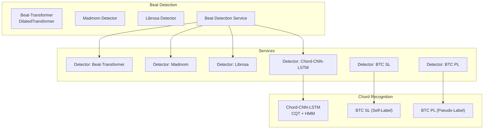
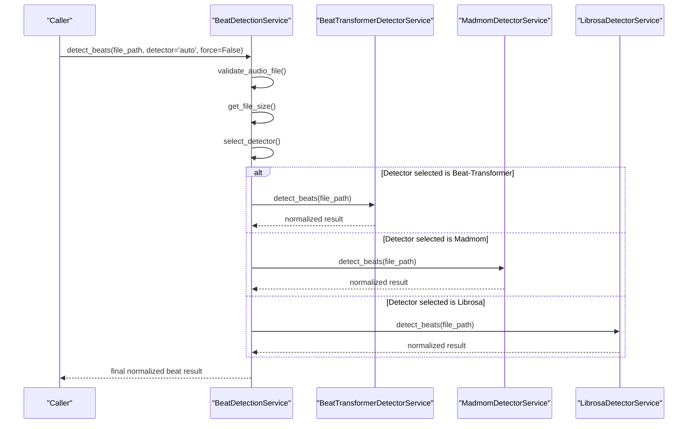
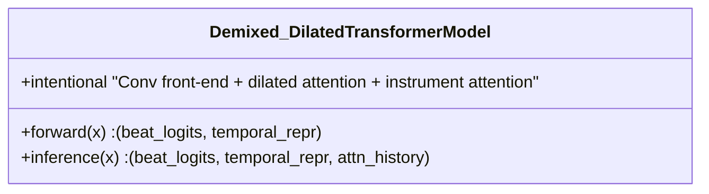
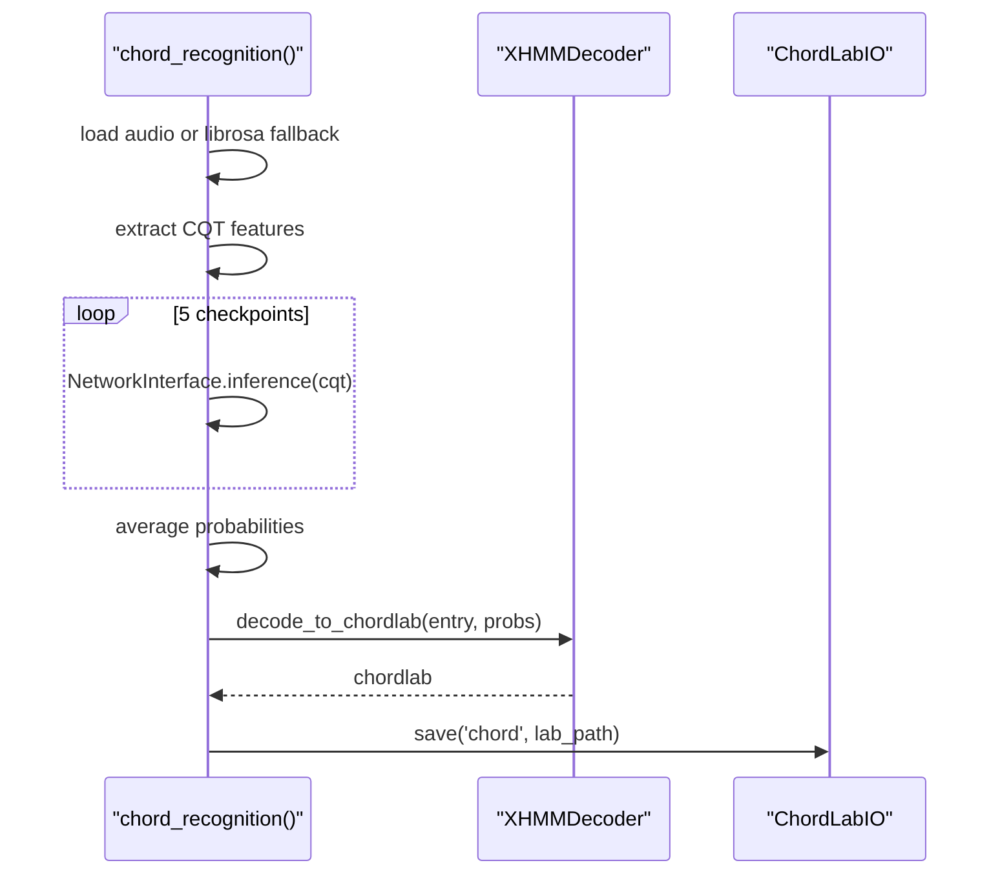
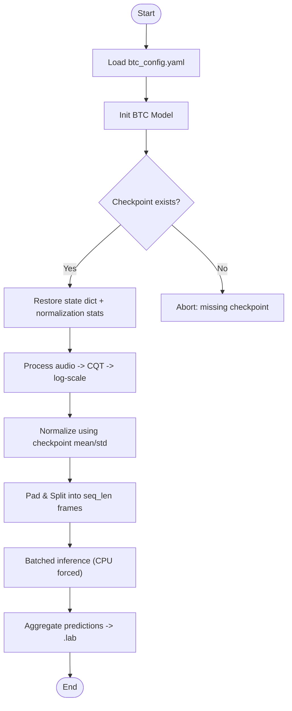
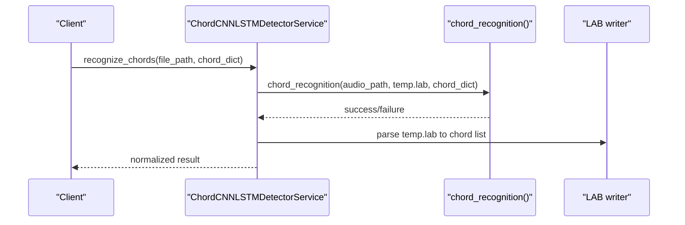
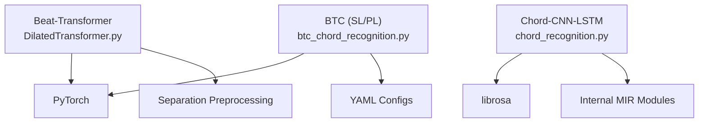

# Machine Learning Models

<cite>
**Referenced Files in This Document**
- [Beat-Transformer README.md](file://python_backend/models/Beat-Transformer/README.md)
- [Beat-Transformer DilatedTransformer.py](file://python_backend/models/Beat-Transformer/code/DilatedTransformer.py)
- [Chord-CNN-LSTM README.MD](file://python_backend/models/Chord-CNN-LSTM/README.MD)
- [Chord-CNN-LSTM chord_recognition.py](file://python_backend/models/Chord-CNN-LSTM/chord_recognition.py)
- [ChordMini btc_config.yaml](file://python_backend/models/ChordMini/config/btc_config.yaml)
- [ChordMini student_config.yaml](file://python_backend/models/ChordMini/config/student_config.yaml)
- [ChordMini btc_chord_recognition.py](file://python_backend/models/ChordMini/btc_chord_recognition.py)
- [Detectors beat_transformer_detector.py](file://python_backend/services/detectors/beat_transformer_detector.py)
- [Detectors chord_cnn_lstm_detector.py](file://python_backend/services/detectors/chord_cnn_lstm_detector.py)
- [Detectors btc_sl_detector.py](file://python_backend/services/detectors/btc_sl_detector.py)
- [Detectors btc_pl_detector.py](file://python_backend/services/detectors/btc_pl_detector.py)
- [Beat Detection Service](file://python_backend/services/audio/beat_detection_service.py)
- `Machine Learning Models/Adding New Models.md`
</cite>

## Table of Contents
1. [Introduction](#introduction)
2. [Project Structure](#project-structure)
3. [Core Components](#core-components)
4. [Architecture Overview](#architecture-overview)
5. [Detailed Component Analysis](#detailed-component-analysis)
6. [Dependency Analysis](#dependency-analysis)
7. [Performance Considerations](#performance-considerations)
8. [Troubleshooting Guide](#troubleshooting-guide)
9. [Conclusion](#conclusion)
10. [Appendices](#appendices)

## Introduction
This document explains the machine learning models powering beat detection and chord recognition in ChordMiniApp. It covers:
- Beat detection models: Beat-Transformer architecture, madmom implementation, and librosa integration
- Chord recognition models: Chord-CNN-LSTM architecture, BTC models (SL and PL variants), and model training/evaluation processes
- Audio processing pipeline: signal processing, feature extraction, and audio separation
- Model comparison methodologies, performance metrics, and quality assessment criteria
- Model loading and initialization, parameter configuration, and inference optimization
- Troubleshooting guidance for availability, performance, and accuracy issues
- Guidance for extending the model system with new detection algorithms. See `Machine Learning Models/Adding New Models.md` for the current model-agnostic extension workflow.

## Project Structure
The ML stack is organized into:
- Beat-Transformer: PyTorch Transformer with dilated attention and audio separation preprocessing
- Chord-CNN-LSTM: CNN-LSTM chord transcription with HMM decoding and CQT features
- ChordMini BTC: Transformer-based chord recognition with SL (self-labeled) and PL (pseudo-labeled) variants
- Detectors: Unified services wrapping each model with standardized interfaces
- Beat Detection Service: Orchestration of beat detectors with size-aware selection and fallbacks

**Diagram sources**
- [Beat Detection Service:20-38](file://python_backend/services/audio/beat_detection_service.py#L20-L38)
- [Detectors beat_transformer_detector.py:15-71](file://python_backend/services/detectors/beat_transformer_detector.py#L15-L71)
- [Detectors chord_cnn_lstm_detector.py:17-76](file://python_backend/services/detectors/chord_cnn_lstm_detector.py#L17-L76)
- [Detectors btc_sl_detector.py:17-85](file://python_backend/services/detectors/btc_sl_detector.py#L17-L85)
- [Detectors btc_pl_detector.py:17-85](file://python_backend/services/detectors/btc_pl_detector.py#L17-L85)

**Section sources**
- [Beat-Transformer README.md:1-75](file://python_backend/models/Beat-Transformer/README.md#L1-L75)
- [Chord-CNN-LSTM README.MD:1-64](file://python_backend/models/Chord-CNN-LSTM/README.MD#L1-L64)
- [ChordMini btc_config.yaml:1-50](file://python_backend/models/ChordMini/config/btc_config.yaml#L1-L50)
- [ChordMini student_config.yaml:1-94](file://python_backend/models/ChordMini/config/student_config.yaml#L1-L94)

## Core Components
- Beat-Transformer: A demixed spectrogram-based Transformer with dilated self-attention and hybrid time/instrument attention layers. Includes preprocessing for audio separation and training utilities.
- Chord-CNN-LSTM: CNN-LSTM architecture with CQT features and XHMM decoding. Supports multiple chord dictionaries and ensemble inference across multiple checkpoints.
- BTC (ChordMini): Transformer-based models with large chord vocabulary (170). Two variants: SL (self-labeled) and PL (pseudo-labeled), with YAML-based configuration and standardized inference.

**Section sources**
- [Beat-Transformer DilatedTransformer.py:7-90](file://python_backend/models/Beat-Transformer/code/DilatedTransformer.py#L7-L90)
- [Chord-CNN-LSTM chord_recognition.py:24-187](file://python_backend/models/Chord-CNN-LSTM/chord_recognition.py#L24-L187)
- [ChordMini btc_chord_recognition.py:166-356](file://python_backend/models/ChordMini/btc_chord_recognition.py#L166-L356)
- [ChordMini btc_config.yaml:6-44](file://python_backend/models/ChordMini/config/btc_config.yaml#L6-L44)

## Architecture Overview
The system exposes unified detector services that encapsulate model-specific logic and return normalized results. The Beat Detection Service selects among Beat-Transformer, madmom, and librosa based on availability and file size constraints.

**Diagram sources**
- [Beat Detection Service:163-301](file://python_backend/services/audio/beat_detection_service.py#L163-L301)
- [Detectors beat_transformer_detector.py:73-147](file://python_backend/services/detectors/beat_transformer_detector.py#L73-L147)

**Section sources**
- [Beat Detection Service:20-348](file://python_backend/services/audio/beat_detection_service.py#L20-L348)

## Detailed Component Analysis

### Beat-Transformer
- Architecture: Convolutional front-end followed by a stack of dilated self-attention layers and selective instrument attention blocks. Outputs beat and downbeat activations plus a global temporal representation.
- Data preparation: Demixed spectrograms via audio separation; training supports 8-fold cross-validation.
- Inference: Provides both aggregated outputs and attention accumulation for interpretability.

**Diagram sources**
- [Beat-Transformer DilatedTransformer.py:7-90](file://python_backend/models/Beat-Transformer/code/DilatedTransformer.py#L7-L90)

**Section sources**
- [Beat-Transformer DilatedTransformer.py:41-90](file://python_backend/models/Beat-Transformer/code/DilatedTransformer.py#L41-L90)
- [Beat-Transformer README.md:42-47](file://python_backend/models/Beat-Transformer/README.md#L42-L47)

### Chord-CNN-LSTM
- Pipeline: Load audio, extract CQT features, run ensemble inference across five checkpoints, average probabilities, decode with XHMM, and write LAB output.
- Feature extraction: CQT with configurable hop length and binning; robust fallback to librosa when upstream pipeline fails.
- Evaluation: Supports multiple chord dictionaries; outputs standardized LAB format for downstream consumers.

**Diagram sources**
- [Chord-CNN-LSTM chord_recognition.py:24-152](file://python_backend/models/Chord-CNN-LSTM/chord_recognition.py#L24-L152)

**Section sources**
- [Chord-CNN-LSTM chord_recognition.py:24-187](file://python_backend/models/Chord-CNN-LSTM/chord_recognition.py#L24-L187)
- [Chord-CNN-LSTM README.MD:14-34](file://python_backend/models/Chord-CNN-LSTM/README.MD#L14-L34)

### BTC (ChordMini) SL and PL
- SL (Self-Label): Supervised training with large vocabulary (170 chords). Uses a Transformer with configurable attention layers and heads.
- PL (Pseudo-Label): Self-training with combined pseudo-labeled data; similar architecture and configuration.
- Inference: Log-scaled CQT features, normalization using checkpoint statistics, sliding-window processing, and .lab generation with standardized timing.

**Diagram sources**
- [ChordMini btc_chord_recognition.py:190-350](file://python_backend/models/ChordMini/btc_chord_recognition.py#L190-L350)
- [ChordMini btc_config.yaml:6-44](file://python_backend/models/ChordMini/config/btc_config.yaml#L6-L44)

**Section sources**
- [ChordMini btc_chord_recognition.py:166-356](file://python_backend/models/ChordMini/btc_chord_recognition.py#L166-L356)
- [ChordMini btc_config.yaml:1-50](file://python_backend/models/ChordMini/config/btc_config.yaml#L1-L50)
- [ChordMini student_config.yaml:1-94](file://python_backend/models/ChordMini/config/student_config.yaml#L1-L94)

### Detector Services and Orchestration
- Beat Detection Service: Validates input, computes file size, selects best detector (auto or requested), applies size limits, and returns normalized results. Includes fallback logic and beat-per-measure analysis.
- Detector wrappers: Each detector exposes is_available(), detect_beats(), and model info. They normalize outputs to a common schema.

**Diagram sources**
- [Detectors chord_cnn_lstm_detector.py:78-182](file://python_backend/services/detectors/chord_cnn_lstm_detector.py#L78-L182)
- [Chord-CNN-LSTM chord_recognition.py:121-152](file://python_backend/models/Chord-CNN-LSTM/chord_recognition.py#L121-L152)

**Section sources**
- [Beat Detection Service:20-348](file://python_backend/services/audio/beat_detection_service.py#L20-L348)
- [Detectors beat_transformer_detector.py:31-147](file://python_backend/services/detectors/beat_transformer_detector.py#L31-L147)
- [Detectors btc_sl_detector.py:87-168](file://python_backend/services/detectors/btc_sl_detector.py#L87-L168)
- [Detectors btc_pl_detector.py:87-168](file://python_backend/services/detectors/btc_pl_detector.py#L87-L168)
- [Detectors chord_cnn_lstm_detector.py:78-248](file://python_backend/services/detectors/chord_cnn_lstm_detector.py#L78-L248)

## Dependency Analysis
- Beat-Transformer depends on PyTorch and audio separation preprocessing; training scripts and ablation models are included.
- Chord-CNN-LSTM depends on librosa for audio loading and CQT extraction, and on internal MIR modules for I/O and decoding.
- BTC models depend on PyTorch, YAML configuration, and checkpoint files; inference is CPU-bound by design in the wrapper.

**Diagram sources**
- [Beat-Transformer DilatedTransformer.py:1-4](file://python_backend/models/Beat-Transformer/code/DilatedTransformer.py#L1-L4)
- [Chord-CNN-LSTM chord_recognition.py:1-12](file://python_backend/models/Chord-CNN-LSTM/chord_recognition.py#L1-L12)
- [ChordMini btc_chord_recognition.py:10-26](file://python_backend/models/ChordMini/btc_chord_recognition.py#L10-L26)

**Section sources**
- [Beat-Transformer README.md:42-47](file://python_backend/models/Beat-Transformer/README.md#L42-L47)
- [Chord-CNN-LSTM README.MD:36-61](file://python_backend/models/Chord-CNN-LSTM/README.MD#L36-L61)
- [ChordMini btc_config.yaml:45-49](file://python_backend/models/ChordMini/config/btc_config.yaml#L45-L49)

## Performance Considerations
- Beat-Transformer: Demixed spectrograms enable robust beat tracking across instruments but increase preprocessing cost. Inference uses GPU when available; CPU fallback is supported.
- Chord-CNN-LSTM: Ensemble inference improves stability but increases latency; consider reducing ensemble size or switching to lighter variants for latency-sensitive scenarios.
- BTC: CPU inference is enforced in the wrapper; large sequences are processed in chunks. Normalization using checkpoint statistics ensures consistency across sessions.
- Beat Detection Service: Auto-selection prefers madmom for small files and librosa for very large files, balancing accuracy and throughput.

[No sources needed since this section provides general guidance]

## Troubleshooting Guide
Common issues and resolutions:
- Beat-Transformer not available
  - Verify checkpoint path and dependencies; the service checks availability and logs import failures.
  - Section sources
    - [Detectors beat_transformer_detector.py:31-70](file://python_backend/services/detectors/beat_transformer_detector.py#L31-L70)
- Chord-CNN-LSTM model directory missing or import errors
  - Ensure required files exist and model directory is reachable; service temporarily tolerates import errors for testing response format.
  - Section sources
    - [Detectors chord_cnn_lstm_detector.py:32-76](file://python_backend/services/detectors/chord_cnn_lstm_detector.py#L32-L76)
- BTC checkpoints not found
  - Confirm presence of SL or PL checkpoint under the configured path; wrapper extracts normalization stats and handles multiple checkpoint formats.
  - Section sources
    - [ChordMini btc_chord_recognition.py:202-251](file://python_backend/models/ChordMini/btc_chord_recognition.py#L202-L251)
- Low-quality chord output ("N" chords only)
  - Indicates insufficient harmonic content or feature extraction issues; verify CQT parameters and audio quality.
  - Section sources
    - [Chord-CNN-LSTM chord_recognition.py:166-182](file://python_backend/models/Chord-CNN-LSTM/chord_recognition.py#L166-L182)
- Beat detection errors or timeouts
  - Check file size limits and detector availability; use auto selection or force flag judiciously.
  - Section sources
    - [Beat Detection Service:53-97](file://python_backend/services/audio/beat_detection_service.py#L53-L97)

## Conclusion
ChordMiniApp integrates multiple complementary approaches: deep learning beat tracking with Beat-Transformer, classical and neural beat detectors (madmom, librosa), and robust chord recognition via Chord-CNN-LSTM and BTC variants. The detector services provide a unified interface, automatic selection, and fallback strategies. Configuration-driven inference and standardized outputs facilitate evaluation and extension.

[No sources needed since this section summarizes without analyzing specific files]

## Appendices

### Model Comparison Methodologies and Metrics
- Beat models: Compare normalized outputs (beats, downbeats, BPM, time signature) and compute beat-per-measure distributions; evaluate accuracy against ground truth annotations.
- Chord models: Use LAB files and chord dictionaries; compute metrics such as accuracy, F-measure, and frame-level correctness; compare across SL and PL variants.
- Quality assessment: Inspect feature scaling (log CQT), normalization statistics, and ensemble averaging behavior.

[No sources needed since this section provides general guidance]

### Audio Processing Pipeline
- Signal processing: librosa-based CQT with configurable hop length and bins; optional STFT-based fallback with interpolation.
- Feature extraction: Log-scaled magnitudes; normalization using checkpoint-derived means and standard deviations.
- Audio separation: Demixed spectrograms for Beat-Transformer training and inference.

**Section sources**
- [ChordMini btc_chord_recognition.py:64-109](file://python_backend/models/ChordMini/btc_chord_recognition.py#L64-L109)
- [ChordMini btc_chord_recognition.py:111-153](file://python_backend/models/ChordMini/btc_chord_recognition.py#L111-L153)
- [Beat-Transformer README.md:47-47](file://python_backend/models/Beat-Transformer/README.md#L47-L47)

### Model Loading and Initialization
- Beat-Transformer: Import detector class and pass checkpoint path; service initializes lazily and caches availability.
- Chord-CNN-LSTM: Dynamically insert model directory into sys.path and import recognition routine; temporary LAB file used for output.
- BTC: Load YAML configuration, initialize model, restore checkpoint, enforce CPU inference, and process audio in fixed-length segments.

**Section sources**
- [Detectors beat_transformer_detector.py:52-71](file://python_backend/services/detectors/beat_transformer_detector.py#L52-L71)
- [Detectors chord_cnn_lstm_detector.py:109-130](file://python_backend/services/detectors/chord_cnn_lstm_detector.py#L109-L130)
- [ChordMini btc_chord_recognition.py:190-251](file://python_backend/models/ChordMini/btc_chord_recognition.py#L190-L251)

### Extending the Model System
- Add a new detector service by implementing is_available(), detect_beats(), and model info methods, then register it in the Beat Detection Service.
- Ensure standardized output schema and handle file size constraints appropriately.
- Integrate preprocessing and inference logic into a unified wrapper similar to existing BTC and Chord-CNN-LSTM services.

[No sources needed since this section provides general guidance]
