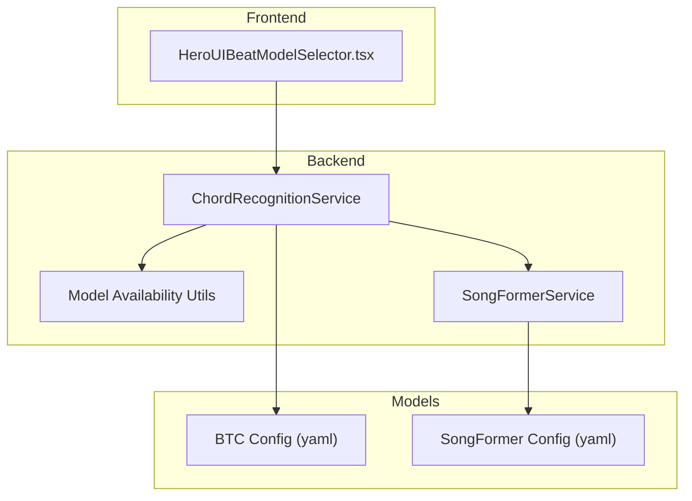
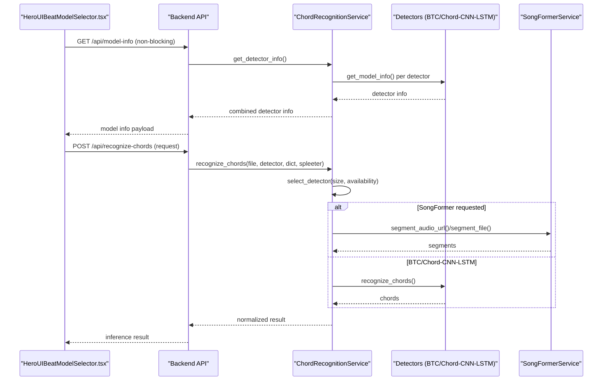
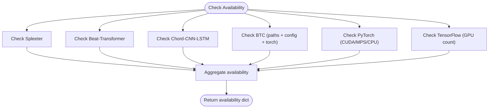
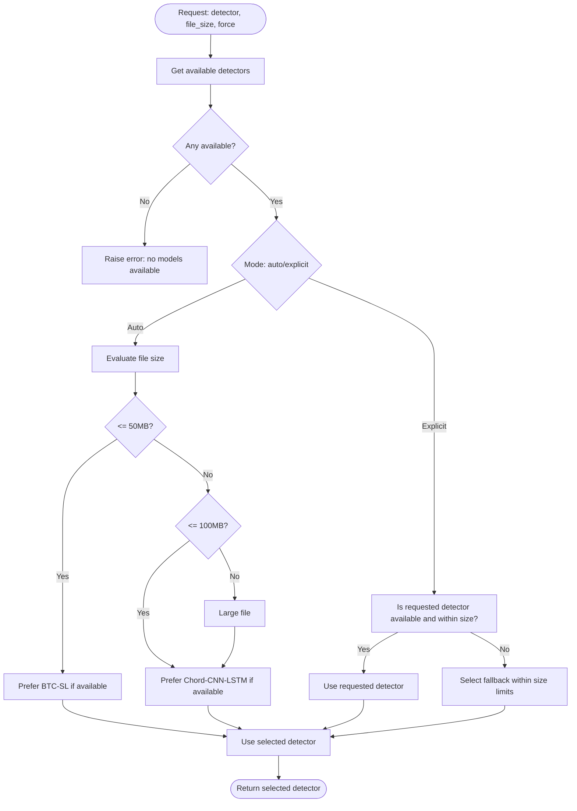
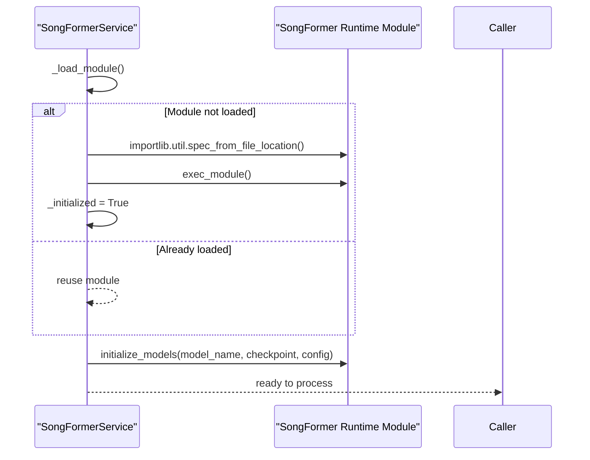
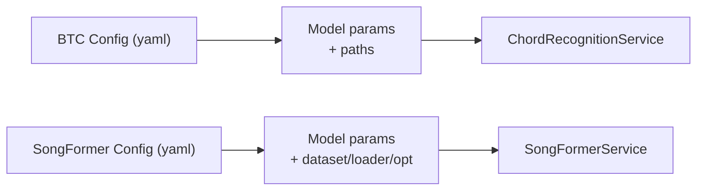
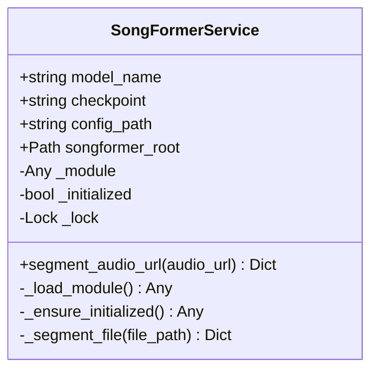
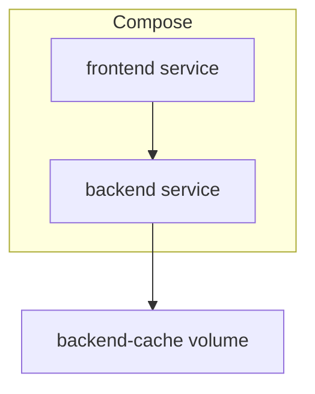
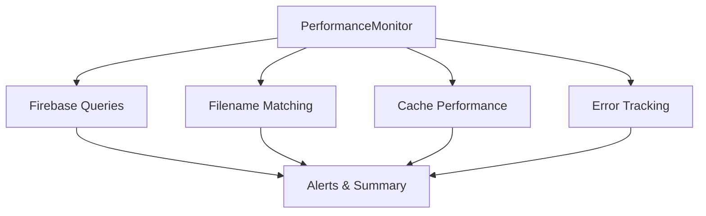
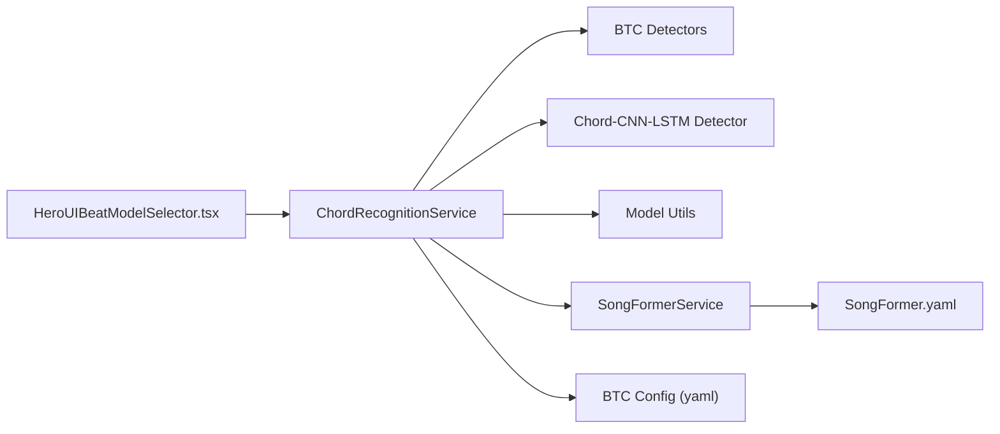

# Model Management

<cite>
**Referenced Files in This Document**
- [model_utils.py](file://python_backend/utils/model_utils.py)
- [chord_recognition_service.py](file://python_backend/services/audio/chord_recognition_service.py)
- [songformer_service.py](file://python_backend/services/audio/songformer_service.py)
- [btc_config.yaml](file://python_backend/config/btc_config.yaml)
- [docker-compose.yml](file://docker/docker-compose.yml)
- [Dockerfile](file://Dockerfile)
- [HeroUIBeatModelSelector.tsx](file://src/components/analysis/HeroUIBeatModelSelector.tsx)
- [performanceMonitor.ts](file://src/services/performance/performanceMonitor.ts)
- [SongFormer.yaml](file://SongFormer/src/SongFormer/configs/SongFormer.yaml)
- [post-deployment-verification.sh](file://scripts/post-deployment-verification.sh)
- `Machine Learning Models/Adding New Models.md`
</cite>

## Table of Contents
1. [Introduction](#introduction)
2. [Project Structure](#project-structure)
3. [Core Components](#core-components)
4. [Architecture Overview](#architecture-overview)
5. [Detailed Component Analysis](#detailed-component-analysis)
6. [Dependency Analysis](#dependency-analysis)
7. [Performance Considerations](#performance-considerations)
8. [Troubleshooting Guide](#troubleshooting-guide)
9. [Conclusion](#conclusion)
10. [Appendices](#appendices)

## Introduction
This document describes model management in ChordMiniApp, covering model loading and initialization, dynamic model selection, lazy loading strategies, memory management, configuration and parameter management, version control, deployment and scaling, monitoring and maintenance, updates and backward compatibility, experimental model management, and production optimization. It synthesizes backend model orchestration, frontend model selector UX, SongFormer integration, and deployment artifacts. For the step-by-step workflow to add a new model, see `Machine Learning Models/Adding New Models.md`.

## Project Structure
Model management spans three primary areas:
- Backend orchestration and model availability checks
- Frontend dynamic model selector with non-blocking UX
- Experimental SongFormer segmentation integrated via a thin service wrapper

**Diagram sources**
- [HeroUIBeatModelSelector.tsx:40-76](file://src/components/analysis/HeroUIBeatModelSelector.tsx#L40-L76)
- [chord_recognition_service.py:25-322](file://python_backend/services/audio/chord_recognition_service.py#L25-L322)
- [model_utils.py:1-326](file://python_backend/utils/model_utils.py#L1-L326)
- [songformer_service.py:21-140](file://python_backend/services/audio/songformer_service.py#L21-L140)
- [btc_config.yaml:1-61](file://python_backend/config/btc_config.yaml#L1-L61)
- [SongFormer.yaml:1-186](file://SongFormer/src/SongFormer/configs/SongFormer.yaml#L1-L186)

**Section sources**
- [HeroUIBeatModelSelector.tsx:40-76](file://src/components/analysis/HeroUIBeatModelSelector.tsx#L40-L76)
- [chord_recognition_service.py:25-322](file://python_backend/services/audio/chord_recognition_service.py#L25-L322)
- [model_utils.py:1-326](file://python_backend/utils/model_utils.py#L1-L326)
- [songformer_service.py:21-140](file://python_backend/services/audio/songformer_service.py#L21-L140)
- [btc_config.yaml:1-61](file://python_backend/config/btc_config.yaml#L1-L61)
- [SongFormer.yaml:1-186](file://SongFormer/src/SongFormer/configs/SongFormer.yaml#L1-L186)

## Core Components
- Model availability and device detection utilities: checks for model presence, Python packages, and hardware devices (CUDA/MPS/CPU).
- Chord recognition service: orchestrates model selection, fallback strategies, file-size-aware routing, and optional audio separation.
- SongFormer service: dynamic import and initialization of the external SongFormer runtime with lazy-loading and thread-safe initialization.
- Configuration files: YAML-based model parameters for BTC and SongFormer.

Key responsibilities:
- Dynamic model selection: auto-selection based on availability and file size; explicit selection with fallback.
- Lazy loading: backend services initialize only when needed; SongFormer runtime is imported and initialized on demand.
- Memory management: environment-based GPU enablement, device detection, and resource-aware model selection.
- Configuration and parameters: centralized YAML configs for model hyperparameters and paths.
- Version control: environment variables for model name and checkpoint selection; deterministic runtime initialization.

**Section sources**
- [model_utils.py:1-326](file://python_backend/utils/model_utils.py#L1-L326)
- [chord_recognition_service.py:25-322](file://python_backend/services/audio/chord_recognition_service.py#L25-L322)
- [songformer_service.py:21-140](file://python_backend/services/audio/songformer_service.py#L21-L140)
- [btc_config.yaml:1-61](file://python_backend/config/btc_config.yaml#L1-L61)
- [SongFormer.yaml:1-186](file://SongFormer/src/SongFormer/configs/SongFormer.yaml#L1-L186)

## Architecture Overview
End-to-end flow for model selection and inference:

**Diagram sources**
- [HeroUIBeatModelSelector.tsx:40-76](file://src/components/analysis/HeroUIBeatModelSelector.tsx#L40-L76)
- [chord_recognition_service.py:173-296](file://python_backend/services/audio/chord_recognition_service.py#L173-L296)
- [songformer_service.py:105-140](file://python_backend/services/audio/songformer_service.py#L105-L140)

## Detailed Component Analysis

### Model Availability and Device Detection
- Purpose: Lightweight checks to determine model readiness and hardware capabilities without heavy initialization.
- Key behaviors:
  - Detects Spleeter, Beat-Transformer, Chord-CNN-LSTM, Genius API, BTC models, PyTorch, and TensorFlow.
  - Reports CUDA/MPS availability and device names.
  - Enumerates model directories and sizes.

**Diagram sources**
- [model_utils.py:12-326](file://python_backend/utils/model_utils.py#L12-L326)

**Section sources**
- [model_utils.py:12-326](file://python_backend/utils/model_utils.py#L12-L326)

### Dynamic Model Selection and Fallback
- Purpose: Choose the best detector based on availability, file size, and user preference.
- Key behaviors:
  - Auto-selection prefers Chord-CNN-LSTM for large files and BTC models for small/medium files.
  - Enforces per-detector size limits; falls back to alternatives when constraints are exceeded.
  - Validates chord dictionaries against the selected model.

**Diagram sources**
- [chord_recognition_service.py:61-172](file://python_backend/services/audio/chord_recognition_service.py#L61-L172)

**Section sources**
- [chord_recognition_service.py:48-172](file://python_backend/services/audio/chord_recognition_service.py#L48-L172)

### Lazy Loading Strategies
- Backend service initialization:
  - SongFormerService dynamically imports the runtime module and initializes models only once, guarded by a lock.
  - Uses a context manager to temporarily change working directory to the SongFormer root.
- Frontend UX:
  - Asynchronous model info fetch to avoid blocking initial render; fallback data is used until real info arrives.

**Diagram sources**
- [songformer_service.py:54-104](file://python_backend/services/audio/songformer_service.py#L54-L104)

**Section sources**
- [songformer_service.py:21-140](file://python_backend/services/audio/songformer_service.py#L21-L140)
- [HeroUIBeatModelSelector.tsx:40-76](file://src/components/analysis/HeroUIBeatModelSelector.tsx#L40-L76)

### Memory Management and Hardware Acceleration
- Environment-based GPU enablement:
  - Beat-Transformer handler determines local vs. remote deployment and enables GPU accordingly.
- Device detection:
  - PyTorch availability checks report CUDA/MPS/CPU and device names.
- Resource-aware selection:
  - Detector selection considers file size and model size limits to avoid OOM.

**Section sources**
- [chord_recognition_service.py:38-46](file://python_backend/services/audio/chord_recognition_service.py#L38-L46)
- [model_utils.py:141-181](file://python_backend/utils/model_utils.py#L141-L181)
- [beat_transformer.py:80-119](file://python_backend/models/beat_transformer.py#L80-L119)

### Model Configuration and Parameter Management
- BTC configuration:
  - Audio processing parameters, feature extraction settings, experiment hyperparameters, model architecture parameters, and model paths.
- SongFormer configuration:
  - Input dimensions, transformer encoder settings, task-specific head dimensions, scheduler parameters, dataset and dataloader settings, optimizer configuration, and training run parameters.

**Diagram sources**
- [btc_config.yaml:1-61](file://python_backend/config/btc_config.yaml#L1-L61)
- [SongFormer.yaml:1-186](file://SongFormer/src/SongFormer/configs/SongFormer.yaml#L1-L186)

**Section sources**
- [btc_config.yaml:1-61](file://python_backend/config/btc_config.yaml#L1-L61)
- [SongFormer.yaml:1-186](file://SongFormer/src/SongFormer/configs/SongFormer.yaml#L1-L186)

### Experimental Model Management and SongFormer Integration
- SongFormerService wraps the external runtime:
  - Resolves root path via environment variable with a default fallback.
  - Loads and initializes the runtime lazily with thread safety.
  - Supports processing audio URLs or local files, returning formatted segments.

**Diagram sources**
- [songformer_service.py:21-140](file://python_backend/services/audio/songformer_service.py#L21-L140)

**Section sources**
- [songformer_service.py:21-140](file://python_backend/services/audio/songformer_service.py#L21-L140)

### Deployment Procedures: Containerization, Scaling, and Resource Allocation
- Docker Compose:
  - Defines frontend and backend services, environment variables, health checks, and optional cache volume mounting.
- Frontend Dockerfile:
  - Multi-stage build with optimized runtime, health checks, and environment variables.
- Scaling and resource allocation:
  - Backend exposes port 8080; health checks configured; cache volume mounted for model cache persistence.

**Diagram sources**
- [docker-compose.yml:10-115](file://docker/docker-compose.yml#L10-L115)
- [Dockerfile:1-87](file://Dockerfile#L1-L87)

**Section sources**
- [docker-compose.yml:1-115](file://docker/docker-compose.yml#L1-L115)
- [Dockerfile:1-87](file://Dockerfile#L1-L87)

### Monitoring and Maintenance
- Frontend performance monitor tracks:
  - Firebase query metrics, filename matching accuracy, cache performance, and error reduction.
  - Threshold-based alerting and periodic summaries for operational visibility.

**Diagram sources**
- [performanceMonitor.ts:46-312](file://src/services/performance/performanceMonitor.ts#L46-L312)

**Section sources**
- [performanceMonitor.ts:46-312](file://src/services/performance/performanceMonitor.ts#L46-L312)

### Model Updates, Backward Compatibility, and Migration
- Version control and selection:
  - SongFormerService uses environment variables to select model name and checkpoint.
  - BTC configuration centralizes model parameters; updates propagate via YAML changes.
- Backward compatibility:
  - Detector selection validates chord dictionaries and falls back to defaults when unsupported.
- Migration:
  - Detector availability checks and size limits guide migration to larger-capacity models (e.g., Chord-CNN-LSTM) for large files.

**Section sources**
- [songformer_service.py:24-37](file://python_backend/services/audio/songformer_service.py#L24-L37)
- [chord_recognition_service.py:224-230](file://python_backend/services/audio/chord_recognition_service.py#L224-L230)

## Dependency Analysis
- Backend orchestration depends on:
  - Detector services (BTC and Chord-CNN-LSTM) for inference.
  - Model availability utilities for readiness checks.
  - SongFormerService for experimental segmentation.
- Frontend depends on:
  - Non-blocking model info retrieval to render UI quickly.
- External dependencies:
  - PyTorch/TensorFlow for model execution.
  - Spleeter for audio separation (optional).

**Diagram sources**
- [HeroUIBeatModelSelector.tsx:40-76](file://src/components/analysis/HeroUIBeatModelSelector.tsx#L40-L76)
- [chord_recognition_service.py:25-322](file://python_backend/services/audio/chord_recognition_service.py#L25-L322)
- [model_utils.py:1-326](file://python_backend/utils/model_utils.py#L1-L326)
- [songformer_service.py:21-140](file://python_backend/services/audio/songformer_service.py#L21-L140)
- [btc_config.yaml:1-61](file://python_backend/config/btc_config.yaml#L1-L61)
- [SongFormer.yaml:1-186](file://SongFormer/src/SongFormer/configs/SongFormer.yaml#L1-L186)

**Section sources**
- [chord_recognition_service.py:25-322](file://python_backend/services/audio/chord_recognition_service.py#L25-L322)
- [model_utils.py:1-326](file://python_backend/utils/model_utils.py#L1-L326)
- [songformer_service.py:21-140](file://python_backend/services/audio/songformer_service.py#L21-L140)

## Performance Considerations
- Non-blocking UI: asynchronous model info fetch prevents rendering delays.
- Lazy initialization: SongFormer runtime is loaded and initialized only upon first use.
- Detector selection: favors higher-accuracy models for small/medium files and larger models for large files to balance latency and throughput.
- Device awareness: leverages CUDA/MPS when available to accelerate inference.
- Caching: compose volume for backend cache supports model cache persistence.

[No sources needed since this section provides general guidance]

## Troubleshooting Guide
Common issues and remedies:
- Model loading failures:
  - Verify model paths and YAML configuration; check availability via model utils.
  - Ensure environment variables for SongFormer root and checkpoint are set correctly.
- Performance issues:
  - Confirm device detection reports CUDA/MPS availability; adjust detector selection for file size.
  - Monitor cache hit rate and Firebase query reduction via performance monitor.
- Compatibility problems:
  - Validate chord dictionary support for the selected detector; fallback to default dictionaries.
- Deployment verification:
  - Use post-deployment script to test model info endpoint and related health endpoints.

**Section sources**
- [model_utils.py:1-326](file://python_backend/utils/model_utils.py#L1-L326)
- [songformer_service.py:24-37](file://python_backend/services/audio/songformer_service.py#L24-L37)
- [chord_recognition_service.py:224-230](file://python_backend/services/audio/chord_recognition_service.py#L224-L230)
- [performanceMonitor.ts:46-312](file://src/services/performance/performanceMonitor.ts#L46-L312)
- [post-deployment-verification.sh:69-101](file://scripts/post-deployment-verification.sh#L69-L101)

## Conclusion
ChordMiniApp’s model management combines dynamic selection, lazy initialization, and environment-aware hardware acceleration. Centralized YAML configurations and availability utilities streamline deployment and maintenance. The integration with SongFormer is encapsulated behind a thin service wrapper supporting experimental segmentation. Monitoring and deployment artifacts facilitate scalable, observable operations.

[No sources needed since this section summarizes without analyzing specific files]

## Appendices

### Appendix A: Model Info Endpoint and Verification
- The documentation and status endpoints are tested during post-deployment verification, including the model info endpoint with cold-start tolerance.

**Section sources**
- [post-deployment-verification.sh:69-101](file://scripts/post-deployment-verification.sh#L69-L101)
