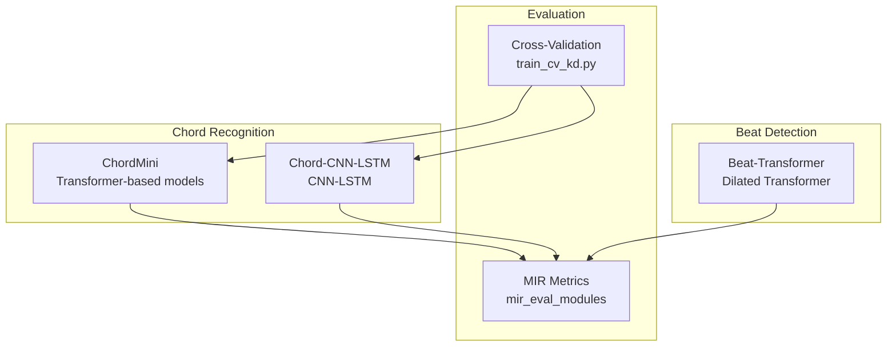
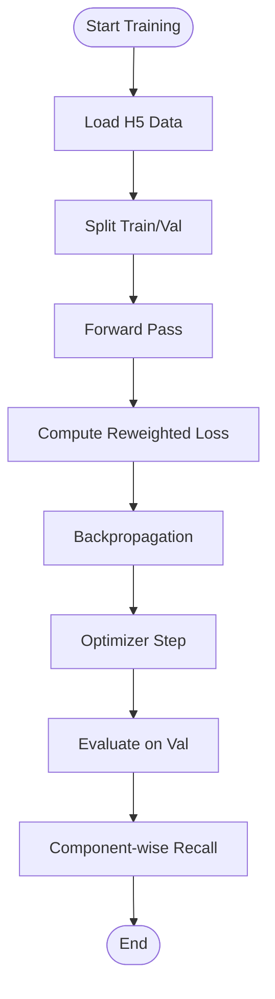
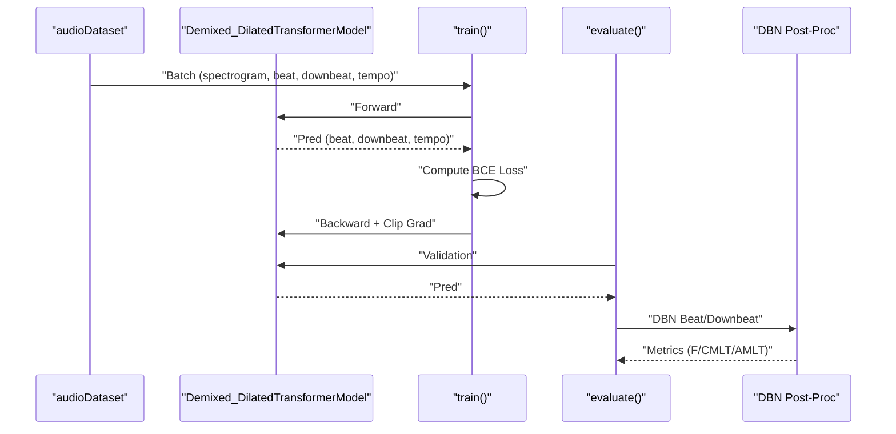
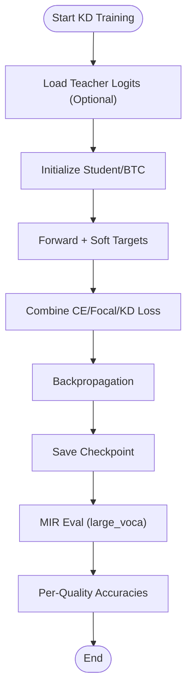
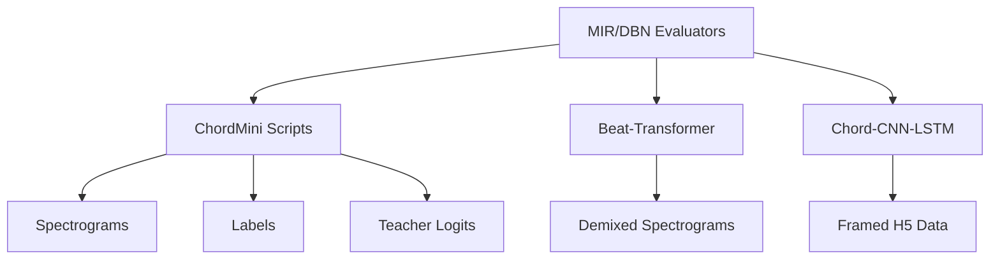

# Model Training and Evaluation

<cite>
**Referenced Files in This Document**
- [train_btc.py](file://python_backend/models/ChordMini/train_btc.py)
- [train_student.py](file://python_backend/models/ChordMini/train_student.py)
- [train_cv_kd.py](file://python_backend/models/ChordMini/train_cv_kd.py)
- [mir_eval_modules.py](file://python_backend/models/ChordMini/modules/utils/mir_eval_modules.py)
- [utils.py](file://python_backend/models/Beat-Transformer/code/utils.py)
- [train.py](file://python_backend/models/Beat-Transformer/code/train.py)
- [chordnet_ismir_naive.py](file://python_backend/models/Chord-CNN-LSTM/chordnet_ismir_naive.py)
- [results.py](file://python_backend/models/Chord-CNN-LSTM/results.py)
- [README.md](file://python_backend/models/Chord-CNN-LSTM/README.MD)
- [README.md](file://python_backend/models/Beat-Transformer/README.md)
- [README.md](file://python_backend/models/ChordMini/README.MD)
- [README.md](file://SongFormer/README.md)
</cite>

## Table of Contents
1. [Introduction](#introduction)
2. [Project Structure](#project-structure)
3. [Core Components](#core-components)
4. [Architecture Overview](#architecture-overview)
5. [Detailed Component Analysis](#detailed-component-analysis)
6. [Dependency Analysis](#dependency-analysis)
7. [Performance Considerations](#performance-considerations)
8. [Troubleshooting Guide](#troubleshooting-guide)
9. [Conclusion](#conclusion)
10. [Appendices](#appendices)

## Introduction
This document describes the model training and evaluation procedures in ChordMiniApp. It covers supervised chord recognition, self-supervised beat detection, and model compression via knowledge distillation. It documents evaluation metrics (including music information retrieval metrics), dataset preparation, augmentation, cross-validation, benchmarking, A/B testing, and quality assurance. Guidance is provided for training data selection, hyperparameter tuning, model selection, robustness and generalization evaluation, and troubleshooting.

## Project Structure
The repository organizes training and evaluation under three primary model families:
- ChordMini: Transformer-based student and BTC models for chord recognition with optional knowledge distillation and cross-validation.
- Beat-Transformer: Dilated Transformer for beat/downbeat tracking with 8-fold cross-validation.
- Chord-CNN-LSTM: Supervised CNN-LSTM chord recognition with reweighted loss and evaluation routines.



**Diagram sources**
- [train_btc.py:1-120](file://python_backend/models/ChordMini/train_btc.py#L1-L120)
- [train_student.py:1-120](file://python_backend/models/ChordMini/train_student.py#L1-L120)
- [train_cv_kd.py:1-120](file://python_backend/models/ChordMini/train_cv_kd.py#L1-L120)
- [mir_eval_modules.py:645-740](file://python_backend/models/ChordMini/modules/utils/mir_eval_modules.py#L645-L740)
- [train.py:1-120](file://python_backend/models/Beat-Transformer/code/train.py#L1-L120)
- [chordnet_ismir_naive.py:1-120](file://python_backend/models/Chord-CNN-LSTM/chordnet_ismir_naive.py#L1-L120)

**Section sources**
- [README.md:1-1](file://python_backend/models/ChordMini/README.MD#L1-L1)
- [README.md:1-75](file://python_backend/models/Beat-Transformer/README.md#L1-L75)
- [README.md:1-64](file://python_backend/models/Chord-CNN-LSTM/README.MD#L1-L64)

## Core Components
- ChordMini training scripts:
  - Supervised training with optional focal loss and knowledge distillation.
  - Cross-validation training with optional KD and fine-tuning.
  - Distributed training support.
- Beat-Transformer training:
  - 8-fold cross-validation with DBN-based beat/downbeat evaluation.
- Chord-CNN-LSTM:
  - Supervised training with reweighted loss and component-wise evaluation.
- Evaluation modules:
  - MIR metrics for large vocabulary chord recognition.
  - Beat accuracy using DBN post-processing.

**Section sources**
- [train_btc.py:1-120](file://python_backend/models/ChordMini/train_btc.py#L1-L120)
- [train_student.py:1-120](file://python_backend/models/ChordMini/train_student.py#L1-L120)
- [train_cv_kd.py:1-120](file://python_backend/models/ChordMini/train_cv_kd.py#L1-L120)
- [mir_eval_modules.py:645-740](file://python_backend/models/ChordMini/modules/utils/mir_eval_modules.py#L645-L740)
- [utils.py:72-130](file://python_backend/models/Beat-Transformer/code/utils.py#L72-L130)
- [train.py:1-120](file://python_backend/models/Beat-Transformer/code/train.py#L1-L120)
- [chordnet_ismir_naive.py:1-120](file://python_backend/models/Chord-CNN-LSTM/chordnet_ismir_naive.py#L1-L120)
- [results.py:1-120](file://python_backend/models/Chord-CNN-LSTM/results.py#L1-L120)

## Architecture Overview
The training pipeline integrates data loading, model instantiation, optimizer configuration, and evaluation. For chord recognition, models are evaluated using MIR metrics that standardize chord labels and compute per-quality accuracy. For beat detection, DBN post-processing is used to compute beat and downbeat metrics.

```mermaid
sequenceDiagram
participant Loader as "Data Loader"
participant Model as "Model"
participant Opt as "Optimizer"
participant Eval as "Evaluator"
Loader->>Model : "Forward pass (features)"
Model-->>Opt : "Loss (CE/Focal/KD)"
Opt->>Model : "Backward + step"
Eval->>Model : "Validation (MIR/DBN)"
Eval-->>Eval : "Aggregate metrics"
```

**Diagram sources**
- [train_btc.py:760-800](file://python_backend/models/ChordMini/train_btc.py#L760-L800)
- [train_student.py:790-820](file://python_backend/models/ChordMini/train_student.py#L790-L820)
- [train_cv_kd.py:740-820](file://python_backend/models/ChordMini/train_cv_kd.py#L740-L820)
- [mir_eval_modules.py:645-740](file://python_backend/models/ChordMini/modules/utils/mir_eval_modules.py#L645-L740)
- [utils.py:72-130](file://python_backend/models/Beat-Transformer/code/utils.py#L72-L130)

## Detailed Component Analysis

### Supervised Chord Recognition (Chord-CNN-LSTM)
- Training methodology:
  - Uses a CNN feature extractor followed by LSTM layers and multi-head outputs for chord components.
  - Implements a reweighted loss to address class imbalance.
  - Supports triad-only or full complex chord training.
- Evaluation:
  - Computes component-wise recall across chord types.
  - Provides plotting utilities for qualitative analysis.



**Diagram sources**
- [chordnet_ismir_naive.py:127-195](file://python_backend/models/Chord-CNN-LSTM/chordnet_ismir_naive.py#L127-L195)
- [results.py:80-122](file://python_backend/models/Chord-CNN-LSTM/results.py#L80-L122)

**Section sources**
- [chordnet_ismir_naive.py:1-317](file://python_backend/models/Chord-CNN-LSTM/chordnet_ismir_naive.py#L1-L317)
- [results.py:1-205](file://python_backend/models/Chord-CNN-LSTM/results.py#L1-L205)
- [README.md:36-64](file://python_backend/models/Chord-CNN-LSTM/README.MD#L36-L64)

### Self-Supervised Beat Detection (Beat-Transformer)
- Training methodology:
  - 8-fold cross-validation across multiple datasets.
  - Dilated Transformer with attention blocks.
  - Binary cross-entropy loss for beat/downbeat and tempo classification.
  - DBN post-processing for beat and downbeat evaluation.
- Evaluation:
  - Uses DBN-based metrics (F-measure, CMLT, AMLT) for beat and downbeat detection.



**Diagram sources**
- [train.py:146-245](file://python_backend/models/Beat-Transformer/code/train.py#L146-L245)
- [train.py:248-359](file://python_backend/models/Beat-Transformer/code/train.py#L248-L359)
- [utils.py:72-130](file://python_backend/models/Beat-Transformer/code/utils.py#L72-L130)

**Section sources**
- [train.py:1-397](file://python_backend/models/Beat-Transformer/code/train.py#L1-L397)
- [utils.py:1-302](file://python_backend/models/Beat-Transformer/code/utils.py#L1-L302)
- [README.md:42-75](file://python_backend/models/Beat-Transformer/README.md#L42-L75)

### Knowledge Distillation and Compression (ChordMini)
- Training methodology:
  - Student models (ChordNet) and BTC models trained with optional knowledge distillation.
  - Focal loss can be combined with KD loss.
  - Cross-validation training supports fine-tuning and partial loading of checkpoints.
- Evaluation:
  - MIR metrics computed on validation sets with standardized chord labels.
  - Individual chord quality accuracy computed for detailed breakdown.



**Diagram sources**
- [train_student.py:790-820](file://python_backend/models/ChordMini/train_student.py#L790-L820)
- [train_btc.py:760-800](file://python_backend/models/ChordMini/train_btc.py#L760-L800)
- [train_cv_kd.py:740-820](file://python_backend/models/ChordMini/train_cv_kd.py#L740-L820)
- [mir_eval_modules.py:645-740](file://python_backend/models/ChordMini/modules/utils/mir_eval_modules.py#L645-L740)

**Section sources**
- [train_student.py:1-800](file://python_backend/models/ChordMini/train_student.py#L1-L800)
- [train_btc.py:1-800](file://python_backend/models/ChordMini/train_btc.py#L1-L800)
- [train_cv_kd.py:1-800](file://python_backend/models/ChordMini/train_cv_kd.py#L1-L800)
- [mir_eval_modules.py:446-644](file://python_backend/models/ChordMini/modules/utils/mir_eval_modules.py#L446-L644)

## Dependency Analysis
- Data dependencies:
  - ChordMini: spectrogram directories, label directories, optional teacher logits.
  - Beat-Transformer: demixed spectrogram dataset and annotations.
  - Chord-CNN-LSTM: H5-backed framed data storage.
- Evaluation dependencies:
  - MIR metrics rely on standardized chord labels and vocabulary mapping.
  - Beat evaluation relies on DBN processors and madmom evaluation modules.



**Diagram sources**
- [train_btc.py:420-510](file://python_backend/models/ChordMini/train_btc.py#L420-L510)
- [train_student.py:380-470](file://python_backend/models/ChordMini/train_student.py#L380-L470)
- [train.py:114-126](file://python_backend/models/Beat-Transformer/code/train.py#L114-L126)
- [chordnet_ismir_naive.py:3-10](file://python_backend/models/Chord-CNN-LSTM/chordnet_ismir_naive.py#L3-L10)

**Section sources**
- [train_btc.py:370-510](file://python_backend/models/ChordMini/train_btc.py#L370-L510)
- [train_student.py:380-470](file://python_backend/models/ChordMini/train_student.py#L380-L470)
- [train.py:114-126](file://python_backend/models/Beat-Transformer/code/train.py#L114-L126)
- [chordnet_ismir_naive.py:3-10](file://python_backend/models/Chord-CNN-LSTM/chordnet_ismir_naive.py#L3-L10)

## Performance Considerations
- Hardware and distribution:
  - Distributed training support with automatic GPU detection and DDP wrapping.
  - Prefetching and caching options to optimize data throughput.
- Memory management:
  - Options to disable cache, cache metadata only, or lazily initialize datasets.
  - Early empty-cache operations before training.
- Learning rate schedules:
  - Warmup, cosine decay, linear decay, one-cycle, and restart schedules supported.
- Model scaling:
  - Model capacity scaling via configurable factors for transformer layers and heads.
- Beat training specifics:
  - Gradient clipping and scheduled sampling utilities for stability.

**Section sources**
- [train_btc.py:170-240](file://python_backend/models/ChordMini/train_btc.py#L170-L240)
- [train_student.py:165-230](file://python_backend/models/ChordMini/train_student.py#L165-L230)
- [train.py:132-140](file://python_backend/models/Beat-Transformer/code/train.py#L132-L140)
- [utils.py:207-224](file://python_backend/models/Beat-Transformer/code/utils.py#L207-L224)

## Troubleshooting Guide
- Training convergence and instability:
  - Enable gradient clipping and monitor loss curves.
  - Adjust learning rate schedules and warmup settings.
  - Use focal loss for class imbalance and KD for improved generalization.
- Data loading issues:
  - Verify spectrogram and label directory paths; ensure files exist and are readable.
  - Use small dataset percentage for quick iterations.
- Beat evaluation anomalies:
  - DBN post-processing requires sufficient detections; ensure predictions are not all zeros.
  - Validate frame rates and hop durations match model configuration.
- MIR evaluation mismatches:
  - Confirm chord label standardization and vocabulary mapping.
  - Ensure normalization parameters (mean/std) are correctly loaded from teacher checkpoints.

**Section sources**
- [train.py:192-203](file://python_backend/models/Beat-Transformer/code/train.py#L192-L203)
- [train_btc.py:660-672](file://python_backend/models/ChordMini/train_btc.py#L660-L672)
- [mir_eval_modules.py:645-740](file://python_backend/models/ChordMini/modules/utils/mir_eval_modules.py#L645-L740)

## Conclusion
ChordMiniApp provides robust training and evaluation tooling for chord recognition and beat detection. Supervised chord models leverage reweighted losses and component-wise evaluation, while Beat-Transformer employs dilated transformers with DBN-based metrics. Knowledge distillation and cross-validation enable compression and reliable generalization. The evaluation framework integrates MIR metrics and per-quality accuracy, supporting comprehensive performance assessment and troubleshooting.

## Appendices

### Evaluation Metrics Overview
- Chord Recognition:
  - MIR large vocabulary metrics (root, thirds, triads, sevenths, tetrads, majmin, mirex).
  - Per-quality accuracy computation for detailed breakdown.
- Beat Detection:
  - DBN-based metrics: F-measure, CMLT, AMLT for beat and downbeat.

**Section sources**
- [mir_eval_modules.py:645-740](file://python_backend/models/ChordMini/modules/utils/mir_eval_modules.py#L645-L740)
- [utils.py:72-130](file://python_backend/models/Beat-Transformer/code/utils.py#L72-L130)

### Dataset Preparation and Augmentation
- ChordMini:
  - Spectrogram and label directories; optional teacher logits for KD.
  - Support for combining multiple dataset types (FMA, Maestro, DALI, Labeled).
- Beat-Transformer:
  - Demixed spectrogram dataset and beat/downbeat annotations.
- Chord-CNN-LSTM:
  - Framed H5-backed data storage with pitch shifter augmentations.

**Section sources**
- [train_btc.py:420-510](file://python_backend/models/ChordMini/train_btc.py#L420-L510)
- [train_student.py:410-470](file://python_backend/models/ChordMini/train_student.py#L410-L470)
- [train.py:52-56](file://python_backend/models/Beat-Transformer/code/train.py#L52-L56)
- [chordnet_ismir_naive.py:3-10](file://python_backend/models/Chord-CNN-LSTM/chordnet_ismir_naive.py#L3-L10)

### Cross-Validation and A/B Testing
- Cross-validation:
  - ChordMini supports K-fold CV with separate train/val loaders per fold.
  - Fine-tuning and partial loading of checkpoints for A/B comparisons.
- A/B Testing:
  - Compare model variants (e.g., with/without KD, different scales) using CV folds.
  - Track MIR metrics and per-quality accuracies across folds.

**Section sources**
- [train_cv_kd.py:264-268](file://python_backend/models/ChordMini/train_cv_kd.py#L264-L268)
- [train_cv_kd.py:550-573](file://python_backend/models/ChordMini/train_cv_kd.py#L550-L573)

### Hyperparameter Tuning and Model Selection
- Tuning knobs:
  - Learning rate, warmup epochs, LR schedules, dropout, model scale, focal loss gamma/alpha, KD alpha and temperature.
- Selection criteria:
  - Use CV-val metrics (MIR and DBN) to compare variants.
  - Prefer models with stable convergence and balanced per-quality performance.

**Section sources**
- [train_student.py:240-324](file://python_backend/models/ChordMini/train_student.py#L240-L324)
- [train_btc.py:260-333](file://python_backend/models/ChordMini/train_btc.py#L260-L333)
- [train_cv_kd.py:358-428](file://python_backend/models/ChordMini/train_cv_kd.py#L358-L428)

### Robustness and Generalization
- Robustness:
  - Use focal loss and KD to improve robustness to class imbalance and noisy labels.
  - Evaluate on multiple datasets (FMA, Maestro, DALI, Labeled).
- Generalization:
  - Cross-validation across folds to assess generalization.
  - Monitor per-quality accuracy to detect domain shifts.

**Section sources**
- [train_student.py:298-324](file://python_backend/models/ChordMini/train_student.py#L298-L324)
- [train_btc.py:300-333](file://python_backend/models/ChordMini/train_btc.py#L300-L333)
- [mir_eval_modules.py:446-644](file://python_backend/models/ChordMini/modules/utils/mir_eval_modules.py#L446-L644)
