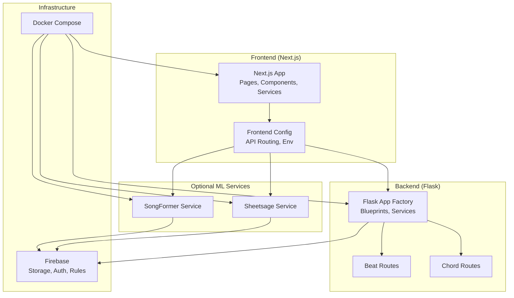
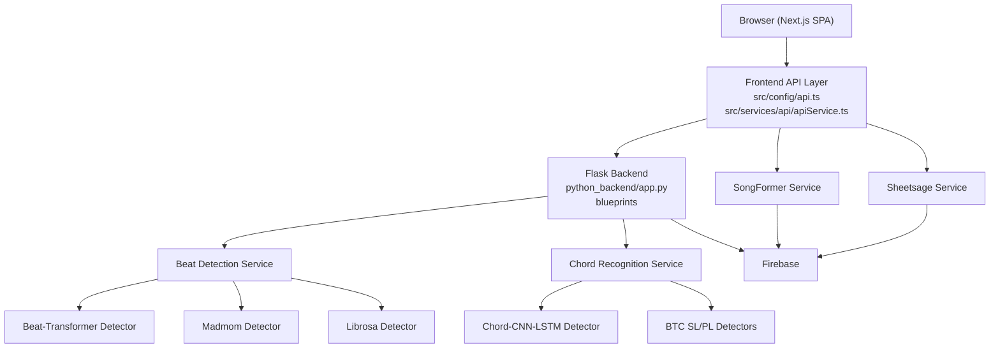
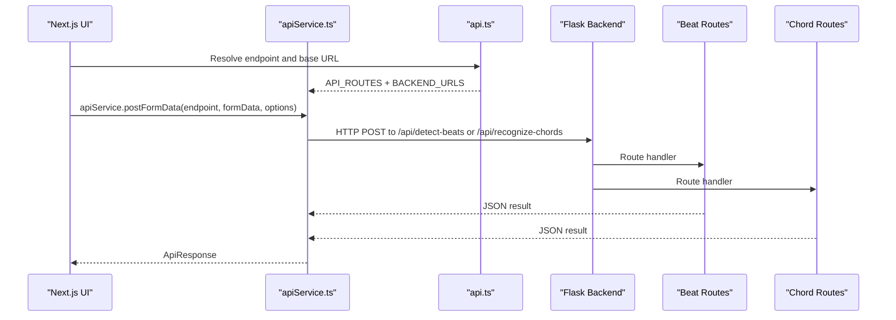
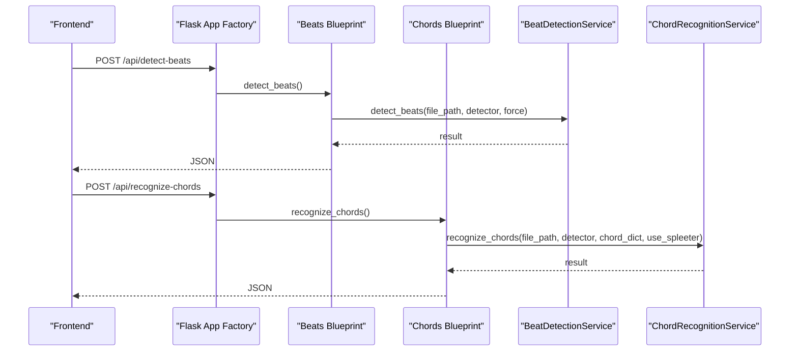
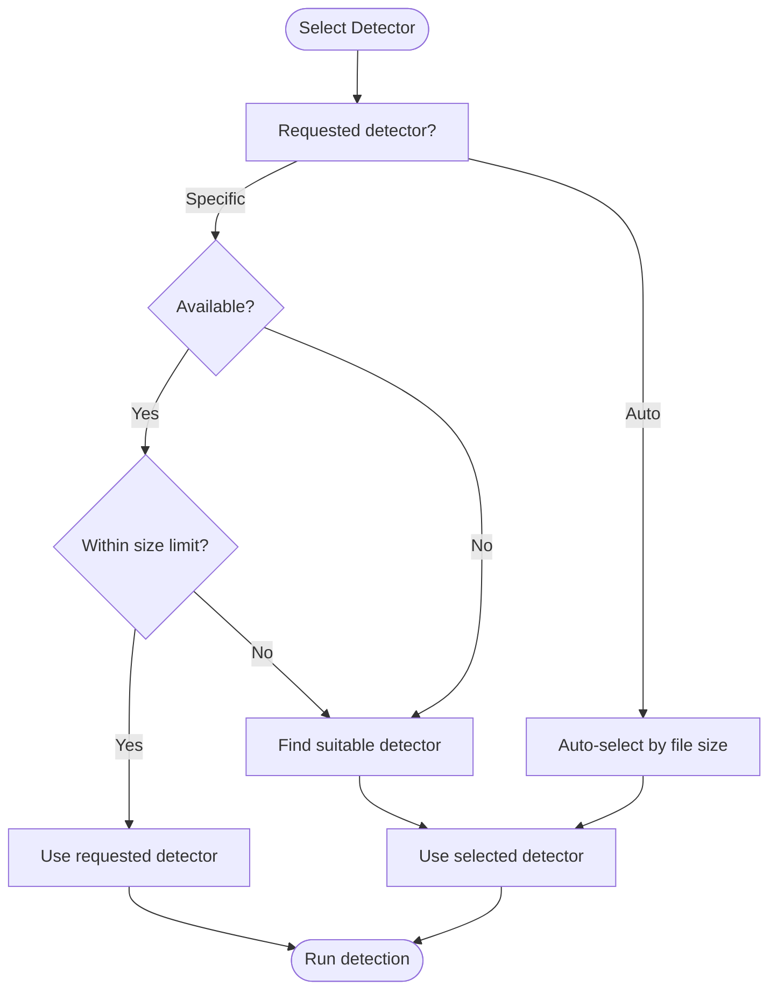
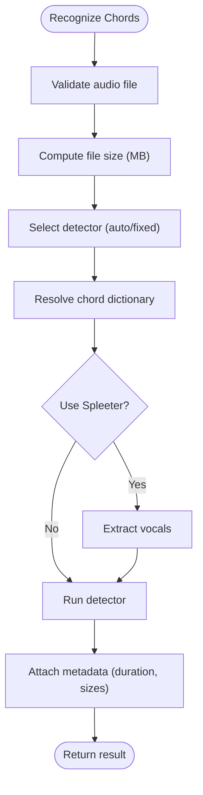
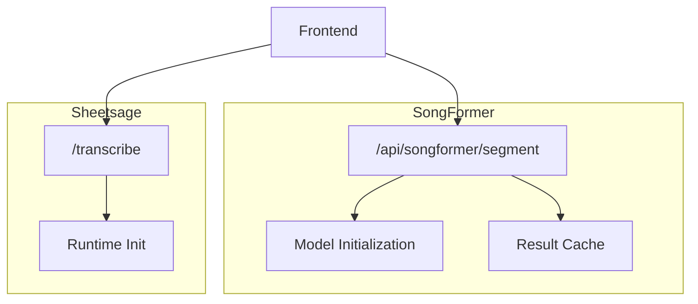
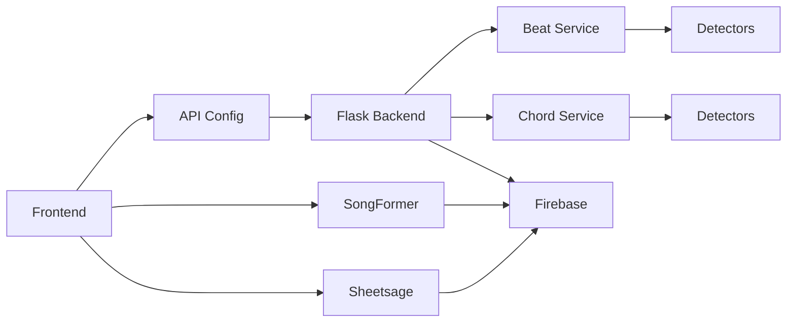

# Architecture Overview

<cite>
**Referenced Files in This Document**
- [README.md](file://README.md)
- [app.py](file://python_backend/app.py)
- [app_factory.py](file://python_backend/app_factory.py)
- [routes.py](file://python_backend/blueprints/beats/routes.py)
- [routes.py](file://python_backend/blueprints/chords/routes.py)
- [layout.tsx](file://src/app/layout.tsx)
- [api.ts](file://src/config/api.ts)
- [serverBackend.ts](file://src/config/serverBackend.ts)
- [apiService.ts](file://src/services/api/apiService.ts)
- [chord_recognition_service.py](file://python_backend/services/audio/chord_recognition_service.py)
- [beat_detection_service.py](file://python_backend/services/audio/beat_detection_service.py)
- [firebase.json](file://firebase/firebase.json)
- [docker-compose.yml](file://docker/docker-compose.yml)
- [app.py](file://SongFormer/app.py)
- [app.py](file://sheetsage/app.py)
</cite>

## Table of Contents
1. [Introduction](#introduction)
2. [Project Structure](#project-structure)
3. [Core Components](#core-components)
4. [Architecture Overview](#architecture-overview)
5. [Detailed Component Analysis](#detailed-component-analysis)
6. [Dependency Analysis](#dependency-analysis)
7. [Performance Considerations](#performance-considerations)
8. [Troubleshooting Guide](#troubleshooting-guide)
9. [Conclusion](#conclusion)

## Introduction
This document presents the architecture of ChordMiniApp, an open-source music analysis platform that combines a Next.js frontend, a Python Flask backend, and specialized machine learning services. The system supports beat detection, chord recognition, optional melody transcription, and synchronized lyrics. It integrates Firebase for storage and authentication, and provides optional standalone services for advanced segmentation and melody transcription.

## Project Structure
The repository is organized into:
- Frontend: Next.js application under src/, with pages, components, services, and configuration
- Python backend: Flask application under python_backend/ exposing ML endpoints
- Optional ML services: SongFormer (structural segmentation) and Sheetsage (melody transcription) under SongFormer/ and sheetsage/
- Infrastructure: Docker Compose for local and production deployments, Firebase configuration

**Diagram sources**
- [layout.tsx:143-228](file://src/app/layout.tsx#L143-L228)
- [api.ts:13-51](file://src/config/api.ts#L13-L51)
- [app.py:87-186](file://python_backend/app.py#L87-L186)
- [routes.py:40-120](file://python_backend/blueprints/beats/routes.py#L40-L120)
- [routes.py:43-143](file://python_backend/blueprints/chords/routes.py#L43-L143)
- [docker-compose.yml:10-115](file://docker/docker-compose.yml#L10-L115)

**Section sources**
- [README.md:1-556](file://README.md#L1-L556)
- [docker-compose.yml:10-115](file://docker/docker-compose.yml#L10-L115)

## Core Components
- Next.js frontend: Renders UI, orchestrates API calls, manages Firebase integration, and handles user interactions for audio analysis and visualization.
- Flask backend: Exposes REST endpoints for beat detection, chord recognition, and related utilities; delegates to internal services and detectors.
- Beat detection service: Orchestrates multiple detectors (Beat-Transformer, madmom, librosa) with size-aware selection and fallback strategies.
- Chord recognition service: Orchestrates Chord-CNN-LSTM and BTC variants (SL/PL), with chord dictionary validation and optional Spleeter separation.
- Optional services:
  - SongFormer: Structural segmentation (functional sections) using PyTorch models.
  - Sheetsage: Experimental melody transcription using PyTorch models.
- Firebase: Storage for audio, Firestore for metadata and caches, and authentication.

**Section sources**
- [layout.tsx:143-228](file://src/app/layout.tsx#L143-L228)
- [api.ts:13-51](file://src/config/api.ts#L13-L51)
- [app.py:87-186](file://python_backend/app.py#L87-L186)
- [beat_detection_service.py:20-348](file://python_backend/services/audio/beat_detection_service.py#L20-L348)
- [chord_recognition_service.py:25-322](file://python_backend/services/audio/chord_recognition_service.py#L25-L322)
- [app.py:549-698](file://SongFormer/app.py#L549-L698)
- [app.py:21-175](file://sheetsage/app.py#L21-L175)
- [firebase.json:1-10](file://firebase/firebase.json#L1-L10)

## Architecture Overview
The system follows a microservices-style backend with a Flask application hosting multiple ML endpoints, while the frontend remains stateless and communicates via HTTP. Optional ML services are provided as separate Flask applications for segmentation and melody transcription.

**Diagram sources**
- [api.ts:13-51](file://src/config/api.ts#L13-L51)
- [apiService.ts:29-407](file://src/services/api/apiService.ts#L29-L407)
- [app.py:87-186](file://python_backend/app.py#L87-L186)
- [routes.py:40-120](file://python_backend/blueprints/beats/routes.py#L40-L120)
- [routes.py:43-143](file://python_backend/blueprints/chords/routes.py#L43-L143)
- [beat_detection_service.py:20-348](file://python_backend/services/audio/beat_detection_service.py#L20-L348)
- [chord_recognition_service.py:25-322](file://python_backend/services/audio/chord_recognition_service.py#L25-L322)
- [app.py:549-698](file://SongFormer/app.py#L549-L698)
- [app.py:21-175](file://sheetsage/app.py#L21-L175)

## Detailed Component Analysis

### Frontend API and Routing
- API routing is centralized to distinguish between Vercel-hosted endpoints and the Python backend. ML endpoints are proxied to the Flask backend.
- The frontend constructs URLs using environment-driven base URLs and selects endpoints for beat/chord recognition, lyrics, and model info.
- The API service adds timeouts, retries, and client-side rate limiting, and attaches Firebase App Check tokens when available.

**Diagram sources**
- [api.ts:13-51](file://src/config/api.ts#L13-L51)
- [apiService.ts:29-407](file://src/services/api/apiService.ts#L29-L407)
- [routes.py:40-120](file://python_backend/blueprints/beats/routes.py#L40-L120)
- [routes.py:43-143](file://python_backend/blueprints/chords/routes.py#L43-L143)

**Section sources**
- [api.ts:13-51](file://src/config/api.ts#L13-L51)
- [apiService.ts:29-407](file://src/services/api/apiService.ts#L29-L407)
- [serverBackend.ts:23-56](file://src/config/serverBackend.ts#L23-L56)

### Flask Backend Orchestration
- The Flask app is created via an application factory, registering blueprints for health, docs, beats, chords, lyrics, and optional debug endpoints.
- Services are initialized and injected into the Flask app’s extensions for dependency management.
- Beat and chord routes validate inputs, enforce rate limits, and delegate to service layers.

**Diagram sources**
- [app_factory.py:27-162](file://python_backend/app_factory.py#L27-L162)
- [routes.py:40-120](file://python_backend/blueprints/beats/routes.py#L40-L120)
- [routes.py:43-143](file://python_backend/blueprints/chords/routes.py#L43-L143)
- [beat_detection_service.py:163-348](file://python_backend/services/audio/beat_detection_service.py#L163-L348)
- [chord_recognition_service.py:173-322](file://python_backend/services/audio/chord_recognition_service.py#L173-L322)

**Section sources**
- [app.py:87-186](file://python_backend/app.py#L87-L186)
- [app_factory.py:27-162](file://python_backend/app_factory.py#L27-L162)

### Beat Detection Service
- Supports multiple detectors with size-aware selection and fallback:
  - Beat-Transformer: DL model with audio separation, larger file size limit.
  - Madmom: Neural network, balanced accuracy and speed.
  - Librosa: Classical signal processing, fastest.
- Auto-selection prefers higher-quality models for smaller files and more permissive ones for larger files.

**Diagram sources**
- [beat_detection_service.py:53-161](file://python_backend/services/audio/beat_detection_service.py#L53-L161)

**Section sources**
- [beat_detection_service.py:20-348](file://python_backend/services/audio/beat_detection_service.py#L20-L348)
- [routes.py:182-250](file://python_backend/blueprints/beats/routes.py#L182-L250)

### Chord Recognition Service
- Orchestrates Chord-CNN-LSTM and BTC variants (SL/PL) with:
  - Automatic detector selection based on file size and availability
  - Validation and fallback for chord dictionaries
  - Optional Spleeter vocal separation for improved recognition
- Provides model capability reporting and size limits.

**Diagram sources**
- [chord_recognition_service.py:173-297](file://python_backend/services/audio/chord_recognition_service.py#L173-L297)

**Section sources**
- [chord_recognition_service.py:25-322](file://python_backend/services/audio/chord_recognition_service.py#L25-L322)
- [routes.py:43-143](file://python_backend/blueprints/chords/routes.py#L43-L143)

### Optional ML Services
- SongFormer: Standalone Flask service for structural segmentation using PyTorch models. Supports local or remote audio sources, caching, and async callbacks.
- Sheetsage: Standalone Flask service for experimental melody transcription with runtime checks and asset availability.

**Diagram sources**
- [app.py:549-698](file://SongFormer/app.py#L549-L698)
- [app.py:21-175](file://sheetsage/app.py#L21-L175)

**Section sources**
- [app.py:549-698](file://SongFormer/app.py#L549-L698)
- [app.py:21-175](file://sheetsage/app.py#L21-L175)

## Dependency Analysis
- Frontend-to-backend: API routing distinguishes between Vercel-hosted endpoints and the Flask backend. ML endpoints are proxied to the backend.
- Backend-to-services: Flask app initializes services and injects them into the app context for route handlers.
- Optional services: SongFormer and Sheetsage are separate Flask apps that can be run independently or co-located with the main backend.

**Diagram sources**
- [api.ts:13-51](file://src/config/api.ts#L13-L51)
- [app.py:87-186](file://python_backend/app.py#L87-L186)
- [beat_detection_service.py:20-348](file://python_backend/services/audio/beat_detection_service.py#L20-L348)
- [chord_recognition_service.py:25-322](file://python_backend/services/audio/chord_recognition_service.py#L25-L322)
- [app.py:549-698](file://SongFormer/app.py#L549-L698)
- [app.py:21-175](file://sheetsage/app.py#L21-L175)

**Section sources**
- [api.ts:13-51](file://src/config/api.ts#L13-L51)
- [app.py:87-186](file://python_backend/app.py#L87-L186)

## Performance Considerations
- Timeouts and retries: The frontend sets generous timeouts for ML operations and disables retries for heavy operations to avoid double-processing.
- Rate limiting: Both client-side and server-side rate limiting are implemented to protect resources and ensure fair usage.
- Model selection: Auto-selection favors higher-quality models for small files and more permissive ones for large files to balance quality and throughput.
- Caching: SongFormer includes a result cache with TTL and max items to reduce repeated processing.
- GPU/CPU selection: SongFormer resolves runtime devices with production defaults to CPU and local development policies for acceleration.

[No sources needed since this section provides general guidance]

## Troubleshooting Guide
- Backend connectivity: Verify Flask backend health endpoint and port usage to avoid conflicts with system services.
- Frontend connection errors: Ensure the frontend connects to the correct backend URL and environment variables are set.
- Model availability: Use test endpoints to confirm detector availability and device info for Beat-Transformer.
- Firebase issues: Confirm storage rules, bucket configuration, and CORS settings; verify anonymous authentication is enabled.

**Section sources**
- [README.md:447-490](file://README.md#L447-L490)
- [routes.py:252-338](file://python_backend/blueprints/beats/routes.py#L252-L338)
- [routes.py:260-375](file://python_backend/blueprints/chords/routes.py#L260-L375)
- [firebase.json:1-10](file://firebase/firebase.json#L1-L10)

## Conclusion
ChordMiniApp employs a clean separation of concerns: a responsive Next.js frontend, a modular Flask backend delegating to specialized services, and optional standalone ML services for advanced tasks. The architecture balances flexibility, scalability, and maintainability, leveraging Firebase for storage and authentication and Docker Compose for repeatable deployments.