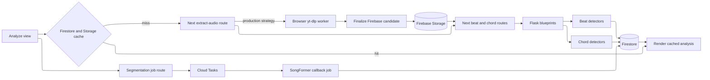
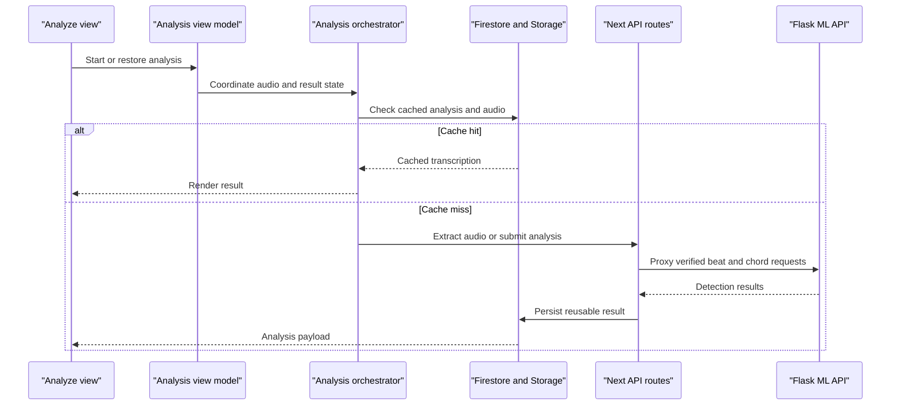
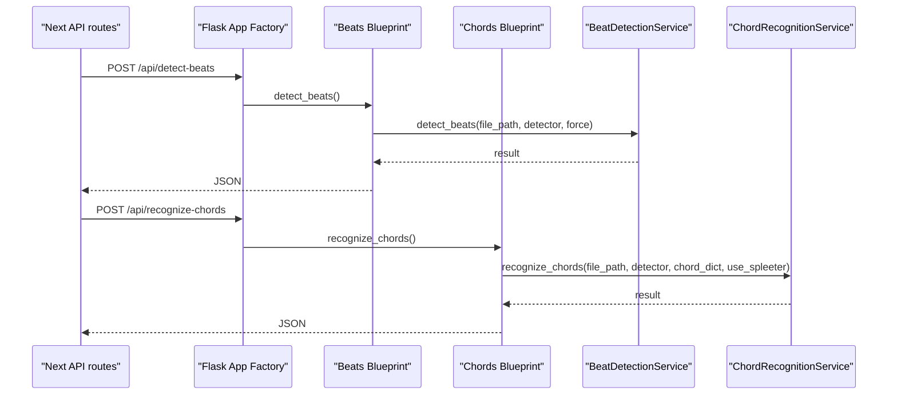
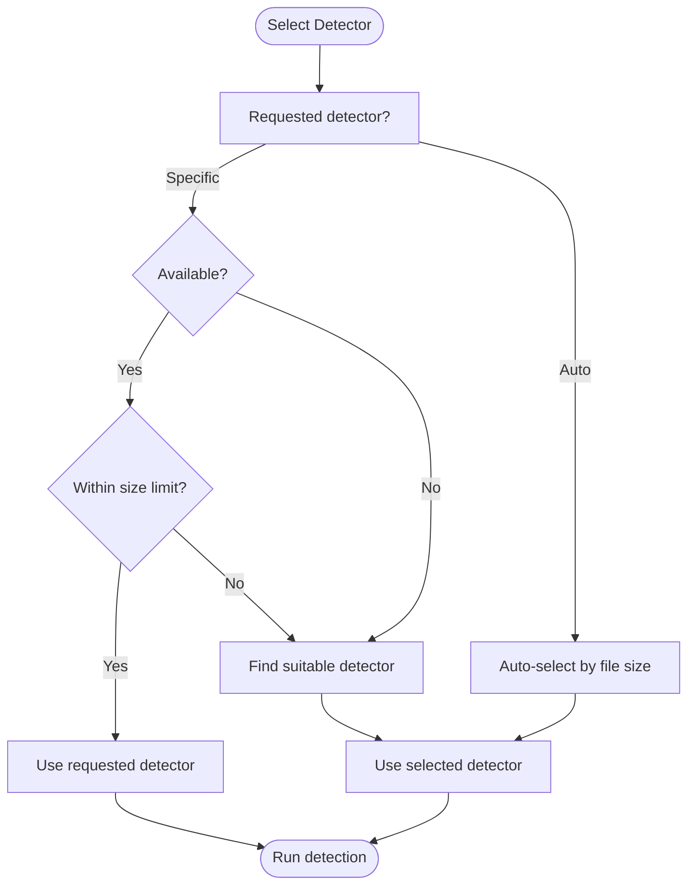
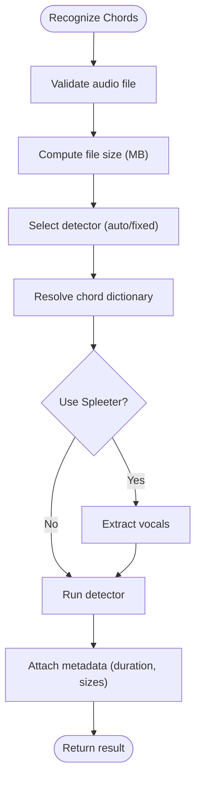
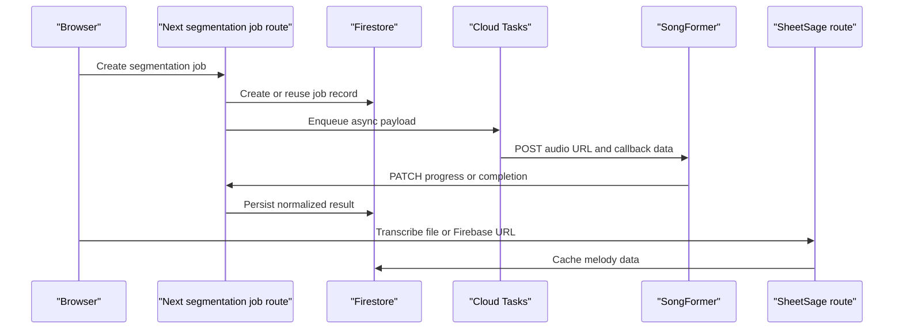
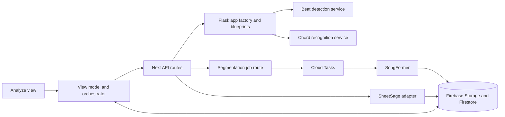

# Architecture Overview

<cite>
**Referenced Files in This Document**
- [README.md](file://README.md)
- [layout.tsx](file://src/app/layout.tsx)
- [page.tsx](file://src/app/analyze/[videoId]/page.tsx)
- [useAnalyzePageViewModel.ts](file://src/app/analyze/[videoId]/_hooks/useAnalyzePageViewModel.ts)
- [useAnalyzePageOrchestrator.ts](file://src/hooks/analyze/useAnalyzePageOrchestrator.ts)
- [serverBackend.ts](file://src/config/serverBackend.ts)
- [extract-audio route.ts](file://src/app/api/extract-audio/route.ts)
- [browserYtDlpExtractionService.ts](file://src/services/audio/browserYtDlpExtractionService.ts)
- [browser-ytdlp-worker.js](file://public/browser-ytdlp-worker.js)
- [finalize-browser-extraction route.ts](file://src/app/api/audio/finalize-browser-extraction/route.ts)
- [detect-beats route.ts](file://src/app/api/detect-beats/route.ts)
- [recognize-chords route.ts](file://src/app/api/recognize-chords/route.ts)
- [app.py](file://python_backend/app.py)
- [app_factory.py](file://python_backend/app_factory.py)
- [routes.py (beats)](file://python_backend/blueprints/beats/routes.py)
- [routes.py (chords)](file://python_backend/blueprints/chords/routes.py)
- [chord_recognition_service.py](file://python_backend/services/audio/chord_recognition_service.py)
- [beat_detection_service.py](file://python_backend/services/audio/beat_detection_service.py)
- [segmentation jobs route.ts](file://src/app/api/segmentation/jobs/route.ts)
- [cloudTasksService.ts](file://src/services/google/cloudTasksService.ts)
- [SongFormer app.py](file://SongFormer/app.py)
- [transcribe-sheetsage route.ts](file://src/app/api/transcribe-sheetsage/route.ts)
- [SheetSage app.py](file://sheetsage/app.py)
- [docker-compose.prod.yml](file://docker-compose.prod.yml)
</cite>

## Table of Contents
1. [Introduction](#introduction)
2. [Project Structure](#project-structure)
3. [Core Components](#core-components)
4. [Architecture Overview](#architecture-overview)
5. [Detailed Component Analysis](#detailed-component-analysis)
6. [Dependency Analysis](#dependency-analysis)
7. [Performance Considerations](#performance-considerations)
8. [Troubleshooting Guide](#troubleshooting-guide)
9. [Conclusion](#conclusion)

## Introduction
ChordMiniApp is a music-analysis web application built around a Next.js client and route layer, a Flask machine-learning service, and Firebase-backed caching. The browser owns the interactive analysis workspace and the production browser-side audio extraction path; Next.js route handlers enforce the application boundary before work reaches Flask or optional services. SongFormer segmentation is an asynchronous job flow, while SheetSage melody transcription remains an independent optional service.

## Project Structure
The repository is organized into:
- Browser and application shell: the Next.js App Router under `src/app/`, shared components, hooks, services, and workers under `src/` and `public/`.
- Orchestration boundary: analysis view-model and Next.js API routes coordinate cache lookup, browser extraction, Firebase offload, and calls to ML services.
- Primary compute service: the Flask application under `python_backend/` hosts beat and chord endpoints backed by detector services.
- Platform services: Firebase Storage stores audio, Firestore stores cached analyses and job state, and Cloud Tasks drives asynchronous segmentation work.
- Optional services: SongFormer performs structural segmentation through a callback job contract; SheetSage supplies experimental melody transcription.
- Deployment: Docker and Compose definitions package the frontend, Flask backend, and optional services for local and production-like environments.

```mermaid
architecture-beta
    group browser(internet)[Browser]
    service ui(internet)[Next.js UI] in browser
    service worker(server)[yt-dlp worker] in browser

    group application(server)[Next.js application]
    service api(server)[API routes] in application

    group compute(server)[Compute services]
    service flask(server)[Flask ML API] in compute
    service songformer(server)[SongFormer] in compute
    service sheetsage(server)[SheetSage] in compute

    group platform(cloud)[Platform]
    service storage(disk)[Firebase Storage] in platform
    service firestore(database)[Firestore] in platform
    service tasks(cloud)[Cloud Tasks] in platform

    ui:R --> L:api
    ui:B --> T:worker
    worker:R --> L:storage
    api:R --> L:flask
    api:B --> T:storage
    api:B --> T:firestore
    api:R --> L:tasks
    tasks:R --> L:songformer
    songformer:B --> T:firestore
    api:R --> L:sheetsage
    sheetsage:B --> T:firestore
```

**Diagram sources**
- [layout.tsx:219-234](file://src/app/layout.tsx#L219-L234)
- [page.tsx:27-123](file://src/app/analyze/[videoId]/page.tsx#L27-L123)
- [browserYtDlpExtractionService.ts:420-585](file://src/services/audio/browserYtDlpExtractionService.ts#L420-L585)
- [app_factory.py:27-65](file://python_backend/app_factory.py#L27-L65)
- [segmentation jobs route.ts:101-187](file://src/app/api/segmentation/jobs/route.ts#L101-L187)
- [cloudTasksService.ts:86-135](file://src/services/google/cloudTasksService.ts#L86-L135)
- [SongFormer app.py:565-707](file://SongFormer/app.py#L565-L707)
- [SheetSage app.py:41-281](file://sheetsage/app.py#L41-L281)

**Section sources**
- [README.md:1-521](file://README.md#L1-L521)
- [serverBackend.ts:23-46](file://src/config/serverBackend.ts#L23-L46)
- [docker-compose.prod.yml:12-108](file://docker-compose.prod.yml#L12-L108)

## Core Components
- Analysis workspace: the `/analyze/[videoId]` page composes playback, controls, result panels, and optional views. Its view model and orchestrator coordinate state, cache lookup, extraction, analysis, and result rendering.
- Audio acquisition and cache: the browser-side `yt-dlp` worker is the production extraction strategy. It uploads a temporary candidate to Firebase Storage, then a protected finalizer promotes it to the reusable audio path.
- Next.js API boundary: direct beat/chord routes verify App Check and proxy multipart work to Flask; Firebase-offload variants send storage URLs for larger files.
- Flask ML service: its application factory registers blueprints and injected services. Beat detection chooses among Beat-Transformer, Madmom, and Librosa; chord recognition selects Chord-CNN-LSTM or BTC variants.
- Firebase and jobs: Storage is the audio source of truth and Firestore stores analysis, enrichment, melody, and segmentation-job records. Cloud Tasks invokes SongFormer after the Next job route creates and deduplicates a job.
- Optional services: SongFormer reports progress and completion through the job callback. SheetSage accepts file or Firebase URL input and caches normalized melody data in Firestore.

**Section sources**
- [useAnalyzePageViewModel.ts:76-138](file://src/app/analyze/[videoId]/_hooks/useAnalyzePageViewModel.ts#L76-L138)
- [useAnalyzePageOrchestrator.ts:369-419](file://src/hooks/analyze/useAnalyzePageOrchestrator.ts#L369-L419)
- [browser-ytdlp-worker.js:37-295](file://public/browser-ytdlp-worker.js#L37-L295)
- [finalize-browser-extraction route.ts:32-138](file://src/app/api/audio/finalize-browser-extraction/route.ts#L32-L138)
- [detect-beats route.ts:17-95](file://src/app/api/detect-beats/route.ts#L17-L95)
- [recognize-chords route.ts:17-107](file://src/app/api/recognize-chords/route.ts#L17-L107)
- [beat_detection_service.py:20-348](file://python_backend/services/audio/beat_detection_service.py#L20-L348)
- [chord_recognition_service.py:25-322](file://python_backend/services/audio/chord_recognition_service.py#L25-L322)
- [segmentationJobService.ts:131-249](file://src/services/firebase/segmentationJobService.ts#L131-L249)
- [transcribe-sheetsage route.ts:175-328](file://src/app/api/transcribe-sheetsage/route.ts#L175-L328)

## Architecture Overview
The normal analysis path is cache-first. The analysis orchestrator checks Firestore and Firebase Storage before requesting extraction, then the Next.js route layer passes direct or offloaded beat/chord work to Flask. The UI renders a persisted result after the detector services return. Segmentation is intentionally separate: the browser creates a job, Cloud Tasks invokes SongFormer, and the service calls back to update the Firestore job that the browser polls.

```mermaid
---
config:
  layout: elk
---
flowchart LR
    UI[Analyze view] --> CACHE{Firestore and Storage cache}
    CACHE -->|hit| DISPLAY[Render cached analysis]
    CACHE -->|miss| EXTRACT[Next extract-audio route]
    EXTRACT -->|production strategy| WORKER[Browser yt-dlp worker]
    WORKER --> FINALIZE[Finalize Firebase candidate]
    FINALIZE --> STORAGE[(Firebase Storage)]
    EXTRACT --> ANALYZE[Next beat and chord routes]
    STORAGE --> ANALYZE
    ANALYZE --> FLASK[Flask blueprints]
    FLASK --> BEATS[Beat detectors]
    FLASK --> CHORDS[Chord detectors]
    BEATS --> PERSIST[(Firestore)]
    CHORDS --> PERSIST
    PERSIST --> DISPLAY
    UI --> JOB[Segmentation job route]
    JOB --> TASKS[Cloud Tasks]
    TASKS --> SONGFORMER[SongFormer callback job]
    SONGFORMER --> PERSIST
```

**Diagram sources**
- [useAnalyzePageOrchestrator.ts:499-790](file://src/hooks/analyze/useAnalyzePageOrchestrator.ts#L499-L790)
- [extract-audio route.ts:23-150](file://src/app/api/extract-audio/route.ts#L23-L150)
- [browserYtDlpExtractionService.ts:594-935](file://src/services/audio/browserYtDlpExtractionService.ts#L594-L935)
- [detect-beats-offload route.ts:37-110](file://src/app/api/detect-beats-offload/route.ts#L37-L110)
- [recognize-chords-offload route.ts:22-78](file://src/app/api/recognize-chords-offload/route.ts#L22-L78)
- [routes.py (beats):40-155](file://python_backend/blueprints/beats/routes.py#L40-L155)
- [routes.py (chords):43-211](file://python_backend/blueprints/chords/routes.py#L43-L211)
- [segmentationAsyncService.ts:112-183](file://src/services/api/segmentationAsyncService.ts#L112-L183)
- [SongFormer app.py:565-707](file://SongFormer/app.py#L565-L707)

## Detailed Component Analysis

### Frontend API and Routing
- The analysis page delegates state and side effects to its view model and orchestrator, which check cached transcription and audio records before starting work.
- Next.js route handlers are the boundary for extraction and model calls: the direct beat/chord routes verify App Check before proxying multipart requests to Flask, while offload routes pass Firebase Storage URLs for larger files.
- Backend URLs are resolved separately for the primary Flask, SongFormer, and SheetSage services, so optional services do not share an implicit direct client contract.

```mermaid
sequenceDiagram
participant UI as "Analyze view"
participant VM as "Analysis view model"
participant ORCH as "Analysis orchestrator"
participant CACHE as "Firestore and Storage"
participant NEXT as "Next API routes"
participant FLASK as "Flask ML API"
UI->>VM : Start or restore analysis
VM->>ORCH : Coordinate audio and result state
ORCH->>CACHE : Check cached analysis and audio
alt Cache hit
    CACHE-->>ORCH : Cached transcription
    ORCH-->>UI : Render result
else Cache miss
    ORCH->>NEXT : Extract audio or submit analysis
    NEXT->>FLASK : Proxy verified beat and chord requests
    FLASK-->>NEXT : Detection results
    NEXT->>CACHE : Persist reusable result
    CACHE-->>UI : Analysis payload
end
```

**Diagram sources**
- [useAnalyzePageViewModel.ts:189-292](file://src/app/analyze/[videoId]/_hooks/useAnalyzePageViewModel.ts#L189-L292)
- [useAnalyzePageOrchestrator.ts:499-790](file://src/hooks/analyze/useAnalyzePageOrchestrator.ts#L499-L790)
- [detect-beats route.ts:17-95](file://src/app/api/detect-beats/route.ts#L17-L95)
- [recognize-chords route.ts:17-107](file://src/app/api/recognize-chords/route.ts#L17-L107)

**Section sources**
- [extract-audio route.ts:7-150](file://src/app/api/extract-audio/route.ts#L7-L150)
- [serverBackend.ts:23-46](file://src/config/serverBackend.ts#L23-L46)

### Flask Backend Orchestration
- The Flask app is created via an application factory, registering blueprints for health, docs, beats, chords, lyrics, and optional debug endpoints.
- Services are initialized and injected into the Flask app’s extensions for dependency management.
- Beat and chord routes validate inputs, enforce rate limits, and delegate to service layers.

```mermaid
sequenceDiagram
participant Client as "Next API routes"
participant Flask as "Flask App Factory"
participant BP_Beat as "Beats Blueprint"
participant BP_Chord as "Chords Blueprint"
participant Svc_Beat as "BeatDetectionService"
participant Svc_Chord as "ChordRecognitionService"
Client->>Flask : POST /api/detect-beats
Flask->>BP_Beat : detect_beats()
BP_Beat->>Svc_Beat : detect_beats(file_path, detector, force)
Svc_Beat-->>BP_Beat : result
BP_Beat-->>Client : JSON
Client->>Flask : POST /api/recognize-chords
Flask->>BP_Chord : recognize_chords()
BP_Chord->>Svc_Chord : recognize_chords(file_path, detector, chord_dict, use_spleeter)
Svc_Chord-->>BP_Chord : result
BP_Chord-->>Client : JSON
```

**Diagram sources**
- [app_factory.py:27-162](file://python_backend/app_factory.py#L27-L162)
- [routes.py:40-120](file://python_backend/blueprints/beats/routes.py#L40-L120)
- [routes.py:43-143](file://python_backend/blueprints/chords/routes.py#L43-L143)
- [beat_detection_service.py:163-348](file://python_backend/services/audio/beat_detection_service.py#L163-L348)
- [chord_recognition_service.py:173-322](file://python_backend/services/audio/chord_recognition_service.py#L173-L322)

**Section sources**
- [app.py:87-186](file://python_backend/app.py#L87-L186)
- [app_factory.py:27-162](file://python_backend/app_factory.py#L27-L162)

### Beat Detection Service
- Supports multiple detectors with size-aware selection and fallback:
  - Beat-Transformer: DL model with audio separation, larger file size limit.
  - Madmom: Neural network, balanced accuracy and speed.
  - Librosa: Classical signal processing, fastest.
- Auto-selection prefers higher-quality models for smaller files and more permissive ones for larger files.

```mermaid
flowchart TD
Start(["Select Detector"]) --> CheckReq["Requested detector?"]
CheckReq --> |Specific| AvailReq{"Available?"}
AvailReq --> |Yes| SizeReq{"Within size limit?"}
SizeReq --> |Yes| UseReq["Use requested detector"]
SizeReq --> |No| Fallback["Find suitable detector"]
AvailReq --> |No| Fallback
CheckReq --> |Auto| AutoSel["Auto-select by file size"]
AutoSel --> UseSel["Use selected detector"]
Fallback --> UseSel
UseReq --> End(["Run detection"])
UseSel --> End
```

**Diagram sources**
- [beat_detection_service.py:53-161](file://python_backend/services/audio/beat_detection_service.py#L53-L161)

**Section sources**
- [beat_detection_service.py:20-348](file://python_backend/services/audio/beat_detection_service.py#L20-L348)
- [routes.py:182-250](file://python_backend/blueprints/beats/routes.py#L182-L250)

### Chord Recognition Service
- Orchestrates Chord-CNN-LSTM and BTC variants (SL/PL) with:
  - Automatic detector selection based on file size and availability
  - Validation and fallback for chord dictionaries
  - Optional Spleeter vocal separation for improved recognition
- Provides model capability reporting and size limits.

```mermaid
flowchart TD
Start(["Recognize Chords"]) --> Validate["Validate audio file"]
Validate --> Size["Compute file size (MB)"]
Size --> SelDet["Select detector (auto/fixed)"]
SelDet --> Dict["Resolve chord dictionary"]
Dict --> Sep{"Use Spleeter?"}
Sep --> |Yes| Vocals["Extract vocals"]
Sep --> |No| Run["Run detector"]
Vocals --> Run
Run --> Meta["Attach metadata (duration, sizes)"]
Meta --> End(["Return result"])
```

**Diagram sources**
- [chord_recognition_service.py:173-297](file://python_backend/services/audio/chord_recognition_service.py#L173-L297)

**Section sources**
- [chord_recognition_service.py:25-322](file://python_backend/services/audio/chord_recognition_service.py#L25-L322)
- [routes.py:43-143](file://python_backend/blueprints/chords/routes.py#L43-L143)

### Optional ML Services
- SongFormer is invoked through an asynchronous job contract. The Next.js job route creates or deduplicates a Firestore record and queues Cloud Tasks; SongFormer reports completion through a token-checked callback while the browser polls the job.
- SheetSage is a separate Flask service. Its Next.js adapter can forward uploaded audio or a Firebase URL, then caches normalized melody events in Firestore for later visualization.

```mermaid
sequenceDiagram
participant UI as "Browser"
participant JOB as "Next segmentation job route"
participant DB as "Firestore"
participant TASK as "Cloud Tasks"
participant SF as "SongFormer"
participant SS as "SheetSage route"
UI->>JOB : Create segmentation job
JOB->>DB : Create or reuse job record
JOB->>TASK : Enqueue async payload
TASK->>SF : POST audio URL and callback data
SF->>JOB : PATCH progress or completion
JOB->>DB : Persist normalized result
UI->>SS : Transcribe file or Firebase URL
SS->>DB : Cache melody data
```

**Diagram sources**
- [segmentation jobs route.ts:101-187](file://src/app/api/segmentation/jobs/route.ts#L101-L187)
- [cloudTasksService.ts:86-135](file://src/services/google/cloudTasksService.ts#L86-L135)
- [segmentationAsyncService.ts:112-183](file://src/services/api/segmentationAsyncService.ts#L112-L183)
- [SongFormer app.py:565-707](file://SongFormer/app.py#L565-L707)
- [transcribe-sheetsage route.ts:175-328](file://src/app/api/transcribe-sheetsage/route.ts#L175-L328)

**Section sources**
- [SheetSage app.py:41-281](file://sheetsage/app.py#L41-L281)
- [sheetSageTranscriptionClient.ts:116-145](file://src/services/sheetsage/sheetSageTranscriptionClient.ts#L116-L145)

## Dependency Analysis
- Browser-to-application: the analysis view delegates cache and request coordination to the view model, orchestrator, and Next.js route handlers.
- Application-to-compute: the Next.js boundary proxies primary beat/chord inference to Flask, whose factory wires routes to injected detector services.
- Application-to-platform: Firebase holds cached audio and analysis records. Long-running segmentation runs through Firestore and Cloud Tasks rather than a direct browser-to-SongFormer request.
- Optional compute: SheetSage is independently addressable through its adapter and may receive a Firebase URL directly in production.

```mermaid
flowchart LR
    UI[Analyze view] --> ORCH[View model and orchestrator]
    ORCH --> ROUTES[Next API routes]
    ORCH <--> FIREBASE[(Firebase Storage and Firestore)]
    ROUTES --> FLASK[Flask app factory and blueprints]
    FLASK --> BEATS[Beat detection service]
    FLASK --> CHORDS[Chord recognition service]
    ROUTES --> JOBS[Segmentation job route]
    JOBS --> TASKS[Cloud Tasks]
    TASKS --> SONGFORMER[SongFormer]
    SONGFORMER --> FIREBASE
    ROUTES --> SHEETSAGE[SheetSage adapter]
    SHEETSAGE --> FIREBASE
```

**Diagram sources**
- [useAnalyzePageOrchestrator.ts:369-419](file://src/hooks/analyze/useAnalyzePageOrchestrator.ts#L369-L419)
- [app_factory.py:68-162](file://python_backend/app_factory.py#L68-L162)
- [beat_detection_service.py:20-348](file://python_backend/services/audio/beat_detection_service.py#L20-L348)
- [chord_recognition_service.py:25-322](file://python_backend/services/audio/chord_recognition_service.py#L25-L322)
- [segmentationJobService.ts:201-249](file://src/services/firebase/segmentationJobService.ts#L201-L249)
- [SongFormer app.py:565-707](file://SongFormer/app.py#L565-L707)
- [sheetSageTranscriptionClient.ts:116-145](file://src/services/sheetsage/sheetSageTranscriptionClient.ts#L116-L145)

**Section sources**
- [serverBackend.ts:23-46](file://src/config/serverBackend.ts#L23-L46)
- [docker-compose.prod.yml:12-108](file://docker-compose.prod.yml#L12-L108)

## Performance Considerations
- Timeouts and retries: The frontend sets generous timeouts for ML operations and disables retries for heavy operations to avoid double-processing.
- Rate limiting: Both client-side and server-side rate limiting are implemented to protect resources and ensure fair usage.
- Model selection: Auto-selection favors higher-quality models for small files and more permissive ones for large files to balance quality and throughput.
- Caching: SongFormer includes a result cache with TTL and max items to reduce repeated processing.
- GPU/CPU selection: SongFormer resolves runtime devices with production defaults to CPU and local development policies for acceleration.

[No sources needed since this section provides general guidance]

## Troubleshooting Guide
- Backend connectivity: Verify Flask backend health endpoint and port usage to avoid conflicts with system services.
- Frontend connection errors: Ensure the frontend connects to the correct backend URL and environment variables are set.
- Model availability: Use test endpoints to confirm detector availability and device info for Beat-Transformer.
- Firebase issues: Confirm storage rules, bucket configuration, and CORS settings; verify anonymous authentication is enabled.

**Section sources**
- [README.md:447-490](file://README.md#L447-L490)
- [routes.py:252-338](file://python_backend/blueprints/beats/routes.py#L252-L338)
- [routes.py:260-375](file://python_backend/blueprints/chords/routes.py#L260-L375)
- [firebase.json:1-10](file://firebase/firebase.json#L1-L10)

## Conclusion
ChordMiniApp separates interactive browser work, application orchestration, ML inference, and long-running optional services without treating them as a single direct-call graph. Next.js and Firebase form the coordination boundary, Flask remains the primary synchronous inference service, and SongFormer is deliberately job-driven. This distinction makes the storage lifecycle, failure handling, and service deployment model clearer than the earlier frontend-to-service diagrams.
