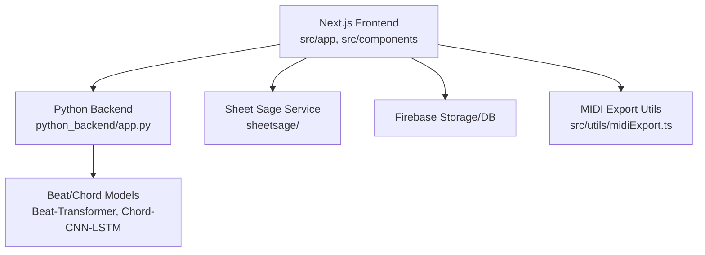
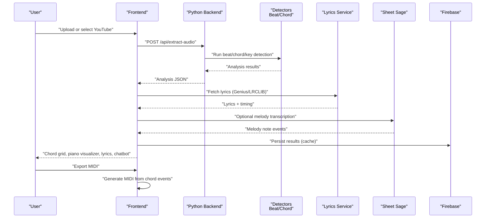
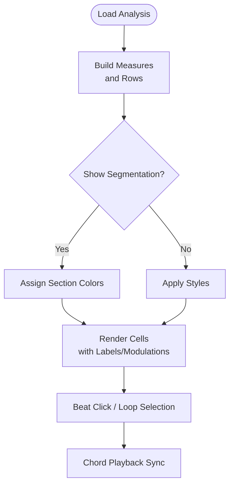
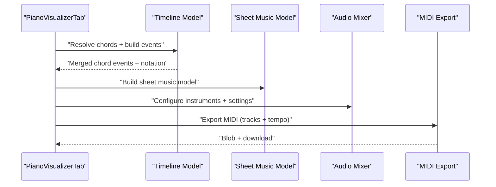
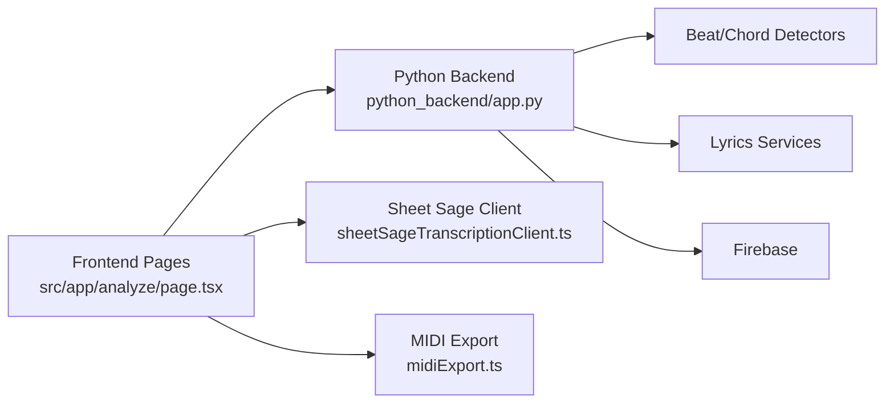

# Feature Showcase

<cite>
**Referenced Files in This Document**
- [README.md](file://README.md)
- [src/app/page.tsx](file://src/app/page.tsx)
- [src/app/analyze/page.tsx](file://src/app/analyze/page.tsx)
- [src/components/homepage/NewHomePageContent.tsx](file://src/components/homepage/NewHomePageContent.tsx)
- [src/components/chord-analysis/ChordGrid.tsx](file://src/components/chord-analysis/ChordGrid.tsx)
- [src/components/chord-analysis/GuitarChordsTab.tsx](file://src/components/chord-analysis/GuitarChordsTab.tsx)
- [src/components/piano-visualizer/PianoVisualizerTab.tsx](file://src/components/piano-visualizer/PianoVisualizerTab.tsx)
- [src/components/piano-visualizer/piano-visualizer-tab/PianoVisualizerTabRoot.tsx](file://src/components/piano-visualizer/piano-visualizer-tab/PianoVisualizerTabRoot.tsx)
- [src/components/lyrics/EnhancedLyricsDisplay.tsx](file://src/components/lyrics/EnhancedLyricsDisplay.tsx)
- [src/components/chatbot/ChatbotInterface.tsx](file://src/components/chatbot/ChatbotInterface.tsx)
- [src/services/sheetsage/sheetSageTranscriptionClient.ts](file://src/services/sheetsage/sheetSageTranscriptionClient.ts)
- [src/utils/midiExport.ts](file://src/utils/midiExport.ts)
- [python_backend/app.py](file://python_backend/app.py)
</cite>

## Table of Contents
1. [Introduction](#introduction)
2. [Project Structure](#project-structure)
3. [Core Components](#core-components)
4. [Architecture Overview](#architecture-overview)
5. [Detailed Component Analysis](#detailed-component-analysis)
6. [Dependency Analysis](#dependency-analysis)
7. [Performance Considerations](#performance-considerations)
8. [Troubleshooting Guide](#troubleshooting-guide)
9. [Conclusion](#conclusion)
10. [Appendices](#appendices)

## Introduction
ChordMiniApp is an open-source music analysis platform that delivers:
- Intuitive homepage with YouTube search and recent analyses
- Beat and chord analysis with grid visualization and segmentation overlays
- Interactive guitar diagrams with accurate fingering patterns
- Real-time piano visualizer with falling notes and MIDI export
- Experimental melody transcription powered by Sheet Sage
- Synchronized lyrics with an AI chatbot assistant

The platform targets musicians, educators, and music enthusiasts who want fast, accurate chord and beat analysis, plus expressive playback and export capabilities.

## Project Structure
High-level structure relevant to features:
- Frontend Next.js app under src/app and src/components
- Backend Python Flask app under python_backend
- Experimental services (Sheet Sage) under sheetsage
- Standalone ML models under SongFormer

**Diagram sources**
- [src/app/analyze/page.tsx:104-106](file://src/app/analyze/page.tsx#L104-L106)
- [python_backend/app.py:1-186](file://python_backend/app.py#L1-L186)
- [src/utils/midiExport.ts:1-468](file://src/utils/midiExport.ts#L1-L468)

**Section sources**
- [README.md:1-556](file://README.md#L1-L556)
- [src/app/page.tsx:1-6](file://src/app/page.tsx#L1-L6)

## Core Components
- Homepage: integrated search, hero demos, recent analyses, and feature highlights
- Analysis pipeline: beat detection, chord recognition, key/signature detection, lyrics, segmentation
- Visualization: chord grid, guitar diagrams, piano visualizer with falling notes and sheet music
- Playback: chord playback, metronome, pitch shift, MIDI export
- Experimental melody transcription: Sheet Sage integration with caching and playback
- AI assistant: Gemini-powered chatbot with song context

Benefits by user type:
- Musicians: precise chord grids, interactive guitar diagrams, piano visualizer, MIDI export
- Educators: synchronized lyrics, Roman numeral overlays, segmentation, chatbot Q&A
- Enthusiasts: homepage demos, recent analyses, YouTube search, Sheet Sage melody overlays

**Section sources**
- [README.md:6-42](file://README.md#L6-L42)
- [src/components/homepage/NewHomePageContent.tsx:1-343](file://src/components/homepage/NewHomePageContent.tsx#L1-L343)
- [src/app/analyze/page.tsx:1-800](file://src/app/analyze/page.tsx#L1-L800)

## Architecture Overview
End-to-end flow from audio to visualization and export.

**Diagram sources**
- [src/app/analyze/page.tsx:594-716](file://src/app/analyze/page.tsx#L594-L716)
- [python_backend/app.py:1-186](file://python_backend/app.py#L1-L186)
- [src/services/sheetsage/sheetSageTranscriptionClient.ts:41-79](file://src/services/sheetsage/sheetSageTranscriptionClient.ts#L41-L79)
- [src/utils/midiExport.ts:359-448](file://src/utils/midiExport.ts#L359-L448)

## Detailed Component Analysis

### Homepage Interface
- Integrated search with sticky behavior and recent videos carousel
- Hero demos showcasing beat/chord grid, piano visualizer, and synchronized lyrics
- Responsive design with theme-aware backgrounds and animations

User interactions:
- Enter YouTube URL or search query, select a result to analyze
- Browse recent analyses to discover songs
- Toggle tabs to explore features

Technical capabilities:
- Dynamic imports for heavy components
- Scroll-based animations and skeleton loaders
- Theme-aware gradients and decorative elements

**Section sources**
- [src/components/homepage/NewHomePageContent.tsx:1-343](file://src/components/homepage/NewHomePageContent.tsx#L1-L343)
- [src/app/page.tsx:1-6](file://src/app/page.tsx#L1-L6)

### Beat & Chord Analysis with Grid Visualization
- Chord progression grid with beat-aligned cells
- Time signature, key signature, and pickup beats support
- Segmentation overlays for intro/verse/chorus/bridge/outro
- Roman numeral analysis and key modulation markers
- Edit mode for chord corrections with sequence-aware mapping

User interactions:
- Click cells to jump to beat
- Toggle Roman numerals and segmentation overlays
- Enable loop playback between selected beats

Technical capabilities:
- Memoized rendering to minimize re-renders
- Accidental preference for consistent spelling
- Beat-to-chord mapping for accurate audio sync
- Editable chords with persistent corrections

**Diagram sources**
- [src/components/chord-analysis/ChordGrid.tsx:348-387](file://src/components/chord-analysis/ChordGrid.tsx#L348-L387)
- [src/components/chord-analysis/ChordGrid.tsx:399-413](file://src/components/chord-analysis/ChordGrid.tsx#L399-L413)
- [src/components/chord-analysis/ChordGrid.tsx:546-619](file://src/components/chord-analysis/ChordGrid.tsx#L546-L619)

**Section sources**
- [src/components/chord-analysis/ChordGrid.tsx:1-831](file://src/components/chord-analysis/ChordGrid.tsx#L1-L831)

### Interactive Guitar Diagrams with Accurate Fingering Patterns
- Animated chord diagrams with shape/sound labeling modes
- Capo position control with automatic suggestions
- Multiple voicings per chord with position selector
- Guitar-only playback synchronized to chord grid
- Tablature view for notation

User interactions:
- Switch between animated, summary, and tab views
- Adjust capo and voicing position
- Toggle label mode (shape vs. sound)
- Play guitar voicings with dynamics and segmentation cues

Technical capabilities:
- Chord database integration for accurate fingering
- Transpose chords for capo positions
- Build chord timelines for playback
- Segment-aware coloring for structural sections

**Section sources**
- [src/components/chord-analysis/GuitarChordsTab.tsx:1-809](file://src/components/chord-analysis/GuitarChordsTab.tsx#L1-L809)

### Real-time Piano Visualizer with Falling Notes and MIDI Export
- Piano roll visualization with falling notes synchronized to playback
- Scrolling chord strip with chord labels and Roman numerals
- Sheet music display with notation rendering
- Multi-instrument mixer with instrument-specific voicings
- MIDI export supporting multiple tracks and melody overlays

User interactions:
- Switch between piano roll and sheet music displays
- Control playback speed and toggle chord playback
- Export MIDI with instrument-specific tracks
- Toggle melody overlay from Sheet Sage

Technical capabilities:
- Timeline model builds chord events and notation
- Instrument voicings: piano (full), guitar (arpeggiated), violin/flute (root), bass (single)
- Dynamics-aware velocity shaping for realistic playback
- Export to standard MIDI Type 1 with tempo/time signature

**Diagram sources**
- [src/components/piano-visualizer/piano-visualizer-tab/PianoVisualizerTabRoot.tsx:1-200](file://src/components/piano-visualizer/piano-visualizer-tab/PianoVisualizerTabRoot.tsx#L1-L200)
- [src/utils/midiExport.ts:359-448](file://src/utils/midiExport.ts#L359-L448)

**Section sources**
- [src/components/piano-visualizer/PianoVisualizerTab.tsx:1-10](file://src/components/piano-visualizer/PianoVisualizerTab.tsx#L1-L10)
- [src/components/piano-visualizer/piano-visualizer-tab/PianoVisualizerTabRoot.tsx:1-200](file://src/components/piano-visualizer/piano-visualizer-tab/PianoVisualizerTabRoot.tsx#L1-L200)
- [src/utils/midiExport.ts:1-468](file://src/utils/midiExport.ts#L1-L468)

### Experimental Melody Transcription with Sheet Sage Integration
- Request melody transcription from Sheet Sage backend or API
- Offload upload path for large files
- Cache results and enable playback with visual notes
- Export melody as an additional MIDI track

User interactions:
- Enable melodic transcription playback
- Toggle melody overlay in the piano visualizer
- Export melody track alongside chord tracks

Technical capabilities:
- Resolve audio source from uploaded file or proxied URL
- Use offload upload service when appropriate
- Build note events for visualization and MIDI export

**Section sources**
- [src/services/sheetsage/sheetSageTranscriptionClient.ts:1-79](file://src/services/sheetsage/sheetSageTranscriptionClient.ts#L1-L79)
- [src/app/analyze/page.tsx:474-521](file://src/app/analyze/page.tsx#L474-L521)

### Synchronized Lyrics with AI Chatbot Assistant
- Enhanced lyrics display with chord positioning above words
- Auto-scroll to current line with throttled smooth scroll
- AI chatbot with Gemini integration for contextual Q&A
- Conversation history truncation and error handling

User interactions:
- Click lyric lines to seek in playback
- Ask questions about chords, structure, and lyrics
- Clear conversation and close chat panel

Technical capabilities:
- Word-position mapping for chords
- Time-based highlighting and auto-scroll
- Truncated conversation history for efficient prompts

**Section sources**
- [src/components/lyrics/EnhancedLyricsDisplay.tsx:1-231](file://src/components/lyrics/EnhancedLyricsDisplay.tsx#L1-L231)
- [src/components/chatbot/ChatbotInterface.tsx:1-203](file://src/components/chatbot/ChatbotInterface.tsx#L1-L203)

## Dependency Analysis
Frontend-to-backend and service dependencies.

**Diagram sources**
- [src/app/analyze/page.tsx:1-800](file://src/app/analyze/page.tsx#L1-L800)
- [python_backend/app.py:1-186](file://python_backend/app.py#L1-L186)
- [src/services/sheetsage/sheetSageTranscriptionClient.ts:1-79](file://src/services/sheetsage/sheetSageTranscriptionClient.ts#L1-L79)
- [src/utils/midiExport.ts:1-468](file://src/utils/midiExport.ts#L1-L468)

**Section sources**
- [src/app/analyze/page.tsx:1-800](file://src/app/analyze/page.tsx#L1-L800)
- [python_backend/app.py:1-186](file://python_backend/app.py#L1-L186)

## Performance Considerations
- Frontend
  - Memoized chord grid rendering reduces re-renders to affected cells
  - Dynamic imports defer heavy components until needed
  - Throttled auto-scroll prevents layout thrashing
- Backend
  - Deferred model availability checks for faster startup
  - Rate limiting and CORS configured for production
- Experimental features
  - Sheet Sage inference is slower than core pipeline; results cached
  - MIDI export computes velocities from dynamics and segmentation for realism

[No sources needed since this section provides general guidance]

## Troubleshooting Guide
- Backend connectivity
  - Ensure backend runs on port 5001 and responds to health checks
  - Verify environment variables for CORS and Flask limits
- Model availability
  - Confirm Beat-Transformer and Chord-CNN-LSTM models are available
  - Install system dependencies (FluidSynth) for MIDI synthesis
- Sheet Sage
  - Check backend availability and network access
  - Use offload upload for large files
- Firebase
  - Verify storage rules and temp folder cleanup configuration
  - Ensure anonymous auth is enabled for local development

**Section sources**
- [README.md:447-490](file://README.md#L447-L490)
- [python_backend/app.py:180-186](file://python_backend/app.py#L180-L186)

## Conclusion
ChordMiniApp combines robust music analysis with expressive visualization and playback. Its modular architecture enables seamless integration of beat/chord detection, guitar diagrams, piano visualization, lyrics, and an experimental melody transcription pipeline, all culminating in professional MIDI export. The AI chatbot enhances discovery and learning by providing contextual insights grounded in the analysis.

[No sources needed since this section summarizes without analyzing specific files]

## Appendices

### Typical Workflows
- Musician workflow
  - Upload audio or select YouTube
  - Review chord grid and segmentation
  - Export MIDI for DAW integration
  - Practice with guitar diagrams and piano visualizer
- Educator workflow
  - Analyze a song, review Roman numerals and modulations
  - Show synchronized lyrics and structure
  - Use chatbot to explain harmonic concepts
- Enthusiast workflow
  - Browse recent analyses
  - Try Sheet Sage melody overlay
  - Share results and export MIDI

[No sources needed since this section provides general guidance]