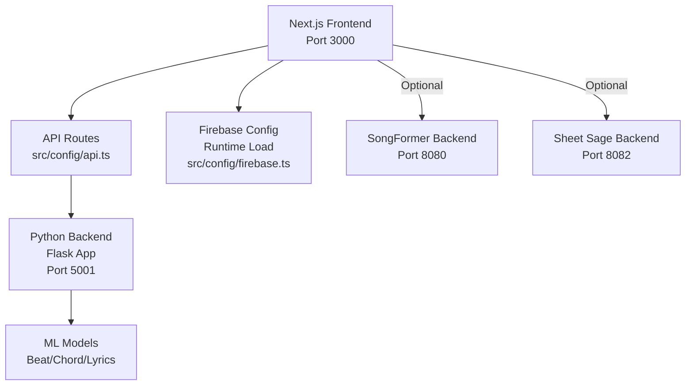

# Getting Started

<cite>
**Referenced Files in This Document**
- [README.md](file://README.md)
- [package.json](file://package.json)
- [python_backend/requirements.txt](file://python_backend/requirements.txt)
- [SongFormer/requirements.txt](file://SongFormer/requirements.txt)
- [python_backend/app.py](file://python_backend/app.py)
- [python_backend/config.py](file://python_backend/config.py)
- [python_backend/app_factory.py](file://python_backend/app_factory.py)
- [docker-compose.prod.yml](file://docker-compose.prod.yml)
- [docker/docker-compose.dev.yml](file://docker/docker-compose.dev.yml)
- [.env.docker.example](file://.env.docker.example)
- [scripts/start_python_backend.sh](file://scripts/start_python_backend.sh)
- [src/config/api.ts](file://src/config/api.ts)
- [src/config/firebase.ts](file://src/config/firebase.ts)
</cite>

## Table of Contents
1. [Introduction](#introduction)
2. [Prerequisites](#prerequisites)
3. [Quick Start](#quick-start)
4. [Development Environment](#development-environment)
5. [Production Environment](#production-environment)
6. [Environment Configuration](#environment-configuration)
7. [Backend Installation](#backend-installation)
8. [Frontend Startup](#frontend-startup)
9. [Optional Backends](#optional-backends)
10. [Verification](#verification)
11. [Relationship Between Frontend and Backend](#relationship-between-frontend-and-backend)
12. [Troubleshooting](#troubleshooting)
13. [Performance Considerations](#performance-considerations)
14. [Conclusion](#conclusion)

## Introduction
This guide helps you set up ChordMiniApp quickly for development and production. It covers prerequisites, step-by-step installation, environment configuration, backend and frontend startup, optional services, verification steps, and troubleshooting. The project consists of:
- A Next.js frontend (TypeScript) that communicates with a Python Flask backend for ML/audio processing.
- Optional standalone services for advanced features (SongFormer segmentation and Sheet Sage melody transcription).

## Prerequisites
Ensure your system meets the following requirements before starting:
- Node.js 20.9+ and npm 10+
- Python 3.10.x (3.10.16 recommended)
- Docker (recommended for optional services and production)
- Git LFS (required for large model files)
- Firebase account (free tier)
- Gemini API key (free tier)

These prerequisites are documented in the repository’s quick setup section.

**Section sources**
- [README.md:47-54](file://README.md#L47-L54)

## Quick Start
Follow these steps to get the app running locally:

1. Clone the repository with submodules and pull Git LFS objects.
2. Install frontend dependencies.
3. Configure environment variables.
4. Start the Python backend in a virtual environment.
5. Start the Next.js frontend.
6. Optionally start optional backends (SongFormer and/or Sheet Sage).
7. Open the application in your browser.

For detailed steps, refer to the sections below.

**Section sources**
- [README.md:55-189](file://README.md#L55-L189)

## Development Environment
Set up a local development environment with the frontend and backend running concurrently.

- Frontend runs on port 3000.
- Backend runs on port 5001 to avoid macOS AirTunes/AirPlay conflicts.

**Section sources**
- [README.md:165-168](file://README.md#L165-L168)
- [README.md:344-348](file://README.md#L344-L348)

## Production Environment
For production, use Docker Compose with pre-built images. The production stack includes:
- Frontend (Next.js)
- Backend (Python Flask)
- Optional: Redis for rate limiting

Important notes:
- The published images are linux/arm64; on Windows/x86_64, build local linux/amd64 images instead.
- Configure environment variables via .env.docker.

**Section sources**
- [README.md:192-238](file://README.md#L192-L238)
- [docker-compose.prod.yml:1-102](file://docker-compose.prod.yml#L1-L102)
- [.env.docker.example:1-119](file://.env.docker.example#L1-L119)

## Environment Configuration
Create and edit environment files for your setup.

- Local development: copy .env.example to .env.local and configure Firebase, YouTube, Gemini, Genius, and optional local backend URLs.
- Production: copy .env.docker.example to .env.docker and configure all required variables.

Key variables include:
- Firebase public keys and project identifiers
- YouTube, Gemini, Genius API keys
- Backend URLs (PYTHON_API_URL, SONGFORMER_API_URL, SHEETSAGE_API_URL)
- Audio strategy and streaming flags

**Section sources**
- [README.md:99-131](file://README.md#L99-L131)
- [.env.docker.example:1-119](file://.env.docker.example#L1-L119)

## Backend Installation
Install and run the Python backend in a virtual environment.

Steps:
1. Navigate to the python_backend directory.
2. Create a virtual environment.
3. Upgrade pip and install required packages (including Cython and numpy pinned to specific versions).
4. Install madmom from a specific Git source.
5. Install the rest of the requirements.
6. Start the Flask app on port 5001.

If dependency resolution fails (common on Windows), use WSL2/Ubuntu or Docker. You can also skip spleeter if you are not testing Beat-Transformer.

**Section sources**
- [README.md:136-164](file://README.md#L136-L164)
- [python_backend/requirements.txt:1-131](file://python_backend/requirements.txt#L1-L131)
- [scripts/start_python_backend.sh:1-68](file://scripts/start_python_backend.sh#L1-L68)

## Frontend Startup
Start the Next.js frontend in development mode.

- The frontend connects to the backend using the PYTHON_API_URL configured in .env.local.
- The frontend handles Firebase configuration dynamically via /api/config.

**Section sources**
- [README.md:165-168](file://README.md#L165-L168)
- [src/config/api.ts:13-25](file://src/config/api.ts#L13-L25)
- [src/config/firebase.ts:57-67](file://src/config/firebase.ts#L57-L67)

## Optional Backends
Optionally run additional services:

- SongFormer segmentation backend: build and run a Docker container exposing port 8080. The frontend will use LOCAL_SONGFORMER_API_URL if configured.
- Sheet Sage melody backend: build and run a Docker container exposing port 8082. The frontend will use LOCAL_SHEETSAGE_API_URL if configured.

**Section sources**
- [README.md:170-184](file://README.md#L170-L184)
- [SongFormer/requirements.txt:1-26](file://SongFormer/requirements.txt#L1-L26)

## Verification
After starting the services, verify the setup:

- Confirm the backend responds to health checks on port 5001.
- Ensure the frontend is reachable at http://localhost:3000.
- Validate Firebase configuration is loaded by the frontend.
- Test API routes for ML features (e.g., recognize chords) via the frontend.

**Section sources**
- [README.md:409-423](file://README.md#L409-L423)
- [src/config/api.ts:96-125](file://src/config/api.ts#L96-L125)

## Relationship Between Frontend and Backend
The frontend and backend communicate as follows:
- The frontend is a Next.js app that proxies ML/audio processing endpoints to the Python backend.
- API routes are centralized and distinguish between internal frontend endpoints and external backend endpoints.
- Firebase configuration is loaded at runtime from /api/config to support Docker deployments.

**Diagram sources**
- [src/config/api.ts:13-51](file://src/config/api.ts#L13-L51)
- [python_backend/app.py:180-186](file://python_backend/app.py#L180-L186)
- [src/config/firebase.ts:57-67](file://src/config/firebase.ts#L57-L67)

**Section sources**
- [src/config/api.ts:13-51](file://src/config/api.ts#L13-L51)
- [python_backend/app.py:180-186](file://python_backend/app.py#L180-L186)
- [src/config/firebase.ts:57-67](file://src/config/firebase.ts#L57-L67)

## Troubleshooting
Common issues and resolutions:

- Git LFS pull failures:
  - Ensure Git LFS is installed and initialized.
  - Re-run git lfs pull after cloning or updating submodules.
  - Verify that large model files were downloaded.

- Dependency resolution problems (Windows):
  - Native Windows backend installs are unreliable due to conflicting dependencies.
  - Use WSL2/Ubuntu or Docker for the backend.
  - If you must use Windows, consider skipping spleeter or installing dependencies with relaxed constraints as described in the repository.

- Backend connectivity:
  - Verify the backend is running on port 5001.
  - Check for port conflicts (macOS AirTunes/AirPlay on port 5000).
  - Confirm PYTHON_API_URL in .env.local points to http://localhost:5001.

- Frontend connection errors:
  - Restart both frontend and backend terminals.
  - Ensure CORS origins include http://localhost:3000.

- Production Docker images on Windows/x86_64:
  - Published images are linux/arm64; build local linux/amd64 images instead.
  - Update docker-compose.prod.yml to use your local images.

**Section sources**
- [README.md:73-82](file://README.md#L73-L82)
- [README.md:148-149](file://README.md#L148-L149)
- [README.md:447-490](file://README.md#L447-L490)
- [README.md:229-237](file://README.md#L229-L237)

## Performance Considerations
- Use Docker for production to ensure consistent environments and avoid platform-specific dependency issues.
- Pin Python versions and dependencies as specified in requirements.txt to maintain reproducibility.
- Consider Redis for rate limiting in production deployments.

[No sources needed since this section provides general guidance]

## Conclusion
You now have the essentials to set up ChordMiniApp locally and in production. Start with the prerequisites, clone with submodules, configure environment variables, install and run the backend in a virtual environment, then start the frontend. Use Docker for production and refer to the troubleshooting section for common issues.

[No sources needed since this section summarizes without analyzing specific files]