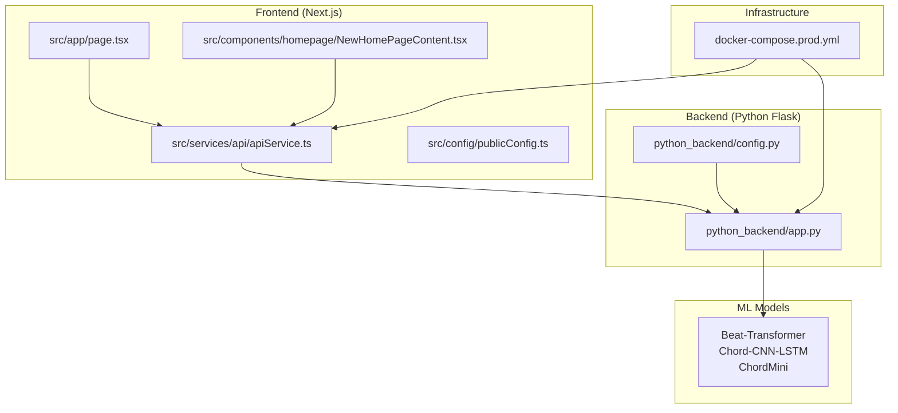
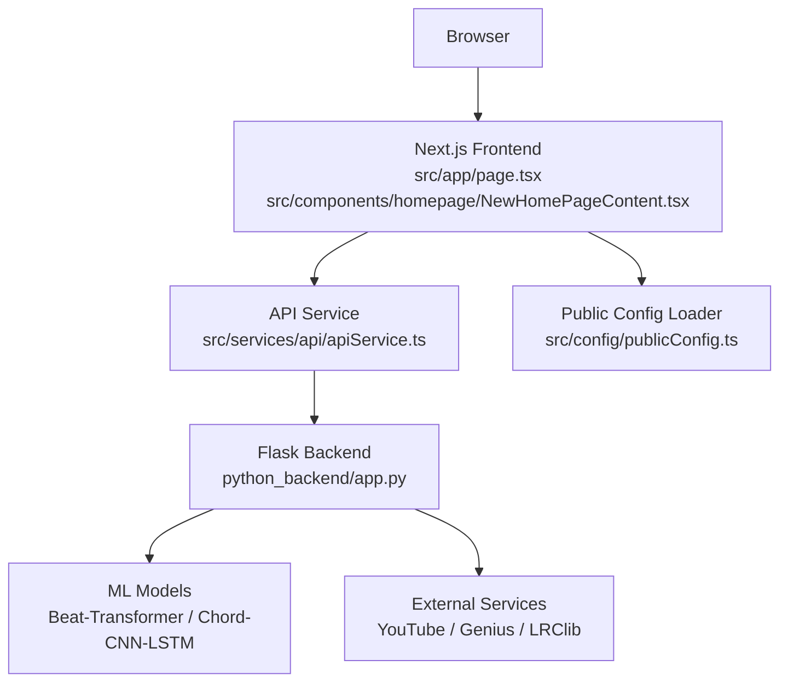
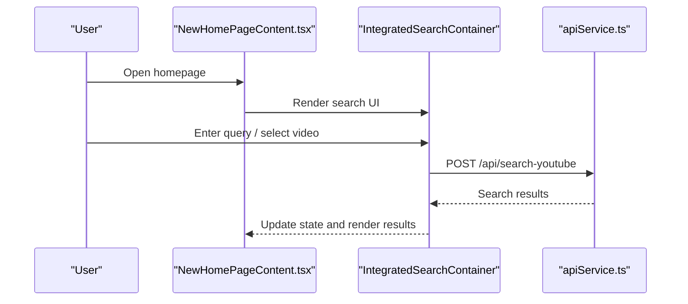
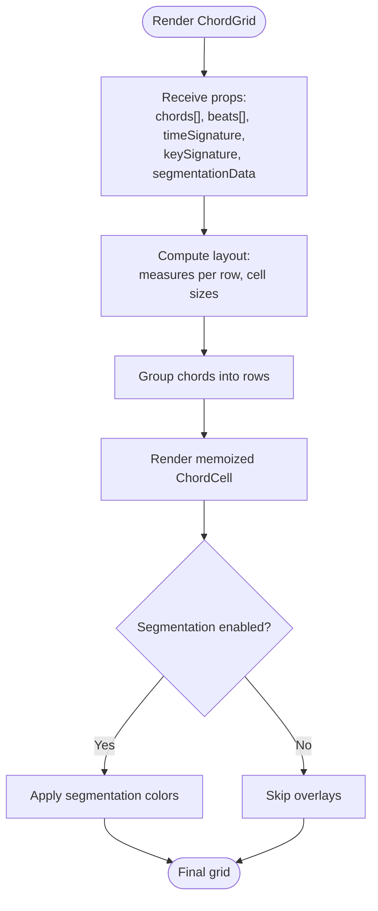
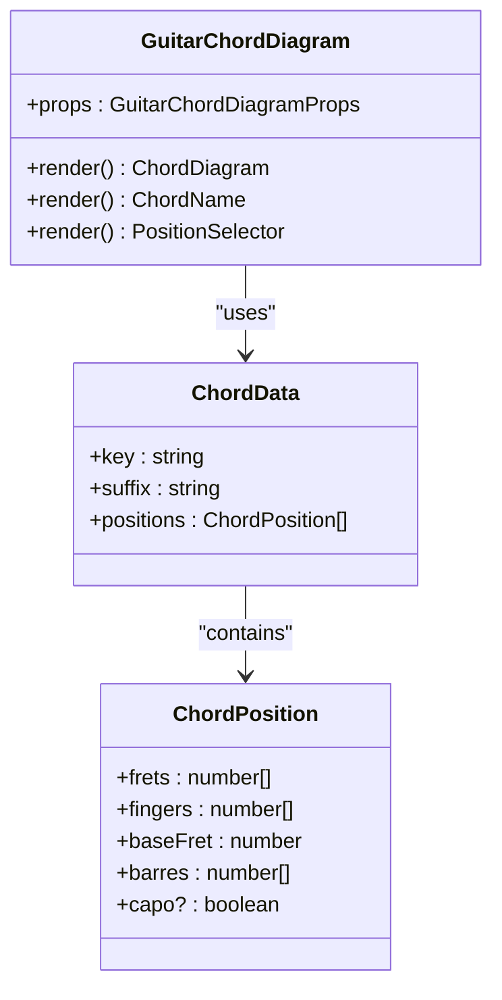
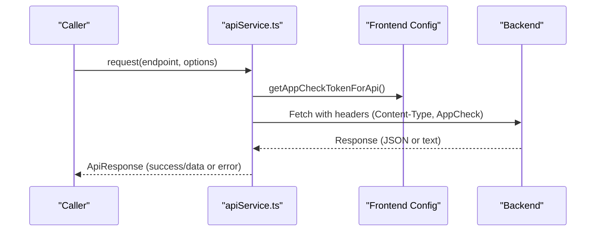
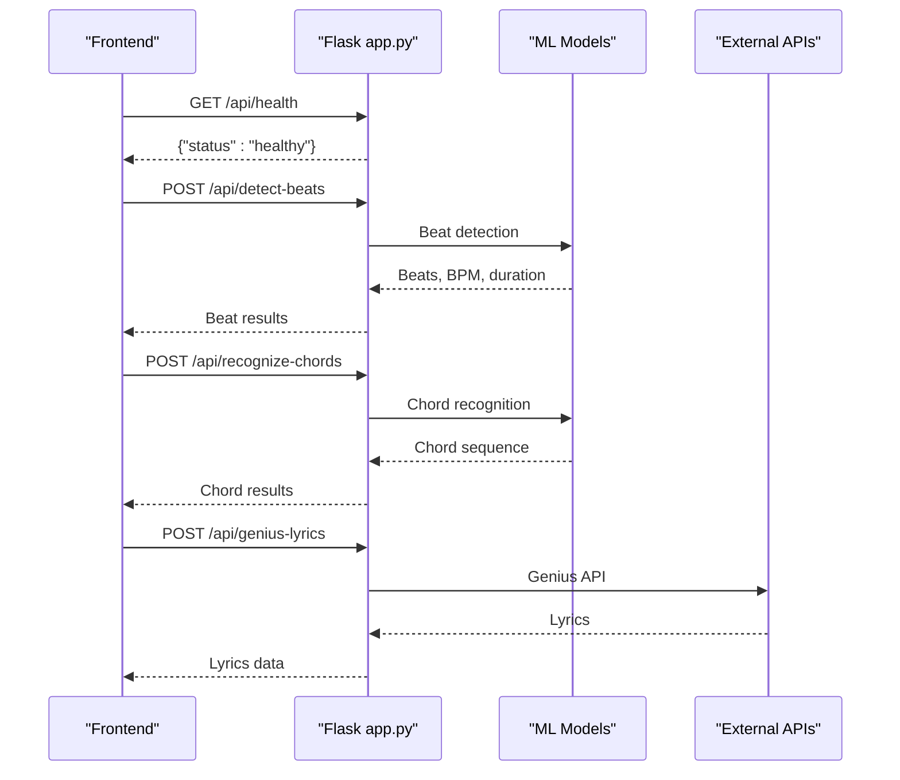
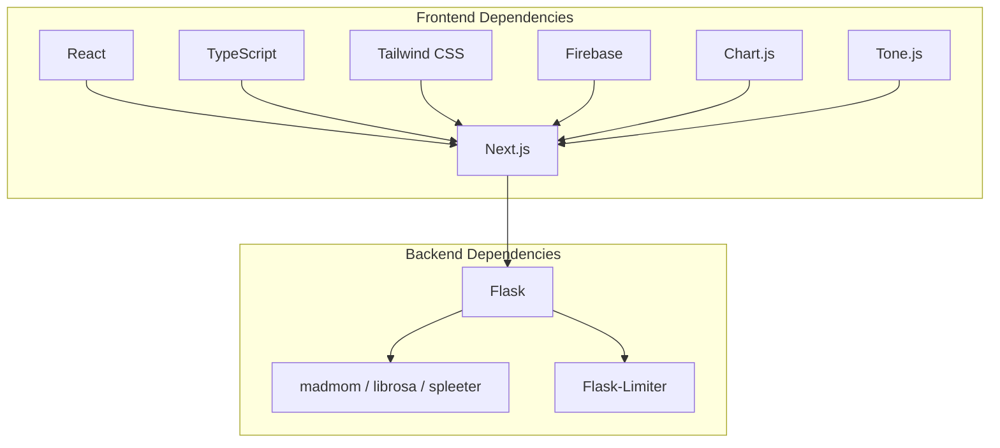

# Project Overview

<cite>
**Referenced Files in This Document**
- [README.md](file://README.md)
- [package.json](file://package.json)
- [next.config.js](file://next.config.js)
- [src/app/page.tsx](file://src/app/page.tsx)
- [src/components/homepage/NewHomePageContent.tsx](file://src/components/homepage/NewHomePageContent.tsx)
- [src/components/chord-analysis/ChordGrid.tsx](file://src/components/chord-analysis/ChordGrid.tsx)
- [src/components/piano-visualizer/PianoVisualizerTab.tsx](file://src/components/piano-visualizer/PianoVisualizerTab.tsx)
- [src/components/chord-playback/GuitarChordDiagram.tsx](file://src/components/chord-playback/GuitarChordDiagram.tsx)
- [src/services/api/apiService.ts](file://src/services/api/apiService.ts)
- [src/config/publicConfig.ts](file://src/config/publicConfig.ts)
- [python_backend/app.py](file://python_backend/app.py)
- [python_backend/README.md](file://python_backend/README.md)
- [python_backend/config.py](file://python_backend/config.py)
- [docker-compose.prod.yml](file://docker-compose.prod.yml)
</cite>

## Table of Contents
1. [Introduction](#introduction)
2. [Project Structure](#project-structure)
3. [Core Components](#core-components)
4. [Architecture Overview](#architecture-overview)
5. [Detailed Component Analysis](#detailed-component-analysis)
6. [Dependency Analysis](#dependency-analysis)
7. [Performance Considerations](#performance-considerations)
8. [Troubleshooting Guide](#troubleshooting-guide)
9. [Conclusion](#conclusion)

## Introduction
ChordMiniApp is an open-source music analysis platform designed to empower users with chord recognition, beat tracking, and music visualization. Its mission is to make music theory and analysis accessible to everyone—from casual listeners exploring their favorite songs to professional musicians and educators teaching harmony and composition. The platform integrates a modern Next.js frontend with a Python-based machine learning backend, delivering robust audio processing, real-time visualizations, and practical educational tools.

Key capabilities include:
- Homepage interface for YouTube search, URL input, and recent video access
- Beat and chord analysis with advanced features like Roman numeral analysis, key modulation signals, simplified chord notation, and song segmentation overlays
- Interactive guitar diagrams with accurate fingering patterns and synchronized beat grid integration
- Real-time piano visualizer with falling notes, scrolling chord strips, and MIDI export
- Lyrics synchronization and AI-assisted lead sheet features
- Experimental melody transcription via Sheet Sage

Target audiences span:
- Casual users who want to explore chord progressions and lyrics
- Students and educators seeking interactive music theory tools
- Amateur musicians practicing rhythm and harmony
- Professional musicians and researchers requiring precise beat/chord timing and export capabilities

## Project Structure
The project is organized into distinct layers:
- Frontend: Next.js application with TypeScript, React components, and a modular service layer
- Backend: Python Flask application serving ML endpoints and integrating external services
- Machine Learning: Pretrained models for beat tracking and chord recognition
- Infrastructure: Docker Compose for production deployment and environment configuration

**Diagram sources**
- [src/app/page.tsx:1-6](file://src/app/page.tsx#L1-L6)
- [src/components/homepage/NewHomePageContent.tsx:1-343](file://src/components/homepage/NewHomePageContent.tsx#L1-L343)
- [src/services/api/apiService.ts:1-407](file://src/services/api/apiService.ts#L1-L407)
- [src/config/publicConfig.ts:1-218](file://src/config/publicConfig.ts#L1-L218)
- [python_backend/app.py:1-186](file://python_backend/app.py#L1-L186)
- [python_backend/config.py:1-215](file://python_backend/config.py#L1-L215)
- [docker-compose.prod.yml:1-102](file://docker-compose.prod.yml#L1-L102)

**Section sources**
- [README.md:3-556](file://README.md#L3-L556)
- [package.json:1-135](file://package.json#L1-L135)
- [next.config.js:1-384](file://next.config.js#L1-L384)
- [docker-compose.prod.yml:1-102](file://docker-compose.prod.yml#L1-L102)

## Core Components
- Homepage and Search: The landing page provides integrated search, recent analyses, and feature showcases with dynamic components for hero demos and recent videos.
- Chord Grid: A responsive, performance-optimized grid displaying beats and chords with support for Roman numeral analysis, key modulation markers, and song segmentation overlays.
- Guitar Diagrams: Interactive chord diagrams leveraging a comprehensive chord database, with position selection, capo support, and synchronized focus indicators.
- Piano Visualizer: Real-time visualization with falling notes, scrolling chord strips, keyboard highlighting, and MIDI export for DAW integration.
- Lyrics Synchronization: Integration with Genius and LRClib for synchronized lyrics and translation support.
- API Layer: A typed, rate-limited API service with retry logic, timeouts, and App Check token injection for secure requests.
- Configuration Management: Runtime configuration loader enabling “build once, run anywhere” deployments via a public config endpoint.

Practical examples:
- Analyze a YouTube song: Enter a URL or search term, select a track, and view synchronized chord grids, guitar diagrams, and piano visualizer.
- Practice with loop playback: Select a loop range in the chord grid and play along with the metronome and chord playback.
- Export MIDI: Generate a MIDI file from the piano visualizer for use in DAWs and notation software.

**Section sources**
- [src/components/homepage/NewHomePageContent.tsx:1-343](file://src/components/homepage/NewHomePageContent.tsx#L1-L343)
- [src/components/chord-analysis/ChordGrid.tsx:1-831](file://src/components/chord-analysis/ChordGrid.tsx#L1-L831)
- [src/components/chord-playback/GuitarChordDiagram.tsx:1-364](file://src/components/chord-playback/GuitarChordDiagram.tsx#L1-L364)
- [src/components/piano-visualizer/PianoVisualizerTab.tsx:1-10](file://src/components/piano-visualizer/PianoVisualizerTab.tsx#L1-L10)
- [src/services/api/apiService.ts:1-407](file://src/services/api/apiService.ts#L1-L407)
- [src/config/publicConfig.ts:1-218](file://src/config/publicConfig.ts#L1-L218)

## Architecture Overview
The system follows a client-server architecture:
- Frontend (Next.js): Handles UI, routing, state, and API communication. It loads runtime configuration from the backend and manages user interactions.
- Backend (Python Flask): Exposes REST endpoints for beat detection, chord recognition, lyrics, and model availability. It integrates external services and ML models.
- Machine Learning: Beat-Transformer and Chord-CNN-LSTM models power beat and chord analysis. Additional experimental models (e.g., Sheet Sage) are available via optional services.
- Infrastructure: Docker Compose orchestrates frontend and backend containers, exposing ports and managing environment variables.

**Diagram sources**
- [src/app/page.tsx:1-6](file://src/app/page.tsx#L1-L6)
- [src/components/homepage/NewHomePageContent.tsx:1-343](file://src/components/homepage/NewHomePageContent.tsx#L1-L343)
- [src/services/api/apiService.ts:1-407](file://src/services/api/apiService.ts#L1-L407)
- [src/config/publicConfig.ts:1-218](file://src/config/publicConfig.ts#L1-L218)
- [python_backend/app.py:1-186](file://python_backend/app.py#L1-L186)

**Section sources**
- [python_backend/README.md:1-86](file://python_backend/README.md#L1-L86)
- [python_backend/config.py:1-215](file://python_backend/config.py#L1-L215)
- [docker-compose.prod.yml:1-102](file://docker-compose.prod.yml#L1-L102)

## Detailed Component Analysis

### Frontend: Homepage and Search
The homepage integrates a hero section with animated demonstrations, a split-screen layout showcasing beat/chord and piano visualizer previews, and a recent analyses section. It dynamically loads search components and supports sticky search behavior.

**Diagram sources**
- [src/components/homepage/NewHomePageContent.tsx:1-343](file://src/components/homepage/NewHomePageContent.tsx#L1-L343)
- [src/services/api/apiService.ts:1-407](file://src/services/api/apiService.ts#L1-L407)

**Section sources**
- [src/components/homepage/NewHomePageContent.tsx:1-343](file://src/components/homepage/NewHomePageContent.tsx#L1-L343)

### Frontend: Chord Grid and Visualizations
The chord grid component renders beats and chords with performance optimizations, including memoized cells, dynamic layout calculations, and optional segmentation overlays. It integrates with the piano visualizer and guitar diagrams for synchronized playback and editing.

**Diagram sources**
- [src/components/chord-analysis/ChordGrid.tsx:1-831](file://src/components/chord-analysis/ChordGrid.tsx#L1-L831)

**Section sources**
- [src/components/chord-analysis/ChordGrid.tsx:1-831](file://src/components/chord-analysis/ChordGrid.tsx#L1-L831)

### Frontend: Guitar Diagrams
The guitar chord diagram component displays accurate fingering patterns from a chord database, supports multiple positions, capo adjustments, and Roman numeral overlays.

**Diagram sources**
- [src/components/chord-playback/GuitarChordDiagram.tsx:1-364](file://src/components/chord-playback/GuitarChordDiagram.tsx#L1-L364)

**Section sources**
- [src/components/chord-playback/GuitarChordDiagram.tsx:1-364](file://src/components/chord-playback/GuitarChordDiagram.tsx#L1-L364)

### Frontend: API Service and Configuration
The API service encapsulates request logic with rate limiting, retries, timeouts, and App Check token injection. The public config loader enables runtime configuration for flexible deployments.

**Diagram sources**
- [src/services/api/apiService.ts:1-407](file://src/services/api/apiService.ts#L1-L407)
- [src/config/publicConfig.ts:1-218](file://src/config/publicConfig.ts#L1-L218)

**Section sources**
- [src/services/api/apiService.ts:1-407](file://src/services/api/apiService.ts#L1-L407)
- [src/config/publicConfig.ts:1-218](file://src/config/publicConfig.ts#L1-L218)

### Backend: Flask Application and Endpoints
The backend exposes health checks, model info, beat detection, chord recognition, lyrics retrieval, and YouTube search. It applies CORS, rate limiting, and environment-driven configuration.

**Diagram sources**
- [python_backend/app.py:1-186](file://python_backend/app.py#L1-L186)
- [python_backend/README.md:1-86](file://python_backend/README.md#L1-L86)
- [python_backend/config.py:1-215](file://python_backend/config.py#L1-L215)

**Section sources**
- [python_backend/app.py:1-186](file://python_backend/app.py#L1-L186)
- [python_backend/README.md:1-86](file://python_backend/README.md#L1-L86)
- [python_backend/config.py:1-215](file://python_backend/config.py#L1-L215)

## Dependency Analysis
Technology stack highlights:
- Frontend: Next.js 16+, React 19, TypeScript, Tailwind CSS, Firebase, Chart.js, Tone.js, react-player, and various UI libraries
- Backend: Python 3.10.x, Flask, madmom, librosa, spleeter, and rate limiting via Flask-Limiter
- Infrastructure: Docker, Docker Compose, and optional Redis for distributed rate limiting

**Diagram sources**
- [package.json:1-135](file://package.json#L1-L135)
- [python_backend/README.md:1-86](file://python_backend/README.md#L1-L86)

**Section sources**
- [package.json:1-135](file://package.json#L1-L135)
- [python_backend/README.md:1-86](file://python_backend/README.md#L1-L86)

## Performance Considerations
- Frontend performance: The chord grid employs memoization and dynamic layout calculations to minimize re-renders. The Next.js configuration includes bundle splitting, tree shaking, and optimized chunking for production.
- API latency: The API service sets generous timeouts for ML-heavy operations and includes retry logic and rate limiting to balance responsiveness and resource usage.
- Backend throughput: The Flask backend defines endpoint-specific rate limits and supports Redis-backed distributed rate limiting in production.

[No sources needed since this section provides general guidance]

## Troubleshooting Guide
Common issues and resolutions:
- Backend connectivity: Verify the backend is running on port 5001 (or configured port) and responds to health checks.
- Frontend connection errors: Ensure the frontend’s environment points to the correct backend URL and that CORS allows the frontend origin.
- Model availability: Confirm model directories are present and environment variables are set for optional features.
- Docker deployment: Use the provided Docker Compose configuration and ensure environment variables are correctly set for production.

**Section sources**
- [python_backend/README.md:447-490](file://python_backend/README.md#L447-L490)
- [README.md:447-490](file://README.md#L447-L490)

## Conclusion
ChordMiniApp delivers a comprehensive, open-source solution for music analysis and education. By combining a modern, responsive frontend with a robust Python backend and curated ML models, it serves diverse audiences with practical tools for learning, practice, and creative exploration. The project’s architecture supports flexible deployment, strong security posture, and ongoing community-driven enhancements.