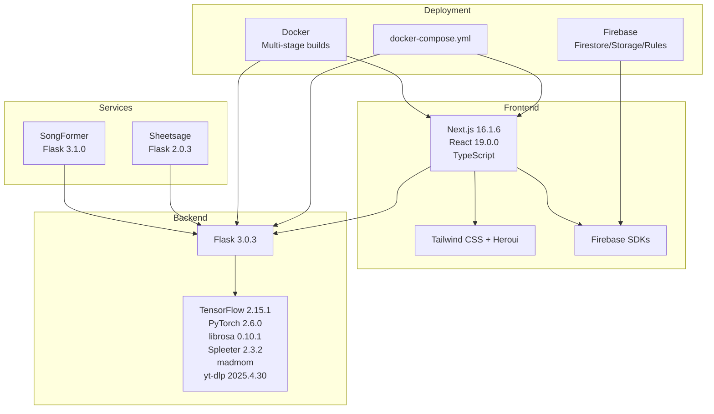
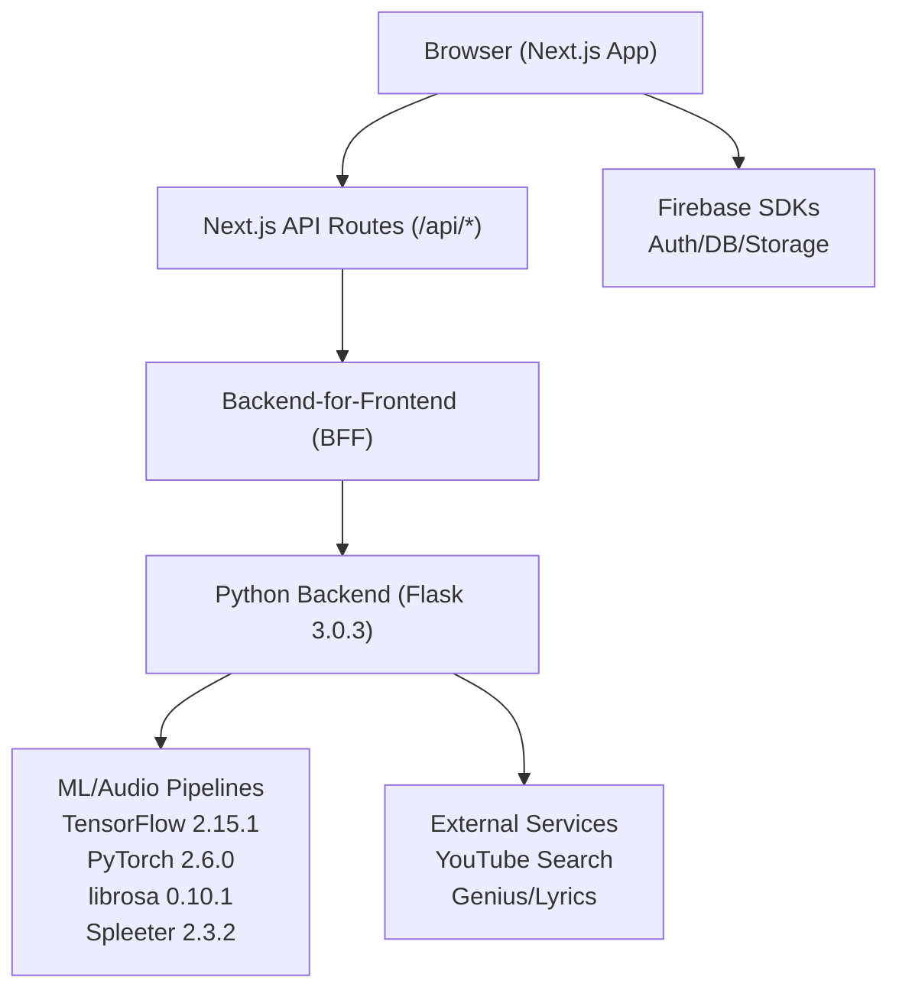
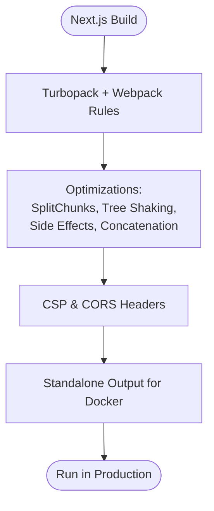
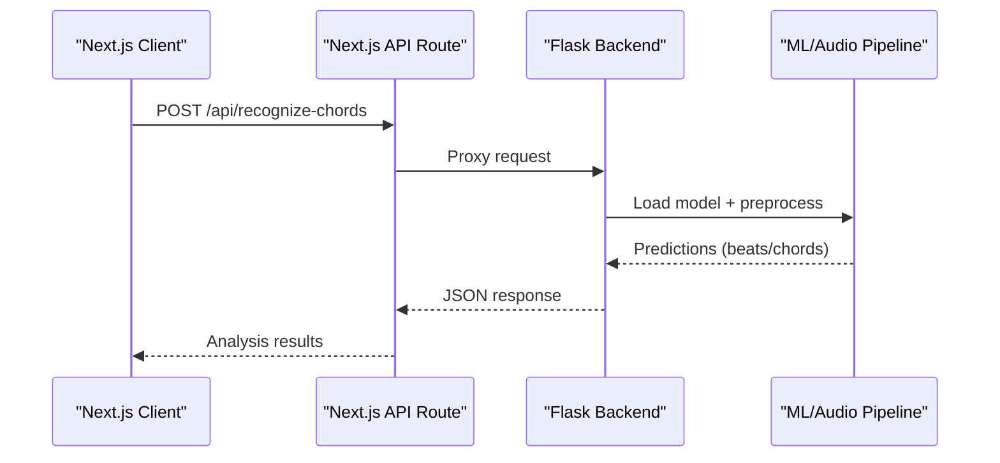
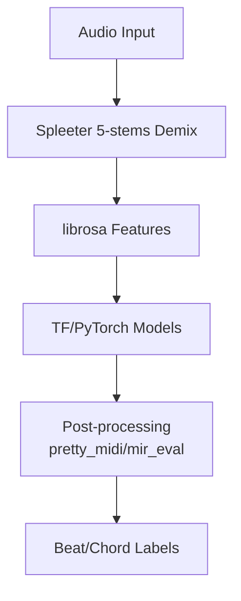
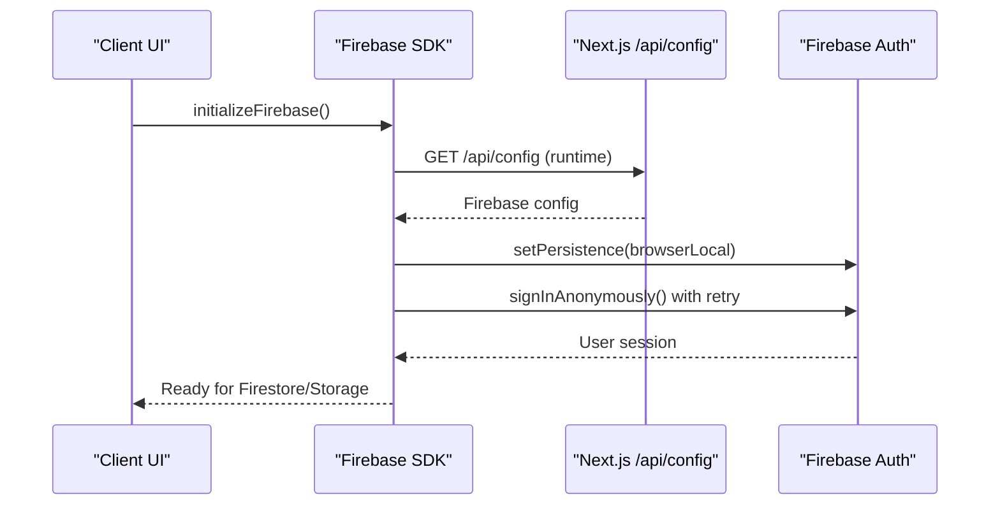
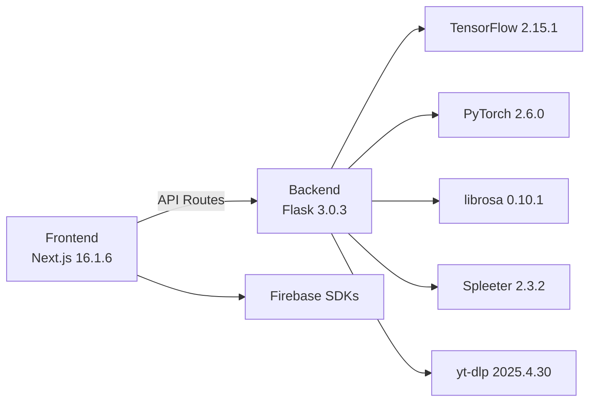

# Technology Stack

<cite>
**Referenced Files in This Document**
- [package.json](file://package.json)
- [next.config.js](file://next.config.js)
- [tsconfig.json](file://tsconfig.json)
- [tailwind.config.js](file://tailwind.config.js)
- [postcss.config.js](file://postcss.config.js)
- [Dockerfile](file://Dockerfile)
- [docker/docker-compose.yml](file://docker/docker-compose.yml)
- [python_backend/requirements.txt](file://python_backend/requirements.txt)
- [python_backend/app.py](file://python_backend/app.py)
- [python_backend/config.py](file://python_backend/config.py)
- [python_backend/Dockerfile](file://python_backend/Dockerfile)
- [SongFormer/requirements.txt](file://SongFormer/requirements.txt)
- [SongFormer/Dockerfile](file://SongFormer/Dockerfile)
- [sheetsage/requirements.txt](file://sheetsage/requirements.txt)
- [src/config/firebase.ts](file://src/config/firebase.ts)
- [src/config/api.ts](file://src/config/api.ts)
- [src/app/layout.tsx](file://src/app/layout.tsx)
- [firebase/firebase.json](file://firebase/firebase.json)
</cite>

## Table of Contents
1. [Introduction](#introduction)
2. [Project Structure](#project-structure)
3. [Core Components](#core-components)
4. [Architecture Overview](#architecture-overview)
5. [Detailed Component Analysis](#detailed-component-analysis)
6. [Dependency Analysis](#dependency-analysis)
7. [Performance Considerations](#performance-considerations)
8. [Troubleshooting Guide](#troubleshooting-guide)
9. [Conclusion](#conclusion)
10. [Appendices](#appendices)

## Introduction
This document describes the complete technology stack of ChordMiniApp, covering frontend, backend, machine learning, audio processing, build tooling, and deployment. It consolidates version requirements, compatibility constraints, and rationale for technology choices, and provides practical guidance for upgrades and maintaining compatibility across the full stack.

## Project Structure
The repository is organized into:
- Frontend (Next.js 16.1.6, React 19.0.0, TypeScript, Tailwind CSS)
- Python backend (Flask 3.0.3) with ML/audio libraries
- Standalone services (SongFormer, Sheetsage)
- Docker-based build and deployment
- Firebase configuration and rules

**Diagram sources**
- [package.json:37-88](file://package.json#L37-L88)
- [next.config.js:42-94](file://next.config.js#L42-L94)
- [python_backend/requirements.txt:18-111](file://python_backend/requirements.txt#L18-L111)
- [SongFormer/requirements.txt:3-26](file://SongFormer/requirements.txt#L3-L26)
- [sheetsage/requirements.txt:1-21](file://sheetsage/requirements.txt#L1-L21)
- [Dockerfile:1-87](file://Dockerfile#L1-L87)
- [python_backend/Dockerfile:1-116](file://python_backend/Dockerfile#L1-L116)
- [docker/docker-compose.yml:10-115](file://docker/docker-compose.yml#L10-L115)
- [firebase/firebase.json:1-10](file://firebase/firebase.json#L1-L10)

**Section sources**
- [package.json:1-135](file://package.json#L1-L135)
- [next.config.js:1-384](file://next.config.js#L1-L384)
- [python_backend/requirements.txt:1-131](file://python_backend/requirements.txt#L1-L131)
- [SongFormer/requirements.txt:1-26](file://SongFormer/requirements.txt#L1-L26)
- [sheetsage/requirements.txt:1-21](file://sheetsage/requirements.txt#L1-L21)
- [Dockerfile:1-87](file://Dockerfile#L1-L87)
- [python_backend/Dockerfile:1-116](file://python_backend/Dockerfile#L1-L116)
- [docker/docker-compose.yml:1-115](file://docker/docker-compose.yml#L1-L115)
- [firebase/firebase.json:1-10](file://firebase/firebase.json#L1-L10)

## Core Components
- Frontend framework and toolchain
  - Next.js 16.1.6, React 19.0.0, TypeScript 5.x, Tailwind CSS 3.3.3
  - Bundler: Turbopack (Next 16+ default)
  - Build-time analyzer and performance tuning
- Backend framework and ML stack
  - Flask 3.0.3 with CORS, rate limiting, Gunicorn
  - TensorFlow 2.15.1, PyTorch 2.6.0, librosa 0.10.1, Spleeter 2.3.2
  - madmom, yt-dlp 2025.4.30, pretty_midi, mir_eval, mido, requests, httpx
- Standalone services
  - SongFormer: Flask 3.1.0, PyTorch 2.2.2, transformers, safetensors
  - Sheetsage: Flask 2.0.3, madmom 0.16.1, librosa 0.7.2
- Infrastructure and deployment
  - Docker multi-stage builds, docker-compose for local dev
  - Firebase configuration and rules for Firestore/Storage

**Section sources**
- [package.json:37-133](file://package.json#L37-L133)
- [next.config.js:42-94](file://next.config.js#L42-L94)
- [tsconfig.json:1-43](file://tsconfig.json#L1-L43)
- [tailwind.config.js:1-194](file://tailwind.config.js#L1-L194)
- [python_backend/requirements.txt:18-111](file://python_backend/requirements.txt#L18-L111)
- [SongFormer/requirements.txt:3-26](file://SongFormer/requirements.txt#L3-L26)
- [sheetsage/requirements.txt:1-21](file://sheetsage/requirements.txt#L1-L21)
- [Dockerfile:1-87](file://Dockerfile#L1-L87)
- [python_backend/Dockerfile:1-116](file://python_backend/Dockerfile#L1-L116)
- [docker/docker-compose.yml:10-115](file://docker/docker-compose.yml#L10-L115)
- [firebase/firebase.json:1-10](file://firebase/firebase.json#L1-L10)

## Architecture Overview
High-level runtime architecture:
- Client (Next.js) communicates with backend services via API routes
- ML/audio processing handled by Flask backend with optional standalone services
- Firebase SDKs manage auth, Firestore, and Storage
- Docker containers encapsulate frontend and backend for production

**Diagram sources**
- [src/config/api.ts:15-51](file://src/config/api.ts#L15-L51)
- [python_backend/app.py:87-186](file://python_backend/app.py#L87-L186)
- [src/config/firebase.ts:1-537](file://src/config/firebase.ts#L1-L537)

**Section sources**
- [src/config/api.ts:15-51](file://src/config/api.ts#L15-L51)
- [python_backend/app.py:87-186](file://python_backend/app.py#L87-L186)
- [src/config/firebase.ts:1-537](file://src/config/firebase.ts#L1-L537)

## Detailed Component Analysis

### Frontend Technologies
- Next.js 16.1.6
  - Turbopack as default bundler; Webpack overrides for audio assets and external packages
  - Standalone output for Docker deployments
  - Security headers (CSP, COOP/COEP), image optimization, and performance optimizations
- React 19.0.0
  - Strict mode enabled; ES module resolution alias for TS/TSX
- TypeScript 5.x
  - ES2017 target, bundler module resolution, isolated modules, JSX runtime
- Tailwind CSS 3.3.3 + Heroui
  - Dark mode, theme variants, safelist for dynamic grid columns
- Modern web APIs and clients
  - axios, node-fetch, Tone.js, ffmpeg-static/fluent-ffmpeg, @ffmpeg/* for audio processing
  - Firebase SDKs for auth, Firestore, Storage, App Check

**Diagram sources**
- [next.config.js:198-344](file://next.config.js#L198-L344)

**Section sources**
- [next.config.js:42-94](file://next.config.js#L42-L94)
- [next.config.js:198-344](file://next.config.js#L198-L344)
- [tsconfig.json:1-43](file://tsconfig.json#L1-L43)
- [tailwind.config.js:1-194](file://tailwind.config.js#L1-L194)
- [postcss.config.js:1-7](file://postcss.config.js#L1-L7)
- [package.json:37-88](file://package.json#L37-L88)

### Backend Technologies (Flask 3.0.3)
- Core stack
  - Flask 3.0.3, Flask-CORS, Flask-Limiter, Gunicorn, python-dotenv
- Audio and ML libraries
  - librosa 0.10.1, soundfile, audioread, resampy, soxr, pydub
  - TensorFlow 2.15.1, PyTorch 2.6.0, protobuf
  - Spleeter 2.3.2, norbert, ffmpeg-python
  - madmom (patched for Python 3.10+), pretty_midi, mir_eval, mido
- Utilities and integrations
  - requests, httpx, Pillow, lyricsgenius, PyYAML, tqdm
  - yt-dlp 2025.4.30, pytube
- Runtime and packaging
  - Gunicorn workers, timeouts, max requests, health checks
  - Pre-downloaded Spleeter models in container cache

**Diagram sources**
- [src/config/api.ts:35-51](file://src/config/api.ts#L35-L51)
- [python_backend/app.py:87-186](file://python_backend/app.py#L87-L186)

**Section sources**
- [python_backend/requirements.txt:18-111](file://python_backend/requirements.txt#L18-L111)
- [python_backend/app.py:13-35](file://python_backend/app.py#L13-L35)
- [python_backend/Dockerfile:85-100](file://python_backend/Dockerfile#L85-L100)

### Machine Learning and Audio Processing Libraries
- TensorFlow 2.15.1 and PyTorch 2.6.0
  - TensorFlow for production; PyTorch CPU-only for inference
  - Protobuf pinned for compatibility
- librosa 0.10.1
  - Core audio feature extraction; pinned numpy/numba pairing for macOS x86_64
- Spleeter 2.3.2
  - 5-stems separation pipeline; pre-downloaded model cache in container
- madmom
  - DBN beat tracking; patched for Python 3.10+ compatibility
- yt-dlp 2025.4.30
  - Audio extraction and metadata retrieval
- External services
  - Genius/Lyrics, Google GenAI, Music.AI SDK

**Diagram sources**
- [python_backend/requirements.txt:29-54](file://python_backend/requirements.txt#L29-L54)
- [python_backend/requirements.txt:39-47](file://python_backend/requirements.txt#L39-L47)
- [python_backend/requirements.txt:59-63](file://python_backend/requirements.txt#L59-L63)
- [python_backend/requirements.txt:110-111](file://python_backend/requirements.txt#L110-L111)

**Section sources**
- [python_backend/requirements.txt:29-63](file://python_backend/requirements.txt#L29-L63)
- [python_backend/requirements.txt:110-111](file://python_backend/requirements.txt#L110-L111)

### Standalone Services
- SongFormer
  - Flask 3.1.0, PyTorch 2.2.2, transformers, safetensors
  - Gunicorn, sequential inference
- Sheetsage
  - Flask 2.0.3, madmom 0.16.1, librosa 0.7.2

**Section sources**
- [SongFormer/requirements.txt:3-26](file://SongFormer/requirements.txt#L3-L26)
- [SongFormer/Dockerfile:1-25](file://SongFormer/Dockerfile#L1-L25)
- [sheetsage/requirements.txt:1-21](file://sheetsage/requirements.txt#L1-L21)

### Firebase SDKs and Configuration
- Client-side initialization with runtime config loading
- Anonymous auth with retry logic and persistence
- App Check (reCAPTCHA v3) for client-side protection
- Firestore and Storage rules and indexes

**Diagram sources**
- [src/config/firebase.ts:43-115](file://src/config/firebase.ts#L43-L115)
- [src/config/firebase.ts:148-252](file://src/config/firebase.ts#L148-L252)
- [firebase/firebase.json:1-10](file://firebase/firebase.json#L1-L10)

**Section sources**
- [src/config/firebase.ts:1-537](file://src/config/firebase.ts#L1-L537)
- [firebase/firebase.json:1-10](file://firebase/firebase.json#L1-L10)

### Build Tools, Development Dependencies, and Deployment
- Frontend
  - Node >= 20.9.0, NPM >= 10
  - ESLint 10.x, Jest, Playwright, TailwindCSS, PostCSS, Autoprefixer
- Backend
  - Python 3.10.x (SongFormer pinned to 3.10.x)
- Docker
  - Multi-stage builds for Node and Python
  - yt-dlp and ffmpeg installed in runtime stage
  - Health checks and non-root users
- docker-compose
  - Local dev with linked frontend/backend
  - Environment propagation for Firebase, YouTube, and API keys

**Section sources**
- [package.json:33-133](file://package.json#L33-L133)
- [SongFormer/requirements.txt:1-2](file://SongFormer/requirements.txt#L1-L2)
- [Dockerfile:1-87](file://Dockerfile#L1-L87)
- [python_backend/Dockerfile:1-116](file://python_backend/Dockerfile#L1-L116)
- [docker/docker-compose.yml:10-115](file://docker/docker-compose.yml#L10-L115)

## Dependency Analysis
- Version compatibility highlights
  - Frontend: Next.js 16.1.6, React 19.0.0, TypeScript 5.x
  - Backend: Flask 3.0.3, Python 3.10.x
  - ML: TensorFlow 2.15.1, librosa 0.10.1, Spleeter 2.3.2, yt-dlp 2025.4.30
  - SongFormer: Python 3.10.x, Flask 3.1.0, PyTorch 2.2.2
- External integrations
  - YouTube Search, Genius, LRCLib, Google GenAI, Music.AI SDK
- Security and performance
  - CSP, COOP/COEP, image optimization, bundle analyzer, hidden source maps

**Diagram sources**
- [package.json:37-88](file://package.json#L37-L88)
- [python_backend/requirements.txt:18-111](file://python_backend/requirements.txt#L18-L111)
- [src/config/api.ts:15-51](file://src/config/api.ts#L15-L51)

**Section sources**
- [package.json:37-88](file://package.json#L37-L88)
- [python_backend/requirements.txt:18-111](file://python_backend/requirements.txt#L18-L111)
- [src/config/api.ts:15-51](file://src/config/api.ts#L15-L51)

## Performance Considerations
- Frontend
  - Turbopack + Webpack splitChunks for vendor/framework bundles
  - Hidden source maps in production; productionBrowserSourceMaps enabled
  - Image optimization and remote pattern allowlists
- Backend
  - Gunicorn sync workers with max requests and timeouts
  - Pre-downloaded Spleeter models to reduce cold-start latency
- Observability
  - Logging configuration and rate limiting
  - Health checks in Docker

[No sources needed since this section provides general guidance]

## Troubleshooting Guide
- Firebase initialization failures
  - Missing runtime config or invalid environment variables
  - Anonymous sign-in retry logic and error codes
- Backend model availability
  - Deferred checks at runtime; verify model directories and cache
- Docker health checks
  - Frontend: /api/health
  - Backend: root path
- CSP/COOP/COEP
  - Ensure domains in connect-src and frame-src lists match deployment targets

**Section sources**
- [src/config/firebase.ts:62-72](file://src/config/firebase.ts#L62-L72)
- [src/config/firebase.ts:200-252](file://src/config/firebase.ts#L200-L252)
- [python_backend/app.py:120-147](file://python_backend/app.py#L120-L147)
- [Dockerfile:82-86](file://Dockerfile#L82-L86)
- [python_backend/Dockerfile:105-107](file://python_backend/Dockerfile#L105-L107)
- [next.config.js:34-40](file://next.config.js#L34-L40)

## Conclusion
ChordMiniApp combines a modern, performance-focused frontend (Next.js 16.1.6, React 19.0.0, TypeScript, Tailwind) with a robust Python backend (Flask 3.0.3) leveraging TensorFlow and librosa for audio analysis, and Spleeter for stem separation. Docker-based deployment ensures reproducibility, while Firebase SDKs provide scalable auth and data services. The stack balances cutting-edge capabilities with pragmatic compatibility and maintainability.

[No sources needed since this section summarizes without analyzing specific files]

## Appendices

### Version Compatibility Matrix
- Frontend
  - Next.js: 16.1.6
  - React: 19.0.0
  - TypeScript: 5.x
  - Tailwind: 3.3.3
- Backend
  - Flask: 3.0.3
  - Python: 3.10.x
  - TensorFlow: 2.15.1
  - librosa: 0.10.1
  - Spleeter: 2.3.2
  - yt-dlp: 2025.4.30
- Standalone Services
  - SongFormer: Flask 3.1.0, PyTorch 2.2.2
  - Sheetsage: Flask 2.0.3, madmom 0.16.1, librosa 0.7.2

**Section sources**
- [package.json:37-88](file://package.json#L37-L88)
- [python_backend/requirements.txt:18-111](file://python_backend/requirements.txt#L18-L111)
- [SongFormer/requirements.txt:3-26](file://SongFormer/requirements.txt#L3-L26)
- [sheetsage/requirements.txt:1-21](file://sheetsage/requirements.txt#L1-L21)

### Upgrade Guidance
- Frontend
  - Increment TypeScript major only after verifying JSX runtime and bundler compatibility
  - Keep Next.js aligned with React 19; validate Webpack/Turbopack rules for audio assets
- Backend
  - Pin librosa + numba versions to avoid compilation issues on macOS x86_64
  - For TensorFlow/PyTorch, verify CUDA/cuDNN compatibility if GPU acceleration is desired
- ML Libraries
  - Update Spleeter and yt-dlp together; ensure model cache paths remain valid
- Firebase
  - Validate reCAPTCHA site key and App Check configuration when upgrading SDKs
- Docker
  - Rebuild with updated base images; verify health checks and non-root user permissions

[No sources needed since this section provides general guidance]