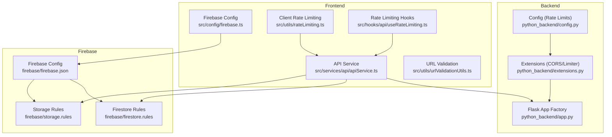
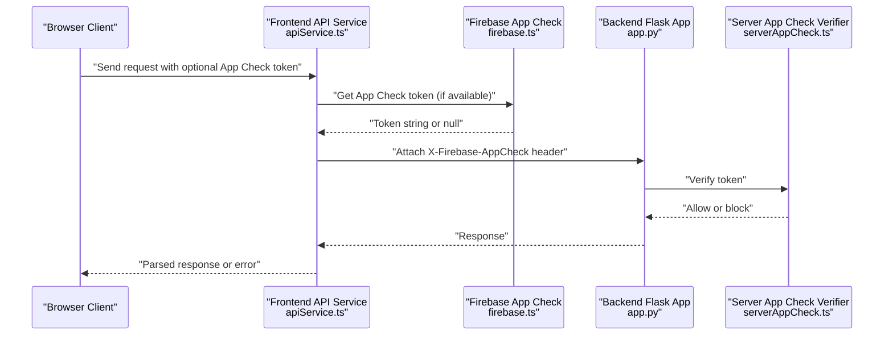
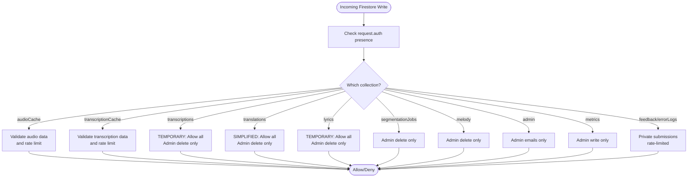
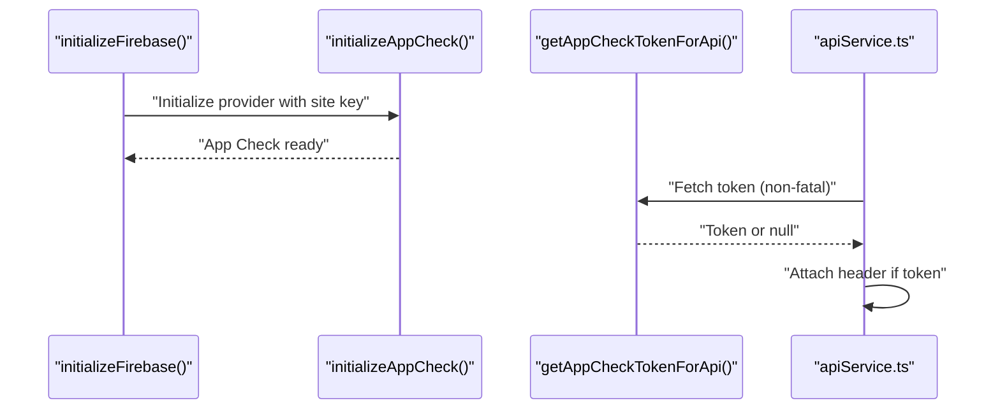
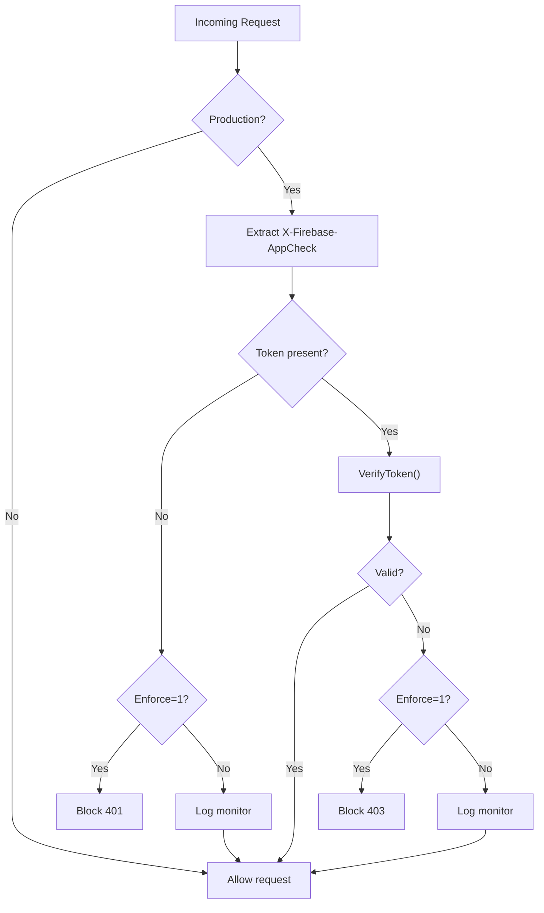
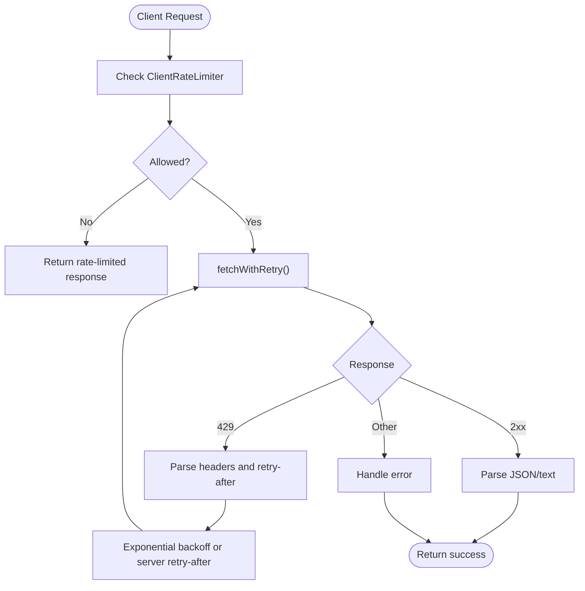
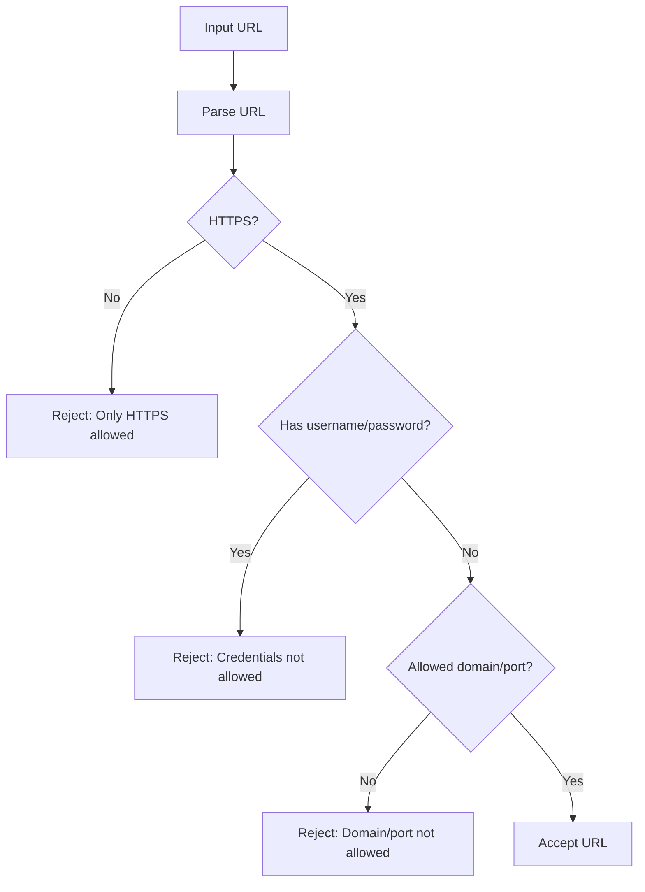
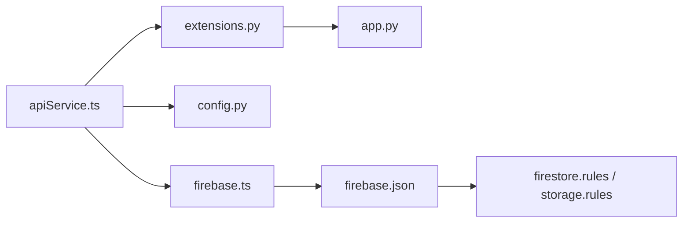

# Security and Privacy

<cite>
**Referenced Files in This Document**
- [firebase/firestore.rules](file://firebase/firestore.rules)
- [firebase/storage.rules](file://firebase/storage.rules)
- [firebase/firebase.json](file://firebase/firebase.json)
- [src/config/firebase.ts](file://src/config/firebase.ts)
- [src/utils/serverAppCheck.ts](file://src/utils/serverAppCheck.ts)
- [src/services/api/apiService.ts](file://src/services/api/apiService.ts)
- [src/hooks/api/useRateLimiting.ts](file://src/hooks/api/useRateLimiting.ts)
- [src/utils/rateLimiting.ts](file://src/utils/rateLimiting.ts)
- [python_backend/app.py](file://python_backend/app.py)
- [python_backend/extensions.py](file://python_backend/extensions.py)
- [python_backend/config.py](file://python_backend/config.py)
- [src/utils/urlValidationUtils.ts](file://src/utils/urlValidationUtils.ts)
- [src/app/privacy/page.tsx](file://src/app/privacy/page.tsx)
- [src/app/terms/page.tsx](file://src/app/terms/page.tsx)
- [src/app/api/config/route.ts](file://src/app/api/config/route.ts)
- [scripts/verify-firebase-audio-cors.mjs](file://scripts/verify-firebase-audio-cors.mjs)
</cite>

## Table of Contents
1. [Introduction](#introduction)
2. [Project Structure](#project-structure)
3. [Core Components](#core-components)
4. [Architecture Overview](#architecture-overview)
5. [Detailed Component Analysis](#detailed-component-analysis)
6. [Dependency Analysis](#dependency-analysis)
7. [Performance Considerations](#performance-considerations)
8. [Troubleshooting Guide](#troubleshooting-guide)
9. [Conclusion](#conclusion)
10. [Appendices](#appendices)

## Introduction
This document details the security and privacy measures implemented in ChordMiniApp. It covers authentication and authorization, data protection strategies, API security protocols, Firebase security rules, server-side protections (App Check, rate limiting, input validation), client-side security (secure communication, cookies, XSS), data handling (encryption, anonymization, secure deletion), compliance documentation (privacy policy, terms of service), security monitoring, and user rights.

## Project Structure
Security-related components span the frontend, backend, and Firebase infrastructure:
- Frontend: Firebase initialization, App Check integration, API service with rate limiting, environment-aware error handling, and CORS verification utilities.
- Backend: Flask application factory, CORS and rate limiting configuration, and environment-specific settings.
- Firebase: Firestore and Storage security rules enforcing access control, data validation, and permission management.

**Diagram sources**
- [src/config/firebase.ts:1-537](file://src/config/firebase.ts#L1-L537)
- [src/services/api/apiService.ts:1-407](file://src/services/api/apiService.ts#L1-L407)
- [src/utils/rateLimiting.ts:1-266](file://src/utils/rateLimiting.ts#L1-L266)
- [src/hooks/api/useRateLimiting.ts:1-322](file://src/hooks/api/useRateLimiting.ts#L1-L322)
- [python_backend/app.py:1-186](file://python_backend/app.py#L1-L186)
- [python_backend/extensions.py:1-93](file://python_backend/extensions.py#L1-L93)
- [python_backend/config.py:1-215](file://python_backend/config.py#L1-L215)
- [firebase/firebase.json:1-10](file://firebase/firebase.json#L1-L10)
- [firebase/firestore.rules:1-289](file://firebase/firestore.rules#L1-L289)
- [firebase/storage.rules:1-92](file://firebase/storage.rules#L1-L92)

**Section sources**
- [src/config/firebase.ts:1-537](file://src/config/firebase.ts#L1-L537)
- [src/services/api/apiService.ts:1-407](file://src/services/api/apiService.ts#L1-L407)
- [src/utils/rateLimiting.ts:1-266](file://src/utils/rateLimiting.ts#L1-L266)
- [src/hooks/api/useRateLimiting.ts:1-322](file://src/hooks/api/useRateLimiting.ts#L1-L322)
- [python_backend/app.py:1-186](file://python_backend/app.py#L1-L186)
- [python_backend/extensions.py:1-93](file://python_backend/extensions.py#L1-L93)
- [python_backend/config.py:1-215](file://python_backend/config.py#L1-L215)
- [firebase/firebase.json:1-10](file://firebase/firebase.json#L1-L10)
- [firebase/firestore.rules:1-289](file://firebase/firestore.rules#L1-L289)
- [firebase/storage.rules:1-92](file://firebase/storage.rules#L1-L92)

## Core Components
- Firebase initialization and App Check enforcement on the client and server.
- API service with client-side rate limiting and App Check token attachment.
- Server-side rate limiting via Flask-Limiter with Redis support.
- Firebase security rules for Firestore and Storage with validation and access control.
- URL validation utilities to prevent insecure inputs.
- Privacy and Terms pages outlining data practices and user rights.

**Section sources**
- [src/config/firebase.ts:1-537](file://src/config/firebase.ts#L1-L537)
- [src/utils/serverAppCheck.ts:1-122](file://src/utils/serverAppCheck.ts#L1-L122)
- [src/services/api/apiService.ts:1-407](file://src/services/api/apiService.ts#L1-L407)
- [python_backend/extensions.py:1-93](file://python_backend/extensions.py#L1-L93)
- [firebase/firestore.rules:1-289](file://firebase/firestore.rules#L1-L289)
- [firebase/storage.rules:1-92](file://firebase/storage.rules#L1-L92)
- [src/utils/urlValidationUtils.ts:58-85](file://src/utils/urlValidationUtils.ts#L58-L85)
- [src/app/privacy/page.tsx:1-146](file://src/app/privacy/page.tsx#L1-L146)
- [src/app/terms/page.tsx:1-176](file://src/app/terms/page.tsx#L1-L176)

## Architecture Overview
The security architecture integrates client-side Firebase App Check, server-side App Check verification, backend rate limiting, and Firebase security rules.

**Diagram sources**
- [src/services/api/apiService.ts:106-121](file://src/services/api/apiService.ts#L106-L121)
- [src/config/firebase.ts:522-536](file://src/config/firebase.ts#L522-L536)
- [src/utils/serverAppCheck.ts:76-121](file://src/utils/serverAppCheck.ts#L76-L121)
- [python_backend/app.py:15-25](file://python_backend/app.py#L15-L25)

## Detailed Component Analysis

### Firebase Security Rules (Firestore and Storage)
- Firestore rules define:
  - Helper functions for validating video IDs, timestamps, and data structures.
  - Collections with explicit read/write permissions, including admin-only deletions.
  - Basic rate-limiting helper and relaxed validation for cold-start scenarios.
  - Public reads for caching, restricted writes with validation, and admin-only deletes for sensitive collections.
- Storage rules define:
  - Audio/video content type validation and size limits.
  - Filename pattern enforcement requiring YouTube video ID inclusion.
  - Separate temp path for large uploads with stricter naming and cleanup.
  - Deny-by-default policy for other paths.

**Diagram sources**
- [firebase/firestore.rules:64-104](file://firebase/firestore.rules#L64-L104)
- [firebase/firestore.rules:106-121](file://firebase/firestore.rules#L106-L121)
- [firebase/firestore.rules:123-140](file://firebase/firestore.rules#L123-L140)
- [firebase/firestore.rules:159-194](file://firebase/firestore.rules#L159-L194)
- [firebase/firestore.rules:196-206](file://firebase/firestore.rules#L196-L206)
- [firebase/firestore.rules:208-218](file://firebase/firestore.rules#L208-L218)
- [firebase/firestore.rules:220-231](file://firebase/firestore.rules#L220-L231)
- [firebase/firestore.rules:233-242](file://firebase/firestore.rules#L233-L242)
- [firebase/firestore.rules:244-264](file://firebase/firestore.rules#L244-L264)

**Section sources**
- [firebase/firestore.rules:1-289](file://firebase/firestore.rules#L1-L289)
- [firebase/storage.rules:1-92](file://firebase/storage.rules#L1-L92)
- [firebase/firebase.json:1-10](file://firebase/firebase.json#L1-L10)

### Client-Side Authentication and App Check
- Firebase initialization supports runtime configuration loading and anonymous authentication with persistence and retry logic.
- App Check is initialized with reCAPTCHA v3 provider and attaches tokens to outgoing API requests.
- The App Check token is retrieved asynchronously and attached to the X-Firebase-AppCheck header.

**Diagram sources**
- [src/config/firebase.ts:475-536](file://src/config/firebase.ts#L475-L536)
- [src/services/api/apiService.ts:106-121](file://src/services/api/apiService.ts#L106-L121)

**Section sources**
- [src/config/firebase.ts:1-537](file://src/config/firebase.ts#L1-L537)
- [src/services/api/apiService.ts:1-407](file://src/services/api/apiService.ts#L1-L407)

### Server-Side App Check Verification
- The server verifies the X-Firebase-AppCheck header using firebase-admin/app-check.
- Behavior varies by environment and enforcement flag:
  - Non-production always allows.
  - Monitor mode logs failures but allows.
  - Enforced mode rejects missing or invalid tokens with 401/403.

**Diagram sources**
- [src/utils/serverAppCheck.ts:76-121](file://src/utils/serverAppCheck.ts#L76-L121)

**Section sources**
- [src/utils/serverAppCheck.ts:1-122](file://src/utils/serverAppCheck.ts#L1-L122)

### API Security Protocols and Rate Limiting
- Client-side:
  - ClientRateLimiter enforces per-endpoint limits.
  - fetchWithRetry handles 429 and retry logic with exponential backoff and jitter.
  - getRateLimitMessage provides user-friendly messages.
- Server-side:
  - Flask-Limiter with configurable storage (Redis or in-memory).
  - Configurable rate limits per endpoint category.
  - CORS configured centrally with support for multiple origins.

**Diagram sources**
- [src/utils/rateLimiting.ts:20-54](file://src/utils/rateLimiting.ts#L20-L54)
- [src/utils/rateLimiting.ts:120-187](file://src/utils/rateLimiting.ts#L120-L187)
- [src/utils/rateLimiting.ts:210-265](file://src/utils/rateLimiting.ts#L210-L265)
- [src/services/api/apiService.ts:74-83](file://src/services/api/apiService.ts#L74-L83)
- [src/services/api/apiService.ts:125-146](file://src/services/api/apiService.ts#L125-L146)
- [python_backend/extensions.py:17-93](file://python_backend/extensions.py#L17-L93)
- [python_backend/config.py:47-103](file://python_backend/config.py#L47-L103)

**Section sources**
- [src/utils/rateLimiting.ts:1-266](file://src/utils/rateLimiting.ts#L1-L266)
- [src/services/api/apiService.ts:1-407](file://src/services/api/apiService.ts#L1-L407)
- [python_backend/extensions.py:1-93](file://python_backend/extensions.py#L1-L93)
- [python_backend/config.py:1-215](file://python_backend/config.py#L1-L215)

### Input Validation and Secure Communication
- URL validation enforces HTTPS, disallows credentials, restricts domains and ports.
- CORS verification script helps ensure Firebase Storage CORS configuration is correct.
- Environment-aware error messages and safe timeout signals mitigate cross-environment issues.

**Diagram sources**
- [src/utils/urlValidationUtils.ts:58-85](file://src/utils/urlValidationUtils.ts#L58-L85)
- [scripts/verify-firebase-audio-cors.mjs:60-83](file://scripts/verify-firebase-audio-cors.mjs#L60-L83)

**Section sources**
- [src/utils/urlValidationUtils.ts:58-85](file://src/utils/urlValidationUtils.ts#L58-L85)
- [scripts/verify-firebase-audio-cors.mjs:60-83](file://scripts/verify-firebase-audio-cors.mjs#L60-L83)

### Data Handling Procedures
- Data transmission is secured via HTTPS.
- Firebase security rules enforce validation and access control for Firestore and Storage.
- Temporary file handling and cleanup are supported for large uploads in Storage temp path.
- Admin-only deletions for sensitive collections reduce accidental data loss.

**Section sources**
- [firebase/firestore.rules:1-289](file://firebase/firestore.rules#L1-L289)
- [firebase/storage.rules:1-92](file://firebase/storage.rules#L1-L92)
- [firebase/firebase.json:1-10](file://firebase/firebase.json#L1-L10)

### Compliance Documentation
- Privacy Policy outlines information collected, use, storage, security measures, third-party services, and user rights.
- Terms of Service describe research purpose, acceptable use, intellectual property, disclaimers, and data use.

**Section sources**
- [src/app/privacy/page.tsx:1-146](file://src/app/privacy/page.tsx#L1-L146)
- [src/app/terms/page.tsx:1-176](file://src/app/terms/page.tsx#L1-L176)

### Security Monitoring and Incident Response
- Monitor mode logs blocked requests without rejecting them.
- Enforcement mode blocks invalid tokens with explicit status codes.
- Environment-aware error messages assist in diagnosing production issues.
- CORS verification script aids in detecting misconfigurations.

**Section sources**
- [src/utils/serverAppCheck.ts:76-121](file://src/utils/serverAppCheck.ts#L76-L121)
- [src/utils/environmentUtils.ts:89-131](file://src/utils/environmentUtils.ts#L89-L131)
- [scripts/verify-firebase-audio-cors.mjs:60-83](file://scripts/verify-firebase-audio-cors.mjs#L60-L83)

### User Rights
- Privacy Policy documents rights including information about collected data, deletion of cached results, opting out of research data collection, and reporting privacy concerns.
- Terms of Service emphasize research and academic use, acceptable use guidelines, and disclaimers.

**Section sources**
- [src/app/privacy/page.tsx:124-138](file://src/app/privacy/page.tsx#L124-L138)
- [src/app/terms/page.tsx:40-94](file://src/app/terms/page.tsx#L40-L94)

## Dependency Analysis
Security components depend on:
- Firebase configuration and rules for data access control.
- Client-side App Check and server-side verification for API attestation.
- Centralized rate limiting configuration and enforcement.
- Environment-specific behavior for production vs development.

**Diagram sources**
- [src/services/api/apiService.ts:1-407](file://src/services/api/apiService.ts#L1-L407)
- [src/config/firebase.ts:1-537](file://src/config/firebase.ts#L1-L537)
- [python_backend/config.py:1-215](file://python_backend/config.py#L1-L215)
- [python_backend/extensions.py:1-93](file://python_backend/extensions.py#L1-L93)
- [python_backend/app.py:1-186](file://python_backend/app.py#L1-L186)
- [firebase/firebase.json:1-10](file://firebase/firebase.json#L1-L10)
- [firebase/firestore.rules:1-289](file://firebase/firestore.rules#L1-L289)
- [firebase/storage.rules:1-92](file://firebase/storage.rules#L1-L92)

**Section sources**
- [src/services/api/apiService.ts:1-407](file://src/services/api/apiService.ts#L1-L407)
- [src/config/firebase.ts:1-537](file://src/config/firebase.ts#L1-L537)
- [python_backend/config.py:1-215](file://python_backend/config.py#L1-L215)
- [python_backend/extensions.py:1-93](file://python_backend/extensions.py#L1-L93)
- [python_backend/app.py:1-186](file://python_backend/app.py#L1-L186)
- [firebase/firebase.json:1-10](file://firebase/firebase.json#L1-L10)
- [firebase/firestore.rules:1-289](file://firebase/firestore.rules#L1-L289)
- [firebase/storage.rules:1-92](file://firebase/storage.rules#L1-L92)

## Performance Considerations
- Client-side rate limiting prevents excessive requests and reduces server load.
- Exponential backoff with jitter mitigates thundering herd and improves resilience.
- Firebase security rules minimize unnecessary writes and enforce data size limits.
- App Check reduces bot traffic and protects APIs from abuse.

## Troubleshooting Guide
Common issues and resolutions:
- Missing App Check token in production:
  - Ensure NEXT_PUBLIC_RECAPTCHA_V3_SITE_KEY is configured and App Check initializes successfully.
  - In non-production, tokens are optional; verify environment detection.
- Rate limiting:
  - Client-side: Respect retry-after and reduce request frequency.
  - Server-side: Adjust Redis configuration or increase limits via environment variables.
- CORS errors for Firebase Storage:
  - Use the verification script to inspect headers and confirm allow-origin/methods/headers.
- Timeout errors:
  - Environment-aware messages indicate Vercel timeout limits or production server constraints.
  - Reduce file sizes or shorten processing windows.

**Section sources**
- [src/utils/serverAppCheck.ts:76-121](file://src/utils/serverAppCheck.ts#L76-L121)
- [src/utils/rateLimiting.ts:120-187](file://src/utils/rateLimiting.ts#L120-L187)
- [scripts/verify-firebase-audio-cors.mjs:60-83](file://scripts/verify-firebase-audio-cors.mjs#L60-L83)
- [src/utils/environmentUtils.ts:89-131](file://src/utils/environmentUtils.ts#L89-L131)

## Conclusion
ChordMiniApp implements a layered security approach combining Firebase security rules, client/server App Check, centralized rate limiting, input validation, and environment-aware error handling. While some collections use simplified validation for development, the system provides strong defaults and opt-in enforcement for production. Privacy and terms documentation outline user rights and data practices. Ongoing improvements should focus on tightening validation rules, enabling enforced rate limiting, and expanding monitoring coverage.

## Appendices
- API configuration endpoint restricts methods to GET and returns Method Not Allowed for others.

**Section sources**
- [src/app/api/config/route.ts:82-99](file://src/app/api/config/route.ts#L82-L99)