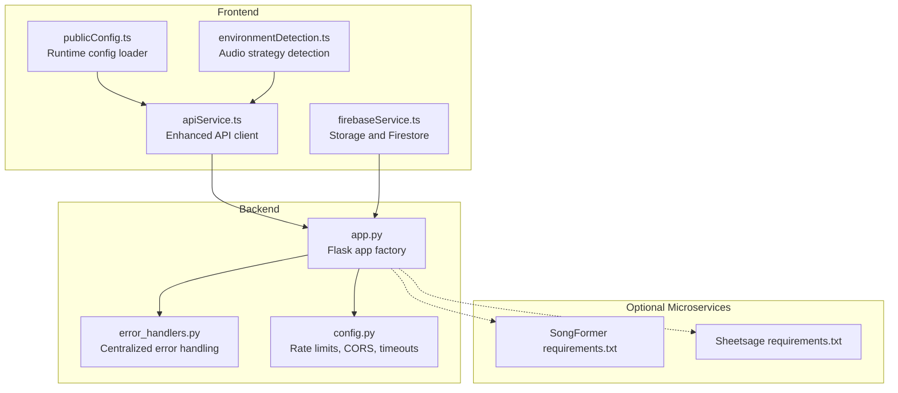
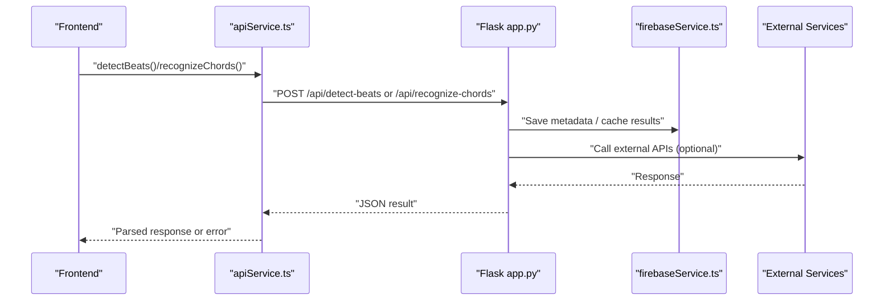
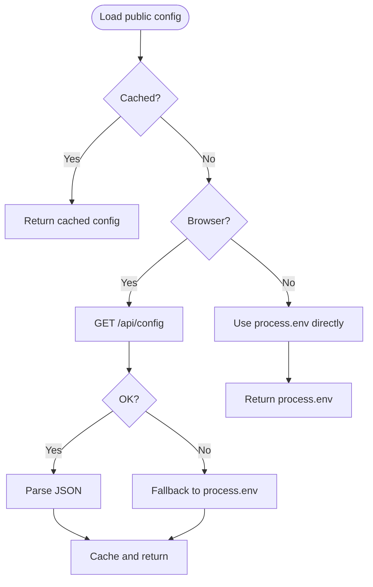
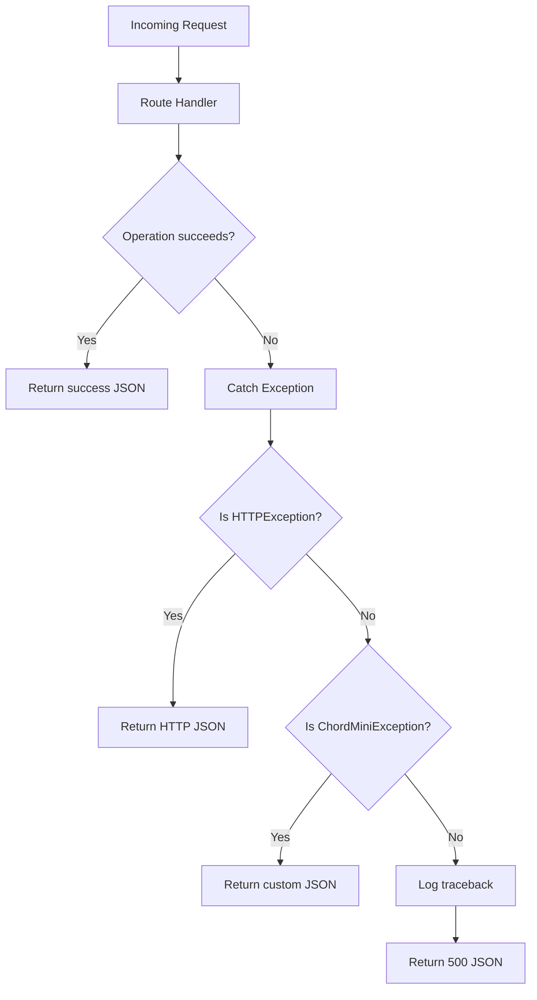
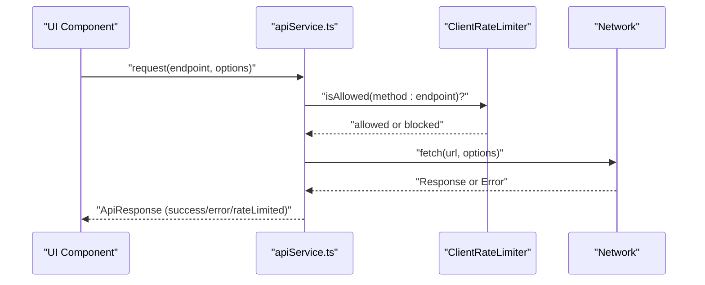
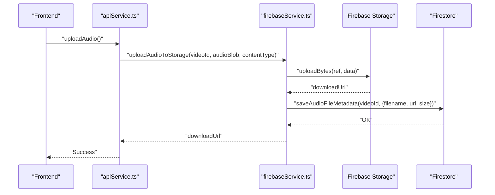
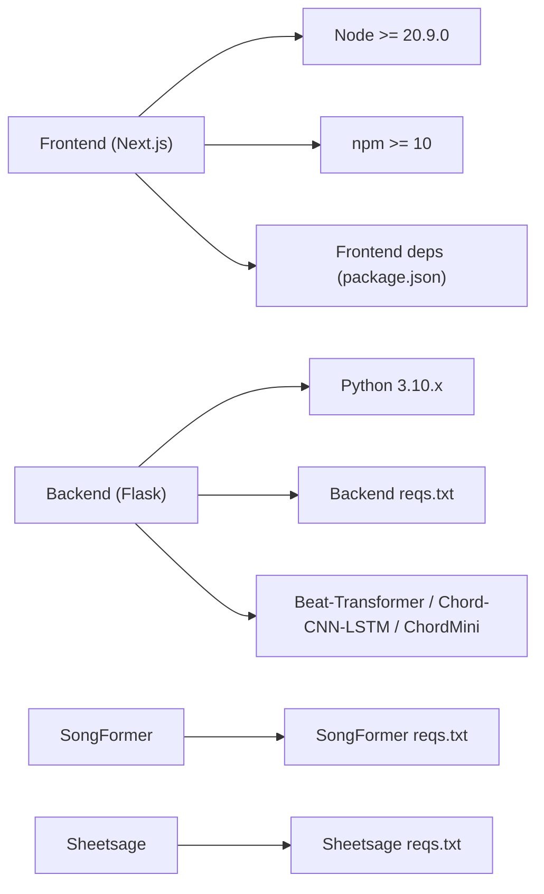

# Troubleshooting and FAQ

<cite>
**Referenced Files in This Document**
- [README.md](file://README.md)
- [CONTRIBUTING.md](file://CONTRIBUTING.md)
- [package.json](file://package.json)
- [python_backend/requirements.txt](file://python_backend/requirements.txt)
- [python_backend/app.py](file://python_backend/app.py)
- [python_backend/error_handlers.py](file://python_backend/error_handlers.py)
- [python_backend/config.py](file://python_backend/config.py)
- [src/config/publicConfig.ts](file://src/config/publicConfig.ts)
- [src/utils/environmentDetection.ts](file://src/utils/environmentDetection.ts)
- [src/services/api/apiService.ts](file://src/services/api/apiService.ts)
- [src/services/firebase/firebaseService.ts](file://src/services/firebase/firebaseService.ts)
- [src/utils/errorMessageUtils.ts](file://src/utils/errorMessageUtils.ts)
- [SongFormer/requirements.txt](file://SongFormer/requirements.txt)
- [sheetsage/requirements.txt](file://sheetsage/requirements.txt)
- [scripts/start-local-backend.sh](file://scripts/start-local-backend.sh)
- [scripts/start_python_backend.sh](file://scripts/start_python_backend.sh)
</cite>

## Table of Contents
1. [Introduction](#introduction)
2. [Project Structure](#project-structure)
3. [Core Components](#core-components)
4. [Architecture Overview](#architecture-overview)
5. [Detailed Component Analysis](#detailed-component-analysis)
6. [Dependency Analysis](#dependency-analysis)
7. [Performance Considerations](#performance-considerations)
8. [Troubleshooting Guide](#troubleshooting-guide)
9. [Conclusion](#conclusion)
10. [Appendices](#appendices)

## Introduction
This document provides comprehensive troubleshooting and FAQ guidance for ChordMiniApp. It covers installation and environment setup, dependency conflicts, platform-specific issues, performance tuning, model availability, integration problems (APIs, authentication, configuration), audio processing issues, debugging procedures for frontend, backend, and database connectivity, step-by-step resolution guides, platform-specific considerations, performance benchmarking guidance, and support resources including community forums, bug reporting, and escalation procedures.

## Project Structure
ChordMiniApp consists of:
- Frontend (Next.js) with runtime configuration loading and environment detection
- Python backend (Flask) with rate limiting, CORS, and error handling
- Optional microservices (SongFormer segmentation and Sheetsage melody)
- Firebase integration for storage and caching
- Scripts for local development and deployment

**Diagram sources**
- [src/config/publicConfig.ts:1-218](file://src/config/publicConfig.ts#L1-L218)
- [src/utils/environmentDetection.ts:1-84](file://src/utils/environmentDetection.ts#L1-L84)
- [src/services/api/apiService.ts:1-407](file://src/services/api/apiService.ts#L1-L407)
- [src/services/firebase/firebaseService.ts:1-156](file://src/services/firebase/firebaseService.ts#L1-L156)
- [python_backend/app.py:1-186](file://python_backend/app.py#L1-L186)
- [python_backend/error_handlers.py:1-161](file://python_backend/error_handlers.py#L1-L161)
- [python_backend/config.py:1-215](file://python_backend/config.py#L1-L215)
- [SongFormer/requirements.txt:1-26](file://SongFormer/requirements.txt#L1-L26)
- [sheetsage/requirements.txt:1-21](file://sheetsage/requirements.txt#L1-L21)

**Section sources**
- [README.md:1-556](file://README.md#L1-L556)
- [package.json:1-135](file://package.json#L1-L135)

## Core Components
- Frontend runtime configuration loader that fetches environment variables from the backend at runtime for “build once, run anywhere” Docker deployments.
- Environment detection utility that selects audio processing strategies based on URL and environment.
- Enhanced API service with client-side rate limiting, retry logic, timeouts, and user-friendly error handling.
- Centralized error handling in the backend with structured JSON responses and logging.
- Firebase service for storage and Firestore operations with metadata caching.
- Backend configuration managing CORS, rate limits, timeouts, and feature toggles.

**Section sources**
- [src/config/publicConfig.ts:1-218](file://src/config/publicConfig.ts#L1-L218)
- [src/utils/environmentDetection.ts:1-84](file://src/utils/environmentDetection.ts#L1-L84)
- [src/services/api/apiService.ts:1-407](file://src/services/api/apiService.ts#L1-L407)
- [python_backend/error_handlers.py:1-161](file://python_backend/error_handlers.py#L1-L161)
- [src/services/firebase/firebaseService.ts:1-156](file://src/services/firebase/firebaseService.ts#L1-L156)
- [python_backend/config.py:1-215](file://python_backend/config.py#L1-L215)

## Architecture Overview
High-level flow for audio extraction and analysis:
- Frontend detects environment and audio strategy, then calls backend endpoints.
- Backend performs beat detection, chord recognition, and caches results.
- Optional microservices (SongFormer, Sheetsage) can be used for advanced segmentation and melody transcription.
- Firebase stores audio metadata and caches results.

**Diagram sources**
- [src/services/api/apiService.ts:29-407](file://src/services/api/apiService.ts#L29-L407)
- [python_backend/app.py:1-186](file://python_backend/app.py#L1-L186)
- [src/services/firebase/firebaseService.ts:1-156](file://src/services/firebase/firebaseService.ts#L1-L156)

## Detailed Component Analysis

### Frontend Configuration and Environment Detection
- Runtime configuration loader supports fallback to process.env and caching to prevent duplicate requests.
- Environment detection selects audio processing strategy based on origin and manual override.

**Diagram sources**
- [src/config/publicConfig.ts:63-108](file://src/config/publicConfig.ts#L63-L108)

**Section sources**
- [src/config/publicConfig.ts:1-218](file://src/config/publicConfig.ts#L1-L218)
- [src/utils/environmentDetection.ts:1-84](file://src/utils/environmentDetection.ts#L1-L84)

### Backend Error Handling and Model Availability
- Centralized JSON error responses for HTTP exceptions and custom application exceptions.
- Structured logging and graceful degradation when models are unavailable.

**Diagram sources**
- [python_backend/error_handlers.py:13-161](file://python_backend/error_handlers.py#L13-L161)

**Section sources**
- [python_backend/error_handlers.py:1-161](file://python_backend/error_handlers.py#L1-L161)
- [python_backend/app.py:1-186](file://python_backend/app.py#L1-L186)

### API Service and Client-Side Rate Limiting
- Client-side rate limiter prevents overwhelming the backend.
- Retry logic, timeouts, and App Check token injection for secure requests.

**Diagram sources**
- [src/services/api/apiService.ts:29-407](file://src/services/api/apiService.ts#L29-L407)

**Section sources**
- [src/services/api/apiService.ts:1-407](file://src/services/api/apiService.ts#L1-L407)

### Firebase Storage and Firestore Operations
- Firestore caching for lyrics, audio metadata, and analysis results.
- Storage upload with metadata persistence.

**Diagram sources**
- [src/services/firebase/firebaseService.ts:132-153](file://src/services/firebase/firebaseService.ts#L132-L153)

**Section sources**
- [src/services/firebase/firebaseService.ts:1-156](file://src/services/firebase/firebaseService.ts#L1-L156)

## Dependency Analysis
- Frontend dependencies pinned via engines and overrides to ensure compatibility.
- Backend requirements specify pinned versions for audio processing, ML frameworks, and external tools.
- SongFormer and Sheetsage have separate requirements reflecting their specialized tasks.

**Diagram sources**
- [package.json:33-36](file://package.json#L33-L36)
- [python_backend/requirements.txt:1-131](file://python_backend/requirements.txt#L1-L131)
- [SongFormer/requirements.txt:1-26](file://SongFormer/requirements.txt#L1-L26)
- [sheetsage/requirements.txt:1-21](file://sheetsage/requirements.txt#L1-L21)

**Section sources**
- [package.json:1-135](file://package.json#L1-L135)
- [python_backend/requirements.txt:1-131](file://python_backend/requirements.txt#L1-L131)
- [SongFormer/requirements.txt:1-26](file://SongFormer/requirements.txt#L1-L26)
- [sheetsage/requirements.txt:1-21](file://sheetsage/requirements.txt#L1-L21)

## Performance Considerations
- Backend rate limiting and timeouts are configured per endpoint category.
- Frontend client-side rate limiting reduces redundant requests.
- Audio processing endpoints use generous timeouts to accommodate long files.
- Recommendations:
  - Use shorter audio files for faster processing.
  - Prefer direct upload for immediate processing when YouTube extraction is slow.
  - Monitor backend logs for latency spikes and adjust timeouts accordingly.
  - Consider caching frequently accessed results in Firestore.

[No sources needed since this section provides general guidance]

## Troubleshooting Guide

### Installation and Environment Setup
- Prerequisites and setup steps:
  - Node.js 20.9+, npm 10+, Python 3.10.x, Docker recommended, Git LFS for SongFormer checkpoints, Firebase account, Gemini API key.
  - Clone with submodules, pull Git LFS objects, install frontend dependencies.
  - Verify submodules for Beat-Transformer, Chord-CNN-LSTM, ChordMini.
  - Install FluidSynth for MIDI synthesis if chord recognition issues occur.
- Platform-specific notes:
  - Native Windows backend installs are unreliable due to conflicting dependencies; prefer WSL2/Ubuntu or Docker.
  - For Docker Desktop on Windows/x86_64, build local linux/amd64 images instead of pulling arm64 ones.

**Section sources**
- [README.md:45-135](file://README.md#L45-L135)
- [README.md:192-238](file://README.md#L192-L238)

### Dependency Conflicts
- ResolutionImpossible with spleeter, librosa, httpx, llvmlite:
  - Use WSL2/Ubuntu or Docker for the backend.
  - Skip spleeter during install if not testing Beat-Transformer.
  - Install spleeter and typer after main requirements with --no-deps for relaxed dependency chains.

**Section sources**
- [README.md:132-164](file://README.md#L132-L164)
- [python_backend/requirements.txt:1-131](file://python_backend/requirements.txt#L1-L131)

### Backend Connectivity and Port Issues
- Verify backend health endpoint and port 5001.
- Check for macOS AirTunes/AirPlay conflicts on port 5000.
- Confirm PYTHON_API_URL matches backend location.

**Section sources**
- [README.md:447-490](file://README.md#L447-L490)
- [python_backend/app.py:180-186](file://python_backend/app.py#L180-L186)

### Frontend Connection Errors
- Browser console errors like “Failed to fetch” indicate backend not running on port 5001.
- Restart both frontend and backend servers.

**Section sources**
- [README.md:468-481](file://README.md#L468-L481)

### Model Availability Issues
- Backend raises ModelUnavailableError when models are not available.
- Ensure submodules are populated and model directories exist.
- For SongFormer, verify Python 3.10.x runtime and pinned dependencies.

**Section sources**
- [python_backend/error_handlers.py:106-112](file://python_backend/error_handlers.py#L106-L112)
- [README.md:77-82](file://README.md#L77-L82)
- [SongFormer/requirements.txt:1-3](file://SongFormer/requirements.txt#L1-L3)

### Integration Problems (APIs, Authentication, Configuration)
- Firebase configuration must match .env.local/.env.docker.
- Enable Anonymous Authentication for local development.
- Verify CORS origins and rate limits.
- For production, configure CORS_ORIGINS and Redis for distributed rate limiting.

**Section sources**
- [README.md:265-318](file://README.md#L265-L318)
- [python_backend/config.py:32-60](file://python_backend/config.py#L32-L60)
- [python_backend/config.py:48-50](file://python_backend/config.py#L48-L50)

### Audio Processing Problems
- Unsupported formats or codec issues:
  - Use supported formats (MP3, WAV, FLAC).
  - Try direct upload for immediate processing.
- Timeout or large file issues:
  - Use shorter audio files.
  - Try official music videos rather than long live performances.

**Section sources**
- [README.md](file://README.md#L429)
- [src/utils/errorMessageUtils.ts:194-205](file://src/utils/errorMessageUtils.ts#L194-L205)

### Debugging Procedures
- Frontend:
  - Inspect browser console for network errors and CORS issues.
  - Use publicConfig.ts cache and fallback behavior to diagnose runtime config loading.
- Backend:
  - Check centralized error handler logs for detailed tracebacks.
  - Verify rate limit headers and retry-after values.
- Database (Firebase):
  - Confirm Firestore collections exist on first write.
  - Verify storage rules and temp folder cleanup configuration.

**Section sources**
- [src/config/publicConfig.ts:63-108](file://src/config/publicConfig.ts#L63-L108)
- [python_backend/error_handlers.py:61-91](file://python_backend/error_handlers.py#L61-L91)
- [README.md:283-318](file://README.md#L283-L318)

### Step-by-Step Resolution Guides

- Backend fails to start with dependency conflicts:
  1. Use WSL2/Ubuntu or Docker for the backend.
  2. If spleeter is not required, remove it from requirements and install without it.
  3. If required, install spleeter and typer after main requirements with --no-deps.
  4. Re-run backend startup.

- Frontend cannot connect to backend:
  1. Confirm backend is running on port 5001.
  2. Verify PYTHON_API_URL in .env.local.
  3. Check firewall and port conflicts (AirTunes on port 5000).
  4. Restart frontend and backend.

- Firebase storage unauthorized or temp folder issues:
  1. Enable Anonymous Authentication.
  2. Deploy storage.rules allowing temp uploads and cleanup.
  3. Set FIREBASE_SERVICE_ACCOUNT_KEY and FIREBASE_TEMP_CLEANUP_CRON.
  4. Verify temp folder exists and cleanup runs.

- Audio extraction fails with timeout or unsupported format:
  1. Try a shorter audio file (< 10 minutes).
  2. Use direct upload instead of YouTube extraction.
  3. Ensure supported audio formats (MP3, WAV, FLAC).
  4. Try official music videos.

- Model not available errors:
  1. Verify submodules are populated.
  2. Check model directories exist.
  3. Confirm backend logs for model loading errors.
  4. Reinstall dependencies with pinned versions.

**Section sources**
- [README.md:132-164](file://README.md#L132-L164)
- [README.md:447-490](file://README.md#L447-L490)
- [README.md:265-318](file://README.md#L265-L318)
- [src/utils/errorMessageUtils.ts:63-99](file://src/utils/errorMessageUtils.ts#L63-L99)
- [python_backend/error_handlers.py:106-112](file://python_backend/error_handlers.py#L106-L112)

### Platform-Specific Troubleshooting
- Windows:
  - Native backend installs are unreliable; prefer WSL2/Ubuntu or Docker.
  - Install FluidSynth for MIDI synthesis.
- macOS:
  - Avoid port 5000 conflicts with AirTunes/AirPlay.
  - Use Homebrew to install system dependencies.
- Linux:
  - Ensure apt-installed FluidSynth and compatible system libraries.

**Section sources**
- [README.md:132-135](file://README.md#L132-L135)
- [README.md:87-97](file://README.md#L87-L97)

### Performance Benchmarking Guidance
- Measure processing time for different audio lengths and formats.
- Compare YouTube extraction vs. direct upload performance.
- Monitor backend logs for latency and rate limit hits.
- Adjust timeouts and rate limits based on observed performance.

[No sources needed since this section provides general guidance]

### Support Resources and Escalation
- Community and contribution:
  - GitHub Discussions for questions and community discussions.
  - Issues for bug reports and feature requests.
  - Documentation and testing guidelines.
- Bug reporting:
  - Include environment, steps to reproduce, expected vs. actual, screenshots/videos, and console logs.
- Feature requests:
  - Describe use case, proposed solution, alternatives, and additional context.
- Escalation:
  - For critical issues, contact maintainers via repository channels and provide detailed logs and reproduction steps.

**Section sources**
- [CONTRIBUTING.md:100-121](file://CONTRIBUTING.md#L100-L121)
- [CONTRIBUTING.md:122-152](file://CONTRIBUTING.md#L122-L152)

## Conclusion
This guide consolidates installation, dependency, performance, model availability, integration, audio processing, and debugging troubleshooting for ChordMiniApp. By following the platform-specific recommendations, step-by-step resolutions, and leveraging the centralized error handling and configuration utilities, most issues can be resolved efficiently. For persistent problems, use the documented support channels and escalation procedures.

[No sources needed since this section summarizes without analyzing specific files]

## Appendices

### Quick Commands for Local Development
- Start Python backend:
  - [scripts/start-local-backend.sh](file://scripts/start-local-backend.sh)
  - [scripts/start_python_backend.sh](file://scripts/start_python_backend.sh)
- Verify backend health:
  - curl http://localhost:5001/health

**Section sources**
- [scripts/start-local-backend.sh](file://scripts/start-local-backend.sh)
- [scripts/start_python_backend.sh](file://scripts/start_python_backend.sh)
- [README.md:409-416](file://README.md#L409-L416)