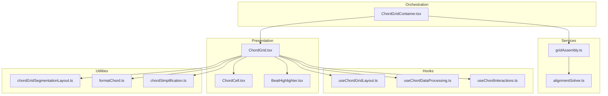
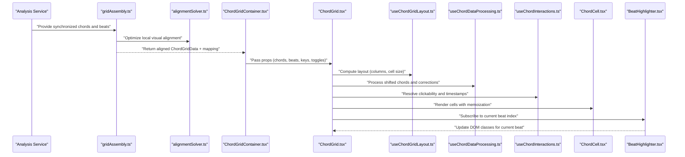
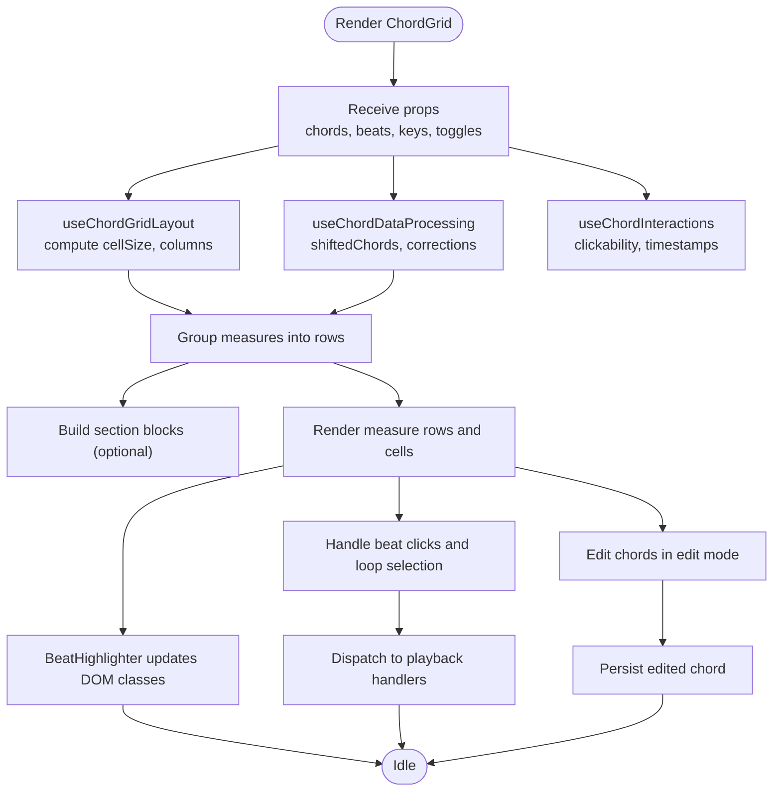
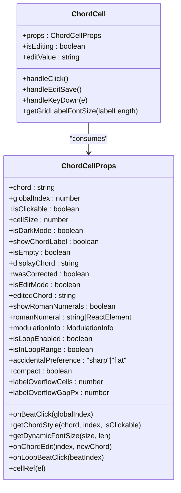
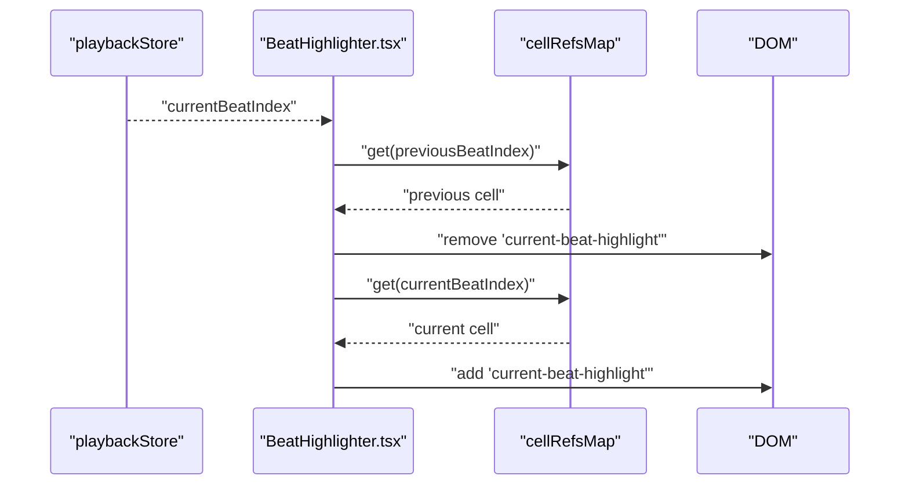
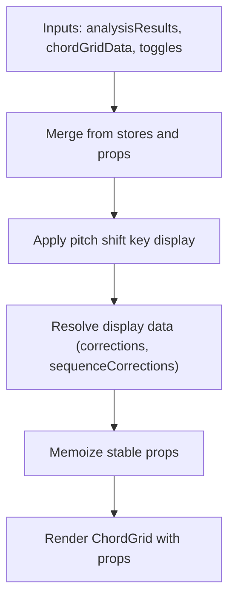
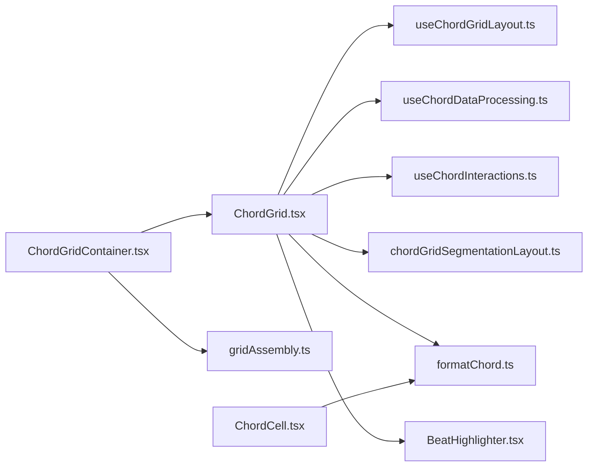

# Chord Analysis Interface

<cite>
**Referenced Files in This Document**
- [ChordGrid.tsx](file://src/components/chord-analysis/ChordGrid.tsx)
- [ChordGridContainer.tsx](file://src/components/chord-analysis/ChordGridContainer.tsx)
- [ChordCell.tsx](file://src/components/chord-analysis/ChordCell.tsx)
- [BeatHighlighter.tsx](file://src/components/chord-analysis/BeatHighlighter.tsx)
- [useChordGridLayout.ts](file://src/hooks/chord-analysis/useChordGridLayout.ts)
- [useChordDataProcessing.ts](file://src/hooks/chord-analysis/useChordDataProcessing.ts)
- [useChordInteractions.ts](file://src/hooks/chord-analysis/useChordInteractions.ts)
- [gridAssembly.ts](file://src/services/chord-analysis/gridAssembly.ts)
- [alignmentSolver.ts](file://src/services/chord-analysis/alignmentSolver.ts)
- [chordGridSegmentationLayout.ts](file://src/utils/chordGridSegmentationLayout.ts)
- [formatChord.ts](file://src/utils/chordFormatting/formatChord.ts)
- [chordSimplification.ts](file://src/utils/chordSimplification.ts)
</cite>

## Table of Contents
1. [Introduction](#introduction)
2. [Project Structure](#project-structure)
3. [Core Components](#core-components)
4. [Architecture Overview](#architecture-overview)
5. [Detailed Component Analysis](#detailed-component-analysis)
6. [Dependency Analysis](#dependency-analysis)
7. [Performance Considerations](#performance-considerations)
8. [Troubleshooting Guide](#troubleshooting-guide)
9. [Conclusion](#conclusion)

## Introduction
This document explains the chord analysis interface in ChordMiniApp, focusing on the chord grid system and related interactive features. It covers the ChordGrid layout algorithm, ChordCell interactive elements, ChordGridContainer orchestration, beat highlighting, chord progression visualization, grid interaction patterns, chord simplification toggle, Roman numeral conversion, key signature synchronization, responsive layout, touch interaction support, accessibility compliance, chord data binding, real-time updates, visual feedback systems, performance optimization for large sequences, memory management, and cross-browser compatibility. It also documents integration with analysis services and user customization options.

## Project Structure
The chord analysis interface is composed of:
- Presentation components: ChordGrid, ChordCell, BeatHighlighter, ChordGridHeader
- Orchestration: ChordGridContainer
- Hooks: useChordGridLayout, useChordDataProcessing, useChordInteractions
- Services: gridAssembly and alignmentSolver (analysis pipeline integration and visual beat alignment)
- Utilities: chordGridSegmentationLayout, chordFormatting/formatChord, chordSimplification

**Diagram sources**
- [ChordGrid.tsx:1-831](file://src/components/chord-analysis/ChordGrid.tsx#L1-L831)
- [ChordGridContainer.tsx:1-219](file://src/components/chord-analysis/ChordGridContainer.tsx#L1-L219)
- [ChordCell.tsx:1-357](file://src/components/chord-analysis/ChordCell.tsx#L1-L357)
- [BeatHighlighter.tsx:1-46](file://src/components/chord-analysis/BeatHighlighter.tsx#L1-L46)
- [useChordGridLayout.ts:1-124](file://src/hooks/chord-analysis/useChordGridLayout.ts#L1-L124)
- [useChordDataProcessing.ts:1-88](file://src/hooks/chord-analysis/useChordDataProcessing.ts#L1-L88)
- [useChordInteractions.ts:1-64](file://src/hooks/chord-analysis/useChordInteractions.ts#L1-L64)
- [gridAssembly.ts:1-320](file://src/services/chord-analysis/gridAssembly.ts#L1-L320)
- [alignmentSolver.ts:1-873](file://src/services/chord-analysis/alignmentSolver.ts#L1-L873)
- [chordGridSegmentationLayout.ts:1-179](file://src/utils/chordGridSegmentationLayout.ts#L1-L179)
- [formatChord.ts:1-327](file://src/utils/chordFormatting/formatChord.ts#L1-L327)
- [chordSimplification.ts:1-201](file://src/utils/chordSimplification.ts#L1-L201)

**Section sources**
- [ChordGrid.tsx:1-831](file://src/components/chord-analysis/ChordGrid.tsx#L1-L831)
- [ChordGridContainer.tsx:1-219](file://src/components/chord-analysis/ChordGridContainer.tsx#L1-L219)
- [ChordCell.tsx:1-357](file://src/components/chord-analysis/ChordCell.tsx#L1-L357)
- [BeatHighlighter.tsx:1-46](file://src/components/chord-analysis/BeatHighlighter.tsx#L1-L46)
- [useChordGridLayout.ts:1-124](file://src/hooks/chord-analysis/useChordGridLayout.ts#L1-L124)
- [useChordDataProcessing.ts:1-88](file://src/hooks/chord-analysis/useChordDataProcessing.ts#L1-L88)
- [useChordInteractions.ts:1-64](file://src/hooks/chord-analysis/useChordInteractions.ts#L1-L64)
- [gridAssembly.ts:1-237](file://src/services/chord-analysis/gridAssembly.ts#L1-L237)
- [chordGridSegmentationLayout.ts:1-179](file://src/utils/chordGridSegmentationLayout.ts#L1-L179)
- [formatChord.ts:1-327](file://src/utils/chordFormatting/formatChord.ts#L1-L327)
- [chordSimplification.ts:1-201](file://src/utils/chordSimplification.ts#L1-L201)

## Core Components
- ChordGrid: Renders the responsive chord grid, manages layout, segmentation, Roman numerals, and visual feedback. Implements aggressive memoization and efficient DOM caching for beat highlighting.
- ChordCell: Individual grid cell with chord display, editing, tooltips, and accessibility attributes. Optimized with a custom equality comparator and CSS-based highlighting.
- BeatHighlighter: Lightweight side-effect component that updates DOM classes for the current beat without triggering React re-renders.
- ChordGridContainer: Orchestrates data flow from analysis services and stores into ChordGrid, handles key signature display with pitch shift awareness, and merges UI toggles.
- Hooks:
  - useChordGridLayout: Computes responsive grid sizing, columns, and rows.
  - useChordDataProcessing: Applies chord shifting, occurrence mapping, and display logic with corrections.
  - useChordInteractions: Resolves timestamps and determines clickability for beat jumps.
- Services and Utilities:
  - gridAssembly: Builds aligned chord/beat sequences with padding, shift, solver output, and audio mapping.
  - alignmentSolver: Applies the production local visual-alignment optimization for gaps, silent runs, leading silence, and tempo transitions.
  - chordGridSegmentationLayout: Produces segmented blocks for color-coded sections.
  - formatChord: Formats chord labels with professional musical notation and symbols.
  - chordSimplification: Reduces chord labels to five basic types for display.

**Section sources**
- [ChordGrid.tsx:178-831](file://src/components/chord-analysis/ChordGrid.tsx#L178-L831)
- [ChordCell.tsx:115-357](file://src/components/chord-analysis/ChordCell.tsx#L115-L357)
- [BeatHighlighter.tsx:12-46](file://src/components/chord-analysis/BeatHighlighter.tsx#L12-L46)
- [ChordGridContainer.tsx:70-219](file://src/components/chord-analysis/ChordGridContainer.tsx#L70-L219)
- [useChordGridLayout.ts:8-124](file://src/hooks/chord-analysis/useChordGridLayout.ts#L8-L124)
- [useChordDataProcessing.ts:25-88](file://src/hooks/chord-analysis/useChordDataProcessing.ts#L25-L88)
- [useChordInteractions.ts:21-64](file://src/hooks/chord-analysis/useChordInteractions.ts#L21-L64)
- [gridAssembly.ts:157-237](file://src/services/chord-analysis/gridAssembly.ts#L157-L237)
- [chordGridSegmentationLayout.ts:48-179](file://src/utils/chordGridSegmentationLayout.ts#L48-L179)
- [formatChord.ts:47-327](file://src/utils/chordFormatting/formatChord.ts#L47-L327)
- [chordSimplification.ts:61-201](file://src/utils/chordSimplification.ts#L61-L201)

## Architecture Overview
The chord analysis interface follows a unidirectional data flow:
- Analysis services produce synchronized chords and beats.
- gridAssembly constructs aligned grid data with padding, shift, solver-based local alignment, and audio mapping.
- ChordGridContainer merges analysis results, UI toggles, and stores into ChordGrid.
- ChordGrid computes layout, renders rows/measures, and delegates cell rendering to ChordCell.
- BeatHighlighter updates DOM classes for the current beat using a cached ref map.
- Interactions resolve timestamps and delegate to playback handlers.

**Diagram sources**
- [gridAssembly.ts:157-237](file://src/services/chord-analysis/gridAssembly.ts#L157-L237)
- [ChordGridContainer.tsx:112-189](file://src/components/chord-analysis/ChordGridContainer.tsx#L112-L189)
- [ChordGrid.tsx:290-304](file://src/components/chord-analysis/ChordGrid.tsx#L290-L304)
- [useChordGridLayout.ts:47-75](file://src/hooks/chord-analysis/useChordGridLayout.ts#L47-L75)
- [useChordDataProcessing.ts:36-78](file://src/hooks/chord-analysis/useChordDataProcessing.ts#L36-L78)
- [useChordInteractions.ts:26-57](file://src/hooks/chord-analysis/useChordInteractions.ts#L26-L57)
- [ChordCell.tsx:115-357](file://src/components/chord-analysis/ChordCell.tsx#L115-L357)
- [BeatHighlighter.tsx:19-42](file://src/components/chord-analysis/BeatHighlighter.tsx#L19-L42)

## Detailed Component Analysis

### ChordGrid: Layout, Rendering, and Interaction
- Layout algorithm:
  - Responsive cell sizing computed from container width, time signature, and measures-per-row.
  - Dynamic columns and row grouping derived from layout config.
  - Optional segmentation rendering with color-coded blocks and measure bars.
- Rendering:
  - Memoized rows and section blocks to minimize re-renders.
  - Efficient cell creation with a ref cache keyed by global beat index.
  - Dynamic font sizing and label overflow handling for long chord strings.
- Interaction:
  - Beat click resolution via audio mapping or beat timestamps.
  - Loop selection and loop-range highlighting.
  - Edit mode support with controlled input and save-on-blur.
- Visual feedback:
  - CSS-based beat highlighting via BeatHighlighter.
  - Loop-range and modulation indicators.
  - Corrected chord highlighting and tooltip support.

**Diagram sources**
- [ChordGrid.tsx:290-304](file://src/components/chord-analysis/ChordGrid.tsx#L290-L304)
- [ChordGrid.tsx:347-397](file://src/components/chord-analysis/ChordGrid.tsx#L347-L397)
- [ChordGrid.tsx:414-509](file://src/components/chord-analysis/ChordGrid.tsx#L414-L509)
- [ChordGrid.tsx:546-619](file://src/components/chord-analysis/ChordGrid.tsx#L546-L619)
- [BeatHighlighter.tsx:19-42](file://src/components/chord-analysis/BeatHighlighter.tsx#L19-L42)
- [useChordInteractions.ts:26-57](file://src/hooks/chord-analysis/useChordInteractions.ts#L26-L57)

**Section sources**
- [ChordGrid.tsx:178-831](file://src/components/chord-analysis/ChordGrid.tsx#L178-L831)
- [useChordGridLayout.ts:47-123](file://src/hooks/chord-analysis/useChordGridLayout.ts#L47-L123)
- [useChordDataProcessing.ts:36-87](file://src/hooks/chord-analysis/useChordDataProcessing.ts#L36-L87)
- [useChordInteractions.ts:26-62](file://src/hooks/chord-analysis/useChordInteractions.ts#L26-L62)
- [BeatHighlighter.tsx:19-42](file://src/components/chord-analysis/BeatHighlighter.tsx#L19-L42)

### ChordCell: Interactive Elements and Accessibility
- Rendering:
  - Memoized via custom comparator excluding callbacks.
  - Dynamic font sizing and label overflow for long chord names.
  - Tooltip integration for chord and modulation info.
- Interaction:
  - Edit mode toggles input field; Enter saves, Escape cancels.
  - Loop mode selects loop range; normal mode triggers beat jump.
  - Keyboard support: Enter/Space activate clickable cells.
- Accessibility:
  - Role/button, tabIndex, and aria-label for screen readers.
  - Proper focus management and keyboard navigation.

**Diagram sources**
- [ChordCell.tsx:9-46](file://src/components/chord-analysis/ChordCell.tsx#L9-L46)
- [ChordCell.tsx:115-357](file://src/components/chord-analysis/ChordCell.tsx#L115-L357)

**Section sources**
- [ChordCell.tsx:115-357](file://src/components/chord-analysis/ChordCell.tsx#L115-L357)

### BeatHighlighter: Real-Time Highlighting Without Re-Renders
- Subscribes to the current beat index via store.
- Updates DOM classes directly using a cached Map<number, HTMLElement>.
- Prevents ChordGrid and ChordCell re-renders by avoiding React state updates.

**Diagram sources**
- [BeatHighlighter.tsx:19-42](file://src/components/chord-analysis/BeatHighlighter.tsx#L19-L42)

**Section sources**
- [BeatHighlighter.tsx:19-42](file://src/components/chord-analysis/BeatHighlighter.tsx#L19-L42)

### ChordGridContainer: Data Binding and UI Toggle Orchestration
- Merges analysis results, key signature, and UI toggles from stores.
- Applies pitch shift-aware key display (combines transposed note with original key quality).
- Resolves display data for corrections and Roman numerals.
- Memoizes stable props to prevent unnecessary re-renders.

**Diagram sources**
- [ChordGridContainer.tsx:90-189](file://src/components/chord-analysis/ChordGridContainer.tsx#L90-L189)
- [ChordGridContainer.tsx:200-216](file://src/components/chord-analysis/ChordGridContainer.tsx#L200-L216)

**Section sources**
- [ChordGridContainer.tsx:70-219](file://src/components/chord-analysis/ChordGridContainer.tsx#L70-L219)

### Layout and Responsiveness: useChordGridLayout
- Calculates measures-per-row, cell width, and grid columns based on container width, time signature, and panel visibility.
- Ensures minimum cell size for touch targets.
- Provides dynamic font sizing and grouped measure indices for layout.

**Section sources**
- [useChordGridLayout.ts:47-123](file://src/hooks/chord-analysis/useChordGridLayout.ts#L47-L123)

### Data Processing and Corrections: useChordDataProcessing
- Creates shifted chords with padding/shift alignment.
- Builds occurrence maps and correction maps for display.
- Generates display chord with optional corrections and sequence indexing.

**Section sources**
- [useChordDataProcessing.ts:36-87](file://src/hooks/chord-analysis/useChordDataProcessing.ts#L36-L87)

### Interaction Resolution: useChordInteractions
- Resolves timestamps from either original audio mapping or beat array.
- Determines clickability, allowing silent/padded cells as jump targets when a valid timestamp exists.

**Section sources**
- [useChordInteractions.ts:26-57](file://src/hooks/chord-analysis/useChordInteractions.ts#L26-L57)

### Analysis Pipeline Integration: gridAssembly and alignmentSolver
- Assembles aligned grid data with padding and shift.
- Builds original audio mapping for accurate beat click handling.
- Uses the segment alignment solver for production local visual alignment.
- Keeps the legacy visual compaction pipeline out of the UI path; it remains for comparison tests.

**Section sources**
- [gridAssembly.ts:157-237](file://src/services/chord-analysis/gridAssembly.ts#L157-L237)

### Segmentation Visualization: chordGridSegmentationLayout
- Converts measures into segmented blocks with contiguous regions.
- Resolves segment labels and produces visible cells with grid column offsets.

**Section sources**
- [chordGridSegmentationLayout.ts:48-179](file://src/utils/chordGridSegmentationLayout.ts#L48-L179)

### Chord Formatting and Symbols: formatChord
- Formats chord names with professional musical notation, Unicode accidentals, and superscript extensions.
- Handles inversions, altered notes, and parentheses consistently.
- Caches quarter rest symbols for performance.

**Section sources**
- [formatChord.ts:47-327](file://src/utils/chordFormatting/formatChord.ts#L47-L327)

### Chord Simplification Toggle
- A user-facing toggle button that reduces complex chord labels to five basic types (major, minor, augmented, diminished, suspended) for display, hiding complex extensions (e.g., 9ths, 11ths, 13ths) to make the progression easier to read for beginners.
- Preserves original enharmonic spelling and supports sequence corrections under the hood, ensuring that underlying playback and data modeling are unaffected.

**Section sources**
- [chordSimplification.ts:61-201](file://src/utils/chordSimplification.ts#L61-L201)

## Dependency Analysis
- ChordGrid depends on:
  - Hooks for layout, data processing, and interactions.
  - Utilities for formatting and segmentation.
  - BeatHighlighter for DOM-side highlighting.
- ChordGridContainer depends on:
  - Stores for analysis results, key signature, toggles.
  - gridAssembly for aligned grid data.
- ChordCell depends on:
  - Formatting utilities for chord display.
  - Accessibility and tooltip components.

**Diagram sources**
- [ChordGrid.tsx:14-25](file://src/components/chord-analysis/ChordGrid.tsx#L14-L25)
- [ChordGrid.tsx:290-304](file://src/components/chord-analysis/ChordGrid.tsx#L290-L304)
- [ChordGridContainer.tsx:5-11](file://src/components/chord-analysis/ChordGridContainer.tsx#L5-L11)
- [BeatHighlighter.tsx:3-4](file://src/components/chord-analysis/BeatHighlighter.tsx#L3-L4)

**Section sources**
- [ChordGrid.tsx:14-25](file://src/components/chord-analysis/ChordGrid.tsx#L14-L25)
- [ChordGrid.tsx:290-304](file://src/components/chord-analysis/ChordGrid.tsx#L290-L304)
- [ChordGridContainer.tsx:5-11](file://src/components/chord-analysis/ChordGridContainer.tsx#L5-L11)
- [BeatHighlighter.tsx:3-4](file://src/components/chord-analysis/BeatHighlighter.tsx#L3-L4)

## Performance Considerations
- Aggressive memoization:
  - ChordGrid and ChordCell use custom equality comparators to avoid re-renders on beat changes.
  - Stable props memoization in ChordGridContainer prevents unnecessary renders.
- DOM-level highlighting:
  - BeatHighlighter updates classes directly, bypassing React state churn.
- Ref caching:
  - Cell refs are cached by global beat index to avoid repeated DOM queries.
- Responsive layout:
  - ResizeObserver and layout calculations compute cell sizes efficiently.
- Large sequence optimization:
  - Grouped rows and segmented blocks reduce per-cell computation.
  - Dynamic font sizing and label overflow minimize layout thrashing.
- Cross-browser compatibility:
  - Uses standard DOM APIs and Tailwind classes; inline SVG caches mitigate rendering inconsistencies.

[No sources needed since this section provides general guidance]

## Troubleshooting Guide
- Beat highlighting not updating:
  - Verify BeatHighlighter receives a valid current beat index and that cellRefsMap is populated.
  - Ensure cells register refs via ChordGrid’s makeCellRef and that the cache is reset on prop changes.
- Clicks do nothing:
  - Confirm onBeatClick handler is provided and cells are marked clickable.
  - Check that timestamps resolve from original audio mapping or beats.
- Incorrect chord display after pitch shift:
  - Ensure key signature display combines transposed note with original key quality.
  - Verify original chords are passed for Roman numeral mapping to prevent misalignment.
- Segments not colored:
  - Confirm segmentationData is present and segments overlap with beat times.
  - Check that measuresPerRow and beatsPerMeasure align with the grid.

**Section sources**
- [BeatHighlighter.tsx:19-42](file://src/components/chord-analysis/BeatHighlighter.tsx#L19-L42)
- [ChordGrid.tsx:232-239](file://src/components/chord-analysis/ChordGrid.tsx#L232-L239)
- [useChordInteractions.ts:26-57](file://src/hooks/chord-analysis/useChordInteractions.ts#L26-L57)
- [ChordGridContainer.tsx:129-138](file://src/components/chord-analysis/ChordGridContainer.tsx#L129-L138)
- [chordGridSegmentationLayout.ts:48-147](file://src/utils/chordGridSegmentationLayout.ts#L48-L147)

## Conclusion
The chord analysis interface is built around a responsive, performant grid renderer with robust interaction and visual feedback. ChordGrid orchestrates layout, segmentation, and display while delegating data processing and interactions to specialized hooks. BeatHighlighter ensures smooth real-time updates without React re-renders. The system integrates tightly with analysis services and exposes user-facing toggles for chord simplification, Roman numerals, and segmentation. Accessibility and responsiveness are addressed through semantic markup, keyboard support, and adaptive layouts.

[No sources needed since this section summarizes without analyzing specific files]
