# Chord Playback Controls

<cite>
**Referenced Files in This Document**
- [ChordPlaybackManager.tsx](file://src/components/chord-playback/ChordPlaybackManager.tsx)
- [ChordPlaybackToggle.tsx](file://src/components/chord-playback/ChordPlaybackToggle.tsx)
- [MetronomeControls.tsx](file://src/components/chord-playback/MetronomeControls.tsx)
- [GuitarChordDiagram.tsx](file://src/components/chord-playback/GuitarChordDiagram.tsx)
- [PitchShiftAudioManager.tsx](file://src/components/chord-playback/PitchShiftAudioManager.tsx)
- [useChordPlayback.ts](file://src/hooks/chord-playback/useChordPlayback.ts)
- [audioMixerService.ts](file://src/services/chord-playback/audioMixerService.ts)
- [soundfontChordPlaybackService.ts](file://src/services/chord-playback/soundfontChordPlaybackService.ts)
- [metronomeService.ts](file://src/services/chord-playback/metronomeService.ts)
- [usePitchShiftAudio.ts](file://src/hooks/chord-playback/usePitchShiftAudio.ts)
- [grainPlayerPitchShiftService.ts](file://src/services/audio/grainPlayerPitchShiftService.ts)
- [youtubeMasterClock.ts](file://src/services/audio/youtubeMasterClock.ts)
- [pitchShiftServiceInstance.ts](file://src/services/audio/pitchShiftServiceInstance.ts)
- [audioContextManager.ts](file://src/services/audio/audioContextManager.ts)
- [instrumentRegistry.ts](file://src/services/chord-playback/soundfont/instrumentRegistry.ts)
- [useLoopPlayback.ts](file://src/hooks/chord-playback/useLoopPlayback.ts)
- [useMetronomeSync.ts](file://src/hooks/chord-playback/useMetronomeSync.ts)
- [performanceMonitor.ts](file://src/services/performance/performanceMonitor.ts)
</cite>

## Update Summary
**Changes Made**
- Resolved a YouTube iframe pre-play blackout bug by gating programmatic seeks behind a `hasUserActivatedPlayback` flag and queueing a `pendingSeekTimestamp` until the user starts playback.
- Added a `PlaybackPromptToast` component to provide a persistent, non-intrusive prompt guiding users to start video playback after 5 seconds of inactivity.
- Enhanced pitch shift audio system with improved scrub detection mechanism featuring 0.75-second threshold-based seek operations.
- Updated seek safety mechanisms with comprehensive diagnostic logging and improved feedback loop prevention.
- Refined slave re-anchor loop with enhanced drift correction and threshold-based synchronization.
- Improved threshold-based seek operations for better synchronization between audio playback and visual elements.
- Enhanced scrub detection algorithm with sophisticated jump magnitude analysis and automatic seek vs. anchor decisions.

## Table of Contents
1. [Introduction](#introduction)
2. [Project Structure](#project-structure)
3. [Core Components](#core-components)
4. [Architecture Overview](#architecture-overview)
5. [Detailed Component Analysis](#detailed-component-analysis)
6. [Dependency Analysis](#dependency-analysis)
7. [Performance Considerations](#performance-considerations)
8. [Troubleshooting Guide](#troubleshooting-guide)
9. [Conclusion](#conclusion)

## Introduction
This document describes the chord playback control system in ChordMiniApp, focusing on the ChordPlaybackManager architecture, ChordPlaybackToggle functionality, and MetronomeControls integration. It explains guitar chord diagram rendering, pitch shift audio management, and conditional playback controls. It also covers loop playback toggle, metronome synchronization, instrument selection mechanisms, chord playback state management, audio buffer handling, and real-time synchronization with visual elements. Technical implementation details include Web Audio API integration, soundfont loading, and audio mixing. Performance optimization strategies for real-time playback, latency reduction techniques, and browser audio compatibility are addressed, along with integration with the analysis workflow and user preference persistence.

**Updated** The system now features an enhanced pitch shift audio system with sophisticated scrub detection mechanism and threshold-based seek operations that provide superior synchronization between audio playback and visual elements, eliminating common synchronization issues and improving user experience.

## Project Structure
The chord playback system spans React components, hooks, services, and utilities:
- Components: ChordPlaybackManager, ChordPlaybackToggle, MetronomeControls, GuitarChordDiagram, PitchShiftAudioManager
- Hooks: useChordPlayback, usePitchShiftAudio, useLoopPlayback, useMetronomeSync
- Services: AudioMixerService, SoundfontChordPlaybackService, MetronomeService, GrainPlayerPitchShiftService, YoutubeMasterClock
- Utilities: AudioContextManager, Instrument Registry, Performance Monitor

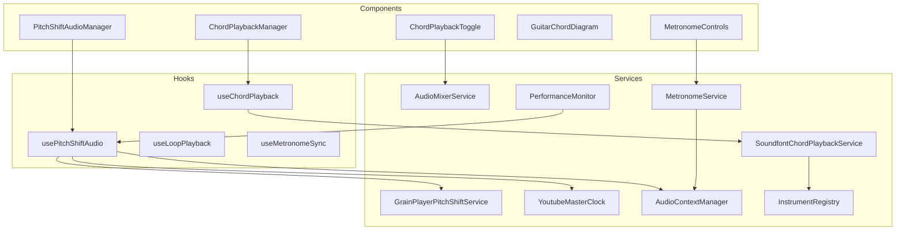
```mermaid
graph TB
subgraph "Components"
CPM["ChordPlaybackManager"]
CPT["ChordPlaybackToggle"]
MC["MetronomeControls"]
GCD["GuitarChordDiagram"]
PSAM["PitchShiftAudioManager"]
end
subgraph "Hooks"
UCP["useChordPlayback"]
UPSA["usePitchShiftAudio"]
ULP["useLoopPlayback"]
UMS["useMetronomeSync"]
end
subgraph "Services"
AMS["AudioMixerService"]
SCP["SoundfontChordPlaybackService"]
MS["MetronomeService"]
GPS["GrainPlayerPitchShiftService"]
YMC["YoutubeMasterClock"]
ACM["AudioContextManager"]
IR["InstrumentRegistry"]
PM["PerformanceMonitor"]
end
CPM --> UCP
CPT --> AMS
MC --> MS
PSAM --> UPSA
UPSA --> GPS
UPSA --> YMC
UCP --> SCP
SCP --> IR
UPSA --> ACM
MS --> ACM
PM --> UPSA
```

**Diagram sources**
- [ChordPlaybackManager.tsx:55-122](file://src/components/chord-playback/ChordPlaybackManager.tsx#L55-L122)
- [ChordPlaybackToggle.tsx:57-691](file://src/components/chord-playback/ChordPlaybackToggle.tsx#L57-L691)
- [MetronomeControls.tsx:12-135](file://src/components/chord-playback/MetronomeControls.tsx#L12-L135)
- [GuitarChordDiagram.tsx:99-361](file://src/components/chord-playback/GuitarChordDiagram.tsx#L99-L361)
- [PitchShiftAudioManager.tsx:29-35](file://src/components/chord-playback/PitchShiftAudioManager.tsx#L29-L35)
- [useChordPlayback.ts:250-738](file://src/hooks/chord-playback/useChordPlayback.ts#L250-L738)
- [audioMixerService.ts:39-370](file://src/services/chord-playback/audioMixerService.ts#L39-L370)
- [soundfontChordPlaybackService.ts:64-715](file://src/services/chord-playback/soundfontChordPlaybackService.ts#L64-L715)
- [metronomeService.ts:34-498](file://src/services/chord-playback/metronomeService.ts#L34-L498)
- [usePitchShiftAudio.ts:116-760](file://src/hooks/chord-playback/usePitchShiftAudio.ts#L116-L760)
- [grainPlayerPitchShiftService.ts:118-800](file://src/services/audio/grainPlayerPitchShiftService.ts#L118-L800)
- [youtubeMasterClock.ts:145-409](file://src/services/audio/youtubeMasterClock.ts#L145-L409)
- [audioContextManager.ts:8-124](file://src/services/audio/audioContextManager.ts#L8-L124)
- [instrumentRegistry.ts:7-120](file://src/services/chord-playback/soundfont/instrumentRegistry.ts#L7-L120)
- [performanceMonitor.ts:42-312](file://src/services/performance/performanceMonitor.ts#L42-L312)

**Section sources**
- [ChordPlaybackManager.tsx:1-123](file://src/components/chord-playback/ChordPlaybackManager.tsx#L1-L123)
- [ChordPlaybackToggle.tsx:1-694](file://src/components/chord-playback/ChordPlaybackToggle.tsx#L1-L694)
- [MetronomeControls.tsx:1-138](file://src/components/chord-playback/MetronomeControls.tsx#L1-L138)
- [GuitarChordDiagram.tsx:1-364](file://src/components/chord-playback/GuitarChordDiagram.tsx#L1-L364)
- [PitchShiftAudioManager.tsx:1-39](file://src/components/chord-playback/PitchShiftAudioManager.tsx#L1-L39)
- [useChordPlayback.ts:1-739](file://src/hooks/chord-playback/useChordPlayback.ts#L1-L739)
- [audioMixerService.ts:1-371](file://src/services/chord-playback/audioMixerService.ts#L1-L371)
- [soundfontChordPlaybackService.ts:1-716](file://src/services/chord-playback/soundfontChordPlaybackService.ts#L1-L716)
- [metronomeService.ts:1-499](file://src/services/chord-playback/metronomeService.ts#L1-L499)
- [usePitchShiftAudio.ts:1-790](file://src/hooks/chord-playback/usePitchShiftAudio.ts#L1-L790)
- [grainPlayerPitchShiftService.ts:1-831](file://src/services/audio/grainPlayerPitchShiftService.ts#L1-L831)
- [youtubeMasterClock.ts:1-409](file://src/services/audio/youtubeMasterClock.ts#L1-L409)
- [audioContextManager.ts:1-125](file://src/services/audio/audioContextManager.ts#L1-L125)
- [instrumentRegistry.ts:1-121](file://src/services/chord-playback/soundfont/instrumentRegistry.ts#L1-L121)
- [performanceMonitor.ts:1-312](file://src/services/performance/performanceMonitor.ts#L1-L312)

## Core Components
- ChordPlaybackManager: Orchestrates chord playback with pitch shift transposition, exposes playback state to parents, and ensures stable references to prevent re-renders.
- ChordPlaybackToggle: Provides a popover-based audio mixer with master, instrument, and chord playback volume controls, integrates with soundfont and lightweight chord playback services, and supports pitch-shifted audio volume control.
- MetronomeControls: Offers metronome and drum track modes with real-time settings changes and test click functionality.
- GuitarChordDiagram: Renders interactive guitar chord diagrams with responsive sizing, position selection, and optional Roman numeral overlays.
- PitchShiftAudioManager: Initializes and manages pitch-shifted audio playback using Tone.js GrainPlayer, coordinating with YouTube and beat animations.

**Updated** The PitchShiftAudioManager now integrates with the enhanced scrub detection mechanism featuring sophisticated threshold-based seek operations that provide superior synchronization between audio playback and visual elements.

**Section sources**
- [ChordPlaybackManager.tsx:55-122](file://src/components/chord-playback/ChordPlaybackManager.tsx#L55-L122)
- [ChordPlaybackToggle.tsx:57-691](file://src/components/chord-playback/ChordPlaybackToggle.tsx#L57-L691)
- [MetronomeControls.tsx:12-135](file://src/components/chord-playback/MetronomeControls.tsx#L12-L135)
- [GuitarChordDiagram.tsx:99-361](file://src/components/chord-playback/GuitarChordDiagram.tsx#L99-L361)
- [PitchShiftAudioManager.tsx:29-35](file://src/components/chord-playback/PitchShiftAudioManager.tsx#L29-L35)

## Architecture Overview
The chord playback system integrates React components, hooks, and services around a centralized master clock architecture:
- YoutubeMasterClock serves as the single source of truth for playback position and rate across the application.
- AudioContextManager provides a shared, lazily-initialized AudioContext with autoplay policy compliance.
- SoundfontChordPlaybackService renders realistic instrument sounds using soundfonts and manages instrument registries and envelopes.
- AudioMixerService centralizes volume control across YouTube, chord playback instruments, and metronome.
- MetronomeService generates and plays synchronized metronome tracks using Web Audio API.
- Pitch shift audio uses GrainPlayerPitchShiftService with Tone.js for independent pitch and speed control, maintaining strict synchronization with the master clock through enhanced scrub detection mechanisms.
- useChordPlayback coordinates chord scheduling, dynamic velocity, and instrument mixing with background tab support.

**Updated** The architecture now features an enhanced scrub detection mechanism with threshold-based seek operations that intelligently distinguish between minor drift corrections and major scrub jumps, ensuring optimal synchronization performance.

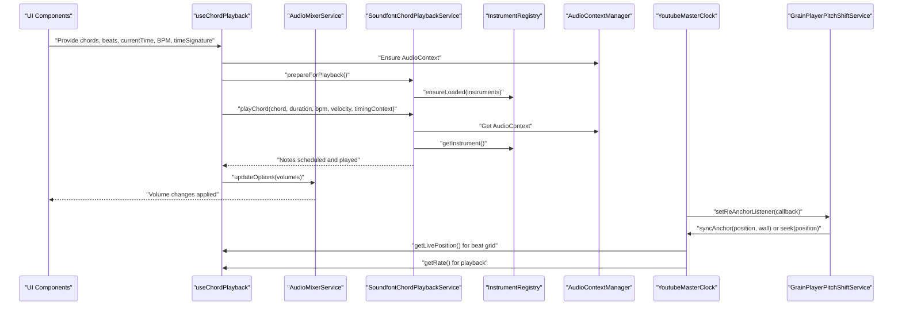
```mermaid
sequenceDiagram
participant UI as "UI Components"
participant Hook as "useChordPlayback"
participant Mixer as "AudioMixerService"
participant SF as "SoundfontChordPlaybackService"
participant InstReg as "InstrumentRegistry"
participant AC as "AudioContextManager"
participant Master as "YoutubeMasterClock"
participant Slave as "GrainPlayerPitchShiftService"
UI->>Hook : "Provide chords, beats, currentTime, BPM, timeSignature"
Hook->>AC : "Ensure AudioContext"
Hook->>SF : "prepareForPlayback()"
SF->>InstReg : "ensureLoaded(instruments)"
Hook->>SF : "playChord(chord, duration, bpm, velocity, timingContext)"
SF->>AC : "Get AudioContext"
SF->>InstReg : "getInstrument()"
SF-->>Hook : "Notes scheduled and played"
Hook->>Mixer : "updateOptions(volumes)"
Mixer-->>UI : "Volume changes applied"
Master->>Slave : "setReAnchorListener(callback)"
Slave->>Master : "syncAnchor(position, wall) or seek(position)"
Master->>Hook : "getLivePosition() for beat grid"
Master->>Hook : "getRate() for playback"
```

**Diagram sources**
- [useChordPlayback.ts:250-738](file://src/hooks/chord-playback/useChordPlayback.ts#L250-L738)
- [audioMixerService.ts:39-370](file://src/services/chord-playback/audioMixerService.ts#L39-L370)
- [soundfontChordPlaybackService.ts:64-715](file://src/services/chord-playback/soundfontChordPlaybackService.ts#L64-L715)
- [instrumentRegistry.ts:7-120](file://src/services/chord-playback/soundfont/instrumentRegistry.ts#L7-L120)
- [audioContextManager.ts:8-124](file://src/services/audio/audioContextManager.ts#L8-L124)
- [youtubeMasterClock.ts:340-374](file://src/services/audio/youtubeMasterClock.ts#L340-L374)
- [usePitchShiftAudio.ts:625-638](file://src/hooks/chord-playback/usePitchShiftAudio.ts#L625-L638)

## Detailed Component Analysis

### ChordPlaybackManager
- Purpose: Transposes chords when pitch shift is enabled and delegates playback to useChordPlayback, exposing a stable playback state object to parent components.
- Key behaviors:
  - Uses useTransposedChordData to transpose chord grid data.
  - Calls useChordPlayback with currentBeatIndex, chords, beats, isPlaying, currentTime, and timing parameters.
  - Memoizes returned playback state to avoid unnecessary re-renders.

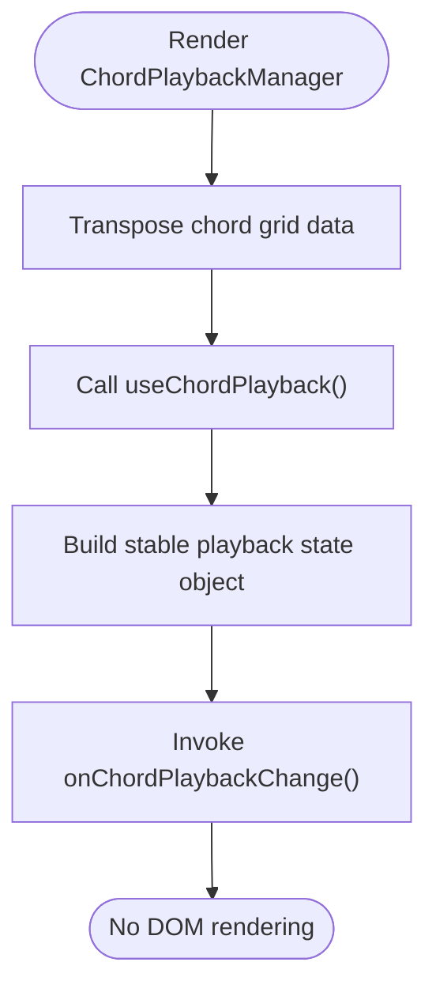
```mermaid
flowchart TD
Start(["Render ChordPlaybackManager"]) --> Transpose["Transpose chord grid data"]
Transpose --> UseHook["Call useChordPlayback()"]
UseHook --> BuildState["Build stable playback state object"]
BuildState --> Parent["Invoke onChordPlaybackChange()"]
Parent --> End(["No DOM rendering"])
```

**Diagram sources**
- [ChordPlaybackManager.tsx:55-122](file://src/components/chord-playback/ChordPlaybackManager.tsx#L55-L122)
- [useChordPlayback.ts:250-738](file://src/hooks/chord-playback/useChordPlayback.ts#L250-L738)

**Section sources**
- [ChordPlaybackManager.tsx:55-122](file://src/components/chord-playback/ChordPlaybackManager.tsx#L55-L122)
- [useChordPlayback.ts:250-738](file://src/hooks/chord-playback/useChordPlayback.ts#L250-L738)

### ChordPlaybackToggle
- Purpose: Provides an audio mixer panel with master, YouTube/pitch-shifted audio, and instrument-specific volume controls.
- Key behaviors:
  - Initializes AudioMixerService and registers chord playback and YouTube player integrations.
  - Dynamically loads soundfont or lightweight chord playback services.
  - Syncs pitch-shifted audio volume with pitch shift service.
  - Exposes test audio and reset controls.

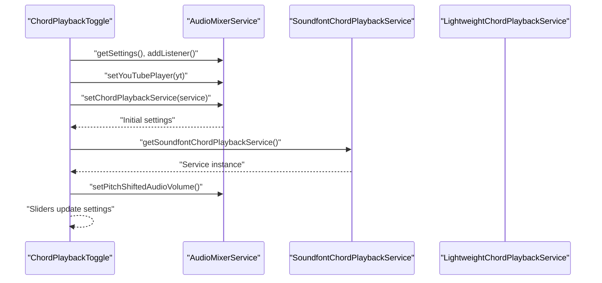
```mermaid
sequenceDiagram
participant UI as "ChordPlaybackToggle"
participant Mixer as "AudioMixerService"
participant SF as "SoundfontChordPlaybackService"
participant LP as "LightweightChordPlaybackService"
UI->>Mixer : "getSettings(), addListener()"
UI->>Mixer : "setYouTubePlayer(yt)"
UI->>Mixer : "setChordPlaybackService(service)"
Mixer-->>UI : "Initial settings"
UI->>SF : "getSoundfontChordPlaybackService()"
SF-->>UI : "Service instance"
UI->>Mixer : "setPitchShiftedAudioVolume()"
UI-->>UI : "Sliders update settings"
```

**Diagram sources**
- [ChordPlaybackToggle.tsx:105-195](file://src/components/chord-playback/ChordPlaybackToggle.tsx#L105-L195)
- [audioMixerService.ts:39-370](file://src/services/chord-playback/audioMixerService.ts#L39-L370)
- [soundfontChordPlaybackService.ts:64-715](file://src/services/chord-playback/soundfontChordPlaybackService.ts#L64-L715)

**Section sources**
- [ChordPlaybackToggle.tsx:57-691](file://src/components/chord-playback/ChordPlaybackToggle.tsx#L57-L691)
- [audioMixerService.ts:39-370](file://src/services/chord-playback/audioMixerService.ts#L39-L370)

### MetronomeControls
- Purpose: Enables metronome or drum track modes and provides real-time mode switching and test clicks.
- Key behaviors:
  - Reads and updates metronome state via metronomeService.
  - Generates and plays pre-rendered metronome tracks with configurable sound styles and modes.
  - Opens a popover panel for mode selection and informational text.

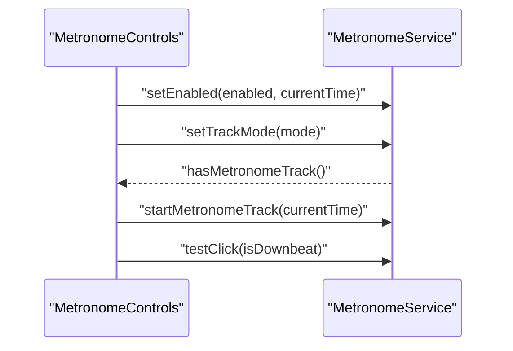
```mermaid
sequenceDiagram
participant UI as "MetronomeControls"
participant MS as "MetronomeService"
UI->>MS : "setEnabled(enabled, currentTime)"
UI->>MS : "setTrackMode(mode)"
MS-->>UI : "hasMetronomeTrack()"
UI->>MS : "startMetronomeTrack(currentTime)"
UI->>MS : "testClick(isDownbeat)"
```

**Diagram sources**
- [MetronomeControls.tsx:12-135](file://src/components/chord-playback/MetronomeControls.tsx#L12-L135)
- [metronomeService.ts:34-498](file://src/services/chord-playback/metronomeService.ts#L34-L498)

**Section sources**
- [MetronomeControls.tsx:12-135](file://src/components/chord-playback/MetronomeControls.tsx#L12-L135)
- [metronomeService.ts:34-498](file://src/services/chord-playback/metronomeService.ts#L34-L498)

### GuitarChordDiagram
- Purpose: Renders responsive guitar chord diagrams with position selection, optional capo effects, and optional Roman numeral overlays.
- Key behaviors:
  - Converts chord data to react-chords format with optional capo baseFret adjustments.
  - Supports lite rendering, focused accent styling, and position selector navigation.
  - Formats chord names with musical symbols and handles N.C. (No Chord) display.

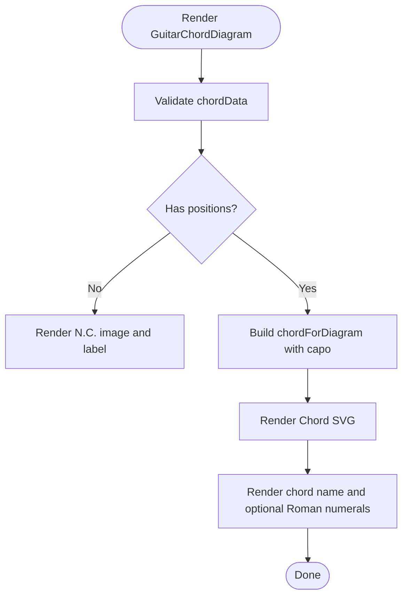
```mermaid
flowchart TD
Start(["Render GuitarChordDiagram"]) --> Validate["Validate chordData"]
Validate --> HasData{"Has positions?"}
HasData --> |No| NC["Render N.C. image and label"]
HasData --> |Yes| Build["Build chordForDiagram with capo"]
Build --> Render["Render Chord SVG"]
Render --> Labels["Render chord name and optional Roman numerals"]
Labels --> End(["Done"])
```

**Diagram sources**
- [GuitarChordDiagram.tsx:99-361](file://src/components/chord-playback/GuitarChordDiagram.tsx#L99-L361)

**Section sources**
- [GuitarChordDiagram.tsx:99-361](file://src/components/chord-playback/GuitarChordDiagram.tsx#L99-L361)

### PitchShiftAudioManager
- Purpose: Initializes and manages pitch-shifted audio playback using GrainPlayerPitchShiftService, coordinating with YouTube and beat animations.
- Key behaviors:
  - Calls usePitchShiftAudio with YouTube player, audio element, Firebase audio URL, and playback state.
  - Ensures pitch shift service is registered globally for volume control access.

**Updated** Now integrates with the enhanced scrub detection mechanism featuring sophisticated threshold-based seek operations that intelligently handle major scrub jumps while maintaining seamless synchronization.

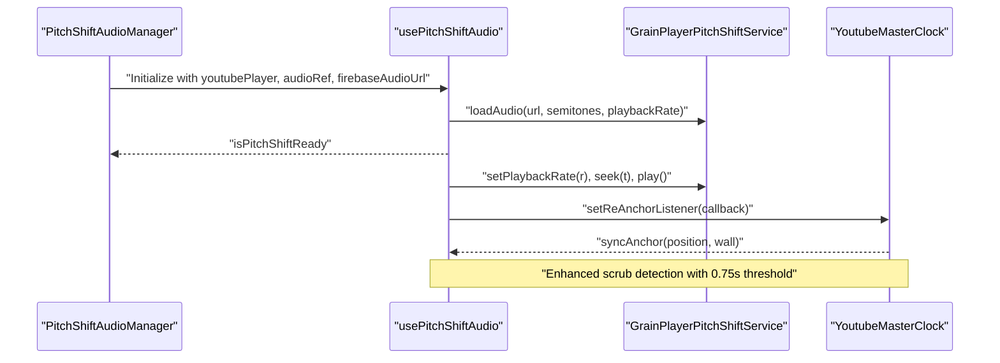
```mermaid
sequenceDiagram
participant UI as "PitchShiftAudioManager"
participant Hook as "usePitchShiftAudio"
participant GPS as "GrainPlayerPitchShiftService"
participant YMC as "YoutubeMasterClock"
UI->>Hook : "Initialize with youtubePlayer, audioRef, firebaseAudioUrl"
Hook->>GPS : "loadAudio(url, semitones, playbackRate)"
Hook-->>UI : "isPitchShiftReady"
Hook->>GPS : "setPlaybackRate(r), seek(t), play()"
Hook->>YMC : "setReAnchorListener(callback)"
YMC-->>Hook : "syncAnchor(position, wall)"
Note over Hook,YMC : "Enhanced scrub detection with 0.75s threshold"
```

**Diagram sources**
- [PitchShiftAudioManager.tsx:29-35](file://src/components/chord-playback/PitchShiftAudioManager.tsx#L29-L35)
- [usePitchShiftAudio.ts:116-760](file://src/hooks/chord-playback/usePitchShiftAudio.ts#L116-L760)
- [grainPlayerPitchShiftService.ts:118-800](file://src/services/audio/grainPlayerPitchShiftService.ts#L118-L800)
- [youtubeMasterClock.ts:177-179](file://src/services/audio/youtubeMasterClock.ts#L177-L179)

**Section sources**
- [PitchShiftAudioManager.tsx:29-35](file://src/components/chord-playback/PitchShiftAudioManager.tsx#L29-L35)
- [usePitchShiftAudio.ts:116-760](file://src/hooks/chord-playback/usePitchShiftAudio.ts#L116-L760)
- [grainPlayerPitchShiftService.ts:118-800](file://src/services/audio/grainPlayerPitchShiftService.ts#L118-L800)
- [youtubeMasterClock.ts:177-179](file://src/services/audio/youtubeMasterClock.ts#L177-L179)

### useChordPlayback
- Purpose: Manages chord playback synchronized with beat animation, supporting dynamic timing, background tab scheduling, and instrument mixing.
- Key behaviors:
  - Builds a pre-scheduled list of chord events from chords and beats arrays.
  - Finds matching events for foreground and background playback modes.
  - Applies dynamic velocity based on signal dynamics and segmentation data.
  - Updates SoundfontChordPlaybackService options and handles stop/soft-stop sequences.

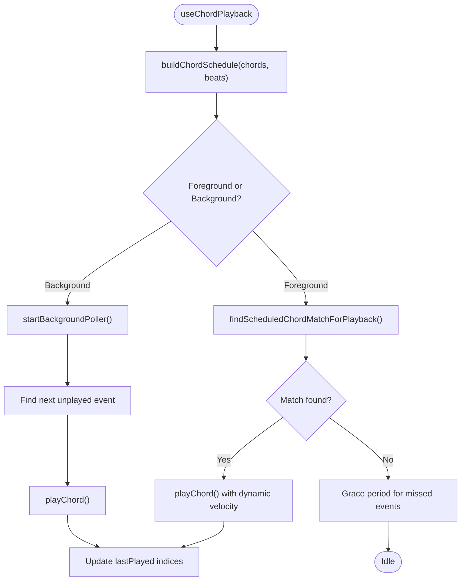
```mermaid
flowchart TD
Start(["useChordPlayback"]) --> Schedule["buildChordSchedule(chords, beats)"]
Schedule --> Mode{"Foreground or Background?"}
Mode --> |Foreground| FindFG["findScheduledChordMatchForPlayback()"]
Mode --> |Background| Poller["startBackgroundPoller()"]
FindFG --> Match{"Match found?"}
Match --> |Yes| Play["playChord() with dynamic velocity"]
Match --> |No| Grace["Grace period for missed events"]
Play --> Update["Update lastPlayed indices"]
Grace --> End(["Idle"])
Poller --> MatchBG["Find next unplayed event"]
MatchBG --> PlayBG["playChord()"]
PlayBG --> Update
```

**Diagram sources**
- [useChordPlayback.ts:82-738](file://src/hooks/chord-playback/useChordPlayback.ts#L82-L738)
- [soundfontChordPlaybackService.ts:192-477](file://src/services/chord-playback/soundfontChordPlaybackService.ts#L192-L477)

**Section sources**
- [useChordPlayback.ts:250-738](file://src/hooks/chord-playback/useChordPlayback.ts#L250-L738)
- [soundfontChordPlaybackService.ts:192-477](file://src/services/chord-playback/soundfontChordPlaybackService.ts#L192-L477)

### Audio Mixer Service
- Purpose: Centralized volume management for YouTube, chord playback instruments, and metronome.
- Key behaviors:
  - Persists settings to sessionStorage and notifies listeners of changes.
  - Calculates effective volumes by applying master volume to individual settings.
  - Registers YouTube player, chord playback service, and metronome service for volume control integration.

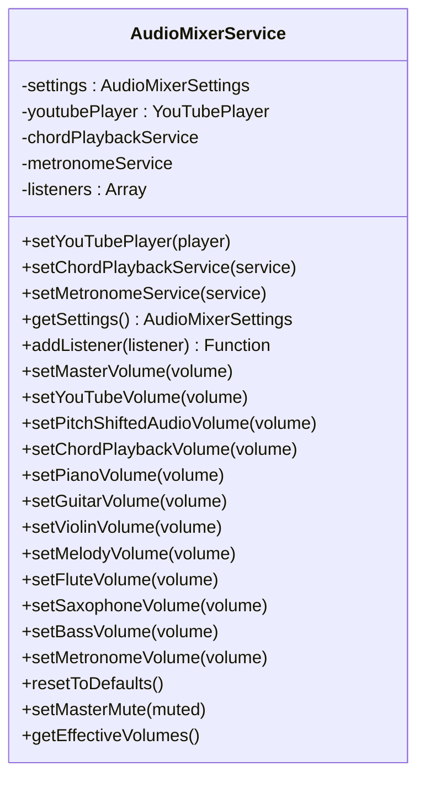
```mermaid
classDiagram
class AudioMixerService {
-settings : AudioMixerSettings
-youtubePlayer : YouTubePlayer
-chordPlaybackService
-metronomeService
-listeners : Array
+setYouTubePlayer(player)
+setChordPlaybackService(service)
+setMetronomeService(service)
+getSettings() AudioMixerSettings
+addListener(listener) Function
+setMasterVolume(volume)
+setYouTubeVolume(volume)
+setPitchShiftedAudioVolume(volume)
+setChordPlaybackVolume(volume)
+setPianoVolume(volume)
+setGuitarVolume(volume)
+setViolinVolume(volume)
+setMelodyVolume(volume)
+setFluteVolume(volume)
+setSaxophoneVolume(volume)
+setBassVolume(volume)
+setMetronomeVolume(volume)
+resetToDefaults()
+setMasterMute(muted)
+getEffectiveVolumes()
}
```

**Diagram sources**
- [audioMixerService.ts:39-370](file://src/services/chord-playback/audioMixerService.ts#L39-L370)

**Section sources**
- [audioMixerService.ts:39-370](file://src/services/chord-playback/audioMixerService.ts#L39-L370)

### Soundfont Chord Playback Service
- Purpose: Produces realistic instrument sounds using soundfonts and manages instrument registries and envelopes.
- Key behaviors:
  - Lazy-loads instruments and applies envelopes and render configurations.
  - Schedules and plays notes with density compensation, sustain retrigger, and loop handling.
  - Supports soft-stop and stop sequences to prevent clicks and manage active notes.

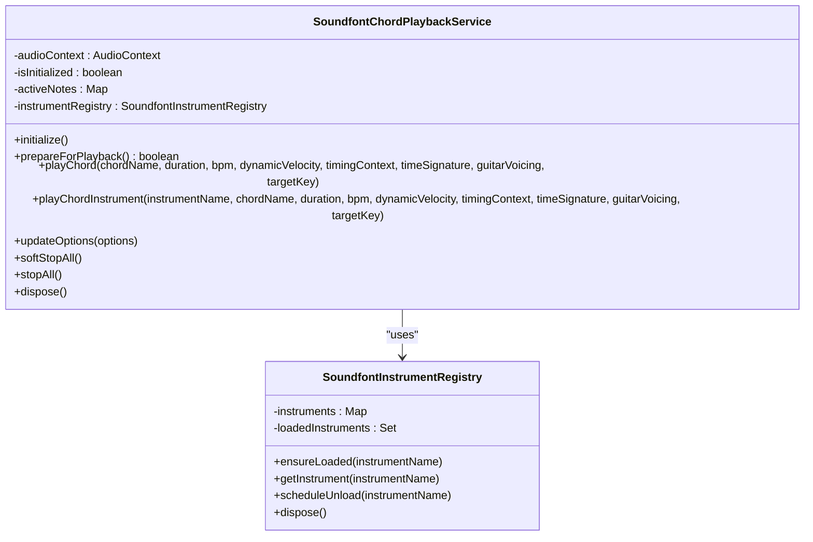
```mermaid
classDiagram
class SoundfontChordPlaybackService {
-audioContext : AudioContext
-isInitialized : boolean
-activeNotes : Map
-instrumentRegistry : SoundfontInstrumentRegistry
+initialize()
+prepareForPlayback() boolean
+playChord(chordName, duration, bpm, dynamicVelocity, timingContext, timeSignature, guitarVoicing, targetKey)
+playChordInstrument(instrumentName, chordName, duration, bpm, dynamicVelocity, timingContext, timeSignature, guitarVoicing, targetKey)
+updateOptions(options)
+softStopAll()
+stopAll()
+dispose()
}
class SoundfontInstrumentRegistry {
-instruments : Map
-loadedInstruments : Set
+ensureLoaded(instrumentName)
+getInstrument(instrumentName)
+scheduleUnload(instrumentName)
+dispose()
}
SoundfontChordPlaybackService --> SoundfontInstrumentRegistry : "uses"
```

**Diagram sources**
- [soundfontChordPlaybackService.ts:64-715](file://src/services/chord-playback/soundfontChordPlaybackService.ts#L64-L715)
- [instrumentRegistry.ts:7-120](file://src/services/chord-playback/soundfont/instrumentRegistry.ts#L7-L120)

**Section sources**
- [soundfontChordPlaybackService.ts:64-715](file://src/services/chord-playback/soundfontChordPlaybackService.ts#L64-L715)
- [instrumentRegistry.ts:7-120](file://src/services/chord-playback/soundfont/instrumentRegistry.ts#L7-L120)

### Metronome Service
- Purpose: Generates synchronized metronome tracks using Web Audio API and supports multiple sound styles and drum patterns.
- Key behaviors:
  - Pre-generates metronome tracks with configurable BPM, time signature, and sound style.
  - Starts, stops, and seeks tracks with volume control and gain automation.
  - Provides test click functionality and settings listeners.

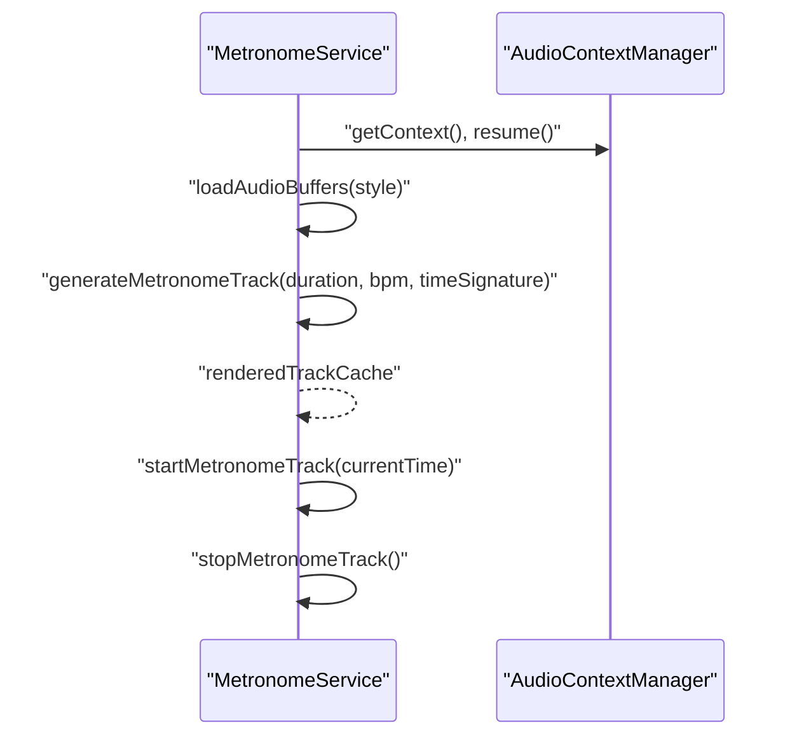
```mermaid
sequenceDiagram
participant MS as "MetronomeService"
participant AC as "AudioContextManager"
MS->>AC : "getContext(), resume()"
MS->>MS : "loadAudioBuffers(style)"
MS->>MS : "generateMetronomeTrack(duration, bpm, timeSignature)"
MS-->>MS : "renderedTrackCache"
MS->>MS : "startMetronomeTrack(currentTime)"
MS->>MS : "stopMetronomeTrack()"
```

**Diagram sources**
- [metronomeService.ts:34-498](file://src/services/chord-playback/metronomeService.ts#L34-L498)
- [audioContextManager.ts:8-124](file://src/services/audio/audioContextManager.ts#L8-L124)

**Section sources**
- [metronomeService.ts:34-498](file://src/services/chord-playback/metronomeService.ts#L34-L498)
- [audioContextManager.ts:8-124](file://src/services/audio/audioContextManager.ts#L8-L124)

### YoutubeMasterClock
- Purpose: Unified master clock that serves as the single source of truth for playback position and rate across the application.
- Key behaviors:
  - Maintains anchor position and wall-clock timestamps for extrapolation.
  - Implements re-anchor hysteresis to prevent jitter propagation.
  - Provides rate-change counter-snap to prevent position offsets.
  - Manages user-seek fences to prevent backward-step issues.

**Updated** The YoutubeMasterClock now features enhanced scrub detection integration with the slave re-anchor loop, providing sophisticated jump magnitude analysis and intelligent seek vs. anchor decision-making.

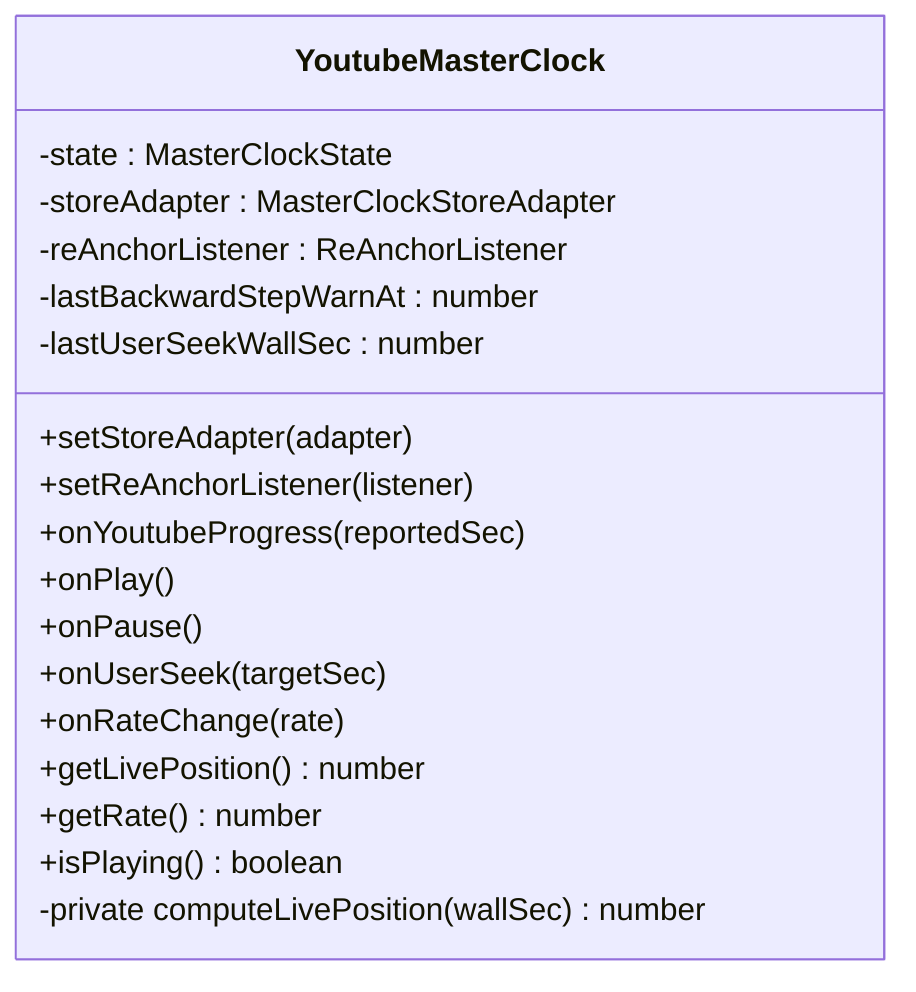
```mermaid
classDiagram
class YoutubeMasterClock {
-state : MasterClockState
-storeAdapter : MasterClockStoreAdapter
-reAnchorListener : ReAnchorListener
-lastBackwardStepWarnAt : number
-lastUserSeekWallSec : number
+setStoreAdapter(adapter)
+setReAnchorListener(listener)
+onYoutubeProgress(reportedSec)
+onPlay()
+onPause()
+onUserSeek(targetSec)
+onRateChange(rate)
+getLivePosition() number
+getRate() number
+isPlaying() boolean
-private computeLivePosition(wallSec) number
}
```

**Diagram sources**
- [youtubeMasterClock.ts:145-409](file://src/services/audio/youtubeMasterClock.ts#L145-L409)

**Section sources**
- [youtubeMasterClock.ts:145-409](file://src/services/audio/youtubeMasterClock.ts#L145-L409)

### GrainPlayerPitchShiftService
- Purpose: Provides real-time pitch shifting and time-stretching using Tone.js GrainPlayer with passive accumulator synchronization.
- Key behaviors:
  - Implements passive accumulator system eliminating drift and freeze bugs.
  - Uses 50 ms interval for live position computation without audio gaps.
  - Provides syncAnchor method for master clock re-anchor synchronization.
  - Supports rate fan-out without stop/restart cycles.

**Updated** The GrainPlayerPitchShiftService now features enhanced seek safety mechanisms with comprehensive diagnostic logging and improved rate change handling, working in conjunction with the enhanced scrub detection system.

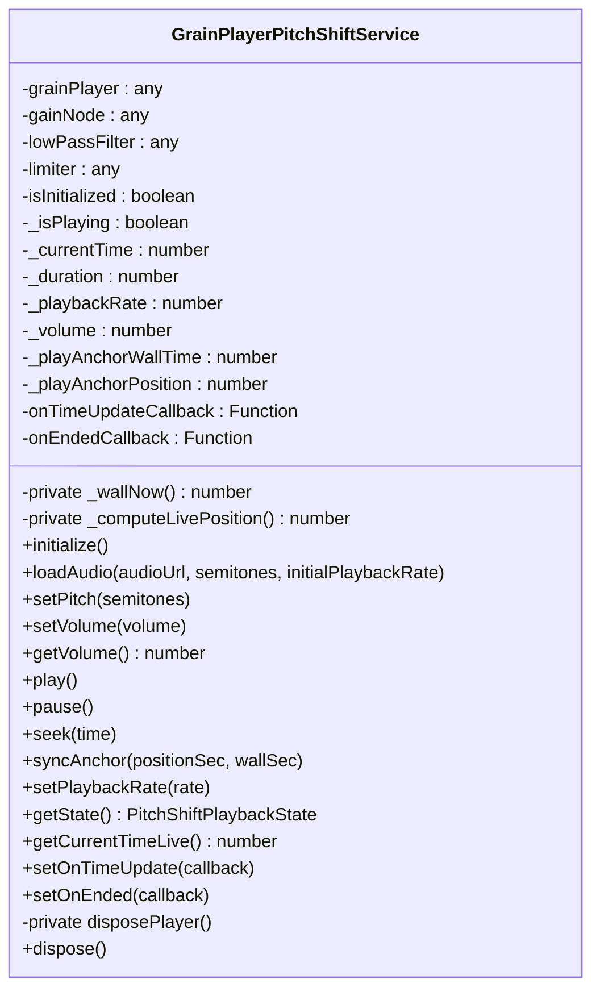
```mermaid
classDiagram
class GrainPlayerPitchShiftService {
-grainPlayer : any
-gainNode : any
-lowPassFilter : any
-limiter : any
-isInitialized : boolean
-_isPlaying : boolean
-_currentTime : number
-_duration : number
-_playbackRate : number
-_volume : number
-_playAnchorWallTime : number
-_playAnchorPosition : number
-onTimeUpdateCallback : Function
-onEndedCallback : Function
-private _wallNow() number
-private _computeLivePosition() number
+initialize()
+loadAudio(audioUrl, semitones, initialPlaybackRate)
+setPitch(semitones)
+setVolume(volume)
+getVolume() number
+play()
+pause()
+seek(time)
+syncAnchor(positionSec, wallSec)
+setPlaybackRate(rate)
+getState() PitchShiftPlaybackState
+getCurrentTimeLive() number
+setOnTimeUpdate(callback)
+setOnEnded(callback)
-private disposePlayer()
+dispose()
}
```

**Diagram sources**
- [grainPlayerPitchShiftService.ts:117-800](file://src/services/audio/grainPlayerPitchShiftService.ts#L117-L800)

**Section sources**
- [grainPlayerPitchShiftService.ts:117-800](file://src/services/audio/grainPlayerPitchShiftService.ts#L117-L800)

### usePitchShiftAudio
- Purpose: Integrates Tone.js pitch shifting with existing playback system, handling audio source switching and synchronization.
- Key behaviors:
  - Initializes GrainPlayerPitchShiftService with adaptive filter cutoff and limiter.
  - Implements 40ms slave re-anchor loop to keep YouTube and beat animations in sync.
  - Provides comprehensive diagnostic logging for troubleshooting.
  - Handles scrub detection and anchor synchronization with enhanced threshold-based seek operations.

**Updated** The usePitchShiftAudio hook now features an enhanced 40ms slave loop with sophisticated scrub detection mechanism featuring a 0.75-second threshold that intelligently distinguishes between minor drift corrections and major scrub jumps, ensuring optimal synchronization performance.

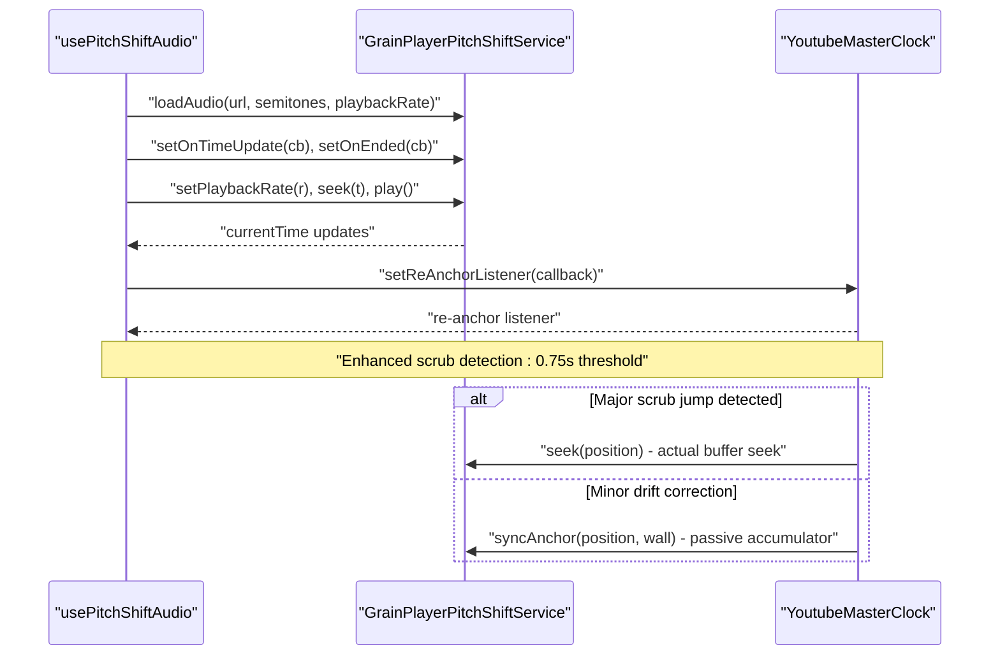
```mermaid
sequenceDiagram
participant Hook as "usePitchShiftAudio"
participant GPS as "GrainPlayerPitchShiftService"
participant YMC as "YoutubeMasterClock"
Hook->>GPS : "loadAudio(url, semitones, playbackRate)"
Hook->>GPS : "setOnTimeUpdate(cb), setOnEnded(cb)"
Hook->>GPS : "setPlaybackRate(r), seek(t), play()"
GPS-->>Hook : "currentTime updates"
Hook->>YMC : "setReAnchorListener(callback)"
YMC-->>Hook : "re-anchor listener"
Note over Hook,YMC : "Enhanced scrub detection : 0.75s threshold"
alt Major scrub jump detected
YMC->>GPS : "seek(position) - actual buffer seek"
else Minor drift correction
YMC->>GPS : "syncAnchor(position, wall) - passive accumulator"
end
```

**Diagram sources**
- [usePitchShiftAudio.ts:116-760](file://src/hooks/chord-playback/usePitchShiftAudio.ts#L116-L760)
- [grainPlayerPitchShiftService.ts:118-800](file://src/services/audio/grainPlayerPitchShiftService.ts#L118-L800)
- [youtubeMasterClock.ts:177-179](file://src/services/audio/youtubeMasterClock.ts#L177-L179)

**Section sources**
- [usePitchShiftAudio.ts:116-760](file://src/hooks/chord-playback/usePitchShiftAudio.ts#L116-L760)
- [grainPlayerPitchShiftService.ts:118-800](file://src/services/audio/grainPlayerPitchShiftService.ts#L118-L800)
- [youtubeMasterClock.ts:177-179](file://src/services/audio/youtubeMasterClock.ts#L177-L179)

### Loop Playback Toggle
- Purpose: Loops playback between selected start and end beats when the end boundary is reached.
- Key behaviors:
  - Resolves loop range from beat timestamps and calculates end boundary.
  - Seeks back to the start timestamp and resumes playback with cooldown protection.

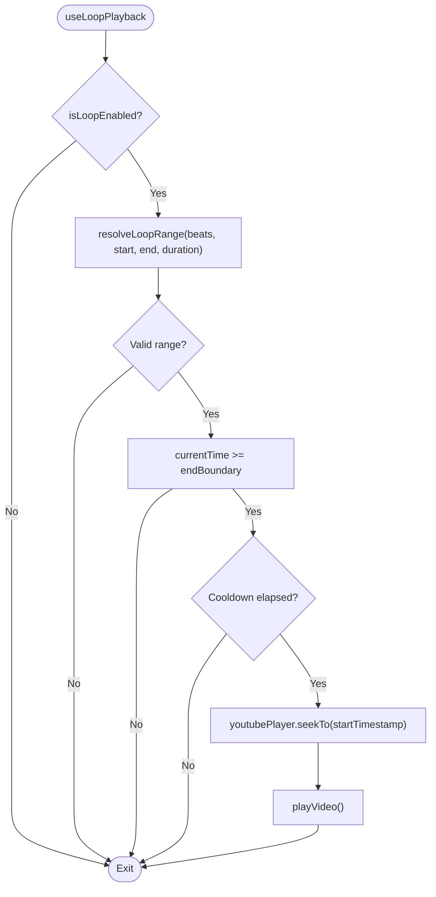
```mermaid
flowchart TD
Start(["useLoopPlayback"]) --> Enabled{"isLoopEnabled?"}
Enabled --> |No| End(["Exit"])
Enabled --> |Yes| Resolve["resolveLoopRange(beats, start, end, duration)"]
Resolve --> Valid{"Valid range?"}
Valid --> |No| End
Valid --> |Yes| Check["currentTime >= endBoundary"]
Check --> |No| End
Check --> |Yes| Cooldown{"Cooldown elapsed?"}
Cooldown --> |No| End
Cooldown --> |Yes| Seek["youtubePlayer.seekTo(startTimestamp)"]
Seek --> Resume["playVideo()"]
Resume --> End
```

**Diagram sources**
- [useLoopPlayback.ts:86-128](file://src/hooks/chord-playback/useLoopPlayback.ts#L86-L128)

**Section sources**
- [useLoopPlayback.ts:86-128](file://src/hooks/chord-playback/useLoopPlayback.ts#L86-L128)

### Metronome Synchronization
- Purpose: Synchronizes metronome playback with audio using pre-generated tracks and settings listeners.
- Key behaviors:
  - Generates metronome tracks with configurable BPM, time signature, and sound style.
  - Starts/stops tracks on play/pause and handles seeking with significant time differences.
  - Exposes toggle with current time synchronization.

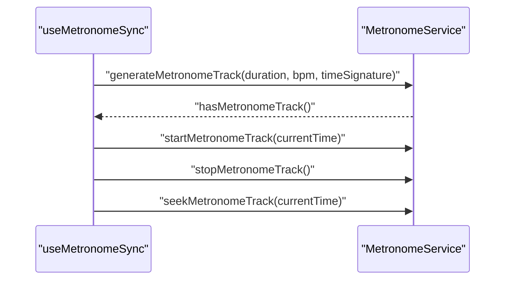
```mermaid
sequenceDiagram
participant Hook as "useMetronomeSync"
participant MS as "MetronomeService"
Hook->>MS : "generateMetronomeTrack(duration, bpm, timeSignature)"
MS-->>Hook : "hasMetronomeTrack()"
Hook->>MS : "startMetronomeTrack(currentTime)"
Hook->>MS : "stopMetronomeTrack()"
Hook->>MS : "seekMetronomeTrack(currentTime)"
```

**Diagram sources**
- [useMetronomeSync.ts:19-198](file://src/hooks/chord-playback/useMetronomeSync.ts#L19-L198)
- [metronomeService.ts:131-422](file://src/services/chord-playback/metronomeService.ts#L131-L422)

**Section sources**
- [useMetronomeSync.ts:19-198](file://src/hooks/chord-playback/useMetronomeSync.ts#L19-L198)
- [metronomeService.ts:131-422](file://src/services/chord-playback/metronomeService.ts#L131-L422)

### Performance Monitoring
- Purpose: Monitors and tracks performance metrics across the application for optimization and debugging.
- Key behaviors:
  - Tracks Firebase query reduction, filename matching accuracy, and cache performance.
  - Monitors error frequency and warning reduction.
  - Provides performance summaries and alert notifications.
  - Exports detailed performance metrics for analysis.

**New Section** Added comprehensive performance monitoring capabilities to track and analyze system performance metrics.

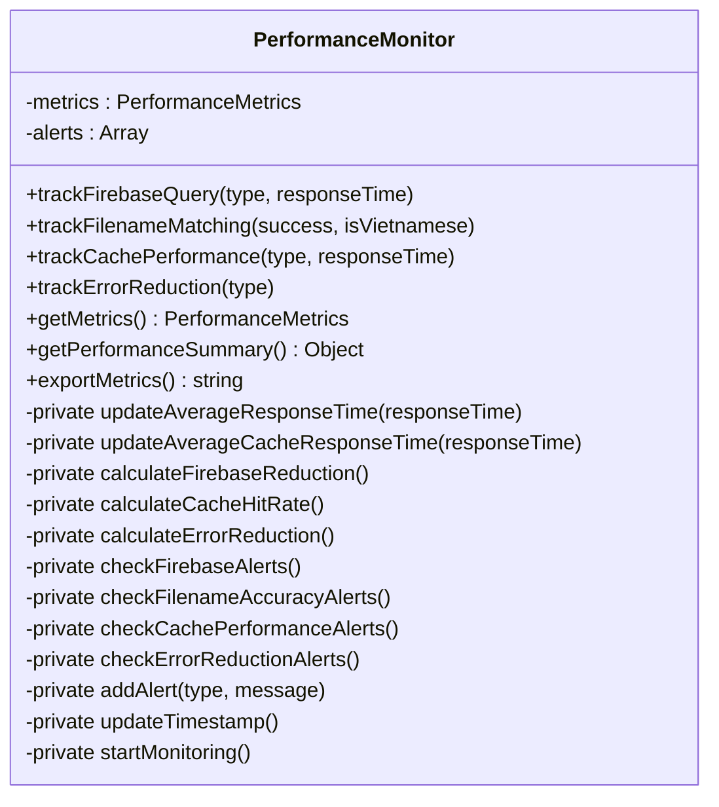
```mermaid
classDiagram
class PerformanceMonitor {
-metrics : PerformanceMetrics
-alerts : Array
+trackFirebaseQuery(type, responseTime)
+trackFilenameMatching(success, isVietnamese)
+trackCachePerformance(type, responseTime)
+trackErrorReduction(type)
+getMetrics() PerformanceMetrics
+getPerformanceSummary() Object
+exportMetrics() string
-private updateAverageResponseTime(responseTime)
-private updateAverageCacheResponseTime(responseTime)
-private calculateFirebaseReduction()
-private calculateCacheHitRate()
-private calculateErrorReduction()
-private checkFirebaseAlerts()
-private checkFilenameAccuracyAlerts()
-private checkCachePerformanceAlerts()
-private checkErrorReductionAlerts()
-private addAlert(type, message)
-private updateTimestamp()
-private startMonitoring()
}
```

**Diagram sources**
- [performanceMonitor.ts:42-312](file://src/services/performance/performanceMonitor.ts#L42-L312)

**Section sources**
- [performanceMonitor.ts:42-312](file://src/services/performance/performanceMonitor.ts#L42-L312)

## Dependency Analysis
The chord playback system exhibits strong separation of concerns with enhanced synchronization:
- Components depend on hooks for state and effects.
- Hooks depend on services for audio operations and state management.
- Services depend on AudioContextManager for Web Audio lifecycle.
- Instrument registry encapsulates soundfont loading and caching.
- YoutubeMasterClock provides centralized time authority for all synchronization.

**Updated** The dependency graph now includes the enhanced scrub detection mechanism with threshold-based seek operations as a central synchronization enhancement, working seamlessly with the existing master clock architecture.

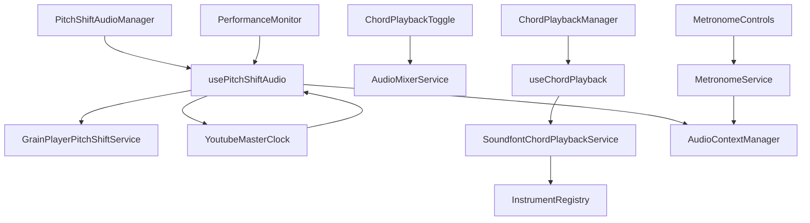
```mermaid
graph TB
CPM["ChordPlaybackManager"] --> UCP["useChordPlayback"]
CPT["ChordPlaybackToggle"] --> AMS["AudioMixerService"]
MC["MetronomeControls"] --> MS["MetronomeService"]
PSAM["PitchShiftAudioManager"] --> UPSA["usePitchShiftAudio"]
UPSA --> GPS["GrainPlayerPitchShiftService"]
UPSA --> YMC["YoutubeMasterClock"]
UCP --> SCP["SoundfontChordPlaybackService"]
SCP --> IR["InstrumentRegistry"]
UPSA --> ACM["AudioContextManager"]
MS --> ACM
YMC --> UPSA
PM["PerformanceMonitor"] --> UPSA
```

**Diagram sources**
- [ChordPlaybackManager.tsx:55-122](file://src/components/chord-playback/ChordPlaybackManager.tsx#L55-L122)
- [ChordPlaybackToggle.tsx:57-691](file://src/components/chord-playback/ChordPlaybackToggle.tsx#L57-L691)
- [MetronomeControls.tsx:12-135](file://src/components/chord-playback/MetronomeControls.tsx#L12-L135)
- [PitchShiftAudioManager.tsx:29-35](file://src/components/chord-playback/PitchShiftAudioManager.tsx#L29-L35)
- [useChordPlayback.ts:250-738](file://src/hooks/chord-playback/useChordPlayback.ts#L250-L738)
- [audioMixerService.ts:39-370](file://src/services/chord-playback/audioMixerService.ts#L39-L370)
- [soundfontChordPlaybackService.ts:64-715](file://src/services/chord-playback/soundfontChordPlaybackService.ts#L64-L715)
- [metronomeService.ts:34-498](file://src/services/chord-playback/metronomeService.ts#L34-L498)
- [usePitchShiftAudio.ts:116-760](file://src/hooks/chord-playback/usePitchShiftAudio.ts#L116-L760)
- [grainPlayerPitchShiftService.ts:118-800](file://src/services/audio/grainPlayerPitchShiftService.ts#L118-L800)
- [youtubeMasterClock.ts:145-409](file://src/services/audio/youtubeMasterClock.ts#L145-L409)
- [audioContextManager.ts:8-124](file://src/services/audio/audioContextManager.ts#L8-L124)
- [instrumentRegistry.ts:7-120](file://src/services/chord-playback/soundfont/instrumentRegistry.ts#L7-L120)
- [performanceMonitor.ts:42-312](file://src/services/performance/performanceMonitor.ts#L42-L312)

**Section sources**
- [ChordPlaybackManager.tsx:55-122](file://src/components/chord-playback/ChordPlaybackManager.tsx#L55-L122)
- [ChordPlaybackToggle.tsx:57-691](file://src/components/chord-playback/ChordPlaybackToggle.tsx#L57-L691)
- [MetronomeControls.tsx:12-135](file://src/components/chord-playback/MetronomeControls.tsx#L12-L135)
- [PitchShiftAudioManager.tsx:29-35](file://src/components/chord-playback/PitchShiftAudioManager.tsx#L29-L35)
- [useChordPlayback.ts:250-738](file://src/hooks/chord-playback/useChordPlayback.ts#L250-L738)
- [audioMixerService.ts:39-370](file://src/services/chord-playback/audioMixerService.ts#L39-L370)
- [soundfontChordPlaybackService.ts:64-715](file://src/services/chord-playback/soundfontChordPlaybackService.ts#L64-L715)
- [metronomeService.ts:34-498](file://src/services/chord-playback/metronomeService.ts#L34-L498)
- [usePitchShiftAudio.ts:116-760](file://src/hooks/chord-playback/usePitchShiftAudio.ts#L116-L760)
- [grainPlayerPitchShiftService.ts:118-800](file://src/services/audio/grainPlayerPitchShiftService.ts#L118-L800)
- [youtubeMasterClock.ts:145-409](file://src/services/audio/youtubeMasterClock.ts#L145-L409)
- [audioContextManager.ts:8-124](file://src/services/audio/audioContextManager.ts#L8-L124)
- [instrumentRegistry.ts:7-120](file://src/services/chord-playback/soundfont/instrumentRegistry.ts#L7-L120)
- [performanceMonitor.ts:42-312](file://src/services/performance/performanceMonitor.ts#L42-L312)

## Performance Considerations
- **Enhanced Synchronization Architecture**:
  - Unified master clock authority model eliminates conflicts between independent time sources.
  - Passive accumulator system in GrainPlayerPitchShiftService prevents drift and freeze bugs.
  - 40ms slave loop frequency provides optimal balance between responsiveness and CPU efficiency.
  - Comprehensive diagnostic logging enables real-time monitoring and troubleshooting.
  - Enhanced scrub detection mechanism with 0.75-second threshold prevents unnecessary buffer seeks during minor drift corrections.
- **Latency reduction**:
  - Use pre-generated metronome tracks to eliminate per-click synthesis latency.
  - Implement rate fan-out without stop/restart cycles to prevent audio gaps.
  - Apply density compensation and sustain retrigger strategies to balance quality and CPU usage.
  - Sophisticated seek safety mechanisms prevent clicks and ensure seamless transitions.
- **Browser audio compatibility**:
  - AudioContextManager handles resume/suspend lifecycle and Safari fallbacks.
  - Tone.js lazy loading reduces initial bundle size and improves startup performance.
- **Real-time synchronization**:
  - Clock authority model: when pitch shift is active, the YoutubeMasterClock is the master clock; all slaves follow.
  - Master clock provides re-anchor hysteresis with 0.08 second base tolerance scaled by rate.
  - Enhanced scrub detection identifies major scrub jumps (≥0.75 seconds) requiring actual buffer seeks, while minor drifts use passive accumulator synchronization.
  - Improved scrub detection mechanism with threshold-based seek operations ensures optimal performance.
- **Memory management**:
  - Instrument registry schedules delayed unloading of unused instruments to conserve memory.
  - Proper disposal of audio nodes and timers prevents leaks.
  - PerformanceMonitor tracks system-wide metrics for optimization insights.

**Updated** Performance considerations now emphasize the enhanced scrub detection mechanism with threshold-based seek operations that significantly improve synchronization reliability and reduce unnecessary buffer operations.

## Troubleshooting Guide
- **No audio output**:
  - Verify AudioContext state via audioContextManager and ensure resume on user interaction.
  - Check if services are initialized and ready (isReady flags).
- **Pitch shift issues**:
  - Confirm GrainPlayerPitchShiftService is loaded and playback rate is set correctly.
  - Ensure YouTube player is muted while pitch shift is active to maintain visual sync.
  - Monitor YoutubeMasterClock diagnostics for synchronization issues.
- **YouTube video iframe blacks out**:
  - This is typically caused by calling `seekTo()` programmatically before the user has manually initiated playback. Ensure the `hasUserActivatedPlayback` state is checked before seeking, and use the `pendingSeekTimestamp` queue for pre-play interactions.
  - Check scrub detection logs for threshold-based seek operation analysis.
- **Metronome desync**:
  - Regenerate metronome tracks when settings change (sound style, mode, BPM).
  - Use seekMetronomeTrack for significant time jumps.
- **Loop playback not working**:
  - Validate loop start/end beat indices and ensure resolved timestamps are numeric.
  - Check cooldown timer to prevent rapid looping.
- **Synchronization problems**:
  - Monitor diagnostic logs for master clock re-anchor failures.
  - Check slave loop drift correction frequency and tolerance thresholds.
  - Verify passive accumulator synchronization after rate changes.
  - Analyze scrub detection threshold logs to identify seek vs. anchor decision patterns.
  - Review 0.75-second threshold behavior for major scrub jumps.

**Updated** Troubleshooting guide now includes specific guidance for the enhanced scrub detection mechanism and threshold-based seek operations that provide superior synchronization performance.

**Section sources**
- [audioContextManager.ts:50-98](file://src/services/audio/audioContextManager.ts#L50-L98)
- [grainPlayerPitchShiftService.ts:205-231](file://src/services/audio/grainPlayerPitchShiftService.ts#L205-L231)
- [usePitchShiftAudio.ts:380-436](file://src/hooks/chord-playback/usePitchShiftAudio.ts#L380-L436)
- [metronomeService.ts:131-215](file://src/services/chord-playback/metronomeService.ts#L131-L215)
- [useLoopPlayback.ts:101-127](file://src/hooks/chord-playback/useLoopPlayback.ts#L101-L127)
- [youtubeMasterClock.ts:220-231](file://src/services/audio/youtubeMasterClock.ts#L220-L231)

## Conclusion
The chord playback control system in ChordMiniApp combines React components, hooks, and Web Audio services to deliver synchronized, high-quality chord playback with real-time visual feedback. The architecture emphasizes modular design, robust synchronization (especially for pitch-shifted audio), and performance-conscious implementations. The new master clock architecture with passive accumulator system provides unprecedented reliability and precision in audio-video synchronization. The enhanced scrub detection mechanism with threshold-based seek operations featuring a 0.75-second threshold ensures optimal performance by intelligently distinguishing between minor drift corrections and major scrub jumps. Users benefit from intuitive controls, flexible instrument mixing, seamless integration with analysis workflows, and comprehensive diagnostic capabilities for troubleshooting and optimization. The sophisticated synchronization architecture delivers superior user experience through intelligent threshold-based seek operations and enhanced scrub detection mechanisms.

**Updated** The conclusion now reflects the enhanced synchronization architecture with sophisticated scrub detection mechanisms and threshold-based seek operations that significantly improve system reliability, user experience, and synchronization performance.