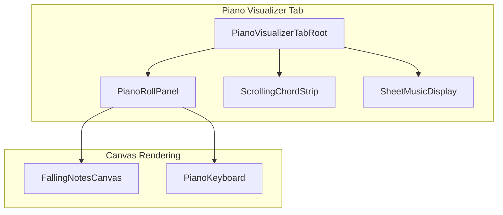
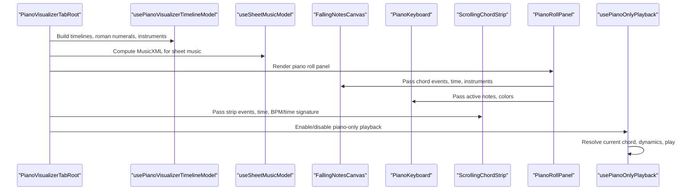
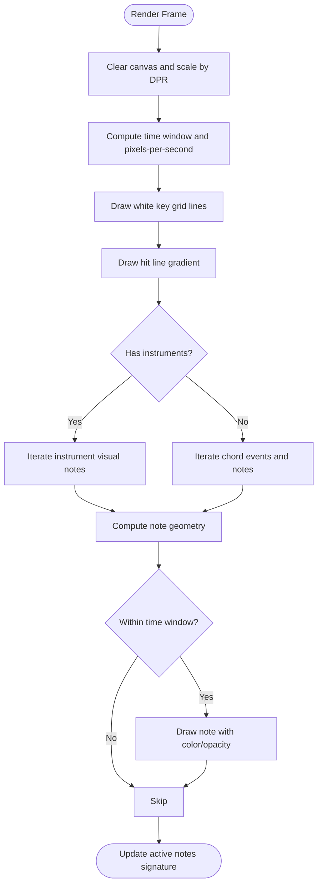
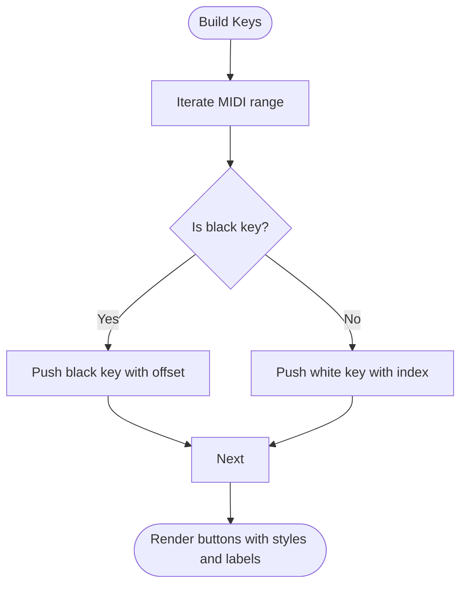
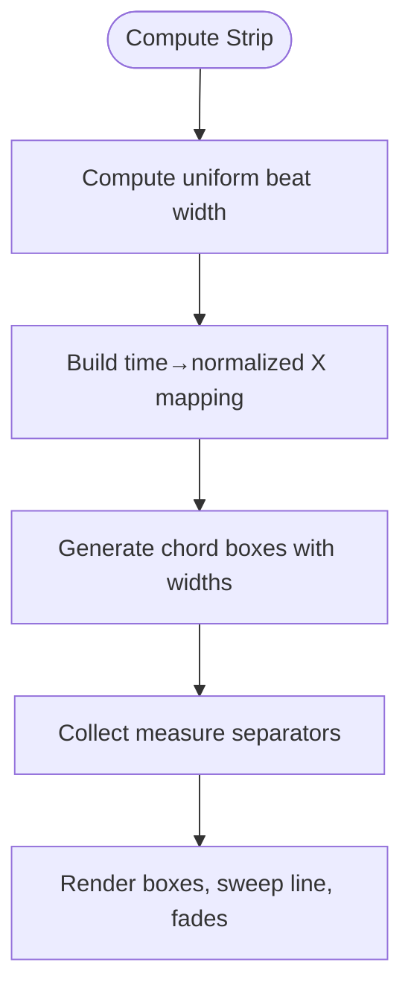
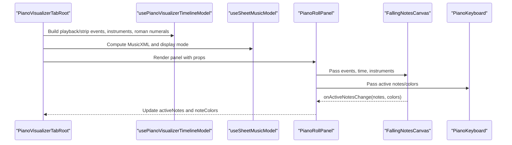
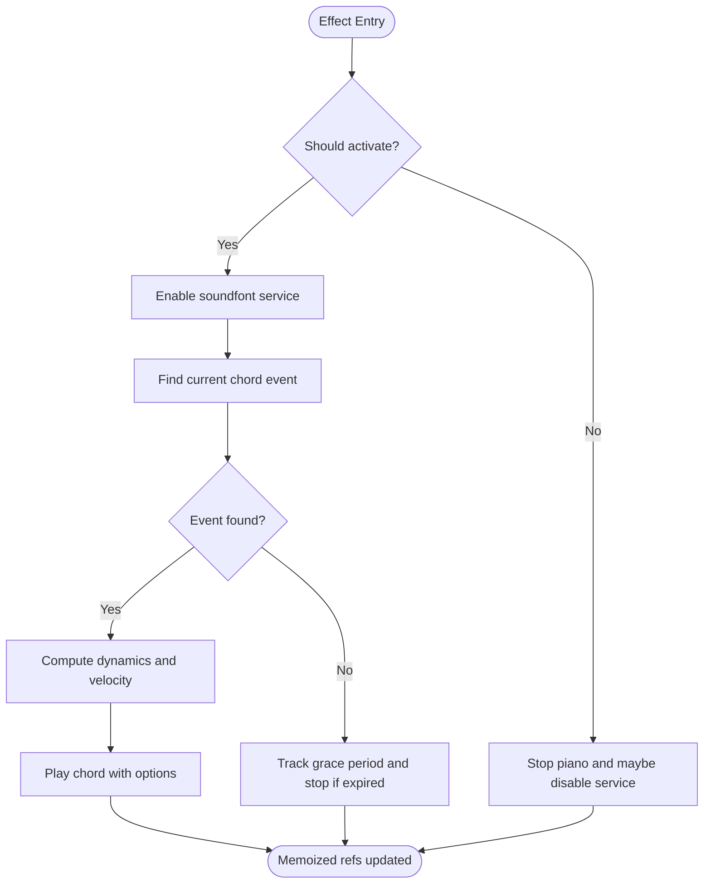
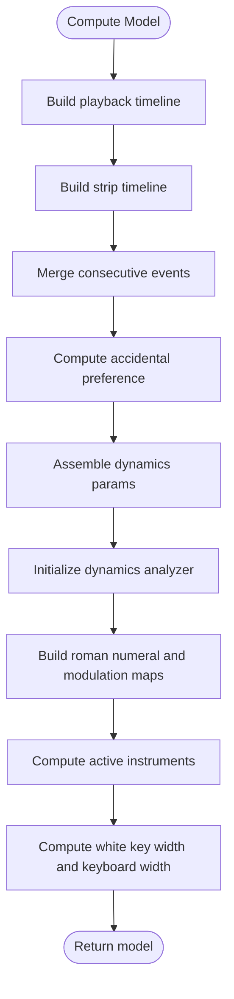
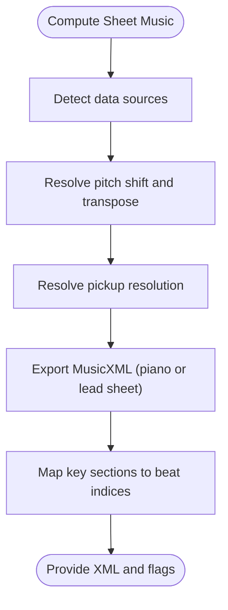
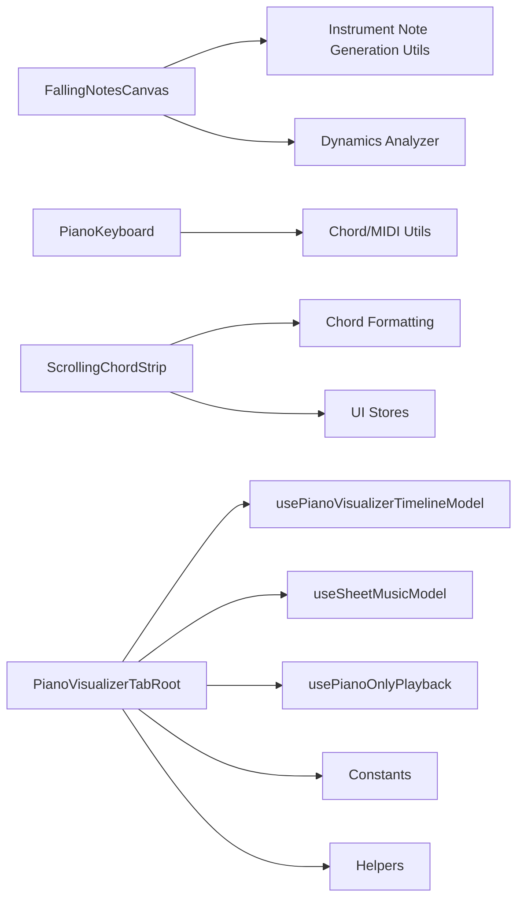

# Piano Visualizer

<cite>
**Referenced Files in This Document**
- [FallingNotesCanvas.tsx](file://src/components/piano-visualizer/FallingNotesCanvas.tsx)
- [PianoKeyboard.tsx](file://src/components/piano-visualizer/PianoKeyboard.tsx)
- [ScrollingChordStrip.tsx](file://src/components/piano-visualizer/ScrollingChordStrip.tsx)
- [PianoVisualizerTab.tsx](file://src/components/piano-visualizer/PianoVisualizerTab.tsx)
- [PianoVisualizerTabRoot.tsx](file://src/components/piano-visualizer/piano-visualizer-tab/PianoVisualizerTabRoot.tsx)
- [PianoRollPanel.tsx](file://src/components/piano-visualizer/piano-visualizer-tab/PianoRollPanel.tsx)
- [usePianoOnlyPlayback.ts](file://src/components/piano-visualizer/piano-visualizer-tab/usePianoOnlyPlayback.ts)
- [usePianoVisualizerTimelineModel.ts](file://src/components/piano-visualizer/piano-visualizer-tab/usePianoVisualizerTimelineModel.ts)
- [useSheetMusicModel.ts](file://src/components/piano-visualizer/piano-visualizer-tab/useSheetMusicModel.ts)
- [constants.ts](file://src/components/piano-visualizer/piano-visualizer-tab/constants.ts)
- [helpers.ts](file://src/components/piano-visualizer/piano-visualizer-tab/helpers.ts)
- [types.ts](file://src/components/piano-visualizer/piano-visualizer-tab/types.ts)
- [SheetMusicDisplay.tsx](file://src/components/piano-visualizer/SheetMusicDisplay.tsx)
- [SheetMusicDisplayRoot.tsx](file://src/components/piano-visualizer/sheet-music-display/SheetMusicDisplayRoot.tsx)
</cite>

## Table of Contents
1. [Introduction](#introduction)
2. [Project Structure](#project-structure)
3. [Core Components](#core-components)
4. [Architecture Overview](#architecture-overview)
5. [Detailed Component Analysis](#detailed-component-analysis)
6. [Dependency Analysis](#dependency-analysis)
7. [Performance Considerations](#performance-considerations)
8. [Troubleshooting Guide](#troubleshooting-guide)
9. [Conclusion](#conclusion)

## Introduction
This document explains the piano visualizer subsystem in ChordMiniApp. It covers the canvas-based rendering system for real-time note animation, the interactive keyboard display, and the scrolling chord strip for chord progression visualization. It also documents the PianoVisualizerTab architecture, including tabbed interface management, timeline model coordination, and sheet music integration. The guide details the MIDI note generation pipeline, real-time animation techniques, performance optimization strategies for smooth canvas rendering, piano-only playback functionality, keyboard interaction handling, responsive design considerations, and memory management and browser compatibility notes.

## Project Structure
The piano visualizer is organized around three primary rendering surfaces and a coordinating tab component:
- FallingNotesCanvas: Canvas-based falling notes piano roll with real-time animation and optional instrument-specific coloring.
- PianoKeyboard: Interactive SVG-like keyboard overlay that mirrors active notes and highlights pressed keys.
- ScrollingChordStrip: Horizontal timeline strip that scrolls in sync with playback, showing chord boxes aligned to beats.
- PianoVisualizerTabRoot: Orchestrates timeline model, sheet music model, playback hooks, and UI modes (piano roll vs sheet music).
- SheetMusicDisplay: Renders MusicXML-backed sheet music with synchronization and PDF export.

**Diagram sources**
- [PianoVisualizerTabRoot.tsx:28-327](file://src/components/piano-visualizer/piano-visualizer-tab/PianoVisualizerTabRoot.tsx#L28-L327)
- [PianoRollPanel.tsx:35-119](file://src/components/piano-visualizer/piano-visualizer-tab/PianoRollPanel.tsx#L35-L119)
- [FallingNotesCanvas.tsx:105-567](file://src/components/piano-visualizer/FallingNotesCanvas.tsx#L105-L567)
- [PianoKeyboard.tsx:44-181](file://src/components/piano-visualizer/PianoKeyboard.tsx#L44-L181)
- [ScrollingChordStrip.tsx:130-555](file://src/components/piano-visualizer/ScrollingChordStrip.tsx#L130-L555)
- [SheetMusicDisplayRoot.tsx:19-138](file://src/components/piano-visualizer/sheet-music-display/SheetMusicDisplayRoot.tsx#L19-L138)

**Section sources**
- [PianoVisualizerTabRoot.tsx:28-327](file://src/components/piano-visualizer/piano-visualizer-tab/PianoVisualizerTabRoot.tsx#L28-L327)
- [PianoRollPanel.tsx:35-119](file://src/components/piano-visualizer/piano-visualizer-tab/PianoRollPanel.tsx#L35-L119)
- [FallingNotesCanvas.tsx:105-567](file://src/components/piano-visualizer/FallingNotesCanvas.tsx#L105-L567)
- [PianoKeyboard.tsx:44-181](file://src/components/piano-visualizer/PianoKeyboard.tsx#L44-L181)
- [ScrollingChordStrip.tsx:130-555](file://src/components/piano-visualizer/ScrollingChordStrip.tsx#L130-L555)
- [SheetMusicDisplayRoot.tsx:19-138](file://src/components/piano-visualizer/sheet-music-display/SheetMusicDisplayRoot.tsx#L19-L138)

## Core Components
- FallingNotesCanvas: Renders animated falling notes on a canvas, supports instrument-specific voicing, optional melodic transcription overlay, and dynamic opacity fading. It maintains a stable animation loop and smooth time interpolation to stay in sync with audio.
- PianoKeyboard: Displays a responsive piano keyboard with white and black keys, highlighting active notes and supporting click interactions.
- ScrollingChordStrip: A horizontally scrolling timeline of chord boxes synchronized to playback time, with measure separators, roman numeral overlays, and segmentation coloring.
- PianoVisualizerTabRoot: Coordinates timeline and sheet music models, manages display modes, handles MIDI export, and wires piano-only playback.
- usePianoOnlyPlayback: Provides piano-only playback when chord playback is disabled, integrating with the soundfont service and dynamics analyzer.
- usePianoVisualizerTimelineModel: Builds chord timelines, computes roman numerals and modulations, determines instrument mix, and calculates responsive keyboard sizing.
- useSheetMusicModel: Produces MusicXML for sheet music, resolves pickups against structural padding and visible beat-grid silence, maps key sections, aligns melody, and manages computation lifecycle.

**Section sources**
- [FallingNotesCanvas.tsx:105-567](file://src/components/piano-visualizer/FallingNotesCanvas.tsx#L105-L567)
- [PianoKeyboard.tsx:44-181](file://src/components/piano-visualizer/PianoKeyboard.tsx#L44-L181)
- [ScrollingChordStrip.tsx:130-555](file://src/components/piano-visualizer/ScrollingChordStrip.tsx#L130-L555)
- [PianoVisualizerTabRoot.tsx:28-327](file://src/components/piano-visualizer/piano-visualizer-tab/PianoVisualizerTabRoot.tsx#L28-L327)
- [usePianoOnlyPlayback.ts:14-154](file://src/components/piano-visualizer/piano-visualizer-tab/usePianoOnlyPlayback.ts#L14-L154)
- [usePianoVisualizerTimelineModel.ts:48-246](file://src/components/piano-visualizer/piano-visualizer-tab/usePianoVisualizerTimelineModel.ts#L48-L246)
- [useSheetMusicModel.ts:297-659](file://src/components/piano-visualizer/piano-visualizer-tab/useSheetMusicModel.ts#L297-L659)

## Architecture Overview
The visualizer integrates tightly with analysis and playback services:
- Timeline model transforms chord grids into time-aligned events and prepares metadata for both the piano roll and chord strip.
- Sheet music model exports MusicXML from either piano events or lead sheet transcription, with key sections and explicit pickup counts resolved before export.
- Piano-only playback uses a soundfont service to play chords with dynamic velocity derived from audio dynamics.

**Diagram sources**
- [PianoVisualizerTabRoot.tsx:129-177](file://src/components/piano-visualizer/piano-visualizer-tab/PianoVisualizerTabRoot.tsx#L129-L177)
- [usePianoVisualizerTimelineModel.ts:66-245](file://src/components/piano-visualizer/piano-visualizer-tab/usePianoVisualizerTimelineModel.ts#L66-L245)
- [useSheetMusicModel.ts:572-649](file://src/components/piano-visualizer/piano-visualizer-tab/useSheetMusicModel.ts#L572-L649)
- [PianoRollPanel.tsx:82-102](file://src/components/piano-visualizer/piano-visualizer-tab/PianoRollPanel.tsx#L82-L102)
- [ScrollingChordStrip.tsx:277-289](file://src/components/piano-visualizer/ScrollingChordStrip.tsx#L277-L289)
- [usePianoOnlyPlayback.ts:43-134](file://src/components/piano-visualizer/piano-visualizer-tab/usePianoOnlyPlayback.ts#L43-L134)

## Detailed Component Analysis

### FallingNotesCanvas
FallingNotesCanvas renders animated falling notes on a canvas with:
- Real-time animation loop using requestAnimationFrame with smooth interpolation between audio timeupdates.
- Per-note geometry computation: vertical position and opacity based on time window and hit line.
- Instrument-specific visual plans when instruments are active; otherwise interval-based coloring.
- Optional melodic transcription overlay notes.
- Device pixel ratio scaling for crisp rendering on high-DPI displays.
- Active note tracking and callback to highlight keys.

**Diagram sources**
- [FallingNotesCanvas.tsx:241-443](file://src/components/piano-visualizer/FallingNotesCanvas.tsx#L241-L443)

**Section sources**
- [FallingNotesCanvas.tsx:105-567](file://src/components/piano-visualizer/FallingNotesCanvas.tsx#L105-L567)

### PianoKeyboard
PianoKeyboard builds a responsive keyboard overlay:
- Computes white and black key layouts based on MIDI range and white key width.
- Highlights active notes with optional per-note colors.
- Supports click handlers to trigger interactions.
- Uses semantic attributes for accessibility.

**Diagram sources**
- [PianoKeyboard.tsx:54-82](file://src/components/piano-visualizer/PianoKeyboard.tsx#L54-L82)

**Section sources**
- [PianoKeyboard.tsx:44-181](file://src/components/piano-visualizer/PianoKeyboard.tsx#L44-L181)

### ScrollingChordStrip
ScrollingChordStrip provides a horizontally scrolling timeline:
- Uniform beat width computed from median chord durations to prevent jitter.
- Measure separators aligned to time signature.
- Sweep line indicator and edge fades for readability.
- Dynamic roman numeral overlays and modulation markers.
- Segment-aware coloring for sections.

**Diagram sources**
- [ScrollingChordStrip.tsx:253-365](file://src/components/piano-visualizer/ScrollingChordStrip.tsx#L253-L365)

**Section sources**
- [ScrollingChordStrip.tsx:130-555](file://src/components/piano-visualizer/ScrollingChordStrip.tsx#L130-L555)

### PianoVisualizerTabRoot and Panels
PianoVisualizerTabRoot coordinates:
- Timeline model construction and sheet music model.
- Display mode switching between piano roll and sheet music.
- Active note propagation from canvas to keyboard.
- MIDI export and piano-only playback integration.

**Diagram sources**
- [PianoVisualizerTabRoot.tsx:129-177](file://src/components/piano-visualizer/piano-visualizer-tab/PianoVisualizerTabRoot.tsx#L129-L177)
- [PianoRollPanel.tsx:82-102](file://src/components/piano-visualizer/piano-visualizer-tab/PianoRollPanel.tsx#L82-L102)

**Section sources**
- [PianoVisualizerTabRoot.tsx:28-327](file://src/components/piano-visualizer/piano-visualizer-tab/PianoVisualizerTabRoot.tsx#L28-L327)
- [PianoRollPanel.tsx:35-119](file://src/components/piano-visualizer/piano-visualizer-tab/PianoRollPanel.tsx#L35-L119)

### usePianoOnlyPlayback
Manages piano-only playback:
- Enables soundfont service when chord playback is disabled and playback starts.
- Resolves current chord event for the given time and beat index.
- Computes dynamic velocity from audio dynamics and plays chords with optional segmentation and guitar voicing context.
- Grace period handling for missed chord events.

**Diagram sources**
- [usePianoOnlyPlayback.ts:43-134](file://src/components/piano-visualizer/piano-visualizer-tab/usePianoOnlyPlayback.ts#L43-L134)

**Section sources**
- [usePianoOnlyPlayback.ts:14-154](file://src/components/piano-visualizer/piano-visualizer-tab/usePianoOnlyPlayback.ts#L14-L154)

### usePianoVisualizerTimelineModel
Builds the timeline model:
- Converts chord grids into playable and notation timelines.
- Merges consecutive events and filters out silent chords.
- Determines accidental preference, time signature, BPM, and total duration.
- Builds roman numeral and modulation maps keyed by beat index.
- Computes instrument mix from mixer settings and chord playback enablement.
- Calculates responsive white key width and keyboard width.

**Diagram sources**
- [usePianoVisualizerTimelineModel.ts:66-245](file://src/components/piano-visualizer/piano-visualizer-tab/usePianoVisualizerTimelineModel.ts#L66-L245)

**Section sources**
- [usePianoVisualizerTimelineModel.ts:48-246](file://src/components/piano-visualizer/piano-visualizer-tab/usePianoVisualizerTimelineModel.ts#L48-L246)

### useSheetMusicModel
Produces sheet music:
- Resolves pickup beats considering melody, structural padding, visible grid silence, shift-only lead-ins, and first playable lead-in.
- Transposes key signatures and melody events according to pitch shift.
- Builds MusicXML from piano events or lead sheet transcription with key sections and segmentation.
- Debounces pitch shift changes and computes MusicXML on demand.

**Diagram sources**
- [useSheetMusicModel.ts:525-649](file://src/components/piano-visualizer/piano-visualizer-tab/useSheetMusicModel.ts#L525-L649)

**Section sources**
- [useSheetMusicModel.ts:297-659](file://src/components/piano-visualizer/piano-visualizer-tab/useSheetMusicModel.ts#L297-L659)

## Dependency Analysis
- FallingNotesCanvas depends on:
  - Instrument note generation utilities for visual plans and positions.
  - Dynamic velocity and signal-aware sources for consistent playback-visual synchronization.
- PianoKeyboard depends on:
  - Note mapping utilities for black/white key identification.
- ScrollingChordStrip depends on:
  - Chord formatting utilities for roman numerals and enharmonic normalization.
  - UI stores for toggles and theme.
- PianoVisualizerTabRoot depends on:
  - Timeline and sheet music models.
  - Playback hooks and audio mixer settings.
  - Constants and helpers for timing and sizing.

**Diagram sources**
- [FallingNotesCanvas.tsx:3-18](file://src/components/piano-visualizer/FallingNotesCanvas.tsx#L3-L18)
- [PianoKeyboard.tsx:3-4](file://src/components/piano-visualizer/PianoKeyboard.tsx#L3-L4)
- [ScrollingChordStrip.tsx:3-9](file://src/components/piano-visualizer/ScrollingChordStrip.tsx#L3-L9)
- [PianoVisualizerTabRoot.tsx:3-26](file://src/components/piano-visualizer/piano-visualizer-tab/PianoVisualizerTabRoot.tsx#L3-L26)
- [constants.ts:1-26](file://src/components/piano-visualizer/piano-visualizer-tab/constants.ts#L1-L26)
- [helpers.ts:1-97](file://src/components/piano-visualizer/piano-visualizer-tab/helpers.ts#L1-L97)

**Section sources**
- [FallingNotesCanvas.tsx:3-18](file://src/components/piano-visualizer/FallingNotesCanvas.tsx#L3-L18)
- [PianoKeyboard.tsx:3-4](file://src/components/piano-visualizer/PianoKeyboard.tsx#L3-L4)
- [ScrollingChordStrip.tsx:3-9](file://src/components/piano-visualizer/ScrollingChordStrip.tsx#L3-L9)
- [PianoVisualizerTabRoot.tsx:3-26](file://src/components/piano-visualizer/piano-visualizer-tab/PianoVisualizerTabRoot.tsx#L3-L26)
- [constants.ts:1-26](file://src/components/piano-visualizer/piano-visualizer-tab/constants.ts#L1-L26)
- [helpers.ts:1-97](file://src/components/piano-visualizer/piano-visualizer-tab/helpers.ts#L1-L97)

## Performance Considerations
- Animation loop:
  - Uses requestAnimationFrame with smooth interpolation between audio timeupdates to achieve consistent 60 fps note movement.
  - Avoids restarting the loop on data changes; instead, it updates refs and re-renders within the loop to prevent flicker.
- Canvas optimization:
  - Device pixel ratio scaling ensures crisp rendering on high-DPI screens.
  - Precomputes MIDI key positions and white key X positions to avoid repeated calculations.
  - Uses a single render pass per frame with minimal state changes.
- Event merging:
  - Consecutive identical chords are merged to reduce visual clutter and computation.
- Responsive sizing:
  - Keyboard width adapts to container width with bounded limits to maintain usability.
- Sheet music computation:
  - MusicXML generation is deferred and computed on a frame boundary with debounced pitch shifts to minimize jank.
- Memory management:
  - Stable refs for render functions and interpolation anchors prevent unnecessary closures and re-renders.
  - Cleanup cancels animation frames and stops instruments on unmount.

[No sources needed since this section provides general guidance]

## Troubleshooting Guide
- Notes not appearing or stuck:
  - Verify that chord events are merged and filtered for playable notes.
  - Ensure currentTime is advancing and that the animation loop is running when isPlaying is true.
- Keyboard not highlighting:
  - Confirm that active notes are being passed from FallingNotesCanvas via onActiveNotesChange and that PianoRollPanel forwards them to PianoKeyboard.
- Sheet music not rendering:
  - Check that either playable piano events or melody transcription exists; otherwise, display mode falls back to piano roll.
  - Ensure MusicXML is computed and not empty; inspect isComputing flag and loading stages.
- Piano-only playback not triggering:
  - Confirm that chord playback is disabled and isPlaying is true.
  - Verify that the current chord event is found within tolerance and that dynamics are available.

**Section sources**
- [usePianoOnlyPlayback.ts:43-134](file://src/components/piano-visualizer/piano-visualizer-tab/usePianoOnlyPlayback.ts#L43-L134)
- [PianoRollPanel.tsx:192-205](file://src/components/piano-visualizer/piano-visualizer-tab/PianoRollPanel.tsx#L192-L205)
- [useSheetMusicModel.ts:572-649](file://src/components/piano-visualizer/piano-visualizer-tab/useSheetMusicModel.ts#L572-L649)

## Conclusion
The piano visualizer combines precise timing, responsive rendering, and integrated playback to deliver a cohesive musical visualization experience. The canvas-based falling notes provide smooth real-time animation, the interactive keyboard offers tactile feedback, and the scrolling chord strip presents a clear timeline view. The tab architecture coordinates models, playback, and sheet music export, while performance optimizations ensure fluidity across devices. Together, these components form a robust foundation for both analysis-driven visualization and standalone piano playback.
