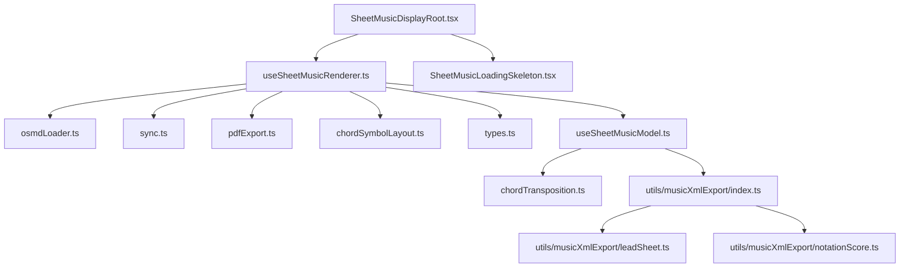
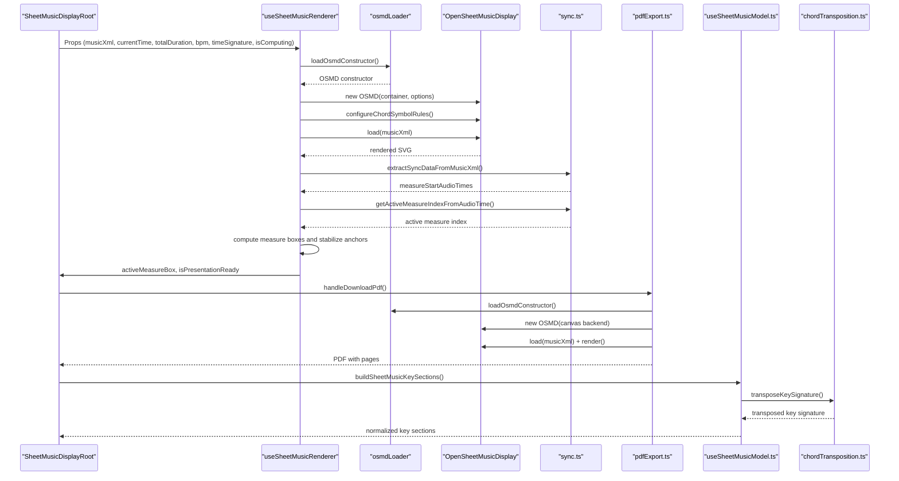
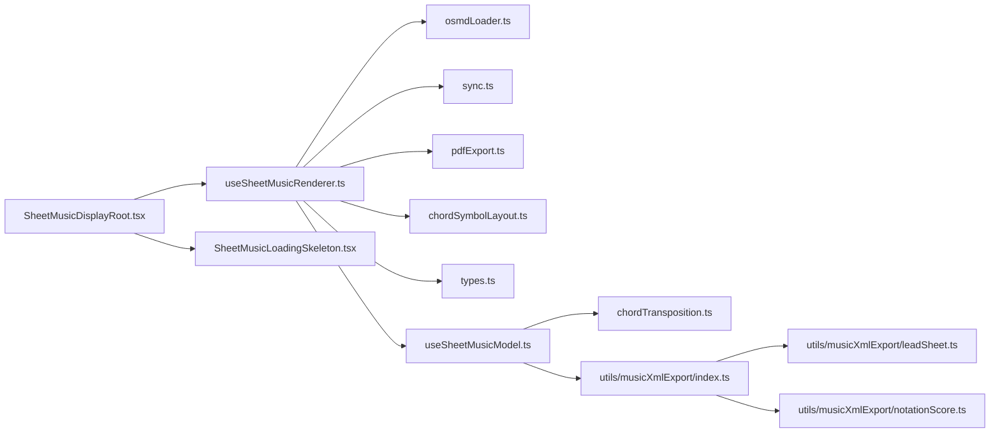
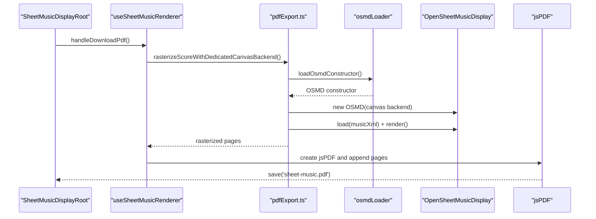
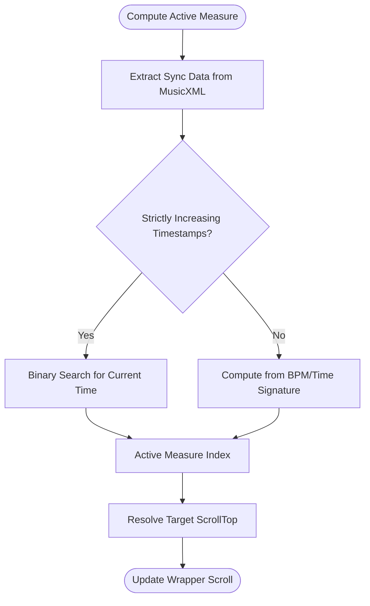
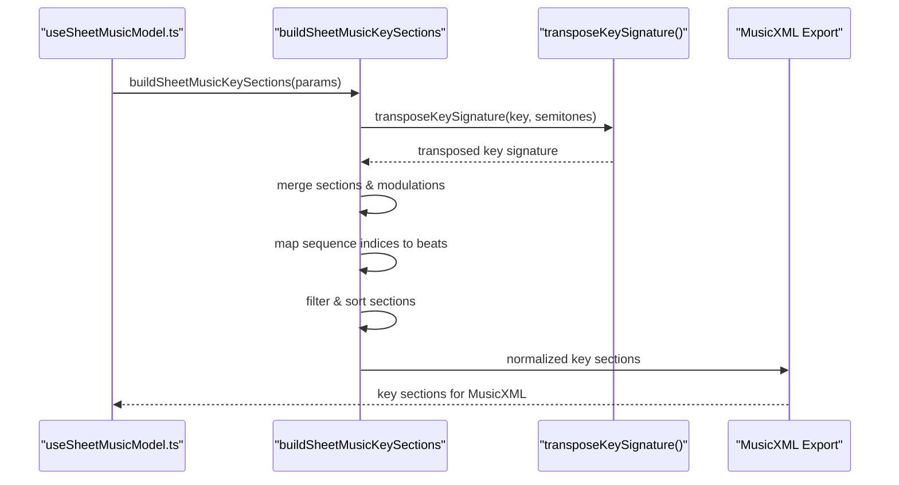

# Sheet Music Display

<cite>
**Referenced Files in This Document**
- [SheetMusicDisplayRoot.tsx](file://src/components/piano-visualizer/sheet-music-display/SheetMusicDisplayRoot.tsx)
- [useSheetMusicRenderer.ts](file://src/components/piano-visualizer/sheet-music-display/useSheetMusicRenderer.ts)
- [osmdLoader.ts](file://src/components/piano-visualizer/sheet-music-display/osmdLoader.ts)
- [sync.ts](file://src/components/piano-visualizer/sheet-music-display/sync.ts)
- [pdfExport.ts](file://src/components/piano-visualizer/sheet-music-display/pdfExport.ts)
- [chordSymbolLayout.ts](file://src/components/piano-visualizer/sheet-music-display/chordSymbolLayout.ts)
- [types.ts](file://src/components/piano-visualizer/sheet-music-display/types.ts)
- [SheetMusicLoadingSkeleton.tsx](file://src/components/piano-visualizer/sheet-music-display/SheetMusicLoadingSkeleton.tsx)
- [index.ts](file://src/utils/musicXmlExport/index.ts)
- [leadSheet.ts](file://src/utils/musicXmlExport/leadSheet.ts)
- [notationScore.ts](file://src/utils/musicXmlExport/notationScore.ts)
- [useSheetMusicModel.ts](file://src/components/piano-visualizer/piano-visualizer-tab/useSheetMusicModel.ts)
- [chordTransposition.ts](file://src/utils/chordTransposition.ts)
</cite>

## Update Summary
**Changes Made**
- Updated key signature processing section to reflect the centralized `buildSheetMusicKeySections` helper in `useSheetMusicModel.ts`
- Added documentation for the new key signature processing pipeline and its integration with the sheet music model
- Enhanced the musicXML export section to include key section normalization and resolution
- Updated the architecture overview to show the new key signature processing workflow
- Implemented context-aware stem directions for multi-voice staves (e.g., ensuring upper voice stems point up, lower voice down) for cleaner notation.
- Updated pickup measure resolution to align sheet music anacrusis rests with the visible beat grid, including stale padding metadata, shift-only lead-ins, melody onset, and explicit `pickupBeatCount` export.

## Table of Contents
1. [Introduction](#introduction)
2. [Project Structure](#project-structure)
3. [Core Components](#core-components)
4. [Architecture Overview](#architecture-overview)
5. [Detailed Component Analysis](#detailed-component-analysis)
6. [Dependency Analysis](#dependency-analysis)
7. [Performance Considerations](#performance-considerations)
8. [Troubleshooting Guide](#troubleshooting-guide)
9. [Conclusion](#conclusion)
10. [Appendices](#appendices)

## Introduction
This document explains the sheet music display system in ChordMiniApp. It covers the SheetMusicDisplayRoot component architecture, OSMD integration, rendering pipeline, synchronization with audio playback, PDF export, responsive design and navigation, chord symbol layout, musicXML parsing and rendering, and performance/memory considerations. It also describes integration with the analysis workflow and export capabilities for professional music notation.

## Project Structure
The sheet music display is implemented as a React client component with a dedicated renderer hook. It integrates OSMD for MusicXML rendering, computes measure-to-time synchronization, exports PDFs via a dedicated canvas backend, and applies chord symbol layout rules for consistent Unicode accidentals and compact text.

**Diagram sources**
- [SheetMusicDisplayRoot.tsx:1-139](file://src/components/piano-visualizer/sheet-music-display/SheetMusicDisplayRoot.tsx#L1-L139)
- [useSheetMusicRenderer.ts:1-588](file://src/components/piano-visualizer/sheet-music-display/useSheetMusicRenderer.ts#L1-L588)
- [osmdLoader.ts:1-64](file://src/components/piano-visualizer/sheet-music-display/osmdLoader.ts#L1-L64)
- [sync.ts:1-271](file://src/components/piano-visualizer/sheet-music-display/sync.ts#L1-L271)
- [pdfExport.ts:1-130](file://src/components/piano-visualizer/sheet-music-display/pdfExport.ts#L1-L130)
- [chordSymbolLayout.ts:1-99](file://src/components/piano-visualizer/sheet-music-display/chordSymbolLayout.ts#L1-L99)
- [types.ts:1-59](file://src/components/piano-visualizer/sheet-music-display/types.ts#L1-L59)
- [SheetMusicLoadingSkeleton.tsx:1-40](file://src/components/piano-visualizer/sheet-music-display/SheetMusicLoadingSkeleton.tsx#L1-L40)
- [useSheetMusicModel.ts:1-697](file://src/components/piano-visualizer/piano-visualizer-tab/useSheetMusicModel.ts#L1-L697)
- [chordTransposition.ts:151-187](file://src/utils/chordTransposition.ts#L151-L187)
- [index.ts:1-23](file://src/utils/musicXmlExport/index.ts#L1-L23)
- [leadSheet.ts:800-831](file://src/utils/musicXmlExport/leadSheet.ts#L800-L831)
- [notationScore.ts:585-639](file://src/utils/musicXmlExport/notationScore.ts#L585-L639)

**Section sources**
- [SheetMusicDisplayRoot.tsx:1-139](file://src/components/piano-visualizer/sheet-music-display/SheetMusicDisplayRoot.tsx#L1-L139)
- [useSheetMusicRenderer.ts:1-588](file://src/components/piano-visualizer/sheet-music-display/useSheetMusicRenderer.ts#L1-L588)

## Core Components
- SheetMusicDisplayRoot: The public component exposing props for MusicXML, audio time, BPM/time signature, and a busy/computing flag. It renders a loading skeleton during preparation or rendering, hosts the OSMD container, and displays a highlighted active measure overlay.
- useSheetMusicRenderer: The renderer hook that loads OSMD, configures chord symbol rules, loads and renders MusicXML, computes measure boxes, scrolls to the active measure, and handles PDF export.
- osmdLoader: OSMD constructor resolution and lazy loading from a local vendor bundle.
- sync: Extracts and caches synchronization metadata from MusicXML, counts measures, resolves measure start times, determines the active measure index, stabilizes measure anchors, and computes scroll targets.
- pdfExport: Renders MusicXML to a dedicated canvas-based OSMD instance and produces multi-page PDFs using jsPDF.
- chordSymbolLayout: Applies OSMD engraving rules to ensure Unicode accidentals and compact chord symbol text.
- types: Type definitions for OSMD constructor, measure highlight boxes, synchronization data, rasterized pages, and PDF writer interface.
- SheetMusicLoadingSkeleton: Lightweight skeleton UI for rendering stages.
- useSheetMusicModel: Orchestrates sheet music computation, including key signature processing, chord event mapping, and MusicXML export generation.
- chordTransposition: Provides key signature transposition utilities for pitch shifting operations.

**Section sources**
- [SheetMusicDisplayRoot.tsx:9-139](file://src/components/piano-visualizer/sheet-music-display/SheetMusicDisplayRoot.tsx#L9-L139)
- [useSheetMusicRenderer.ts:86-588](file://src/components/piano-visualizer/sheet-music-display/useSheetMusicRenderer.ts#L86-L588)
- [osmdLoader.ts:12-64](file://src/components/piano-visualizer/sheet-music-display/osmdLoader.ts#L12-L64)
- [sync.ts:43-271](file://src/components/piano-visualizer/sheet-music-display/sync.ts#L43-L271)
- [pdfExport.ts:33-130](file://src/components/piano-visualizer/sheet-music-display/pdfExport.ts#L33-L130)
- [chordSymbolLayout.ts:84-99](file://src/components/piano-visualizer/sheet-music-display/chordSymbolLayout.ts#L84-L99)
- [types.ts:1-59](file://src/components/piano-visualizer/sheet-music-display/types.ts#L1-L59)
- [SheetMusicLoadingSkeleton.tsx:10-40](file://src/components/piano-visualizer/sheet-music-display/SheetMusicLoadingSkeleton.tsx#L10-L40)
- [useSheetMusicModel.ts:39-130](file://src/components/piano-visualizer/piano-visualizer-tab/useSheetMusicModel.ts#L39-L130)
- [chordTransposition.ts:151-187](file://src/utils/chordTransposition.ts#L151-L187)

## Architecture Overview
The system composes a React component with a renderer hook that orchestrates OSMD rendering, measure synchronization, and PDF export. Synchronization data embedded in MusicXML enables precise scrolling to the active measure during audio playback. Key signature processing is centralized in `buildSheetMusicKeySections`, and pickup resolution is handled by `resolveSheetPickupResolution` before MusicXML export.

**Diagram sources**
- [SheetMusicDisplayRoot.tsx:19-113](file://src/components/piano-visualizer/sheet-music-display/SheetMusicDisplayRoot.tsx#L19-L113)
- [useSheetMusicRenderer.ts:372-438](file://src/components/piano-visualizer/sheet-music-display/useSheetMusicRenderer.ts#L372-L438)
- [osmdLoader.ts:33-64](file://src/components/piano-visualizer/sheet-music-display/osmdLoader.ts#L33-L64)
- [sync.ts:103-132](file://src/components/piano-visualizer/sheet-music-display/sync.ts#L103-L132)
- [pdfExport.ts:33-92](file://src/components/piano-visualizer/sheet-music-display/pdfExport.ts#L33-L92)
- [useSheetMusicModel.ts:451-467](file://src/components/piano-visualizer/piano-visualizer-tab/useSheetMusicModel.ts#L451-L467)
- [chordTransposition.ts:151-187](file://src/utils/chordTransposition.ts#L151-L187)

## Detailed Component Analysis

### SheetMusicDisplayRoot
Responsibilities:
- Accepts MusicXML and audio state props.
- Renders a loading skeleton during preparation or rendering.
- Hosts the OSMD container and highlights the active measure.
- Provides a PDF export button guarded by busy states.

Key behaviors:
- Uses memoization to avoid unnecessary re-renders by comparing computed active measure indices derived from MusicXML and audio state.
- Displays a transient overlay rectangle positioned over the active measure box computed by the renderer hook.

**Section sources**
- [SheetMusicDisplayRoot.tsx:19-139](file://src/components/piano-visualizer/sheet-music-display/SheetMusicDisplayRoot.tsx#L19-L139)

### useSheetMusicRenderer
Responsibilities:
- Load OSMD constructor and initialize OSMD with SVG backend.
- Configure chord symbol rules before and after load to ensure Unicode accidentals and compact text.
- Render MusicXML and compute measure boxes by walking the OSMD cursor.
- Stabilize measure anchors across systems and align boxes to system spans.
- Scroll the wrapper to keep the active measure visible.
- Export PDF using a dedicated canvas-based OSMD instance and jsPDF.

Rendering pipeline:
- Clears container, sets width based on wrapper size, creates OSMD instance with configured options, applies chord rules, loads MusicXML, re-applies rules, sets zoom, renders, normalizes chord text, enables and resets cursor, then computes measure boxes.
- After initial render, triggers a double requestAnimationFrame to ensure DOM readiness before computing boxes.

Synchronization:
- Extracts sync data from MusicXML and falls back to measure counting if sync data is missing.
- Computes measure start score times and active measure index from audio time.
- Computes target scrollTop to center the active measure with padding heuristics.

PDF export:
- Ensures fonts are loaded, then renders MusicXML to a hidden canvas-based OSMD instance, converts canvases to PNG pages, and appends pages to a jsPDF document sized to A4.

Accessibility:
- Uses aria-busy on the wrapper during rendering.
- Uses aria-hidden on hidden export host elements.
- Active measure overlay is marked aria-hidden to avoid screen reader focus.

Responsive design and navigation:
- Uses ResizeObserver or window resize listener to track wrapper height and adjust content padding.
- Scroll behavior uses a computed target scrollTop to keep the active measure in view with dynamic padding.

**Section sources**
- [useSheetMusicRenderer.ts:86-588](file://src/components/piano-visualizer/sheet-music-display/useSheetMusicRenderer.ts#L86-L588)

### OSMD Integration (osmdLoader)
- Resolves the OSMD constructor from the global namespace or a local vendor bundle.
- Loads the script asynchronously and exposes a promise to prevent duplicate loads.
- Validates constructor presence and rejects if the library fails to load.

**Section sources**
- [osmdLoader.ts:12-64](file://src/components/piano-visualizer/sheet-music-display/osmdLoader.ts#L12-L64)

### Synchronization and Measure Navigation (sync)
- Parses embedded synchronization metadata from MusicXML and caches it with a small fixed-size cache.
- Counts measures either from synced data or by counting <measure> tags in the first part.
- Computes measure start score times when synced data is insufficient.
- Determines the active measure index using binary search if timestamps are strictly increasing; otherwise uses a BPM/time signature calculation.
- Stabilizes measure anchor boxes by interpolating across systems and filling gaps.
- Computes a target scrollTop to keep the active measure within viewport with padding.

**Section sources**
- [sync.ts:43-271](file://src/components/piano-visualizer/sheet-music-display/sync.ts#L43-L271)

### PDF Export Pipeline (pdfExport)
- Creates a hidden, offscreen OSMD canvas backend instance with identical configuration to the main renderer.
- Renders MusicXML to canvases, converts to PNG data URLs, and appends pages to jsPDF.
- Handles portrait/landscape orientation based on the first page's aspect ratio and adds pages as needed to cover tall content.

**Section sources**
- [pdfExport.ts:33-130](file://src/components/piano-visualizer/sheet-music-display/pdfExport.ts#L33-L130)

### Chord Symbol Layout (chordSymbolLayout)
- Applies OSMD engraving rules to ensure Unicode accidentals and compact chord symbol text.
- Resets chord accidental and label dictionaries to use Unicode symbols consistently.
- Adjusts text height, spacing, overlap allowances, and offsets to improve legibility and compactness.

**Section sources**
- [chordSymbolLayout.ts:84-99](file://src/components/piano-visualizer/sheet-music-display/chordSymbolLayout.ts#L84-L99)

### Key Signature Processing Pipeline
**Updated** The key signature processing logic is centralized in the exported `buildSheetMusicKeySections` helper inside `useSheetMusicModel.ts` for improved code organization and maintainability.

Responsibilities:
- Process key signature sections from sequence corrections and modulations.
- Apply pitch transposition to key signatures based on sheet music pitch shift.
- Map sequence indices to beat positions for accurate timing.
- Generate normalized key sections suitable for MusicXML export.

Key processing steps:
- Transpose key signatures using the `transposeKeySignature` utility function from chordTransposition.ts.
- Merge sections from both key analysis sections and modulations.
- Map sequence indices to beat positions using the beat-to-chord sequence map.
- Filter out invalid entries and sort by start index.
- Remove duplicate sections and consecutive identical key signatures.
- Apply notation beat offset for proper alignment.

Integration points:
- Called from useSheetMusicModel.ts during sheet music computation.
- Used by export functions to generate MusicXML key sections.
- Integrated with the notation score builder for proper key signature resolution.

**Section sources**
- [useSheetMusicModel.ts:39-130](file://src/components/piano-visualizer/piano-visualizer-tab/useSheetMusicModel.ts#L39-L130)
- [chordTransposition.ts:151-187](file://src/utils/chordTransposition.ts#L151-L187)

### MusicXML Export Integration
**Updated** The musicXML export now includes comprehensive key signature processing through the new utility function.

The sheet music display consumes MusicXML produced by the analysis workflow. Export utilities convert lead sheet and piano visualizer data into MusicXML for downstream rendering and export.

- Index exports:
  - leadSheet export functions
  - piano visualizer export function
  - type definitions for export options and structures

- Lead sheet export:
  - Converts note and chord events to MusicXML with quantization, anacrusis handling, and measure layout.

- Notation score building:
  - Constructs generic measure events, splits notes across measures, expands durations respecting meter and tuplets, prunes orphan ties, and normalizes key sections.
  - Generates context-aware stem directions for multi-voice staves, forcing upper voice stems up and lower voice stems down to prevent collision.
  - Uses the explicit `pickupBeatCount` from the sheet music model so pickup rests reflect visible beat alignment rather than stale padding metadata or shifted silent lead-ins.
  - **Updated** Key sections are now processed through the dedicated `normalizeScoreKeySections` function which handles key signature normalization, division conversion, and accidental preference resolution.

**Section sources**
- [index.ts:1-23](file://src/utils/musicXmlExport/index.ts#L1-L23)
- [leadSheet.ts:800-831](file://src/utils/musicXmlExport/leadSheet.ts#L800-L831)
- [notationScore.ts:585-639](file://src/utils/musicXmlExport/notationScore.ts#L585-L639)
- [notationScore.ts:734-816](file://src/utils/musicXmlExport/notationScore.ts#L734-L816)

### Integration with Analysis Workflow
- The piano visualizer tab conditionally enables sheet music display when playable piano chords or melody transcription exists.
- The sheet music model coordinates computation requests and debounces pitch shift updates to keep the display synchronized with audio playback.
- **Updated** Key signature processing is now handled through the dedicated utility function, improving maintainability and separation of concerns.

**Section sources**
- [useSheetMusicModel.ts:297-332](file://src/components/piano-visualizer/piano-visualizer-tab/useSheetMusicModel.ts#L297-L332)
- [useSheetMusicModel.ts:545-580](file://src/components/piano-visualizer/piano-visualizer-tab/useSheetMusicModel.ts#L545-L580)

## Dependency Analysis

**Diagram sources**
- [SheetMusicDisplayRoot.tsx:1-139](file://src/components/piano-visualizer/sheet-music-display/SheetMusicDisplayRoot.tsx#L1-L139)
- [useSheetMusicRenderer.ts:1-588](file://src/components/piano-visualizer/sheet-music-display/useSheetMusicRenderer.ts#L1-L588)
- [osmdLoader.ts:1-64](file://src/components/piano-visualizer/sheet-music-display/osmdLoader.ts#L1-L64)
- [sync.ts:1-271](file://src/components/piano-visualizer/sheet-music-display/sync.ts#L1-L271)
- [pdfExport.ts:1-130](file://src/components/piano-visualizer/sheet-music-display/pdfExport.ts#L1-L130)
- [chordSymbolLayout.ts:1-99](file://src/components/piano-visualizer/sheet-music-display/chordSymbolLayout.ts#L1-L99)
- [types.ts:1-59](file://src/components/piano-visualizer/sheet-music-display/types.ts#L1-L59)
- [SheetMusicLoadingSkeleton.tsx:1-40](file://src/components/piano-visualizer/sheet-music-display/SheetMusicLoadingSkeleton.tsx#L1-L40)
- [useSheetMusicModel.ts:1-697](file://src/components/piano-visualizer/piano-visualizer-tab/useSheetMusicModel.ts#L1-L697)
- [chordTransposition.ts:151-187](file://src/utils/chordTransposition.ts#L151-L187)
- [index.ts:1-23](file://src/utils/musicXmlExport/index.ts#L1-L23)
- [leadSheet.ts:800-831](file://src/utils/musicXmlExport/leadSheet.ts#L800-L831)
- [notationScore.ts:585-639](file://src/utils/musicXmlExport/notationScore.ts#L585-L639)

**Section sources**
- [SheetMusicDisplayRoot.tsx:1-139](file://src/components/piano-visualizer/sheet-music-display/SheetMusicDisplayRoot.tsx#L1-L139)
- [useSheetMusicRenderer.ts:1-588](file://src/components/piano-visualizer/sheet-music-display/useSheetMusicRenderer.ts#L1-L588)

## Performance Considerations
- Rendering lifecycle:
  - Double requestAnimationFrame after OSMD render to ensure DOM readiness before measuring and computing boxes.
  - Clears container and recomputes width based on wrapper size to avoid layout thrashing.
- Measure box computation:
  - Iterates OSMD cursor systematically to locate measure positions, with safety limits to prevent infinite loops.
  - Stabilizes boxes across systems and aligns groups to reduce jitter during scroll.
- Synchronization:
  - Caches extracted sync data with a bounded cache to avoid repeated parsing.
  - Uses binary search for strictly increasing timestamps; otherwise falls back to BPM/time signature calculation.
- PDF export:
  - Uses a dedicated canvas backend to render pages efficiently and converts canvases to images in a single pass.
  - Adds pages incrementally to minimize memory spikes.
- Accessibility:
  - Uses aria-busy and aria-hidden to communicate state to assistive technologies without impacting rendering.
- Browser compatibility:
  - Relies on modern APIs (ResizeObserver, requestAnimationFrame, jsPDF, Canvas.toDataURL). Ensure polyfills if targeting legacy browsers.
- **Updated** Key signature processing:
  - The dedicated utility function improves performance by centralizing key signature operations and reducing code duplication.
  - Key signature transposition is performed efficiently using the chordTransposition utility.

## Troubleshooting Guide
Common issues and remedies:
- OSMD not found:
  - Ensure the vendor script is present and the loader resolves the constructor. The loader returns null if the global is unavailable and throws if the script fails to load.
- Blank or misaligned rendering:
  - Verify that the container width is set and OSMD renders after two animation frames. Check that measure boxes are computed after presentation readiness.
- Incorrect active measure highlighting:
  - Confirm that sync data is embedded in MusicXML and that timestamps are strictly increasing. If not, the system falls back to BPM/time signature calculations.
- PDF export failures:
  - Ensure fonts are loaded before export. If fontSet.ready rejects, export continues with available fonts. Validate that at least one page is generated from the canvas backend.
- Scroll jumps or incorrect positioning:
  - The system computes a target scrollTop with padding heuristics. If measure boxes are unstable, stabilization logic interpolates across systems to smooth transitions.
- **Updated** Key signature issues:
  - Verify that key signatures are properly transposed when pitch shifting is applied. Check the `transposeKeySignature` function for proper key signature parsing and transposition.
  - Ensure that key sections are properly normalized and sorted before export to MusicXML.
- Incorrect pickup rests or stem directions:
  - If pickup measures show too many or too few leading rests, check `resolveSheetPickupResolution` in `useSheetMusicModel`. It reconciles structural padding, visible grid silence, shift-only lead-ins, first playable chord beats, and melody onset before passing `pickupBeatCount` to MusicXML export.
  - For overlapping stems in complex chords, ensure the multi-voice logic correctly identifies the top and bottom voice boundaries.

**Section sources**
- [osmdLoader.ts:33-64](file://src/components/piano-visualizer/sheet-music-display/osmdLoader.ts#L33-L64)
- [useSheetMusicRenderer.ts:416-438](file://src/components/piano-visualizer/sheet-music-display/useSheetMusicRenderer.ts#L416-L438)
- [sync.ts:103-132](file://src/components/piano-visualizer/sheet-music-display/sync.ts#L103-L132)
- [pdfExport.ts:515-572](file://src/components/piano-visualizer/sheet-music-display/pdfExport.ts#L515-L572)
- [useSheetMusicModel.ts:39-130](file://src/components/piano-visualizer/piano-visualizer-tab/useSheetMusicModel.ts#L39-L130)
- [chordTransposition.ts:151-187](file://src/utils/chordTransposition.ts#L151-L187)

## Conclusion
The sheet music display system integrates OSMD with a robust renderer hook that manages MusicXML loading, measure synchronization, responsive layout, and PDF export. It ensures consistent chord symbol rendering, smooth scrolling to the active measure, and accessible UI states. The system is designed to scale to larger scores by stabilizing measure anchors, caching sync data, and using efficient canvas-based PDF generation.

**Updated** The recent centralization of key signature processing in `buildSheetMusicKeySections` and pickup resolution in `resolveSheetPickupResolution` improves code organization, maintainability, and alignment between the beat grid and rendered sheet music.

## Appendices

### Sequence: PDF Export Flow

**Diagram sources**
- [SheetMusicDisplayRoot.tsx:58-75](file://src/components/piano-visualizer/sheet-music-display/SheetMusicDisplayRoot.tsx#L58-L75)
- [useSheetMusicRenderer.ts:503-572](file://src/components/piano-visualizer/sheet-music-display/useSheetMusicRenderer.ts#L503-L572)
- [pdfExport.ts:33-130](file://src/components/piano-visualizer/sheet-music-display/pdfExport.ts#L33-L130)
- [osmdLoader.ts:33-64](file://src/components/piano-visualizer/sheet-music-display/osmdLoader.ts#L33-L64)

### Flowchart: Active Measure Computation

**Diagram sources**
- [sync.ts:103-132](file://src/components/piano-visualizer/sheet-music-display/sync.ts#L103-L132)
- [sync.ts:213-270](file://src/components/piano-visualizer/sheet-music-display/sync.ts#L213-L270)

### Sequence: Key Signature Processing Pipeline
**New** The key signature processing pipeline has been extracted into a dedicated utility function for improved organization and maintainability.

**Diagram sources**
- [useSheetMusicModel.ts:39-130](file://src/components/piano-visualizer/piano-visualizer-tab/useSheetMusicModel.ts#L39-L130)
- [chordTransposition.ts:151-187](file://src/utils/chordTransposition.ts#L151-L187)
