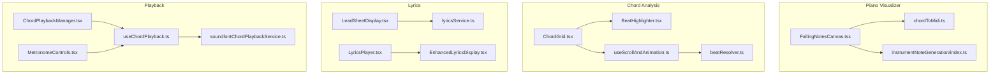
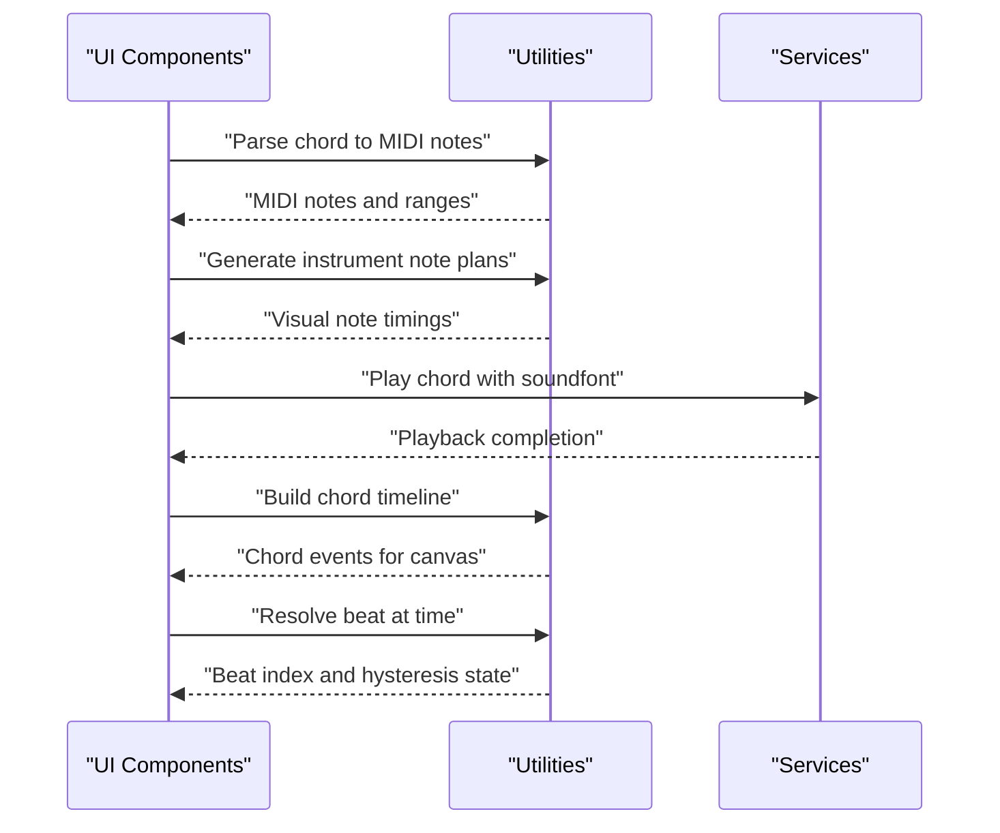
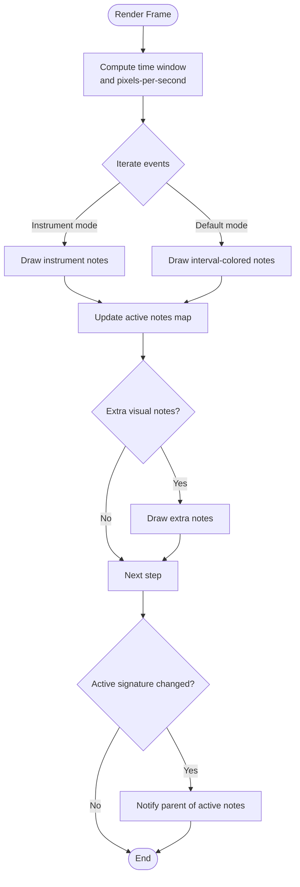
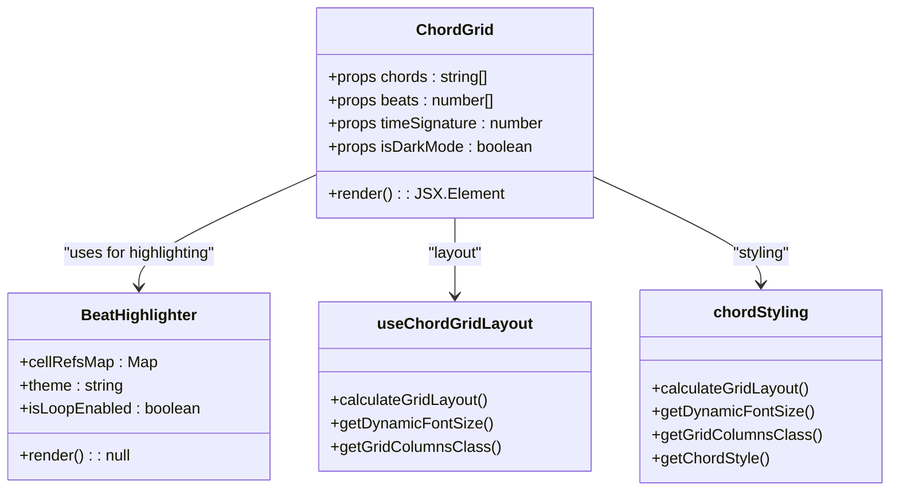
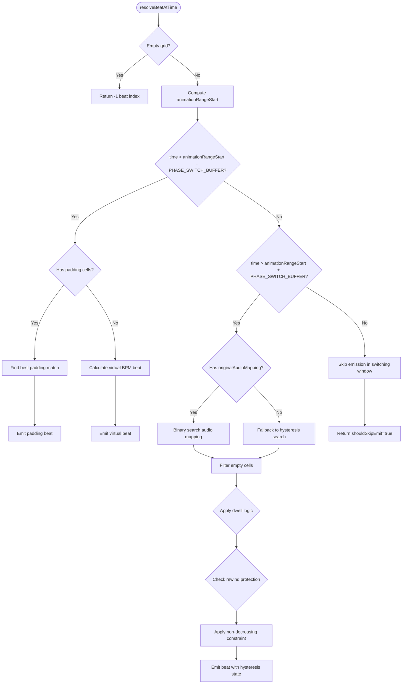
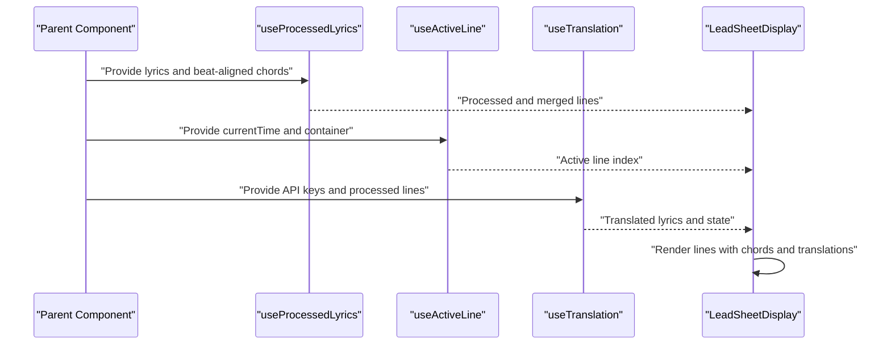
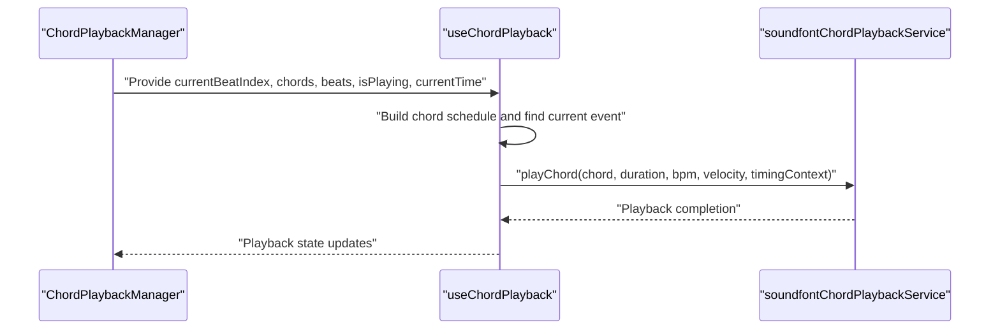
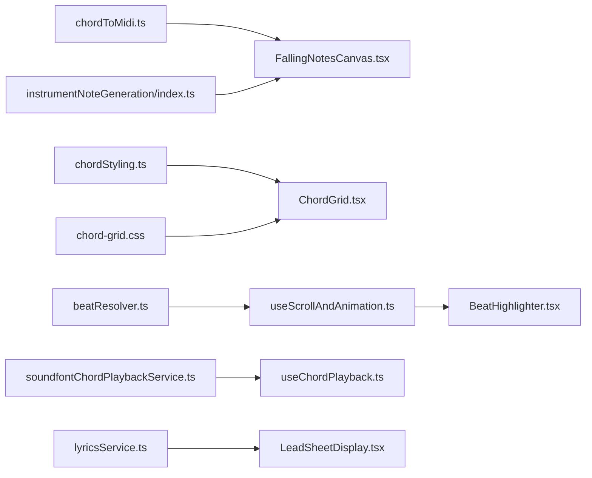

# Visualization and User Interface

<cite>
**Referenced Files in This Document**
- [FallingNotesCanvas.tsx](file://src/components/piano-visualizer/FallingNotesCanvas.tsx)
- [LeadSheetDisplay.tsx](file://src/components/chord-analysis/LeadSheetDisplay.tsx)
- [ChordGrid.tsx](file://src/components/chord-analysis/ChordGrid.tsx)
- [EnhancedLyricsDisplay.tsx](file://src/components/lyrics/EnhancedLyricsDisplay.tsx)
- [LyricsPlayer.tsx](file://src/components/lyrics/LyricsPlayer.tsx)
- [ChordPlaybackManager.tsx](file://src/components/chord-playback/ChordPlaybackManager.tsx)
- [MetronomeControls.tsx](file://src/components/chord-playback/MetronomeControls.tsx)
- [useChordPlayback.ts](file://src/hooks/chord-playback/useChordPlayback.ts)
- [useChordGridLayout.ts](file://src/hooks/chord-analysis/useChordGridLayout.ts)
- [useScrollAndAnimation.ts](file://src/hooks/scroll/useScrollAndAnimation.ts)
- [beatResolver.ts](file://src/utils/beatResolver.ts)
- [BeatHighlighter.tsx](file://src/components/chord-analysis/BeatHighlighter.tsx)
- [chordStyling.ts](file://src/utils/chordStyling.ts)
- [chordToMidi.ts](file://src/utils/chordToMidi.ts)
- [instrumentNoteGeneration/index.ts](file://src/utils/instrumentNoteGeneration/index.ts)
- [soundfontChordPlaybackService.ts](file://src/services/chord-playback/soundfontChordPlaybackService.ts)
- [chord-grid.css](file://src/styles/chord-grid.css)
- [lyricsService.ts](file://src/services/lyrics/lyricsService.ts)
</cite>

## Update Summary
**Changes Made**
- Added comprehensive documentation for the new beat resolver utility that provides pure function implementation for beat detection and hysteresis smoothing
- Updated the scroll and animation system to integrate the beat resolver for improved performance and reliability
- Documented the sophisticated binary search algorithms and hysteresis smoothing mechanisms
- Added detailed coverage of padding cells, shift cells, and empty chord filtering
- Enhanced the architecture overview to reflect the separation of concerns between pure utilities and React hooks

## Table of Contents
1. [Introduction](#introduction)
2. [Project Structure](#project-structure)
3. [Core Components](#core-components)
4. [Architecture Overview](#architecture-overview)
5. [Detailed Component Analysis](#detailed-component-analysis)
6. [Dependency Analysis](#dependency-analysis)
7. [Performance Considerations](#performance-considerations)
8. [Troubleshooting Guide](#troubleshooting-guide)
9. [Conclusion](#conclusion)

## Introduction
This document explains the visualization and user interface components in ChordMiniApp with a focus on:
- Piano visualizer with canvas-based falling notes rendering, real-time animation, MIDI note generation, and performance optimizations
- Chord analysis grid with beat highlighting, chord progression visualization, and interactive controls
- Lead sheet display with synchronized lyrics rendering, export pathways, and accessibility features
- Chord playback system with metronome control, pitch shifting, loop playback, and instrument selection
- **NEW**: Beat resolver utility with pure function implementation for beat detection and hysteresis smoothing
- Styling architecture, responsive design, and accessibility compliance

## Project Structure
The UI is organized around feature-focused components and shared utilities:
- Piano visualizer: canvas rendering, MIDI conversion, and instrument note generation
- Chord analysis: grid layout, beat highlighting, and chord progression visualization
- **NEW**: Beat resolver: pure function utilities for beat detection, hysteresis smoothing, and timing analysis
- Lyrics: synchronized display, timing, translation, and export pathways
- Playback: soundfont-based chord playback, metronome, and loop controls
- Styling: responsive grid layout, CSS-based beat highlighting, and theme-aware components

**Diagram sources**
- [FallingNotesCanvas.tsx:105-568](file://src/components/piano-visualizer/FallingNotesCanvas.tsx#L105-L568)
- [ChordGrid.tsx:178-831](file://src/components/chord-analysis/ChordGrid.tsx#L178-L831)
- [BeatHighlighter.tsx:12-44](file://src/components/chord-analysis/BeatHighlighter.tsx#L12-L44)
- [useScrollAndAnimation.ts:83-488](file://src/hooks/scroll/useScrollAndAnimation.ts#L83-L488)
- [beatResolver.ts:1-469](file://src/utils/beatResolver.ts#L1-L469)
- [LeadSheetDisplay.tsx:59-239](file://src/components/chord-analysis/LeadSheetDisplay.tsx#L59-L239)
- [EnhancedLyricsDisplay.tsx:14-231](file://src/components/lyrics/EnhancedLyricsDisplay.tsx#L14-L231)
- [LyricsPlayer.tsx:16-203](file://src/components/lyrics/LyricsPlayer.tsx#L16-L203)
- [ChordPlaybackManager.tsx:55-123](file://src/components/chord-playback/ChordPlaybackManager.tsx#L55-L123)
- [MetronomeControls.tsx:12-138](file://src/components/chord-playback/MetronomeControls.tsx#L12-L138)
- [useChordPlayback.ts:250-739](file://src/hooks/chord-playback/useChordPlayback.ts#L250-L739)
- [useChordGridLayout.ts:8-124](file://src/hooks/chord-analysis/useChordGridLayout.ts#L8-L124)
- [chordStyling.ts:1-270](file://src/utils/chordStyling.ts#L1-L270)
- [chordToMidi.ts:1-383](file://src/utils/chordToMidi.ts#L1-L383)
- [instrumentNoteGeneration/index.ts:1-38](file://src/utils/instrumentNoteGeneration/index.ts#L1-L38)
- [soundfontChordPlaybackService.ts:64-716](file://src/services/chord-playback/soundfontChordPlaybackService.ts#L64-L716)
- [chord-grid.css:1-92](file://src/styles/chord-grid.css#L1-L92)
- [lyricsService.ts:72-197](file://src/services/lyrics/lyricsService.ts#L72-L197)

**Section sources**
- [FallingNotesCanvas.tsx:105-568](file://src/components/piano-visualizer/FallingNotesCanvas.tsx#L105-L568)
- [ChordGrid.tsx:178-831](file://src/components/chord-analysis/ChordGrid.tsx#L178-L831)
- [BeatHighlighter.tsx:12-44](file://src/components/chord-analysis/BeatHighlighter.tsx#L12-L44)
- [useScrollAndAnimation.ts:83-488](file://src/hooks/scroll/useScrollAndAnimation.ts#L83-L488)
- [beatResolver.ts:1-469](file://src/utils/beatResolver.ts#L1-L469)
- [LeadSheetDisplay.tsx:59-239](file://src/components/chord-analysis/LeadSheetDisplay.tsx#L59-L239)
- [EnhancedLyricsDisplay.tsx:14-231](file://src/components/lyrics/EnhancedLyricsDisplay.tsx#L14-L231)
- [LyricsPlayer.tsx:16-203](file://src/components/lyrics/LyricsPlayer.tsx#L16-L203)
- [ChordPlaybackManager.tsx:55-123](file://src/components/chord-playback/ChordPlaybackManager.tsx#L55-L123)
- [MetronomeControls.tsx:12-138](file://src/components/chord-playback/MetronomeControls.tsx#L12-L138)
- [useChordPlayback.ts:250-739](file://src/hooks/chord-playback/useChordPlayback.ts#L250-L739)
- [useChordGridLayout.ts:8-124](file://src/hooks/chord-analysis/useChordGridLayout.ts#L8-L124)
- [chordStyling.ts:1-270](file://src/utils/chordStyling.ts#L1-L270)
- [chordToMidi.ts:1-383](file://src/utils/chordToMidi.ts#L1-L383)
- [instrumentNoteGeneration/index.ts:1-38](file://src/utils/instrumentNoteGeneration/index.ts#L1-L38)
- [soundfontChordPlaybackService.ts:64-716](file://src/services/chord-playback/soundfontChordPlaybackService.ts#L64-L716)
- [chord-grid.css:1-92](file://src/styles/chord-grid.css#L1-L92)
- [lyricsService.ts:72-197](file://src/services/lyrics/lyricsService.ts#L72-L197)

## Core Components
- Piano Visualizer (FallingNotesCanvas)
  - Renders falling notes on a canvas with precise timing, device pixel ratio scaling, and optional instrument-specific coloring
  - Integrates MIDI note generation and instrument note plans for realistic note scheduling
  - Implements smooth playback interpolation and drift correction for audio-video sync
- Chord Analysis Grid (ChordGrid)
  - Displays chord progression with responsive grid layout, beat highlighting, and interactive controls
  - **NEW**: Integrated with BeatHighlighter for CSS-based beat highlighting without React re-renders
  - Provides segmentation-aware coloring, loop selection, and Roman numeral analysis
- **NEW**: Beat Resolver (beatResolver)
  - Pure function implementation for beat detection and hysteresis smoothing
  - Sophisticated binary search algorithms for timing analysis and beat selection
  - Comprehensive handling of padding cells, shift cells, and empty chord filtering
  - Replaces the previous in-hook cascade with isolated, testable logic
- Lead Sheet Display (LeadSheetDisplay)
  - Renders synchronized lyrics with chords positioned above words, dynamic styling, and translation support
- Chord Playback Manager (ChordPlaybackManager)
  - Coordinates chord playback with pitch shift transposition and instrument selection
- Metronome Controls (MetronomeControls)
  - Provides metronome enablement, track mode selection, and popover configuration
- Lyrics Player (LyricsPlayer)
  - Combines YouTube player with synchronized lyrics display and seek controls

**Section sources**
- [FallingNotesCanvas.tsx:105-568](file://src/components/piano-visualizer/FallingNotesCanvas.tsx#L105-L568)
- [ChordGrid.tsx:178-831](file://src/components/chord-analysis/ChordGrid.tsx#L178-L831)
- [BeatHighlighter.tsx:12-44](file://src/components/chord-analysis/BeatHighlighter.tsx#L12-L44)
- [beatResolver.ts:1-469](file://src/utils/beatResolver.ts#L1-L469)
- [LeadSheetDisplay.tsx:59-239](file://src/components/chord-analysis/LeadSheetDisplay.tsx#L59-L239)
- [ChordPlaybackManager.tsx:55-123](file://src/components/chord-playback/ChordPlaybackManager.tsx#L55-L123)
- [MetronomeControls.tsx:12-138](file://src/components/chord-playback/MetronomeControls.tsx#L12-L138)
- [LyricsPlayer.tsx:16-203](file://src/components/lyrics/LyricsPlayer.tsx#L16-L203)

## Architecture Overview
The visualization pipeline connects UI components with shared utilities and services:
- Canvas rendering relies on MIDI parsing and instrument note generation
- Grid layout and styling leverage responsive utilities and CSS-based highlighting
- **NEW**: Beat resolution is now handled by a pure utility function that can be unit-tested independently
- Playback integrates with audio services and dynamic velocity computation
- Lyrics synchronization uses external services with fallback strategies

**Diagram sources**
- [chordToMidi.ts:227-383](file://src/utils/chordToMidi.ts#L227-L383)
- [instrumentNoteGeneration/index.ts:17-23](file://src/utils/instrumentNoteGeneration/index.ts#L17-L23)
- [soundfontChordPlaybackService.ts:192-287](file://src/services/chord-playback/soundfontChordPlaybackService.ts#L192-L287)
- [FallingNotesCanvas.tsx:180-237](file://src/components/piano-visualizer/FallingNotesCanvas.tsx#L180-L237)
- [beatResolver.ts:208-468](file://src/utils/beatResolver.ts#L208-L468)

## Detailed Component Analysis

### Piano Visualizer: FallingNotesCanvas
- Rendering model
  - Canvas-based animation with device pixel ratio scaling for crisp visuals
  - Time-windowed rendering with look-ahead and trail to balance responsiveness and performance
  - Per-frame geometry computation for note Y positions and opacity, with early exit for off-screen notes
- Timing and synchronization
  - Smooth playback interpolation using requestAnimationFrame with audio time anchors
  - Drift correction blending to maintain sync with audio time updates
- MIDI and instrument integration
  - Converts chords to MIDI notes and computes per-note positions on the keyboard
  - Supports instrument-specific note plans and dynamic coloring when instruments are active
- Performance optimizations
  - Memoized key position lookups and precomputed note positions
  - Stable render function reference to avoid animation loop restarts
  - Active notes signature caching to minimize parent callbacks

**Diagram sources**
- [FallingNotesCanvas.tsx:241-443](file://src/components/piano-visualizer/FallingNotesCanvas.tsx#L241-L443)

**Section sources**
- [FallingNotesCanvas.tsx:105-568](file://src/components/piano-visualizer/FallingNotesCanvas.tsx#L105-L568)
- [chordToMidi.ts:227-383](file://src/utils/chordToMidi.ts#L227-L383)
- [instrumentNoteGeneration/index.ts:17-23](file://src/utils/instrumentNoteGeneration/index.ts#L17-L23)

### Chord Analysis Grid: ChordGrid
- Grid layout and responsiveness
  - Responsive measures-per-row calculation with constraints for readability and touch targets
  - Dynamic font sizing and grid column classes derived from time signature
- Beat highlighting and interactivity
  - **NEW**: CSS-based beat highlighting via BeatHighlighter component that subscribes to global state
  - Eliminates React re-renders on beat changes by using direct DOM manipulation
  - Loop range selection and modulation markers with inline styles
- Data processing and labeling
  - Builds chord durations from beat timestamps and merges consecutive identical chords
  - Supports segmentation blocks with accent colors and label overflow calculations
- Accessibility and styling
  - Theme-aware styling with dark mode variants
  - Clear visual hierarchy for pickup beats, alignment padding, and empty cells

**Diagram sources**
- [ChordGrid.tsx:178-831](file://src/components/chord-analysis/ChordGrid.tsx#L178-L831)
- [BeatHighlighter.tsx:12-44](file://src/components/chord-analysis/BeatHighlighter.tsx#L12-L44)
- [useChordGridLayout.ts:8-124](file://src/hooks/chord-analysis/useChordGridLayout.ts#L8-L124)
- [chordStyling.ts:166-270](file://src/utils/chordStyling.ts#L166-L270)

**Section sources**
- [ChordGrid.tsx:178-831](file://src/components/chord-analysis/ChordGrid.tsx#L178-L831)
- [BeatHighlighter.tsx:12-44](file://src/components/chord-analysis/BeatHighlighter.tsx#L12-L44)
- [useChordGridLayout.ts:8-124](file://src/hooks/chord-analysis/useChordGridLayout.ts#L8-L124)
- [chordStyling.ts:166-270](file://src/utils/chordStyling.ts#L166-L270)
- [chord-grid.css:1-92](file://src/styles/chord-grid.css#L1-L92)

### **NEW**: Beat Resolver: beatResolver
- Pure function architecture
  - Isolated, testable logic extracted from the previous in-hook cascade
  - No React dependencies, making it suitable for unit testing
  - Maintains identical user-visible behavior while improving maintainability
- Hysteresis smoothing and binary search algorithms
  - Sophisticated beat detection using binary search over valid beats
  - Hysteresis buffering to prevent oscillation between adjacent beats
  - Stability gating with configurable thresholds for beat confirmation
- Phase-based beat resolution
  - **PHASE 1**: Pre-model context handling for padding cells and virtual BPM estimation
  - **PHASE 2**: Model-driven resolution using original audio mapping and chord changes
  - Phase switch buffer to prevent oscillation during transition periods
- Advanced filtering and smoothing
  - Empty cell filtering to prevent highlighting of blank chord positions
  - Rewind protection to maintain beat progression during user navigation
  - Off-dwell dwell logic to maintain highlight for short periods after beat changes
- Performance optimizations
  - Binary search algorithms for O(log n) beat lookup performance
  - Memoized hysteresis state management to avoid redundant computations
  - Configurable timing tolerances and stability thresholds

**Diagram sources**
- [beatResolver.ts:208-468](file://src/utils/beatResolver.ts#L208-L468)
- [beatResolver.ts:62-132](file://src/utils/beatResolver.ts#L62-L132)
- [beatResolver.ts:138-162](file://src/utils/beatResolver.ts#L138-L162)

**Section sources**
- [beatResolver.ts:1-469](file://src/utils/beatResolver.ts#L1-L469)

### Lead Sheet Display: LeadSheetDisplay
- Synchronized lyrics rendering
  - Processes lines with chords mapped to words, with dynamic styling based on playback position
  - Supports dark/light mode with theme-aware colors and smooth scrolling to active lines
- Translation and controls
  - Integrates translation service with language selection and background updates
  - Provides font-size controls and accessibility-friendly UI
- Performance optimizations
  - Memoized character arrays to avoid repeated string splitting
  - Efficient line rendering with conditional styling and memoization

**Diagram sources**
- [LeadSheetDisplay.tsx:59-239](file://src/components/chord-analysis/LeadSheetDisplay.tsx#L59-L239)
- [lyricsService.ts:72-197](file://src/services/lyrics/lyricsService.ts#L72-L197)

**Section sources**
- [LeadSheetDisplay.tsx:59-239](file://src/components/chord-analysis/LeadSheetDisplay.tsx#L59-L239)
- [EnhancedLyricsDisplay.tsx:14-231](file://src/components/lyrics/EnhancedLyricsDisplay.tsx#L14-L231)
- [LyricsPlayer.tsx:16-203](file://src/components/lyrics/LyricsPlayer.tsx#L16-L203)
- [lyricsService.ts:72-197](file://src/services/lyrics/lyricsService.ts#L72-L197)

### Chord Playback System
- Playback orchestration
  - ChordPlaybackManager applies transposition to chord data and delegates to useChordPlayback
  - useChordPlayback builds a schedule of chord events, manages foreground/background scheduling, and coordinates soundfont playback
- Soundfont playback
  - soundfontChordPlaybackService initializes instruments, resolves render configurations, and schedules notes with dynamic velocity and sustain retrigger logic
- Controls and UX
  - MetronomeControls toggles metronome/drums and exposes track mode selection with popover UI

**Diagram sources**
- [ChordPlaybackManager.tsx:55-123](file://src/components/chord-playback/ChordPlaybackManager.tsx#L55-L123)
- [useChordPlayback.ts:250-739](file://src/hooks/chord-playback/useChordPlayback.ts#L250-L739)
- [soundfontChordPlaybackService.ts:192-287](file://src/services/chord-playback/soundfontChordPlaybackService.ts#L192-L287)

**Section sources**
- [ChordPlaybackManager.tsx:55-123](file://src/components/chord-playback/ChordPlaybackManager.tsx#L55-L123)
- [useChordPlayback.ts:250-739](file://src/hooks/chord-playback/useChordPlayback.ts#L250-L739)
- [soundfontChordPlaybackService.ts:64-716](file://src/services/chord-playback/soundfontChordPlaybackService.ts#L64-L716)
- [MetronomeControls.tsx:12-138](file://src/components/chord-playback/MetronomeControls.tsx#L12-L138)

## Dependency Analysis
- Shared utilities
  - chordToMidi: chord parsing, MIDI note generation, and timeline building
  - instrumentNoteGeneration: instrument-specific note plans and visual note generation
  - chordStyling: responsive grid layout and styling utilities
  - **NEW**: beatResolver: pure function utilities for beat detection and hysteresis smoothing
- Styles
  - chord-grid.css: CSS-based beat highlighting to avoid React re-renders
- Services
  - soundfontChordPlaybackService: production-grade soundfont playback with lazy loading and dynamic velocity
  - lyricsService: lyrics search with fallback between LRClib and Genius

**Diagram sources**
- [chordToMidi.ts:227-383](file://src/utils/chordToMidi.ts#L227-L383)
- [instrumentNoteGeneration/index.ts:17-23](file://src/utils/instrumentNoteGeneration/index.ts#L17-L23)
- [chordStyling.ts:166-270](file://src/utils/chordStyling.ts#L166-L270)
- [chord-grid.css:1-92](file://src/styles/chord-grid.css#L1-L92)
- [beatResolver.ts:1-469](file://src/utils/beatResolver.ts#L1-L469)
- [useScrollAndAnimation.ts:83-488](file://src/hooks/scroll/useScrollAndAnimation.ts#L83-L488)
- [BeatHighlighter.tsx:12-44](file://src/components/chord-analysis/BeatHighlighter.tsx#L12-L44)
- [soundfontChordPlaybackService.ts:192-287](file://src/services/chord-playback/soundfontChordPlaybackService.ts#L192-L287)
- [useChordPlayback.ts:250-739](file://src/hooks/chord-playback/useChordPlayback.ts#L250-L739)
- [lyricsService.ts:72-197](file://src/services/lyrics/lyricsService.ts#L72-L197)
- [LeadSheetDisplay.tsx:59-239](file://src/components/chord-analysis/LeadSheetDisplay.tsx#L59-L239)

**Section sources**
- [chordToMidi.ts:227-383](file://src/utils/chordToMidi.ts#L227-L383)
- [instrumentNoteGeneration/index.ts:17-23](file://src/utils/instrumentNoteGeneration/index.ts#L17-L23)
- [chordStyling.ts:166-270](file://src/utils/chordStyling.ts#L166-L270)
- [chord-grid.css:1-92](file://src/styles/chord-grid.css#L1-L92)
- [beatResolver.ts:1-469](file://src/utils/beatResolver.ts#L1-L469)
- [useScrollAndAnimation.ts:83-488](file://src/hooks/scroll/useScrollAndAnimation.ts#L83-L488)
- [BeatHighlighter.tsx:12-44](file://src/components/chord-analysis/BeatHighlighter.tsx#L12-L44)
- [soundfontChordPlaybackService.ts:192-287](file://src/services/chord-playback/soundfontChordPlaybackService.ts#L192-L287)
- [useChordPlayback.ts:250-739](file://src/hooks/chord-playback/useChordPlayback.ts#L250-L739)
- [lyricsService.ts:72-197](file://src/services/lyrics/lyricsService.ts#L72-L197)
- [LeadSheetDisplay.tsx:59-239](file://src/components/chord-analysis/LeadSheetDisplay.tsx#L59-L239)

## Performance Considerations
- Canvas rendering
  - Device pixel ratio scaling and precomputed key positions reduce redraw costs
  - Drift correction blending minimizes visual jitter during sync adjustments
- Grid rendering
  - **NEW**: CSS-based beat highlighting eliminates React re-renders on beat changes
  - Memoized layout calculations and dynamic font sizing improve responsiveness
  - BeatHighlighter component reduces DOM manipulation overhead
- **NEW**: Beat resolution performance
  - Binary search algorithms provide O(log n) beat lookup performance
  - Hysteresis smoothing prevents oscillation and reduces computational overhead
  - Pure function design enables efficient caching and memoization
- Playback
  - Foreground/background scheduling ensures continuity when the tab is inactive
  - Dynamic velocity and sustain retrigger logic optimize perceived loudness and realism
- Lyrics
  - Memoized character arrays and efficient line rendering reduce CPU usage
  - Auto-scroll throttling prevents competing smooth-scroll animations

## Troubleshooting Guide
- Canvas not rendering or blurry visuals
  - Verify device pixel ratio scaling and canvas sizing on mount
  - Ensure the animation loop is started when playback begins and canceled on unmount
- Grid highlighting not updating
  - Confirm the BeatHighlighter component is properly subscribed to global state
  - Verify CSS class application and DOM manipulation in BeatHighlighter
  - Check that the beat index attribute matches the current beat
- **NEW**: Beat resolution issues
  - Verify beatResolver utility is receiving correct input parameters
  - Check hysteresis state persistence across animation frames
  - Ensure binary search algorithms are finding valid beats in the correct time range
- Playback not triggering chords
  - Validate the chord schedule and foreground/background poller state
  - Ensure the service is initialized and volumes are non-zero
- Lyrics not synchronized
  - Confirm the lyrics service fallback logic and network availability
  - Verify time updates from the player and line matching logic

**Section sources**
- [FallingNotesCanvas.tsx:497-534](file://src/components/piano-visualizer/FallingNotesCanvas.tsx#L497-L534)
- [BeatHighlighter.tsx:12-44](file://src/components/chord-analysis/BeatHighlighter.tsx#L12-L44)
- [chord-grid.css:25-55](file://src/styles/chord-grid.css#L25-L55)
- [beatResolver.ts:208-468](file://src/utils/beatResolver.ts#L208-L468)
- [useChordPlayback.ts:366-551](file://src/hooks/chord-playback/useChordPlayback.ts#L366-L551)
- [lyricsService.ts:72-197](file://src/services/lyrics/lyricsService.ts#L72-L197)

## Conclusion
ChordMiniApp's UI combines high-performance canvas rendering, responsive grid layouts, and robust playback orchestration. **The new beat resolver utility significantly improves the reliability and maintainability of beat detection by providing pure function implementations with sophisticated hysteresis smoothing and binary search algorithms.** The separation of concerns between the pure beat resolution logic and React hooks enables better testing, debugging, and performance optimization. Shared utilities ensure consistency across visualization and playback, while CSS-based optimizations and memoization keep interactions smooth. The lyrics pipeline integrates seamlessly with external services and provides translation and export pathways. Together, these components deliver a polished, accessible, and performant user experience with enhanced beat resolution capabilities.