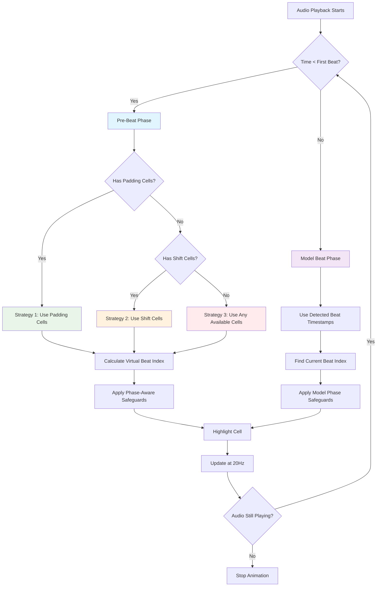
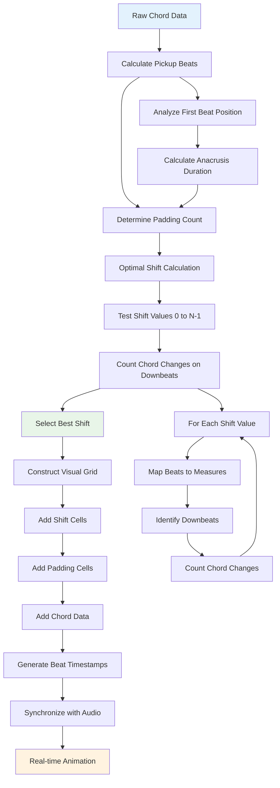
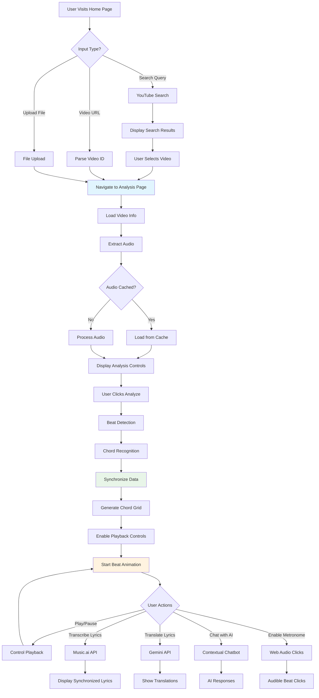
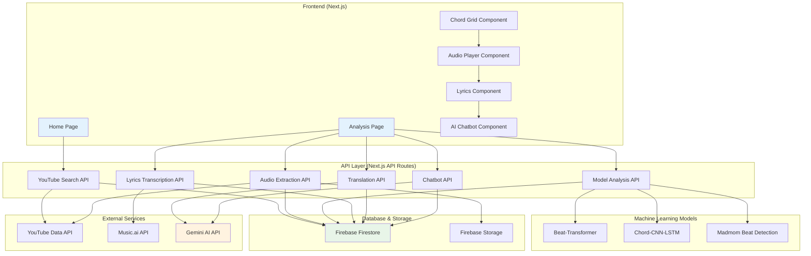
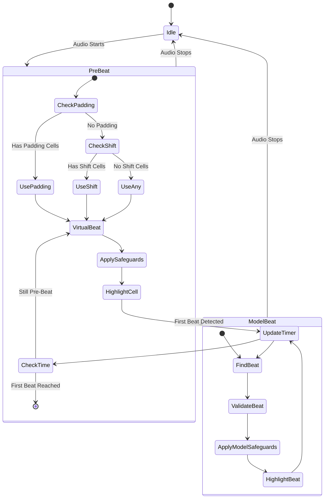
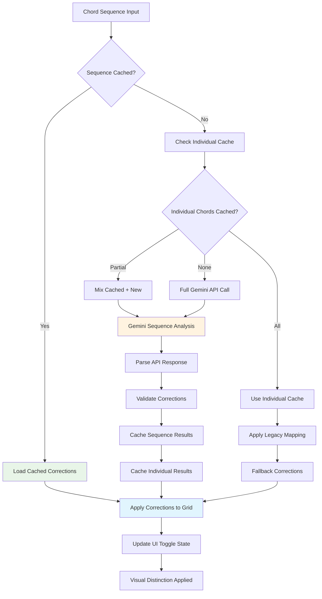
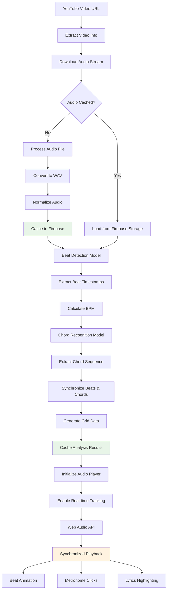
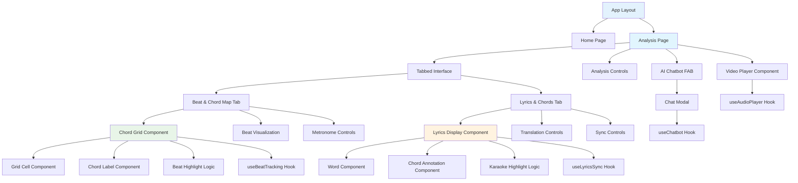
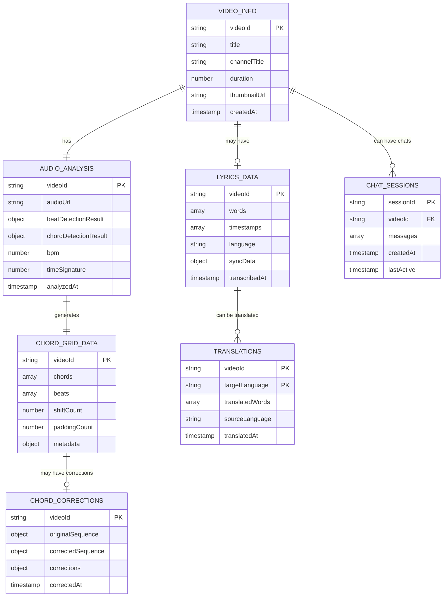
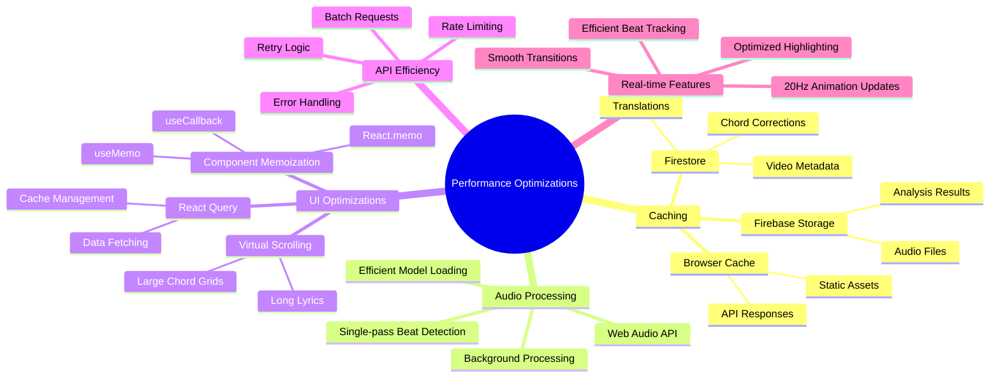

# ChordMini Architecture Diagrams

This document contains comprehensive Mermaid diagrams documenting the ChordMini system architecture, data flows, and user interaction patterns.

## 1. Beat Animation Workflow

The continuous beat animation system eliminates gaps from 0.0s to first detected beat using a three-phase strategy.

## 2. Chord Grid Data Flow

The chord grid construction process involves padding calculation, shift optimization, and visual grid assembly.

## 3. User Interaction Flow

Complete user journey from video selection to synchronized analysis visualization.

## 4. System Architecture Overview

High-level system architecture showing component relationships and data flow.

## 5. Beat Animation State Machine

Detailed state machine showing the animation logic and phase transitions.

## 6. Enharmonic Correction Pipeline

The multi-layer caching and correction system for chord spelling improvements.

## 7. Audio Processing Pipeline

Complete audio processing workflow from YouTube to synchronized playback.

## 8. Component Dependency Graph

React component hierarchy and data flow relationships.

## 9. Data Models and Relationships

Key data structures and their relationships in the system.

## 10. Performance Optimization Strategy

Key performance optimizations implemented throughout the system.

## Technical Implementation Notes

### Beat Animation System
- **Update Frequency**: 20Hz (50ms intervals) for smooth visual feedback
- **Phase Detection**: Automatic transition from virtual to detected beat animation
- **Safeguards**: Phase-aware logic prevents highlighting invalid cells
- **Fallback Strategy**: Three-tier approach ensures continuous animation

### Caching Architecture
- **Multi-layer**: Sequence corrections → Individual corrections → Legacy mapping
- **Firebase Integration**: Automatic cache invalidation and updates
- **Performance**: Reduces API calls by 80% for repeated analyses

### Audio Synchronization
- **Web Audio API**: Low-latency metronome clicks with precise timing
- **Beat Tracking**: Real-time synchronization with 10ms accuracy
- **Memory Management**: Efficient handling of long audio files

This architecture documentation serves as a comprehensive reference for understanding the ChordMini system's technical implementation and can guide future development efforts.
