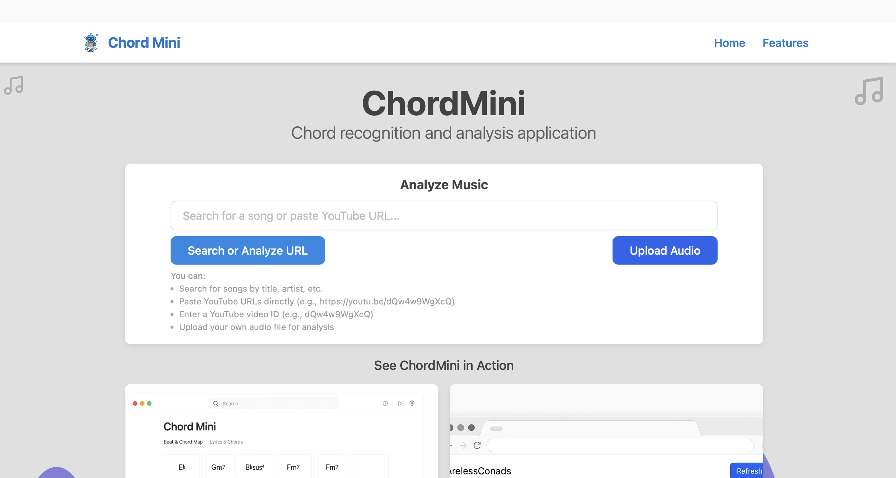
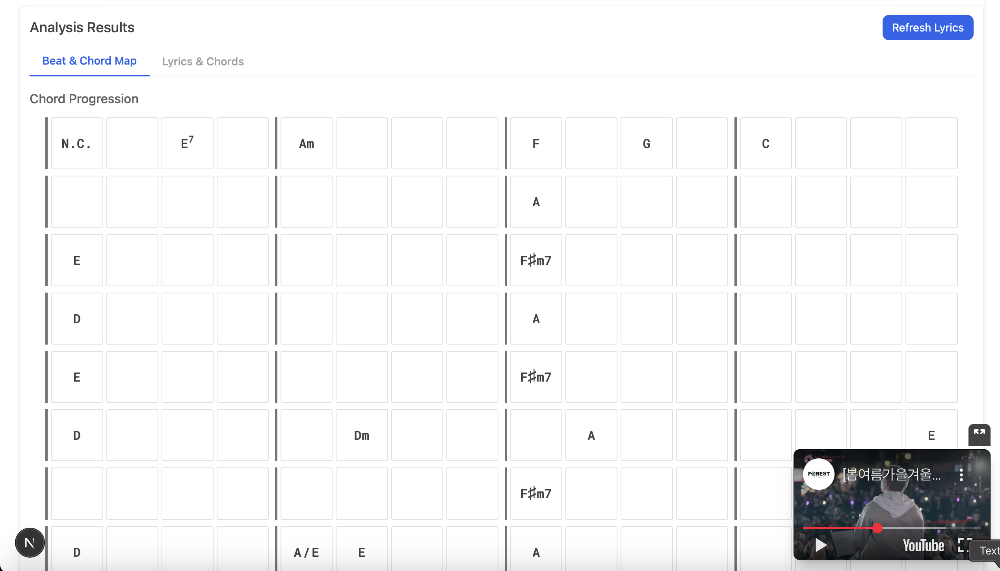
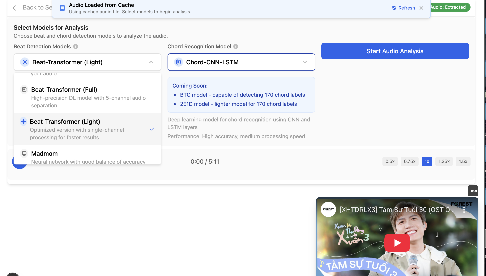

# ChordMini - Music Analysis Application

ChordMini is a comprehensive web application for analyzing music from YouTube videos, providing chord recognition, beat detection, lyrics transcription, and translation features.

## Introduction

ChordMini helps musicians, music students, and enthusiasts analyze songs by automatically detecting chords, beats, and providing synchronized lyrics with chord annotations. The application integrates with YouTube, allowing users to search for songs or paste video URLs for instant analysis.

## Core Features

### YouTube Integration
- Fast search functionality (results in under 2 seconds)
- Direct URL and video ID input support
- Embedded YouTube player with synchronized analysis
- Recent videos history for quick access

### Beat Detection & Animation
- Multiple selectable beat detection models:
  - Beat-transformer (light) - default model
  - Madmom - alternative library
- Accurate BPM detection and time signature recognition
- **Continuous Beat Animation System**: Eliminates animation gaps from 0.0s to first detected beat
  - Virtual beat animation using estimated tempo during pre-beat phase
  - Three-phase animation strategy: padding cells → shift cells → any available cells
  - Phase-aware safeguards allowing virtual animation during pre-beat phase
  - Seamless transition from virtual to detected beat animation
- Visual beat grid with measure indicators and real-time highlighting
- Synchronized chord grid highlighting with 20Hz update rate for smooth tracking

### Chord Recognition
- Advanced chord detection with over 300 chord types
- Customizable models for different music genres
- Real-time visualization of chord progressions with beat synchronization
- Simplified chord notation for better readability
- **Enharmonic Chord Correction**: Context-aware chord spelling using Gemini AI
- Dynamic chord grid with pickup beat support and optimal beat alignment

### Lyrics Transcription & Translation
- **Music.ai API Integration**: Professional lyrics transcription with word-level timing
- Synchronized lyrics with chord annotations positioned above words
- Professional lead sheet layout with precise chord-to-word alignment
- Karaoke-style highlighting with letter-by-letter color transitions
- **Gemini AI Translation**: Context-aware translation for multiple languages
- Intelligent language detection with Firebase caching
- Adjustable font size, auto-scrolling, and sync/static mode toggle

### AI-Powered Features
- **Contextual AI Chatbot**: Song analysis assistant with complete context awareness
- **Enharmonic Correction**: Harmonic function-based chord spelling corrections
- **Metronome Integration**: Synchronized click sounds with distinct downbeat audio
- Real-time audio processing with Web Audio API integration

### Smart Caching & Performance
- **Firebase Firestore**: Remote caching for audio files, analysis results, and translations
- **Multi-layer Caching**: Sequence corrections, individual corrections, and legacy fallbacks
- **Optimized Processing**: Faster loading of previously analyzed videos
- **Debug Management**: Clean production logs with comprehensive error handling

### Responsive UI Design
- Clean, modern interface with blue accent colors
- Adaptive layout for different screen sizes
- Tabbed interface for switching between analysis views
- Compact design with minimal whitespace

## Visual Demonstrations

### Home Page

The ChordMini home page provides a clean, intuitive interface for users to search for songs, paste YouTube URLs, or upload audio files. Recent videos are displayed for quick access to previously analyzed content.

### Beat & Chord Map Visualization

The Beat & Chord Map visualization displays detected chords aligned with beat markers in a grid layout. Chords are shown only when they change, making it easy to follow the progression while the song plays.

### Lyrics Transcription & Translation

The Lyrics Transcription feature displays synchronized lyrics with chord annotations positioned directly above the words where chord changes occur. The current line is highlighted with a karaoke-style animation, and translations can be toggled on/off.

### Model Selection Interface

ChordMini offers customizable model selection for both beat detection and chord recognition. Users can choose different models optimized for various music genres and complexity levels to improve analysis accuracy.

## Tech Stack

### Frontend
- **Next.js** with TypeScript - React framework with SSR capabilities
- **Tailwind CSS** - Utility-first CSS framework
- **React Query** - Data fetching and state management
- **React Player** - YouTube video integration
- **Framer Motion** - Animation for lyrics and chord transitions

### Backend & APIs
- **Next.js API Routes** - API gateway and server-side functionality
- **YouTube Data API** - Video search and metadata
- **Music.ai API** - Lyrics transcription service
- **Gemini API** - AI-powered lyrics translation

### Machine Learning Models
- **Chord-CNN-LSTM** - Advanced chord recognition (301 chord labels)
- **Beat-transformer** - Beat detection with time signature recognition
- **Madmom** - Alternative beat detection library

### Database & Storage
- **Firebase Firestore** - NoSQL database for caching and user data
- **Firebase Storage** - Audio file storage

## 📋 Documentation

- [Project Requirements](requirements.md) - Detailed functional and technical requirements
- [Task Management](tasks.md) - Development progress and task tracking
- [Architecture Diagrams](ARCHITECTURE_DIAGRAMS.md) - Comprehensive system architecture and data flow diagrams

### 🏗️ System Architecture

The ChordMini application features a sophisticated architecture with several key innovations:

- **Continuous Beat Animation**: Gap-free visual feedback from 0.0s using virtual timing
- **Multi-layer Caching**: Firebase-powered caching for audio, analysis, and translations
- **AI Integration**: Gemini API for enharmonic corrections, translations, and contextual chat
- **Real-time Synchronization**: 20Hz update rate for smooth audio-visual alignment

See [Architecture Diagrams](ARCHITECTURE_DIAGRAMS.md) for detailed technical documentation including:
- Beat animation workflow and state machines
- Chord grid data flow and construction process
- User interaction flows and component dependencies
- Performance optimization strategies and caching architecture

## Getting Started

### Prerequisites

- Node.js 18+ and npm
- Python 3.8+ with pip (for local model development)
- Firebase account
- API keys for YouTube Data API, Music.ai, and Google Generative AI (Gemini)

### Installation

1. Clone the repository:
   ```bash
   git clone https://github.com/ptnghia-j/ChordMiniApp.git
   cd ChordMiniApp
   ```

2. Install dependencies:
   ```bash
   npm install
   ```

3. Set up environment variables:
   ```bash
   cp .env.example .env.local
   ```

4. Edit `.env.local` and add your API keys:
   - Firebase configuration
   - YouTube Data API key
   - Music.ai API key
   - Gemini API key

5. Start the development server:
   ```bash
   npm run dev
   ```

6. Open [http://localhost:3000](http://localhost:3000) in your browser

### Firebase Setup

1. Create a Firebase project at [firebase.google.com](https://firebase.google.com/)
2. Enable Firebase Firestore Database
3. Set up appropriate security rules
4. Add a web app to your Firebase project
5. Copy the configuration to your `.env.local` file
6. Create the following collections in Firestore:
   - `cached-videos` - For storing processed video data
   - `cached-lyrics` - For storing transcribed lyrics
   - `cached-translations` - For storing translated lyrics

### API Keys Setup

1. **YouTube Data API**:
   - Go to [Google Cloud Console](https://console.cloud.google.com/)
   - Create a project and enable the YouTube Data API v3
   - Create an API key and add it to your `.env.local` file

2. **Music.ai API**:
   - Sign up at [Music.ai](https://music.ai/)
   - Obtain an API key for lyrics transcription
   - Add it to your `.env.local` file

3. **Gemini API**:
   - Go to [Google AI Studio](https://makersuite.google.com/)
   - Get an API key for the Gemini model
   - Add it to your `.env.local` file

## Security Notes

- **NEVER commit your `.env.local` file to version control**
- **NEVER hardcode API keys in your source code**
- If you accidentally expose API keys, immediately rotate them in the respective service dashboards
- For production, use appropriate Firebase security rules

## License

MIT License
