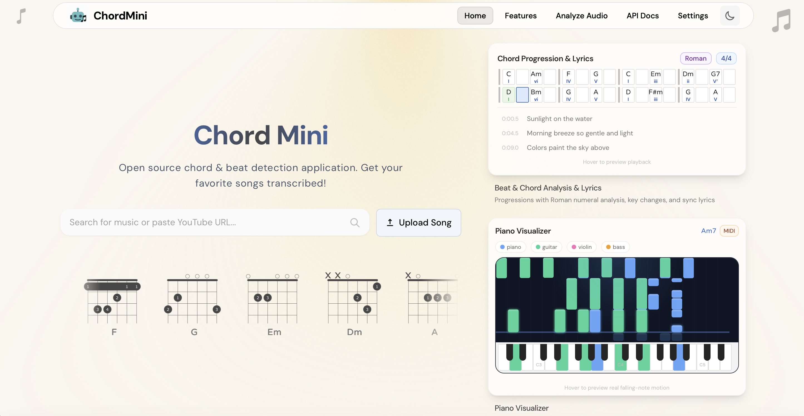
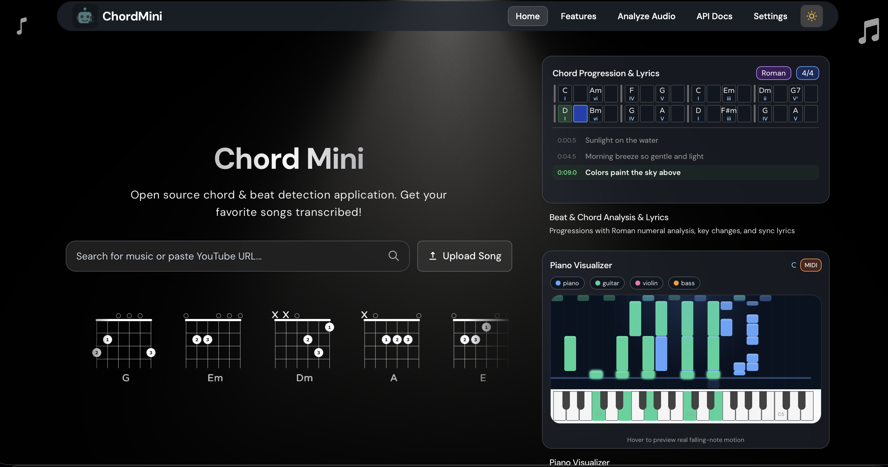
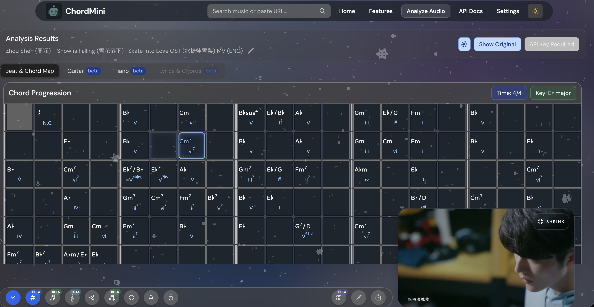
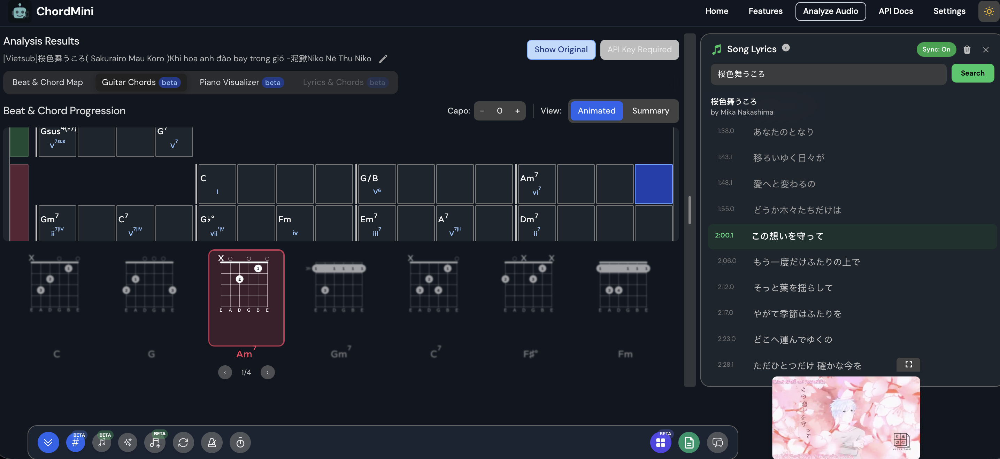
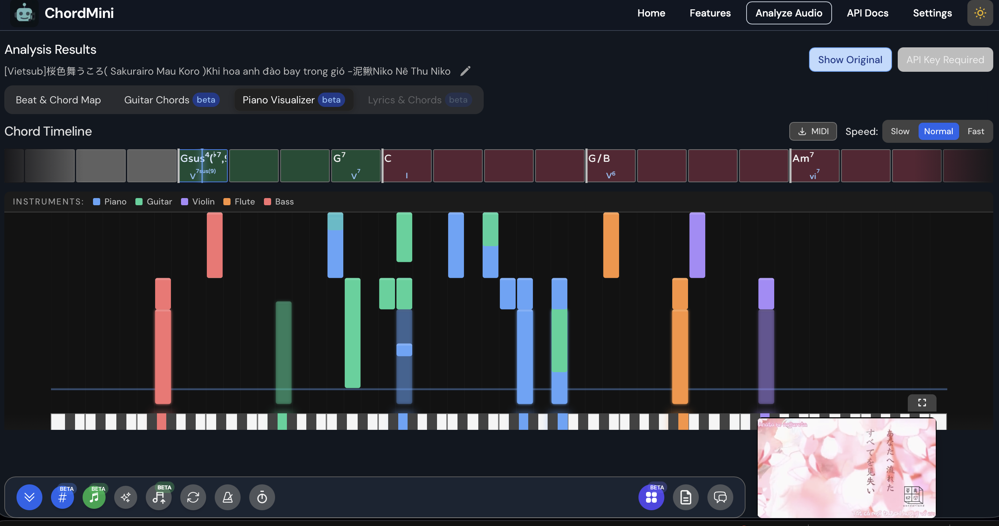
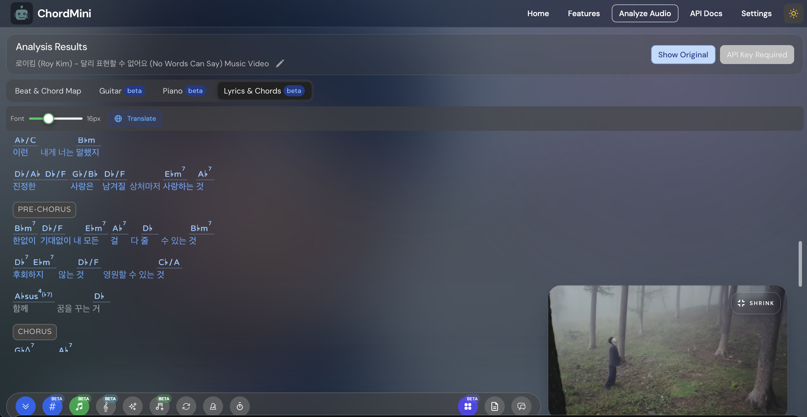

## 📄 Citation

If you use or reference ChordMini in your work, please cite:

**BibTeX:**
```bibtex
@misc{phan2026enhancingautomaticchordrecognition,
      title={Enhancing Automatic Chord Recognition via Pseudo-Labeling and Knowledge Distillation}, 
      author={Nghia Phan and Rong Jin and Gang Liu and Xiao Dong},
      year={2026},
      eprint={2602.19778},
      archivePrefix={arXiv},
      primaryClass={cs.SD},
      url={https://arxiv.org/abs/2602.19778}, 
}
```

**Plain text (for non-LaTeX users):**
> Nghia Phan, Rong Jin, Gang Liu, and Xiao Dong. "Enhancing Automatic Chord Recognition via Pseudo-Labeling and Knowledge Distillation." arXiv preprint arXiv:2602.19778, 2026. https://arxiv.org/abs/2602.19778

# ChordMini

**Advanced music analysis platform with AI-powered chord recognition, beat detection, and synchronized lyrics.**


## Features Overview

### 🏠 Homepage Interface



Clean, intuitive interface for YouTube search, URL input, and recent video access.

### 🎵 Beat & Chord Analysis


Chord progression visualization with synchronized beat detection and grid layout with add-on features: Roman Numeral Analysis, Key Modulation Signals, Simplified Chord Notation, and Enhanced Chord Correction.

### 🎵 Guitar Diagrams



Interactive guitar chord diagrams with **accurate fingering patterns** from the official @tombatossals/chords-db database, featuring multiple chord positions and synchronized beat grid integration.

### 🎹 Piano Visualizer 


Real-time piano roll visualization with falling MIDI notes synchronized to chord playback. Features a scrolling chord strip, interactive keyboard highlighting, and **MIDI file export** for importing chord progressions into any DAW.

###  🎤 Lead Sheet with AI Assistant


Synchronized lyrics transcription with AI chatbot for contextual music analysis and translation support.

## 🚀 Quick Setup

### Prerequisites
- **Node.js 18+** and **npm**
- **Python 3.9+** (for backend)
- **Firebase account** (free tier)

### Setup Steps

1. **Clone and install**
   Clone with submodules in one command (for fresh clones)
   ```bash
   git clone --recursive https://github.com/ptnghia-j/ChordMiniApp.git
   cd ChordMiniApp
   npm install
   ```

   #### Verify that submodules are populated
   ```
   ls -la python_backend/models/Beat-Transformer/
   ls -la python_backend/models/Chord-CNN-LSTM/
   ls -la python_backend/models/ChordMini/
   ```

   #### If chord recognition encounters issue with fluidsynth:
   Install FluidSynth for MIDI synthesis
   ```
      
   # --- Windows ---
   choco install fluidsynth

   # --- macOS ---
   brew install fluidsynth

   # --- Linux (Debian/Ubuntu-based) ---
   sudo apt update
   sudo apt install fluidsynth
   ```

2. **Environment setup**
   ```bash
   cp .env.example .env.local
   ```

   Edit `.env.local`:
   ```bash
   NEXT_PUBLIC_PYTHON_API_URL=http://localhost:5001
   NEXT_PUBLIC_FIREBASE_API_KEY=your_firebase_api_key
   NEXT_PUBLIC_FIREBASE_AUTH_DOMAIN=your_project.firebaseapp.com
   NEXT_PUBLIC_FIREBASE_PROJECT_ID=your_project_id
   NEXT_PUBLIC_FIREBASE_STORAGE_BUCKET=your_project.appspot.com
   NEXT_PUBLIC_FIREBASE_MESSAGING_SENDER_ID=your_sender_id
   NEXT_PUBLIC_FIREBASE_APP_ID=your_app_id
   ```

3. **Start Python backend** (Terminal 1)
   ```bash
   cd python_backend
   python -m venv myenv
   source myenv/bin/activate  # On Windows: myenv\Scripts\activate
   pip install -r requirements.txt
   python app.py
   ```

4. **Start frontend** (Terminal 2)
   ```bash
   npm run dev
   ```

5. **Open application**

   Visit [http://localhost:3000](http://localhost:3000)

---

## 🐳 Docker Deployment (Recommended for Production)

### Prerequisites
- Docker and Docker Compose installed ([Get Docker](https://docs.docker.com/get-docker/))
- Firebase account with API keys configured

### Quick Start

1. **Download configuration files**
   ```bash
   curl -O https://raw.githubusercontent.com/ptnghia-j/ChordMiniApp/main/docker-compose.prod.yml
   curl -O https://raw.githubusercontent.com/ptnghia-j/ChordMiniApp/main/.env.docker.example
   ```

2. **Configure environment**
   ```bash
   cp .env.docker.example .env.docker
   # Edit .env.docker with your API keys (see API Keys Setup section below)
   ```

3. **Start the application**
   ```bash
   docker compose -f docker-compose.prod.yml --env-file .env.docker up -d
   ```

4. **Access the application**

   Visit [http://localhost:3000](http://localhost:3000)

5. **Stop the application**
   ```bash
   docker compose -f docker-compose.prod.yml down
   ```

> **Note:** If you have Docker Compose V1 installed, use `docker-compose` (with hyphen) instead of `docker compose` (with space).

### Docker Desktop GUI (Alternative)

If you prefer using Docker Desktop GUI:
1. Open Docker Desktop
2. Go to "Images" tab and search for `ptnghia/chordminiapp-frontend` and `ptnghia/chordminiapp-backend`
3. Pull both images
4. Use the "Containers" tab to manage running containers

### Required Environment Variables

Edit `.env.docker` with these required values:
- `NEXT_PUBLIC_FIREBASE_API_KEY` - Firebase API key
- `NEXT_PUBLIC_FIREBASE_PROJECT_ID` - Firebase project ID
- `NEXT_PUBLIC_FIREBASE_STORAGE_BUCKET` - Firebase storage bucket
- `NEXT_PUBLIC_YOUTUBE_API_KEY` - YouTube Data API v3 key
- `MUSIC_AI_API_KEY` - Music.AI API key
- `GEMINI_API_KEY` - Google Gemini API key
- `GENIUS_API_KEY` - Genius API key

See the API Keys Setup section below for detailed instructions on obtaining these keys.

---

## 📋 Detailed Setup Instructions

### Firebase Setup

1. **Create Firebase project**
   - Visit [Firebase Console](https://console.firebase.google.com/)
   - Click "Create a project"
   - Follow the setup wizard

2. **Enable Firestore Database**
   - Go to "Firestore Database" in the sidebar
   - Click "Create database"
   - Choose "Start in test mode" for development

3. **Get Firebase configuration**
   - Go to Project Settings (gear icon)
   - Scroll down to "Your apps"
   - Click "Add app" → Web app
   - Copy the configuration values to your `.env.local`

4. **Create Firestore collections**

   The app uses the following Firestore collections. They are created automatically on first write (no manual creation required):
   - `transcriptions` — Beat and chord analysis results (docId: `${videoId}_${beatModel}_${chordModel}`)
   - `translations` — Lyrics translation cache (docId: cacheKey based on content hash)
   - `lyrics` — Music.ai transcription results (docId: `videoId`)
   - `keyDetections` — Musical key analysis cache (docId: cacheKey)
   - `audioFiles` — Audio file metadata and URLs (docId: `videoId`)

5. **Enable Anonymous Authentication**
   - In Firebase Console: Authentication → Sign-in method → enable Anonymous

6. **Configure Firebase Storage**
   - Set environment variable: `NEXT_PUBLIC_FIREBASE_STORAGE_BUCKET=your_project_id.appspot.com`
   - Folder structure:
     - `audio/` for audio files
     - `video/` for optional video files
   - Filename pattern requirement: filenames must include the 11-character YouTube video ID in brackets, e.g. `audio_[VIDEOID]_timestamp.mp3` (enforced by Storage rules)
   - File size limits (enforced by Storage rules):
     - Audio: up to 50MB
     - Video: up to 100MB

### API Keys Setup

#### Music.ai API
```bash
# 1. Sign up at music.ai
# 2. Get API key from dashboard
# 3. Add to .env.local
NEXT_PUBLIC_MUSIC_AI_API_KEY=your_key_here
```

#### Google Gemini API
```bash
# 1. Visit Google AI Studio
# 2. Generate API key
# 3. Add to .env.local
NEXT_PUBLIC_GEMINI_API_KEY=your_key_here
```

## 🏗️ Backend Architecture

ChordMiniApp uses a **hybrid backend architecture**:

### 🔧 Local Development Backend (Required)

For local development, you **must** run the Python backend on `localhost:5001`:

- **URL**: `http://localhost:5001`
- **Port Note**: Uses port 5001 to avoid conflict with macOS AirPlay/AirTunes service on port 5000

### ☁️ Production Backend (your VPS)

Production deployments is configured based on your VPS and url should be set in the `NEXT_PUBLIC_PYTHON_API_URL` environment variable.

#### Prerequisites

- **Python 3.9+** (Python 3.9-3.11 recommended)
- **Virtual environment** (venv or conda)
- **Git** for cloning dependencies
- **System dependencies** (varies by OS)

#### Quick Setup

1. **Navigate to backend directory**
   ```bash
   cd python_backend
   ```

2. **Create virtual environment**
   ```bash
   python -m venv myenv

   # Activate virtual environment
   # On macOS/Linux:
   source myenv/bin/activate

   # On Windows:
   myenv\Scripts\activate
   ```

3. **Install dependencies**
   ```bash
   pip install --no-cache-dir Cython>=0.29.0 numpy==1.22.4
   pip install --no-cache-dir madmom>=0.16.1
   pip install --no-cache-dir -r requirements.txt
   ```

4. **Start local backend on port 5001**
   ```bash
   python app.py
   ```

   The backend will start on `http://localhost:5001` and should display:
   ```
   Starting Flask app on port 5001
   App is ready to serve requests
   Note: Using port 5001 to avoid conflict with macOS AirPlay/AirTunes on port 5000
   ```

5. **Verify backend is running**

   Open a new terminal and test the backend:
   ```bash
   curl http://localhost:5001/health
   # Should return: {"status": "healthy"}
   ```

6. **Start frontend development server**
   ```bash
   # In the main project directory (new terminal)
   npm run dev
   ```

   The frontend will automatically connect to `http://localhost:5001` based on your `.env.local` configuration.

#### Backend Features Available Locally

- **Beat Detection**: Beat-Transformer and madmom models
- **Chord Recognition**: Chord-CNN-LSTM, BTC-SL, BTC-PL models
- **Lyrics Processing**: Genius.com integration
- **Rate Limiting**: IP-based rate limiting with Flask-Limiter
- **Audio Processing**: Support for MP3, WAV, FLAC formats

#### Environment Variables for Local Backend

Create a `.env` file in the `python_backend` directory:

```bash
# Optional: Redis URL for distributed rate limiting
REDIS_URL=redis://localhost:6379

# Optional: Genius API for lyrics
GENIUS_ACCESS_TOKEN=your_genius_token

# Flask configuration
FLASK_MAX_CONTENT_LENGTH_MB=150
CORS_ORIGINS=http://localhost:3000,http://127.0.0.1:3000
```

#### Troubleshooting Local Backend

**Backend connectivity issues:**
```bash
# 1. Verify backend is running
curl http://localhost:5001/health
# Expected: {"status": "healthy"}

# 2. Check if port 5001 is in use
lsof -i :5001  # macOS/Linux
netstat -ano | findstr :5001  # Windows

# 3. Verify environment configuration
cat .env.local | grep PYTHON_API_URL
# Expected: NEXT_PUBLIC_PYTHON_API_URL=http://localhost:5001

# 4. Check for macOS AirTunes conflict (if using port 5000)
curl -I http://localhost:5000/health
# If you see "Server: AirTunes", that's the conflict we're avoiding
```

**Frontend connection errors:**
```bash
# Check browser console for errors like:
# "Failed to fetch" or "Network Error"
# This usually means the backend is not running on port 5001

# Restart both frontend and backend:
# Terminal 1 (Backend):
cd python_backend && python app.py

# Terminal 2 (Frontend):
npm run dev
```

**Import errors:**
```bash
# Ensure virtual environment is activated
source myenv/bin/activate  # macOS/Linux
myenv\Scripts\activate     # Windows

# Reinstall dependencies
pip install -r requirements.txt
```

### Key Workflow Features

#### **Dual Input Support**
- **YouTube Integration**: URL/search → video selection → analysis
- **Direct Upload**: Audio file → blob storage → immediate analysis

#### **Environment-Aware Processing**
- **Development**: localhost:5001 Python backend with yt-dlp (avoiding macOS AirTunes port conflict)
- **Production**: Google Cloud Run backend with yt-mp3-go

#### **Intelligent Caching**
- **Firebase Cache**: Analysis results with enhanced metadata
- **Cache Hit**: Instant loading of previous analyses
- **Cache Miss**: Full ML processing pipeline

#### **ML Pipeline**
- **Parallel Processing**: Beat detection + chord recognition + key analysis
- **Multiple Models**: Beat-Transformer/madmom, Chord-CNN-LSTM/BTC variants
- **AI Integration**: Gemini AI for key detection and enharmonic corrections


### External APIs & Services
- **YouTube Search API** - [github.com/damonwonghv/youtube-search-api](https://github.com/damonwonghv/youtube-search-api)
- **yt-dlp** - [github.com/yt-dlp/yt-dlp](https://github.com/yt-dlp/yt-dlp) - YouTube audio extraction
- **yt-mp3-go** - [github.com/vukan322/yt-mp3-go](https://github.com/vukan322/yt-mp3-go) - Alternative audio extraction
- **LRClib** - [github.com/tranxuanthang/lrclib](https://github.com/tranxuanthang/lrclib) - Lyrics synchronization
- **Music.ai SDK** - AI-powered music transcription
- **Google Gemini API** - AI language model for translations

## 📱 Features

### Core Analysis
- **Beat Detection** - Automatic tempo and beat tracking
- **Chord Recognition** - AI-powered chord progression analysis
- **Key Detection** - Musical key identification with Gemini AI

### Guitar Features [Beta]
- **Accurate Chord Database Integration** - Official @tombatossals/chords-db with verified chord fingering patterns
- **Enhanced Chord Recognition** - Support for both ML model colon notation (C:minor) and standard notation (Cm)
- **Interactive Chord Diagrams** - Visual guitar fingering patterns with correct fret positions and finger placements
- **Responsive Design** - Adaptive chord count (7/5/3/2/1 for xl/lg/md/sm/xs)
- **Smooth Animations** - transitions with optimized scaling
- **Unicode Notation** - Proper musical symbols (♯, ♭) with enharmonic equivalents

### Piano Visualizer
- **Falling Notes Canvas** - Real-time MIDI note visualization synchronized to chord playback
- **Interactive Piano Keyboard** - On-screen keyboard with live note highlighting
- **Scrolling Chord Strip** - Beat-aligned chord labels scrolling in sync with playback
- **MIDI Export** - Download chord progressions as standard MIDI files (Type 1, multi-instrument)
- **Multi-Instrument Support** - Separate MIDI tracks for piano, guitar, violin, flute, and bass

### Lyrics & Transcription [Beta]
- **Synchronized Lyrics** - Time-aligned lyrics display
- **Multi-language Support** - Translation with Gemini AI
- **Word-level Timing** - Precise synchronization with Music.ai

<!-- 
## 🚀 Deployment Options

### Docker Deployment (Recommended for Production)

ChordMiniApp provides production-ready Docker images for easy deployment:

```bash
# Production deployment with Docker Compose
curl -O https://raw.githubusercontent.com/ptnghia-j/ChordMiniApp/main/docker-compose.prod.yml
docker compose -f docker-compose.prod.yml up -d
```

**Available on multiple registries:**
- **Docker Hub**: `ptnghia/chordmini-frontend:latest`, `ptnghia/chordmini-backend:latest`
- **GitHub Container Registry**: `ghcr.io/ptnghia-j/chordminiapp/frontend:latest`

**Deployment targets:**
- **Cloud platforms**: AWS, GCP, Azure, DigitalOcean
- **Container orchestration**: Kubernetes, Docker Swarm
- **Edge computing**: Raspberry Pi 4+ (ARM64 support)

### Traditional Deployment

For custom deployments, see the [Local Setup](#-quick-setup) section above. -->


## 🤝 Contributing

We welcome contributions! Please see our [Contributing Guidelines](CONTRIBUTING.md) for details.

