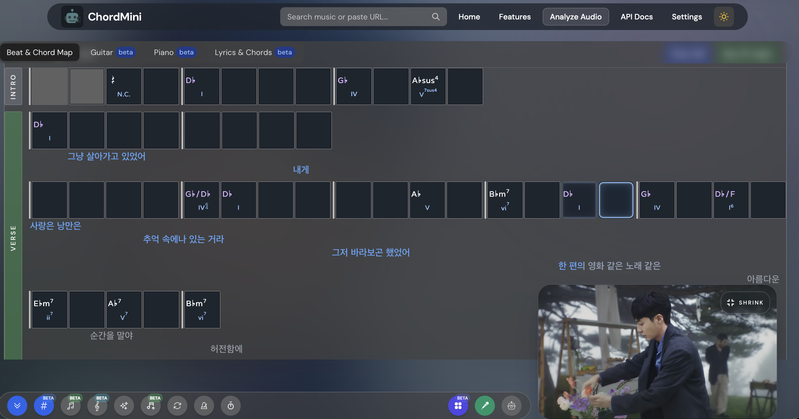
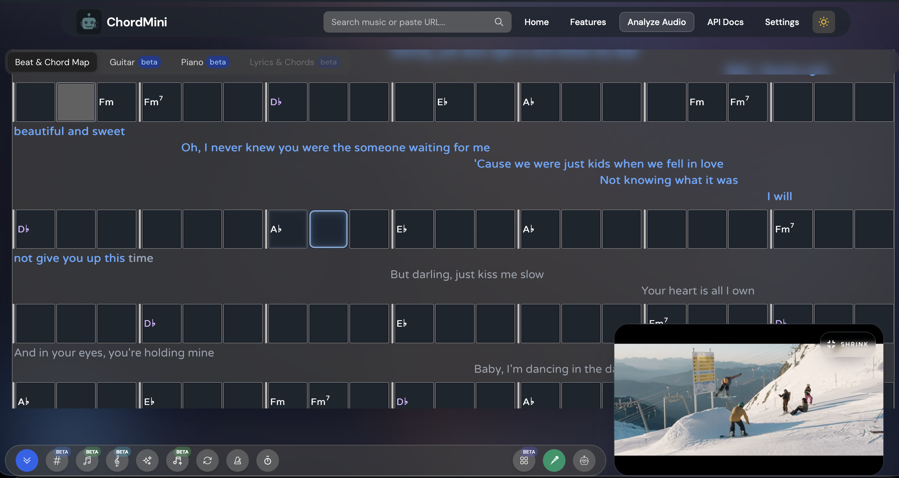
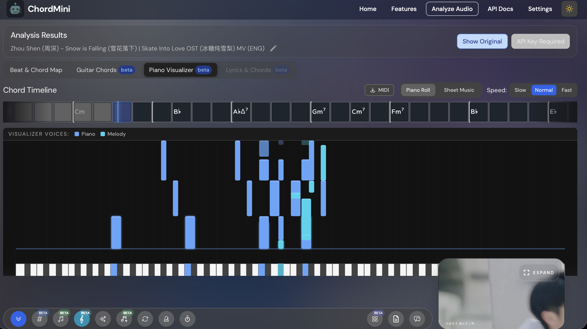
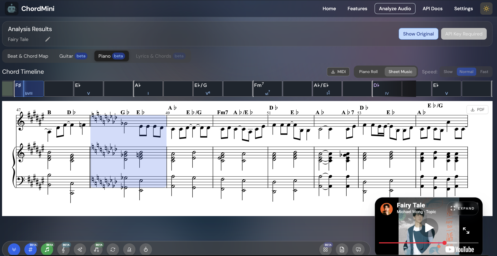

# ChordMini

Open-source music analysis tool for chord recognition, beat tracking, piano visualizer, guitar diagrams, lyrics synchronization, and experimental melody transcription.


## Features Overview

### 🏠 Homepage Interface


Clean, intuitive interface for YouTube search, URL input, and recent video access.

### 🎵 Beat & Chord Analysis




Chord progression visualization with synchronized beat detection and grid layout with add-on features: Roman Numeral Analysis, Key Modulation Signals, Simplified Chord Notation, Enhanced Chord Correction, and **song segmentation overlays** for structural sections like intro, verse, chorus, bridge, and outro.

### 🎵 Guitar Diagrams


Interactive guitar chord diagrams with **accurate fingering patterns** from the official @tombatossals/chords-db database, featuring multiple chord positions, synchronized beat grid integration, and exact slash-chord matching when the database includes a dedicated inversion shape.

### 🎹 Piano Visualizer 


Real-time piano roll visualization with falling MIDI notes synchronized to chord playback. Features a scrolling chord strip, interactive keyboard highlighting, smoother playback-synced rendering, segmentation-aware dynamics shaping, and **MIDI file export** for importing chord progressions into any DAW.

### 🎻 Experimental Melody Transcription



Sheet Sage can optionally add an estimated melodic line on top of the Piano Visualizer, with separate playback, caching, and MIDI export support. This feature is still experimental: inference is slower than the main beat/chord pipeline, and note timing or accuracy may be limited.

###  🎤 Lead Sheet with AI Assistant


Synchronized lyrics transcription with AI chatbot for contextual music analysis and translation support.

---

## 🚀 Quick Setup

### Prerequisites
- **Node.js 20.9+** and **npm 10+**
- **Python 3.10.x** (3.10.16 recommended for the backend)
- **Docker** (recommended for the standalone Sheet Sage melody service)
- **Git LFS** (for SongFormer checkpoints)
- **Firebase account** (free tier)
- **Gemini API** (free tier)

### Setup Steps

1. **Clone and install**
   Clone with submodules in one command (for fresh clones)
   ```bash
   git lfs install
   git clone --recursive https://github.com/ptnghia-j/ChordMiniApp.git
   cd ChordMiniApp
   git lfs pull
   npm install
   ```

   #### If you already cloned the repo before SongFormer was added
   ```bash
   git pull
   git lfs pull
   ```

#### Verify that `git lfs pull` completed
> [!NOTE]
> `git lfs pull` downloads the large SongFormer model files referenced by this repo, including the checkpoint binaries stored as Git LFS objects.

#### Verify that submodules are populated
```bash
ls -la python_backend/models/Beat-Transformer/
ls -la python_backend/models/Chord-CNN-LSTM/
ls -la python_backend/models/ChordMini/
```

> [!NOTE]
> If chord recognition encounters an issue with FluidSynth, install it for MIDI synthesis.
>
> ```bash
> # --- Windows ---
> choco install fluidsynth
>
> # --- macOS ---
> brew install fluidsynth
>
> # --- Linux (Debian/Ubuntu-based) ---
> sudo apt update
> sudo apt install fluidsynth
> ```

2. **Environment setup**
   ```bash
   cp .env.example .env.local
   ```

   Edit `.env.local`.

   Required for local frontend + main Python backend:
   ```bash
   PYTHON_API_URL=http://localhost:5001
   NEXT_PUBLIC_FIREBASE_API_KEY=your_firebase_api_key
   NEXT_PUBLIC_FIREBASE_AUTH_DOMAIN=your_project.firebaseapp.com
   NEXT_PUBLIC_FIREBASE_PROJECT_ID=your_project_id
   NEXT_PUBLIC_FIREBASE_STORAGE_BUCKET=your_project.appspot.com
   NEXT_PUBLIC_FIREBASE_MESSAGING_SENDER_ID=your_sender_id
   NEXT_PUBLIC_FIREBASE_APP_ID=your_app_id
   ```

   Optional feature backends and feature keys:
   ```bash
   LOCAL_SONGFORMER_API_URL=http://localhost:8080
   LOCAL_SHEETSAGE_API_URL=http://localhost:8082
   NEXT_PUBLIC_YOUTUBE_API_KEY=your_youtube_api_key
   MUSIC_AI_API_KEY=your_music_ai_key
   GEMINI_API_KEY=your_gemini_api_key
   GENIUS_API_KEY=your_genius_api_key
   ```
   `NEXT_PUBLIC_FIREBASE_MEASUREMENT_ID` is optional and only needed if you want Firebase Analytics.

> [!IMPORTANT]
> Native Windows backend installs are not currently reliable because `spleeter` and `madmom` still pull in conflicting or outdated dependencies. On Windows x86_64, prefer WSL2/Ubuntu for local development, or build the Docker images locally for `linux/amd64` instead of relying on the published Docker Hub tags.
> If you are not testing Beat-Transformer, you can skip installing `spleeter` for now. It is only required by the current Beat-Transformer source-separation path. A newer compatible source-separation package will be considered in a future update.

3. **Start Python backend** (Terminal 1)
   ```bash
   cd python_backend
   python -m venv myenv
   source myenv/bin/activate  # On Windows: myenv\Scripts\activate
   pip install --upgrade pip setuptools wheel
   pip install "Cython>=0.29.0" numpy==1.26.4
   pip install git+https://github.com/CPJKU/madmom
   pip install -r requirements.txt
   python app.py
   ```

   If `pip install -r requirements.txt` fails with `ResolutionImpossible` errors involving `spleeter`, `librosa`, `httpx`, or `llvmlite`, use WSL2/Ubuntu or Docker for the backend rather than continuing with a native Windows install.

   If you are not testing Beat-Transformer, you can skip `spleeter` during install:
   ```bash
   grep -v '^spleeter==' requirements.txt | grep -v '^typer==' > requirements_nospleeter.txt
   pip install --no-cache-dir -r requirements_nospleeter.txt
   ```
   Beat-Transformer testing requires `spleeter`.

   If you still need Beat-Transformer and want the more relaxed install chain used by the Dockerfile, install `spleeter` and `typer` after the main requirements with `--no-deps`:
   ```bash
   grep -v '^spleeter==' requirements.txt | grep -v '^typer==' > requirements_nospleeter.txt
   pip install --no-cache-dir -r requirements_nospleeter.txt
   pip install --no-cache-dir --no-deps typer==0.9.0
   pip install --no-cache-dir --no-deps spleeter==2.3.2
   ```

4. **Start frontend** (Terminal 2)
   ```bash
   npm run dev
   ```

5. **Optional: start the SongFormer segmentation backend** (Terminal 3)
   ```bash
   cd SongFormer
   docker build -t songformer-backend:local .
   docker run --rm -p 8080:8080 songformer-backend:local
   ```
   The app will use this service for song segmentation. For the standalone service setup, Python workflow, and deployment notes, see [SongFormer/README.md](SongFormer/README.md).

6. **Optional: start the experimental Sheet Sage melody backend** (Terminal 4)
   ```bash
   cd sheetsage
   docker build --platform=linux/amd64 -t sheetsage-backend:local .
   docker run --rm --platform=linux/amd64 -p 8082:8082 -v "$(pwd)/cache:/app/cache" sheetsage-backend:local
   ```
   For the standalone service image, Cloud Run deployment commands, and asset notes, see [sheetsage/README.md](sheetsage/README.md).

7. **Open application**

   Visit [http://localhost:3000](http://localhost:3000)

---

## 🐳 Docker Deployment (Recommended for Production)

### Prerequisites
- Docker and Docker Compose installed ([Get Docker](https://docs.docker.com/get-docker/))
- Firebase account with API keys configured

### Quick Start

1. **Download configuration files**
   ```bash
   curl -O https://raw.githubusercontent.com/ptnghia-j/ChordMiniApp/main/docker-compose.prod.yml
   curl -O https://raw.githubusercontent.com/ptnghia-j/ChordMiniApp/main/.env.docker.example
   ```

2. **Configure environment**
   ```bash
   cp .env.docker.example .env.docker
   # Edit .env.docker with your API keys (see API Keys Setup section below)
   ```

3. **Start the application**
   ```bash
   docker compose -f docker-compose.prod.yml --env-file .env.docker up -d
   ```

4. **Access the application**

   Visit [http://localhost:3000](http://localhost:3000)

5. **Stop the application**
   ```bash
   docker compose -f docker-compose.prod.yml down
   ```

> [!NOTE]
> If you have Docker Compose V1 installed, use `docker-compose` (with hyphen) instead of `docker compose` (with space).

> [!IMPORTANT]
> The currently pinned Docker Hub images in [docker-compose.prod.yml](docker-compose.prod.yml) (`ptnghia/chordmini-frontend:v0.5.3` and `ptnghia/chordmini-backend:v0.5.3`) are published as `linux/arm64` images. They will not pull on Windows/x86_64 or other `amd64` hosts. On Windows/x86_64, build local `linux/amd64` images instead:
>
> ```bash
> docker buildx build --platform linux/amd64 -f Dockerfile -t chordmini-frontend:local . --load
> docker buildx build --platform linux/amd64 -f python_backend/Dockerfile -t chordmini-backend:local python_backend --load
> ```
>
> Then update `docker-compose.prod.yml` to use `chordmini-frontend:local` and `chordmini-backend:local`.


### Docker Desktop GUI (Alternative)

If you prefer using Docker Desktop GUI:
1. Open Docker Desktop
2. Go to "Images" tab and search for `ptnghia/chordmini-frontend` and `ptnghia/chordmini-backend`
3. Pull both images
4. Use the "Containers" tab to manage running containers

### Required Environment Variables

Edit `.env.docker` with these required values:
- `NEXT_PUBLIC_FIREBASE_API_KEY` - Firebase API key
- `NEXT_PUBLIC_FIREBASE_PROJECT_ID` - Firebase project ID
- `NEXT_PUBLIC_FIREBASE_STORAGE_BUCKET` - Firebase storage bucket
- `NEXT_PUBLIC_YOUTUBE_API_KEY` - YouTube Data API v3 key
- `MUSIC_AI_API_KEY` - Music.AI API key
- `GEMINI_API_KEY` - Google Gemini API key
- `GENIUS_API_KEY` - Genius API key

See the API Keys Setup section below for detailed instructions on obtaining these keys.

---

## 📋 Detailed Setup Instructions

### Firebase Setup

1. **Create Firebase project**
   - Visit [Firebase Console](https://console.firebase.google.com/)
   - Click "Create a project"
   - Follow the setup wizard

2. **Enable Firestore Database**
   - Go to "Firestore Database" in the sidebar
   - Click "Create database"
   - Choose "Start in test mode" for development

3. **Get Firebase configuration**
   - Go to Project Settings (gear icon)
   - Scroll down to "Your apps"
   - Click "Add app" → Web app
   - Copy the configuration values to your `.env.local`

4. **Create Firestore collections**

   The app uses the following Firestore collections. They are created **automatically** on first write (no manual creation required):
   - `transcriptions` — Beat and chord analysis results (docId: `${videoId}_${beatModel}_${chordModel}`)
   - `translations` — Lyrics translation cache (docId: cacheKey based on content hash)
   - `lyrics` — Music.ai transcription results (docId: `videoId`)
   - `keyDetections` — Musical key analysis cache (docId: cacheKey)
   - `segmentationJobs` — Async SongFormer segmentation jobs and persisted results (docId: `seg_<timestamp>_<uuid>`)
   - `melody` — Experimental Sheet Sage melody transcription cache (docId: `videoId`)

5. **Enable Anonymous Authentication**
   - In Firebase Console: Authentication → Sign-in method → enable Anonymous

6. **Configure Firebase Storage**
   - Set environment variable: `NEXT_PUBLIC_FIREBASE_STORAGE_BUCKET=your_project_id.appspot.com`
   - Note: Cloud Storage for Firebase can be used without a paid plan in some setups, but Firebase states that projects using the default `*.appspot.com` bucket must upgrade to the Blaze plan by **February 2, 2026** to keep access to that default bucket.
   - Folder structure:
     - `audio/` for audio files
     - `video/` for optional video files
   - Filename pattern requirement: filenames must include the 11-character YouTube video ID in brackets, e.g. `audio_[VIDEOID]_timestamp.mp3` (enforced by Storage rules)
   - File size limits (enforced by Storage rules):
     - Audio: up to 50MB
     - Video: up to 100MB

7. **Enable Firebase temp storage for large uploads** (optional, recommended for production)
    - Add a temporary folder path in Firebase Storage: `temp/`.
    - Deploy `storage.rules` that allow temporary upload and cleanup for `temp/*`.
    - Keep the max upload size for temp files at 100MB.
    - Set server-side cleanup config:
       - `FIREBASE_SERVICE_ACCOUNT_KEY` (server-only JSON)
       - `FIREBASE_TEMP_CLEANUP_CRON` (default `0 */12 * * *`)
    - If upload fails with `storage/unauthorized` or HTTP 403, verify Anonymous Auth is enabled and rules are deployed to the same Firebase project used in `.env.local`.

> [!IMPORTANT]
> In local development, if Firebase Storage is unavailable, extracted YouTube audio falls back to the ignored local `temp/` folder. Those cached files are reused for the same YouTube `videoId` so yt-dlp does not need to run again, but the folder is not auto-cleaned and can grow large over time. Remove old files from `temp/` periodically if disk usage matters.

---

### API Keys Setup

#### Music.ai API (deprecated - MUSIC.ai no longer provide individual API key, only business plan)
```bash
# 1. Sign up at music.ai
# 2. Get API key from dashboard
# 3. Add to .env.local
NEXT_PUBLIC_MUSIC_AI_API_KEY=your_key_here
```

#### Google Gemini API
```bash
# 1. Visit Google AI Studio
# 2. Generate API key
# 3. Add to .env.local
NEXT_PUBLIC_GEMINI_API_KEY=your_key_here
```

---

## 🏗️ Backend Architecture

### 🔧 Local Development Backend (Required)

For local development, you **must** run the Python backend on `localhost:5001`:

- **URL**: `http://localhost:5001`
- **Port Note**: Uses port 5001 to avoid conflict with macOS AirPlay/AirTunes service on port 5000

### ☁️ Production Backend (your VPS)

Production deployments is configured based on your VPS and url should be set in the `NEXT_PUBLIC_PYTHON_API_URL` environment variable.

#### Prerequisites

- **Python 3.10.x** (3.10.16 recommended)
- **Virtual environment** (venv or conda)
- **Git** for cloning dependencies
- **System dependencies** (varies by OS)

#### Quick Setup

1. **Navigate to backend directory**
   ```bash
   cd python_backend
   ```

2. **Create virtual environment**
   ```bash
   python -m venv myenv

   # Activate virtual environment
   # On macOS/Linux:
   source myenv/bin/activate

   # On Windows:
   myenv\Scripts\activate
   ```

3. **Install dependencies**
   ```bash
   pip install --upgrade pip setuptools wheel
   pip install --no-cache-dir "Cython>=0.29.0" numpy==1.26.4
   pip install --no-cache-dir git+https://github.com/CPJKU/madmom
   pip install --no-cache-dir -r requirements.txt
   ```

   If you hit `ResolutionImpossible` errors involving `spleeter`, `librosa`, `httpx`, or `llvmlite`, the native install path is currently not considered reliable on Windows. Use WSL2/Ubuntu or Docker instead of continuing with a native Windows environment.

   If you are not testing Beat-Transformer, you can install without `spleeter`:
   ```bash
   grep -v '^spleeter==' requirements.txt | grep -v '^typer==' > requirements_nospleeter.txt
   pip install --no-cache-dir -r requirements_nospleeter.txt
   ```
   A newer compatible source-separation package will be considered in a future update.

4. **Start local backend on port 5001**
   ```bash
   python app.py
   ```

   The backend will start on `http://localhost:5001` and should display:
   ```
   Starting Flask app on port 5001
   App is ready to serve requests
   Note: Using port 5001 to avoid conflict with macOS AirPlay/AirTunes on port 5000
   ```

5. **Verify backend is running**

   Open a new terminal and test the backend:
   ```bash
   curl http://localhost:5001/health
   # Should return: {"status": "healthy"}
   ```

6. **Start frontend development server**
   ```bash
   # In the main project directory (new terminal)
   npm run dev
   ```

   The frontend will automatically connect to `http://localhost:5001` based on your `.env.local` configuration.

#### Backend Features Available Locally

- **Beat Detection**: Beat-Transformer and madmom models
- **Chord Recognition**: Chord-CNN-LSTM, BTC-SL, BTC-PL models
- **Audio Processing**: Support for MP3, WAV, FLAC formats

#### Environment Variables for Local Backend

Create a `.env` file in the `python_backend` directory:

```bash
# Optional: Redis URL for distributed rate limiting
REDIS_URL=redis://localhost:6379

# Optional: Genius API for lyrics
GENIUS_ACCESS_TOKEN=your_genius_token

# Flask configuration
FLASK_MAX_CONTENT_LENGTH_MB=150
CORS_ORIGINS=http://localhost:3000,http://127.0.0.1:3000
```

#### Troubleshooting Local Backend

**Backend connectivity issues:**
```bash
# 1. Verify backend is running
curl http://localhost:5001/health
# Expected: {"status": "healthy"}

# 2. Check if port 5001 is in use
lsof -i :5001  # macOS/Linux
netstat -ano | findstr :5001  # Windows

# 3. Verify environment configuration
cat .env.local | grep PYTHON_API_URL
# Expected: NEXT_PUBLIC_PYTHON_API_URL=http://localhost:5001

# 4. Check for macOS AirTunes conflict (if using port 5000)
curl -I http://localhost:5000/health
# If you see "Server: AirTunes", that's the conflict we're avoiding
```

**Frontend connection errors:**
```bash
# Check browser console for errors like:
# "Failed to fetch" or "Network Error"
# This usually means the backend is not running on port 5001

# Restart both frontend and backend:
# Terminal 1 (Backend):
cd python_backend && python app.py

# Terminal 2 (Frontend):
npm run dev
```

> [!IMPORTANT]
> ```bash
> # Ensure virtual environment is activated
> source myenv/bin/activate  # macOS/Linux
> myenv\Scripts\activate     # Windows
> # Reinstall dependencies
> pip install -r requirements.txt
> ```

<!-- ### Key Workflow Features

#### **Dual Input Support**
- **YouTube Integration**: URL/search → video selection → analysis
- **Direct Upload**: Audio file → Firebase offload temp storage → immediate analysis

#### **Environment-Aware Processing**
- **Development**: localhost:5001 Python backend with yt-dlp (avoiding macOS AirTunes port conflict)
- **Production**: Google Cloud Run backend with yt-mp3-go

#### **Caching after computation**
- **Firebase Cache**: audio metadata, lyrics, transcriptions, key detections, segmentation results

#### **ML Pipeline**
- **Parallel Processing**: Beat detection + chord recognition + key analysis
- **Multiple Models**: Beat-Transformer/madmom, Chord-CNN-LSTM/BTC variants
- **AI Integration**: Gemini AI for key detection and enharmonic corrections -->
---

### External APIs & Services
We sincerely thank the following APIs and services for their support and contribution to the project.
- **Madmom** - [github.com/CPJKU/madmom](https://github.com/CPJKU/madmom) - Beat detection and audio processing
- **ISMIR2019-Large-Vocabulary-Chord-Recognition** - [github.com/music-x-lab/ISMIR2019-Large-Vocabulary-Chord-Recognition](https://github.com/music-x-lab/ISMIR2019-Large-Vocabulary-Chord-Recognition) - Chord-CNN-LSTM model for chord recognition
- **Google Gemini API** - AI language model for roman numeral analysis, enharmonic corrections, and lyrics translation
- **YouTube Search API** - [github.com/damonwonghv/youtube-search-api](https://github.com/damonwonghv/youtube-search-api) - YouTube search and video information
- **yt-dlp** - [github.com/yt-dlp/yt-dlp](https://github.com/yt-dlp/yt-dlp) - YouTube audio extraction (local)
- **yt-mp3-go** - [github.com/vukan322/yt-mp3-go](https://github.com/vukan322/yt-mp3-go) - Alternative audio extraction (production)
- **LRClib** - [github.com/tranxuanthang/lrclib](https://github.com/tranxuanthang/lrclib) - Lyrics synchronization
- **Sheetsage** -[github.com/chrisdonahue/sheetsage](https://github.com/chrisdonahue/sheetsage) - Experimental melody transcription model
- **OpenSheetMusicDisplay** -[github.com/opensheetmusicdisplay](https://github.com/opensheetmusicdisplay/opensheetmusicdisplay) - Sheet music rendering
- **Music.ai SDK** - AI-powered music transcription 

<!-- 
## 🚀 Deployment Options

### Docker Deployment (Recommended for Production)

ChordMiniApp provides production-ready Docker images for easy deployment:

```bash
# Production deployment with Docker Compose
curl -O https://raw.githubusercontent.com/ptnghia-j/ChordMiniApp/main/docker-compose.prod.yml
docker compose -f docker-compose.prod.yml up -d
```

**Available on multiple registries:**
- **Docker Hub**: `ptnghia/chordmini-frontend:latest`, `ptnghia/chordmini-backend:latest`
- **GitHub Container Registry**: `ghcr.io/ptnghia-j/chordminiapp/frontend:latest`

**Deployment targets:**
- **Cloud platforms**: AWS, GCP, Azure, DigitalOcean
- **Container orchestration**: Kubernetes, Docker Swarm
- **Edge computing**: Raspberry Pi 4+ (ARM64 support)

### Traditional Deployment

For custom deployments, see the [Local Setup](#-quick-setup) section above. -->


## 🤝 Contributing

We welcome contributions! Please see our [Contributing Guidelines](CONTRIBUTING.md) for details.

