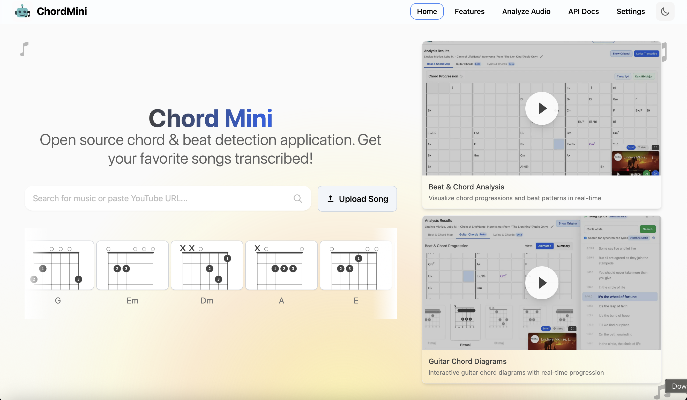
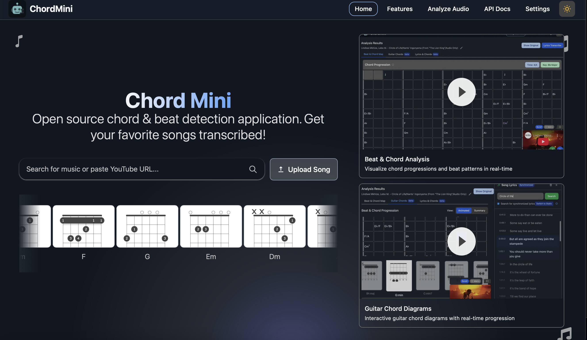
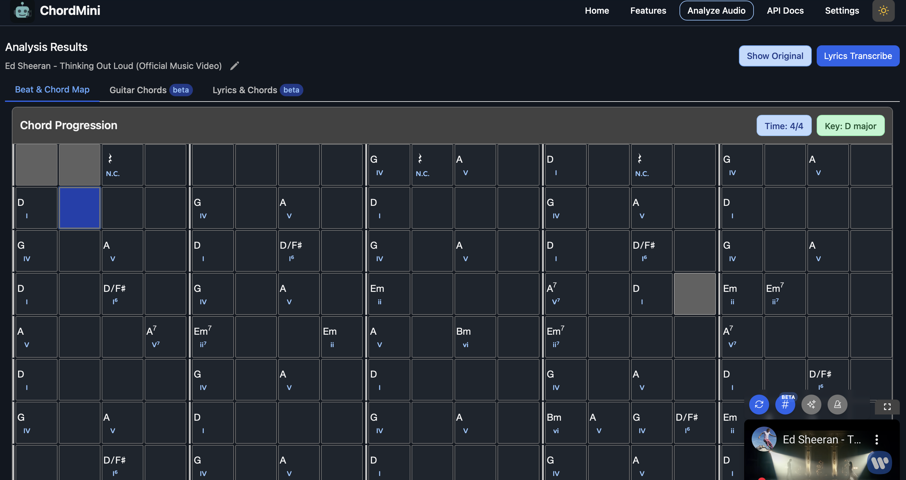
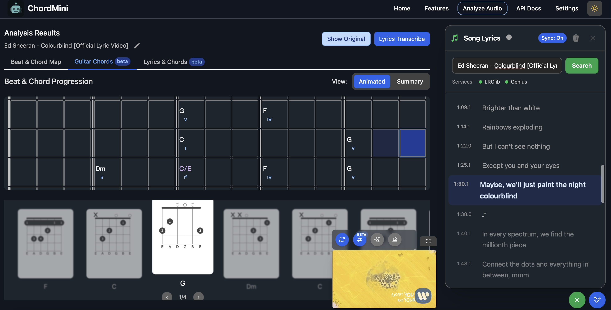

# ChordMini

**Advanced music analysis platform with AI-powered chord recognition, beat detection, and synchronized lyrics.**

## Features Overview

### 🏠 Homepage Interface



Clean, intuitive interface for YouTube search, URL input, and recent video access.

### 🎵 Beat & Chord Analysis



Real-time chord progression visualization with synchronized beat detection and grid layout.

### 🎵 Guitar Diagrams



Interactive guitar chord diagrams synchronized with the beat chord grid.

### 🎤 Lead Sheet with AI Assistant


Synchronized lyrics transcription with AI chatbot for contextual music analysis and translation support.

## 🚀 Quick Setup

### Prerequisites
- **Node.js 18+** and **npm**
- **Python 3.9+** (for backend)
- **Firebase account** (free tier)

### Setup Steps

1. **Clone and install**
   ```bash
   git clone https://github.com/ptnghia-j/ChordMiniApp.git
   cd ChordMiniApp
   npm install
   ```

2. **Environment setup**
   ```bash
   cp .env.example .env.local
   ```

   Edit `.env.local`:
   ```bash
   NEXT_PUBLIC_PYTHON_API_URL=http://localhost:5001
   NEXT_PUBLIC_FIREBASE_API_KEY=your_firebase_api_key
   NEXT_PUBLIC_FIREBASE_AUTH_DOMAIN=your_project.firebaseapp.com
   NEXT_PUBLIC_FIREBASE_PROJECT_ID=your_project_id
   NEXT_PUBLIC_FIREBASE_STORAGE_BUCKET=your_project.appspot.com
   NEXT_PUBLIC_FIREBASE_MESSAGING_SENDER_ID=your_sender_id
   NEXT_PUBLIC_FIREBASE_APP_ID=your_app_id
   ```

3. **Start Python backend** (Terminal 1)
   ```bash
   cd python_backend
   python -m venv myenv
   source myenv/bin/activate  # On Windows: myenv\Scripts\activate
   pip install -r requirements.txt
   python app.py
   ```

4. **Start frontend** (Terminal 2)
   ```bash
   npm run dev
   ```

5. **Open application**

   Visit [http://localhost:3000](http://localhost:3000)

### Firebase Setup (Required)

1. **Create Firebase project**
   - Visit [Firebase Console](https://console.firebase.google.com/)
   - Click "Create a project"
   - Follow the setup wizard

2. **Enable Firestore Database**
   - Go to "Firestore Database" in the sidebar
   - Click "Create database"
   - Choose "Start in test mode" for development

3. **Get Firebase configuration**
   - Go to Project Settings (gear icon)
   - Scroll down to "Your apps"
   - Click "Add app" → Web app
   - Copy the configuration values to your `.env.local`

4. **Create Firestore collections**

   The app will automatically create these collections:
   - `cached-videos` - Processed video data
   - `cached-lyrics` - Transcribed lyrics
   - `cached-translations` - Translated content

### API Keys Setup

#### YouTube Data API v3 (Optional)
```bash
# 1. Go to Google Cloud Console
# 2. Create/select project
# 3. Enable YouTube Data API v3
# 4. Create credentials (API key)
# 5. Add to .env.local
NEXT_PUBLIC_YOUTUBE_API_KEY=your_key_here
```

#### Music.ai API
```bash
# 1. Sign up at music.ai
# 2. Get API key from dashboard
# 3. Add to .env.local
NEXT_PUBLIC_MUSIC_AI_API_KEY=your_key_here
```

#### Google Gemini API
```bash
# 1. Visit Google AI Studio
# 2. Generate API key
# 3. Add to .env.local
NEXT_PUBLIC_GEMINI_API_KEY=your_key_here
```

## 🏗️ Backend Architecture

ChordMiniApp uses a **hybrid backend architecture**:

### 🔧 Local Development Backend (Required)

For local development, you **must** run the Python backend on `localhost:5001`:

- **URL**: `http://localhost:5001`
- **Purpose**: Local development and testing
- **Setup**: Required for local development (see setup instructions below)
- **Port Note**: Uses port 5001 to avoid conflict with macOS AirPlay/AirTunes service on port 5000

### ☁️ Production Backend (your VPS)

Production deployments is configured based on your VPS and url should be set in the `NEXT_PUBLIC_PYTHON_API_URL` environment variable.

#### Prerequisites

- **Python 3.9+** (Python 3.9-3.11 recommended)
- **Virtual environment** (venv or conda)
- **Git** for cloning dependencies
- **System dependencies** (varies by OS)

#### Quick Setup

1. **Navigate to backend directory**
   ```bash
   cd python_backend
   ```

2. **Create virtual environment**
   ```bash
   python -m venv myenv

   # Activate virtual environment
   # On macOS/Linux:
   source myenv/bin/activate

   # On Windows:
   myenv\Scripts\activate
   ```

3. **Install dependencies**
   ```bash
   pip install -r requirements.txt
   ```

4. **Start local backend on port 5001**
   ```bash
   python app.py
   ```

   The backend will start on `http://localhost:5001` and should display:
   ```
   Starting Flask app on port 5001
   App is ready to serve requests
   Note: Using port 5001 to avoid conflict with macOS AirPlay/AirTunes on port 5000
   ```

5. **Verify backend is running**

   Open a new terminal and test the backend:
   ```bash
   curl http://localhost:5001/health
   # Should return: {"status": "healthy"}
   ```

6. **Start frontend development server**
   ```bash
   # In the main project directory (new terminal)
   npm run dev
   ```

   The frontend will automatically connect to `http://localhost:5001` based on your `.env.local` configuration.

#### Backend Features Available Locally

- **Beat Detection**: Beat-Transformer and madmom models
- **Chord Recognition**: Chord-CNN-LSTM, BTC-SL, BTC-PL models
- **Lyrics Processing**: Genius.com integration
- **Rate Limiting**: IP-based rate limiting with Flask-Limiter
- **Audio Processing**: Support for MP3, WAV, FLAC formats

#### Environment Variables for Local Backend

Create a `.env` file in the `python_backend` directory:

```bash
# Optional: Redis URL for distributed rate limiting
REDIS_URL=redis://localhost:6379

# Optional: Genius API for lyrics
GENIUS_ACCESS_TOKEN=your_genius_token

# Flask configuration
FLASK_MAX_CONTENT_LENGTH_MB=150
CORS_ORIGINS=http://localhost:3000,http://127.0.0.1:3000
```

#### macOS AirTunes Port Conflict

**Important for macOS users**: Port 5000 is used by Apple's AirPlay/AirTunes service, which can cause conflicts with local development. This is why ChordMiniApp uses port 5001 for the Python backend.

**Symptoms of port conflict:**
- 403 Forbidden errors when connecting to backend
- Response headers showing `Server: AirTunes/xxx.x.x`
- Backend appears unreachable despite being started

**Solution:**
- Always use port 5001 for local development (default in current setup)
- If you need to use a different port, update both the Python backend and `NEXT_PUBLIC_PYTHON_API_URL`

#### Troubleshooting Local Backend

**Backend connectivity issues:**
```bash
# 1. Verify backend is running
curl http://localhost:5001/health
# Expected: {"status": "healthy"}

# 2. Check if port 5001 is in use
lsof -i :5001  # macOS/Linux
netstat -ano | findstr :5001  # Windows

# 3. Verify environment configuration
cat .env.local | grep PYTHON_API_URL
# Expected: NEXT_PUBLIC_PYTHON_API_URL=http://localhost:5001

# 4. Check for macOS AirTunes conflict (if using port 5000)
curl -I http://localhost:5000/health
# If you see "Server: AirTunes", that's the conflict we're avoiding
```

**Frontend connection errors:**
```bash
# Check browser console for errors like:
# "Failed to fetch" or "Network Error"
# This usually means the backend is not running on port 5001

# Restart both frontend and backend:
# Terminal 1 (Backend):
cd python_backend && python app.py

# Terminal 2 (Frontend):
npm run dev
```

**Import errors:**
```bash
# Ensure virtual environment is activated
source myenv/bin/activate  # macOS/Linux
myenv\Scripts\activate     # Windows

# Reinstall dependencies
pip install -r requirements.txt
```

## 🏗️ Complete Application Flow

ChordMini provides a comprehensive music analysis workflow from user input to visualization. This diagram shows the complete user journey and data processing pipeline:


### Key Workflow Features

#### **Dual Input Support**
- **YouTube Integration**: URL/search → video selection → analysis
- **Direct Upload**: Audio file → blob storage → immediate analysis

#### **Environment-Aware Processing**
- **Development**: localhost:5001 Python backend with yt-dlp (avoiding macOS AirTunes port conflict)
- **Production**: Google Cloud Run backend with yt-mp3-go

#### **Intelligent Caching**
- **Firebase Cache**: Analysis results with enhanced metadata
- **Cache Hit**: Instant loading of previous analyses
- **Cache Miss**: Full ML processing pipeline

#### **Advanced ML Pipeline**
- **Parallel Processing**: Beat detection + chord recognition + key analysis
- **Multiple Models**: Beat-Transformer/madmom, Chord-CNN-LSTM/BTC variants
- **AI Integration**: Gemini AI for key detection and enharmonic corrections

#### **Rich Visualization**
- **Beat & Chord Map**: Interactive grid with synchronized playback
- **Guitar Chords [Beta]**: Responsive chord diagrams (7/5/3/2/1 layouts)
- **Lyrics & Chords [Beta]**: Multi-language transcription with word-level sync

## 🛠️ Tech Stack

### Frontend Framework
- **Next.js 15.3.1** - React framework with App Router
- **React 19** - UI library with latest features
- **TypeScript** - Type-safe development
- **Tailwind CSS** - Utility-first styling

### UI Components & Visualization
- **Framer Motion** - Smooth animations and transitions
- **Chart.js** - Data visualization for audio analysis
- **@tombatossals/react-chords** - Guitar chord diagram visualization
- **React Player** - Video playback integration

### Backend & ML
- **Python Flask** - Lightweight backend framework
- **Google Cloud Run** - Serverless container deployment
- **Custom ML Models** - Chord recognition and beat detection

### Database & Storage
- **Firebase Firestore** - NoSQL database for caching
- **Vercel Blob** - File storage for audio processing

### External APIs & Services
- **YouTube Search API** - [github.com/damonwonghv/youtube-search-api](https://github.com/damonwonghv/youtube-search-api)
- **yt-dlp** - [github.com/yt-dlp/yt-dlp](https://github.com/yt-dlp/yt-dlp) - YouTube audio extraction
- **yt-mp3-go** - [github.com/vukan322/yt-mp3-go](https://github.com/vukan322/yt-mp3-go) - Alternative audio extraction
- **LRClib** - [github.com/tranxuanthang/lrclib](https://github.com/tranxuanthang/lrclib) - Lyrics synchronization
- **Music.ai SDK** - AI-powered music transcription
- **Google Gemini API** - AI language model for translations

### Development Tools
- **ESLint** - Code linting and formatting
- **Jest** - Testing framework
- **Bundle Analyzer** - Performance optimization

## 📱 Features

### Core Analysis
- **Beat Detection** - Automatic tempo and beat tracking
- **Chord Recognition** - AI-powered chord progression analysis
- **Key Detection** - Musical key identification with Gemini AI

### Guitar Features [Beta]
- **Interactive Chord Diagrams** - Visual guitar fingering patterns
- **Responsive Design** - Adaptive chord count (7/5/3/2/1 for xl/lg/md/sm/xs)
- **Smooth Animations** - 500ms transitions with optimized scaling
- **Unicode Notation** - Proper musical symbols (♯, ♭)

### Lyrics & Transcription [Beta]
- **Synchronized Lyrics** - Time-aligned lyrics display
- **Multi-language Support** - Translation with Gemini AI
- **Word-level Timing** - Precise synchronization with Music.ai

### User Experience
- **Dark/Light Mode** - Automatic theme switching
- **Responsive Design** - Mobile-first approach
- **Performance Optimized** - Lazy loading and code splitting
- **Offline Support** - Service worker for caching

## 🤝 Contributing

We welcome contributions! Please see our [Contributing Guidelines](CONTRIBUTING.md) for details.

