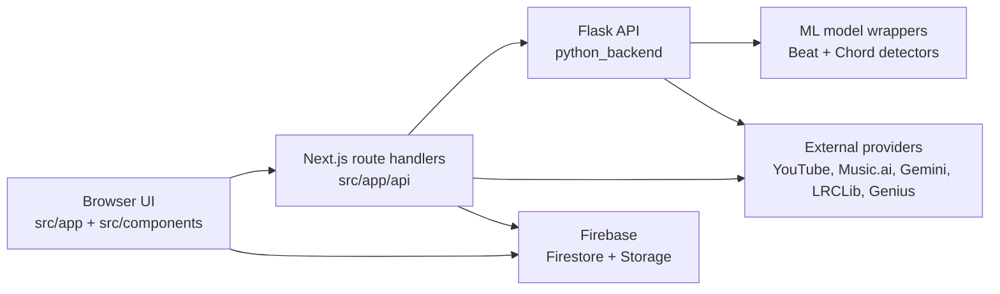

# ChordMiniApp documentation

This directory is the source-of-truth documentation set for the current application.

## What this project is

ChordMiniApp is a music-analysis web application with three runtime layers:

- **Next.js frontend** in `src/`
- **Next.js route handlers / BFF layer** in `src/app/api/`
- **Flask ML backend** in `python_backend/`

It also depends on **Firebase** for caching and persistence, and on several external services for search, transcription, translation, and AI-assisted analysis.

## Recommended reading order for new developers

1. [`architecture/system-overview.md`](./architecture/system-overview.md)
2. [`architecture/runtime-and-deployment.md`](./architecture/runtime-and-deployment.md)
3. [`development/onboarding.md`](./development/onboarding.md)
4. [`components/frontend-surfaces.md`](./components/frontend-surfaces.md)
5. [`components/state-hooks-and-services.md`](./components/state-hooks-and-services.md)
6. [`api/nextjs-route-handlers.md`](./api/nextjs-route-handlers.md)
7. [`api/flask-backend.md`](./api/flask-backend.md)
8. [`models/ml-models-and-persistence.md`](./models/ml-models-and-persistence.md)
9. [`workflows/core-workflows.md`](./workflows/core-workflows.md)
10. [`development/testing-strategy.md`](./development/testing-strategy.md)

## Folder map

| Folder | Purpose |
| --- | --- |
| [`architecture/`](./architecture/) | High-level system design, runtime boundaries, deployment model |
| [`components/`](./components/) | Frontend UI surfaces, state, hooks, and service-layer organization |
| [`api/`](./api/) | Next.js BFF routes, Flask routes, and third-party integrations |
| [`models/`](./models/) | Beat/chord model inventory, checkpoint locations, Firebase collections |
| [`workflows/`](./workflows/) | End-to-end user and data flows |
| [`development/`](./development/) | Local setup, onboarding, debugging, and testing guidance |
| [`dependencies/`](./dependencies/) | Runtime dependency map and why the stack looks the way it does |

## Current source layout

| Area | Path | Notes |
| --- | --- | --- |
| App Router pages | `src/app/` | UI entry points such as the analyze page and search experience |
| Analysis UI | `src/components/analysis/` | Controls, banners, timelines, and layout helpers |
| Chord/lyrics UI | `src/components/chord-analysis/`, `src/components/lyrics/`, `src/components/piano-visualizer/` | Main analysis experience |
| Frontend state | `src/contexts/`, `src/stores/`, `src/hooks/` | Context providers, Zustand stores, and orchestration hooks |
| Frontend services | `src/services/` | Firebase, API clients, audio processing, lyrics, chatbot, storage |
| BFF routes | `src/app/api/` | Server-side entry points used by the browser |
| Flask application | `python_backend/` | ML endpoints, service wrappers, validators, runtime config |
| Model assets | `python_backend/models/` | Beat-Transformer, Chord-CNN-LSTM, ChordMini/BTC assets |

## Architecture snapshot

## Important architectural facts

- The **browser does not talk directly to the Python ML backend for most flows**. The browser usually calls Next.js route handlers first.
- The Next.js API layer acts as a **backend-for-frontend (BFF)** for timeout handling, blob uploads, API-key mediation, and fallback logic.
- The Flask backend currently owns the **beat detection**, **chord recognition**, **lyrics provider** endpoints, **health/docs/debug** endpoints, and detector/model information.
- **YouTube search and audio extraction are currently handled on the Next.js side**, not by a registered Flask blueprint in the current repository state.
- Firebase is used mostly as a **cache/persistence layer**, not as the primary orchestration layer.

## Legacy note

There are older documentation folders in `docs/` that predate this rewrite. Treat the files linked from this `README.md` as the maintained set.
